<!-- [KFM_META_BLOCK_V2]
doc_id: kfm://doc/docs-domains-flora-readme
title: Kansas Frontier Matrix — Flora Domain
type: standard
version: v1
status: draft
owners: TODO (flora domain steward + governance steward)
created: 2026-05-16
updated: 2026-05-16
policy_label: public
related:
  - docs/doctrine/directory-rules.md
  - docs/doctrine/lifecycle-law.md
  - docs/doctrine/trust-membrane.md
  - docs/domains/README.md
  - docs/domains/habitat/README.md
  - docs/domains/fauna/README.md
tags: [kfm, domain, flora, biodiversity, governance]
notes:
  - "All implementation, schema, route, and registry claims are PROPOSED until verified against a mounted repo."
  - "Sensitivity posture is fail-closed for exact rare-plant geometry by default."
[/KFM_META_BLOCK_V2] -->

# 🌿 Kansas Frontier Matrix — Flora Domain

> Govern plant taxonomic identity, occurrences, specimens, vegetation communities, rare/protected/culturally sensitive flora controls, public-safe surfaces, evidence-backed maps, correction, and rollback for Kansas plant life.

[](#scope)
[](#status)
[](#7-pipeline-shape-raw--published)
[](#9-sensitivity-rights--publication-posture)
[](#11-governed-ai-behavior)
[](TODO)
[](TODO)

**Status:** `draft` · **Owners:** _TODO — flora domain steward; governance steward_ · **Last updated:** 2026-05-16

> [!IMPORTANT]
> All paths, schemas, registries, validators, routes, and CI/workflow references in this document are **PROPOSED** until verified against a mounted KFM repository. This README states doctrine confidently where supported by attached project sources; it does **not** assert current implementation maturity. See [§13 Verification Backlog](#13-verification-backlog--open-questions).

---

## 📑 Mini Table of Contents

1. [Scope](#1-scope)
2. [Repository Fit](#2-repository-fit)
3. [Accepted Inputs](#3-accepted-inputs)
4. [Exclusions](#4-exclusions)
5. [Directory Tree (PROPOSED)](#5-directory-tree-proposed)
6. [Domain Diagram](#6-domain-diagram)
7. [Pipeline Shape (RAW → PUBLISHED)](#7-pipeline-shape-raw--published)
8. [Ubiquitous Language, Source Families, Object Families](#8-ubiquitous-language-source-families-object-families)
9. [Sensitivity, Rights & Publication Posture](#9-sensitivity-rights--publication-posture)
10. [Map & Viewing Products](#10-map--viewing-products)
11. [Governed AI Behavior](#11-governed-ai-behavior)
12. [Validators, Tests & Thin-Slice Plan](#12-validators-tests--thin-slice-plan)
13. [Verification Backlog & Open Questions](#13-verification-backlog--open-questions)
14. [FAQ](#14-faq)
15. [Related Docs](#15-related-docs)
16. [Appendix](#16-appendix)

---

## 1. Scope

**CONFIRMED doctrine / PROPOSED implementation.** The Flora lane governs plant taxonomic identity, flora occurrence and specimen evidence, rare-plant and protected-species controls, invasive plants, phenology, restoration plantings, vegetation surfaces, range and distribution products, habitat associations, and public-safe botanical outputs — anchored to the KFM trust spine (SourceDescriptor → EvidenceBundle → ValidationReport → ReleaseManifest → RollbackCard).

Flora is a **proof-bearing thin slice**, not horizontal coverage: a single common-species occurrence joined to a vegetation-community polygon, backed by a resolvable EvidenceBundle and a public-safe map, is the first credible deliverable.

- **One-line purpose.** Evidence-first botanical truth for Kansas, with deny-by-default protection for sensitive plant locations.
- **Doctrinal posture.** Cite-or-abstain; deterministic identity; promotion as a governed state transition; auditable provenance, receipts, and rollback targets.
- **Sensitivity posture.** Rare, protected, culturally sensitive, and steward-reviewed flora default to generalized, withheld, staged, or denied public geometry.

> [!NOTE]
> Flora is one of the domain lanes named explicitly in **Directory Rules §12 (Domain Placement Law)**. The lane appears as a `flora/` **segment** inside each owning responsibility root — it is **not** a root folder.

[⬆ Back to top](#-mini-table-of-contents)

---

## 2. Repository Fit

The Flora domain follows the **lane pattern** prescribed by Directory Rules §12. The domain segment appears under each responsibility root that owns a piece of its responsibility; flora never collapses into a single mega-folder.

| Responsibility | Owning root | Domain segment (PROPOSED) |
|---|---|---|
| Human-facing explanation | `docs/` | `docs/domains/flora/` |
| Object meaning (semantic) | `contracts/` | `contracts/domains/flora/` |
| Machine shape | `schemas/` | `schemas/contracts/v1/domains/flora/` |
| Admissibility (allow/deny/restrict/abstain) | `policy/` | `policy/domains/flora/` |
| Proofs | `tests/` | `tests/domains/flora/` |
| Golden/valid/invalid samples | `fixtures/` | `fixtures/domains/flora/` |
| Shared library code | `packages/` | `packages/domains/flora/` |
| Executable pipeline logic | `pipelines/` | `pipelines/domains/flora/` |
| Declarative pipeline configuration | `pipeline_specs/` | `pipeline_specs/flora/` |
| Lifecycle data | `data/` | `data/<phase>/flora/`, `data/catalog/domain/flora/`, `data/published/layers/flora/`, `data/registry/sources/flora/` |
| Release decisions | `release/` | `release/candidates/flora/` |

> [!WARNING]
> Per Directory Rules §13.4, a flora subtree at repo root (e.g. `flora/data/`, `flora/schemas/`, `flora/policy/`) is an **anti-pattern**. Files belong under their **responsibility root**, with `flora/` as a domain segment. Cross-domain content (e.g. a habitat × flora × fauna validator) goes under the lowest common responsibility root **without** a domain segment.

### Upstream and downstream

- **Upstream of Flora (governing doctrine):** `docs/doctrine/` (authority ladder, truth posture, trust membrane, lifecycle law, directory rules) and `docs/adr/` (notably ADR-0001 on schema home).
- **Downstream of Flora:** `apps/governed-api/` (the canonical public trust path), `apps/explorer-web/` (map shell), `packages/maplibre/` (renderer), and any `data/published/layers/flora/` artifacts served via `LayerManifest`.

[⬆ Back to top](#-mini-table-of-contents)

---

## 3. Accepted Inputs

Files and content that **belong** somewhere under the Flora lane:

- Flora-specific source descriptors (`data/registry/sources/flora/…`) — `PROPOSED`.
- Domain object semantics (`contracts/domains/flora/<object>.md`) — `PROPOSED`.
- Domain object schemas (`schemas/contracts/v1/domains/flora/<object>.schema.json`) — `PROPOSED` per ADR-0001.
- Flora-scoped policy bundles, sensitivity rules, rights checks (`policy/domains/flora/…`) — `PROPOSED`.
- Domain pipelines, normalizers, taxonomy reconcilers (`pipelines/domains/flora/…`) — `PROPOSED`.
- Domain pipeline specifications (`pipeline_specs/flora/…`) — `PROPOSED`.
- Flora-scoped tests, fixtures, and no-network fixture packs (`tests/domains/flora/…`, `fixtures/domains/flora/…`) — `PROPOSED`.
- Domain lifecycle artifacts under `data/<phase>/flora/…` — `PROPOSED`.
- Released flora layers and catalog projections (`data/published/layers/flora/…`, `data/catalog/domain/flora/…`) — `PROPOSED`.
- Release candidates and decisions (`release/candidates/flora/…`) — `PROPOSED`.
- Flora-specific documentation (`docs/domains/flora/*.md`) — this README is one such file.

[⬆ Back to top](#-mini-table-of-contents)

---

## 4. Exclusions

Content that **does not** belong under Flora, with redirects.

| Topic | Owner | Redirect |
|---|---|---|
| Habitat patches, suitability surfaces, habitat models | **Habitat** | `docs/domains/habitat/` and downstream lanes |
| Animal taxa, fauna occurrences, fauna ranges, sensitive faunal sites | **Fauna** | `docs/domains/fauna/` |
| Soil map units, horizons, soil-property surfaces | **Soil** | `docs/domains/soil/` |
| Water observations, hydrography, flood context | **Hydrology** | `docs/domains/hydrology/` |
| Crop observations, fields, rotation, yield, irrigation, agricultural economy | **Agriculture** | `docs/domains/agriculture/` |
| Hazard events, fire/flood/drought records as hazards | **Hazards** | `docs/domains/hazards/` |
| Roads, rail, trade routes | **Roads, Rail, and Trade** | `docs/domains/roads-rail-trade/` |
| Settlements, infrastructure, municipal records | **Settlements & Infrastructure** | `docs/domains/settlements-infrastructure/` |
| Archaeological sites, cultural heritage | **Archaeology** | `docs/domains/archaeology/` |
| Living-person, DNA, land-ownership records | **People, DNA, Land** | `docs/domains/people-dna-land/` |
| Cross-domain schemas, validators, or doctrine | **Lowest common responsibility root** | e.g. `tools/validators/<topic>/`, `schemas/contracts/v1/<topic>/`, `docs/architecture/<topic>.md` — no domain segment |

> [!CAUTION]
> Flora may **reference** habitat, fauna, soil/hydrology, agriculture, and hazards through governed joins, but it **does not own** their object families. A join that imports another domain's truth into a Flora artifact must preserve ownership, source role, sensitivity, and EvidenceBundle support. See [§8 cross-lane relations](#cross-lane-relations).

[⬆ Back to top](#-mini-table-of-contents)

---

## 5. Directory Tree (PROPOSED)

The following tree is derived from Directory Rules §12 and the domain-lane pattern. Paths are **PROPOSED** and **NEEDS VERIFICATION** against a mounted repo; nothing here implies current implementation.

```text
# docs/ — human-facing
docs/domains/flora/
├── README.md                    # this file
├── object-families.md           # PROPOSED
├── source-families.md           # PROPOSED
├── sensitivity-posture.md       # PROPOSED
├── thin-slice-plan.md           # PROPOSED
└── governed-ai-behavior.md      # PROPOSED

# contracts/ — semantic meaning
contracts/domains/flora/
├── plant-taxon.md               # PROPOSED
├── flora-taxon-crosswalk.md     # PROPOSED
├── flora-occurrence.md          # PROPOSED
├── specimen-record.md           # PROPOSED
├── rare-plant-record.md         # PROPOSED
├── vegetation-community.md      # PROPOSED
├── invasive-plant-record.md     # PROPOSED
├── phenology-observation.md     # PROPOSED
├── range-polygon.md             # PROPOSED
├── distribution-surface.md      # PROPOSED
├── habitat-association.md       # PROPOSED
├── botanical-survey.md          # PROPOSED
├── restoration-planting.md      # PROPOSED
└── redaction-receipt.md         # PROPOSED (or under contracts/governance/)

# schemas/ — machine shape (ADR-0001 default home)
schemas/contracts/v1/domains/flora/
├── plant-taxon.schema.json                # PROPOSED
├── flora-taxon-crosswalk.schema.json      # PROPOSED
├── flora-occurrence.schema.json           # PROPOSED
├── specimen-record.schema.json            # PROPOSED
├── rare-plant-record.schema.json          # PROPOSED
├── vegetation-community.schema.json       # PROPOSED
├── invasive-plant-record.schema.json      # PROPOSED
├── phenology-observation.schema.json      # PROPOSED
├── range-polygon.schema.json              # PROPOSED
├── distribution-surface.schema.json       # PROPOSED
├── habitat-association.schema.json        # PROPOSED
├── botanical-survey.schema.json           # PROPOSED
└── restoration-planting.schema.json       # PROPOSED

# policy/ — admissibility, sensitivity, rights
policy/domains/flora/
├── rights/                                # PROPOSED
├── sensitivity/                           # PROPOSED — rare-plant, culturally sensitive
├── geoprivacy/                            # PROPOSED — generalize/suppress/withhold/steward-only
└── promotion/                             # PROPOSED

# tests/, fixtures/ — proofs and golden samples
tests/domains/flora/                       # PROPOSED
fixtures/domains/flora/                    # PROPOSED — no-network fixtures only

# packages/, pipelines/, pipeline_specs/ — code and orchestration
packages/domains/flora/                    # PROPOSED
pipelines/domains/flora/                   # PROPOSED
pipeline_specs/flora/                      # PROPOSED

# data/ — lifecycle (RAW → PUBLISHED)
data/raw/flora/                            # PROPOSED
data/work/flora/                           # PROPOSED
data/quarantine/flora/                     # PROPOSED
data/processed/flora/                      # PROPOSED
data/catalog/domain/flora/                 # PROPOSED
data/published/layers/flora/               # PROPOSED — public-safe only
data/registry/sources/flora/               # PROPOSED — SourceDescriptor entries

# release/ — release decisions distinct from published artifacts
release/candidates/flora/                  # PROPOSED
```

> [!NOTE]
> Receipts, proofs, registry, and rollback artifacts are emitted **alongside** lifecycle directories per Directory Rules §3 — they do not replace lifecycle phases. `data/receipts/flora/…`, `data/proofs/flora/…`, and `data/rollback/flora/…` are `PROPOSED` sibling homes whose exact placement awaits ADR confirmation.

[⬆ Back to top](#-mini-table-of-contents)

---

## 6. Domain Diagram

The diagram below shows the Flora lane's relationship to the trust spine, the lifecycle phases, and adjacent domains. It is a **conceptual** diagram; runtime paths, routes, and module names are `PROPOSED`.

```mermaid
flowchart LR
  subgraph SRC["Source families (CONFIRMED list / PROPOSED registry)"]
    KDWP[KDWP flora / SINC / Ecological Review Tool]
    KBS[Kansas Biological Survey / KU herbarium]
    USFWS[USFWS ECOS plant context]
    NS[NatureServe Explorer / Explorer Pro]
    GBIF[GBIF vascular plant downloads]
    IDIGBIO[iDigBio specimen records]
    INAT[iNaturalist-derived observations]
    USDA[USDA PLANTS Database / KSC]
  end

  subgraph LANE["Flora lane (lifecycle — all PROPOSED until verified)"]
    direction TB
    RAW[RAW<br/>SourceDescriptor capture] --> WQ[WORK / QUARANTINE<br/>normalize · validate · quarantine]
    WQ --> PROC[PROCESSED<br/>EvidenceRef · ValidationReport · digest closure]
    PROC --> CAT[CATALOG / TRIPLET<br/>EvidenceBundle · graph projection · release candidate]
    CAT --> PUB[PUBLISHED<br/>ReleaseManifest · public-safe LayerManifest]
  end

  subgraph ADJ["Adjacent domains (governed joins only)"]
    HAB[Habitat]
    FAU[Fauna]
    SOIL[Soil / Hydrology]
    HAZ[Hazards]
  end

  subgraph TRUST["Trust membrane (CONFIRMED doctrine)"]
    GAPI[apps/governed-api/]
    SHELL[apps/explorer-web/ + packages/maplibre/]
  end

  SRC --> RAW
  PUB --> GAPI
  GAPI --> SHELL

  HAB -. habitat association · community context .-> LANE
  FAU -. pollinator · food-web · invasive context .-> LANE
  SOIL -. substrate · wetland · riparian · drought .-> LANE
  HAZ -. fire · drought · flood · smoke · stress .-> LANE

  classDef confirmed fill:#e8f5e9,stroke:#2e7d32,color:#1b5e20;
  classDef proposed fill:#fff3e0,stroke:#ef6c00,color:#bf360c;
  classDef trust fill:#e3f2fd,stroke:#1565c0,color:#0d47a1;

  class SRC,ADJ proposed;
  class LANE proposed;
  class TRUST trust;
```



[⬆ Back to top](#-mini-table-of-contents)

---

## 7. Pipeline Shape (RAW → PUBLISHED)

**CONFIRMED doctrine / PROPOSED lane application.** Flora follows the canonical lifecycle: `RAW → WORK / QUARANTINE → PROCESSED → CATALOG / TRIPLET → PUBLISHED`, with promotion as a **governed state transition**, not a file move. Connectors do not publish; watchers do not publish; pipelines promote only through gate-passing receipts.

| Stage | Handling | Gate | Status |
|---|---|---|---|
| **RAW** | Capture immutable source payload or reference with source role, rights, sensitivity, citation, time, and hash. | `SourceDescriptor` exists. | `PROPOSED` |
| **WORK / QUARANTINE** | Normalize schema, geometry, time, identity, evidence, rights, and policy; hold failures with recorded quarantine reason. | Validation and policy gates pass, or quarantine reason is recorded. | `PROPOSED` |
| **PROCESSED** | Emit validated, normalized objects, run/validation receipts, and public-safe candidates. | `EvidenceRef`, `ValidationReport`, and digest closure exist. | `PROPOSED` |
| **CATALOG / TRIPLET** | Emit catalog records, `EvidenceBundle`s, graph/triplet projections, and release candidates. | Catalog/proof closure passes. | `PROPOSED` |
| **PUBLISHED** | Serve released public-safe artifacts through governed APIs and manifests only. | `ReleaseManifest`, correction path, rollback target, and review/policy state exist. | `PROPOSED` |

> [!TIP]
> The first flora PR should be **no-network and fixture-first**: synthetic source descriptors, synthetic specimens, synthetic vegetation polygons, and synthetic redaction receipts that exercise every gate. Live connector activation is a separate, smaller PR whose verification surface is just connector behavior and rights review.

[⬆ Back to top](#-mini-table-of-contents)

---

## 8. Ubiquitous Language, Source Families, Object Families

### Ubiquitous language (Flora)

Terms below are **CONFIRMED** as part of the Flora ubiquitous language. Their **field-level realization** in schemas and code is **PROPOSED** until verified.

| Term | Meaning within Flora |
|---|---|
| **Plant Taxon** | A named plant taxonomic unit, anchored to an external authority (ITIS TSN / GBIF Backbone / USDA PLANTS) where available. |
| **FloraTaxon Crosswalk** | A reconciliation record linking accepted names, synonyms, and external identifiers across taxonomic authorities. |
| **Flora Occurrence** | A spatially and temporally located observation of a taxon, with uncertainty and source-role discipline. |
| **SpecimenRecord** | A vouchered, accessioned plant specimen (typically from a herbarium portal). |
| **Rare Plant Record** | An occurrence or specimen for a rare/protected/culturally sensitive taxon, subject to fail-closed geoprivacy by default. |
| **Vegetation Community** | A mapped polygon of plant community composition, structure, or condition. |
| **InvasivePlantRecord** | An occurrence or treatment record for an invasive plant, with monitoring lineage. |
| **Phenology Observation** | A timestamped observation of plant phenophase (leaf-out, bloom, fruiting, senescence). |
| **RangePolygon** | A polygon (often generalized) representing a taxon's known or inferred range. |
| **DistributionSurface** | A raster/surface product describing distribution likelihood or density. |
| **Habitat Association** | A typed relation between a flora object and a habitat lane object, preserving sensitivity. |
| **Botanical Survey** | A bounded survey event with method metadata and supporting evidence. |
| **Restoration Planting** | A documented planting/restoration event with intent, source stock, and outcome data. |
| **SourceRole** | The role a source plays for a given claim: `authority`, `observation`, `context`, or `model` (subject to the canonical source-role enum). |
| **Redaction Receipt** | A transformation receipt recording how sensitive source geometry became a public-safe representation. |

### Source families

The following families are **CONFIRMED** as in-scope for Flora; rights, current terms, and source roles are **NEEDS VERIFICATION** per family before any live activation.

| Source family | Typical role(s) | Rights / sensitivity | Freshness |
|---|---|---|---|
| KDWP flora / listed-species context | `authority` (legal status), `context` | Rights/sensitive joins **fail closed** by default | Source-vintage / cadence specific |
| KDWP Ecological Review Tool / stewardship outputs | `authority` (steward review), `context` | Steward-controlled; sensitive joins fail closed | Cadence specific |
| Kansas Biological Survey / KU herbarium (incl. McGregor) | `observation`, `authority` (specimen) | Permissive where stated; verify per dataset | Source-vintage |
| Kansas State University Herbarium (KSC) | `observation`, `authority` (specimen) | CC-BY 4.0 reported by upstream — **NEEDS VERIFICATION** | Source-vintage |
| USFWS ECOS plant context | `authority` (federal status), `context` | Public; redistribution terms NEEDS VERIFICATION | Cadence specific |
| NatureServe Explorer / Explorer Pro | `authority` (conservation status), `context` | Restricted-tier access for precise data | Versioned |
| GBIF vascular plant downloads | `observation`, `context` | Per-dataset license; capture license per download | Snapshot/DOI |
| iDigBio specimen records | `observation` | Per-dataset; verify license | Snapshot |
| iNaturalist-derived observations | `observation`, `context` | Per-record license; community-science caveats | Continuous |
| USDA PLANTS Database | `authority` (national checklist) | Public-domain checklist; citation guidance | Versioned |

### Object families

The following objects are **owned by Flora** (CONFIRMED list; **PROPOSED** deterministic identity rule: `source_id + object_role + temporal_scope + normalized_digest`):

```text
Plant Taxon          FloraTaxon Crosswalk    Flora Occurrence
SpecimenRecord       Rare Plant Record       Vegetation Community
InvasivePlantRecord  Phenology Observation   RangePolygon
DistributionSurface  Habitat Association     Botanical Survey
Restoration Planting Redaction Receipt
```

**Temporal handling** (CONFIRMED): source, observed, valid, retrieval, release, and correction times stay **distinct** where material.

### Cross-lane relations

CONFIRMED list; relations must preserve **ownership**, **source role**, **sensitivity**, and **EvidenceBundle** support.

| This domain | Related lane | Relation type |
|---|---|---|
| Flora | Habitat | Habitat association and vegetation community context |
| Flora | Fauna | Pollinator, food-web, invasive, biodiversity context |
| Flora | Soil / Hydrology | Substrate, wetland, riparian, drought context |
| Flora | Hazards | Fire, drought, flood, smoke, vegetation stress |

[⬆ Back to top](#-mini-table-of-contents)

---

## 9. Sensitivity, Rights & Publication Posture

> [!CAUTION]
> **Deny-by-default for exact sensitive locations.** Exact rare-plant, protected-plant, or culturally sensitive plant locations are denied on public surfaces. Public release requires steward review, generalized/withheld geometry, and a Redaction Receipt recording the transform.

**CONFIRMED doctrine / PROPOSED implementation.** Rare, protected, culturally sensitive, and steward-reviewed flora default to **generalized, withheld, staged, or denied** public geometry. Permissible transforms (PROPOSED) include:

- **Suppress** — no public geometry; metadata only with regional envelope.
- **Generalize to grid / county / watershed / ecoregion** — coarsened geometry with documented radius/cell size.
- **Buffer / jitter (constrained)** — only when scientific value justifies it and a transform receipt is emitted.
- **Delayed publication** — staged release tied to a review state and freshness window.
- **Steward-only exact access** — exact geometry available only to authorized stewards; not surfaced through public APIs.

Each transform emits a **Redaction Receipt** stating: input class, output class, reason, policy, reviewer, and residual risk.

### Deny-by-default register (Flora row)

| Domain / surface | Denied by default | Allowed only when |
|---|---|---|
| **Flora** | Exact rare / protected / culturally sensitive plant locations | Review **+** generalized/withheld geometry **+** Redaction Receipt **+** resolvable EvidenceBundle |

> [!IMPORTANT]
> **Join-induced sensitivity.** A benign source can become sensitive when joined with other sources. The result of joining (e.g.) USDA PLANTS to a rare-plant locality dataset, an iNaturalist coordinate to a small-population polygon, or a herbarium record to an unprotected micro-habitat may be **more sensitive than either input**. Sensitivity is a property of the **resulting product**, not just of the input sources, and joins that create new sensitivity must clear the same gates as the most sensitive input.

### Rights posture

- Rights terms for each in-scope source family are **NEEDS VERIFICATION**.
- Unclear rights, unresolved source role, missing evidence, unresolved sensitivity, or absent release state **blocks** public promotion (CONFIRMED doctrine).
- Restricted-use datasets (e.g. precise NatureServe Explorer Pro data, Kansas Natural Heritage Inventory rare-species localities) require recorded license terms and any derivative-release policy before public exposure.

[⬆ Back to top](#-mini-table-of-contents)

---

## 10. Map & Viewing Products

**PROPOSED domain viewing products** (all served via `apps/governed-api/` and rendered by `packages/maplibre/`; no public client may read canonical stores directly):

| Product | Audience | Notes |
|---|---|---|
| Generalized occurrence layer | Public | Geoprivacy-transformed; no exact sensitive geometry |
| Public range / distribution layer | Public | RangePolygon / DistributionSurface, public-safe scale only |
| Vegetation community layer | Public | Polygon mapping; verify rights per source |
| Invasive plant layer | Public | Monitoring + treatment lineage where permitted |
| Phenology / condition layer | Public | Time-aware; uncertainty visible |
| Habitat association summary | Public | Governed join with Habitat lane only |
| Plant species pages | Public | Backed by resolvable EvidenceBundle |
| Review candidate view | Steward | Restricted; not a public surface |
| Steward exact-location view | Steward | Restricted; never on a public route |

**CONFIRMED cross-cutting viewing products** (apply to Flora layers): Evidence Drawer, time-aware state, trust badges, sensitivity-redacted view, correction/stale-state view, and governed Focus Mode.

[⬆ Back to top](#-mini-table-of-contents)

---

## 11. Governed AI Behavior

**CONFIRMED doctrine / PROPOSED implementation.** AI within the Flora lane is **interpretive, not authoritative**. EvidenceBundle outranks generated language.

| AI behavior | Rule |
|---|---|
| Allowed | Evidence-bounded summarization over **released** Flora EvidenceBundles; citation-backed explanation; evidence comparison; steward-review drafting; anomaly explanation; schema/validator suggestion. |
| ABSTAIN | Insufficient evidence; missing/unresolvable EvidenceRef; uncertain temporal alignment; missing citation. |
| DENY | Policy, rights, sensitivity, or release state blocks the request; query targets exact sensitive geometry; query touches RAW/WORK material directly. |
| ERROR | Validation or runtime failure with a structured reason code. |
| Required receipt | Every Focus Mode answer emits an `AIReceipt` and a `RuntimeResponseEnvelope` with outcome `ANSWER | ABSTAIN | DENY | ERROR`, `evidence_refs`, `policy_decision`, and `citation_validation`. |

> [!IMPORTANT]
> No direct model-to-public path. AI never reads canonical or RAW stores. AI does not promote artifacts; promotion is a governed state transition outside the AI runtime.

[⬆ Back to top](#-mini-table-of-contents)

---

## 12. Validators, Tests & Thin-Slice Plan

### Validators and tests (PROPOSED)

The following validator/test classes are **PROPOSED** for the Flora lane:

- Taxonomy reconciliation tests (ITIS / GBIF Backbone / USDA PLANTS anchoring; disagreement cases).
- Rights and sensitivity validators (source-role allowed claims, sensitivity classification, restricted-use denial).
- Exact sensitive public-geometry denial tests.
- Catalog closure tests (EvidenceBundle resolution, digest closure, ReleaseManifest completeness).
- API finite-outcome fixtures (`ANSWER` / `ABSTAIN` / `DENY` / `ERROR`).
- Redaction Receipt validation (input/output class, reason, policy, reviewer, residual risk).
- Cross-domain join validators (join-induced sensitivity denial).
- No-live-network fixture pipeline.
- Rollback drill against a dry-run release.

### Thin-slice plan

**CONFIRMED thin-slice plan (PROPOSED implementation).**
One common plant-species occurrence/specimen fixture **and** one vegetation community polygon, with an EvidenceBundle-backed species page and a public-safe map — closure across SourceDescriptor → ValidationReport → EvidenceBundle → LayerManifest → ReleaseManifest, with a working rollback target. Exact sensitive geometry stays steward-only or absent; public surfaces show only generalized derivatives with Redaction Receipts where applicable.

> [!TIP]
> Per `KFM-IDX-PLN-003` (proof-bearing thin slices), the Flora lane is judged by **closure**, not coverage. The first PR should not attempt to ingest all of GBIF; it should prove the trust spine end-to-end for one species and one community polygon.

### API, contract, and schema surfaces (PROPOSED)

| Endpoint or artifact | DTO / schema | Outcomes | Status |
|---|---|---|---|
| Flora feature/detail resolver (route TBD) | `FloraDecisionEnvelope` | `ANSWER` / `ABSTAIN` / `DENY` / `ERROR` | PROPOSED; exact route UNKNOWN |
| Flora layer manifest resolver | `LayerManifest` / domain layer descriptor | `ANSWER` / `DENY` / `ERROR` | PROPOSED; public-safe only |
| Flora Evidence Drawer payload | `EvidenceDrawerPayload` + `EvidenceBundle` projection | `ANSWER` / `ABSTAIN` / `DENY` / `ERROR` | PROPOSED; evidence- and policy-filtered |
| Flora Focus Mode answer | `RuntimeResponseEnvelope` + `AIReceipt` | `ANSWER` / `ABSTAIN` / `DENY` / `ERROR` | PROPOSED; AI never root truth |
| Schema responsibility root | `schemas/contracts/v1/domains/flora/` | finite validator outcomes | PROPOSED per ADR-0001 |

[⬆ Back to top](#-mini-table-of-contents)

---

## 13. Verification Backlog & Open Questions

Items to resolve against a mounted repo, source documentation, or stewards.

| Item to verify | Evidence that would settle it | Status |
|---|---|---|
| Live source endpoints, rights, and current terms for every Flora source family | Source rights documents, license fields, registry entries, license tests | NEEDS VERIFICATION |
| Rare-plant steward policy (who reviews; what cadence; what transform set) | `policy/domains/flora/sensitivity/…`, steward role records, runbook | NEEDS VERIFICATION |
| Exact / public geometry thresholds (generalization radii, grid sizes per taxon class) | Policy bundle entries, fixture cases, deny tests | NEEDS VERIFICATION |
| Taxonomic anchor policy (ITIS TSN primary; GBIF Backbone DOI; USDA PLANTS role; tie-breaker rules) | ADR or policy doc; tests for disagreement cases | NEEDS VERIFICATION |
| FloraTaxon Crosswalk realization (fields, identity rule, ingestion procedure) | Schema files, fixtures, reconciliation tests | NEEDS VERIFICATION |
| Schema home for Flora objects (confirm `schemas/contracts/v1/domains/flora/` per ADR-0001 or amend) | Mounted repo schema directory, ADR-0001 status | NEEDS VERIFICATION |
| Focus Mode / Evidence Drawer behavior for Flora payloads | Runtime fixtures, AIReceipt records, deny/abstain tests | NEEDS VERIFICATION |
| MapLibre layer registry binding for Flora layers | `data/registry/layers/…`, `LayerManifest` examples | NEEDS VERIFICATION |
| Join-induced sensitivity policy (cross-domain) | Policy bundle, join tests, transform receipts | NEEDS VERIFICATION |
| Whether `data/receipts/flora/…`, `data/proofs/flora/…`, `data/rollback/flora/…` are confirmed sibling homes or require an ADR | Directory Rules conformance + ADR | NEEDS VERIFICATION |
| Redaction Receipt schema home (`contracts/correction/` vs `contracts/governance/` vs `contracts/domains/flora/`) | ADR; schema directory | NEEDS VERIFICATION |
| Domain-pipeline placement (`pipelines/domains/flora/` vs `pipelines/<topic>/` for cross-domain joins) | Mounted repo evidence; PR history | NEEDS VERIFICATION |

### Open questions

- **Q1.** When ITIS and GBIF Backbone disagree on accepted name for a Kansas plant, which authority is canonical for Flora records, and how is the disagreement recorded?
- **Q2.** What is the appropriate generalization radius (grid, county, watershed, ecoregion) per rare-plant sensitivity class?
- **Q3.** Should iNaturalist research-grade observations be admitted as `observation` source role for non-sensitive taxa without steward review, or always behind review?
- **Q4.** How are restricted-use datasets (e.g. Kansas Natural Heritage Inventory rare-species localities, NatureServe Explorer Pro precise data) modeled — separate descriptor class, separate policy class, or both?
- **Q5.** Where does culturally sensitive plant knowledge (e.g. tribally significant species, ceremonial-use plants) sit in the sensitivity matrix, and what review path applies?
- **Q6.** What is the canonical CRS pair for Flora — projected continental (e.g. EPSG:5070) for analysis, WebMercator (EPSG:3857) for tiles — and where is that pinned?

[⬆ Back to top](#-mini-table-of-contents)

---

## 14. FAQ

<details>
<summary><strong>Q: Why is Flora a domain segment under each responsibility root instead of a top-level <code>flora/</code> folder?</strong></summary>

Per **Directory Rules §12 (Domain Placement Law)**, a domain MUST NOT become a root folder. A root-level `flora/` with its own `data/`, `schemas/`, `policy/`, and `docs/` is explicitly listed as anti-pattern §13.4. The lane pattern preserves lifecycle and governance boundaries: code lives in `packages/`, data lives in `data/<phase>/`, policy lives in `policy/`, schemas live in `schemas/`, and `docs/domains/flora/` is the human-facing landing page that ties them together.
</details>

<details>
<summary><strong>Q: Can the Flora lane publish exact rare-plant locations to a public layer?</strong></summary>

No, not by default. Exact rare, protected, or culturally sensitive plant locations are **denied** on public surfaces. Public release requires: steward review, generalized or withheld geometry, a Redaction Receipt, and a resolvable EvidenceBundle. Steward-only exact-location views are not public routes.
</details>

<details>
<summary><strong>Q: Does Flora own habitat polygons?</strong></summary>

No. **Habitat owns habitat patches and suitability.** Flora may **link** to habitat through Habitat Association objects, but importing habitat truth into a Flora artifact must preserve ownership, source role, sensitivity, and EvidenceBundle support. The same applies to Fauna, Soil/Hydrology, Agriculture, and Hazards.
</details>

<details>
<summary><strong>Q: How does Flora handle taxonomic disagreement between authorities?</strong></summary>

`FloraTaxon Crosswalk` is the object family that records reconciliation across ITIS TSN, GBIF Backbone Taxonomy (with DOI version), and USDA PLANTS. Where authorities disagree on accepted name, the resolution policy is `NEEDS VERIFICATION` (Open Question Q1). Records that lack at least one anchored authority should fail validation.
</details>

<details>
<summary><strong>Q: Why must the first PR be no-network?</strong></summary>

`KFM-IDX-VAL-005` and `KFM-IDX-VAL-001` are explicit: no-network dry runs prove **governance**, not **connectivity**. They remove legal/ethical exposure from live data, eliminate external-endpoint variability, and let schemas, validators, and policy gates be reviewed deterministically. Live activation is a separate, smaller PR whose verification surface is just the connector and rights review.
</details>

<details>
<summary><strong>Q: What is the AI allowed to do in Flora Focus Mode?</strong></summary>

Summarize released EvidenceBundles, cite explanations, compare evidence, draft steward-review notes, suggest schemas or validators, and explain anomalies — all with an `AIReceipt`. AI must `ABSTAIN` when evidence is insufficient and `DENY` when policy, rights, sensitivity, or release state blocks the request. AI never reads canonical or RAW stores and never publishes.
</details>

[⬆ Back to top](#-mini-table-of-contents)

---

## 15. Related Docs

- [`docs/doctrine/directory-rules.md`](../../doctrine/directory-rules.md) — Domain Placement Law, responsibility roots, ADR-0001
- [`docs/doctrine/lifecycle-law.md`](../../doctrine/lifecycle-law.md) — `RAW → PUBLISHED` lifecycle invariant *(PROPOSED link target)*
- [`docs/doctrine/trust-membrane.md`](../../doctrine/trust-membrane.md) — Public path through governed API *(PROPOSED link target)*
- [`docs/doctrine/truth-posture.md`](../../doctrine/truth-posture.md) — Cite-or-abstain, evidence-first posture *(PROPOSED link target)*
- [`docs/adr/ADR-0001-schema-home.md`](../../adr/ADR-0001-schema-home.md) — Canonical schema home at `schemas/contracts/v1/…`
- [`docs/domains/README.md`](../README.md) — Domain index and lane register *(PROPOSED link target)*
- [`docs/domains/habitat/README.md`](../habitat/README.md) — Habitat lane (adjacent domain) *(PROPOSED link target)*
- [`docs/domains/fauna/README.md`](../fauna/README.md) — Fauna lane (adjacent domain) *(PROPOSED link target)*
- [`docs/architecture/governed-api.md`](../../architecture/governed-api.md) — Trust membrane, public path *(PROPOSED link target)*
- [`docs/standards/PROV.md`](../../standards/PROV.md) — W3C PROV-O / PAV provenance profile
- [`docs/standards/ISO-19115.md`](../../standards/ISO-19115.md) — Geospatial metadata profile
- [`docs/standards/OAI-PMH.md`](../../standards/OAI-PMH.md) — Harvest governance
- [`docs/standards/PMTILES.md`](../../standards/PMTILES.md) — Tile delivery governance
- [`docs/standards/OGC-API-TILES.md`](../../standards/OGC-API-TILES.md) — Tile API governance
- [`docs/runbooks/fauna/SOURCE_REFRESH_RUNBOOK.md`](../../runbooks/fauna/SOURCE_REFRESH_RUNBOOK.md) — Companion biodiversity-lane runbook pattern
- TODO — `docs/runbooks/flora/SOURCE_REFRESH_RUNBOOK.md` (PROPOSED future companion)

[⬆ Back to top](#-mini-table-of-contents)

---

## 16. Appendix

<details>
<summary><strong>A. Truth-label legend</strong></summary>

| Label | Meaning in this README |
|---|---|
| **CONFIRMED** | Verified in this session from attached project sources (KFM Encyclopedia, Domains Culmination Atlas, Unified Implementation Architecture Build Manual, Directory Rules, Pass 20 Idea Index). |
| **PROPOSED** | Design, path, placement, or recommendation not yet verified in implementation. |
| **NEEDS VERIFICATION** | Checkable but not yet checked strongly enough to act as fact; typically requires a mounted repo, source rights document, or steward input. |
| **UNKNOWN** | Not resolvable without more evidence. |
</details>

<details>
<summary><strong>B. Source-role enumeration (PROPOSED canonical vocabulary)</strong></summary>

PROPOSED canonical source-role enum (subject to ADR confirmation):

```text
observed | regulatory | modeled | aggregate | administrative | candidate | synthetic
```

Each role carries claim-class constraints; mismatches fail closed at admission. Examples for Flora:

- `observed` — herbarium specimen, in-person survey, iNaturalist research-grade observation.
- `regulatory` — federally listed status (USFWS ECOS).
- `modeled` — distribution surface from species distribution model.
- `aggregate` — county-level checklist (USDA PLANTS distribution code).
- `administrative` — KDWP Ecological Review Tool output as administrative classification.
- `candidate` — pre-admission record awaiting review.
- `synthetic` — modeled fill / illustrative fixture; never publishable as observed reality.
</details>

<details>
<summary><strong>C. Glossary (compact)</strong></summary>

- **EvidenceBundle** — Content-addressed bundle that carries the supporting evidence for a claim; what an `EvidenceRef` resolves to.
- **EvidenceRef** — A reference to an EvidenceBundle, used wherever a claim depends on evidence.
- **SourceDescriptor** — Identity, role, rights, cadence, endpoint, version, contact, sensitivity, and admissibility limits for a source.
- **RunReceipt** — Execution record for a pipeline run; ties inputs, transforms, and outputs to time and digest.
- **ValidationReport** — Structured outcome of validators run against an artifact.
- **ReleaseManifest** — Governed record of what was published, with rollback target and correction path.
- **RollbackCard** — Reversal plan for a release; exercised in rollback drills.
- **LayerManifest** — Public-facing description of a published map layer; never reads canonical stores directly.
- **PolicyDecision** — Finite outcome (`ALLOW` / `RESTRICT` / `DENY` / `ABSTAIN`) emitted by the policy engine.
- **Redaction Receipt** — Transformation lineage record for sensitive-to-public-safe geometry transforms.
- **PromotionDecision** — Governed state transition that advances an artifact through the lifecycle.
- **Focus Mode** — Governed AI surface that answers over released EvidenceBundles only.
</details>

<details>
<summary><strong>D. References (project sources)</strong></summary>

This README is grounded in:

- `KFM_Domains_Culmination_Atlas_v1_1.pdf` — Section 8 (Flora) and supporting domain matrix.
- `kfm_encyclopedia.pdf` — §7.6 Flora; deny-by-default register; cross-domain source matrix.
- `KFM_Unified_Implementation_Architecture_Build_Manual.pdf` — §30.5 Flora scope, sensitivity posture, gates, open verification.
- `directory-rules.md` — §§3–6, §8, §12 (Domain Placement Law), §13 (anti-patterns), ADR-0001.
- `KFM_Pass_20_Part_2_Idea_Index_Category_Atlas_and_Expansion_Dossier.md` — `KFM-IDX-POL-003`, `KFM-IDX-POL-005`, `KFM-IDX-PLN-003`, `KFM-IDX-VAL-001`, `KFM-IDX-VAL-005`, `KFM-IDX-SRC-001`, `KFM-IDX-SRC-002`, `KFM-IDX-SRC-003`.
- `KFM_Components_Pass_10_Idea_Index_Category_Atlas_and_Expansion_Dossier.pdf` — C7-07 (ITIS TSN), C7-08 (GBIF Backbone DOI), biodiversity authority anchoring.
- `New_Ideas_5-8-26.pdf`, `New_Ideas_5-10-26.pdf`, `New_Ideas_5-15-26.pdf` — USDA PLANTS, GBIF, herbaria, Kansas Natural Heritage Inventory, CRS guidance, source-drift watcher concepts.
- `Master_MapLibre_Components-Functions-Features.pdf` — restricted-taxa generalization (`ML-Q-074..078`), sensitivity_label, transform receipt requirements.
</details>

---

**Related:** [Directory Rules](../../doctrine/directory-rules.md) · [Habitat lane](../habitat/README.md) · [Fauna lane](../fauna/README.md) · [Governed API](../../architecture/governed-api.md)

**Last updated:** 2026-05-16 · **Status:** draft · **Owners:** TODO

[⬆ Back to top](#-mini-table-of-contents)
