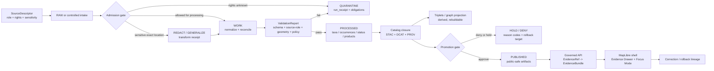

<!-- [KFM_META_BLOCK_V2]
doc_id: kfm://doc/TODO-UUID-docs-domains-flora-readme
title: Flora Domain
type: standard
version: v1
status: draft
owners: TODO-flora-steward
created: TODO-YYYY-MM-DD
updated: 2026-04-22
policy_label: TODO-policy-label
related: [docs/domains/flora/ARCHITECTURE.md, docs/domains/flora/CURRENT_STATE.md, docs/domains/flora/SOURCE_REGISTRY.md, docs/domains/flora/DATA_MODEL.md, docs/domains/flora/PIPELINES_AND_LIFECYCLE.md, docs/domains/flora/PUBLICATION_AND_POLICY.md, docs/domains/flora/UI_AND_EVIDENCE_DRAWER.md, docs/domains/flora/VERIFICATION_BACKLOG.md, docs/adr/ADR-flora-schema-home.md, docs/adr/ADR-flora-source-roles.md, docs/adr/ADR-flora-sensitive-location-policy.md]
tags: [kfm, flora, domain, biodiversity, evidence, map-first, governance]
notes: [Target repository tree was not mounted in the authoring session. doc_id, owners, created date, policy label, CODEOWNERS coverage, and related links require verification before merge.]
[/KFM_META_BLOCK_V2] -->

<a id="top"></a>

# Flora Domain

Repo-facing entry point for the KFM flora lane: plant evidence, taxon context, public-safe vegetation surfaces, source-role discipline, and steward-reviewed publication.


> [!IMPORTANT]
> **Status:** experimental / draft  
> **Owners:** `TODO-flora-steward` — NEEDS VERIFICATION against `CODEOWNERS` or steward registry  
> **Path:** `docs/domains/flora/README.md`  
> **Authority class:** domain landing page / repo-facing navigation surface  
> **Truth posture:** doctrine-grounded; implementation depth remains **UNKNOWN** until the target repo, tests, workflows, registries, runtime, and emitted artifacts are inspected  
> **Quick jumps:** [Scope](#scope) · [Repo fit](#repo-fit) · [Inputs](#inputs) · [Exclusions](#exclusions) · [Directory tree](#directory-tree) · [Quickstart](#quickstart) · [Usage](#usage) · [Lifecycle diagram](#lifecycle-diagram) · [Reference tables](#reference-tables) · [Definition of done](#definition-of-done) · [FAQ](#faq) · [Appendix](#appendix)

> [!NOTE]
> This README is a **truth-bounded entrypoint**, not proof that the Flora lane is implemented. Use it to route contributors, reviewers, schemas, registries, fixtures, policies, and future UI/API work without collapsing doctrine, proposal, and current repo state.

---

## Scope

The Flora domain covers plant-related evidence and public-safe representations in KFM. Its job is to help the project ingest, normalize, validate, catalog, publish, explain, review, correct, and roll back flora information without turning raw observations, steward-reviewed records, specimens, models, range summaries, vegetation-index products, map layers, or AI summaries into one undifferentiated truth surface.

### What this lane owns

| Area | Lane responsibility | Current posture |
| --- | --- | --- |
| Plant taxon identity | Accepted names, synonym handling, source taxon IDs, taxon authority references, unresolved-name quarantine | **PROPOSED** until schemas and fixtures are verified |
| Flora occurrence evidence | Plant observation/specimen support with provenance, rights, spatial/temporal support, and sensitivity posture | **PROPOSED** |
| Specimen and herbarium context | Institutional collection facts, catalog numbers, collection metadata, georeference uncertainty, access constraints | **PROPOSED** |
| Status and range context | State/federal/source-specific plant status, range layers, critical habitat/context surfaces where applicable | **PROPOSED / NEEDS VERIFICATION** |
| Plant communities and vegetation context | Community or vegetation classification products when source role and method are explicit | **PROPOSED** |
| Vegetation and phenology products | Derived indices, remote-sensing condition products, masked change surfaces, model cards, uncertainty notes | **PROPOSED** |
| Habitat and covariate joins | Derived associations to habitat, soil, hydrology, climate, or land-cover lanes through published descriptors | **PROPOSED** |
| Public-safe map layers | Generalized, redacted, or aggregate layers that preserve trust cues and avoid sensitive exact locations | **PROPOSED** |
| Evidence Drawer / Focus support | Payload contracts for evidence drill-through, bounded synthesis, denial states, and policy obligations | **PROPOSED** |

### What this README does

1. Defines the directory boundary for `docs/domains/flora/`.
2. States what belongs here and what belongs elsewhere.
3. Keeps **CONFIRMED**, **PROPOSED**, **UNKNOWN**, and **NEEDS VERIFICATION** separate.
4. Gives maintainers a small, reviewable path from documentation to contracts, registries, validators, and public-safe UI behavior.
5. Prevents exploratory flora/biodiversity ideas from becoming accidental implementation claims.

[Back to top](#top)

---

## Repo fit

`docs/domains/flora/` is the human-readable domain entrypoint for Flora. It should sit between high-level KFM doctrine and implementation-facing machine surfaces such as schemas, registries, validators, policies, fixtures, catalogs, releases, and UI/API payloads.

> [!WARNING]
> The target repo tree was not mounted during this authoring pass. The path `docs/domains/flora/README.md` is provided by the task request, but sibling files and upstream/downstream links are **NEEDS VERIFICATION** before merge.

| Direction | Surface | Relationship | Verification state |
| --- | --- | --- | --- |
| Parent domain index | `docs/domains/README.md` | Should route contributors among domain lanes and preserve domain/source boundaries | **NEEDS VERIFICATION** |
| Documentation governance | `docs/README.md`, `docs/registers/`, `docs/standards/` | Should define canon/lineage/exploratory handling and Markdown rules | **NEEDS VERIFICATION** |
| Flora architecture | `docs/domains/flora/ARCHITECTURE.md` | Should hold full lane architecture and object boundaries | **PROPOSED** |
| Current state ledger | `docs/domains/flora/CURRENT_STATE.md` | Should capture repo scan, existing files, tests, workflows, and emitted artifacts | **PROPOSED** |
| Source registry guide | `docs/domains/flora/SOURCE_REGISTRY.md` | Should explain source descriptors, rights, sensitivity, roles, and verification state | **PROPOSED** |
| Machine source registry | `data/registry/flora/*.yaml` | Should hold source descriptors, source roles, sensitivity policies, rights profiles, layer registry | **PROPOSED** |
| Contracts / schemas | `schemas/contracts/v1/flora/` or repo-confirmed equivalent | Should define source descriptors, taxon identity, occurrence evidence, sensitivity, release and payload shapes | **CONFLICTED / NEEDS VERIFICATION** |
| Policies | `policy/flora/` | Should enforce rights, sensitivity, source-role, publication, and access controls | **PROPOSED** |
| Validators | `tools/validators/flora/` | Should validate schemas, source descriptors, rights, sensitivity, EvidenceBundles, release manifests, and payloads | **PROPOSED** |
| Fixtures and tests | `tests/fixtures/flora/`, `tests/flora/` | Should include valid and invalid no-network examples | **PROPOSED** |
| Runtime/API | `apps/governed-api/` or repo-confirmed equivalent | Should expose only governed, evidence-resolving, policy-aware Flora routes | **PROPOSED** |
| UI / map shell | `ui/` or repo-confirmed equivalent | Should render public-safe layers, Evidence Drawer payloads, Focus outcomes, and review states | **PROPOSED** |
| Release artifacts | `data/catalog/`, `data/receipts/`, `data/proofs/`, `data/published/`, `release/` | Should keep catalogs, receipts, proofs, manifests, rollback cards, and published products separate | **PROPOSED** |

[Back to top](#top)

---

## Inputs

Accepted inputs are evidence-bearing or governance-bearing materials that can survive review, validation, and future correction.

### Accepted here

- Flora source-intake notes that identify provider, source role, rights, cadence, spatial support, temporal support, sensitivity posture, and authority boundary.
- Human-readable documentation for Flora architecture, current state, object families, pipelines, public policy, UI payloads, verification backlog, changelog, glossary, and idea intake.
- Pointers to source descriptors, schemas, fixtures, policy files, validators, catalog records, release manifests, rollback cards, and review records.
- No-network fixture descriptions for taxa, occurrence evidence, specimen records, status/range context, vegetation products, habitat associations, and public-safe layers.
- Public-safe example payloads for Evidence Drawer and Focus Mode.
- Explicit **ABSTAIN**, **DENY**, **ERROR**, quarantine, redaction, generalization, and rollback scenarios.

### Accepted nearby, but not authored here

| Material | Better home | Why |
| --- | --- | --- |
| Machine-readable source descriptors | `data/registry/flora/` | Registry validation should not depend on prose. |
| JSON Schemas or contracts | `schemas/contracts/v1/flora/` or repo-confirmed equivalent | Machine contracts need fixtures and validators. |
| Policy-as-code | `policy/flora/` | Publication and access decisions must be executable. |
| Validation helpers | `tools/validators/flora/` | Reviewable code should not hide in documentation. |
| Pipeline code | `pipelines/flora/` or repo-confirmed equivalent | Lifecycle execution should stay separate from lane explanation. |
| API route code | governed API app path, once verified | Public clients must cross the trust membrane. |
| MapLibre layer descriptors | UI/layer registry path, once verified | Renderer metadata should not become the source of truth. |

[Back to top](#top)

---

## Exclusions

This lane must not become a dumping ground for plant data, raw downloads, hidden policy decisions, or map-renderer truth.

Do **not** put these in `docs/domains/flora/`:

- Raw occurrence downloads, specimen exports, herbarium dumps, API snapshots, credentials, tokens, cookies, private access notes, or restricted source payloads.
- Exact sensitive plant locations or controlled-access geometry examples.
- Live source activation instructions that lack current rights, terms, endpoint, cadence, and steward review.
- Claims that a source is official, authoritative, public, current, or publishable without source-role evidence and rights review.
- Route names, DTO names, package paths, workflow names, or command claims not verified in the mounted repo.
- Model, range, habitat, vegetation-index, or heatmap output presented as direct observation truth.
- MapLibre style rules treated as canonical data semantics.
- AI/Focus answers that do not resolve to admissible EvidenceBundles.
- Publication instructions that bypass validation, policy, catalog closure, review state, release manifest, rollback target, or correction lineage.

> [!CAUTION]
> Rare plant and controlled-access biodiversity records fail closed. Public outputs should use reviewed public-safe summaries, generalized geometry, safe stubs, or abstention unless explicit authorization and release state support greater precision.

[Back to top](#top)

---

## Directory tree

The tree below is a **PROPOSED starter map** for the Flora lane. It should be reconciled with the real repo after a mounted checkout is inspected.

```text
docs/
└── domains/
    └── flora/
        ├── README.md
        ├── ARCHITECTURE.md
        ├── CURRENT_STATE.md
        ├── SOURCE_REGISTRY.md
        ├── DATA_MODEL.md
        ├── PIPELINES_AND_LIFECYCLE.md
        ├── PUBLICATION_AND_POLICY.md
        ├── UI_AND_EVIDENCE_DRAWER.md
        ├── VERIFICATION_BACKLOG.md
        ├── CHANGELOG.md
        ├── ROADMAP.md
        ├── FILE_MANIFEST.md
        ├── GLOSSARY.md
        └── IDEA_INTAKE.md
```

Expected adjacent implementation homes, pending verification:

```text
data/registry/flora/
data/raw/flora/
data/work/flora/
data/quarantine/flora/
data/processed/flora/
data/catalog/{stac,dcat,prov}/flora/
data/triplets/flora/
data/receipts/flora/
data/proofs/flora/
data/published/flora/
schemas/contracts/v1/flora/        # or repo-confirmed contract home
policy/flora/
tools/validators/flora/
tools/diff/flora/
pipelines/flora/
packages/flora/
tests/fixtures/flora/
tests/flora/
apps/governed-api/                 # or repo-confirmed governed API home
ui/                                # or repo-confirmed shell/layer home
.github/workflows/                 # only after workflow conventions are verified
```

[Back to top](#top)

---

## Quickstart

Use this sequence before making stronger claims about Flora implementation.

### 1. Verify the repo and current path

```bash
pwd
git status --short
git branch --show-current || true

find docs/domains/flora -maxdepth 2 -type f | sort || true
find docs contracts schemas policy tools tests apps packages infra data .github -maxdepth 3 -type f 2>/dev/null | sort | head -300
```

Record results in `docs/domains/flora/CURRENT_STATE.md` before claiming implementation depth.

### 2. Verify ownership and metadata

```bash
find .github -maxdepth 3 -type f -name 'CODEOWNERS' -print -exec sed -n '1,220p' {} \;
find docs -maxdepth 4 -type f -iname '*markdown*' -o -iname '*readme*' | sort | head -100
```

Update the meta block fields that currently contain `TODO` only after ownership and policy labels are confirmed.

### 3. Land a no-network Flora documentation slice

1. Keep this README small enough to review.
2. Add or verify `CURRENT_STATE.md`, `SOURCE_REGISTRY.md`, `DATA_MODEL.md`, and `PUBLICATION_AND_POLICY.md`.
3. Add `ADR-flora-schema-home.md` if the schema/contract home is unresolved.
4. Add valid and invalid fixtures before activating live source probes.
5. Require negative tests for restricted exact geometry, unknown rights, missing provenance, unresolved taxon identity, and model-as-observation confusion.

### 4. Prove one safe path before widening

```text
SourceDescriptor
  -> no-network fixture
  -> validation report
  -> processed public-safe candidate
  -> catalog closure
  -> EvidenceBundle
  -> governed API envelope
  -> Evidence Drawer / Focus fixture
```

The first public-facing Flora example should be boring on purpose: public-safe, fixture-backed, source-role explicit, rights explicit, and reversible.

[Back to top](#top)

---

## Usage

### When adding a Flora source

1. Create or update the source descriptor.
2. Classify source role, rights, sensitivity, cadence, spatial support, temporal support, and authority boundary.
3. Add at least one valid fixture and one denial/quarantine fixture.
4. Add validator coverage for schema, rights, sensitivity, provenance, and geometry precision.
5. Do not activate live fetch until source terms and steward review are recorded.
6. Update this README or the relevant companion doc when behavior changes.

### When publishing or revising a Flora layer

1. Confirm the layer is derived from published or release-candidate artifacts, not RAW/WORK/QUARANTINE.
2. Preserve source-role, freshness, review state, rights, sensitivity, and correction status in layer metadata.
3. Generate redaction/generalization receipts when precision is reduced.
4. Link to catalog, EvidenceBundle, release manifest, rollback card, and correction lineage.
5. Test the Evidence Drawer and Focus states for `ANSWER`, `ABSTAIN`, `DENY`, and `ERROR`.

### When writing Focus Mode behavior

Focus Mode may summarize, compare, and explain Flora evidence only after scope, policy, EvidenceBundle resolution, and citation validation. It must not be a detached assistant that can answer from raw source data or unpublished candidates.

[Back to top](#top)

---

## Lifecycle diagram



**Reading rule:** this diagram is a doctrine-grounded target flow, not proof that the target repo currently implements every box.

[Back to top](#top)

---

## Reference tables

### Truth labels

| Label | Use in this README |
| --- | --- |
| **CONFIRMED** | Directly supported by the task, attached KFM doctrine, or current-session workspace inspection. |
| **INFERRED** | Conservative interpretation from doctrine or adjacent patterns, not direct implementation proof. |
| **PROPOSED** | Recommended target structure or behavior not verified as present implementation. |
| **UNKNOWN** | Not verified strongly enough because repo files, tests, workflows, logs, runtime, or emitted artifacts were unavailable. |
| **NEEDS VERIFICATION** | Concrete check required before treating a claim as current fact. |
| **CONFLICTED** | Multiple possible homes or conventions exist in doctrine/lineage and must be resolved by ADR or repo inspection. |

### Flora object-family map

| Object family | Purpose | Public posture |
| --- | --- | --- |
| `FloraSourceDescriptor` | Identifies provider, source role, access path, rights, cadence, sensitivity, and authority boundary | Public only if no restricted access details are exposed |
| `FloraTaxon` | Normalized plant taxon identity with source and authority references | Public if source rights allow |
| `TaxonCrosswalk` | Maps raw names/IDs to accepted names/IDs and unresolved cases | Public summary OK; unresolved cases should remain reviewable |
| `OccurrenceEvidenceObject` | Smallest source-traceable observation/specimen support object | Public only after rights, sensitivity, and precision checks |
| `SpecimenRecord` | Herbarium or institutional collection context | Public-safe metadata only unless license and sensitivity permit more |
| `StatusAssertion` | Official or steward-reviewed status/range statement within stated authority boundary | Must cite authority and as-of date |
| `VegetationProduct` | Derived model/index/remote-sensing product | Must carry model/method card, masks, uncertainty, and temporal support |
| `HabitatAssociation` | Derived link between flora evidence and habitat/covariate layers | Must cite input artifacts and remain rebuildable |
| `SensitivityTransformReceipt` | Records redaction/generalization or withheld precision | Required before public-safe sensitive derivatives |
| `LayerManifest` | Map-facing layer descriptor with trust metadata | Style is not truth; metadata must point to evidence |
| `EvidenceBundle` | Policy-safe resolved evidence support for a claim or UI payload | Outranks generated language |
| `DecisionEnvelope` | Finite runtime outcome and reason/obligation summary | Required for Focus/API negative states |
| `ReleaseManifest` | Published artifact inventory with digests, policy/review refs, rollback target | Required for release claims |

### Source-role discipline

| Source role | Meaning | Default publication rule |
| --- | --- | --- |
| `official` | Government or legally responsible source for status, regulation, or authoritative spatial layer | Publish only after rights, sensitivity, and review state are resolved |
| `institutional` | Museum, herbarium, university, research institute, or agency collection | Public-safe metadata first; geometry depends on license and sensitivity |
| `steward_reviewed` | Curated by responsible flora steward, heritage program, or qualified reviewer | Public only with explicit release decision |
| `corroborative` | Useful support but not controlling authority for status/legal claims | Aggregate or generalize; cite limits |
| `community_observation` | Public/community plant observation or project record | Requires quality, license, reviewer, and sensitivity checks |
| `controlled_access` | Requires terms, license, steward approval, or access-controlled use | Deny public exact publication unless authorization is explicit |
| `derived_model` | Model, interpolation, suitability, range, index, or generalized surface | Publish only with method, uncertainty, and evidence lineage |
| `generalized_public_surface` | Public-safe derivative from more sensitive/internal evidence | Publish when transform receipt, sensitivity, and rights are resolved |

### Gate matrix

| Gate | Must pass | Deny / quarantine triggers |
| --- | --- | --- |
| Identity | Stable IDs, source ID, schema version, spec hash or equivalent deterministic key | Missing ID, unstable join key, unversioned schema |
| Rights | License/terms captured and compatible with intended use | Unknown license, restricted redistribution, missing terms snapshot |
| Sensitivity | Public/internal/restricted posture explicit | Exact sensitive geometry without authorization |
| Source role | Authority boundary and source role declared | Community/model source used as official status authority |
| Spatial support | CRS, precision, uncertainty, generalization, geometry type declared | Ambiguous geometry, unsupported precision, hidden redaction |
| Temporal support | Observation date, source as-of date, retrieval/normalization/promotion time separated | Mixed event time and ingest time |
| Provenance | EvidenceRef/EvidenceBundle path reconstructable | Loose citation or broken bundle reference |
| Catalog closure | STAC/DCAT/PROV/release refs close where applicable | Mismatched checksums, broken refs, missing catalog record |
| UI payload | Evidence Drawer and Focus payloads show policy, freshness, rights, review, and outcome | Tooltip-only evidence, unsupported answer, missing negative state |
| Rollback | Release has rollback target and correction path | Silent replacement or deletion-only rollback |

### UI and API boundaries

| Surface | Should do | Must not do |
| --- | --- | --- |
| MapLibre public layer | Show public-safe geometry, trust badge, source role, freshness, review state | Fetch RAW/WORK/QUARANTINE or infer truth from renderer state |
| Evidence Drawer | Resolve claim support, source role, rights, sensitivity transform, provenance, correction state | Hide policy blocks or make evidence a developer-only appendix |
| Focus Mode | Emit finite outcomes with citations, scope chips, reason codes, audit ref | Answer from unpublished data or reveal restricted exact locations |
| Review surface | Expose candidates, sensitivity flags, redaction receipts, taxonomy conflicts, steward decisions | Bypass policy gates or rewrite source evidence |
| Export/share | Preserve trust cues, policy context, release state, correction status | Strip generalization or provenance context |

[Back to top](#top)

---

## Definition of done

This README is ready to treat as an active repo document when the following are complete:

- [ ] Meta block fields are verified: `doc_id`, owners, created date, policy label, and related links.
- [ ] `docs/domains/flora/CURRENT_STATE.md` records a real repo scan and distinguishes existing files from proposed homes.
- [ ] Schema home is resolved or explicitly tracked in `ADR-flora-schema-home.md`.
- [ ] Source-role and sensitive-location policy decisions are recorded in ADRs or policy docs.
- [ ] At least one valid no-network fixture and one invalid fixture exist for taxon identity, occurrence/specimen evidence, source descriptor, sensitivity, and payload behavior.
- [ ] Validators deny missing rights, missing provenance, exact sensitive public geometry, unresolved source role, and model-as-observation confusion.
- [ ] Evidence Drawer and Focus fixtures include `ANSWER`, `ABSTAIN`, `DENY`, and `ERROR` examples.
- [ ] Public-safe layer descriptor carries freshness, source role, review state, rights/sensitivity, and EvidenceBundle references.
- [ ] Receipts, proofs, catalog records, release manifests, and runtime payloads are separate objects.
- [ ] Rollback/correction path is documented for every published Flora artifact.
- [ ] No README link claims implementation maturity unless backed by checked-in files, tests, emitted artifacts, or runtime evidence.

[Back to top](#top)

---

## FAQ

### Is Flora a map layer?

No. Flora is a governed domain lane. Map layers are downstream public-safe representations of evidence and review state. They do not replace source descriptors, schemas, policies, catalog records, EvidenceBundles, release manifests, or rollback lineage.

### Can exact rare plant locations appear in public outputs?

Not by default. Exact sensitive locations require explicit authorization, sensitivity policy, release decision, and public-safety review. Otherwise, use generalized geometry, safe stubs, aggregates, withheld precision, or abstention.

### Can Focus Mode answer Flora questions?

Yes, only within governed scope. Focus must use released/admissible evidence, resolve EvidenceRefs to EvidenceBundles, apply policy, validate citations, and emit a finite outcome. It must not act as a free-form botanical chatbot over raw or controlled-access records.

### Should Flora define its own EvidenceBundle?

Prefer reuse. If shared governance objects exist, extend them with Flora profile constraints rather than forking. Create Flora-specific variants only if shared objects cannot represent required plant-domain obligations.

[Back to top](#top)

---

## Appendix

<details>
<summary>Companion document roles</summary>

| Document | Role | Status |
| --- | --- | --- |
| `ARCHITECTURE.md` | End-to-end lane architecture, invariants, and object boundaries | **PROPOSED** |
| `CURRENT_STATE.md` | Repo scan, implementation evidence, open unknowns | **PROPOSED** |
| `SOURCE_REGISTRY.md` | Human guide for Flora source descriptors and activation posture | **PROPOSED** |
| `DATA_MODEL.md` | Taxon, occurrence, specimen, product, catalog, release, and payload object families | **PROPOSED** |
| `PIPELINES_AND_LIFECYCLE.md` | RAW → WORK/QUARANTINE → PROCESSED → CATALOG/TRIPLET → PUBLISHED path | **PROPOSED** |
| `PUBLICATION_AND_POLICY.md` | Rights, sensitivity, public-safe precision, review, and release rules | **PROPOSED** |
| `UI_AND_EVIDENCE_DRAWER.md` | MapLibre layer metadata, drawer payload, Focus payload, review surface | **PROPOSED** |
| `VERIFICATION_BACKLOG.md` | Source checks, schema gaps, repo unknowns, CI/runtime proof needs | **PROPOSED** |
| `CHANGELOG.md` | Human-readable change history | **PROPOSED** |
| `ROADMAP.md` | Sequenced implementation plan | **PROPOSED** |
| `FILE_MANIFEST.md` | File inventory and ownership map | **PROPOSED** |
| `GLOSSARY.md` | Stable Flora/KFM terminology | **PROPOSED** |
| `IDEA_INTAKE.md` | Triage lane for unpromoted flora/biodiversity ideas | **PROPOSED** |

</details>

<details>
<summary>First safe implementation slice</summary>

1. Verify actual repo layout and owner coverage.
2. Resolve schema-home ambiguity with an ADR.
3. Add source descriptor schema/profile and no-network fixture.
4. Add taxon identity and occurrence/specimen evidence fixtures.
5. Add rights/sensitivity policy stubs and negative fixtures.
6. Add validator commands using repo-native tooling.
7. Add public-safe Evidence Drawer and Focus fixtures.
8. Run a promotion dry-run without live source fetch or public release.
9. Update this README only with claims supported by direct evidence.

</details>

<details>
<summary>Open verification backlog</summary>

- Actual `docs/domains/` conventions and parent README availability.
- `CODEOWNERS` coverage for Flora.
- Canonical schema home: `contracts/`, `schemas/contracts/v1/`, or a documented split.
- Repo-native policy toolchain and test runner.
- Existing shared objects: `SourceDescriptor`, `EvidenceBundle`, `DecisionEnvelope`, `ReleaseManifest`, `LayerManifest`, `RunReceipt`, `AIReceipt`.
- Existing UI shell paths for MapLibre layers, Evidence Drawer, Focus, and review surfaces.
- Current source terms and rights for Flora/biodiversity providers.
- Steward process for rare plant, controlled-access, or exact-location release decisions.
- Public-safe geometry thresholds and transform receipt schema.
- Current deployment/exposure constraints for any local or semi-public Flora surface.

</details>

[Back to top](#top)
