<!-- [KFM_META_BLOCK_V2]
doc_id: kfm://doc/docs-domains-flora-readme
title: Kansas Frontier Matrix — Flora Domain
type: standard
version: v2
status: draft
owners: TODO (flora domain steward + governance steward)
created: 2026-05-16
updated: 2026-06-03
policy_label: public
related:
  - docs/doctrine/ai-build-operating-contract.md
  - docs/doctrine/directory-rules.md
  - docs/doctrine/lifecycle-law.md
  - docs/doctrine/trust-membrane.md
  - docs/domains/README.md
  - docs/domains/flora/PUBLICATION_AND_ROLLBACK.md
  - docs/domains/habitat/README.md
  - docs/domains/fauna/README.md
tags: [kfm, domain, flora, biodiversity, governance]
notes:
  - "Doctrine-adjacent; pins CONTRACT_VERSION = 3.0.0 in notes per the operating contract."
  - "All implementation, schema, route, and registry claims are PROPOSED until verified against a mounted repo."
  - "Sensitivity posture is fail-closed for exact rare-plant geometry by default."
  - "v2: corrected source-rights claims, upgraded source-role enum to CONFIRMED classes, grounded the flora watcher in KFM-P2-PROG-0002, reconciled the references appendix to the actual corpus."
[/KFM_META_BLOCK_V2] -->

# 🌿 Kansas Frontier Matrix — Flora Domain

> Govern plant taxonomic identity, occurrences, specimens, vegetation communities, rare/protected/culturally sensitive flora controls, public-safe surfaces, evidence-backed maps, correction, and rollback for Kansas plant life.

<a id="top"></a>

[](#1-scope)
[](#top)
[](#7-pipeline-shape-raw--published)
[](#9-sensitivity-rights--publication-posture)
[](#11-governed-ai-behavior)
[](../../doctrine/ai-build-operating-contract.md)
[](#13-verification-backlog--open-questions)

**Status:** `draft` · **Owners:** _TODO — flora domain steward; governance steward_ · **Last updated:** 2026-06-03 · **Contract:** `CONTRACT_VERSION = "3.0.0"`

> [!IMPORTANT]
> All paths, schemas, registries, validators, routes, and CI/workflow references in this document are **PROPOSED** until verified against a mounted KFM repository. This README states doctrine confidently where supported by attached project sources; it does **not** assert current implementation maturity. See [§13 Verification Backlog](#13-verification-backlog--open-questions).

---

## 📑 Mini Table of Contents

1. [Scope](#1-scope)
2. [Repository Fit](#2-repository-fit)
3. [Accepted Inputs](#3-accepted-inputs)
4. [Exclusions](#4-exclusions)
5. [Directory Tree (PROPOSED)](#5-directory-tree-proposed)
6. [Domain Diagram](#6-domain-diagram)
7. [Pipeline Shape (RAW → PUBLISHED)](#7-pipeline-shape-raw--published)
8. [Ubiquitous Language, Source Families, Object Families](#8-ubiquitous-language-source-families-object-families)
9. [Sensitivity, Rights & Publication Posture](#9-sensitivity-rights--publication-posture)
10. [Map & Viewing Products](#10-map--viewing-products)
11. [Governed AI Behavior](#11-governed-ai-behavior)
12. [Validators, Tests & Thin-Slice Plan](#12-validators-tests--thin-slice-plan)
13. [Verification Backlog & Open Questions](#13-verification-backlog--open-questions)
14. [FAQ](#14-faq)
15. [Companion Registers](#15-companion-registers)
16. [Related Docs](#16-related-docs)
17. [Appendix](#17-appendix)

---

## 1. Scope

**CONFIRMED doctrine / PROPOSED implementation.** The Flora lane governs plant taxonomic identity, flora occurrence and specimen evidence, rare-plant and protected-species controls, invasive plants, phenology, restoration plantings, vegetation surfaces, range and distribution products, habitat associations, and public-safe botanical outputs — anchored to the KFM trust spine (`SourceDescriptor → EvidenceBundle → ValidationReport → ReleaseManifest → RollbackCard`).

Flora is approached as a **proof-bearing thin slice**, not horizontal coverage: a single common-species occurrence joined to a vegetation-community polygon, backed by a resolvable `EvidenceBundle` and a public-safe map, is the first credible deliverable.

- **One-line purpose.** Evidence-first botanical truth for Kansas, with deny-by-default protection for sensitive plant locations.
- **Doctrinal posture.** Cite-or-abstain; deterministic identity; promotion as a governed state transition; auditable provenance, receipts, and rollback targets.
- **Sensitivity posture.** Rare, protected, culturally sensitive, and steward-reviewed flora default to generalized, withheld, staged, or denied public geometry. *(CONFIRMED — Atlas, Flora §I.)*

> [!NOTE]
> Flora is one of the domain lanes named explicitly in **Directory Rules §12 (Domain Placement Law)** and called out by name in the §3 "deeper rule." The lane appears as a `flora/` **segment** inside each owning responsibility root — it is **not** a root folder. *(CONFIRMED — Directory Rules §3, §12, §13.4.)*

[↑ Back to top](#top)

---

## 2. Repository Fit

The Flora domain follows the **lane pattern** prescribed by Directory Rules §12. The domain segment appears under each responsibility root that owns a piece of its responsibility; flora never collapses into a single mega-folder.

| Responsibility | Owning root | Domain segment (PROPOSED) |
|---|---|---|
| Human-facing explanation | `docs/` | `docs/domains/flora/` |
| Object meaning (semantic) | `contracts/` | `contracts/domains/flora/` |
| Machine shape | `schemas/` | `schemas/contracts/v1/domains/flora/` |
| Admissibility (allow/deny/restrict/abstain) | `policy/` | `policy/domains/flora/` (and `policy/sensitivity/flora/`) |
| Proofs | `tests/` | `tests/domains/flora/` |
| Golden/valid/invalid samples | `fixtures/` | `fixtures/domains/flora/` |
| Shared library code | `packages/` | `packages/domains/flora/` |
| Executable pipeline logic | `pipelines/` | `pipelines/domains/flora/` |
| Declarative pipeline configuration | `pipeline_specs/` | `pipeline_specs/flora/` |
| Lifecycle data | `data/` | `data/<phase>/flora/`, `data/catalog/domain/flora/`, `data/published/layers/flora/`, `data/registry/sources/flora/` |
| Release decisions | `release/` | `release/candidates/flora/` |

> [!WARNING]
> Per Directory Rules **§13.4**, a flora subtree at repo root (e.g. `flora/data/`, `flora/schemas/`, `flora/policy/`) is an **anti-pattern** that fragments the lifecycle. Files belong under their **responsibility root**, with `flora/` as a domain segment. Cross-domain content (e.g. a habitat × flora × fauna validator) goes under the **lowest common responsibility root without a domain segment** — e.g. `tools/validators/<topic>/`, `schemas/contracts/v1/<topic>/`, `docs/architecture/<topic>.md`. *(CONFIRMED — Directory Rules §12 "Multi-domain and cross-cutting files," §13.4.)*

### Upstream and downstream

- **Upstream of Flora (governing doctrine):** `docs/doctrine/` (operating contract, authority ladder, truth posture, trust membrane, lifecycle law, directory rules) and accepted ADRs (notably ADR-0001 on schema home; the open `ADR-S-04` source-role vocabulary and `ADR-S-05` sensitivity tier scheme bear directly on this lane).
- **Downstream of Flora:** `apps/governed-api/` (the sole public trust membrane), `apps/explorer-web/` + `packages/maplibre-runtime/` (shell + sole governed renderer), and any `data/published/layers/flora/` artifacts served via `LayerManifest`.

[↑ Back to top](#top)

---

## 3. Accepted Inputs

Files and content that **belong** somewhere under the Flora lane (all paths `PROPOSED`):

- Flora-specific source descriptors — `data/registry/sources/flora/…`
- Domain object semantics — `contracts/domains/flora/<object>.md`
- Domain object schemas — `schemas/contracts/v1/domains/flora/<object>.schema.json` *(per ADR-0001)*
- Flora-scoped policy bundles, sensitivity rules, rights checks — `policy/domains/flora/…`, `policy/sensitivity/flora/…`
- Domain pipelines, normalizers, taxonomy reconcilers — `pipelines/domains/flora/…`
- Domain pipeline specifications — `pipeline_specs/flora/…`
- Flora-scoped tests, fixtures, and no-network fixture packs — `tests/domains/flora/…`, `fixtures/domains/flora/…`
- Domain lifecycle artifacts — `data/<phase>/flora/…`
- Released flora layers and catalog projections — `data/published/layers/flora/…`, `data/catalog/domain/flora/…`
- Release candidates and decisions — `release/candidates/flora/…`
- Flora-specific documentation — `docs/domains/flora/*.md` (this README is one such file)

[↑ Back to top](#top)

---

## 4. Exclusions

Content that **does not** belong under Flora, with redirects. *(CONFIRMED non-ownership — Atlas, Flora §B: "Habitat owns habitat patches and suitability; Fauna owns animal taxa and occurrences; Soil, hydrology, agriculture, hazards, roads, settlements, archaeology, and people keep their truth.")*

| Topic | Owner | Redirect |
|---|---|---|
| Habitat patches, suitability surfaces, habitat models | **Habitat** | `docs/domains/habitat/` |
| Animal taxa, fauna occurrences, fauna ranges, sensitive faunal sites | **Fauna** | `docs/domains/fauna/` |
| Soil map units, horizons, soil-property surfaces | **Soil** | `docs/domains/soil/` |
| Water observations, hydrography, flood context | **Hydrology** | `docs/domains/hydrology/` |
| Crop observations, fields, rotation, yield, irrigation, agricultural economy | **Agriculture** | `docs/domains/agriculture/` |
| Hazard events, fire/flood/drought records as hazards | **Hazards** | `docs/domains/hazards/` |
| Roads, rail, trade routes | **Roads, Rail, and Trade** | `docs/domains/transport/` *(root segment PROPOSED)* |
| Settlements, infrastructure, municipal records | **Settlements & Infrastructure** | `docs/domains/settlement/` *(root segment PROPOSED)* |
| Archaeological sites, cultural heritage | **Archaeology** | `docs/domains/archaeology/` |
| Living-person, DNA, land-ownership records | **People, DNA, Land** | `docs/domains/people/` |
| Cross-domain schemas, validators, or doctrine | **Lowest common responsibility root** | e.g. `tools/validators/<topic>/`, `schemas/contracts/v1/<topic>/`, `docs/architecture/<topic>.md` — **no domain segment** |

> [!CAUTION]
> Flora may **reference** habitat, fauna, soil/hydrology, agriculture, and hazards through governed joins, but it **does not own** their object families. A join that imports another domain's truth into a Flora artifact must preserve **ownership, source role, sensitivity, and `EvidenceBundle` support**. See [§8 cross-lane relations](#cross-lane-relations). *(CONFIRMED relation constraint — Atlas, Flora §F.)*

[↑ Back to top](#top)

---

## 5. Directory Tree (PROPOSED)

The following tree is derived from Directory Rules §12 and the domain-lane pattern, with lifecycle paths cross-checked against the `kansas_flora_watch` blueprint (`KFM-P2-PROG-0002`). Paths are **PROPOSED** / **NEEDS VERIFICATION** against a mounted repo; nothing here implies current implementation.

```text
# docs/ — human-facing
docs/domains/flora/
├── README.md                    # this file
├── PUBLICATION_AND_ROLLBACK.md  # PROPOSED — release/correction/stale/rollback contract
├── object-families.md           # PROPOSED
├── source-families.md           # PROPOSED
├── sensitivity-posture.md       # PROPOSED
├── thin-slice-plan.md           # PROPOSED
└── governed-ai-behavior.md      # PROPOSED

# contracts/ — semantic meaning
contracts/domains/flora/
├── plant-taxon.md               # PROPOSED
├── flora-taxon-crosswalk.md     # PROPOSED
├── flora-occurrence.md          # PROPOSED
├── specimen-record.md           # PROPOSED
├── rare-plant-record.md         # PROPOSED
├── vegetation-community.md      # PROPOSED
├── invasive-plant-record.md     # PROPOSED
├── phenology-observation.md     # PROPOSED
├── range-polygon.md             # PROPOSED
├── distribution-surface.md      # PROPOSED
├── habitat-association.md       # PROPOSED
├── botanical-survey.md          # PROPOSED
└── restoration-planting.md      # PROPOSED

# schemas/ — machine shape (ADR-0001 default home)
schemas/contracts/v1/domains/flora/
├── plant-taxon.schema.json                # PROPOSED
├── flora-taxon-crosswalk.schema.json      # PROPOSED
├── flora-occurrence.schema.json           # PROPOSED
├── specimen-record.schema.json            # PROPOSED
├── rare-plant-record.schema.json          # PROPOSED
├── vegetation-community.schema.json       # PROPOSED
├── invasive-plant-record.schema.json      # PROPOSED
├── phenology-observation.schema.json      # PROPOSED
├── range-polygon.schema.json              # PROPOSED
├── distribution-surface.schema.json       # PROPOSED
├── habitat-association.schema.json        # PROPOSED
├── botanical-survey.schema.json           # PROPOSED
└── restoration-planting.schema.json       # PROPOSED

# policy/ — admissibility, sensitivity, rights
policy/domains/flora/                      # PROPOSED — promotion, rights gates
policy/sensitivity/flora/                  # PROPOSED — rare-plant, culturally sensitive, geoprivacy
                                           #   (the Atlas §24.13 crosswalk names policy/sensitivity/flora/)

# tests/, fixtures/ — proofs and golden samples
tests/domains/flora/                       # PROPOSED
fixtures/domains/flora/                     # PROPOSED — no-network fixtures only

# packages/, pipelines/, pipeline_specs/ — code and orchestration
packages/domains/flora/                    # PROPOSED
pipelines/domains/flora/                    # PROPOSED
pipeline_specs/flora/                       # PROPOSED

# data/ — lifecycle (RAW → PUBLISHED); paths per KFM-P2-PROG-0002
data/raw/flora/<source>/<timestamp>/        # PROPOSED
data/work/flora/<run_id>/                   # PROPOSED
data/quarantine/flora/                      # PROPOSED
data/processed/flora/<spec_hash>/           # PROPOSED
data/catalog/{dcat,stac,prov}/flora/        # PROPOSED
data/catalog/domain/flora/                  # PROPOSED
data/published/layers/flora/                # PROPOSED — public-safe only
data/registry/sources/flora/                # PROPOSED — SourceDescriptor entries
data/receipts/flora/                        # PROPOSED — emitted alongside lifecycle

# release/ — release decisions distinct from published artifacts
release/candidates/flora/                   # PROPOSED
```

> [!NOTE]
> Receipts, proofs, registry, and rollback artifacts are emitted **alongside** lifecycle directories per Directory Rules §3 — they do not replace lifecycle phases. The `data/raw/flora/<source>/<timestamp>/ … data/receipts/flora/` shape above is the lifecycle placement asserted in the `kansas_flora_watch` blueprint (`KFM-P2-PROG-0002`, PROPOSED). Whether `data/proofs/flora/…` and `data/rollback/flora/…` are confirmed sibling homes or require an ADR per §2.4 remains `NEEDS VERIFICATION` (see `ADR-S-03` receipt-class home).

[↑ Back to top](#top)

---

## 6. Domain Diagram

The diagram shows the Flora lane's relationship to the trust spine, the lifecycle phases, and adjacent domains. It is **conceptual**; runtime paths, routes, and module names are `PROPOSED`.

```mermaid
flowchart LR
  subgraph SRC["Source families (CONFIRMED list / PROPOSED registry)"]
    KANU["KU R.L. McGregor Herbarium (KANU) IPT"]
    KSC["Kansas State Univ. Herbarium (KSC) IPT"]
    USDA["USDA PLANTS (taxonomy + state presence)"]
    GBIF["GBIF vascular plant downloads"]
    IDIGBIO["iDigBio specimen records"]
    INAT["iNaturalist-derived observations"]
    KDWP["KDWP flora / Ecological Review Tool"]
    NS["NatureServe Explorer / Explorer Pro"]
    USFWS["USFWS ECOS plant context"]
  end

  subgraph LANE["Flora lane (lifecycle — all PROPOSED until verified)"]
    direction TB
    RAW["RAW<br/>SourceDescriptor capture"] --> WQ["WORK / QUARANTINE<br/>normalize · validate · quarantine"]
    WQ --> PROC["PROCESSED<br/>EvidenceRef · ValidationReport · digest closure"]
    PROC --> CAT["CATALOG / TRIPLET<br/>EvidenceBundle · graph projection · release candidate"]
    CAT --> PUB["PUBLISHED<br/>ReleaseManifest · public-safe LayerManifest"]
  end

  subgraph ADJ["Adjacent domains (governed joins only)"]
    HAB["Habitat"]
    FAU["Fauna"]
    SOIL["Soil / Hydrology"]
    HAZ["Hazards"]
  end

  subgraph TRUST["Trust membrane (CONFIRMED doctrine)"]
    GAPI["apps/governed-api/"]
    SHELL["apps/explorer-web/ + packages/maplibre-runtime/"]
  end

  SRC --> RAW
  PUB --> GAPI
  GAPI --> SHELL

  HAB -. "habitat association · community context" .-> LANE
  FAU -. "pollinator · food-web · invasive context" .-> LANE
  SOIL -. "substrate · wetland · riparian · drought" .-> LANE
  HAZ -. "fire · drought · flood · smoke · stress" .-> LANE

  classDef proposed fill:#fff3e0,stroke:#ef6c00,color:#bf360c;
  classDef trust fill:#e3f2fd,stroke:#1565c0,color:#0d47a1;

  class SRC,ADJ,LANE proposed;
  class TRUST trust;
```



[↑ Back to top](#top)

---

## 7. Pipeline Shape (RAW → PUBLISHED)

**CONFIRMED doctrine / PROPOSED lane application.** Flora follows the canonical lifecycle: `RAW → WORK / QUARANTINE → PROCESSED → CATALOG / TRIPLET → PUBLISHED`, with promotion as a **governed state transition**, not a file move. Connectors do not publish; watchers do not publish; pipelines promote only through gate-passing receipts. *(CONFIRMED — Directory Rules §0 lifecycle invariant, §13.5 connector/watcher-as-non-publisher; Atlas, Flora §H.)*

| Stage | Handling | Gate | Status |
|---|---|---|---|
| **RAW** | Capture immutable source payload or reference with source role, rights, sensitivity, citation, time, and hash. | `SourceDescriptor` exists. | `PROPOSED` |
| **WORK / QUARANTINE** | Normalize schema, geometry, time, identity, evidence, rights, and policy; hold failures with recorded quarantine reason. | Validation and policy gates pass, or quarantine reason is recorded. | `PROPOSED` |
| **PROCESSED** | Emit validated, normalized objects, run/validation receipts, and public-safe candidates. | `EvidenceRef`, `ValidationReport`, and digest closure exist. | `PROPOSED` |
| **CATALOG / TRIPLET** | Emit catalog records, `EvidenceBundle`s, graph/triplet projections, and release candidates. | Catalog/proof closure passes. | `PROPOSED` |
| **PUBLISHED** | Serve released public-safe artifacts through governed APIs and manifests only. | `ReleaseManifest`, correction path, rollback target, and review/policy state exist. | `PROPOSED` |

> [!TIP]
> The first flora PR should be **no-network and fixture-first**: synthetic source descriptors, synthetic specimens, synthetic vegetation polygons, and synthetic redaction receipts that exercise every gate. Live connector activation is a separate, smaller PR whose verification surface is just connector behavior and rights review. The `kansas_flora_watch` blueprint (`KFM-P2-PROG-0002`) names **promotion gates A–G** — schema valid, license compliant, provenance complete, spatial integrity verified, temporal consistency, deduplication across sources, Evidence Drawer renders correctly — as the closure set for this lane (PROPOSED).

[↑ Back to top](#top)

---

## 8. Ubiquitous Language, Source Families, Object Families

### Ubiquitous language (Flora)

Terms below are **CONFIRMED** as part of the Flora ubiquitous language (Atlas, Flora §C). Their **field-level realization** in schemas and code is **PROPOSED** until verified.

| Term | Meaning within Flora |
|---|---|
| **Plant Taxon** | A named plant taxonomic unit, anchored to an external authority where available. |
| **FloraTaxon Crosswalk** | A reconciliation record linking accepted names, synonyms, and external identifiers across taxonomic authorities. |
| **Flora Occurrence** | A spatially and temporally located observation of a taxon, with uncertainty and source-role discipline. |
| **SpecimenRecord** | A vouchered, accessioned plant specimen (typically from a herbarium portal). |
| **Rare Plant Record** | An occurrence or specimen for a rare/protected/culturally sensitive taxon, subject to fail-closed geoprivacy by default. |
| **Vegetation Community** | A mapped polygon of plant community composition, structure, or condition. |
| **InvasivePlantRecord** | An occurrence or treatment record for an invasive plant, with monitoring lineage. |
| **Phenology Observation** | A timestamped observation of plant phenophase (leaf-out, bloom, fruiting, senescence). |
| **RangePolygon** | A polygon (often generalized) representing a taxon's known or inferred range. |
| **DistributionSurface** | A raster/surface product describing distribution likelihood or density. |
| **Habitat Association** | A typed relation between a flora object and a habitat lane object, preserving sensitivity. |
| **Botanical Survey** | A bounded survey event with method metadata and supporting evidence. |
| **Restoration Planting** | A documented planting/restoration event with intent, source stock, and outcome data. |
| **SourceRole** | The role a source plays for a claim, drawn from the canonical source-role classes (see below). |
| **Redaction Receipt** | A transformation receipt recording how sensitive source geometry became a public-safe representation. |

> [!NOTE]
> `Botanical Survey` and `Restoration Planting` appear in this lane's working vocabulary but are **not** itemized in the Atlas Flora §C ubiquitous-language table; treat them as **INFERRED** lane terms pending a contract entry, distinct from the CONFIRMED Atlas terms above.

### Source families

The following families are **CONFIRMED in-scope** for Flora (Atlas, Flora §D). The Atlas records each family's role generically as *authority / observation / context / model as the source role requires* and its rights as **NEEDS VERIFICATION**, with **sensitive joins fail closed**. The role/rights columns below therefore carry explicit labels — do not read them as settled.

| Source family | Role (per claim) | Rights / sensitivity | Freshness |
|---|---|---|---|
| KU R.L. McGregor Herbarium (KANU) IPT | observation / authority (specimen) — **per claim** | NEEDS VERIFICATION; sensitive joins fail closed | Source-vintage / IPT cadence |
| Kansas State University Herbarium (KSC) IPT | observation / authority (specimen) — **per claim** | NEEDS VERIFICATION; sensitive joins fail closed | Source-vintage / IPT cadence |
| USDA PLANTS Database | authority (federal checklist, names, state/county distribution) | NEEDS VERIFICATION (public-domain federal checklist assumed; confirm) | Versioned |
| GBIF vascular plant downloads | observation / context | NEEDS VERIFICATION; per-dataset license; capture license + DOI per download | Snapshot / DOI |
| iDigBio specimen records | observation | NEEDS VERIFICATION; per-dataset | Snapshot |
| iNaturalist-derived observations | observation / context | NEEDS VERIFICATION; per-record license; community-science caveats | Continuous |
| KDWP flora / Ecological Review Tool / stewardship outputs | authority (steward review) / context | NEEDS VERIFICATION; steward-controlled; sensitive joins fail closed | Cadence specific |
| NatureServe Explorer / Explorer Pro | authority (conservation status) / context | NEEDS VERIFICATION; restricted-tier access for precise data | Versioned |
| USFWS ECOS plant context | regulatory (federal status) / context | NEEDS VERIFICATION; public; redistribution terms unconfirmed | Cadence specific |

> [!CAUTION]
> **Source-rights claims are not asserted here.** The Atlas marks every Flora source family's rights and current terms `NEEDS VERIFICATION`. Any specific license string (e.g. a particular CC-BY version) MUST be confirmed against the upstream dataset record before it appears as fact in a contract, schema, or `SourceDescriptor`. *(CONFIRMED posture — Atlas, Flora §D.)*

**Kansas-first authority posture (CONFIRMED).** KFM treats Kansas-specific authorities as first-class alongside the global aggregator: KANU and KSC are the primary in-state herbaria; iDigBio adds digitized specimens; **USDA PLANTS is the nomenclature authority and a distribution backstop**, and **specimen-backed observations are preferred over crowd observations**. Restricted taxa (NatureServe, listed species) are **quarantined or redacted before any aggregate is published**. *(CONFIRMED — `KFM-P2-IDEA-0019`, `KFM-P27-IDEA-0001`, `KFM-P2-PROG-0002`.)*

### Object families

The following objects are **owned by Flora** (CONFIRMED list — Atlas, Flora §E; **PROPOSED** deterministic identity rule: `source_id + object_role + temporal_scope + normalized_digest`):

```text
Plant Taxon          FloraTaxon Crosswalk    Flora Occurrence
SpecimenRecord       Rare Plant Record       Vegetation Community
InvasivePlantRecord  Phenology Observation   RangePolygon
DistributionSurface  Habitat Association
```

**Temporal handling** (CONFIRMED): source, observed, valid, retrieval, release, and correction times stay **distinct** where material. *(Atlas, Flora §E.)*

> [!NOTE]
> `Botanical Survey`, `Restoration Planting`, and `Redaction Receipt` are listed under §8 ubiquitous language but are **not** itemized as Flora-owned object families in the Atlas §E table (`Redaction Receipt` is a cross-cutting receipt family per Atlas §24.2). Treat their object-family status as **PROPOSED / INFERRED** pending a contract entry.

### Cross-lane relations

CONFIRMED list (Atlas, Flora §F); relations must preserve **ownership**, **source role**, **sensitivity**, and **`EvidenceBundle`** support.

| This domain | Related lane | Relation type |
|---|---|---|
| Flora | Habitat | Habitat association and vegetation community context |
| Flora | Fauna | Pollinator, food-web, invasive, biodiversity context |
| Flora | Soil / Hydrology | Substrate, wetland, riparian, drought context |
| Flora | Hazards | Fire, drought, flood, smoke, vegetation stress |

[↑ Back to top](#top)

---

## 9. Sensitivity, Rights & Publication Posture

> [!CAUTION]
> **Deny-by-default for exact sensitive locations.** Exact rare-plant, protected-plant, or culturally sensitive plant locations are denied on public surfaces. Public release requires steward review, generalized/withheld geometry, **and** a `RedactionReceipt` recording the transform. This routes through the operating contract's §23.2 sensitive-domain decision matrix — disposition is **not** re-derived here. *(CONFIRMED — Atlas §20.5 Deny-by-Default Register, Flora row; `KFM-P19-PROG-0013`.)*

**CONFIRMED doctrine / PROPOSED implementation.** Rare, protected, culturally sensitive, and steward-reviewed flora default to **generalized, withheld, staged, or denied** public geometry. Permissible transforms (PROPOSED) include:

- **Suppress** — no public geometry; metadata only with regional envelope.
- **Generalize to grid / county / watershed / ecoregion** — coarsened geometry with documented radius/cell size.
- **Buffer / jitter (constrained)** — only when scientific value justifies it and a transform receipt is emitted.
- **Delayed publication** — staged release tied to a review state and freshness window.
- **Steward-only exact access** — exact geometry available only to authorized stewards; never surfaced through public APIs.

Each transform emits a **`RedactionReceipt`** stating: input class, output class, reason, policy, reviewer, and residual risk.

### Deny-by-default register (Flora row)

| Domain / surface | Denied by default | Allowed only when |
|---|---|---|
| **Flora** | Exact rare / protected / culturally sensitive plant locations | Review **+** generalized/withheld geometry **+** `RedactionReceipt` **+** resolvable `EvidenceBundle` |

> [!IMPORTANT]
> **Join-induced sensitivity.** A benign source can become sensitive when joined with others. Joining USDA PLANTS to a rare-plant locality dataset, an iNaturalist coordinate to a small-population polygon, or a herbarium record to an unprotected micro-habitat may be **more sensitive than either input**. Sensitivity is a property of the **resulting product**, not just of the input sources; joins that create new sensitivity must clear the same gates as the most sensitive input. *(Aligns with `ADR-S-14` cross-lane join policy, OPEN.)*

### Sensitivity tier transitions (CONFIRMED doctrine)

A tier **upgrade** toward more-public always needs **both** a transform receipt **and** a review record; a **downgrade** toward less-public needs only a correction. *(Atlas §24.5 / sensitivity-tier transitions.)*

| Transition | Required artifacts | Authority | Reversibility |
|---|---|---|---|
| `T1 → T0` (publish) | `ReleaseManifest` + `ReviewRecord` | Steward + release authority | Reversible via `RollbackCard`. |
| `Any tier → T4` (downgrade) | `CorrectionNotice` + `ReviewRecord` | Steward + rights-holder where applicable | Always permitted; precedes derivative invalidation. |

### Rights posture

- Rights terms for each in-scope source family are **NEEDS VERIFICATION** (Atlas, Flora §D).
- Unclear rights, unresolved source role, missing evidence, unresolved sensitivity, or absent release state **blocks** public promotion. *(CONFIRMED — Atlas, Flora §I.)*
- Restricted-use datasets (e.g. precise NatureServe Explorer Pro data, Kansas Natural Heritage Inventory rare-species localities) require recorded license terms and any derivative-release policy before public exposure.

[↑ Back to top](#top)

---

## 10. Map & Viewing Products

**PROPOSED domain viewing products** (all served via `apps/governed-api/` and rendered by `packages/maplibre-runtime/`; no public client may read canonical stores directly). *(Product list — Atlas, Flora §G.)*

| Product | Audience | Notes |
|---|---|---|
| Generalized occurrence layer | Public | Geoprivacy-transformed; no exact sensitive geometry |
| Public range / distribution layer | Public | `RangePolygon` / `DistributionSurface`, public-safe scale only |
| Vegetation community layer | Public | Polygon mapping; verify rights per source |
| Invasive plant layer | Public | Monitoring + treatment lineage where permitted |
| Phenology / condition layer | Public | Time-aware; uncertainty visible |
| Habitat association summary | Public | Governed join with Habitat lane only |
| Plant species pages | Public | Backed by resolvable `EvidenceBundle` |
| Review candidate view | Steward | Restricted; not a public surface |
| Steward exact-location view | Steward | Restricted; never on a public route |

**CONFIRMED cross-cutting viewing products** (apply to Flora layers): Evidence Drawer, time-aware state, trust badges, sensitivity-redacted view, correction/stale-state view, and governed Focus Mode. *(Atlas, doctrine callout C2.)*

[↑ Back to top](#top)

---

## 11. Governed AI Behavior

**CONFIRMED doctrine / PROPOSED implementation.** AI within the Flora lane is **interpretive, not authoritative**. `EvidenceBundle` outranks generated language. *(Atlas, Flora §L; Governed AI doctrine.)*

| AI behavior | Rule |
|---|---|
| Allowed | Evidence-bounded summarization over **released** Flora `EvidenceBundle`s; citation-backed explanation; evidence comparison; steward-review drafting; anomaly explanation; schema/validator suggestion. |
| `ABSTAIN` | Insufficient evidence; missing/unresolvable `EvidenceRef`; uncertain temporal alignment; missing citation. |
| `DENY` | Policy, rights, sensitivity, or release state blocks the request; query targets exact sensitive geometry; query touches RAW/WORK material directly. |
| `ERROR` | Validation or runtime failure with a structured reason code. |
| Required receipt | Every Focus Mode answer emits an `AIReceipt` and a `RuntimeResponseEnvelope` with outcome `ANSWER \| ABSTAIN \| DENY \| ERROR`, `evidence_refs`, `policy_decision`, and `citation_validation`. |

> [!IMPORTANT]
> No direct model-to-public path. AI never reads canonical or RAW stores. AI does not promote artifacts; promotion is a governed state transition outside the AI runtime. AI text is never treated as evidence (it carries a Reality Boundary Note / Representation Receipt as a `synthetic` source role). *(CONFIRMED — Atlas §24.1.2 "AI text treated as evidence" DENY condition.)*

[↑ Back to top](#top)

---

## 12. Validators, Tests & Thin-Slice Plan

### Validators and tests (PROPOSED)

The following validator/test classes are **PROPOSED** for the Flora lane (Atlas, Flora §K, augmented by `KFM-P2-PROG-0002`):

- Taxonomy reconciliation tests (USDA PLANTS as name authority; GBIF Backbone and ITIS as comparison; disagreement cases).
- DwC-A validator that **rejects** archives lacking `scientificName`, `decimalLatitude`/`decimalLongitude`, `eventDate`, `license`, `rightsHolder`, or `datasetID` *(per `KFM-P2-PROG-0002`; PROPOSED home `tools/validators/flora_dwca_validator`)*.
- Rights and sensitivity validators (source-role allowed claims, sensitivity classification, restricted-use denial).
- Exact sensitive public-geometry **denial** tests.
- Catalog closure tests (`EvidenceBundle` resolution, digest closure, `ReleaseManifest` completeness).
- API finite-outcome fixtures (`ANSWER` / `ABSTAIN` / `DENY` / `ERROR`).
- `RedactionReceipt` validation (input/output class, reason, policy, reviewer, residual risk).
- Cross-domain join validators (join-induced sensitivity denial).
- Cross-source dedupe key check (`institutionCode + catalogNumber + eventDate`, per `KFM-P2-PROG-0002`).
- No-live-network fixture pipeline.
- Rollback drill against a dry-run release.

### Thin-slice plan

**CONFIRMED thin-slice intent (PROPOSED implementation).** One common plant-species occurrence/specimen fixture **and** one vegetation community polygon, with an `EvidenceBundle`-backed species page and a public-safe map — closure across `SourceDescriptor → ValidationReport → EvidenceBundle → LayerManifest → ReleaseManifest`, with a working rollback target. Exact sensitive geometry stays steward-only or absent; public surfaces show only generalized derivatives with `RedactionReceipt`s where applicable.

> [!TIP]
> The Flora lane is judged by **closure**, not coverage. The first PR should not attempt to ingest all of GBIF; it should prove the trust spine end-to-end for one species and one community polygon.

### API, contract, and schema surfaces (PROPOSED)

| Endpoint or artifact | DTO / schema | Outcomes | Status |
|---|---|---|---|
| Flora feature/detail resolver (route TBD) | `FloraDecisionEnvelope` | `ANSWER` / `ABSTAIN` / `DENY` / `ERROR` | PROPOSED; exact route UNKNOWN |
| Flora layer manifest resolver | `LayerManifest` / domain layer descriptor | `ANSWER` / `DENY` / `ERROR` | PROPOSED; public-safe only |
| Flora Evidence Drawer payload | `EvidenceDrawerPayload` + `EvidenceBundle` projection | `ANSWER` / `ABSTAIN` / `DENY` / `ERROR` | PROPOSED; evidence- and policy-filtered |
| Flora Focus Mode answer | `RuntimeResponseEnvelope` + `AIReceipt` | `ANSWER` / `ABSTAIN` / `DENY` / `ERROR` | PROPOSED; AI never root truth |
| Schema responsibility root | `schemas/contracts/v1/domains/flora/` | finite validator outcomes | PROPOSED per ADR-0001 |

> [!NOTE]
> The Atlas, Flora §J names the resolver DTO `FloraDecisionEnvelope`. Per the active doctrine migration (`DecisionEnvelope → RuntimeResponseEnvelope`), this may reconcile to the canonical `RuntimeResponseEnvelope`. Treat `FloraDecisionEnvelope` as **CONFLICTED** pending the migration ADR. See [§13](#13-verification-backlog--open-questions).

[↑ Back to top](#top)

---

## 13. Verification Backlog & Open Questions

Items to resolve against a mounted repo, source documentation, or stewards. These remain `NEEDS VERIFICATION` before promotion from `draft` to `published`.

| Item to verify | Evidence that would settle it | Status |
|---|---|---|
| Live source endpoints, rights, and current terms for every Flora source family | Source rights documents, license fields, registry entries, license tests | NEEDS VERIFICATION |
| Rare-plant steward policy (who reviews; what cadence; what transform set) | `policy/sensitivity/flora/…`, steward role records, runbook | NEEDS VERIFICATION |
| Exact / public geometry thresholds (generalization radii, grid sizes per taxon class) | Policy bundle entries, fixture cases, deny tests | NEEDS VERIFICATION |
| Taxonomic anchor policy (USDA PLANTS as name authority; GBIF Backbone DOI; tie-breaker rules) | ADR or policy doc; tests for disagreement cases | NEEDS VERIFICATION |
| FloraTaxon Crosswalk realization (fields, identity rule, ingestion procedure) | Schema files, fixtures, reconciliation tests | NEEDS VERIFICATION |
| Schema home for Flora objects (confirm `schemas/contracts/v1/domains/flora/` per ADR-0001 or amend) | Mounted repo schema directory, ADR-0001 status | NEEDS VERIFICATION |
| `FloraDecisionEnvelope` vs canonical `RuntimeResponseEnvelope` | DecisionEnvelope → RuntimeResponseEnvelope migration ADR | CONFLICTED |
| Focus Mode / Evidence Drawer behavior for Flora payloads | Runtime fixtures, `AIReceipt` records, deny/abstain tests | NEEDS VERIFICATION |
| MapLibre layer registry binding for Flora layers | `data/registry/layers/…`, `LayerManifest` examples | NEEDS VERIFICATION |
| Join-induced sensitivity policy (cross-domain) | Policy bundle, join tests, transform receipts (`ADR-S-14`) | NEEDS VERIFICATION |
| Whether `data/receipts/flora/…`, `data/proofs/flora/…`, `data/rollback/flora/…` are sibling homes or require an ADR | Directory Rules §2.4 conformance + `ADR-S-03` | NEEDS VERIFICATION |
| `RedactionReceipt` schema home (`schemas/contracts/v1/receipts/` vs domain-scoped) | `ADR-S-03`; schema directory | NEEDS VERIFICATION |
| Source-role enum ratification and evolution rule | `ADR-S-04` (source-role canonical vocabulary) | NEEDS VERIFICATION |
| Sensitivity tier scheme (T0–T4) adoption | `ADR-S-05` (sensitivity tier scheme) | NEEDS VERIFICATION |
| Domain-pipeline placement (`pipelines/domains/flora/` vs `pipelines/<topic>/` for cross-domain joins) | Mounted repo evidence; PR history | NEEDS VERIFICATION |

### Open questions

| ID | Question | Owner role | Resolution path |
|---|---|---|---|
| OQ-FLORA-01 | When USDA PLANTS and GBIF Backbone disagree on accepted name for a Kansas plant, how is the disagreement recorded, and does USDA PLANTS always win? | Domain steward (Flora) | Taxonomy-anchor ADR + reconciliation tests |
| OQ-FLORA-02 | What generalization radius (grid, county, watershed, ecoregion) applies per rare-plant sensitivity class? | Domain steward + sensitivity reviewer | `policy/sensitivity/flora/` + `ADR-S-05` |
| OQ-FLORA-03 | Are iNaturalist research-grade observations admitted as `observation` for non-sensitive taxa without steward review, or always behind review? | Domain steward (Flora) | Connector cadence ADR (`ADR-S-12`) |
| OQ-FLORA-04 | How are restricted-use datasets (Kansas Natural Heritage Inventory localities, NatureServe Explorer Pro) modeled — separate descriptor class, separate policy class, or both? | Governance steward | `SourceDescriptor` schema + `policy/sensitivity/flora/` |
| OQ-FLORA-05 | Where does culturally sensitive plant knowledge (tribally significant / ceremonial-use species) sit in the sensitivity matrix, and what review path applies? | Domain steward + rights-holder rep | §23.2 matrix + `ADR-S-05` |
| OQ-FLORA-06 | What is the canonical CRS pair for Flora (projected for analysis, WebMercator for tiles), and where is it pinned? | Spatial Foundation steward | Spatial doctrine + schema header |

[↑ Back to top](#top)

---

## 14. FAQ

<details>
<summary><strong>Q: Why is Flora a domain segment under each responsibility root instead of a top-level <code>flora/</code> folder?</strong></summary>

Per **Directory Rules §12 (Domain Placement Law)** and the §3 deeper rule, a domain MUST NOT become a root folder — `flora` is named explicitly in the list of domain names that live as lanes inside responsibility roots. A root-level `flora/` with its own `data/`, `schemas/`, `policy/`, and `docs/` is **§13.4** anti-pattern ("domain folders becoming root folders and fragmenting the lifecycle"). The lane pattern preserves lifecycle and governance boundaries: code lives in `packages/`, data lives in `data/<phase>/`, policy lives in `policy/`, schemas live in `schemas/`, and `docs/domains/flora/` is the human-facing landing page that ties them together. *(CONFIRMED — Directory Rules §3, §12, §13.4.)*
</details>

<details>
<summary><strong>Q: Can the Flora lane publish exact rare-plant locations to a public layer?</strong></summary>

No, not by default. Exact rare, protected, or culturally sensitive plant locations are **denied** on public surfaces. Public release requires: steward review, generalized or withheld geometry, a `RedactionReceipt`, and a resolvable `EvidenceBundle`. Steward-only exact-location views are not public routes. *(CONFIRMED — Atlas §20.5 Flora row; `KFM-P19-PROG-0013`.)*
</details>

<details>
<summary><strong>Q: Does Flora own habitat polygons?</strong></summary>

No. **Habitat owns habitat patches and suitability.** Flora may **link** to habitat through `Habitat Association` objects, but importing habitat truth into a Flora artifact must preserve ownership, source role, sensitivity, and `EvidenceBundle` support. The same applies to Fauna, Soil/Hydrology, Agriculture, and Hazards. *(CONFIRMED — Atlas, Flora §B, §F.)*
</details>

<details>
<summary><strong>Q: How does Flora handle taxonomic disagreement between authorities?</strong></summary>

`FloraTaxon Crosswalk` is the object family that records reconciliation across authorities. KFM doctrine directs that **USDA PLANTS be the authority for plant names**, with documented exceptions; GBIF Backbone and ITIS serve as comparison/coverage. Where authorities disagree on accepted name, the resolution policy is `NEEDS VERIFICATION` (OQ-FLORA-01). Records that lack at least one anchored authority should fail validation. *(CONFIRMED authority posture — `KFM-P2-IDEA-0019`, `KFM-P27-IDEA-0001`.)*
</details>

<details>
<summary><strong>Q: Why must the first PR be no-network?</strong></summary>

No-network dry runs prove **governance**, not **connectivity**. They remove legal/ethical exposure from live data, eliminate external-endpoint variability, and let schemas, validators, and policy gates be reviewed deterministically. Live activation is a separate, smaller PR whose verification surface is just the connector and rights review. *(CONFIRMED roadmap posture — Atlas §21 roadmap, phase 4 "no-network query-save-recompile dry run.")*
</details>

<details>
<summary><strong>Q: What is the AI allowed to do in Flora Focus Mode?</strong></summary>

Summarize released `EvidenceBundle`s, cite explanations, compare evidence, draft steward-review notes, suggest schemas or validators, and explain anomalies — all with an `AIReceipt`. AI must `ABSTAIN` when evidence is insufficient and `DENY` when policy, rights, sensitivity, or release state blocks the request. AI never reads canonical or RAW stores and never publishes. *(CONFIRMED — Atlas, Flora §L; §24.1.2.)*
</details>

[↑ Back to top](#top)

---

## 15. Companion Registers

<details>
<summary><strong>Open verification backlog (promotion blockers)</strong></summary>

Before this README is promoted from `draft` to `published`:

1. Confirm the `docs/domains/flora/` home and every sibling path in §2 / §5 against a mounted repo.
2. Confirm `policy/sensitivity/flora/` exists and contains the rare-plant disposition entries referenced in §9.
3. Confirm or amend the schema home `schemas/contracts/v1/domains/flora/` (ADR-0001).
4. Resolve `FloraDecisionEnvelope` vs `RuntimeResponseEnvelope` (CONFLICTED).
5. Ratify the source-role enum (`ADR-S-04`) and sensitivity tier scheme (`ADR-S-05`).
6. Verify the `kansas_flora_watch` lifecycle paths and promotion gates A–G against repo evidence.

</details>

### Changelog v1 → v2

| Change | Type (per contract §37) | Reason |
|---|---|---|
| Corrected source-family rights claims; removed the unsourced "CC-BY 4.0" attribution for KSC | reconciliation | Atlas marks all Flora source rights `NEEDS VERIFICATION`; no specific license is grounded. |
| Upgraded source-role vocabulary to CONFIRMED classes (§17.B) with PROPOSED field realization | clarification | Atlas §24.1.1 confirms the seven role classes; §24.1.3 and `ADR-S-04` govern field realization. |
| Grounded the flora watcher, lifecycle paths, dedupe key, and DwC-A validator in `KFM-P2-PROG-0002` | gap closure | These were generic before; now tied to a specific blueprint card. |
| Added Kansas-first authority posture (USDA PLANTS name authority; specimen-backed primacy) | gap closure | `KFM-P2-IDEA-0019`, `KFM-P27-IDEA-0001`. |
| Reconciled the References appendix to the actual project corpus filenames | reconciliation | Prior appendix cited filenames not present in project knowledge. |
| Flagged `FloraDecisionEnvelope` as CONFLICTED; cited `ADR-S-03/04/05/12/14` where relevant | clarification | Align with active doctrine migration and open ADR backlog. |
| Added `PUBLICATION_AND_ROLLBACK.md` to related/meta and the directory tree | housekeeping | Companion Flora doc. |
| Pinned `CONTRACT_VERSION = "3.0.0"` in badge, header line, and meta notes | housekeeping | Doctrine-adjacent doc requirement. |

> **Backward compatibility.** Heading anchors are preserved except for the new §15 (Companion Registers) inserted before Related Docs; the former "§15 Related Docs" is now §16 and "§16 Appendix" is now §17. Any external deep-links to `#15-related-docs` / `#16-appendix` should be updated to `#16-related-docs` / `#17-appendix`. No content was removed.

[↑ Back to top](#top)

---

## 16. Related Docs

- [`docs/doctrine/ai-build-operating-contract.md`](../../doctrine/ai-build-operating-contract.md) — operating law (`CONTRACT_VERSION = "3.0.0"`)
- [`docs/doctrine/directory-rules.md`](../../doctrine/directory-rules.md) — Domain Placement Law (§12), responsibility roots, anti-patterns (§13.4), ADR-0001
- [`docs/doctrine/lifecycle-law.md`](../../doctrine/lifecycle-law.md) — `RAW → PUBLISHED` lifecycle invariant *(PROPOSED link target)*
- [`docs/doctrine/trust-membrane.md`](../../doctrine/trust-membrane.md) — public path through governed API *(PROPOSED link target)*
- [`docs/domains/flora/PUBLICATION_AND_ROLLBACK.md`](./PUBLICATION_AND_ROLLBACK.md) — Flora release / correction / stale-state / rollback contract *(PROPOSED)*
- [`docs/domains/README.md`](../README.md) — domain index and lane register *(PROPOSED link target)*
- [`docs/domains/habitat/README.md`](../habitat/README.md) — Habitat lane (adjacent domain) *(PROPOSED link target)*
- [`docs/domains/fauna/README.md`](../fauna/README.md) — Fauna lane (adjacent domain) *(PROPOSED link target)*
- [`docs/architecture/governed-api.md`](../../architecture/governed-api.md) — trust membrane, public path *(PROPOSED link target)*
- TODO — `docs/runbooks/flora/SOURCE_REFRESH_RUNBOOK.md` (PROPOSED future companion)

[↑ Back to top](#top)

---

## 17. Appendix

<details>
<summary><strong>A. Truth-label legend</strong></summary>

| Label | Meaning in this README |
|---|---|
| **CONFIRMED** | Verified in this session from attached project sources (Domains Atlas v1.1 + Pass 23/32, KFM Encyclopedia, Directory Rules v1.3, Build Manual, atlas seed cards). |
| **INFERRED** | Reasonably derivable from visible evidence but not directly stated. |
| **PROPOSED** | Design, path, placement, or recommendation not yet verified in implementation. |
| **NEEDS VERIFICATION** | Checkable but not yet checked strongly enough to act as fact; typically requires a mounted repo, source rights document, or steward input. |
| **CONFLICTED** | Sources disagree or doctrine and an active migration are inconsistent; pending an ADR / drift-register entry. |
| **UNKNOWN** | Not resolvable without more evidence. |
</details>

<details>
<summary><strong>B. Source-role classes (CONFIRMED doctrine; field realization PROPOSED)</strong></summary>

The seven canonical source-role classes are **CONFIRMED doctrine** (Atlas §24.1.1). Their realization as `SourceDescriptor` fields is **PROPOSED** (Atlas §24.1.3) and the enum's stability/evolution is governed by **`ADR-S-04`** (OPEN).

```text
observed | regulatory | modeled | aggregate | administrative | candidate | synthetic
```

Source role is set at admission and **preserved through every promotion** — promotion never upgrades an observation to a regulation, a model to an aggregate, or a candidate to a verified record. Examples for Flora:

- `observed` — herbarium specimen, in-person survey, iNaturalist research-grade observation.
- `regulatory` — federally listed status (USFWS ECOS); protected-species listing.
- `modeled` — `DistributionSurface` from a species distribution model.
- `aggregate` — county-level checklist (USDA PLANTS distribution code).
- `administrative` — KDWP Ecological Review Tool output as an administrative classification.
- `candidate` — pre-admission record awaiting review (quarantined connector output).
- `synthetic` — modeled fill / AI-drafted note / illustrative fixture; never publishable as observed reality (carries a Reality Boundary Note).
</details>

<details>
<summary><strong>C. Glossary (compact)</strong></summary>

- **EvidenceBundle** — Resolved evidence package for a claim; what an `EvidenceRef` resolves to.
- **EvidenceRef** — A reference that must resolve to an `EvidenceBundle` before a public claim has authority.
- **SourceDescriptor** — Identity, role, rights, cadence, endpoint, version, sensitivity, and admissibility limits for a source.
- **RunReceipt / ModelRunReceipt** — Execution record tying inputs, transforms, and outputs to time and digest.
- **ValidationReport** — Structured outcome of validators run against an artifact.
- **ReleaseManifest** — Governed record of what was published, with rollback target and correction path.
- **RollbackCard** — Records a rollback decision and the targeted prior release.
- **CorrectionNotice** — Records that a published claim was corrected: what changed, why, what derivatives were invalidated.
- **LayerManifest** — Public-facing description of a published map layer; never reads canonical stores directly.
- **PolicyDecision** — Finite policy outcome emitted by the policy engine.
- **RedactionReceipt** — Transformation-lineage record for sensitive-to-public-safe geometry transforms.
- **Focus Mode** — Governed AI surface that answers over released `EvidenceBundle`s only, with an `AIReceipt`.
</details>

<details>
<summary><strong>D. References (project sources, reconciled to corpus)</strong></summary>

This README is grounded in the following project-knowledge sources:

- **Domains Atlas v1.1 + Pass 23/32 Consolidated Atlas** — Flora chapter (§A–N: scope, ubiquitous language, source families, object families, cross-lane relations, viewing products, pipeline, sensitivity §I, AI §L, publication/correction/rollback §M) and Chapter 24 master registers (§24.1 source-role anti-collapse; §24.2 receipt catalog; §24.5 tiers; §24.6 pipeline gates; §24.8 stale-state; §24.13 responsibility-root crosswalk; §24.12 open-ADR backlog `ADR-S-03/04/05/12/14`).
- **`directory-rules.md` (v1.3)** — §3 deeper rule, §4 placement protocol, §5 canonical roots, §12 Domain Placement Law, §13.4 / §13.5 anti-patterns, §2.4 ADR triggers, ADR-0001 schema home.
- **KFM Encyclopedia** — object/source/capability spine; deny-by-default register.
- **KFM Unified Implementation Architecture Build Manual** — gate sequence and verification posture.
- **Atlas seed cards / Pass 23–32 idea index** — `KFM-P2-PROG-0002` (kansas_flora_watch blueprint: KANU/KSC IPT, DwC-A validation, USDA PLANTS baseline, specimen-backed primacy, restricted-taxa quarantine, lifecycle paths, gates A–G), `KFM-P2-IDEA-0019` (Kansas-specific authorities), `KFM-P27-IDEA-0001` (USDA PLANTS canonical), `KFM-P19-PROG-0013` (rare-species redaction), `KFM-P7-PROG-0003` (ReleaseManifest), `KFM-P1-IDEA-0056` (promotion as governed transition).

> Any product- or version-specific source-rights statement (e.g. a particular CC-BY version) is **NEEDS VERIFICATION** against the upstream dataset record and is intentionally not asserted here.
</details>

---

**Related:** [Operating Contract](../../doctrine/ai-build-operating-contract.md) · [Directory Rules](../../doctrine/directory-rules.md) · [Publication & Rollback](./PUBLICATION_AND_ROLLBACK.md) · [Habitat lane](../habitat/README.md) · [Fauna lane](../fauna/README.md)

**Last updated:** 2026-06-03 · **Status:** draft · **Owners:** TODO · `CONTRACT_VERSION = "3.0.0"`

[↑ Back to top](#top)
