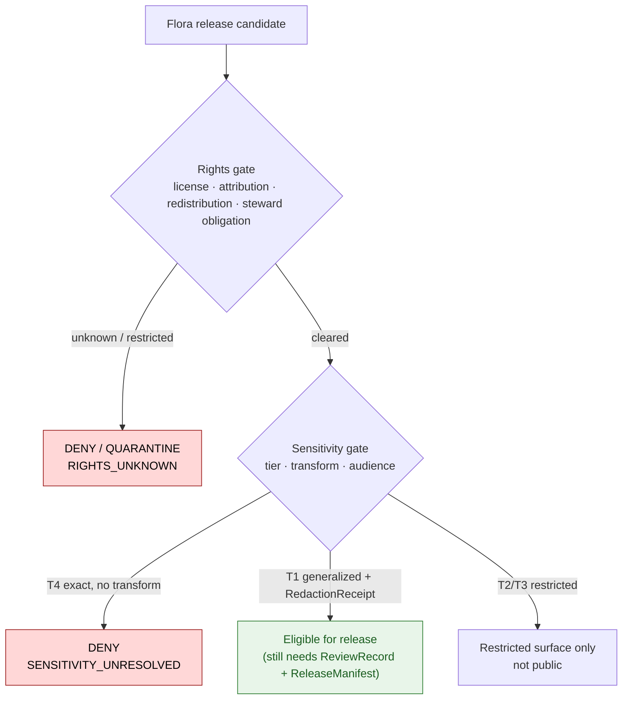
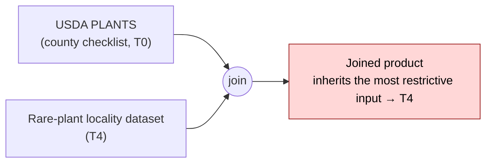

<!-- [KFM_META_BLOCK_V2]
doc_id: kfm://doc/flora-rights-and-sensitivity
title: Flora — Rights & Sensitivity
type: standard
version: v1
status: draft
owners: Domain steward (Flora); Sensitivity reviewer; Rights reviewer; Docs steward
created: 2026-06-03
updated: 2026-06-03
policy_label: public
related: [docs/doctrine/ai-build-operating-contract.md, docs/doctrine/directory-rules.md, docs/domains/flora/README.md, docs/domains/flora/PUBLICATION_AND_ROLLBACK.md, policy/sensitivity/flora/, policy/domains/flora/, schemas/contracts/v1/receipts/]
tags: [kfm]
notes: [Doctrine-adjacent; pins CONTRACT_VERSION = "3.0.0". Flora-lane rights, sensitivity-tier, geoprivacy-transform, and CARE/sovereignty contract. Disposition defers to operating contract §23.2; tier scheme defers to ADR-S-05. All repo-state paths PROPOSED until mounted-repo verification.]
[/KFM_META_BLOCK_V2] -->

# 🌿 Flora — Rights & Sensitivity

> How the Flora lane decides what may be shown, to whom, at what precision — and what receipts, reviews, and rights checks a release must carry. Rare plants fail closed by default; public surfaces see only the safest representation that still answers a reasonable question.

| Field | Value |
|---|---|
| **Status** | `draft` |
| **Owners** | Domain steward (Flora) · Sensitivity reviewer · Rights reviewer · Docs steward |
| **Last updated** | 2026-06-03 |
| **Contract** | `CONTRACT_VERSION = "3.0.0"` |
| **Disposition authority** | Operating contract §23.2 sensitive-domain matrix (not re-derived here) |
| **Tier scheme authority** | Atlas §24.5 / `ADR-S-05` (PROPOSED until ratified) |
| **Repo home (PROPOSED)** | `docs/domains/flora/RIGHTS_AND_SENSITIVITY.md` |

> [!CAUTION]
> **Exact rare, protected, or culturally sensitive plant locations are denied on public surfaces by default (T4).** Public release requires steward review, generalized or withheld geometry, **and** a `RedactionReceipt`. This doc explains the rules; it does not grant exceptions and does not re-derive disposition — that routes through operating contract §23.2 and `policy/sensitivity/flora/`.

---

## Quick jump

- [1. Scope](#1-scope)
- [2. Repo fit](#2-repo-fit)
- [3. Two gates: rights and sensitivity](#3-two-gates-rights-and-sensitivity)
- [4. Rights model](#4-rights-model)
- [5. Sensitivity tiers (T0–T4)](#5-sensitivity-tiers-t0t4)
- [6. Flora tier assignments](#6-flora-tier-assignments)
- [7. Tier transitions](#7-tier-transitions)
- [8. Geoprivacy transforms](#8-geoprivacy-transforms)
- [9. The RedactionReceipt](#9-the-redactionreceipt)
- [10. CARE, sovereignty & culturally sensitive plants](#10-care-sovereignty--culturally-sensitive-plants)
- [11. Join-induced sensitivity](#11-join-induced-sensitivity)
- [12. Negative states surfaced to users](#12-negative-states-surfaced-to-users)
- [13. Validation & fixtures](#13-validation--fixtures)
- [Open questions register](#open-questions-register)
- [Open verification backlog](#open-verification-backlog)
- [Changelog v0 → v1](#changelog-v0--v1)
- [Definition of done](#definition-of-done)
- [Related docs](#related-docs)

---

## 1. Scope

This document is the **rights and sensitivity contract** for the Flora domain lane. It governs two questions the release gate must answer before any Flora claim reaches a public surface:

1. **May we show this at all?** — a *rights* question (license, attribution, redistribution, steward obligation).
2. **At what precision, and to whom?** — a *sensitivity* question (tier, transform, audience).

**In scope:** the rights model for Flora sources; the T0–T4 tier scheme as applied to Flora; default tiers for Flora object families; allowed tier transitions; the geoprivacy transform vocabulary; the `RedactionReceipt`; CARE / tribal-sovereignty handling of culturally significant plants; join-induced sensitivity; and the negative states users see when a request is denied or generalized.

**Out of scope** (owned elsewhere; cite, do not restate):
- The release gate mechanics and rollback → `docs/domains/flora/PUBLICATION_AND_ROLLBACK.md`.
- Source families and identity → `docs/domains/flora/README.md`.
- The canonical disposition matrix → operating contract §23.2 (this doc applies it, never overrides it).
- The tier scheme's ratification → `ADR-S-05`.

> [!IMPORTANT]
> **Source quality never overrides sensitivity.** A rare-plant record can be perfectly sourced, rights-clean, and validated — and still be unpublishable at exact precision. Public exposure is a governed state, not a reward for data quality. *(CONFIRMED posture — `KFM-P25-IDEA-0006`; Atlas, Flora §I.)*

[↑ Back to top](#top)

---

## 2. Repo fit

This is a `docs/` lane segment, not a root-level folder (Directory Rules §12). The **decisions** it explains live in `policy/`; the **receipts** it requires live under `data/` and `schemas/contracts/v1/receipts/`.

| Concern | Owning root | Flora-lane segment (PROPOSED) |
|---|---|---|
| Human explanation (this doc) | `docs/` | `docs/domains/flora/RIGHTS_AND_SENSITIVITY.md` |
| Sensitivity / geoprivacy decisions | `policy/` | `policy/sensitivity/flora/` |
| Rights / admissibility decisions | `policy/` | `policy/domains/flora/rights/` |
| License mapping | `policy/` | `policy/domains/flora/rights/license_map.json` |
| Sensitive-taxa gate list | `policy/` | `policy/sensitivity/flora/sensitive_taxa.txt` |
| RedactionReceipt schema | `schemas/` | `schemas/contracts/v1/receipts/redaction_receipt.schema.json` |
| Rights / sensitivity fixtures | `fixtures/` | `fixtures/domains/flora/` |
| Sensitivity-denial tests | `tests/` | `tests/domains/flora/` |

> [!WARNING]
> Every path above is **PROPOSED** until verified against a mounted repository. The **rules** (which root owns which concern) are CONFIRMED doctrine; the **presence** of any specific path is not. *(Directory Rules §0 — "Authority of any specific path quoted here: Mixed … PROPOSED until verified.")*

[↑ Back to top](#top)

---

## 3. Two gates: rights and sensitivity

Rights and sensitivity are **distinct, independently fail-closed checks**. A Flora claim must clear *both* before publication; passing one does not relax the other. *(CONFIRMED — `KFM-P1-PROG-0032`: "Rights checks should be distinct from technical availability checks and should fail closed when terms are unknown.")*

> [!NOTE]
> **Unclear rights, unresolved source role, missing evidence, unresolved sensitivity, or absent release state blocks public promotion.** All five are independent fail-closed conditions at the release gate. *(CONFIRMED — Atlas, Flora §I.)*

[↑ Back to top](#top)

---

## 4. Rights model

Before a Flora source is activated *and* before any derivative is published, rights are checked: license, attribution, redistribution terms, endpoint terms, and steward obligations. The check fails closed when terms are unknown. *(CONFIRMED — `KFM-P1-PROG-0032` rights/source-terms gate.)*

### 4.1 Rights status vocabulary

A `license_map.json` maps each source's license to an allowed-flag and the evidence obligations it carries. *(PROPOSED — `KFM-P26-PROG-0021`.)*

| Rights status | Public release? | Obligation |
|---|---|---|
| `CC0` | Allowed | None beyond standard citation. |
| `CC-BY` | Allowed | Attribution required and displayed. |
| `attribution-required` | Allowed | Named attribution carried end-to-end. |
| `restricted` | **DENY** by default | Named agreement / authorized surface only. |
| `unknown` | **DENY** (fail closed) | Resolve terms before activation. |

> [!IMPORTANT]
> The Atlas marks every Flora source family's rights and current terms `NEEDS VERIFICATION`. **No specific license string is asserted in this doc.** A license value (e.g. a particular CC-BY version for a herbarium IPT) MUST be confirmed against the upstream dataset record and recorded in the `SourceDescriptor` before it is treated as fact. *(CONFIRMED posture — Atlas, Flora §D.)*

### 4.2 Rights carried end-to-end

`license`, `rightsHolder`, and `datasetID` are carried from RAW capture through every derivative, so a published Flora layer can name its rights basis. A `LayerManifest` for a public Flora layer SHOULD include `attribution`, `license_spdx`, and `rights_statement`; **rights unknown blocks release.** *(CONFIRMED — `KFM-P2-PROG-0002` normalization carries license/rightsHolder/datasetID; `ML-064-107` rights metadata blocks release when unknown.)*

[↑ Back to top](#top)

---

## 5. Sensitivity tiers (T0–T4)

KFM publishes only the **safest representation that still answers the steward's and the public's reasonable needs.** The tier scheme makes "publish at tier N" a reviewable, repeatable action. *(CONFIRMED doctrine — Atlas §24.5; tier definitions PROPOSED pending `ADR-S-05`.)*

| Tier | Name | Definition | Default audience |
|---|---|---|---|
| `T0` | Open | Public-safe with no transform; no rights/sensitivity/steward gating beyond standard release. | Any public client via governed API. |
| `T1` | Generalized | Public-safe only after generalization, fuzzing, aggregation, or redaction; transform reviewed and recorded. | Any public client via governed API. |
| `T2` | Reviewer | Released only to authenticated reviewers or domain stewards; policy-bounded; correction path active. | Stewards, reviewers, named research collaborators. |
| `T3` | Restricted | Released only under named agreement (rights, sovereignty, or consent) and recorded. | Named authorized parties only. |
| `T4` | Denied | Not released to any audience; the *existence* of a record may be released only as steward review permits. | — |

[↑ Back to top](#top)

---

## 6. Flora tier assignments

Default tiers for Flora object classes. These extend the Atlas §20.5 deny register with explicit tiers; they are PROPOSED pending `ADR-S-05`. *(Atlas §24.5.2; object-family defaults §24.14.)*

| Flora object class | Default tier | Allowed transform → target | Required gates |
|---|---|---|---|
| Rare / protected / culturally sensitive plant location | **T4** | Generalized geometry + steward review → **T2 or T1** | `RedactionReceipt` + `ReviewRecord` |
| `RarePlantRecord` (object family) | **T4** | Public-safe derivative only, via generalization → **T1** | `RedactionReceipt` + `ReviewRecord` |
| `RangePolygon` | **T1** | Aggregate / generalized public-safe layer | `AggregationReceipt` or `RedactionReceipt` |
| Common-species occurrence (non-sensitive) | `T0`/`T1` | None, or generalization where uncertainty warrants | Standard Gates A–G |
| `VegetationCommunity` polygon | `T0`/`T1` | Generalization where rights/source require | Standard Gates A–G; rights check |
| `DistributionSurface` (modeled) | `T1` | Model-card + uncertainty surface; `modeled` role preserved | `ModelRunReceipt` |

> [!CAUTION]
> **A rare-plant location starts at T4 — denied to all audiences — and only a documented transform plus a steward review can move it toward public.** The default is *not* "show generalized"; the default is *deny*, and generalization is the exception that must be earned with a receipt and a review. *(CONFIRMED — Atlas §24.5.2 Flora row; §20.5 Flora deny register.)*

[↑ Back to top](#top)

---

## 7. Tier transitions

Tier motion is governed and **reversible**. The asymmetry is the key rule: **moving toward more-public always needs both a transform receipt and a review record; moving toward less-public needs only a `CorrectionNotice`.** *(CONFIRMED doctrine — Atlas §24.5.3.)*

| From → To | Required artifact | Required reviewer | Reversibility |
|---|---|---|---|
| `T4 → T3` | `PolicyDecision` + `ReviewRecord` + agreement | Steward + rights-holder where applicable | Agreement revocation returns object to T4 with `CorrectionNotice`. |
| `T4 → T2` | `PolicyDecision` + `ReviewRecord` | Steward | Review revocation returns object to T4. |
| `T4 → T1` | `RedactionReceipt` + `ReviewRecord` | Steward | Redaction can be re-evaluated; correction may demote a published T1 to T4. |
| `T3 → T2` | `PolicyDecision` + `ReviewRecord` | Steward | Reversible. |
| `T2 → T1` | `RedactionReceipt` + `ReviewRecord` | Steward | Reversible. |
| `T1 → T0` | `ReleaseManifest` + `ReviewRecord` | Steward + release authority | Reversible via `RollbackCard`. |
| **Any tier → T4** (downgrade) | `CorrectionNotice` + `ReviewRecord` | Steward + rights-holder where applicable | Always permitted; precedes derivative invalidation. |

> [!TIP]
> The downgrade path is the safety valve: if rights change, a source is reclassified, or harm potential is discovered, **any** Flora object can be pulled back to T4 with a `CorrectionNotice` alone — no transform receipt required. Restriction is always cheaper than exposure.

[↑ Back to top](#top)

---

## 8. Geoprivacy transforms

When a steward authorizes moving a rare-plant object toward public, the geometry is transformed and the transform is recorded. Each transform emits a receipt. *(CONFIRMED posture — `KFM-P1-PROG-0035` rare-species geoprivacy and transform receipts; `KFM-P26-PROG-0022` sensitive-taxa gate requires `public_safe_geometry` + recorded reason.)*

| Transform (PROPOSED vocabulary) | Effect | Typical target tier |
|---|---|---|
| `suppress` | No public geometry; metadata only with regional envelope. | T1 (metadata) / T4 (full) |
| `generalize_to_grid` | Coarsen to a documented grid cell. | T1 |
| `generalize_to_watershed` | Snap to HUC / watershed unit. | T1 |
| `generalize_to_county` | Coarsen to county. | T1 |
| `buffer` / `jitter` (constrained) | Offset within a documented radius — only when scientific value justifies it. | T1 |
| `delayed_publication` | Stage release tied to review state and freshness window. | T1/T2 |
| `steward_only` | Exact geometry available only to authorized stewards; never on a public route. | T2/T3 |

> [!NOTE]
> The transform vocabulary is **PROPOSED** and should be frozen by an ADR (see Open Questions). A generalization radius / grid size per sensitivity class is itself a policy value that `policy/sensitivity/flora/` must carry — it is not hard-coded here. *(NEEDS VERIFICATION — generalization thresholds per taxon class.)*

[↑ Back to top](#top)

---

## 9. The RedactionReceipt

Every public-safe transform of sensitive Flora content emits a **`RedactionReceipt`** — without it, the transform did not happen in the governed sense. *(CONFIRMED doctrine — Atlas §24.2 "if no receipt exists, the operation did not happen in the governed sense.")*

**Purpose:** records a public-safe transformation that removed, masked, fuzzed, or withheld content for sensitivity, rights, or policy. **Triggered by:** rare-species occurrences (among other sensitive-domain publications). *(CONFIRMED — Atlas §24.2.1 RedactionReceipt row, cites `[DOM-FLORA]`.)*

| Field (PROPOSED shape) | Meaning |
|---|---|
| `policy_ref` | The `policy/sensitivity/flora/` rule that authorized the transform. |
| `redaction_method` | The transform applied (from §8 vocabulary). |
| `kept_fields` | Fields retained in the public-safe output. |
| `removed_fields` | Fields withheld or masked. |
| `geometry_transform` | The geometry operation and parameters (e.g. grid cell, buffer radius). |
| `reviewer` | The steward / sensitivity reviewer who approved it. |

> [!IMPORTANT]
> The `RedactionReceipt` is part of the `EvidenceBundle` lineage and is referenced by the `ReleaseManifest`. A public Flora layer derived from sensitive input that **lacks** a resolvable `RedactionReceipt` fails the release gate closed (`MISSING_RECEIPT`). *(CONFIRMED — Atlas §24.6.1 validation row "RedactionReceipt if sensitivity applies"; §24.6.3 reason code.)*

[↑ Back to top](#top)

---

## 10. CARE, sovereignty & culturally sensitive plants

Culturally significant plants — tribally important, ceremonial-use, or otherwise steward-governed taxa — are governed under CARE principles and tribal-sovereignty rules, **not** treated as ordinary rare-species records. *(CONFIRMED posture — `KFM-P1-IDEA-0034` cultural/tribal/sacred/steward review controls; `KFM-P11-PROG-0024` CARE promotion-gate fail-closed bundle.)*

- **Steward + rights-holder review is required**, not just a domain steward. Cultural, tribal, sacred, and steward-governed material requires review and public-safe transformation before release.
- **Sovereignty-label inheritance.** Flora artifacts whose areas of interest intersect tribal / AIANNH / BIA overlays SHOULD inherit `sovereignty:tribal` and sensitivity labels — or require a signed, time-boxed waiver — before promotion. *(PROPOSED — `KFM-P11-PROG-0025`.)*
- **CARE-aligned promotion gate.** Promotion manifests are blocked when exposure intersects sensitive or sovereign contexts unless CARE-aligned labels, consent, and current waiver evidence are present. Deny-by-default holds where evidence is missing. *(PROPOSED — `KFM-P11-PROG-0024`.)*
- **Map / narrative discipline.** Map assets carrying culturally sensitive plant content require CARE status blocks (public / generalized / restricted) with reviewers and review dates; story narratives use context-only spatial footprints, never precise site disclosure. *(CONFIRMED — `ML-059-029`, `ML-059-015`.)*

> [!CAUTION]
> Where rights, sovereignty, or cultural sensitivity are **unclear**, the default is quarantine, redaction, generalization, staged access, delayed publication, or denial — not publication. Record the transform and the reason. *(CONFIRMED — operating contract §23.2 default disposition.)*

[↑ Back to top](#top)

---

## 11. Join-induced sensitivity

A benign Flora source can become sensitive **when joined** with another source. Sensitivity is a property of the **resulting product**, not only of the inputs. *(Aligns with `ADR-S-14` cross-lane join policy, OPEN.)*

A join that creates new sensitivity must clear the same gates as the **most sensitive input**, and route through a sensitivity reviewer. Examples for Flora: joining a public checklist to a rare-plant locality; joining an iNaturalist coordinate to a small-population polygon; joining a herbarium record to an unprotected micro-habitat. *(CONFIRMED posture — Atlas source-role anti-collapse; operating contract §23.2.)*

[↑ Back to top](#top)

---

## 12. Negative states surfaced to users

When a request is denied or generalized, the user sees a **visible** negative state — never a silent empty result. This lets users tell "we don't know" from "we know but cannot show." *(CONFIRMED — Unified Doctrine Synthesis §19; operating contract §22.2.)*

| Negative state | Meaning for Flora |
|---|---|
| `DENIED_BY_POLICY` | Rights / sensitivity / release blocks display (e.g. exact rare-plant location). |
| `GENERALIZED_GEOMETRY` | Geometry transformed for public safety; links to the `RedactionReceipt`. |
| `RESTRICTED_ACCESS` | Material exists but is T2/T3/T4; not available to this audience. |
| `MISSING_EVIDENCE` | No `EvidenceBundle` resolves for the Flora claim. |
| `SOURCE_STALE` | Source freshness exceeded; rights or sensitivity may need re-review. |

[↑ Back to top](#top)

---

## 13. Validation & fixtures

These Flora-lane checks are **PROPOSED** until proven against fixtures and a mounted repo. *(Atlas, Flora §K; geoprivacy cards `KFM-P1-PROG-0035`, `KFM-P26-PROG-0022`.)*

- [ ] Rights gate: `unknown` / `restricted` license **blocks** release (fail-closed) (PROPOSED).
- [ ] `license_map.json` maps each Flora source to an allowed-flag + obligation (PROPOSED).
- [ ] Sensitive-taxa gate: a taxon on `sensitive_taxa.txt` forces `public_safe_geometry` and a recorded reason (PROPOSED).
- [ ] Exact sensitive public-geometry **denial** test (PROPOSED).
- [ ] `RedactionReceipt` validation: `policy_ref`, `redaction_method`, `kept_fields`, `removed_fields`, `geometry_transform`, `reviewer` present (PROPOSED).
- [ ] Tier-transition test: `T4 → T1` requires `RedactionReceipt` **and** `ReviewRecord` (PROPOSED).
- [ ] Downgrade test: `Any → T4` succeeds with `CorrectionNotice` alone (PROPOSED).
- [ ] Join-induced sensitivity test: joined product inherits the most restrictive input tier (PROPOSED).
- [ ] CARE / sovereignty test: AOI intersecting a tribal overlay inherits `sovereignty:tribal` or requires a waiver (PROPOSED).

[↑ Back to top](#top)

---

## Open questions register

| ID | Question | Owner role | Resolution path |
|---|---|---|---|
| OQ-FLORA-RS-01 | What generalization radius / grid size applies per rare-plant sensitivity class? | Sensitivity reviewer | `policy/sensitivity/flora/` + `ADR-S-05` |
| OQ-FLORA-RS-02 | Is the geoprivacy transform vocabulary (§8) frozen, and where does it live? | Domain steward (Flora) | ADR enumerating transform types |
| OQ-FLORA-RS-03 | Where does culturally sensitive plant knowledge sit in the tier matrix, and what review path (tribal/cultural reviewer) applies? | Domain steward + rights-holder rep | §23.2 matrix + `KFM-P11-PROG-0025` ratification |
| OQ-FLORA-RS-04 | How are restricted-use datasets (Kansas Natural Heritage Inventory localities, NatureServe Explorer Pro) modeled — descriptor class, policy class, or both? | Rights reviewer | `SourceDescriptor` schema + `policy/sensitivity/flora/` |
| OQ-FLORA-RS-05 | What is the `RedactionReceipt` schema home — `schemas/contracts/v1/receipts/` or domain-scoped? | Docs steward | `ADR-S-03` (receipt-class home) |
| OQ-FLORA-RS-06 | Which sensitivity tier do unprotected-but-rare taxa receive when no listing status exists? | Sensitivity reviewer | `ADR-S-05` + steward policy |

## Open verification backlog

These items remain `NEEDS VERIFICATION` before promotion from `draft` to `published`:

1. Presence and contents of `policy/sensitivity/flora/` and `policy/domains/flora/rights/`.
2. Existence of `license_map.json` and `sensitive_taxa.txt` (or their canonical equivalents).
3. `RedactionReceipt` schema home and field names against the mounted repo.
4. Tier scheme (T0–T4) ratification status (`ADR-S-05`).
5. Generalization thresholds per Flora sensitivity class.
6. CARE / sovereignty-label inheritance implementation (`KFM-P11-PROG-0025`).

## Changelog v0 → v1

| Change | Type (per contract §37) | Reason |
|---|---|---|
| Initial Flora rights & sensitivity contract | new | First lane-specific rights/tier/geoprivacy/CARE doc for Flora. |
| Separated rights gate from sensitivity gate as independent fail-closed checks | clarification | `KFM-P1-PROG-0032` treats them as distinct. |
| Restated §23.2 disposition and §24.5 tiers without re-deriving them | clarification | Defer disposition to the operating contract; tiers to `ADR-S-05`. |
| Pinned `CONTRACT_VERSION = "3.0.0"` | housekeeping | Doctrine-adjacent doc requirement. |

> **Backward compatibility.** New doc; no prior anchors to break. Section anchors are intended to be stable. Future changes follow operating contract §37 (default MINOR bump for non-operating-law edits).

## Definition of done

This document is done enough to enter the repository when:

- it is placed according to Directory Rules (`docs/domains/flora/`);
- a docs steward, the Flora domain steward, and a sensitivity reviewer review it;
- it is linked from the Flora README and a doctrine/sensitivity index;
- it does not conflict with accepted ADRs (`ADR-S-03` receipt home, `ADR-S-04` source-role, `ADR-S-05` tiers, `ADR-S-14` joins);
- any conflict with current repo conventions is logged in `docs/registers/DRIFT_REGISTER.md`;
- the `GENERATED_RECEIPT.json` planned in the authoring notes is wired into CI;
- future changes follow operating contract §37 lifecycle.

---

## Related docs

- [`docs/doctrine/ai-build-operating-contract.md`](../../doctrine/ai-build-operating-contract.md) — operating law; §23.2 sensitive-domain matrix (`CONTRACT_VERSION = "3.0.0"`)
- [`docs/doctrine/directory-rules.md`](../../doctrine/directory-rules.md) — placement authority
- [`docs/domains/flora/README.md`](./README.md) — Flora domain landing page
- [`docs/domains/flora/PUBLICATION_AND_ROLLBACK.md`](./PUBLICATION_AND_ROLLBACK.md) — Flora release / correction / rollback contract
- `policy/sensitivity/flora/` — Flora sensitivity / geoprivacy rules *(PROPOSED / TODO)*
- `policy/domains/flora/rights/` — Flora rights / license decisions *(PROPOSED / TODO)*
- `schemas/contracts/v1/receipts/redaction_receipt.schema.json` — `RedactionReceipt` schema *(PROPOSED — `ADR-S-03`)*

_Last updated: 2026-06-03 · `CONTRACT_VERSION = "3.0.0"`_

[↑ Back to top](#top)
