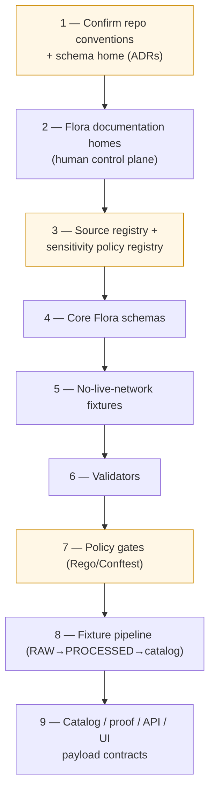
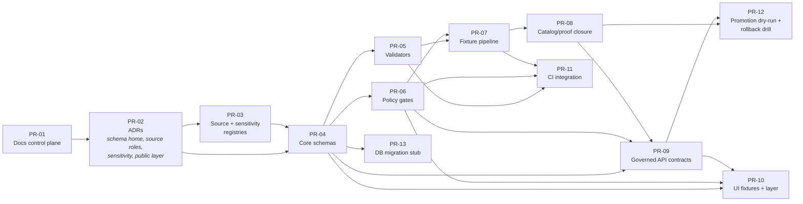

<!-- [KFM_META_BLOCK_V2]
doc_id: kfm://doc/flora-roadmap
title: Kansas Frontier Matrix — Flora Domain Roadmap
type: standard
version: v0.1
status: draft
owners: <flora-steward — TBD>
created: 2026-05-08
updated: 2026-05-08
policy_label: public
related:
  - docs/domains/flora/README.md
  - docs/domains/flora/ARCHITECTURE.md
  - docs/domains/flora/CURRENT_STATE.md
  - docs/domains/flora/SOURCE_REGISTRY.md
  - docs/domains/flora/DATA_MODEL.md
  - docs/domains/flora/PIPELINES_AND_LIFECYCLE.md
  - docs/domains/flora/PUBLICATION_AND_POLICY.md
  - docs/domains/flora/UI_AND_EVIDENCE_DRAWER.md
  - docs/domains/flora/VERIFICATION_BACKLOG.md
  - docs/domains/flora/CHANGELOG.md
  - docs/domains/flora/FILE_MANIFEST.md
  - docs/domains/flora/IDEA_INTAKE.md
  - docs/adr/ADR-flora-schema-home.md
  - docs/adr/ADR-flora-source-roles.md
  - docs/adr/ADR-flora-sensitive-location-policy.md
  - docs/adr/ADR-flora-public-layer-strategy.md
tags: [kfm, flora, roadmap, planning, governance, thin-slice]
notes:
  - "Sequenced PR plan and dependency order for the Flora lane."
  - "All repo paths are PROPOSED until the real repo is mounted and conventions are verified."
  - "Source: KFM Flora Architecture PDF-Only Implementation Blueprint, §19, §20, §22, §23, §24."
[/KFM_META_BLOCK_V2] -->

# Kansas Frontier Matrix — Flora Domain Roadmap

> Sequenced PR plan and dependency order for the **Flora** lane — evidence-first, map-first, time-aware, governed, auditable, reversible.

<!-- Badges are placeholders until repo conventions, owners, and CI targets are verified. -->

> [!IMPORTANT]
> **Truth posture for this document.** The repository is not mounted in the session that produced this roadmap. Every path, package choice, schema home, framework binding, CI command, and route name below is **PROPOSED** until verified against the live repository and applicable ADRs. Do not treat this roadmap as a description of the *current* repo — it describes the **intended sequence** of small, reversible PRs that will land the lane.

**Quick jump:** [Goals](#1-goals--non-goals) · [Status](#2-status-snapshot) · [Decisions first](#3-decisions-that-must-land-before-machine-files) · [Thin slice](#4-thin-slice-build-plan-the-spine) · [PR sequence](#5-pr-sequence) · [Dependency graph](#6-dependency-graph) · [Priorities](#7-priority-bands-and-acceptance-gates) · [Risk & rollback](#8-risk-and-rollback-posture) · [Backlog](#9-verification-backlog) · [Companion docs](#10-companion-docs)

---

## 1. Goals & Non-Goals

### Goals

The Flora lane ingests, normalizes, validates, catalogs, publishes, explains, reviews, corrects, and rolls back flora information while preserving **source roles, rights, sensitivity, time semantics, taxonomic uncertainty, spatial uncertainty, and release state**. Every consequential outward Flora claim should be reconstructable to source descriptors, EvidenceRefs, EvidenceBundles, policy decisions, review state, catalog records, and correction lineage.

This roadmap delivers that lane through **small, reversible PRs** ordered so that the **human control plane** (docs, ADRs, registries) lands before machine artifacts, and **policy and rights gates** land before any source activation.

### Non-Goals

> [!WARNING]
> The first slice **does not** start with live rare-plant data, broad source activation, public publication of occurrences, AI/Focus Mode answers about restricted taxa, or precise sensitive geometry on any public layer. These are downstream, gated, and only enabled after the upstream PRs ship and ADRs settle.

| Out of scope for the thin slice | Why |
|---|---|
| Live external source pulls in CI | CI runs no-live-network only until probe receipts and rights are verified. |
| Public release of exact rare-plant points | Requires `ADR-flora-sensitive-location-policy` + `policy/flora/sensitivity.rego` + steward review. |
| AI explanation over unreleased candidates | Focus Mode reads released evidence only; runs after policy pre/postchecks. |
| Cross-domain join promotion (habitat, fauna) | Derived joins remain derived; promotion is a governed transition, not a PR side effect. |
| Parallel schema home (`contracts/` *and* `schemas/contracts/v1/`) | Resolved by `ADR-flora-schema-home` before any machine-file proliferation. |

---

## 2. Status Snapshot

| Item | Status | Source |
|---|---|---|
| Mounted repository visible to this run | `UNKNOWN` (absent in the session that produced the Flora blueprint) | Flora blueprint §1, §23 |
| Schema home (`contracts/flora` vs `schemas/contracts/v1/flora`) | `CONFLICTED` — needs ADR | Flora blueprint §18, §23 |
| Existing shared governance objects (`SourceDescriptor`, `EvidenceBundle`, `DecisionEnvelope`, `ReleaseManifest`, `CatalogMatrix`) | `UNKNOWN` — reuse if present, else PROPOSED Flora contracts | Flora blueprint §2, App. C |
| Package manager / CI framework | `UNKNOWN` | Flora blueprint §23 |
| OPA / Conftest / Rego version | `UNKNOWN` | Flora blueprint §23 |
| MapLibre shell path | `UNKNOWN` | Flora blueprint §23 |
| Governed API framework / route home | `UNKNOWN` | Flora blueprint §23 |
| Steward / CODEOWNERS for flora | `UNKNOWN` | Flora blueprint §23 |
| Source endpoint verification (rights, terms, cadence, checksum) | `NEEDS VERIFICATION` | Flora blueprint §23 |
| Rare-plant / cultural sensitivity thresholds | `NEEDS VERIFICATION` | Flora blueprint §12, §23 |

> [!NOTE]
> Promote a row from `PROPOSED` / `UNKNOWN` / `NEEDS VERIFICATION` to `CONFIRMED` only after this session has touched the actual repo evidence. Do not flip a status by recollection.

---

## 3. Decisions That Must Land Before Machine Files

Four ADRs gate every machine artifact in this lane. They are sequenced before contracts, validators, policies, fixtures, pipelines, API routes, and UI layers.

| Order | ADR | What it resolves | Blocks if unresolved |
|---|---|---|---|
| D-1 | `docs/adr/ADR-flora-schema-home.md` | `contracts/flora/` vs `schemas/contracts/v1/flora/` — single canonical home, aliases only if needed | All machine schema PRs |
| D-2 | `docs/adr/ADR-flora-source-roles.md` | Locks the role vocabulary: `official`, `institutional`, `steward_reviewed`, `corroborative`, `community_observation`, `controlled_access`, `derived_model`, `generalized_public_surface` | Source registry, rights/sensitivity validators |
| D-3 | `docs/adr/ADR-flora-sensitive-location-policy.md` | Exact-vs-public geometry thresholds by status / source / cultural class | Public layer PR, `policy/flora/sensitivity.rego`, public release |
| D-4 | `docs/adr/ADR-flora-public-layer-strategy.md` | MapLibre public layer strategy and generalization recipe | UI layer PR, `flora_layer_descriptor` schema |

> [!CAUTION]
> No machine-file PR may land before its gating ADR. **Skipping an ADR is the failure mode.** It produces parallel authorities, silent schema drift, and unreviewed policy bypasses — all of which the lifecycle invariants forbid.

---

## 4. Thin-Slice Build Plan (the spine)

This is the smallest *safe* first slice. It establishes contracts, fixtures, validators, and policy gates **without** touching live sources or public artifacts.

**Why this order, and what each step *gates*:**

| # | Step | Why first / gate |
|---|---|---|
| 1 | Confirm repo conventions and schema home | Avoid duplicate authority; ADR before paths. |
| 2 | Create or extend Flora documentation homes | Human control plane before machine files. |
| 3 | Create source registry and sensitivity policy registry | Policy and rights gates need inputs *before* ingestion. |
| 4 | Add core Flora schemas | Contracts before implementation. |
| 5 | Add no-live-network fixtures | CI runs without external source fragility. |
| 6 | Add validators | Deterministic checks land before policy logic depends on them. |
| 7 | Add policy gates (Rego, Conftest, or repo equivalent + Python parity if needed) | Missing policy evidence must fail closed. |
| 8 | Add fixture pipeline (no live network) | Smoke-test RAW→PROCESSED→catalog closure on fixtures only. |
| 9 | Add catalog / proof / API / UI payload contracts | Trust membrane between canonical truth and public clients. |

---

## 5. PR Sequence

Each row is one merge unit: small, reviewable, reversible, and bounded by an exit criterion. PRs map onto the spine in §4 and obey the Directory Rules constraint that **domain materials belong under responsibility roots**, not as new root folders.

> [!NOTE]
> Paths use `<schema-home>` to mark where the `ADR-flora-schema-home` decision applies. Replace with the ADR-selected home before the PR lands. Treat the `<governed-api>` and `<map-shell>` tokens the same way — bind to actual repo paths only after inspection.

### PR-01 — Documentation control plane

| Field | Value |
|---|---|
| **Scope** | `docs/domains/flora/{README,ARCHITECTURE,CURRENT_STATE,SOURCE_REGISTRY,DATA_MODEL,PIPELINES_AND_LIFECYCLE,PUBLICATION_AND_POLICY,UI_AND_EVIDENCE_DRAWER,VERIFICATION_BACKLOG,CHANGELOG,ROADMAP,FILE_MANIFEST,GLOSSARY,IDEA_INTAKE}.md` |
| **Risk** | Low (no code paths active) |
| **Exit criterion** | Docs lint passes; truth-label review passes; anti-fragmentation check (no parallel doc authorities). |
| **Rollback** | Revert PR; preserve any superseded docs as `SUPERSEDED` rather than deleting. |
| **Priority** | P1 for the roadmap doc itself; the wave is P0–P2 mixed. |

### PR-02 — Decision ADRs

| Field | Value |
|---|---|
| **Scope** | `docs/adr/ADR-flora-schema-home.md`, `…-source-roles.md`, `…-sensitive-location-policy.md`, `…-public-layer-strategy.md` |
| **Risk** | Low (text-only) but gating |
| **Exit criterion** | All four ADRs accepted; status set to `Accepted`; cross-links from the relevant docs land in the same PR. |
| **Rollback** | Mark ADR `SUPERSEDED` with a follow-up ADR; never silently delete a decision record. |
| **Priority** | **P0 — blocks every machine PR** |

### PR-03 — Source registry & sensitivity registry

| Field | Value |
|---|---|
| **Scope** | `data/registry/flora/{sources,source_roles,sensitivity_policies,taxon_authorities,layer_registry,rights_profiles}.yaml` |
| **Risk** | Medium — defines what is *eligible* to be ingested, but ingests nothing |
| **Exit criterion** | Each descriptor declares `source_role`, `rights_license_terms`, `sensitivity_posture`, `public_publication_eligibility`, `verification_status`. Unknowns fail closed. |
| **Rollback** | Revert descriptor; mark source `disabled`/`unverified`; preserve any probe receipt as process memory. |
| **Priority** | P0 |

### PR-04 — Core Flora schemas

| Field | Value |
|---|---|
| **Scope** (under `<schema-home>/flora/`) | `flora_taxon`, `flora_taxon_crosswalk`, `flora_occurrence`, `flora_specimen`, `flora_source_descriptor`, `flora_redaction_receipt`, `flora_evidence_bundle`, `flora_decision_envelope`, `flora_release_manifest`, `flora_catalog_matrix`, `flora_promotion_candidate`, `flora_layer_descriptor`, `flora_focus_payload`, `flora_evidence_drawer_payload`, `flora_runtime_response_envelope` |
| **Risk** | Medium — contracts surface before behavior |
| **Exit criterion** | `valid` and `invalid` fixtures pass under the schema validator. Reuse shared governance objects (`SourceDescriptor`, `EvidenceBundle`, `DecisionEnvelope`, `ReleaseManifest`, `CatalogMatrix`) wherever they exist; only introduce a Flora-specific schema if the shared object lacks a required domain field. |
| **Rollback** | Pin prior schema version; introduce `v1.0.1` compatibility note rather than overwriting. |
| **Priority** | P0 (core) · P1 (community / range / habitat-association) · P2 (phenology product) |

### PR-05 — Validators & local runner

| Field | Value |
|---|---|
| **Scope** | `tools/validators/flora/{validate_source_descriptors,validate_schema_fixtures,validate_rights,validate_sensitivity_public_surface,validate_catalog_matrix,validate_evidence_bundle,validate_release_manifest,validate_api_payloads,validate_focus_payload,run_all}.py`; `tools/diff/flora/compare_source_snapshots.py`; `tools/ci/render_flora_summary.py` |
| **Risk** | Low (offline checks) |
| **Exit criterion** | `run_all.py` returns non-zero on every negative fixture; reviewer summary renders for a synthetic PR. |
| **Rollback** | Disable workflow invocation first; patch validator with a fixture proving the expected denial/allow. |
| **Priority** | P0 |

### PR-06 — Policy gates

| Field | Value |
|---|---|
| **Scope** | `policy/flora/{publish,sensitivity,rights,taxon,catalog,ai,promotion,review}.rego` (or repo-standard equivalent) plus Python parity tests if Rego/Conftest are not yet installable. |
| **Risk** | Medium — controls publication and AI/Focus authority |
| **Exit criterion** | Negative tests deny: precise sensitive geometry on a public payload, missing evidence refs, unknown rights, unknown authority source, AI answer without citations. |
| **Rollback** | Disable new route/layer first; **never** delete receipts/proofs to recover from a too-strict policy. |
| **Priority** | P0 |

### PR-07 — No-live-network fixture pipeline

| Field | Value |
|---|---|
| **Scope** | `pipelines/flora/fixture_pipeline.py`, `pipelines/flora/source_probe.py`; `tests/fixtures/flora/{valid,invalid,promotion,policy,api,ui}/` |
| **Risk** | Low — offline only |
| **Exit criterion** | RAW fixture flows through WORK → PROCESSED → CATALOG and emits `run_receipt`, `evidence_bundle`, and a generalized public artifact. No network access in CI. |
| **Rollback** | Disable pipeline target; preserve receipts as fixture lineage. |
| **Priority** | P1 |

### PR-08 — Catalog / proof closure

| Field | Value |
|---|---|
| **Scope** | `data/catalog/{stac,dcat,prov}/flora/`, `data/catalog/flora/catalog_matrix/`, `data/proofs/flora/{evidence_bundles,rollback_cards}/` |
| **Risk** | Medium |
| **Exit criterion** | `validate_catalog_matrix.py` confirms STAC ↔ DCAT ↔ PROV ↔ release ↔ evidence refs all close on the fixture release; digest stable across two builds (`spec_hash`). |
| **Rollback** | Delete release candidate; preserve receipts and proofs as audit material. |
| **Priority** | P0 |

### PR-09 — Governed API contracts (DTOs only)

| Field | Value |
|---|---|
| **Scope** (under `<governed-api>/flora/`) | `openapi/flora.v1.yaml`; route stubs `/flora/taxa/{taxon_id}`, `/flora/occurrences`, `/flora/layers`, `/flora/evidence/{bundle_id}`, `/flora/focus`, `/flora/review/candidates`, `/flora/release/{release_id}` |
| **Risk** | Medium-high |
| **Exit criterion** | OpenAPI lint passes; DTO fixtures validate against `flora_runtime_response_envelope`; finite outcomes (`ANSWER`/`ABSTAIN`/`DENY`/`ERROR`) covered by tests; no route reads RAW/WORK/QUARANTINE. |
| **Rollback** | Feature-flag flora routes off; revert route bindings; keep audit logs and evidence refs. |
| **Priority** | P0 contracts · P1 wiring |

### PR-10 — UI: Evidence Drawer & layer descriptor (fixtures first)

| Field | Value |
|---|---|
| **Scope** | `<map-shell>/map/layers/flora_public_layers.json`; `<ui>/evidence_drawer/fixtures/flora_evidence_drawer_payload.json`; `<ui>/focus/fixtures/flora_focus_{answer,denied_sensitive}.json`; `<ui>/review/fixtures/flora_review_record.json` |
| **Risk** | High — public surface |
| **Exit criterion** | Layer reads only released manifests; drawer renders required trust fields and negative states (`evidence_missing`, `restricted`, `stale`, `conflict`, `policy_denied`); Focus denied-sensitive fixture cannot leak exact geometry. |
| **Rollback** | Remove/disable layer registry entry; preserve release/correction record. |
| **Priority** | P1 |

### PR-11 — CI integration

| Field | Value |
|---|---|
| **Scope** | `.github/workflows/flora-ci.yml` (PR validation), `flora-promotion.yml` (`workflow_dispatch` only), `flora-source-probe-manual.yml` (manual only) |
| **Risk** | Medium |
| **Exit criterion** | CI runs schema fixtures, validators, no-network smoke, policy tests, summary renderer; **never** fetches live sources and **never** publishes artifacts. Promotion workflow refuses promotion when any gate is `UNKNOWN`. |
| **Rollback** | Disable workflow; remove promotion adapter; emergency `DENY` policy as a last resort. |
| **Priority** | P2 (orchestration follows tools, not vice versa) |

### PR-12 — Promotion dry-run + rollback drill

| Field | Value |
|---|---|
| **Scope** | `pipelines/flora/promotion_dryrun.*`; rollback runbook `docs/domains/flora/runbooks/flora-rollback.md`; one rehearsed rollback card under `data/proofs/flora/rollback_cards/`. |
| **Risk** | Low (no public release) |
| **Exit criterion** | Dry-run emits a release candidate without publishing; rollback drill produces a rollback card linked to the candidate; correction notice template validated. |
| **Rollback** | Discard candidate; preserve proofs and receipts. |
| **Priority** | P1 |

### PR-13 — Optional database migration stub

| Field | Value |
|---|---|
| **Scope** | `migrations/flora/PROPOSED_001_flora_core_tables.sql` |
| **Risk** | Low |
| **Exit criterion** | Reviewed; **not activated** until repo framework, ORM, and feature flag are verified. |
| **Rollback** | Trivial revert. |
| **Priority** | P3 |

---

## 6. Dependency Graph

> [!TIP]
> Read this diagram as a partial order, not a Gantt. Several PRs can land in parallel once their gates are met (for example, PR-09 and PR-10 both depend on PR-04 + PR-06; PR-13 has no dependents in this slice and can wait indefinitely).

---

## 7. Priority Bands and Acceptance Gates

Priorities follow the Flora blueprint's file-by-file matrix.

| Band | Meaning | Items |
|---|---|---|
| **P0** | Lane cannot meaningfully exist without it | All four flora ADRs · `sources.yaml` · `source_roles.yaml` · `sensitivity_policies.yaml` · `taxon_authorities.yaml` · `layer_registry.yaml` · `rights_profiles.yaml` · core schemas (`flora_taxon`, `flora_occurrence`, `flora_evidence_bundle`, `flora_decision_envelope`, `flora_release_manifest`, `flora_catalog_matrix`, `flora_promotion_candidate`, `flora_layer_descriptor`, `flora_focus_payload`, `flora_evidence_drawer_payload`, `flora_runtime_response_envelope`) · validator suite · all eight `policy/flora/*.rego` files · governed API contract |
| **P1** | Required for a credible end-to-end fixture release | `flora_review_record`, `flora_plant_community`, `flora_vegetation_class`, `flora_range_map`, `flora_habitat_association`; fixture pipeline; UI fixtures; promotion dry-run + rollback drill |
| **P2** | Quality-of-life and orchestration | CI workflows; CHANGELOG, GLOSSARY |
| **P3** | Conditional / optional | DB migration stub |

### Lane-level acceptance gates

A Flora release candidate can only enter the promotion workflow when **all** of these are true:

- [ ] All four ADRs `Accepted` and cross-linked from `ARCHITECTURE.md`.
- [ ] Every active source descriptor has known `rights_license_terms`, `sensitivity_posture`, and `public_publication_eligibility`. **Unknowns fail closed.**
- [ ] Schema valid/invalid fixtures pass for every P0 schema.
- [ ] `policy/flora/*.rego` (or repo-equivalent) deny: precise sensitive geometry on a public payload, missing evidence refs, unknown rights, unknown authority source, AI answer without citations.
- [ ] `validate_catalog_matrix` confirms STAC ↔ DCAT ↔ PROV ↔ release ↔ evidence refs close.
- [ ] Released layer descriptor reads only released manifests; never RAW/WORK/QUARANTINE.
- [ ] Evidence Drawer payload validates required fields and negative states.
- [ ] Focus Mode denied-sensitive fixture demonstrably refuses to leak exact geometry.
- [ ] Promotion workflow refuses promotion when any gate is `UNKNOWN`.
- [ ] Rollback card and correction notice templates exist and reference release / layer / API.

---

## 8. Risk and Rollback Posture

The lane's rollback discipline is the same as KFM's: **disable, do not delete; supersede, do not overwrite; preserve receipts and proofs.**

| Situation | Required action |
|---|---|
| Files proposed in a PR but not merged | Remove from PR or split into smaller PR. No production correction needed. |
| Schema change causes compatibility issue | Pin or revert prior schema version. Keep new schema as `draft` only if already referenced by receipts. |
| Source registry entry wrong | Revert descriptor; mark source `disabled`/`unverified`; preserve any probe receipt. |
| Validator/policy too strict or too loose | Disable workflow invocation **first**; then patch with a fixture proving the expected behavior. |
| Flora API route misbehaves after release | Disable route or feature-flag off; return `ERROR`/`ABSTAIN`; preserve audit logs and evidence refs. |
| Public layer leaks sensitivity | Immediately remove/disable layer entry and public alias; quarantine artifact; emit correction notice and rollback card. |
| Published artifact superseded | Publish new release manifest; preserve old proof, catalog, receipt, and rollback lineage. **Do not overwrite silently.** |
| External source terms change | Disable watcher; mark source `controlled`/`unknown`; `ABSTAIN` or `DENY` affected runtime claims pending review. |

---

## 9. Verification Backlog

These items move from `UNKNOWN` / `NEEDS VERIFICATION` to `CONFIRMED` only by direct repo-evidence checks. They are mirrored in `docs/domains/flora/VERIFICATION_BACKLOG.md`.

| Open item | Status | Verification method |
|---|---|---|
| Mounted repo availability | `UNKNOWN` | Mount real checkout; rerun Phase 0 inspection. |
| Schema home authority | `CONFLICTED` / `NEEDS VERIFICATION` | Inspect `contracts/`, `schemas/`, ADRs, CI, validators. |
| Existing governance object reuse | `UNKNOWN` | Search for `SourceDescriptor`, `EvidenceBundle`, `DecisionEnvelope`, `ReleaseManifest`, `CatalogMatrix`. |
| Package manager | `UNKNOWN` | Inspect `pyproject.toml` / `package.json` / lockfiles / `Makefile`. |
| OPA/Conftest version | `UNKNOWN` | Inspect CI; run version commands. |
| CI workflow conventions | `UNKNOWN` | Inspect `.github/workflows/` and required checks. |
| MapLibre shell path | `UNKNOWN` | Inspect `apps/`, `ui/`, `web/` map shells and layer registries. |
| Governed API framework | `UNKNOWN` | Inspect `apps/governed_api` or equivalent routes/middleware. |
| Source endpoint verification | `NEEDS VERIFICATION` | Probe headers, terms, checksums for each candidate source family. |
| Source rights/licensing | `NEEDS VERIFICATION` | Record license/terms and public eligibility per descriptor. |
| Rare-plant stewardship policy | `NEEDS VERIFICATION` | Identify steward, review process, exact/public thresholds. |
| Exact/public geometry thresholds | `NEEDS VERIFICATION` | Resolve via `ADR-flora-sensitive-location-policy`. |
| Branch protections / required checks | `UNKNOWN` | Inspect repository settings; cannot be inferred from files. |
| Maintainer / `CODEOWNERS` for flora | `UNKNOWN` | Assign after repo review. |

---

## 10. Companion Docs

| Doc | Role |
|---|---|
| [`README.md`](./README.md) | Entry point and status map. |
| [`ARCHITECTURE.md`](./ARCHITECTURE.md) | Full lane architecture, lifecycle, source-role discipline. |
| [`CURRENT_STATE.md`](./CURRENT_STATE.md) | What is actually landed in the repo right now. |
| [`SOURCE_REGISTRY.md`](./SOURCE_REGISTRY.md) | Human source registry guide; companion to `data/registry/flora/sources.yaml`. |
| [`DATA_MODEL.md`](./DATA_MODEL.md) | Object families, IDs, relations, lifecycle fields. |
| [`PIPELINES_AND_LIFECYCLE.md`](./PIPELINES_AND_LIFECYCLE.md) | RAW → PUBLISHED and watcher behavior. |
| [`PUBLICATION_AND_POLICY.md`](./PUBLICATION_AND_POLICY.md) | Rights, sensitivity, public-safe publication rules. |
| [`UI_AND_EVIDENCE_DRAWER.md`](./UI_AND_EVIDENCE_DRAWER.md) | MapLibre / Evidence Drawer / Focus payload contract notes. |
| [`VERIFICATION_BACKLOG.md`](./VERIFICATION_BACKLOG.md) | Open checks and evidence gaps. |
| [`CHANGELOG.md`](./CHANGELOG.md) | Human change history. |
| [`FILE_MANIFEST.md`](./FILE_MANIFEST.md) | Hand-authored map of proposed/landed files. |
| [`IDEA_INTAKE.md`](./IDEA_INTAKE.md) | Parking lot for unpromoted ideas (anti-fragmentation). |
| [`docs/adr/ADR-flora-schema-home.md`](../../adr/ADR-flora-schema-home.md) | Resolves `contracts/` vs `schemas/contracts/v1/` placement. |
| [`docs/adr/ADR-flora-source-roles.md`](../../adr/ADR-flora-source-roles.md) | Locks source role vocabulary. |
| [`docs/adr/ADR-flora-sensitive-location-policy.md`](../../adr/ADR-flora-sensitive-location-policy.md) | Defines exact/internal vs public-safe geometry thresholds. |
| [`docs/adr/ADR-flora-public-layer-strategy.md`](../../adr/ADR-flora-public-layer-strategy.md) | Defines MapLibre public layer strategy and generalization. |

---

<strong>Appendix A — Anti-fragmentation reminder</strong>

When a canonical home already exists, **update it in place**. Do not create parallel docs for the same concept. Route unresolved ideas into [`IDEA_INTAKE.md`](./IDEA_INTAKE.md), an ADR, or [`VERIFICATION_BACKLOG.md`](./VERIFICATION_BACKLOG.md). Preserve prior IDs, receipts, proofs, catalog records, reviews, and rollback lineage. The Flora lane should never have two source registries, two schema homes, two public-layer strategies, or two AI/Focus policies. Drift here is the failure mode the architecture exists to prevent.

<strong>Appendix B — Directory Rules basis for the proposed paths</strong>

Per Directory Rules, **domain names should not become root folders**. Flora materials belong under responsibility roots:

- `docs/domains/flora/` — control plane and human-readable documentation.
- `<schema-home>/flora/` — machine schemas (one canonical home, ADR-selected).
- `policy/flora/` — policy-as-code, fail-closed.
- `tests/flora/` and `tests/fixtures/flora/` — fixtures and test code.
- `data/{raw,work,quarantine,processed,catalog,receipts,proofs,published}/flora/` — lifecycle data, receipts, proof bundles, releases.
- `tools/validators/flora/`, `tools/diff/flora/`, `pipelines/flora/`, `connectors/<source>/`.
- `<governed-api>/flora.*` and `<map-shell>/.../flora_*` — runtime surfaces, ADR-bound.

Any proposal to introduce a root-level `flora/` folder, or a parallel `contracts/flora/` *and* `schemas/contracts/v1/flora/`, must be rejected without an explicit ADR.

<strong>Appendix C — How this roadmap evolves</strong>

This document is **living**. Update it whenever:

1. An ADR lands or changes status (move the gate row in §3 / §7 accordingly).
2. A PR in §5 ships, slips, or is split into smaller PRs.
3. A row in §2 or §9 moves status (`UNKNOWN` → `NEEDS VERIFICATION` → `CONFIRMED` or `CONFLICTED` → resolved).
4. The Flora blueprint is revised (the source of truth for §4 and §5).
5. The Directory Rules document changes the responsibility-root taxonomy.

Cite the change in [`CHANGELOG.md`](./CHANGELOG.md). Do not mutate this roadmap silently.

[⬆ Back to top](#kansas-frontier-matrix--flora-domain-roadmap)
