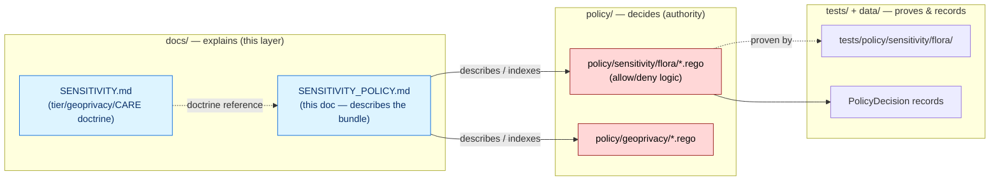

<!-- [KFM_META_BLOCK_V2]
doc_id: kfm://doc/flora-sensitivity-policy
title: Flora — Sensitivity Policy (companion)
type: standard
version: v1
status: draft
owners: Domain steward (Flora); Sensitivity reviewer; Policy steward; Docs steward
created: 2026-06-03
updated: 2026-06-03
policy_label: public
related: [docs/doctrine/ai-build-operating-contract.md, docs/doctrine/directory-rules.md, docs/domains/flora/SENSITIVITY.md, docs/domains/flora/RIGHTS_AND_SENSITIVITY.md, docs/domains/flora/PUBLICATION_AND_ROLLBACK.md, policy/sensitivity/flora/, policy/geoprivacy/, policy/bundles/]
tags: [kfm]
notes: [Doctrine-adjacent companion; pins CONTRACT_VERSION = "3.0.0". ROLE — this is the human-facing companion that DESCRIBES and INDEXES the policy/sensitivity/flora/ enforcement bundle. It is NOT the rules and NOT the doctrine. Tier/geoprivacy/CARE doctrine lives in SENSITIVITY.md; allow/deny logic lives in policy/. Disposition defers to operating contract §23.2. All repo paths PROPOSED until mounted-repo verification.]
[/KFM_META_BLOCK_V2] -->

# 🌿 Flora — Sensitivity Policy (companion)

> The human-facing companion to the `policy/sensitivity/flora/` enforcement bundle: what rules exist, what they take in, what `PolicyDecision` they emit, how they fail closed, and how they are tested. This doc **describes and indexes** the policy; it is not the policy, and it does not restate the tier doctrine.

<a id="top"></a>


| Field | Value |
|---|---|
| **Status** | `draft` |
| **Owners** | Domain steward (Flora) · Sensitivity reviewer · Policy steward · Docs steward |
| **Last updated** | 2026-06-03 |
| **Contract** | `CONTRACT_VERSION = "3.0.0"` |
| **Document role** | Describes/indexes the enforcement bundle; does not contain rules |
| **Rules home (PROPOSED)** | `policy/sensitivity/flora/`, `policy/geoprivacy/` |
| **Doctrine home** | [`docs/domains/flora/SENSITIVITY.md`](./SENSITIVITY.md) |
| **Repo home (PROPOSED)** | `docs/domains/flora/SENSITIVITY_POLICY.md` |

> [!IMPORTANT]
> **This doc is a companion, not an authority.** In KFM, `policy/` **decides** and `docs/` **explains** (Directory Rules §2.3, §6.5). The allow/deny logic lives in the Rego bundle under `policy/sensitivity/flora/`; the tier/geoprivacy/CARE *doctrine* lives in `SENSITIVITY.md`. If this companion and the rules ever disagree, **the rules win** and the drift is logged to `docs/registers/DRIFT_REGISTER.md`. Do not encode allow/deny logic in this file.

> [!WARNING]
> **Lane overlap (CONFLICTED).** Three Flora docs now touch sensitivity: this companion, [`SENSITIVITY.md`](./SENSITIVITY.md) (doctrine), and [`RIGHTS_AND_SENSITIVITY.md`](./RIGHTS_AND_SENSITIVITY.md) (rights + doctrine). This companion is the **non-overlapping** member — it owns the enforcement-layer description that the other two only reference. The doctrine overlap between the other two remains a separate open item (`OQ-FLORA-SENS-01`). See [Open questions](#open-questions-register).

---

## Quick jump

- [1. What this companion is for](#1-what-this-companion-is-for)
- [2. Repo fit: docs explains, policy decides](#2-repo-fit-docs-explains-policy-decides)
- [3. Where the rules live](#3-where-the-rules-live)
- [4. PolicyDecision: the verdict shape](#4-policydecision-the-verdict-shape)
- [5. Rule index (policy/sensitivity/flora)](#5-rule-index-policysensitivityflora)
- [6. Inputs the rules consume](#6-inputs-the-rules-consume)
- [7. Reason codes](#7-reason-codes)
- [8. Fail-closed & default-deny discipline](#8-fail-closed--default-deny-discipline)
- [9. Where the policy is evaluated](#9-where-the-policy-is-evaluated)
- [10. Testing the rules](#10-testing-the-rules)
- [11. Changing a rule](#11-changing-a-rule)
- [Open questions register](#open-questions-register)
- [Open verification backlog](#open-verification-backlog)
- [Changelog v0 → v1](#changelog-v0--v1)
- [Definition of done](#definition-of-done)
- [Related docs](#related-docs)

---

## 1. What this companion is for

A reviewer or contributor reading the Flora doctrine in `SENSITIVITY.md` learns *what should happen* — rare plants are T4, transforms need receipts, CARE governs culturally sensitive taxa. This companion answers the next question: **what machinery enforces that, and how do I read, test, or change it?**

It exists because the doctrine docs deliberately do **not** carry allow/deny logic, and the policy bundle deliberately does **not** carry prose explanation. This doc is the bridge: a navigable description of the enforcement surface.

**In scope:** the `policy/sensitivity/flora/` rule index; the `PolicyDecision` verdict shape and reason codes; the inputs rules consume; where the policy is evaluated in the lifecycle; how rules are tested and changed.

**Explicitly out of scope** (routed out, never restated here):
- Tier definitions, Flora tier assignments, transitions, geoprivacy vocabulary, the `RedactionReceipt`, CARE/sovereignty doctrine → [`SENSITIVITY.md`](./SENSITIVITY.md).
- Rights / license / attribution → [`RIGHTS_AND_SENSITIVITY.md`](./RIGHTS_AND_SENSITIVITY.md) §4.
- The actual Rego/OPA source → `policy/sensitivity/flora/` (this doc points at it; it is not a copy).
- The canonical disposition matrix → operating contract §23.2.

[↑ Back to top](#top)

---

## 2. Repo fit: docs explains, policy decides



> [!NOTE]
> Per Directory Rules §6.5, **`policy/` is the canonical singular policy root** — Rego/rules never live in `docs/` or `release/`. A doc named `…_POLICY.md` in `docs/` can only *describe* policy, never *be* it. *(CONFIRMED — Directory Rules §6.5, §13.5 "`release/*.rego` policy files" drift entry.)*

[↑ Back to top](#top)

---

## 3. Where the rules live

The enforcement rules this doc describes are **PROPOSED** repo paths until verified against a mounted repository. The `policy/sensitivity/`, `policy/geoprivacy/`, and `policy/bundles/` segments are CONFIRMED as canonical policy lanes; their `flora/` contents are PROPOSED.

| Concern | Rules home (PROPOSED) | Notes |
|---|---|---|
| Flora sensitivity gate | `policy/sensitivity/flora/` | Tier assignment, exact-geometry denial, sensitive-taxa gate |
| Geoprivacy transforms | `policy/geoprivacy/` | Generalization / suppression / buffer authorization |
| Shared Rego helpers | `policy/bundles/` | `rego_v1_common_policy_bundle` — action/actor/resource/policy_label/sensitivity helpers, default-deny |
| Sensitive-taxa gate list | `policy/sensitivity/flora/sensitive_taxa.txt` | Drives `public_safe_geometry` requirement |
| Policy fixtures | `policy/fixtures/` | Valid/invalid policy inputs |
| Policy tests | `policy/tests/` and `tests/policy/sensitivity/flora/` | Negative cases per rule |

> [!CAUTION]
> The mapping above does **not** assert these files exist. Every path is `PROPOSED / NEEDS VERIFICATION`. *(Directory Rules §0; repository structure guiding document confirms the `policy/{sensitivity,geoprivacy,bundles,fixtures,tests}/` lane shape, not the `flora/` contents.)*

[↑ Back to top](#top)

---

## 4. PolicyDecision: the verdict shape

Every governed surface, validator, and policy gate returns a **finite outcome from a small, well-known set**. The Flora sensitivity rules emit a `PolicyDecision` whose outcome is consumed by the release gate, the governed API, and the review queue. *(CONFIRMED doctrine — Atlas §24.3.)*

| Outcome | When | What the rule attaches |
|---|---|---|
| `ALLOW` | Sensitivity resolved; tier/transform/audience permit. | `PolicyDecision = allow`; obligations (e.g. required attribution). |
| `RESTRICT` | Material exists but is T2/T3; release only to a named/authenticated audience. | `PolicyDecision = restrict` + audience scope. |
| `DENY` | Policy, sensitivity, or rights forbids. **Sensitive Flora lanes default here.** | `PolicyDecision = deny` + `reason_code`. |
| `HOLD` | Pending steward / rights-holder / policy review. | `PolicyDecision = hold`; `ReviewRecord` pending. |
| `ERROR` | Rule cannot evaluate — missing input, malformed query, contract violation. | Error envelope + diagnostic code; no claim leakage. |

> [!NOTE]
> Outcome vocabulary by surface: the **review queue / steward console** returns `ALLOW / RESTRICT / DENY / HOLD / ERROR`; **public-facing** resolvers (feature/detail, Evidence Drawer, Focus Mode) collapse to `ANSWER / ABSTAIN / DENY / ERROR`. A Flora sensitivity `DENY` surfaces to the public client as `DENIED_BY_POLICY`. *(CONFIRMED — Atlas §24.3.2 outcome × surface mapping.)*

A finite default-deny verdict shape (illustrative, mirroring the `ConsentDecision` render-gate pattern):

```json
{
  "outcome": "DENY",
  "allow": false,
  "reasons": ["default_deny"],
  "obligations": []
}
```

*(Illustrative shape — derived from `KFM-P5-PROG-0007` ConsentDecision package layout; the Flora sensitivity `PolicyDecision` schema is PROPOSED and lives under `schemas/contracts/v1/policy/`.)*

[↑ Back to top](#top)

---

## 5. Rule index (policy/sensitivity/flora)

The rules this companion indexes. Each is **PROPOSED** — a description of intended enforcement, not a claim that the rule file exists. The *doctrine* each rule enforces is owned by `SENSITIVITY.md`; this table names the *enforcement intent* only.

| Rule (PROPOSED) | Enforces (doctrine in `SENSITIVITY.md`) | Default outcome on trigger | Reason code |
|---|---|---|---|
| `exact_geometry_deny` | Exact rare/protected/culturally sensitive locations are T4. | `DENY` | `SENSITIVITY_UNRESOLVED` |
| `sensitive_taxa_gate` | A taxon on `sensitive_taxa.txt` requires `public_safe_geometry`. | `DENY` until transformed | `SENSITIVITY_UNRESOLVED` |
| `tier_assignment` | Assign default tier per Flora object class (§5 of doctrine). | `RESTRICT` / `DENY` per tier | `RESTRICTED_ACCESS` |
| `transform_requires_receipt` | `T4 → T1` needs `RedactionReceipt` + `ReviewRecord`. | `HOLD` if receipt/review absent | `MISSING_RECEIPT` / `REVIEW_NEEDED` |
| `join_sensitivity_inherit` | Joined product inherits the most restrictive input tier. | `DENY` | `SENSITIVITY_UNRESOLVED` |
| `care_sovereignty_gate` | AOI ∩ tribal overlay inherits `sovereignty:tribal` or needs a waiver. | `HOLD` / `DENY` | `SENSITIVITY_UNRESOLVED` |
| `rights_unknown_deny` | Unknown/restricted rights fail closed (rights gate; see `RIGHTS_AND_SENSITIVITY.md`). | `DENY` | `RIGHTS_UNKNOWN` |

> [!IMPORTANT]
> The doctrine columns are **pointers**, not restatements. To change *what* a rule should enforce, edit `SENSITIVITY.md` and the §23.2 disposition. To change *how* it is enforced, edit the Rego under `policy/sensitivity/flora/` and update this index. Never let this companion become a second source of the tier doctrine. *(Conforms to operating contract §19 anti-pattern: avoid parallel authorities.)*

[↑ Back to top](#top)

---

## 6. Inputs the rules consume

A Flora sensitivity rule evaluates a structured input (an OPA verdict input) rather than raw data. *(Pattern from `KFM-P30-PROG-0021` OPA verdict input schema; `KFM-P28-PROG-0013` common helper bundle checks action/actor/resource/policy_label/sensitivity.)*

| Input field (PROPOSED) | Meaning |
|---|---|
| `action` | What is being attempted (e.g. `publish`, `render`, `join`). |
| `actor` | The requesting identity / audience class. |
| `resource` | The Flora object and its `source_role`. |
| `policy_label` | `public` / `restricted` / `unknown`. |
| `sensitivity` | Declared tier and sensitive-taxa membership. |
| `evidence_refs` | Resolvable `EvidenceRef` → `EvidenceBundle`. |
| `transform_receipts` | Present `RedactionReceipt` / `AggregationReceipt`, if any. |
| `review_state` | Present `ReviewRecord`, if required. |
| `rights` | License / attribution / redistribution status. |

> [!NOTE]
> The rule reads only what the governed API hands it. It never reaches RAW/WORK/QUARANTINE or canonical stores — the trust membrane forbids it. A missing required input yields `ERROR` or `DENY`, never a silent pass. *(CONFIRMED — Atlas §24.6.2 trust membrane; §24.3 ERROR semantics.)*

[↑ Back to top](#top)

---

## 7. Reason codes

When a Flora sensitivity rule denies or holds, it attaches a structured reason code from the PROPOSED catalog. *(Atlas §24.6.3; §23.2 matrix.)*

| Reason code | Fires when |
|---|---|
| `SENSITIVITY_UNRESOLVED` | Exact sensitive geometry, sensitive-taxa, join, or CARE gate not cleared. |
| `RIGHTS_UNKNOWN` | License / redistribution terms unresolved (rights gate). |
| `MISSING_RECEIPT` | A required `RedactionReceipt` is absent for a sensitive transform. |
| `REVIEW_NEEDED` | A required `ReviewRecord` (sensitive lane) is missing. |
| `RESTRICTED_ACCESS` | Material is T2/T3/T4 and the requesting audience is not authorized. |

> [!TIP]
> Reason codes are how a denial stays *inspectable* rather than opaque. A Flora `DENY` without a reason code is itself a defect — the user should always learn *why* the lane fell closed, even when they cannot see the content.

[↑ Back to top](#top)

---

## 8. Fail-closed & default-deny discipline

The Flora sensitivity bundle is **default-deny**: the verdict is `DENY` unless an explicit rule allows. Shared helpers are versioned, testable, and default-deny by construction. *(CONFIRMED posture — `KFM-P28-IDEA-0011` Rego v1 default-deny bundle discipline; `KFM-P28-PROG-0013` common helper bundle.)*

- **Unknown is denied, not allowed.** Missing sensitivity classification, missing rights, missing required receipt → `DENY` or `HOLD`, never `ALLOW`.
- **Sensitive lanes default to `DENY`.** Rare/protected/culturally sensitive Flora content starts denied; an explicit transform + review + receipt is what moves it. *(CONFIRMED — Atlas §24.3 "Sensitive lanes default here.")*
- **Promotion deny rules.** OPA/Conftest denies promotion for missing owners, invalid signatures, unclosed catalog linkage, and unresolved policy checks — the Flora sensitivity rules are part of that promotion gate. *(CONFIRMED — `KFM-P22-PROG-0007` Conftest OPA promotion deny rules.)*
- **No style-only hiding.** Sensitivity is enforced at the policy/data layer, never by hiding geometry in a map style. *(CONFIRMED — operating contract §22.3 "no style-only hiding of exact sensitive geometry.")*

[↑ Back to top](#top)

---

## 9. Where the policy is evaluated

The Flora sensitivity `PolicyDecision` is consumed at three points in the lifecycle. *(Atlas §24.6.1 gate table; §24.3.2 surface mapping.)*

| Evaluation point | What the rule gates | Outcome surface |
|---|---|---|
| Validation (WORK → PROCESSED) | `RedactionReceipt` required if sensitivity applies; quarantine on failure. | `PASS` / `FAIL` (validator) → `HOLD`/`DENY` |
| Release (CATALOG → PUBLISHED) | No public surface change unless sensitivity + rights + review clear. | `ALLOW` / `HOLD` / `DENY` |
| Governed API (public read) | Public client request for Flora content. | `ANSWER` / `ABSTAIN` / `DENY` → `DENIED_BY_POLICY` |

> [!NOTE]
> The same rule logic is evaluated at each point; what differs is the **surface** and therefore the outcome vocabulary. A `DENY` at release blocks promotion; a `DENY` at the governed API returns `DENIED_BY_POLICY` to the client. Both record a `PolicyDecision`. *(CONFIRMED — Atlas §24.3.2.)*

[↑ Back to top](#top)

---

## 10. Testing the rules

Policy is proven by tests, not by assertion. Each Flora sensitivity rule SHOULD ship with negative fixtures that prove it fails closed. *(Atlas, Flora §K; §24.4 validator catalogue.)*

- [ ] `exact_geometry_deny`: an exact rare-plant coordinate on a public request → `DENY` / `DENIED_BY_POLICY` (PROPOSED).
- [ ] `sensitive_taxa_gate`: a taxon on `sensitive_taxa.txt` without `public_safe_geometry` → `DENY` (PROPOSED).
- [ ] `transform_requires_receipt`: `T4 → T1` attempted without `RedactionReceipt` → `HOLD` / `MISSING_RECEIPT` (PROPOSED).
- [ ] `join_sensitivity_inherit`: public × rare-locality join → inherits T4, `DENY` (PROPOSED).
- [ ] `care_sovereignty_gate`: AOI ∩ tribal overlay without waiver → `HOLD` / `DENY` (PROPOSED).
- [ ] `rights_unknown_deny`: unknown-license source → `DENY` / `RIGHTS_UNKNOWN` (PROPOSED).
- [ ] Default-deny: an input matching no allow rule → `DENY` / `default_deny` (PROPOSED).

> [!TIP]
> Proposed test homes: `policy/tests/` (Rego unit) and `tests/policy/sensitivity/flora/` (integration), mirroring the `ConsentDecision` pattern (`policy/consent/render.rego`, `tests/policy/consent/render_test.rego`). *(Pattern from `KFM-P5-PROG-0007`.)*

[↑ Back to top](#top)

---

## 11. Changing a rule

Sensitivity rules are policy-significant. A change follows the policy-change discipline, not an ad-hoc edit.

1. **Decide what changes.** Doctrine change → edit `SENSITIVITY.md` (and §23.2 if disposition shifts). Enforcement change → edit `policy/sensitivity/flora/`.
2. **ADR if it bends an invariant.** Changing the tier scheme, the source-role enum, or the receipt home is ADR-class (`ADR-S-05`, `ADR-S-04`, `ADR-S-03`).
3. **Add/adjust negative fixtures** before merging — a rule with no failing test is not enforced.
4. **Re-version the policy bundle** and keep shared helpers versioned. *(CONFIRMED — `KFM-P28-IDEA-0011`.)*
5. **Update this index** (§5) so the companion stays synchronized with the bundle.
6. **Separation of duties.** For sensitive Flora lanes, the rule author is not the release authority. *(CONFIRMED — Atlas §24.7.2; `ADR-S-09`.)*

> [!IMPORTANT]
> If this companion drifts from the actual rules, **the rules are authoritative** and the companion is corrected — log the drift in `docs/registers/DRIFT_REGISTER.md`. The companion never overrides the bundle.

[↑ Back to top](#top)

---

## Open questions register

| ID | Question | Owner role | Resolution path |
|---|---|---|---|
| OQ-FLORA-SP-01 | Does the Flora sensitivity bundle live at `policy/sensitivity/flora/`, `policy/geoprivacy/`, or split across both — and what is the entrypoint package name? | Policy steward | Repo inspection + ADR |
| OQ-FLORA-SP-02 | What is the canonical `PolicyDecision` schema home and shape for Flora sensitivity verdicts? | Policy steward + Docs steward | `schemas/contracts/v1/policy/` + ADR |
| OQ-FLORA-SP-03 | Is the OPA verdict input schema (§6) the same across domains or Flora-specific? | Policy steward | `KFM-P30-PROG-0021` ratification |
| OQ-FLORA-SP-04 | Reason-code catalog: is it frozen, and does Flora add lane-specific codes? | Docs steward | Atlas §24.6.3 ratification |
| OQ-FLORA-SP-05 | How does this companion relate to `SENSITIVITY.md` and `RIGHTS_AND_SENSITIVITY.md` once their own overlap (`OQ-FLORA-SENS-01`) is resolved? | Docs steward + Flora domain steward | The `OQ-FLORA-SENS-01` ADR; `DRIFT_REGISTER.md` |

## Open verification backlog

These items remain `NEEDS VERIFICATION` before promotion from `draft` to `published`:

1. Presence and entrypoint of the `policy/sensitivity/flora/` Rego bundle.
2. `PolicyDecision` schema home and field shape.
3. OPA verdict input schema (§6) against the mounted repo.
4. Reason-code catalog ratification (§7).
5. Test homes `policy/tests/` and `tests/policy/sensitivity/flora/`.
6. Resolution of the broader Flora sensitivity-doc overlap (`OQ-FLORA-SENS-01`) so this companion points at a single canonical doctrine doc.

## Changelog v0 → v1

| Change | Type (per contract §37) | Reason |
|---|---|---|
| Initial Flora sensitivity-policy companion | new | Describes/indexes the enforcement bundle — the layer the doctrine docs don't own. |
| Scoped as companion: routes all tier/geoprivacy/CARE doctrine to `SENSITIVITY.md` | clarification | `policy/` decides, `docs/` explains (Directory Rules §2.3, §6.5). |
| Indexed `PolicyDecision` outcomes, reason codes, OPA input shape, default-deny discipline | gap closure | Grounded in Atlas §24.3 + Rego-bundle cards; not previously documented in the lane. |
| Surfaced the three-doc lane overlap as CONFLICTED, routed to `OQ-FLORA-SENS-01` | reconciliation | Avoids silently adding a third parallel authority. |
| Pinned `CONTRACT_VERSION = "3.0.0"` | housekeeping | Doctrine-adjacent doc requirement. |

> **Backward compatibility.** New doc; no prior anchors to break. This companion is intended to survive the `OQ-FLORA-SENS-01` doctrine-doc reconciliation because it owns a distinct (enforcement) layer — but it must be re-pointed at whichever doctrine doc becomes canonical.

## Definition of done

This document is done enough to enter the repository when:

- it is placed according to Directory Rules (`docs/domains/flora/`);
- a policy steward, the Flora domain steward, and a sensitivity reviewer review it;
- it points at a real `policy/sensitivity/flora/` bundle (or clearly marks it PROPOSED);
- it contains **no** allow/deny logic (that stays in `policy/`);
- it does not restate tier/geoprivacy/CARE doctrine (that stays in `SENSITIVITY.md`);
- it does not conflict with accepted ADRs (`ADR-S-03/04/05/09`);
- the lane overlap is logged in `docs/registers/DRIFT_REGISTER.md`;
- the `GENERATED_RECEIPT.json` planned in the authoring notes is wired into CI;
- future changes follow the §11 rule-change discipline.

---

## Related docs

- [`docs/domains/flora/SENSITIVITY.md`](./SENSITIVITY.md) — **doctrine** this companion enforces (tiers, geoprivacy, CARE)
- [`docs/domains/flora/RIGHTS_AND_SENSITIVITY.md`](./RIGHTS_AND_SENSITIVITY.md) — rights + sensitivity doctrine (overlap tracked in `OQ-FLORA-SENS-01`)
- [`docs/doctrine/ai-build-operating-contract.md`](../../doctrine/ai-build-operating-contract.md) — operating law; §23.2 matrix; §19 anti-patterns (`CONTRACT_VERSION = "3.0.0"`)
- [`docs/doctrine/directory-rules.md`](../../doctrine/directory-rules.md) — §6.5 `policy/` canonical root; §13.5 `release/*.rego` drift
- [`docs/domains/flora/PUBLICATION_AND_ROLLBACK.md`](./PUBLICATION_AND_ROLLBACK.md) — where the `PolicyDecision` is consumed at release
- `policy/sensitivity/flora/` — the Flora sensitivity Rego bundle *(PROPOSED / TODO)*
- `policy/geoprivacy/` — geoprivacy transform policy *(PROPOSED / TODO)*
- `policy/bundles/` — shared Rego v1 helper bundle *(PROPOSED / TODO)*

_Last updated: 2026-06-03 · `CONTRACT_VERSION = "3.0.0"`_

[↑ Back to top](#top)
