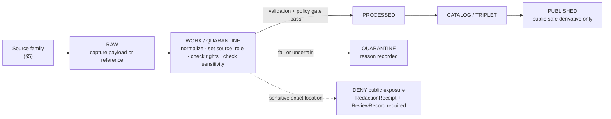

<!-- [KFM_META_BLOCK_V2]
doc_id: kfm://doc/flora-sources
title: Flora Domain — Source Registry (SOURCES.md)
type: standard
version: v1
status: draft
owners: <flora-domain-steward> # PLACEHOLDER — assign before review
created: 2026-06-03
updated: 2026-06-03
policy_label: public
related: [docs/domains/flora/SOURCE_REGISTRY.md, docs/domains/flora/POLICY.md, schemas/contracts/v1/source/source-descriptor.json, ai-build-operating-contract.md, directory-rules.md]
tags: [kfm]
notes: [CONTRACT_VERSION = "3.0.0"; source-role enum and SourceDescriptor field surface are PROPOSED shape per Atlas §24.1.3; all repo paths PROPOSED until verified against mounted repo]
[/KFM_META_BLOCK_V2] -->

# Flora Domain — Source Registry

> Per-source admission record for the Flora lane: who the source is, what **source role** it may play, its rights and sensitivity posture, freshness, and the receipts each admission must carry. Source role is set at admission and never edited in place.


<!-- TODO: replace with real Shields.io endpoints (CI, last-updated) once wired -->

| Field | Value |
|---|---|
| **Status** | `draft` |
| **Owners** | `<flora-domain-steward>` · `<source-steward>` *(PLACEHOLDER — assign before review)* |
| **Updated** | 2026-06-03 |
| **Lane** | Flora `[DOM-FLORA]` |
| **Responsibility root** | `docs/` (this doc) · data registry under `data/registry/sources/flora/` *(PROPOSED)* |
| **Authority** | `ai-build-operating-contract.md` v3.0 · `directory-rules.md` |

---

## Contents

- [1. Purpose](#1-purpose)
- [2. Repo fit](#2-repo-fit)
- [3. Source-role vocabulary](#3-source-role-vocabulary)
- [4. SourceDescriptor field surface](#4-sourcedescriptor-field-surface)
- [5. Flora source families](#5-flora-source-families)
- [6. Admission flow](#6-admission-flow)
- [7. Sensitivity posture](#7-sensitivity-posture)
- [8. What does not belong here](#8-what-does-not-belong-here)
- [Open questions register](#open-questions-register)
- [Open verification backlog](#open-verification-backlog)
- [Changelog](#changelog-v0--v1)
- [Definition of done](#definition-of-done)
- [Related docs](#related-docs)

---

## 1. Purpose

This file is the **per-source admission record** for the Flora domain. It names each source family the lane may draw on, fixes the **source role** that source is permitted to play, records its rights and sensitivity posture, and states the receipt obligations every admission must satisfy before evidence flows downstream.

> [!IMPORTANT]
> A source's **role** is an anti-collapse control. It decides whether a dataset can support an *observed*, *regulatory*, *modeled*, *aggregate*, *administrative*, *candidate*, or *synthetic* claim. Role is set at admission and **never edited in place** — a correction produces a new `SourceDescriptor` and a `CorrectionNotice`. *(PROPOSED shape per Atlas §24.1.3; see [§4](#4-sourcedescriptor-field-surface).)*

This registry does **not** itself release any data. It is a human-facing control-plane document under `docs/`. The machine-checkable descriptor lives in the schema/registry roots; this file explains and indexes that material.

[↑ Back to top](#contents)

---

## 2. Repo fit

**Path (PROPOSED):** `docs/domains/flora/SOURCES.md`

Per `directory-rules.md` §12 (Domain Placement Law), Flora is a **lane segment inside a responsibility root**, never a root folder. A human-facing source explainer therefore belongs under `docs/domains/flora/`. The machine-readable per-source descriptors and the source ledger live in different roots.

| Direction | Related surface (PROPOSED) | Relationship |
|---|---|---|
| **Upstream of** | `data/registry/sources/flora/` | Machine-readable `SourceDescriptor` instances this doc explains. |
| **Pairs with** | `docs/domains/flora/SOURCE_REGISTRY.md` | If a sibling registry doc exists, reconcile scope; flag overlap in `DRIFT_REGISTER`. |
| **Governed by** | `policy/domains/flora/` · `policy/sensitivity/flora/` *(PROPOSED)* | Deny/restrict/abstain rules for sensitive flora joins. |
| **Schema home** | `schemas/contracts/v1/source/source-descriptor.json` | Canonical `SourceDescriptor` shape per ADR-0001. |
| **Doctrine** | `ai-build-operating-contract.md` v3.0 · `directory-rules.md` | Operating law and placement law. |

> [!NOTE]
> Every path above is **PROPOSED** until checked against a mounted repository. This session exposes project documents, not a mounted repo; no path is asserted to exist.

[↑ Back to top](#contents)

---

## 3. Source-role vocabulary

CONFIRMED doctrine / PROPOSED enum: each Flora source is admitted under exactly one **source role**. The role constrains what claims the source may back. *(Source-role anti-collapse is doctrine-significant per ADR-S-04; vocabulary v1 is PROPOSED.)*

| Role | A source in this role may back… | Flora example |
|---|---|---|
| `observed` | Direct observation or measurement of a real occurrence. | iNaturalist-derived plant observation; herbarium specimen record. |
| `regulatory` | An authoritative status, listing, or designation. | USFWS ECOS listing context; state listed-species status. |
| `modeled` | A value produced by a model run (requires `role_model_run_ref`). | Distribution / suitability surface. |
| `aggregate` | A value summarized over a geometry scope (requires `role_aggregation_unit`). | County-level taxa presence counts. |
| `administrative` | A compiled or administrative record, not an observed event. | Survey compilation; stewardship output. |
| `candidate` | An unmerged proposal in `WORK / QUARANTINE`; **no `PUBLISHED` edge until merged.** | Newly ingested record awaiting taxonomy resolution. |
| `synthetic` | Generated content (requires a reality-boundary note). | Illustrative range carrier; generated figure. |

> [!CAUTION]
> A `candidate` source MUST NOT reach a public surface. The trust membrane denies any `PUBLISHED` edge from `WORK / QUARANTINE`; route candidates to quarantine, not to release. `[DIRRULES]`

[↑ Back to top](#contents)

---

## 4. SourceDescriptor field surface

PROPOSED schema-home note: `source_role` is a `SourceDescriptor` field. The canonical schema home defaults to `schemas/contracts/v1/source/source-descriptor.json` per Directory Rules §7.4 and ADR-0001, unless an accepted ADR relocates it.

> [!WARNING]
> The field surface below is the **PROPOSED shape** from Atlas §24.1.3. Field presence and exact names in the mounted `SourceDescriptor` schema are **NEEDS VERIFICATION**. An ADR or schema PR is the authoritative resolution. Do not treat this table as a current schema fact.

| Field | Type / vocabulary | Required? | Notes |
|---|---|---|---|
| `source_role` | enum: `observed \| regulatory \| modeled \| aggregate \| administrative \| candidate \| synthetic` | MUST | Set at admission. Never edited in place; corrections produce a new descriptor + `CorrectionNotice`. |
| `role_authority` | string (issuing body / model identity / steward) | MUST when role ∈ {`regulatory`, `modeled`, `aggregate`} | Disambiguates the authoring authority for downstream cite text. |
| `role_aggregation_unit` | geometry-scope token (county, HUC, tract, year, decade, …) | MUST when `source_role = aggregate` | Prevents geometry-scope drift on join. |
| `role_model_run_ref` | `EvidenceRef → ModelRunReceipt` | MUST when `source_role = modeled` | Pins inputs, parameters, and version that produced the value. |
| `role_synthetic_basis` | structured: `{ method, inputs, reality_boundary_note_ref }` | MUST when `source_role = synthetic` | Records what is and is not real in the carrier. |
| `role_candidate_disposition` | enum: `pending \| merged \| rejected \| quarantined` | MUST when `source_role = candidate` | Tracks promotion state; `PUBLISHED` edge forbidden until `merged`. |

The descriptor also anchors the standard admission fields the Atlas receipt catalog lists for `SourceDescriptor`: `source_id`, `source_role`, `authority`, `rights`, `sensitivity`, `cadence`, ingest hash, time, and citation. *(PROPOSED shape; `[ENCY]`.)*

[↑ Back to top](#contents)

---

## 5. Flora source families

CONFIRMED dossier: the source families below are the Flora key source families named in the domain dossier. Each is admitted under the role appropriate to the specific dataset and request — a single family can supply more than one role across different feeds. **Rights and current terms for every family are `NEEDS VERIFICATION`; sensitive joins fail closed by default.** `[DOM-FLORA]`

| Source family | Typical role(s) | Rights / sensitivity | Freshness | Notes |
|---|---|---|---|---|
| KDWP flora / listed-species context | `regulatory`, `administrative` | rights & terms **NEEDS VERIFICATION**; sensitive joins fail closed | source-vintage / cadence specific | Listed-species status context for Kansas. |
| KDWP Ecological Review Tool / stewardship outputs | `administrative`, `regulatory` | rights & terms **NEEDS VERIFICATION**; sensitive joins fail closed | source-vintage / cadence specific | Steward-controlled; may carry sensitive locations. |
| Kansas Biological Survey / KU herbarium surfaces | `observed`, `administrative` | rights & terms **NEEDS VERIFICATION**; sensitive joins fail closed | source-vintage / cadence specific | Specimen-backed occurrences. |
| USFWS ECOS plant context | `regulatory` | rights & terms **NEEDS VERIFICATION**; sensitive joins fail closed | source-vintage / cadence specific | Federal listing / status authority. |
| NatureServe Explorer / Explorer Pro | `regulatory`, `administrative` | rights & terms **NEEDS VERIFICATION**; sensitive joins fail closed | source-vintage / cadence specific | Conservation status ranks; license review required. |
| GBIF vascular-plant downloads | `observed` | rights & terms **NEEDS VERIFICATION**; sensitive joins fail closed | source-vintage / cadence specific | Aggregated occurrences; sensitivity-prone on join. |
| iDigBio specimen records | `observed` | rights & terms **NEEDS VERIFICATION**; sensitive joins fail closed | source-vintage / cadence specific | Digitized specimen records. |
| iNaturalist-derived observations | `observed` | rights & terms **NEEDS VERIFICATION**; sensitive joins fail closed | source-vintage / cadence specific | Geoprivacy obscuration must be respected; do not de-obscure. |

> [!NOTE]
> USDA PLANTS-style county packages are analytically useful but **sensitivity-prone**: joining PLANTS with GBIF, iNaturalist, or heritage datasets can reconstruct sensitive occurrences. Track taxa drift while avoiding public exact-occurrence exposure. *(CONFIRMED; KFM-P4-IDEA-0001.)*

<details>
<summary>Illustrative descriptor stub for one family (not authoritative)</summary>

```jsonc
// ILLUSTRATIVE ONLY — PROPOSED shape, not a verified schema instance.
{
  "source_id": "flora-gbif-vascular-ks",      // PLACEHOLDER
  "source_role": "observed",
  "role_authority": null,                       // not required for observed
  "rights": "NEEDS VERIFICATION",
  "sensitivity": "fail-closed on sensitive-taxon join",
  "cadence": "NEEDS VERIFICATION",
  "ingest_hash": "<blake3-or-sha256>",          // PLACEHOLDER
  "citation": "GBIF.org occurrence download",   // NEEDS VERIFICATION
  "time": "2026-06-03T00:00:00Z"                // PLACEHOLDER
}
```
</details>

[↑ Back to top](#contents)

---

## 6. Admission flow

CONFIRMED doctrine / PROPOSED lane application: every admitted source moves through the lifecycle as a governed state transition — promotion is never a file move. A source enters as `RAW`, is validated and role-tagged in `WORK / QUARANTINE`, and only role-cleared, rights-cleared, sensitivity-cleared material proceeds. `[DIRRULES] [DOM-FLORA]`



| Gate | What must be true | Receipt / record |
|---|---|---|
| Admission | `SourceDescriptor` exists with `source_role` set; role-conditional fields present. | `SourceDescriptor` |
| Validation + policy | Schema, geometry, time, identity, evidence, rights, sensitivity pass — or quarantine reason recorded. | `PolicyDecision` |
| Sensitive transform | Generalization / redaction applied before any public tier. | `RedactionReceipt` + `ReviewRecord` |
| Release | Public-safe derivative with evidence support and rollback target. | `ReleaseManifest` |

[↑ Back to top](#contents)

---

## 7. Sensitivity posture

> [!CAUTION]
> **Rare, protected, or culturally sensitive plant locations default to tier `T4` (Denied).** Exact rare-plant locations are not released to any public audience by default. Movement to a lower tier requires generalized geometry, steward review, and a transform receipt. `[DOM-FLORA]`

| Object class | Default tier | Allowed transform (PROPOSED) | Required gates |
|---|---|---|---|
| Flora — rare / protected / culturally sensitive plant location | **T4 (Denied)** | Generalized geometry + steward review → T2 or T1 | `RedactionReceipt` + `ReviewRecord` |
| Flora — range / distribution polygon | T1 (Generalized) | Public-safe generalized layer | `RedactionReceipt` or `AggregationReceipt` |
| Flora — ethnobotanical / cultural context | governed | Steward + rights-holder review before any exposure | `ReviewRecord` + `PolicyDecision` |

Operative rule, from the Deny-by-Default Register: Flora **denies** exact rare/protected/culturally-sensitive plant locations by default; exposure is allowed **only** under review with generalized or withheld geometry and a `RedactionReceipt`. `[DOM-FLORA]`

[↑ Back to top](#contents)

---

## 8. What does not belong here

To keep the lane boundary clean (Flora owns plant taxa and flora occurrences; it does not own neighboring truth):

- **Habitat patches and suitability** → Habitat lane (`docs/domains/habitat/`).
- **Animal taxa and occurrences** → Fauna lane (`docs/domains/fauna/`).
- **Soil, hydrology, agriculture, hazards, roads, settlements, archaeology, people** → their own lanes; Flora cites, never owns.
- **Machine-readable descriptor instances** → `data/registry/sources/flora/` *(PROPOSED)*, not this file.
- **Policy rule logic** → `policy/domains/flora/` and `policy/sensitivity/flora/` *(PROPOSED)*, not this file.

[↑ Back to top](#contents)

---

## Open questions register

| ID | Question | Owner role | Resolution path |
|---|---|---|---|
| OQ-FLORA-SRC-01 | What are the current rights and license terms for each source family in §5? | source steward | Source-by-source license review; record in descriptor `rights`. |
| OQ-FLORA-SRC-02 | Which roles is each family actually approved for (vs. illustrative `[typical]`)? | flora steward | ADR-S-04 source-role vocabulary + per-source admission decision. |
| OQ-FLORA-SRC-03 | Does a sibling `SOURCE_REGISTRY.md` already exist, and how do scopes divide? | docs steward | Repo inspection; `DRIFT_REGISTER` entry if overlap. |
| OQ-FLORA-SRC-04 | What is the canonical home for Flora source descriptors — `data/registry/sources/flora/`? | docs steward | Directory Rules check + ADR if a new home is needed. |

## Open verification backlog

These items remain `NEEDS VERIFICATION` before promotion from `draft` to `published`:

1. `SourceDescriptor` schema field names match §4 (or update §4 to match the schema).
2. Each source family's rights, license terms, and update cadence.
3. The approved role(s) per source family.
4. Existence and shape of `policy/sensitivity/flora/` and `policy/domains/flora/`.
5. The canonical registry path for Flora source descriptors.
6. Reviewer/steward owners (currently PLACEHOLDER).

## Changelog v0 → v1

| Change | Type (per contract §37) | Reason |
|---|---|---|
| Initial Flora `SOURCES.md` created from dossier source families + source-role vocabulary | new | No prior file; built from `[DOM-FLORA]` source families and Atlas §24.1.3 role surface. |

> **Backward compatibility.** New file; no anchors to preserve. If a sibling source-registry doc exists, reconcile anchors before merge.

## Definition of done

This document is done enough to enter the repository when:

- it is placed under `docs/domains/flora/` per Directory Rules §12;
- a docs steward and the flora source steward review it;
- it is linked from the Flora lane index and the source-catalog index;
- it does not conflict with accepted ADRs (notably ADR-S-04 source-role vocabulary);
- any conflict with current repo conventions is logged in `docs/registers/DRIFT_REGISTER.md`;
- the `GENERATED_RECEIPT.json` planned in Section 2 is wired into CI;
- placeholder owners and unverified rights/cadence values are resolved.

---

### Related docs

- `docs/domains/flora/SOURCE_REGISTRY.md` — *(TODO: confirm existence / scope split)*
- `docs/domains/flora/POLICY.md` — Flora sensitivity & deny-default posture
- `schemas/contracts/v1/source/source-descriptor.json` — canonical descriptor shape
- `ai-build-operating-contract.md` — operating contract (`CONTRACT_VERSION = "3.0.0"`)
- `directory-rules.md` — placement law

**Last updated:** 2026-06-03 · **Contract:** `CONTRACT_VERSION = "3.0.0"`

[↑ Back to top](#contents)
