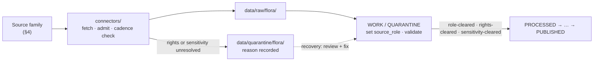

<!-- [KFM_META_BLOCK_V2]
doc_id: kfm://doc/flora-source-families
title: Flora Domain — Source Families
type: standard
version: v1
status: draft
owners: <flora-domain-steward> # PLACEHOLDER — assign before review
created: 2026-06-03
updated: 2026-06-03
policy_label: public
related: [docs/domains/flora/SOURCES.md, docs/domains/flora/POLICY.md, docs/domains/flora/SOURCE_REGISTRY.md, schemas/contracts/v1/source/source-descriptor.json, ai-build-operating-contract.md, directory-rules.md]
tags: [kfm]
notes: [CONTRACT_VERSION = "3.0.0"; companion to SOURCES.md — this file profiles families as upstreams; SOURCES.md is the per-source admission register; all repo paths PROPOSED until verified]
[/KFM_META_BLOCK_V2] -->

# Flora Domain — Source Families

> Upstream profiles for the Flora lane: who each source family is, which **source roles** it can legitimately play, its rights and sensitivity character, its update cadence, and how it enters the repository through a connector. The companion file [`SOURCES.md`](./SOURCES.md) is the per-source admission *register*; this file is the *who's who* of the families that feed it.

<!-- TODO: replace with real Shields.io endpoints (CI, last-updated) once wired -->

| Field | Value |
|---|---|
| **Status** | `draft` |
| **Owners** | `<flora-domain-steward>` · `<source-steward>` *(PLACEHOLDER — assign before review)* |
| **Updated** | 2026-06-03 |
| **Lane** | Flora `[DOM-FLORA]` |
| **Responsibility root** | `docs/` (this doc) |
| **Authority** | `ai-build-operating-contract.md` v3.0 · `directory-rules.md` · ADR-S-04 · ADR-S-12 |

---

## Contents

- [1. What a source family is](#1-what-a-source-family-is)
- [2. Repo fit](#2-repo-fit)
- [3. How to read a family profile](#3-how-to-read-a-family-profile)
- [4. Family profiles](#4-family-profiles)
  - [4.1 KDWP flora / listed-species context](#41-kdwp-flora--listed-species-context)
  - [4.2 KDWP Ecological Review Tool / stewardship outputs](#42-kdwp-ecological-review-tool--stewardship-outputs)
  - [4.3 Kansas Biological Survey / KU herbarium](#43-kansas-biological-survey--ku-herbarium)
  - [4.4 USFWS ECOS plant context](#44-usfws-ecos-plant-context)
  - [4.5 NatureServe Explorer / Explorer Pro](#45-natureserve-explorer--explorer-pro)
  - [4.6 GBIF vascular-plant downloads](#46-gbif-vascular-plant-downloads)
  - [4.7 iDigBio specimen records](#47-idigbio-specimen-records)
  - [4.8 iNaturalist-derived observations](#48-inaturalist-derived-observations)
- [5. Family × role matrix](#5-family--role-matrix)
- [6. Connector intake & cadence](#6-connector-intake--cadence)
- [7. Join-sensitivity cautions](#7-join-sensitivity-cautions)
- [8. What does not belong here](#8-what-does-not-belong-here)
- [Open questions register](#open-questions-register)
- [Open verification backlog](#open-verification-backlog)
- [Changelog](#changelog-v0--v1)
- [Definition of done](#definition-of-done)
- [Related docs](#related-docs)

---

## 1. What a source family is

A **source family** is a coherent upstream — an organization, dataset, or feed — that the Flora lane may draw evidence from. A family is not the same as an admitted source: one family can supply several distinct feeds, each admitted separately with its own `SourceDescriptor` and its own **source role**.

> [!IMPORTANT]
> This file profiles **families as upstreams** (character, roles, rights, cadence, connector). The per-source **admission decisions** — the `SourceDescriptor` instances and their role tags — live in [`SOURCES.md`](./SOURCES.md) and in the data registry. Keep the two synchronized: a family profiled here with no admitted source is fine; an admitted source with no family profile is a gap to close.

[↑ Back to top](#contents)

---

## 2. Repo fit

**Path (PROPOSED):** `docs/domains/flora/SOURCE_FAMILIES.md`

Per `directory-rules.md` §12 (Domain Placement Law), Flora is a **lane segment inside a responsibility root**, never a root folder. A human-facing upstream profile belongs under `docs/domains/flora/`.

| Direction | Related surface (PROPOSED) | Relationship |
|---|---|---|
| **Pairs with** | [`docs/domains/flora/SOURCES.md`](./SOURCES.md) | Per-source admission register; this file is the upstream-family companion. |
| **May overlap** | `docs/domains/flora/SOURCE_REGISTRY.md` | If a registry doc exists, divide scope (families here, descriptor index there); log overlap in `DRIFT_REGISTER`. |
| **Feeds** | `connectors/` | Source-specific fetch + admission logic; emits to `data/raw/` or `data/quarantine/`. |
| **Governed by** | `policy/sensitivity/flora/` *(PROPOSED)* | Deny/restrict/abstain for sensitive flora joins. |
| **Doctrine** | `ai-build-operating-contract.md` v3.0 · `directory-rules.md` · ADR-S-04 · ADR-S-12 | Operating law, placement law, source-role vocabulary, connector cadence. |

> [!NOTE]
> Every path above is **PROPOSED** until checked against a mounted repository. This session exposes project documents, not a mounted repo; no path is asserted to exist.

[↑ Back to top](#contents)

---

## 3. How to read a family profile

Each profile in [§4](#4-family-profiles) uses the same fields:

| Field | Meaning |
|---|---|
| **Character** | What the family is and what it primarily supplies. |
| **Permitted role(s)** | Source role(s) this family may be admitted under — `observed`, `regulatory`, `modeled`, `aggregate`, `administrative`, `candidate`, `synthetic`. Per ADR-S-04, role is set at admission and never edited in place. |
| **Rights / sensitivity** | License posture and sensitivity character. **`NEEDS VERIFICATION` by default; sensitive joins fail closed.** |
| **Cadence** | Expected refresh rhythm; governs connector behavior (ADR-S-12). |
| **Intake** | How it enters the repo (connector → `RAW` / `QUARANTINE`). |
| **Cautions** | Family-specific risks, especially join-reconstruction of sensitive locations. |

[↑ Back to top](#contents)

---

## 4. Family profiles

CONFIRMED dossier: the eight families below are the Flora key source families named in the domain dossier `[DOM-FLORA]`. Role assignments marked *PROPOSED* are illustrative until fixed by per-source admission (see [OQ-FLORA-FAM-02](#open-questions-register)).

### 4.1 KDWP flora / listed-species context

- **Character:** Kansas Department of Wildlife & Parks listed-species and flora status context for Kansas.
- **Permitted role(s):** `regulatory`, `administrative` *(PROPOSED)*.
- **Rights / sensitivity:** rights & terms **NEEDS VERIFICATION**; may carry sensitive locations; sensitive joins fail closed.
- **Cadence:** source-vintage / cadence specific — **NEEDS VERIFICATION**.
- **Intake:** connector → `RAW`; sensitive content holds in `QUARANTINE` pending steward review.
- **Cautions:** state listed-species detail can pinpoint rare plants; treat as deny-default at exact precision.

### 4.2 KDWP Ecological Review Tool / stewardship outputs

- **Character:** Stewardship and ecological-review outputs from KDWP tooling.
- **Permitted role(s):** `administrative`, `regulatory` *(PROPOSED)*.
- **Rights / sensitivity:** rights & terms **NEEDS VERIFICATION**; steward-controlled; sensitive joins fail closed.
- **Cadence:** **NEEDS VERIFICATION**.
- **Intake:** connector → `RAW` / `QUARANTINE`; steward review required before any public derivative.
- **Cautions:** review outputs are administrative compilations, not observed events — preserve the role tag so the compilation is never published as an observation.

### 4.3 Kansas Biological Survey / KU herbarium

- **Character:** Specimen-backed botanical records and survey surfaces.
- **Permitted role(s):** `observed`, `administrative` *(PROPOSED)*.
- **Rights / sensitivity:** rights & terms **NEEDS VERIFICATION**; specimen localities can be sensitive; joins fail closed.
- **Cadence:** **NEEDS VERIFICATION**.
- **Intake:** connector → `RAW`.
- **Cautions:** herbarium label localities may resolve rare-plant sites; generalize before any public tier.

### 4.4 USFWS ECOS plant context

- **Character:** Federal listing / status authority (Environmental Conservation Online System) plant context.
- **Permitted role(s):** `regulatory` *(PROPOSED)*.
- **Rights / sensitivity:** rights & terms **NEEDS VERIFICATION**; status is authoritative, not observational.
- **Cadence:** **NEEDS VERIFICATION**.
- **Intake:** connector → `RAW`.
- **Cautions:** use for *status* claims only; never upcast a listing record into an observed occurrence.

### 4.5 NatureServe Explorer / Explorer Pro

- **Character:** Conservation status ranks and species context.
- **Permitted role(s):** `regulatory`, `administrative` *(PROPOSED)*.
- **Rights / sensitivity:** rights & terms **NEEDS VERIFICATION** (license review required); joins fail closed.
- **Cadence:** **NEEDS VERIFICATION**.
- **Intake:** connector → `RAW`; license check at admission.
- **Cautions:** Explorer Pro terms may restrict redistribution — verify before any public surface.

### 4.6 GBIF vascular-plant downloads

- **Character:** Aggregated global occurrence downloads for vascular plants.
- **Permitted role(s):** `observed` *(PROPOSED)*.
- **Rights / sensitivity:** rights & terms **NEEDS VERIFICATION** (per-record licenses vary); **sensitivity-prone on join**.
- **Cadence:** download-vintage specific — pin the download DOI/snapshot.
- **Intake:** connector → `RAW`; record the GBIF download identifier as citation.
- **Cautions:** joining GBIF with heritage or listed-species data can reconstruct sensitive locations — see [§7](#7-join-sensitivity-cautions).

### 4.7 iDigBio specimen records

- **Character:** Digitized natural-history specimen records.
- **Permitted role(s):** `observed` *(PROPOSED)*.
- **Rights / sensitivity:** rights & terms **NEEDS VERIFICATION**; localities can be sensitive; joins fail closed.
- **Cadence:** **NEEDS VERIFICATION**.
- **Intake:** connector → `RAW`.
- **Cautions:** specimen coordinates may be precise; generalize sensitive-taxon localities before publication.

### 4.8 iNaturalist-derived observations

- **Character:** Community observation records derived from iNaturalist.
- **Permitted role(s):** `observed` *(PROPOSED)*.
- **Rights / sensitivity:** rights & terms **NEEDS VERIFICATION**; **geoprivacy obscuration must be respected**; joins fail closed.
- **Cadence:** continuous upstream; admit at defined snapshots.
- **Intake:** connector → `RAW`; preserve obscuration flags.
- **Cautions:** never de-obscure iNaturalist geoprivacy; do not attempt to recover an obscured location by cross-referencing other families.

> [!CAUTION]
> Several families carry **rare-plant locations** that default to tier **T4 (Denied)** under the flora sensitivity posture. Exact rare/protected/culturally sensitive plant locations are not released to any public audience by default; movement to a lower tier requires generalized geometry, steward review, and a `RedactionReceipt`. `[DOM-FLORA]`

[↑ Back to top](#contents)

---

## 5. Family × role matrix

PROPOSED: which roles each family may be admitted under. A blank cell means the role is not expected for that family; ✓ means permitted; role is fixed per-source at admission (ADR-S-04).

| Family | `observed` | `regulatory` | `administrative` | `modeled` | `aggregate` |
|---|:---:|:---:|:---:|:---:|:---:|
| KDWP flora / listed-species |  | ✓ | ✓ |  |  |
| KDWP Ecological Review Tool |  | ✓ | ✓ |  |  |
| KS Biological Survey / KU herbarium | ✓ |  | ✓ |  |  |
| USFWS ECOS |  | ✓ |  |  |  |
| NatureServe Explorer |  | ✓ | ✓ |  |  |
| GBIF vascular plants | ✓ |  |  |  | ✓ |
| iDigBio specimens | ✓ |  |  |  |  |
| iNaturalist-derived | ✓ |  |  |  |  |

> [!NOTE]
> The `candidate` and `synthetic` roles are intake/processing states, not family properties, so they are omitted from this matrix. Any newly ingested, unmerged record is `candidate` regardless of family; a `candidate` source has **no `PUBLISHED` edge until merged** (`role_candidate_disposition = merged`).

[↑ Back to top](#contents)

---

## 6. Connector intake & cadence

CONFIRMED doctrine / PROPOSED lane application: families enter through `connectors/`, which fetch and admit but **never publish**. Connector behavior — cadence and quarantine recovery — is operational doctrine under ADR-S-12.

| Stage | What happens | Receipt / record |
|---|---|---|
| Fetch | Connector retrieves payload or reference; checks ETag / Last-Modified / cadence. | ingest receipt |
| Admit | `SourceDescriptor` created with `source_role` set; rights & sensitivity checked. | `SourceDescriptor` |
| Quarantine | Rights unknown or sensitive geometry present → hold with recorded reason. | `PolicyDecision` (`DENY` / `HOLD`) |
| Recovery | Steward resolves rights / applies generalization; re-admit. | `ReviewRecord`, `RedactionReceipt` |

> [!WARNING]
> A connector that emits a `PUBLISHED` artifact violates the watcher-as-non-publisher invariant. Connectors write only to `data/raw/` or `data/quarantine/`. `[DIRRULES]`

[↑ Back to top](#contents)

---

## 7. Join-sensitivity cautions

CONFIRMED: PLANTS-style county packages and other flora families are analytically useful but **sensitivity-prone**: joining them with GBIF, iNaturalist, or heritage datasets can reconstruct sensitive occurrences. Track taxa drift while avoiding public exact-occurrence exposure. *(KFM-P4-IDEA-0001.)*

| Join | Risk | Default disposition |
|---|---|---|
| Observed occurrences (GBIF / iDigBio / iNat) × listed-species context | Reconstructs precise rare-plant sites. | `DENY` exact public exposure; generalize first. |
| Any family × obscured iNaturalist record | De-obscures a protected location. | `DENY`; never de-obscure. |
| Specimen localities × cultural / ethnobotanical context | Exposes steward-controlled cultural knowledge. | Steward + rights-holder review before any exposure. |

Relevant gate reason codes (PROPOSED catalog): `ROLE_COLLAPSE`, `ROLE_DOWNCAST_FORBIDDEN` (source-role integrity), `SENSITIVITY_UNRESOLVED`, `RIGHTS_UNKNOWN`. A join that trips any of these fails closed and preserves the prior state. `[ENCY] [DIRRULES]`

[↑ Back to top](#contents)

---

## 8. What does not belong here

To keep the boundary clean:

- **Per-source `SourceDescriptor` instances and admission decisions** → [`SOURCES.md`](./SOURCES.md) and `data/registry/sources/flora/` *(PROPOSED)*, not this file.
- **Policy rule logic** → `policy/sensitivity/flora/` and `policy/domains/flora/` *(PROPOSED)*.
- **Connector code** → `connectors/`, not documented as implementation here.
- **Animal / habitat / soil / hydrology sources** → their own domain lanes; Flora cites, never owns.
- **Fauna source families** → `docs/domains/fauna/`.

[↑ Back to top](#contents)

---

## Open questions register

| ID | Question | Owner role | Resolution path |
|---|---|---|---|
| OQ-FLORA-FAM-01 | What are the current license terms and rights posture for each family in §4? | source steward | Family-by-family license review; record in descriptor `rights`. |
| OQ-FLORA-FAM-02 | Are the §5 role assignments approved, or only illustrative? | flora steward | ADR-S-04 vocabulary + per-source admission decisions. |
| OQ-FLORA-FAM-03 | What is the actual refresh cadence per family, and the quarantine-recovery rule? | source steward | ADR-S-12 (connector cadence + quarantine recovery). |
| OQ-FLORA-FAM-04 | How do scopes divide between this file, `SOURCES.md`, and any `SOURCE_REGISTRY.md`? | docs steward | Repo inspection; `DRIFT_REGISTER` entry if overlap. |

## Open verification backlog

These items remain `NEEDS VERIFICATION` before promotion from `draft` to `published`:

1. Per-family rights, license terms, and redistribution constraints (esp. NatureServe, GBIF).
2. Approved role assignments per family (§5).
3. Refresh cadence and connector quarantine-recovery policy per family (ADR-S-12).
4. Existence of `connectors/` flora intake and `policy/sensitivity/flora/`.
5. Scope split vs. `SOURCES.md` and any sibling `SOURCE_REGISTRY.md`.
6. Reviewer / steward owners (currently PLACEHOLDER).

## Changelog v0 → v1

| Change | Type (per contract §37) | Reason |
|---|---|---|
| Initial Flora `SOURCE_FAMILIES.md` created as upstream-profile companion to `SOURCES.md` | new | No prior file; built from `[DOM-FLORA]` key source families + ADR-S-04 / ADR-S-12. |

> **Backward compatibility.** New file; no anchors to preserve. Reconcile scope with `SOURCES.md` and any `SOURCE_REGISTRY.md` before merge.

## Definition of done

This document is done enough to enter the repository when:

- it is placed under `docs/domains/flora/` per Directory Rules §12;
- a docs steward and the flora source steward review it;
- it is linked from the Flora lane index and from `SOURCES.md`;
- it does not conflict with accepted ADRs (notably ADR-S-04 source-role vocabulary and ADR-S-12 connector cadence);
- any conflict with current repo conventions is logged in `docs/registers/DRIFT_REGISTER.md`;
- the `GENERATED_RECEIPT.json` planned in Section 2 is wired into CI;
- placeholder owners and unverified rights / cadence / role values are resolved.

---

### Related docs

- [`docs/domains/flora/SOURCES.md`](./SOURCES.md) — per-source admission register
- `docs/domains/flora/SOURCE_REGISTRY.md` — *(TODO: confirm existence / scope split)*
- `docs/domains/flora/POLICY.md` — Flora sensitivity & deny-default posture
- `schemas/contracts/v1/source/source-descriptor.json` — canonical descriptor shape
- `ai-build-operating-contract.md` — operating contract (`CONTRACT_VERSION = "3.0.0"`)
- `directory-rules.md` — placement law

**Last updated:** 2026-06-03 · **Contract:** `CONTRACT_VERSION = "3.0.0"`

[↑ Back to top](#contents)
