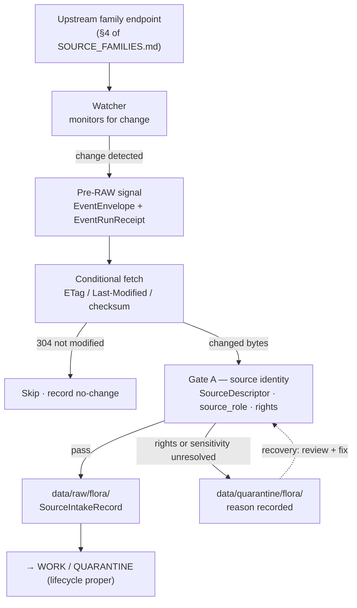

<!-- [KFM_META_BLOCK_V2]
doc_id: kfm://doc/flora-source-intake
title: Flora Domain — Source Intake
type: standard
version: v1
status: draft
owners: <flora-domain-steward> # PLACEHOLDER — assign before review
created: 2026-06-03
updated: 2026-06-03
policy_label: public
related: [docs/domains/flora/SOURCE_FAMILIES.md, docs/domains/flora/SOURCES.md, docs/domains/flora/POLICY.md, docs/standards/SMART_SYNC.md, ai-build-operating-contract.md, directory-rules.md]
tags: [kfm]
notes: [CONTRACT_VERSION = "3.0.0"; third in the flora source trilogy — FAMILIES (who) + SOURCES (admission register) + INTAKE (mechanics); pre-RAW + watcher-as-non-publisher governed; all repo paths PROPOSED until verified]
[/KFM_META_BLOCK_V2] -->

# Flora Domain — Source Intake

> How a Flora source moves from a watched endpoint into governed `RAW`: the pre-RAW signal stage, the watcher-as-non-publisher invariant, conditional fetch, admission gating, and the receipts each step emits. Companion to [`SOURCE_FAMILIES.md`](./SOURCE_FAMILIES.md) (who the upstreams are) and [`SOURCES.md`](./SOURCES.md) (the per-source admission register).


<!-- TODO: replace with real Shields.io endpoints (CI, last-updated) once wired -->

| Field | Value |
|---|---|
| **Status** | `draft` |
| **Owners** | `<flora-domain-steward>` · `<source-steward>` · `<pipeline-owner>` *(PLACEHOLDER — assign before review)* |
| **Updated** | 2026-06-03 |
| **Lane** | Flora `[DOM-FLORA]` |
| **Responsibility root** | `docs/` (this doc) |
| **Authority** | `ai-build-operating-contract.md` v3.0 · `directory-rules.md` · ADR-S-04 · ADR-S-12 |

---

## Contents

- [1. What intake covers](#1-what-intake-covers)
- [2. Repo fit](#2-repo-fit)
- [3. The intake path](#3-the-intake-path)
- [4. Pre-RAW signal stage](#4-pre-raw-signal-stage)
- [5. Conditional fetch & smart sync](#5-conditional-fetch--smart-sync)
- [6. Admission gate (Gate A)](#6-admission-gate-gate-a)
- [7. Quarantine & recovery](#7-quarantine--recovery)
- [8. Intake receipts](#8-intake-receipts)
- [9. Flora-specific intake cautions](#9-flora-specific-intake-cautions)
- [10. What does not belong here](#10-what-does-not-belong-here)
- [Open questions register](#open-questions-register)
- [Open verification backlog](#open-verification-backlog)
- [Changelog](#changelog-v0--v1)
- [Definition of done](#definition-of-done)
- [Related docs](#related-docs)

---

## 1. What intake covers

**Intake** is everything that happens to a Flora source *before* it becomes governed `RAW`: watching an upstream for change, signalling that change without admitting it, conditionally fetching the bytes, and admitting them through the source-identity gate. It is the mechanical front edge of the lifecycle.

> [!IMPORTANT]
> Intake does not publish, normalize, or release anything. It moves material from "out there" to `RAW` or `QUARANTINE`, recording why at every step. The lifecycle proper — `RAW → WORK / QUARANTINE → PROCESSED → CATALOG / TRIPLET → PUBLISHED` — begins where intake ends. Promotion across those states is a governed transition, never a file move. `[DIRRULES]`

This file describes the Flora lane's view of intake; the cross-cutting watcher and smart-sync mechanics are doctrine, referenced here and owned by `connectors/`, `pipelines/`, and `docs/standards/SMART_SYNC.md`.

[↑ Back to top](#contents)

---

## 2. Repo fit

**Path (PROPOSED):** `docs/domains/flora/SOURCE_INTAKE.md`

Per `directory-rules.md` §12 (Domain Placement Law), Flora is a **lane segment inside a responsibility root**, never a root. A human-facing intake explainer belongs under `docs/domains/flora/`. The intake *code* lives in `connectors/` and `pipelines/`; this file explains it, it does not implement it.

| Direction | Related surface (PROPOSED) | Relationship |
|---|---|---|
| **Reads from** | [`SOURCE_FAMILIES.md`](./SOURCE_FAMILIES.md) | The upstreams whose intake this file describes. |
| **Feeds** | [`SOURCES.md`](./SOURCES.md) | Admitted sources land in the per-source register after Gate A. |
| **Implemented by** | `connectors/` (fetch + admit) · `pipelines/` (watchers, lifecycle) | Connectors emit to `data/raw/` / `data/quarantine/`; watchers emit pre-RAW events; neither publishes. |
| **Lands in** | `data/raw/flora/` · `data/quarantine/flora/` *(PROPOSED)* | First governed resting state. |
| **Standards** | `docs/standards/SMART_SYNC.md` | Conditional-GET, manifest-checksum, debounce/coalesce playbook. |
| **Doctrine** | `ai-build-operating-contract.md` v3.0 · `directory-rules.md` · ADR-S-04 · ADR-S-12 | Operating law, placement, source-role vocabulary, connector cadence. |

> [!NOTE]
> Every path above is **PROPOSED** until checked against a mounted repository. This session exposes project documents, not a mounted repo; no path is asserted to exist.

[↑ Back to top](#contents)

---

## 3. The intake path

CONFIRMED doctrine / PROPOSED lane application: a Flora source moves through an explicit pre-RAW signal stage, a conditional fetch, and an admission gate before it rests as governed `RAW`.



> [!WARNING]
> The watcher signals; it never admits or publishes. A watcher that writes directly to `RAW`, `PROCESSED`, or any public surface collapses the admission gate and violates the **watcher-as-non-publisher invariant**. `[DIRRULES]`

[↑ Back to top](#contents)

---

## 4. Pre-RAW signal stage

PROPOSED: KFM treats **Pre-RAW** as an explicit lifecycle phase for source-event signalling *before* admission. Watchers emit signals here without admitting anything, preserving the watcher-as-non-publisher invariant. *(KFM-P1-PROG-0008.)*

| Object | Role | Public exposure |
|---|---|---|
| `EventEnvelope` | Captures a watcher / upload / source-change event before RAW. | None. |
| `EventRunReceipt` | Signed pre-RAW admission-edge receipt: reason, observed validator, hash inputs, candidate lifecycle destination. | Administrative / proof. |
| `SourceIntakeRecord` | Records the admission decision for a new source or source-update event. | Administrative. |

Watcher output should include the change **reason**, the **observed validator** (ETag / Last-Modified / checksum), the **hash inputs**, and the **candidate lifecycle destination** — so a source-health probe can never quietly bypass evidence review and the promotion gates. *(PROPOSED; KFM-P1-PROG-0008.)*

[↑ Back to top](#contents)

---

## 5. Conditional fetch & smart sync

CONFIRMED: all HTTP polling against external publishers is **conditional**. Store the ETag alongside the local artifact; on each poll send `If-None-Match`; on `304` skip the download. Where ETags are missing or weak, fall back to `Last-Modified` with `If-Modified-Since`; where neither is present, fall back to a SHA-256 manifest checksum. Validators are recorded in the run receipt so a downstream gate or audit can replay the conditional request and confirm the no-change decision. *(KFM Components C3-01; `docs/standards/SMART_SYNC.md`.)*

The corpus recommends a layered approach: HTTP validators first, manifest checksums second, push-based object-store events third, change-data-capture fourth — with a debounce-and-coalesce layer batching volatile events so materialization happens only when the `spec_hash` changes. *(CONFIRMED; C3 category.)*

<details>
<summary>Conditional-fetch shape (illustrative pseudocode, not authoritative)</summary>

```text
# ILLUSTRATIVE ONLY — describes the C3-01 pattern, not a verified script.
HEAD upstream            # compare validators first
if etag == stored_etag:  # or Last-Modified unchanged
    record no-change in EventRunReceipt
    exit
GET upstream             # only on change
verify sha256 against manifest if available
store new etag
write EventRunReceipt (http_validators, hash inputs, reason)
emit EventEnvelope → pre-RAW
```
</details>

> [!NOTE]
> For Flora, several families (GBIF, iNaturalist) are large or continuously updated. Conditional fetch and snapshot pinning (e.g., a GBIF download DOI) keep bandwidth and downstream churn low while preserving provenance. Cadence and quarantine-recovery policy are governed by ADR-S-12.

[↑ Back to top](#contents)

---

## 6. Admission gate (Gate A)

CONFIRMED doctrine: admission is **Gate A — source identity** of the promotion-gate sequence. A fetched payload is admitted to `RAW` only when its source identity and role are known.

| Requirement | What must be true | Proof |
|---|---|---|
| `SourceDescriptor` exists | Source identity, authority class, and `source_role` are set. | SourceDescriptor validation report |
| Role set at admission | `source_role` ∈ `observed \| regulatory \| modeled \| aggregate \| administrative \| candidate \| synthetic`; never edited in place. | descriptor field (ADR-S-04) |
| Rights known or held | License / terms / attribution obligations resolved or explicitly held. | `RightsReviewRecord` *(at Gate B; flagged at intake)* |
| Sensitivity screened | Rare-plant / cultural-location risk flagged for hold. | `PolicyDecision` |

> [!CAUTION]
> A `candidate`-role intake has **no `PUBLISHED` edge** until `role_candidate_disposition = merged`. Newly fetched, unmerged Flora records are candidates regardless of family and must not reach any public surface from intake. `[DIRRULES]`

Relevant gate reason codes (PROPOSED catalog) that fire at or near admission: `MISSING_RECEIPT`, `RIGHTS_UNKNOWN`, `SENSITIVITY_UNRESOLVED`, `ROLE_COLLAPSE`, `ROLE_DOWNCAST_FORBIDDEN`. A failure fails closed and preserves the prior state. `[ENCY] [DIRRULES]`

[↑ Back to top](#contents)

---

## 7. Quarantine & recovery

When rights are unknown or sensitive geometry is present, intake holds the payload in `data/quarantine/flora/` with a recorded reason rather than admitting it to `RAW`.

| Quarantine trigger | Recovery action | Receipt / record |
|---|---|---|
| Rights / license unresolved | Steward resolves terms; record in descriptor `rights`. | `ReviewRecord` |
| Sensitive rare-plant location present | Apply generalization / withholding before any downstream use. | `RedactionReceipt` + `ReviewRecord` |
| Source role ambiguous | Steward fixes `source_role`; re-admit. | new `SourceDescriptor` |
| Validator drift / false-positive fetch | Verify SHA-256 against manifest before re-promoting. | `EventRunReceipt` |

Connector cadence and quarantine-recovery policy is operational doctrine under ADR-S-12.

[↑ Back to top](#contents)

---

## 8. Intake receipts

CONFIRMED doctrine: each consequential intake step emits a receipt — process memory that proves a step ran, not just that it was declared.

| Receipt | Pins | Stage |
|---|---|---|
| `EventRunReceipt` | Pre-RAW watcher event admission (reason, validators, hash inputs, destination). | Pre-RAW |
| `SourceIntakeRecord` | Admission of a source or source-update event. | RAW |
| `SourceDescriptor` | Source identity, role, rights, sensitivity, cadence at admission. | Registry / RAW |
| `RunReceipt` | Inputs, outputs, `spec_hash` / config hash, tool versions, timestamp, operator. | Any |
| `PolicyDecision` | `allow / deny / restrict / hold / abstain` with reasons. | Admission |
| `RedactionReceipt` | Public-safe transform of a sensitive field or geometry (when recovery requires it). | Pre-Release |

> [!NOTE]
> A transition is closed only when (i) the required receipts exist, (ii) each resolves what it depends on (`EvidenceRef → EvidenceBundle`, `source_id → SourceDescriptor`), and (iii) the policy gate recorded its decision. Missing any of these fails closed. `[ENCY] [DIRRULES]`

[↑ Back to top](#contents)

---

## 9. Flora-specific intake cautions

> [!CAUTION]
> **Rare, protected, or culturally sensitive plant locations default to tier T4 (Denied).** Intake must flag them at the pre-RAW / admission edge so they hold in quarantine rather than flowing toward a public surface. Movement to a lower tier requires generalized geometry, steward review, and a `RedactionReceipt`. `[DOM-FLORA]`

- **iNaturalist geoprivacy** — preserve obscuration flags through intake; never de-obscure, and never attempt to recover an obscured location by cross-referencing other families during intake.
- **Specimen localities (KU herbarium, iDigBio)** — coordinates may be precise; flag sensitive-taxon localities for generalization before any downstream use.
- **PLANTS-style county packages** — analytically useful but sensitivity-prone on join with GBIF, iNaturalist, or heritage data; track taxa drift while avoiding public exact-occurrence exposure. *(KFM-P4-IDEA-0001.)*
- **Steward-controlled outputs (KDWP review tool)** — administrative compilations, not observed events; preserve the role tag at admission so a compilation is never later published as an observation.

[↑ Back to top](#contents)

---

## 10. What does not belong here

- **Connector / watcher code** → `connectors/` and `pipelines/`, not documented as implementation here.
- **Upstream family character & permitted roles** → [`SOURCE_FAMILIES.md`](./SOURCE_FAMILIES.md).
- **Per-source `SourceDescriptor` instances / admission register** → [`SOURCES.md`](./SOURCES.md) and `data/registry/sources/flora/` *(PROPOSED)*.
- **The conditional-GET / smart-sync standard itself** → `docs/standards/SMART_SYNC.md` (this file references it).
- **Policy rule logic** → `policy/sensitivity/flora/` and `policy/domains/flora/` *(PROPOSED)*.
- **Normalization, catalog, release** → downstream lifecycle docs; intake ends at `RAW` / `QUARANTINE`.

[↑ Back to top](#contents)

---

## Open questions register

| ID | Question | Owner role | Resolution path |
|---|---|---|---|
| OQ-FLORA-INT-01 | Is Pre-RAW modeled as its own contract package or as `SourceDescriptor` output? | pipeline owner | ADR (per KFM-P1-PROG-0008 open question) + schema decision. |
| OQ-FLORA-INT-02 | What are the per-family cadence and quarantine-recovery rules? | source steward | ADR-S-12 (connector cadence + quarantine recovery). |
| OQ-FLORA-INT-03 | Does a flora connector / watcher exist, and where does it write? | pipeline owner | Repo inspection of `connectors/` and `pipelines/`. |
| OQ-FLORA-INT-04 | How do scopes divide across FAMILIES / SOURCES / INTAKE and any `SOURCE_REGISTRY.md`? | docs steward | Repo inspection; `DRIFT_REGISTER` entry if overlap. |

## Open verification backlog

These items remain `NEEDS VERIFICATION` before promotion from `draft` to `published`:

1. Pre-RAW contract home (own package vs descriptor output).
2. Existence and write targets of flora connectors / watchers.
3. Per-family cadence and quarantine-recovery policy (ADR-S-12).
4. Existence of `data/raw/flora/`, `data/quarantine/flora/`, `docs/standards/SMART_SYNC.md`.
5. Receipt schema homes (`EventRunReceipt`, `SourceIntakeRecord`).
6. Reviewer / steward / pipeline owners (currently PLACEHOLDER).

## Changelog v0 → v1

| Change | Type (per contract §37) | Reason |
|---|---|---|
| Initial Flora `SOURCE_INTAKE.md` created as the intake-mechanics companion to FAMILIES + SOURCES | new | No prior file; built from pre-RAW / watcher / smart-sync doctrine + Gate A + `[DOM-FLORA]` sensitivity posture. |

> **Backward compatibility.** New file; no anchors to preserve. Reconcile scope with `SOURCE_FAMILIES.md`, `SOURCES.md`, and any `SOURCE_REGISTRY.md` before merge.

## Definition of done

This document is done enough to enter the repository when:

- it is placed under `docs/domains/flora/` per Directory Rules §12;
- a docs steward, the flora source steward, and a pipeline owner review it;
- it is linked from the Flora lane index and from `SOURCE_FAMILIES.md` / `SOURCES.md`;
- it does not conflict with accepted ADRs (notably ADR-S-04 and ADR-S-12);
- any conflict with current repo conventions is logged in `docs/registers/DRIFT_REGISTER.md`;
- the `GENERATED_RECEIPT.json` planned in Section 2 is wired into CI;
- placeholder owners and unverified cadence / connector / pre-RAW-home values are resolved.

---

### Related docs

- [`docs/domains/flora/SOURCE_FAMILIES.md`](./SOURCE_FAMILIES.md) — upstream family profiles
- [`docs/domains/flora/SOURCES.md`](./SOURCES.md) — per-source admission register
- `docs/domains/flora/POLICY.md` — Flora sensitivity & deny-default posture
- `docs/standards/SMART_SYNC.md` — conditional-GET / manifest-checksum / debounce standard *(TODO: confirm)*
- `ai-build-operating-contract.md` — operating contract (`CONTRACT_VERSION = "3.0.0"`)
- `directory-rules.md` — placement law

**Last updated:** 2026-06-03 · **Contract:** `CONTRACT_VERSION = "3.0.0"`

[↑ Back to top](#contents)
