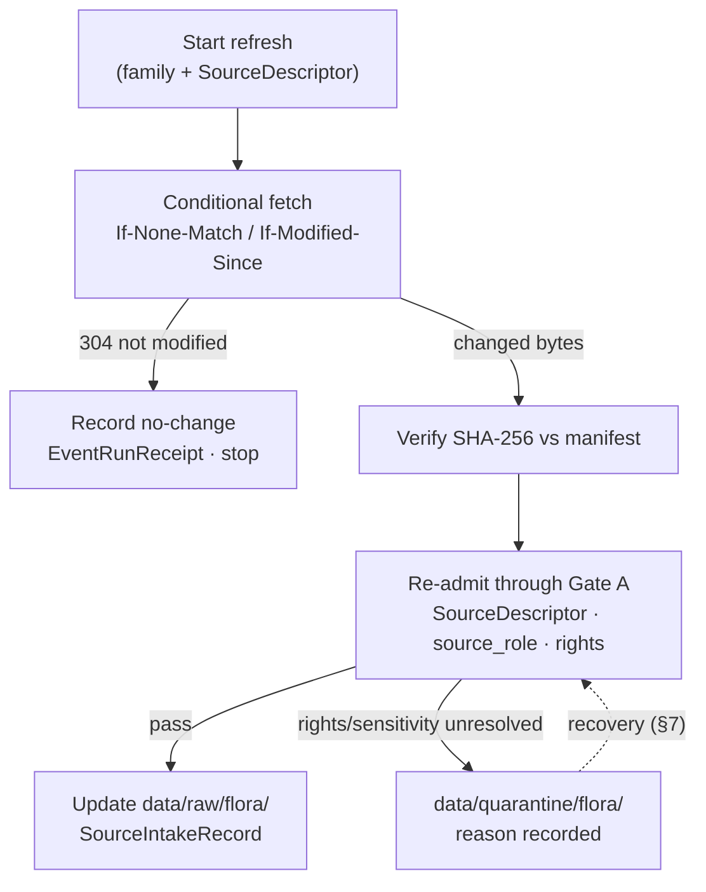

<!-- [KFM_META_BLOCK_V2]
doc_id: kfm://doc/flora-source-refresh-runbook
title: Flora Domain — Source Refresh Runbook
type: standard
version: v1
status: draft
owners: <flora-source-steward> # PLACEHOLDER — assign before review
created: 2026-06-03
updated: 2026-06-03
policy_label: public
related: [docs/domains/flora/SOURCE_INTAKE.md, docs/domains/flora/SOURCE_FAMILIES.md, docs/domains/flora/SOURCES.md, docs/standards/SMART_SYNC.md, docs/runbooks/fauna/SOURCE_REFRESH_RUNBOOK.md, ai-build-operating-contract.md, directory-rules.md]
tags: [kfm]
notes: [CONTRACT_VERSION = "3.0.0"; authored at docs/runbooks/flora/ per Directory Rules §6.1.b Pattern A — requested path docs/domains/flora/ is a placement conflict logged as DRIFT candidate; runbook is operational procedure, not policy/contract]
[/KFM_META_BLOCK_V2] -->

# Flora Domain — Source Refresh Runbook

> Operational procedure for refreshing Flora sources: who owns the cadence, how to run a conditional refresh (no-network and live), how to read the receipts, and what to do when a refresh fails, stales, or surfaces sensitive data. A runbook explains **how to operate** — it does not encode policy or object meaning.


<!-- TODO: replace with real Shields.io endpoints (CI, last-updated) once wired -->

| Field | Value |
|---|---|
| **Status** | `draft` |
| **Owners** | `<flora-source-steward>` · `<pipeline-owner>` · `<policy-reviewer>` *(PLACEHOLDER — assign before review)* |
| **Updated** | 2026-06-03 |
| **Lane** | Flora `[DOM-FLORA]` |
| **Canonical path** | `docs/runbooks/flora/SOURCE_REFRESH_RUNBOOK.md` *(per Directory Rules §6.1.b, Pattern A)* |
| **Authority** | `ai-build-operating-contract.md` v3.0 · `directory-rules.md` · ADR-S-12 |

> [!WARNING]
> **Path note.** This runbook was requested at `docs/domains/flora/SOURCE_REFRESH_RUNBOOK.md`, but operational procedures live under `docs/runbooks/` (Directory Rules §6.1.b), not in the domain doc lane. It is authored here at `docs/runbooks/flora/`. If a copy is wanted under `docs/domains/flora/`, it should be a link, not a second source of truth — log the divergence in `docs/registers/DRIFT_REGISTER.md` (OPEN-DR-02).

---

## Contents

- [1. When to run this](#1-when-to-run-this)
- [2. Ownership & thresholds](#2-ownership--thresholds)
- [3. Preconditions](#3-preconditions)
- [4. No-network dry run](#4-no-network-dry-run)
- [5. Live refresh procedure](#5-live-refresh-procedure)
- [6. Reading the receipts](#6-reading-the-receipts)
- [7. Failure & response steps](#7-failure--response-steps)
- [8. Stale-state handling](#8-stale-state-handling)
- [9. Reviewer checklist](#9-reviewer-checklist)
- [10. What this runbook does NOT cover](#10-what-this-runbook-does-not-cover)
- [Open questions register](#open-questions-register)
- [Open verification backlog](#open-verification-backlog)
- [Changelog](#changelog-v0--v1)
- [Definition of done](#definition-of-done)
- [Related docs](#related-docs)

---

## 1. When to run this

Run a Flora source refresh when:

- a watcher signals an upstream change (pre-RAW `EventEnvelope`);
- a scheduled cadence window opens for a family (per ADR-S-12);
- a steward requests a manual refresh after a license, taxonomy, or status change;
- a quarantined source has been remediated and is ready to re-admit.

> [!IMPORTANT]
> A refresh **re-admits** material; it does not publish. The output of this procedure is updated `RAW` / `QUARANTINE` content plus receipts. Promotion to `PROCESSED → CATALOG → PUBLISHED` happens through separate governed gates, not here. `[DIRRULES]`

[↑ Back to top](#contents)

---

## 2. Ownership & thresholds

Docs should expose threshold ownership, a reviewer checklist, local no-network run instructions, metric definitions, and response steps when a gate fails. *(KFM-P19-FEAT-0008.)*

| Concern | Owner role | Threshold / rule |
|---|---|---|
| Refresh cadence per family | `<flora-source-steward>` | Per ADR-S-12; **NEEDS VERIFICATION** per family. |
| Quarantine recovery | `<flora-source-steward>` + `<policy-reviewer>` | Rights or sensitivity resolved before re-admission. |
| Connector behavior | `<pipeline-owner>` | Connectors fetch & admit only; **never publish**. |
| Sensitivity disposition | `<policy-reviewer>` + domain steward | Rare-plant locations default **T4 (Denied)**. |

> [!NOTE]
> Owner fields are PLACEHOLDER. Assign from `CODEOWNERS` / steward charters before this runbook leaves `draft`.

[↑ Back to top](#contents)

---

## 3. Preconditions

Before refreshing, confirm:

1. The target family is profiled in [`SOURCE_FAMILIES.md`](../../domains/flora/SOURCE_FAMILIES.md) and admitted in [`SOURCES.md`](../../domains/flora/SOURCES.md).
2. A `SourceDescriptor` exists with `source_role` set (ADR-S-04).
3. Stored conditional-fetch validators (ETag / Last-Modified / manifest checksum) are available for comparison.
4. Rights and sensitivity posture are known or explicitly held.

[↑ Back to top](#contents)

---

## 4. No-network dry run

CONFIRMED doctrine: refresh logic must be exercisable **without live ingestion**, against fixtures, so the gate behavior is provable offline.

```text
# ILLUSTRATIVE — commands and paths are PROPOSED, not verified against a mounted repo.
# 1. Point the connector at local fixtures, not the live endpoint.
# 2. Run the refresh in dry-run mode (no writes to data/raw).
# 3. Assert the conditional-fetch decision and the emitted receipts.

<runner> flora refresh --family gbif-vascular-ks --dry-run --fixtures fixtures/domains/flora/
# expect: EventRunReceipt with http_validators recorded; no-change OR change decision logged
# expect: no write to data/published; watcher-as-non-publisher preserved
```

> [!TIP]
> Negative fixtures matter as much as positive ones: a stale validator, a sensitive-geometry payload, and a rights-unknown payload should each produce the correct hold/deny outcome in dry run.

[↑ Back to top](#contents)

---

## 5. Live refresh procedure

CONFIRMED: all HTTP polling is **conditional**. Store the ETag; send `If-None-Match`; on `304`, skip the download. Fall back to `Last-Modified` / `If-Modified-Since`, then to a SHA-256 manifest checksum. Record validators in the run receipt so an audit can replay the no-change decision. *(C3-01; `docs/standards/SMART_SYNC.md`.)*



Step-by-step:

1. Run the conditional fetch for the family. On `304`, record the no-change `EventRunReceipt` and stop.
2. On change, verify SHA-256 against the manifest (guards against validator false-positives).
3. Re-admit through **Gate A — source identity**: confirm `SourceDescriptor`, `source_role`, and rights.
4. On pass, update `data/raw/flora/` and write a `SourceIntakeRecord`.
5. On unresolved rights or sensitive geometry, route to `data/quarantine/flora/` with a recorded reason ([§7](#7-failure--response-steps)).

[↑ Back to top](#contents)

---

## 6. Reading the receipts

A refresh is auditable only through its receipts.

| Receipt | Read it to learn… |
|---|---|
| `EventRunReceipt` | What changed, which validator fired, the hash inputs, the candidate destination. |
| `SourceIntakeRecord` | Whether (and when) the source-update event was admitted. |
| `SourceDescriptor` | The current source identity, role, rights, sensitivity, cadence. |
| `PolicyDecision` | The admission outcome: `allow / deny / restrict / hold / abstain` + reason. |
| `RedactionReceipt` | What sensitive field/geometry was transformed during recovery. |

> [!NOTE]
> A transition is closed only when the required receipts exist, each resolves what it depends on (`source_id → SourceDescriptor`), and the policy gate recorded its decision. Missing any of these fails closed. `[ENCY] [DIRRULES]`

[↑ Back to top](#contents)

---

## 7. Failure & response steps

| Symptom | Reason code (PROPOSED) | Response |
|---|---|---|
| No `SourceDescriptor` / role unset | `MISSING_RECEIPT`, `ROLE_COLLAPSE` | Create / fix descriptor; set `source_role`; re-run from Gate A. |
| Rights or license unresolved | `RIGHTS_UNKNOWN` | Hold in quarantine; steward resolves terms; record in `rights`; re-admit. |
| Sensitive rare-plant geometry present | `SENSITIVITY_UNRESOLVED` | Generalize / withhold; emit `RedactionReceipt` + `ReviewRecord`; re-admit at safe tier. |
| Validator false-positive (bytes unchanged) | — | Verify SHA-256 vs manifest before re-promoting; record in `EventRunReceipt`. |
| Attempted role upcast | `ROLE_DOWNCAST_FORBIDDEN` | Refuse; restore original role; corrections produce a new descriptor + `CorrectionNotice`. |

Every failure **fails closed** and preserves the prior state. Connector cadence and quarantine-recovery policy is governed by ADR-S-12.

[↑ Back to top](#contents)

---

## 8. Stale-state handling

When an upstream is stale or unreachable past its cadence window, the prior `RAW` content remains but downstream surfaces must reflect staleness rather than silently serving old data as fresh.

- Mark the source `SOURCE_STALE` in its descriptor / registry entry.
- Do not auto-promote stale content; require steward acknowledgement.
- Stale-state propagation to downstream claims is an open cross-lane question (ADR-S-10).

[↑ Back to top](#contents)

---

## 9. Reviewer checklist

Before signing off a Flora refresh:

- [ ] Conditional fetch used; validators recorded in `EventRunReceipt`.
- [ ] SHA-256 verified against manifest on any change.
- [ ] `source_role` set at admission; no in-place role edit.
- [ ] Rights known or explicitly held (Gate B obligations noted).
- [ ] Rare-plant / cultural-location geometry held or generalized (no public exact exposure).
- [ ] iNaturalist geoprivacy obscuration preserved; not de-obscured.
- [ ] No write to `data/published/` from this procedure (watcher-as-non-publisher).
- [ ] `SourceIntakeRecord` written; receipts resolve their dependencies.
- [ ] Stale sources marked `SOURCE_STALE`, not silently served.

[↑ Back to top](#contents)

---

## 10. What this runbook does NOT cover

- **Policy rule logic** → `policy/sensitivity/flora/`, `policy/domains/flora/` *(PROPOSED)*. A runbook does not encode policy.
- **Object meaning / schemas** → `contracts/` and `schemas/contracts/v1/`.
- **Intake architecture** → [`SOURCE_INTAKE.md`](../../domains/flora/SOURCE_INTAKE.md).
- **Promotion to PUBLISHED, release, rollback drills** → separate runbooks (`PROMOTION_RUNBOOK.md`, `ROLLBACK_RUNBOOK.md`) under `docs/runbooks/flora/`.
- **The smart-sync standard itself** → `docs/standards/SMART_SYNC.md`.

[↑ Back to top](#contents)

---

## Open questions register

| ID | Question | Owner role | Resolution path |
|---|---|---|---|
| OQ-FLORA-REF-01 | What is the refresh cadence and quarantine-recovery rule per family? | source steward | ADR-S-12. |
| OQ-FLORA-REF-02 | Is the runbook home `docs/runbooks/flora/` (Pattern A) or flat (Pattern B)? | docs steward | ADR (OPEN-DR-02); Pattern A recommended pending. |
| OQ-FLORA-REF-03 | What are the actual runner commands and fixture paths? | pipeline owner | Repo inspection of `connectors/`, `pipelines/`, `fixtures/`. |
| OQ-FLORA-REF-04 | How does stale-state propagate to downstream flora claims? | flora steward | ADR-S-10 (stale-state propagation). |

## Open verification backlog

These items remain `NEEDS VERIFICATION` before promotion from `draft` to `published`:

1. Per-family cadence and quarantine-recovery policy (ADR-S-12).
2. Runbook subfolder vs flat naming resolution (OPEN-DR-02).
3. Runner commands, dry-run flags, and fixture paths.
4. Existence of `data/raw/flora/`, `data/quarantine/flora/`, `docs/standards/SMART_SYNC.md`.
5. Reviewer / steward / pipeline owners (currently PLACEHOLDER).
6. Whether sibling promotion / rollback runbooks exist under `docs/runbooks/flora/`.

## Changelog v0 → v1

| Change | Type (per contract §37) | Reason |
|---|---|---|
| Initial Flora source-refresh runbook created at `docs/runbooks/flora/` | new | No prior file; built from conditional-fetch (C3-01), Gate A, ADR-S-12, KFM-P19-FEAT-0008 runbook shape, and `[DOM-FLORA]` sensitivity posture. |

> **Backward compatibility.** New file; no anchors to preserve. Mirrors the fauna runbook structure (Pattern A). Requested path `docs/domains/flora/SOURCE_REFRESH_RUNBOOK.md` is a placement conflict — link, do not duplicate.

## Definition of done

This document is done enough to enter the repository when:

- it is placed under `docs/runbooks/flora/` per Directory Rules §6.1.b (Pattern A);
- a docs steward, the flora source steward, and a pipeline owner review it;
- it is linked from the runbook index and the Flora lane index;
- it does not conflict with accepted ADRs (notably ADR-S-12, and OPEN-DR-02 once resolved);
- the placement divergence from the requested path is logged in `docs/registers/DRIFT_REGISTER.md`;
- the `GENERATED_RECEIPT.json` planned in Section 2 is wired into CI;
- placeholder owners, runner commands, and cadence values are resolved.

---

### Related docs

- [`docs/domains/flora/SOURCE_INTAKE.md`](../../domains/flora/SOURCE_INTAKE.md) — intake mechanics
- [`docs/domains/flora/SOURCE_FAMILIES.md`](../../domains/flora/SOURCE_FAMILIES.md) — upstream family profiles
- [`docs/domains/flora/SOURCES.md`](../../domains/flora/SOURCES.md) — per-source admission register
- `docs/runbooks/fauna/SOURCE_REFRESH_RUNBOOK.md` — sibling-lane precedent (Pattern A)
- `docs/standards/SMART_SYNC.md` — conditional-fetch standard *(TODO: confirm)*
- `ai-build-operating-contract.md` — operating contract (`CONTRACT_VERSION = "3.0.0"`)
- `directory-rules.md` — placement law (§6.1.b runbook contract)

**Last updated:** 2026-06-03 · **Contract:** `CONTRACT_VERSION = "3.0.0"`

[↑ Back to top](#contents)
