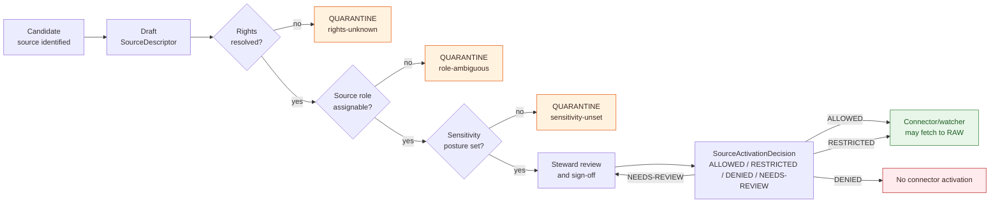

<!-- [KFM_META_BLOCK_V2]
doc_id: kfm://doc/domain-flora-source-registry
title: Flora — Source Registry
type: standard
version: v0.1
status: draft
owners: Docs steward + Flora lane owner + Source authority steward
created: 2026-05-16
updated: 2026-05-16
policy_label: public
related:
  - docs/doctrine/directory-rules.md
  - docs/doctrine/lifecycle-law.md
  - docs/doctrine/truth-posture.md
  - docs/doctrine/trust-membrane.md
  - docs/domains/flora/README.md                          # NEEDS VERIFICATION
  - docs/domains/fauna/SOURCE_REGISTRY.md                 # NEEDS VERIFICATION (sibling pattern)
  - docs/sources/SOURCE_DESCRIPTOR_STANDARD.md            # NEEDS VERIFICATION
  - docs/runbooks/fauna/SOURCE_REFRESH_RUNBOOK.md         # CONFIRMED (sibling pattern, this session lineage)
  - docs/standards/PROV.md                                # CONFIRMED (sibling pattern, this session lineage)
  - docs/adr/ADR-0001-schema-home.md
  - control_plane/source_authority_register.yaml         # NEEDS VERIFICATION
  - data/registry/sources/flora/                          # PROPOSED machine-readable home
tags: [kfm, domain, flora, source-registry, sources, governance, deny-by-default]
notes:
  - PROPOSED placement under docs/domains/flora/ per Directory Rules §12 Domain Placement Law and §6.1.
  - This doc is the human-readable doctrine for the Flora source registry; descriptors themselves live under data/registry/sources/flora/.
  - Source-role enum mapping for individual families is PROPOSED until ADR or schema PR confirms.
  - Rights and endpoint status for every source family is NEEDS VERIFICATION pending mounted-repo and live-source review.
[/KFM_META_BLOCK_V2] -->

# 🌿 Flora — Source Registry

Doctrinal register of admissible Flora-domain sources — identity, role, rights, sensitivity, cadence, and admission posture — anchoring every Flora claim to an accountable, governed source before it enters the lifecycle.

[](#)
[](#)
[](#)
[](#)
[](#)
[](#)
[](#)
[](#)

> **Status:** Draft · **Owners:** Docs steward · Flora lane owner · Source authority steward · **Updated:** 2026-05-16

---

## Contents

1. [Purpose and scope](#1-purpose-and-scope)
2. [Repo fit](#2-repo-fit)
3. [Inputs and exclusions](#3-inputs-and-exclusions)
4. [Source admission lifecycle](#4-source-admission-lifecycle)
5. [Flora source families](#5-flora-source-families)
6. [Source roles applied to Flora](#6-source-roles-applied-to-flora)
7. [Sensitivity and rights posture](#7-sensitivity-and-rights-posture)
8. [Cadence and freshness expectations](#8-cadence-and-freshness-expectations)
9. [Activation gates](#9-activation-gates)
10. [Watchers and source-drift candidates](#10-watchers-and-source-drift-candidates)
11. [SourceIntakeRecord shape](#11-sourceintakerecord-shape)
12. [Anti-patterns](#12-anti-patterns)
13. [Verification backlog and open questions](#13-verification-backlog-and-open-questions)
14. [Related docs](#14-related-docs)

---

## 1. Purpose and scope

**CONFIRMED doctrine.** The Flora source registry is an admission and authority-control surface, not a bibliography. It records each Flora source's identity, role, rights posture, access method, cadence, steward, sensitivity, freshness expectation, attribution requirement, and public-release class, so source material can be admitted, quarantined, restricted, or denied **before** it shapes public Flora claims.

**CONFIRMED doctrine.** Every admitted Flora source must enter through a `SourceDescriptor` recording source identity, role, rights, cadence, endpoint, version, contact, `source_head`, sensitivity, and admissibility limits. Without a descriptor, downstream evidence resolution has no stable anchor — there is no way to look up whether a claim's source has admissible rights, what role the source plays, or what its update cadence implies for freshness.

This document is the **human-readable doctrine** for the Flora registry. The **machine-readable descriptors** themselves live under `data/registry/sources/flora/` (PROPOSED — see §2).

> [!IMPORTANT]
> **The descriptor records *that the source exists* and *how it should be treated*, not *what the source says*.** A source admitted to the registry is **not** therefore a publishable claim; it is a candidate that may flow through `RAW → WORK / QUARANTINE → PROCESSED → CATALOG / TRIPLET → PUBLISHED` only when every gate is satisfied.

### Scope

In scope:

- Source families admissible to the Flora domain (taxonomy, specimens, occurrences, vegetation communities, rare-plant context, invasives, phenology, restoration, remote-sensing vegetation indices).
- Role classification for each family, mapping each source to the `SourceDescriptor.source_role` enum.
- Rights, sensitivity, cadence, and freshness expectations.
- Admission and activation gates, watcher-as-non-publisher invariants, and `SourceIntakeRecord` shape.
- Cross-references to schemas, policy, and control-plane registers.

Out of scope:

- Authoritative botanical claims, taxonomic decisions, or release statements (those flow through the published `EvidenceBundle` surface, not through this registry).
- Cross-domain sources owned elsewhere (e.g., SSURGO soils, CDL crop cover, NWI wetlands) — referenced here only when Flora joins or contextual use creates new sensitivity.

[Back to top ↑](#contents)

---

## 2. Repo fit

> [!NOTE]
> Path claims below are **PROPOSED** per [Directory Rules §0 and §12 Domain Placement Law](../../doctrine/directory-rules.md) and remain `NEEDS VERIFICATION` until inspected against a mounted repo.

```text
docs/domains/flora/SOURCE_REGISTRY.md          ← this file
docs/domains/flora/README.md                   ← landing page             (NEEDS VERIFICATION)
docs/sources/SOURCE_DESCRIPTOR_STANDARD.md     ← cross-domain standard    (NEEDS VERIFICATION)
data/registry/sources/flora/                   ← machine-readable descriptors (PROPOSED)
schemas/contracts/v1/source/source-descriptor.json   ← canonical schema   (PROPOSED, per ADR-0001)
policy/domains/flora/                          ← domain policy bundle     (PROPOSED)
control_plane/source_authority_register.yaml   ← cross-domain index       (NEEDS VERIFICATION)
tests/domains/flora/                           ← validators + fixtures    (PROPOSED)
fixtures/domains/flora/sources/                ← no-network fixtures      (PROPOSED)
```

**Upstream doctrine:**

- [Directory Rules](../../doctrine/directory-rules.md) — §6.1 (`docs/` layout), §9.1 (`data/registry/`), §12 (Domain Placement Law).
- [Lifecycle Law](../../doctrine/lifecycle-law.md) — `RAW → WORK / QUARANTINE → PROCESSED → CATALOG / TRIPLET → PUBLISHED`.
- [Trust Membrane](../../doctrine/trust-membrane.md) — public clients consume governed APIs, never raw or work stores.
- [Truth Posture](../../doctrine/truth-posture.md) — cite-or-abstain default.

**Downstream consumers (PROPOSED):**

- Flora connectors and watchers (e.g., `connectors/flora/*`, `tools/ingest/plants_watch/`).
- Flora pipelines (`pipelines/domains/flora/`) and pipeline specs (`pipeline_specs/flora/`).
- Evidence resolution surfaces (`apps/governed-api/` evidence routes).
- Flora policy validators (`policy/domains/flora/`) and rights/sensitivity validators (`tools/validators/`).

[Back to top ↑](#contents)

---

## 3. Inputs and exclusions

**Inputs accepted (descriptors live here, source bytes do not):**

- One `SourceDescriptor` per admitted Flora source family or sub-feed (PROPOSED schema home: `schemas/contracts/v1/source/source-descriptor.json`).
- One `SourceActivationDecision` per descriptor declaring `allowed | restricted | denied | needs-review` use (PROPOSED).
- Append-only history of descriptor revisions, supersession links, and retirement records.
- Per-source steward sign-off records where rights or sensitivity demand it.

**Excluded:**

- Raw source payloads → `data/raw/flora/<source_id>/<run_id>/` (CONFIRMED doctrine).
- Normalized records → `data/work/flora/...` and `data/processed/flora/...`.
- EvidenceBundles → `data/proofs/evidence_bundle/...`.
- ReleaseManifests → `release/manifests/...`.
- Bibliographies, narratives, or rights debate — those belong in `docs/sources/` or `docs/governance/`, not here.

> [!CAUTION]
> **Watchers and connectors are non-publishers.** A connector that fetches a Flora source must emit only to `data/raw/flora/<source_id>/<run_id>/` or `data/quarantine/flora/<reason>/<run_id>/`. A watcher that detects drift must emit only a `SourceIntakeRecord` candidate with `publication_state = WORK_CANDIDATE` and `promotion_required = true`. Neither writes to `processed/`, `catalog/`, or `published/`.

[Back to top ↑](#contents)

---

## 4. Source admission lifecycle

**CONFIRMED doctrine.** Source admission is a governed sequence, not a registration form. A source enters the registry only after rights, role, sensitivity, cadence, and access posture are recorded; it is *activated* (allowed to feed connectors) only after a `SourceActivationDecision`.



> [!NOTE]
> `SourceActivationDecision` is **PROPOSED** as the artifact that records the four-way activation outcome. The decision is referenced by every downstream `RunReceipt` and is the audit anchor when a connector is paused, retired, or rolled back.

[Back to top ↑](#contents)

---

## 5. Flora source families

**CONFIRMED doctrine / PROPOSED implementation.** The Flora domain's source families are drawn from the Encyclopedia (§7.6) and the Domains Culmination Atlas (§8.D), with the USDA PLANTS and Kansas herbaria additions from the New Ideas 5-8 packet. Each family below requires a `SourceDescriptor`; rights and endpoints are **NEEDS VERIFICATION** until live-source review and steward sign-off are recorded.

| # | Family | Typical role(s) | Public release class (default) | Rights / sensitivity | Status |
|---|---|---|---|---|---|
| F1 | **KDWP listed-species and stewardship context** (state rare-plant program; Ecological Review Tool outputs) | regulatory · administrative · context | **deny-by-default** for exact locations | rights NEEDS VERIFICATION; sensitive joins fail closed | PROPOSED |
| F2 | **Kansas Biological Survey / KU R. L. McGregor Herbarium** (specimen-portal exports; IPT/Darwin Core archives) | observed (specimens) | generalized public; exact for steward review | rights NEEDS VERIFICATION; many state herbaria use CC-BY 4.0 (EXTERNAL, see [§14](#14-related-docs)) | PROPOSED |
| F3 | **K-State Herbarium (KSC)** (Great-Plains-focused specimens) | observed (specimens) | generalized public; exact for steward review | rights NEEDS VERIFICATION; CC-BY 4.0 reported by KSC (EXTERNAL) | PROPOSED |
| F4 | **USFWS ECOS — plant context** (federally listed plants, recovery, critical habitat) | regulatory (legal status) · context | generalized public for listing context; deny exact sensitive geometry | federal public domain typical; per-record terms NEEDS VERIFICATION | PROPOSED |
| F5 | **NatureServe Explorer / Explorer Pro** (conservation status ranks: G/S/T) | regulatory (status authority) · aggregate | status ranks releasable; exact occurrences are not the source product | terms-restricted; redistribution constrained; NEEDS VERIFICATION | PROPOSED |
| F6 | **GBIF — vascular plant occurrences** (multi-source aggregator) | aggregate (occurrence aggregator) | generalized; sensitive-taxon join fails closed | per-dataset license tagged in Darwin Core metadata; honor each license (EXTERNAL) | PROPOSED |
| F7 | **iDigBio — specimen records** (US specimen aggregator) | aggregate (specimen aggregator) | generalized; institution attribution preserved | rights NEEDS VERIFICATION per source institution | PROPOSED |
| F8 | **iNaturalist — research-grade and casual observations** (community-science) | observed (community) — steward review required for public claim | generalized; restricted geoprivacy honored | obscured-coordinate rule must be honored; NEEDS VERIFICATION | PROPOSED |
| F9 | **USDA PLANTS Database** (national checklist, taxonomy, state/county distribution) | aggregate (taxonomy and county checklist) · context | releasable as checklist context; sensitive joins fail closed | public-domain checklist content; citation guidance per source (EXTERNAL) | PROPOSED |
| F10 | **Vegetation index / remote-sensing surfaces** (e.g., NDVI, MODIS, Landsat-derived; Planetary Computer STAC) | modeled (remote-sensing-derived) | generalized public; carries `role_model_run_ref` | per-asset license in STAC item metadata (EXTERNAL); NEEDS VERIFICATION | PROPOSED |
| F11 | **Restoration project records** (state and partner planting/restoration tracking) | observed (project-level) · administrative | restricted/public depending on landowner posture | steward-controlled; NEEDS VERIFICATION | PROPOSED |
| F12 | **Botanical survey records** (agency and partner vegetation surveys) | observed (survey-level) | generalized public; exact for steward review when sensitive | rights NEEDS VERIFICATION per program | PROPOSED |

> [!WARNING]
> **Join-induced sensitivity is real.** A benign source can become sensitive through join — PLANTS county checklists intersected with GBIF, iNaturalist, or KDWP-listed species can become a poaching map. Sensitivity is a property of the resulting product, not just the original source. The registry records both per-source posture **and** per-join deny rules.

### Family-specific notes

<details>
<summary><b>F2 / F3 — Herbaria via Darwin Core / IPT</b></summary>

PROPOSED intake: Darwin Core Archives (DwC-A) over IPT endpoints, normalized into `SpecimenRecord` candidates with institution code, catalog number, collector, collection date, taxon, and uncertainty radius preserved. Geoprivacy: respect each institution's obscured-coordinate policy; do not invert obscuration. CONFIRMED doctrine: exact rare-plant locations fail closed.

</details>

<details>
<summary><b>F6 — GBIF occurrence licensing</b></summary>

EXTERNAL: GBIF's per-dataset licensing is machine-tagged in Darwin Core metadata; each dataset's license must be honored individually. PROPOSED: capture `license` and `rightsHolder` into the per-source descriptor at intake, not only at the global GBIF entry.

</details>

<details>
<summary><b>F8 — iNaturalist obscured coordinates</b></summary>

EXTERNAL: iNaturalist applies coordinate obscuration to records of sensitive taxa, typically rounding to ~10 km grids or larger. CONFIRMED KFM doctrine: obscured coordinates are not to be reverse-engineered. PROPOSED: the descriptor records `obscured_coordinate_policy_honored = true` and the validator denies any pipeline that attempts to upscale precision.

</details>

<details>
<summary><b>F10 — Remote-sensing / modeled surfaces</b></summary>

CONFIRMED doctrine: modeled outputs are not observations. PROPOSED: every modeled-source descriptor carries `role_model_run_ref` pointing to a `ModelRunReceipt`. A NDVI tile from Planetary Computer STAC must record the STAC collection ID, asset href, retrieval time, and source license. Vegetation indices contextualize Flora claims; they do not assert species presence.

</details>

[Back to top ↑](#contents)

---

## 6. Source roles applied to Flora

**CONFIRMED doctrine.** The `SourceDescriptor.source_role` enum is `observed | regulatory | modeled | aggregate | administrative | candidate | synthetic` (PROPOSED canonical schema home: `schemas/contracts/v1/source/source-descriptor.json`). Source roles prevent **authority collapse** — a state listing is not an observation, a model surface is not a regulatory authority, and an aggregator is not a primary collector.

The table below is a **PROPOSED** role-claim matrix for Flora. Mismatches between role and claim type are a **publication-deny condition**, not a quality issue.

| Role | Flora examples | May support claims about… | Must NOT be cited as evidence for… |
|---|---|---|---|
| `observed` | Herbarium specimens (KU/KSC), iNaturalist research-grade observations, botanical surveys | Species presence at a place/time with stated uncertainty; phenology events | Legal listing status; range polygons (use authoritative ranges); modeled suitability |
| `regulatory` | USFWS ECOS listings; NatureServe G/S ranks; KDWP listed-species status | Legal/conservation status; listing-driven sensitivity controls | Direct field observations; abundance |
| `aggregate` | GBIF occurrences; iDigBio specimens; USDA PLANTS county checklists | County- or coarser-grained presence; trend context with caveats | Per-record originality (cite the underlying institution) |
| `modeled` | NDVI / vegetation indices; range/distribution models; restoration suitability surfaces | Modeled vegetation condition or suitability under stated assumptions | Observed presence; legal status; primary occurrence |
| `administrative` | Restoration program rosters; state ecological-review compilations | Programmatic context, project metadata | Field observation, taxonomic authority |
| `candidate` | Unreviewed contributions; pre-promotion intake | Internal review only | Any PUBLISHED edge — `PUBLISHED ← candidate` is forbidden |
| `synthetic` | Generated illustrative surfaces; simulated rasters | Pedagogy, scenario illustration with Reality Boundary Note | Any observed-reality claim |

> [!IMPORTANT]
> **A single source may carry different roles for different claim types.** GBIF, for example, is `aggregate` for occurrence context but is never the authority for legal listing status. The descriptor records the *primary* role, and the per-claim `EvidenceBundle` records the role actually used.

[Back to top ↑](#contents)

---

## 7. Sensitivity and rights posture

**CONFIRMED doctrine.** Rare, protected, culturally sensitive, and steward-reviewed flora **default to generalized, withheld, staged, or denied** public geometry. Unclear rights, unresolved source role, missing evidence, unresolved sensitivity, or absent release state **block public promotion**.

### Default outcome by class (Flora-applicable subset of the Sensitive / Deny-by-Default Register)

| Class | Examples | Default outcome | Required controls |
|---|---|---|---|
| **Rare plant locations** | Exact occurrences of S1/S2 / federally listed / KDWP-listed taxa | **DENY** public exact location; generalized public products only | geoprivacy transform receipt; steward review |
| **Sacred / culturally sensitive plants** | Plants tied to oral history, ceremonial use, or steward-controlled cultural geography | **DENY** until steward review and access class approve | consultation record; sensitivity transform |
| **Private-landowner-sensitive observations** | Records keyed to private parcels with unresolved permission | **DENY** exact/public if private or rights unclear | aggregation; permissions; policy review |
| **Source-rights-limited records** | Licensed feeds, restricted-redistribution material | **DENY** public release until terms resolved | rights register; attribution; no public derivative if barred |
| **Exact sensitive locations (general)** | Any exact point that increases harm risk | **DENY** by default | redaction/generalization; audit |

> [!CAUTION]
> **Public release of exact rare-plant geometry is a publication-deny condition.** Public Flora layers must consume **generalized, geoprivacy-transformed surfaces**, with the transform recorded in a `RedactionReceipt`. The steward-only view may surface exact geometry under access controls — but never the trust-membrane public route.

### Rights as evidence

**CONFIRMED doctrine.** Source rights, source licenses, data-use contacts, attribution requirements, and any written consent must be stored and checked **before ingest or release**. A claim derived from a source whose rights are unverified is not a publishable claim, regardless of how well-modeled the rest of the pipeline is.

Required descriptor fields for rights (PROPOSED shape, NEEDS VERIFICATION against canonical schema):

```yaml
rights:
  license_id: string            # e.g. "CC-BY-4.0", "CC0-1.0", "public-domain-us-gov", "restricted"
  license_text_or_contact: string
  attribution_required: bool
  attribution_text: string|null
  redistribution_class: enum    # allowed | restricted | denied | needs-review
  consent_record_ref: kfm://... | null
  rights_verified_at: timestamp
  rights_verified_by: steward_id
```

[Back to top ↑](#contents)

---

## 8. Cadence and freshness expectations

**CONFIRMED doctrine.** Update cadence is part of a source's admissibility. A descriptor without cadence cannot answer the question "is this still current enough to cite?" — a stale source can be more dangerous than no source at all.

| Family | PROPOSED cadence class | PROPOSED freshness window | Watcher signal |
|---|---|---|---|
| F1 KDWP listed-species / ERT | irregular (regulatory event-driven) | re-fetch on listed-species change announcement | HEAD/ETag + steward bulletin watch |
| F2/F3 Herbaria (KU, KSC) | quarterly–annual | annual baseline + on-demand for collection updates | DwC-A archive timestamp + spec_hash |
| F4 USFWS ECOS | event-driven (per listing/critical-habitat update) | weekly poll | ECOS feed `Last-Modified` |
| F5 NatureServe | quarterly–annual (status revisions) | quarterly check | versioned dataset_id |
| F6 GBIF | rolling (occurrence search continuous) | per-DOI snapshot pinned at intake | dataset doi + occurrence count delta |
| F7 iDigBio | rolling | per-portal pull | snapshot hash |
| F8 iNaturalist | continuous | bounded weekly pull for non-sensitive taxa | observation_id range delta |
| F9 USDA PLANTS | irregular | annual baseline + drift watcher | PLANTS taxa drift watcher (see §10) |
| F10 Vegetation indices | per-sensor cadence (daily / 8-day / 16-day) | per-asset retrieval timestamp | STAC item updated + checksum |
| F11 Restoration records | irregular | annual or per-program cycle | source-program bulletin |
| F12 Botanical surveys | irregular (project-driven) | per-survey | survey program register |

> [!NOTE]
> **Freshness is a policy choice, not a universal scientific absolute.** Materiality thresholds, recency windows, and "stale" cutoffs are recorded in the descriptor and reviewed by stewards. Treating any of these as machine-fixed constants is an anti-pattern.

[Back to top ↑](#contents)

---

## 9. Activation gates

**CONFIRMED doctrine.** A descriptor's *existence* in the registry is admission; a descriptor's *activation* is the steward-signed decision allowing a connector or watcher to fetch from it. Connectors and watchers stay **inactive** until activation, fixtures, validators, and policy gates exist.

### Required gates (PROPOSED canonical names; NEEDS VERIFICATION against existing validator names)

| Gate | What it checks | Outcome if fail |
|---|---|---|
| **G-RIGHTS** | License recorded; redistribution class set; attribution captured; consent record present if required | `DENY` activation |
| **G-ROLE** | `source_role` set; role-specific MUST fields present (`role_authority`, `role_model_run_ref`, `role_aggregation_unit`, etc.) | `DENY` activation |
| **G-SENSITIVITY** | Sensitivity class assigned; default outcome recorded; geoprivacy posture set; join-sensitivity rules documented | `DENY` activation |
| **G-CADENCE** | Cadence class and freshness window recorded; watcher signal selected | `ABSTAIN` (cannot activate watcher) |
| **G-CONTACT** | Steward of record; source contact; rights contact | `ABSTAIN` |
| **G-FIXTURE** | At least one positive and one negative no-network fixture present | `ABSTAIN` |
| **G-VALIDATOR** | Schema validator, rights validator, sensitivity validator wired and green | `ABSTAIN` |
| **G-NO-PUBLISH-EDGE** | No connector or watcher writes to `processed/`, `catalog/`, or `published/` | `DENY` activation |

> [!IMPORTANT]
> **`G-NO-PUBLISH-EDGE` is the watcher-as-non-publisher invariant in concrete form.** A connector that writes anywhere beyond `data/raw/flora/...` or `data/quarantine/flora/...` fails the gate and cannot activate — regardless of how clean the rest of the descriptor looks.

### Activation outcomes

```text
allowed       — connector/watcher may fetch; runs are recorded; pipeline may consume RAW
restricted    — connector/watcher may fetch under stated constraints (e.g. steward-only fixture mode,
                rate-limited, partial taxa list); explicit constraint set is part of the decision
denied        — connector/watcher must not fetch; any drift is handled offline
needs-review  — steward review required before any further state; quarantine is the safe state
```

[Back to top ↑](#contents)

---

## 10. Watchers and source-drift candidates

**CONFIRMED doctrine.** Watchers detect change; they do not declare truth. Every watcher tick for a Flora source emits — at most — a `SourceIntakeRecord` candidate with `publication_state = WORK_CANDIDATE` and `promotion_required = true`. A successful fetch means *the URL responded*; it does not mean *the new content is admissible*.

### Flora-relevant watchers (PROPOSED)

| Watcher | What it watches | Signal | Emits | Status |
|---|---|---|---|---|
| **PLANTS taxa drift** | USDA PLANTS county checklists vs prior package under a stable taxonomy version | set-difference of taxa under same `taxonomy_version`; intersection with state/federal listed-species | `SourceIntakeRecord` + steward markdown summary | CONFIRMED design (New Ideas 5-15); PROPOSED implementation |
| **Herbarium DwC-A snapshot watcher** | DwC-A archive timestamp + `spec_hash` for each institution | archive updated; record count delta; new taxa | `SourceIntakeRecord` per institution | PROPOSED |
| **GBIF occurrence delta** | Per-dataset DOI snapshot vs prior; occurrence count delta within Flora taxa | snapshot hash + record-count delta | `SourceIntakeRecord` per dataset | PROPOSED |
| **USFWS ECOS listing watcher** | ECOS feed `Last-Modified`; status-change events for plants | event-driven status change | `SourceIntakeRecord` + sensitivity recompute trigger | PROPOSED |
| **NatureServe rank watcher** | Conservation rank (G/S/T) revisions for Flora-relevant taxa | versioned dataset_id; rank-change delta | `SourceIntakeRecord` | PROPOSED |
| **Vegetation-index STAC watcher** | New STAC items in relevant collections (NDVI tiles, MODIS, Landsat derivatives) | STAC item `updated` timestamp + asset checksum | `SourceIntakeRecord` (modeled-role candidate) | PROPOSED |

> [!CAUTION]
> **PLANTS taxa drift is sensitivity-prone in join.** Taxa added or removed are analytically useful, but joining PLANTS county presence with GBIF, iNaturalist, KDWP, or USFWS listings can produce a poaching map. PLANTS drift outputs that touch sensitive taxa **must** route through steward review (`needs-review`) before any downstream join is allowed; the join product carries the join-induced sensitivity, not the inputs' weaker sensitivity.

### Source-head metadata (intake evidence, not validation)

**CONFIRMED doctrine.** Fast source-head checks (HTTP `HEAD`, `ETag`, `If-None-Match`, `Last-Modified`, `content-length`) record intake evidence but **do not substitute for substantive validation, rights review, or publication gates**. ETag alone is insufficient — publishers may re-publish under the same URL — and content hashes are stronger evidence when feasible.

Per-source descriptor recorded `source_head` shape (PROPOSED):

```json
{
  "sha256": "...",
  "etag": "...",
  "last_modified": "...",
  "content_length": 123456,
  "spec_hash": "...",
  "captured_at": "2026-05-16T00:00:00Z"
}
```

[Back to top ↑](#contents)

---

## 11. SourceIntakeRecord shape

**PROPOSED canonical shape** (drawn from New Ideas 5-15 and the Pass 20 Part 2 SRC normalization). The `SourceIntakeRecord` is the **watcher envelope** that wraps every drift signal, change candidate, or ingest decision so it remains reviewable.

```json
{
  "object_type": "SourceIntakeRecord",
  "schema_version": "v1",
  "source_descriptor_ref": "kfm://source/flora/usda-plants/2026",
  "source_role": "aggregate",
  "publication_state": "WORK_CANDIDATE",
  "promotion_required": true,
  "evidence_bundle_resolved": false,
  "policy_review_required": true,
  "drift_summary": {
    "scope": "county",
    "county_fips": "20053",
    "taxonomy_version": "usda_plants_2026_v1",
    "added_taxa": ["..."],
    "removed_taxa": ["..."],
    "sensitive_intersection": ["..."],
    "material_change": true
  },
  "source_head": {
    "sha256": "...",
    "etag": "...",
    "last_modified": "...",
    "content_length": 0,
    "spec_hash": "..."
  },
  "steward_summary_ref": "...",
  "captured_at": "2026-05-16T00:00:00Z"
}
```

> [!NOTE]
> The `steward_summary_ref` is a markdown payload designed for human review in an Evidence Drawer or admin surface. **A machine diff without a human-readable summary is not a complete `SourceIntakeRecord`.** Pair every histogram, set-difference, or hash delta with a written explanation a steward can act on.

[Back to top ↑](#contents)

---

## 12. Anti-patterns

| Anti-pattern | What goes wrong | Counter-rule |
|---|---|---|
| **Treating the descriptor as evidence** | A descriptor says a source exists; it does not say what the source says. Citing a descriptor as a Flora claim collapses admission into truth. | Cite `EvidenceBundle` for Flora claims; cite descriptors only when discussing source posture. |
| **Watcher publishes** | A drift watcher writes directly to `processed/` or `published/` because "the change is obvious." | Watchers emit `SourceIntakeRecord` to a candidate queue; pipelines promote. |
| **Fetch success = source acceptance** | A 200 OK or unchanged ETag is treated as proof of admissibility. | `source_head` is intake evidence; substantive validation, rights review, and policy gates are separate gates. |
| **Role invention** | An AI summary calls iNaturalist "the authority for legal status." | Source role is a registry property set by a steward; AI may not invent it. |
| **Reverse-engineering geoprivacy** | A pipeline upscales obscured iNaturalist coordinates from rounded grids. | Obscured-coordinate policy is honored; upscaling is a publication-deny condition. |
| **Join-induced sensitivity ignored** | PLANTS county checklist joined to GBIF occurrence stream without sensitivity recompute. | Join sensitivity is computed on the **product**, not inherited from the **inputs**; `needs-review` on intersecting listed-species sets. |
| **Convenience descriptor** | A free-text note in `data/raw/flora/...` standing in for a structured descriptor. | Every admitted source has a structured descriptor under `data/registry/sources/flora/`. |
| **Quiet rights drift** | Source license changes; descriptor not updated; pipeline continues. | License change ⇒ new descriptor revision + `CorrectionNotice`; promotion may pause until reviewed. |

[Back to top ↑](#contents)

---

## 13. Verification backlog and open questions

> [!NOTE]
> Items below are gated on mounted-repo evidence, steward sign-off, or live-source review. Every line below is `NEEDS VERIFICATION` (or `UNKNOWN`) until settled.

| Item | Evidence that would settle it | Status |
|---|---|---|
| Confirm per-family rights and current source terms (F1–F12) | Rights register entries; signed steward review; source-side license text captured into descriptors | NEEDS VERIFICATION |
| Confirm canonical `SourceDescriptor` schema home and field set | ADR or schema PR at `schemas/contracts/v1/source/source-descriptor.json` | NEEDS VERIFICATION |
| Confirm `data/registry/sources/flora/` exists and is append-only | Mounted-repo directory listing; CI append-only check | NEEDS VERIFICATION |
| Confirm `SourceActivationDecision` artifact shape and storage location | Schema PR or ADR; control-plane register entry | UNKNOWN |
| Confirm flora-specific sensitivity registry (state-listed, federally listed, culturally sensitive) | `policy/sensitivity/flora/` files; cross-reference with KDWP / USFWS lists | NEEDS VERIFICATION |
| Confirm geoprivacy transform menu (suppress, grid-generalize, county/HUC generalize, buffer, jitter-with-constraints, delayed-release, steward-only) and per-transform receipt schema | Policy bundle + schema + fixture coverage | NEEDS VERIFICATION |
| Confirm `taxonomy_version` registry source-of-truth (USDA PLANTS, ITIS, GBIF Backbone) and conflict-resolution rule | ADR or doctrine doc | UNKNOWN |
| Confirm rare-plant exact-location threshold (km radius for generalization; per-class policy) | `policy/domains/flora/geoprivacy.yaml` (PROPOSED) | UNKNOWN |
| Confirm PLANTS taxa-drift watcher first county fixture (county FIPS, baseline taxonomy version) | `fixtures/domains/flora/sources/plants/...` | PROPOSED |
| Confirm naming convention for `docs/runbooks/flora/...` vs flat-prefix runbooks (parallel to fauna decision) | Local `docs/runbooks/README.md` or ADR | NEEDS VERIFICATION |

### Open questions

- Which Flora source families require **written** steward or legal approval before connector activation, versus acceptance of public terms?
- Should the descriptor be **versioned independently** of the source it describes (recommended), and what is the supersession-link convention?
- For sources without stable ETag or `Last-Modified` (notably some IPT-hosted herbaria), what is the canonical fallback — content-hash plus `content-length`, or full re-fetch?
- Which **join patterns** (e.g., PLANTS × KDWP listed, GBIF × NatureServe S-rank) require **fail-closed denial** even when each input is individually safe?
- What is the appropriate **county-level generalization radius** for KDWP-listed plants? What about USFWS-listed? Should the policy differ by listing tier?
- Should community-science observations (iNaturalist research-grade) ever serve as the **sole** source for a public Flora claim, or always require corroboration?

[Back to top ↑](#contents)

---

## 14. Related docs

> [!NOTE]
> Links below mix CONFIRMED, PROPOSED, and NEEDS VERIFICATION targets. Update once mounted-repo evidence is available.

**Doctrine and lifecycle**

- [`docs/doctrine/directory-rules.md`](../../doctrine/directory-rules.md) — Domain Placement Law (§12); `data/registry/` rules (§9.1). *(CONFIRMED)*
- [`docs/doctrine/lifecycle-law.md`](../../doctrine/lifecycle-law.md) — `RAW → … → PUBLISHED`. *(NEEDS VERIFICATION as a target file)*
- [`docs/doctrine/truth-posture.md`](../../doctrine/truth-posture.md) — cite-or-abstain. *(NEEDS VERIFICATION)*
- [`docs/doctrine/trust-membrane.md`](../../doctrine/trust-membrane.md). *(NEEDS VERIFICATION)*

**Cross-domain source standards**

- [`docs/sources/SOURCE_DESCRIPTOR_STANDARD.md`](../../sources/SOURCE_DESCRIPTOR_STANDARD.md) — cross-domain descriptor doctrine. *(NEEDS VERIFICATION)*
- [`docs/standards/PROV.md`](../../standards/PROV.md) — provenance profile. *(CONFIRMED, sibling pattern from this session)*

**Schemas and policy (PROPOSED homes)**

- `schemas/contracts/v1/source/source-descriptor.json`
- `schemas/contracts/v1/source/source-intake-record.json`
- `schemas/contracts/v1/receipts/source-activation-decision.json`
- `policy/domains/flora/rights.yaml`
- `policy/domains/flora/sensitivity.yaml`
- `policy/domains/flora/geoprivacy.yaml`

**Sibling domain registries (parallel pattern)**

- `docs/domains/fauna/SOURCE_REGISTRY.md` *(NEEDS VERIFICATION — sibling not yet authored)*
- `docs/runbooks/fauna/SOURCE_REFRESH_RUNBOOK.md` *(CONFIRMED — authored in this session)*

**External references (EXTERNAL, generic standards / external tool behavior)**

- USDA PLANTS Database — checklist and county-distribution authoritative for U.S. plants; checklist content public-domain per published guidance. *(EXTERNAL, New Ideas 5-8 / 5-15)*
- GBIF — per-dataset license tagged in Darwin Core metadata. *(EXTERNAL, New Ideas 5-15)*
- Darwin Core / IPT — standard exchange format for specimen and occurrence data. *(EXTERNAL)*
- iNaturalist obscured-coordinate behavior for sensitive taxa. *(EXTERNAL)*
- Microsoft Planetary Computer STAC — STAC items carry per-asset licensing. *(EXTERNAL, New Ideas 5-15)*

---

<sub>Last updated: 2026-05-16 · Doc id: `kfm://doc/domain-flora-source-registry` · Version: v0.1 (draft) · [Back to top ↑](#contents)</sub>
