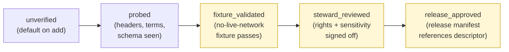
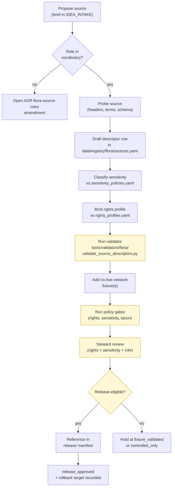

<!-- [KFM_META_BLOCK_V2]
doc_id: kfm://doc/flora/SOURCE_REGISTRY
title: Flora Source Registry — Human Guide
type: standard
version: v0.1
status: draft
owners: <flora-domain-stewards>            # NEEDS VERIFICATION — assign before promotion
created: 2026-05-08
updated: 2026-05-08
policy_label: public
related:
  - docs/domains/flora/README.md
  - docs/domains/flora/ARCHITECTURE.md
  - docs/domains/flora/PUBLICATION_AND_POLICY.md
  - docs/adr/ADR-flora-source-roles.md
  - docs/adr/ADR-flora-sensitive-location-policy.md
  - data/registry/flora/sources.yaml
  - data/registry/flora/source_roles.yaml
  - data/registry/flora/sensitivity_policies.yaml
  - data/registry/flora/taxon_authorities.yaml
  - data/registry/flora/rights_profiles.yaml
  - data/registry/flora/layer_registry.yaml
tags: [kfm, flora, registry, sources, governance, evidence]
notes:
  - Companion doc; machine truth lives in data/registry/flora/*.yaml.
  - All listed candidate sources are PROPOSED / NEEDS VERIFICATION.
[/KFM_META_BLOCK_V2] -->

# Flora Source Registry — Human Guide

> **Companion to `data/registry/flora/*.yaml`.** This document explains what the
> Flora source registry **is**, how to **read** its descriptors, how to **add or
> change** an entry, and what gates **fail closed** if a descriptor is incomplete.
> The YAML is the machine truth. This guide is the human contract.

<!-- TOP-OF-FILE IMPACT BLOCK -->

[](#status)
[](#)
[](../README.md)
[](../../doctrine/truth-posture.md)
[](../../doctrine/truth-posture.md)
[](#7-sensitivity--rights-coupling)

| Field    | Value |
|----------|-------|
| **Status**   | `draft` · doctrine PROPOSED, implementation NEEDS VERIFICATION |
| **Owners**   | `<flora-domain-stewards>` *(placeholder — assign before promotion)* |
| **Audience** | Flora domain stewards, source onboarders, reviewers, validator authors |
| **Updated**  | 2026-05-08 |

**Quick jump:**
[1 Scope](#1-scope) ·
[2 Repo fit](#2-repo-fit) ·
[3 Accepted inputs](#3-accepted-inputs) ·
[4 Exclusions](#4-exclusions) ·
[5 Source-role vocabulary](#5-source-role-vocabulary) ·
[6 Required descriptor fields](#6-required-descriptor-fields) ·
[7 Sensitivity + rights coupling](#7-sensitivity--rights-coupling) ·
[8 Verification ladder](#8-verification-ladder) ·
[9 Publication eligibility](#9-publication-eligibility) ·
[10 Candidate Kansas-flora sources](#10-candidate-kansas-flora-sources-needs-verification) ·
[11 Onboarding workflow](#11-onboarding-workflow) ·
[12 Validation + gates](#12-validation--gates) ·
[13 Illustrative descriptor](#13-illustrative-descriptor-not-canonical) ·
[14 Common mistakes](#14-common-mistakes) ·
[15 Open questions](#15-open-questions)

---

## 1. Scope

> [!NOTE]
> **PROPOSED:** This guide describes the Flora source registry as currently defined
> in the Flora Architecture Blueprint. The registry itself is **not yet implemented**
> in any verified repository state visible to this session. Treat all paths,
> filenames, and source candidates as **PROPOSED / NEEDS VERIFICATION** until a
> concrete repo scan or PR confirms them.

The Flora source registry is the place where every external or internal source
that contributes to flora truth is **described, role-assigned, rights-checked,
sensitivity-classified, and pinned for verification**. It is the upstream gate
for the entire flora lifecycle: nothing leaves `SOURCE EDGE → RAW` without a
descriptor.

This document is the **human-readable companion** to the YAML registry. It does
**not** replace the machine files; it explains them. When the YAML and this
guide disagree, the YAML — once validated — wins, and this guide is updated.

[Back to top](#flora-source-registry--human-guide)

---

## 2. Repo fit

```
docs/domains/flora/
├── README.md                          # lane index
├── ARCHITECTURE.md                    # full lane architecture
├── SOURCE_REGISTRY.md                 # ← you are here (human guide)
├── DATA_MODEL.md                      # object families, IDs
├── PUBLICATION_AND_POLICY.md          # rights/sensitivity gates
└── adr/ or ../../adr/                 # ADRs (see schema-home ADR; placement NEEDS VERIFICATION)

data/registry/flora/                   # machine truth — descriptors live here
├── sources.yaml                       # per-source descriptor records
├── source_roles.yaml                  # allowed roles + definitions
├── sensitivity_policies.yaml          # rare/protected/cultural rules
├── taxon_authorities.yaml             # accepted authorities + precedence
├── rights_profiles.yaml               # reusable license/terms profiles
└── layer_registry.yaml                # public-eligibility for map layers
```

**Upstream dependencies** (this doc reads from):

- `docs/adr/ADR-flora-source-roles.md` — fixes the role vocabulary.
- `docs/adr/ADR-flora-sensitive-location-policy.md` — fixes exact-vs-public-safe geometry thresholds.
- `docs/adr/ADR-flora-schema-home.md` — fixes where the `flora_source_descriptor` schema lives.
- `docs/domains/flora/ARCHITECTURE.md` — lane architecture and lifecycle invariants.

**Downstream consumers** (this doc and the YAML feed):

- `tools/validators/flora/validate_source_descriptors.py` — descriptor validator.
- `pipelines/flora/*` and `connectors/<flora-source>/*` — fetchers and watchers.
- `policy/flora/rights.rego`, `policy/flora/sensitivity.rego` — gate decisions.
- `apps/governed_api/services/flora.*` — runtime envelopes and Evidence Drawer payloads.
- `tests/fixtures/flora/{valid,invalid}/` — schema and policy fixtures.

> All paths are PROPOSED. Verify against actual repo conventions before creating
> them. If a shared `SourceDescriptor` already exists in the repo (for example
> under `schemas/contracts/v1/sources/`), **reuse or extend it** rather than
> creating a flora-specific duplicate — the schema-home ADR must precede any
> machine-file proliferation.

[Back to top](#flora-source-registry--human-guide)

---

## 3. Accepted inputs

This guide and the YAML registry accept:

- **Source descriptor records** — one per logical source, with all required fields below.
- **Source-role assignments** drawn from the fixed vocabulary in §5.
- **Rights / license / terms notes** sufficient to drive a publication decision.
- **Sensitivity classifications** keyed to the registers in `sensitivity_policies.yaml`.
- **Authority-boundary statements** — what the source *can* and *cannot* support.
- **Stable identifier hints** — native IDs, accession codes, dataset keys.
- **Cadence and freshness expectations** — used by watchers and freshness chips.
- **Verification evidence** — probe receipts, ETag/Last-Modified observations, fixture validations, steward reviews.

[Back to top](#flora-source-registry--human-guide)

---

## 4. Exclusions

> [!IMPORTANT]
> The following **do not belong** in this document or in the public registry files.
> Most have governed homes elsewhere; some must never be checked into the repo at all.

| Excluded content | Where it belongs instead |
|---|---|
| Credentials, API keys, access tokens, signed URLs | Secret manager / runtime config — **never** the repo |
| Exact sensitive coordinates (rare plants, occurrence points under restriction) | Restricted store; public registry references **redacted** geometry only |
| Raw source payloads or large data dumps | `data/raw/flora/<source>/<snapshot>/` — under lifecycle control |
| Per-row machine fields better stated as YAML | `data/registry/flora/*.yaml` — not narrative prose here |
| Release-specific manifests | `data/published/flora/manifests/` and `release/` |
| Per-run receipts / proofs | `data/receipts/flora/`, `data/proofs/flora/` |
| Source-specific legal opinions | Rights ADR or steward-review record, not this doc |
| Implementation-claim language without evidence | Stays out — flag it `NEEDS VERIFICATION` instead |

[Back to top](#flora-source-registry--human-guide)

---

## 5. Source-role vocabulary

> [!NOTE]
> **CONFIRMED doctrine / PROPOSED implementation.** Source role is a
> **first-class field** that travels into every processed record, EvidenceBundle,
> API envelope, Evidence Drawer payload, and layer descriptor. Role does **not**
> determine truth on its own — it sets **authority boundary**, **review burden**,
> and **publication default**.

| Role | Meaning | Default trust use | Publication default |
|---|---|---|---|
| `official` | Government or legally responsible source for status, regulation, or authoritative spatial layer. | Anchors official status claims **within authority boundary**. | Publish only after rights, sensitivity, and review are resolved. |
| `institutional` | Museum, herbarium, university, research institute, or agency-managed collection. | Strong evidence for specimen/collection facts; license/precision constraints possible. | Public-safe metadata; exact geometry depends on rights and sensitivity. |
| `steward_reviewed` | Curated by responsible flora steward, heritage program, or qualified domain reviewer. | Can lift quarantine or allow controlled internal use. | Public **only** with explicit release decision. |
| `corroborative` | Useful support but not controlling authority for legal/status claims. | Can corroborate presence, name, or context; cannot override `official`. | Usually aggregate/generalize; cite limitations. |
| `community_observation` | Public/community record (e.g., iNaturalist-like observation). | Useful with quality labels, reviewer status, and license checks. | Publish only if license **and** sensitivity allow; avoid false precision. |
| `controlled_access` | Source requiring terms, license, steward approval, or access-controlled use. | May inform internal review; cannot leak restricted attributes. | **DENY** public exact publication unless authorization is explicit. |
| `derived_model` | Model, index, interpolation, habitat suitability, range, or generalized summary. | Contextual/interpretive evidence only; **not** observation truth. | Publish with model card, uncertainty, and evidence lineage. |
| `generalized_public_surface` | Public-safe geometry or layer derived from internal details. | Outward display layer **after** redaction/generalization. | Publishable when transform lineage, sensitivity, and rights are resolved. |

> [!WARNING]
> **Role collapse is a quarantine condition.** A `community_observation` row
> presented as `official`, or a `derived_model` rendered as observed truth, is a
> `model_as_observation` / `knowledge_character_mismatch` failure and **fails
> closed** at the policy gate.

[Back to top](#flora-source-registry--human-guide)

---

## 6. Required descriptor fields

Every entry in `data/registry/flora/sources.yaml` MUST carry the fields below.
A descriptor missing any required field **fails closed** — the source is not
admitted to `RAW` and no downstream pipeline may read from it.

| Field | Purpose / gate relationship |
|---|---|
| `source_id` | Stable identifier for joins, provenance, receipts, EvidenceBundle refs, and catalog closure. Stable across descriptor revisions; version fields carry changes. |
| `title` / `provider` | Human review and authority boundary. |
| `url_or_access_path` | Fetch/probe target or controlled-access reference; **may be null** for offline or steward-only data. |
| `cadence_update_behavior` | Watcher scheduling and freshness chip behavior. |
| `rights_license_terms` | Required before publication; missing or unknown **fails closed** or `ABSTAIN`. |
| `sensitivity_posture` | One of: `public`, `internal`, `restricted`, `controlled`, `review_required`. Drives redaction and public eligibility. |
| `source_role` | Exactly one of the eight roles in §5. |
| `authority_boundary` | What this source **is allowed to support** and what it **cannot support**. |
| `stable_identifiers` | Native IDs (taxon ID, occurrence ID, accession ID, collection code, layer ID). |
| `spatial_resolution` | Claim precision; informs geoprivacy and uncertainty. |
| `temporal_resolution` | Valid-time / as-of handling. |
| `format_protocol` | CSV, JSON, ArcGIS REST, STAC, OGC API, Darwin Core Archive, GeoJSON, COG, PMTiles, etc. |
| `checksum_etag_last_modified` | Change detection and receipt reproducibility. |
| `verification_status` | One of: `unverified`, `probed`, `fixture_validated`, `steward_reviewed`, `release_approved`. |
| `public_publication_eligibility` | One of: `public_ok`, `public_generalized_only`, `controlled_only`, `deny`, `unknown`. |

**Identifier conventions** (see `ARCHITECTURE.md` §7 for the full list):

| ID | Pattern | Notes |
|---|---|---|
| `source_id` | `flora.source.<provider>.<scope>.v<n>` | Versioned; bump version on identity-changing updates. |
| `taxon_id` | `kfm://flora/taxon/<authority>/<id>` | From accepted authority where available. |
| `occurrence_id` | `kfm://flora/occurrence/sha256:<hash>` | Source-native preferred; deterministic fallback otherwise. |
| `bundle_id` | `kfm://evidence/flora/sha256:<hash>` | EvidenceBundle identity. |

[Back to top](#flora-source-registry--human-guide)

---

## 7. Sensitivity + rights coupling

> [!CAUTION]
> **Default-DENY for rare-plant exact geometry.** Public payloads, public APIs,
> Focus Mode, AI answers, search indexes, graph projections, and tile services
> must not expose exact sensitive coordinates **unless** rights, policy, **and**
> review explicitly allow it. When in doubt: generalize, withhold, deny, stage,
> or delay — and record the transform.

The descriptor's `sensitivity_posture` and `rights_license_terms` jointly drive
publication. The mapping is in `sensitivity_policies.yaml`; the registry guide
explains it.

| Sensitivity class (from `sensitivity_policies.yaml`) | Public geometry behavior |
|---|---|
| `public_exact_allowed` | Non-sensitive, rights allow public exact geometry, source geoprivacy allows it. Exact public geometry may publish. |
| `public_generalized` | Publish only at county / grid / watershed / bbox / generalized support. Aggregated geometry **plus redaction receipt** required. |
| `restricted_precise` | Precise coordinates protected by taxon, source, steward, or policy. **No public precise geometry.** Restricted store only. |
| `embargoed` | Temporal delay required (observation/monitoring event). No public record until embargo lifts; public summary only otherwise. |
| `steward_review_required` | Human/steward review required before release-class decision. **HOLD**; no public promotion. |
| `quarantine` | Rights, sensitivity, taxonomy, geometry, or source role unresolved. **QUARANTINE**; not public. |

**Reason codes that fail closed** (drawn from `policy/flora/*.rego` doctrine):

```
missing_rights, unknown_rights
precise_sensitive_location_denied, geoprivacy_required
ambiguous_taxon_identity, accepted_taxon_required
public_payload_exposes_internal_ref
model_as_observation, knowledge_character_mismatch
review_required, steward_review_missing
public_geometry_not_generalized, invalid_geometry
```

The registry guide is read by reviewers when adding a row; the codes above are
read by the policy engine when running it.

[Back to top](#flora-source-registry--human-guide)

---

## 8. Verification ladder

Every descriptor advances through the ladder below. **No row is published-eligible
until at least `fixture_validated`.** Promotion to `release_approved` is a
governance event recorded in a review record, not a YAML edit alone.



| Stage | What it means | Public eligibility |
|---|---|---|
| `unverified` | Row exists, fields not yet checked. | None. |
| `probed` | Source endpoint, headers, terms, and schema have been seen. | None. |
| `fixture_validated` | A no-live-network fixture exercises the descriptor end-to-end. | `controlled_only` at most. |
| `steward_reviewed` | Flora steward has signed off on rights and sensitivity coupling. | Up to `public_generalized_only`. |
| `release_approved` | A release manifest references this descriptor and rollback target exists. | Up to `public_ok` (still gated by sensitivity policy). |

[Back to top](#flora-source-registry--human-guide)

---

## 9. Publication eligibility

`public_publication_eligibility` is a **descriptor-level cap**. The runtime gate
takes the **minimum** of (descriptor cap, sensitivity policy outcome, review
state, license profile).

| Value | Meaning |
|---|---|
| `public_ok` | Descriptor permits public exact publication if other gates also allow. |
| `public_generalized_only` | Descriptor permits public **generalized** publication only; exact geometry/values stay internal. |
| `controlled_only` | Internal/steward use only; never publishes. |
| `deny` | Descriptor denies publication outright. |
| `unknown` | Treated as `deny` until resolved. |

> [!TIP]
> When unsure between `public_generalized_only` and `controlled_only`, prefer
> the **stricter** value and open a verification-backlog item to clarify.

[Back to top](#flora-source-registry--human-guide)

---

## 10. Candidate Kansas-flora sources (NEEDS VERIFICATION)

> [!IMPORTANT]
> **Every row below is PROPOSED / NEEDS VERIFICATION.** Endpoints, terms,
> licenses, field semantics, and rare-location handling must be confirmed
> against authoritative sources before any descriptor is moved past `probed`.

| Candidate source | Proposed role | Key verification gates |
|---|---|---|
| **KDWP** flora / state-listed-species status & range context | `official` | Endpoint URL, official scope, rights, county/range semantics, rare-location policy. |
| **KDWP** Ecological Review Tool / steward review surfaces | `official` · `steward_reviewed` · `controlled_access` | Treat exact records as controlled; record review state and release authorization. |
| **Kansas Biological Survey / KU Biodiversity Institute** (incl. **KANU**, McGregor Herbarium IPT) | `institutional` · `controlled_access` | Use public collection metadata only until access terms and precision limits are explicit. |
| **Kansas State University Herbarium (KSC)** | `institutional` | Specimen-backed; preserve `institutionCode`/`catalogNumber`/`georeference quality`/rights. |
| **USFWS ECOS** species and critical-habitat context for plants | `official` | API fields, critical-habitat layer scope, federal-status boundary, update cadence. |
| **NatureServe Explorer / Explorer Pro** | `institutional` · `controlled_access` · `derived_model` | Separate public status/model summaries from licensed or precise occurrence data. |
| **GBIF** vascular-plant occurrence downloads / APIs | `corroborative` | Dataset-level license, `basisOfRecord`, coordinate uncertainty, quality filters. |
| **iDigBio** specimen records | `institutional` | Preserve `institutionCode`, `collectionCode`, `catalogNumber`, georeference quality, rights. |
| **iNaturalist**-derived community plant observations | `community_observation` | Filter by license, quality grade/review, taxon, precision, sensitive-coordinates flag. |
| **USDA PLANTS / ITIS / WFO / POWO** taxon authorities | `official` · `institutional` | Choose authority boundary in ADR; preserve raw taxon text and accepted ID. |
| **Remote-sensing vegetation products** (HLS-VI, Landsat, Sentinel-derived indices) | `derived_model` | Use as condition/phenology evidence only; include masks, windows, and uncertainty. |
| **Habitat covariates** (NLCD, NWI, GAP, LANDFIRE, soils, hydrology overlays) | `derived_model` · `official` | Link as covariates; do **not** convert habitat context into occurrence truth. |

[Back to top](#flora-source-registry--human-guide)

---

## 11. Onboarding workflow

Adding or changing a source is a **PR-driven, gate-bound** operation. The
sequence below is the canonical path; deviations require an ADR or a
verification-backlog entry that explains why.



**Per-source rollback rule.** Disable the descriptor by reverting the
registry-row PR; **preserve receipts and proofs** for any data already promoted
under the prior descriptor; emit a correction notice if a public artifact was
released.

[Back to top](#flora-source-registry--human-guide)

---

## 12. Validation + gates

The registry is enforced by a chain of validators and policy modules. Each is
PROPOSED until the schema-home ADR lands.

| Component | Path (PROPOSED) | Responsibility |
|---|---|---|
| Descriptor schema | `contracts/flora/flora_source_descriptor.schema.json` *or* `schemas/contracts/v1/flora/flora_source_descriptor.schema.json` (ADR decides) | Machine shape of every row in `sources.yaml`. |
| Source registry validator | `tools/validators/flora/validate_source_descriptors.py` | Required-field + role-vocabulary + value-range checks. |
| Rights policy | `policy/flora/rights.rego` | Rights/license/controlled-access decisions. |
| Sensitivity policy | `policy/flora/sensitivity.rego` | Sensitive-geometry and rare-flora rules. |
| Taxon policy | `policy/flora/taxon.rego` | Accepted-taxon and ambiguity rules. |
| CI workflow | `.github/workflows/flora-ci.yml` | Runs validator + policy + fixture suites on every PR. |
| Promotion workflow | `.github/workflows/flora-promotion.yml` | Blocks promotion if any gate is `UNKNOWN`. |

**Fixture pairing.** Each descriptor must point at:

- **At least one** valid fixture under `tests/fixtures/flora/valid/` exercising it end-to-end.
- **At least one** invalid fixture under `tests/fixtures/flora/invalid/` covering the most likely failure mode for that source role (e.g. `missing_rights.json`, `precise_sensitive_public_geometry.json`, `modeled_as_observed.json`).

[Back to top](#flora-source-registry--human-guide)

---

## 13. Illustrative descriptor (NOT canonical)

> [!NOTE]
> The YAML below is **illustrative only**. Field names follow §6; values are
> placeholders that have **not** been verified against any live source. **Do not
> copy this verbatim into `sources.yaml`.** Use the actual schema and the
> verification ladder.

<details>
<summary><b>Show illustrative <code>sources.yaml</code> entry</b></summary>

```yaml
# ILLUSTRATIVE — NOT canonical. Verify all fields before use.
- source_id: flora.source.usda_plants.checklist.v1
  title: USDA PLANTS — Complete Checklist (illustrative)
  provider: USDA NRCS
  url_or_access_path: <PROPOSED — verify current endpoint>
  cadence_update_behavior:
    type: snapshot
    expected_frequency: NEEDS_VERIFICATION
  rights_license_terms:
    profile: rights.public_domain.us_federal   # see rights_profiles.yaml
    attribution_required: true
  sensitivity_posture: public
  source_role: official
  authority_boundary:
    supports:
      - taxonomy_baseline
      - state_county_presence
    does_not_support:
      - rare_plant_exact_locations
      - critical_habitat_status
  stable_identifiers:
    native_keys: [plants_symbol, scientific_name_with_author]
  spatial_resolution: state_and_county
  temporal_resolution: snapshot_with_retrieved_at
  format_protocol: csv_or_extract
  checksum_etag_last_modified:
    method: sha256_over_canonical_payload
    last_observed: NEEDS_VERIFICATION
  verification_status: unverified
  public_publication_eligibility: unknown   # raise only after probe + steward review
  notes:
    - Use as taxonomic backbone and state-presence baseline only.
    - Do not infer occurrence truth from presence flags.
```

</details>

[Back to top](#flora-source-registry--human-guide)

---

## 14. Common mistakes

> [!WARNING]
> The patterns below are the failure modes the registry exists to prevent.
> Reviewers should reject PRs that exhibit any of them.

- **Treating `corroborative` as `official`.** GBIF presence does not anchor a state status claim; only a state authority can.
- **Publishing exact rare-plant geometry under "it's already public on the web."** Public exposure elsewhere does not transfer rights or override KFM sensitivity policy.
- **Letting `verification_status: unverified` reach `public_publication_eligibility: public_ok`.** Always blocked at the gate; flag the PR.
- **Adding a new role inline.** Roles are fixed by `source_roles.yaml` and `ADR-flora-source-roles.md`. New roles require an ADR amendment, not a row edit.
- **Co-mingling occurrence data and modeled habitat under a single descriptor.** They have different roles (`institutional`/`community_observation` vs `derived_model`) and different publication defaults.
- **Renaming `source_id` instead of versioning.** `source_id` is stable; use the version suffix (`.v2`) and migrate references.
- **Storing API keys, signed URLs, or session tokens in the YAML.** Never. The descriptor names the access path; the runtime resolves credentials elsewhere.
- **Silently overwriting a descriptor that has already produced public artifacts.** Add a new versioned row, mark the old as superseded, emit a correction notice if needed, and preserve receipts/proofs.

[Back to top](#flora-source-registry--human-guide)

---

## 15. Open questions

These items are tracked in `docs/domains/flora/VERIFICATION_BACKLOG.md` and must
be closed before the corresponding source is allowed to advance past
`fixture_validated`.

- **Schema home for `flora_source_descriptor`** — `contracts/flora/` vs `schemas/contracts/v1/flora/` is ambiguous in current evidence. Resolved by `docs/adr/ADR-flora-schema-home.md`. *(P0)*
- **ADR placement convention** — `docs/adr/ADR-flora-*` vs `docs/domains/flora/adr/ADR-flora-*` appears in different parts of the corpus. *(P0)*
- **Taxon authority precedence** — USDA PLANTS / ITIS / WFO / POWO ranking, plus how to express it in `taxon_authorities.yaml`. *(P0)*
- **NatureServe access tier** — what subset is `institutional`/`derived_model` vs `controlled_access`. *(P0)*
- **iNaturalist license filter** — the exact license set we accept for `community_observation` ingestion, and the quality-grade threshold. *(P1)*
- **GBIF citation surface** — whether we use GBIF download DOIs or rolling snapshots for citation lineage. *(P1)*
- **Rare-plant generalization grid** — the exact precision bucket(s) used for `public_generalized_only` rare-plant outputs (county, watershed, custom grid). Resolved by `docs/adr/ADR-flora-sensitive-location-policy.md`. *(P0)*
- **Specimen-vs-observation tiebreak** — the deterministic preference order across cross-source duplicates (e.g. KANU > KSC > iDigBio > GBIF crowd). *(P1)*

[Back to top](#flora-source-registry--human-guide)

---

## Appendix · Cross-references

<details>
<summary><b>Click to expand</b></summary>

- **Lifecycle invariant** (`SOURCE EDGE → RAW → WORK/QUARANTINE → PROCESSED → CATALOG/TRIPLET → PUBLISHED`): see `ARCHITECTURE.md` §6 and `docs/doctrine/lifecycle-law.md`.
- **EvidenceBundle / EvidenceRef contract**: see `DATA_MODEL.md` and the shared governance schemas.
- **Decision envelope outcomes** (`ANSWER` / `ABSTAIN` / `DENY` / `ERROR`): see `PUBLICATION_AND_POLICY.md`.
- **Sensitive / deny-by-default register**: KFM Encyclopedia §13. Rare-plant exact locations are listed under `Rare species` with a default-DENY public posture.
- **Directory-rules basis for this doc's path**: `docs/domains/flora/` is the responsibility-root home for flora documentation (Directory Rules — domain folders live under `docs/domains/`, not at repo root).

</details>

[Back to top](#flora-source-registry--human-guide)
