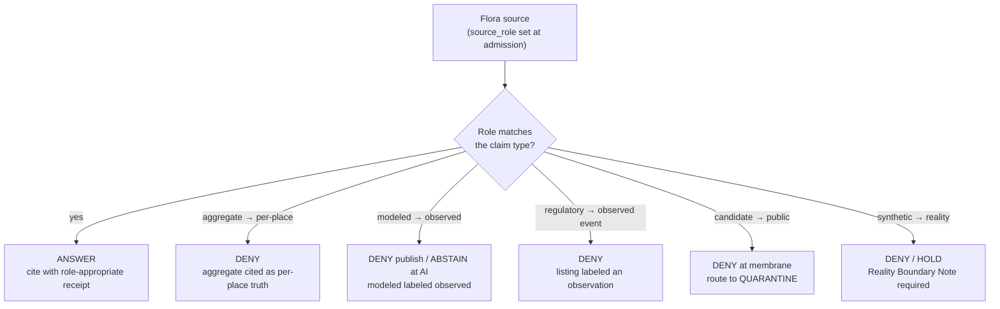

<!-- [KFM_META_BLOCK_V2]
doc_id: kfm://doc/flora-source-roles
title: Flora Domain — Source Roles
type: standard
version: v1
status: draft
owners: <flora-domain-steward> # PLACEHOLDER — assign before review
created: 2026-06-03
updated: 2026-06-03
policy_label: public
related: [docs/domains/flora/SOURCE_REGISTRY.md, docs/domains/flora/SOURCE_FAMILIES.md, docs/domains/flora/SOURCES.md, docs/domains/flora/SOURCE_INTAKE.md, schemas/contracts/v1/source/source-descriptor.json, ai-build-operating-contract.md, directory-rules.md]
tags: [kfm]
notes: [CONTRACT_VERSION = "3.0.0"; Flora-lane application of the Master Source-Role Anti-Collapse Register (Atlas §24.1); source_role enum is CONFIRMED doctrine, descriptor field shape PROPOSED per §24.1.3; ADR-S-04 governs vocabulary; all repo paths PROPOSED until verified]
[/KFM_META_BLOCK_V2] -->

# 🌿 Flora Domain — Source Roles

> The Flora-lane application of source-role doctrine: the seven canonical roles a Flora source may carry, what each may and may not back, how roles map to descriptor fields, and how the lifecycle and governed API **fail closed** when roles are collapsed. Source role is a first-class identity attribute — fixed at admission, never upgraded by promotion.

<!-- TODO: replace with real Shields.io endpoints (CI, last-updated) once wired -->

| Field | Value |
|---|---|
| **Status** | `draft` |
| **Owners** | `<flora-domain-steward>` · `<source-steward>` *(PLACEHOLDER — assign before review)* |
| **Updated** | 2026-06-03 |
| **Lane** | Flora `[DOM-FLORA]` |
| **Governs** | how each Flora source's `source_role` is assigned, applied, and protected from collapse |
| **Authority** | `ai-build-operating-contract.md` v3.0 · `directory-rules.md` · Atlas §24.1 · ADR-S-04 |

---

## Contents

- [1. Why source role exists](#1-why-source-role-exists)
- [2. Repo fit](#2-repo-fit)
- [3. The seven canonical roles](#3-the-seven-canonical-roles)
- [4. Roles applied to Flora](#4-roles-applied-to-flora)
- [5. The role-claim matrix](#5-the-role-claim-matrix)
- [6. Anti-collapse failure modes](#6-anti-collapse-failure-modes)
- [7. Role → descriptor fields](#7-role--descriptor-fields)
- [8. Role is fixed at admission](#8-role-is-fixed-at-admission)
- [9. What does not belong here](#9-what-does-not-belong-here)
- [Open questions register](#open-questions-register)
- [Open verification backlog](#open-verification-backlog)
- [Changelog](#changelog-v0--v1)
- [Definition of done](#definition-of-done)
- [Related docs](#related-docs)

---

## 1. Why source role exists

**CONFIRMED doctrine.** KFM treats source role as a **first-class identity attribute**. An observed reading is not interchangeable with a modeled estimate; a regulatory determination is not interchangeable with an administrative compilation; an aggregate publication is not interchangeable with candidate evidence; synthetic content is never the same thing as observed reality. The lifecycle and the governed API both **fail closed** when these roles are conflated.

For Flora specifically, this matters because the lane mixes very different source kinds: a USFWS listing (regulatory), a herbarium specimen (observed), a GBIF download (aggregate), an NDVI surface (modeled), and a stewardship compilation (administrative) can all describe "the same plant" while backing entirely different claims. Role keeps them honest.

> [!IMPORTANT]
> Role assignment is **not** a quality judgment. A high-quality aggregate is still an aggregate — it cannot be cited as a per-place observation. A role/claim mismatch is a **publication-deny condition**, not a data-cleanliness issue.

[↑ Back to top](#contents)

---

## 2. Repo fit

**Path (PROPOSED):** `docs/domains/flora/SOURCE_ROLES.md`

Per `directory-rules.md` §12 (Domain Placement Law), Flora is a **lane segment inside a responsibility root**, never a root. This file is the Flora-lane application of the cross-cutting Master Source-Role Anti-Collapse Register (Atlas §24.1); the register is authoritative, this file localizes it.

| Direction | Related surface (PROPOSED) | Relationship |
|---|---|---|
| **Applies** | Atlas §24.1 (Master Source-Role Anti-Collapse Register) | Cross-cutting doctrine; this file is the Flora localization. |
| **Used by** | [`SOURCE_FAMILIES.md`](./SOURCE_FAMILIES.md) | Family-by-family permitted roles draw on this discipline. |
| **Used by** | [`SOURCES.md`](./SOURCES.md) · [`SOURCE_REGISTRY.md`](./SOURCE_REGISTRY.md) | Per-source `source_role` assignment and the role-claim matrix. |
| **Used by** | [`SOURCE_INTAKE.md`](./SOURCE_INTAKE.md) | Gate A sets `source_role` at admission. |
| **Schema home** | `schemas/contracts/v1/source/source-descriptor.json` | Canonical `source_role` field per ADR-0001. |
| **Frozen by** | ADR-S-04 | Source-role vocabulary v1 and its evolution rule. |

> [!NOTE]
> Every path above is **PROPOSED** until checked against a mounted repository. This session exposes project documents, not a mounted repo; no path is asserted to exist.

[↑ Back to top](#contents)

---

## 3. The seven canonical roles

**CONFIRMED doctrine.** The `SourceDescriptor.source_role` enum is `observed | regulatory | modeled | aggregate | administrative | candidate | synthetic`. Each role has a definition and an allowed downstream behavior; the vocabulary and its evolution rule are governed by ADR-S-04.

| Role | Definition (CONFIRMED doctrine) | Allowed downstream behavior |
|---|---|---|
| `observed` | A direct reading, measurement, or first-hand evidentiary record tied to a place and time. | May feed modeled or aggregate products; **never** relabeled `regulatory` or `administrative`. |
| `regulatory` | An authoritative determination by a governing body with legal or administrative force. | Cite as regulatory context; **never** labeled an `observed` event or a `modeled` estimate. |
| `modeled` | A derived product from inputs, assumptions, or fitted parameters; uncertainty and input provenance preserved. | Cite with model identity, run receipt, and bounds; **never** labeled an observation. |
| `aggregate` | A published summary, total, or average over a unit (county, year, watershed); individual-record fidelity lost. | Cite with aggregation receipt; **never** treated as a per-place record. |
| `administrative` | A compiled record produced for administration, registration, or accounting — not an observation or a regulation. | Cite as administrative context; **never** collapsed with observation or regulation. |
| `candidate` | An unreviewed, pre-promotion record. | Internal review only; **no `PUBLISHED` edge** until merged. |
| `synthetic` | Generated content. | Pedagogy/illustration with a Reality Boundary Note; **never** an observed-reality claim. |

[↑ Back to top](#contents)

---

## 4. Roles applied to Flora

The same seven roles, grounded in Flora source families ([`SOURCE_FAMILIES.md`](./SOURCE_FAMILIES.md)). Role assignments are *per source at admission*; a family can supply more than one role across different feeds.

| Role | Flora examples |
|---|---|
| `observed` | KU / KSC herbarium specimens; iNaturalist research-grade observations; botanical surveys. |
| `regulatory` | USFWS ECOS plant listings; NatureServe G/S/T conservation ranks; KDWP listed-species status. |
| `modeled` | NDVI / vegetation-index surfaces; distribution / suitability models; restoration suitability rasters. |
| `aggregate` | GBIF vascular-plant occurrence downloads; iDigBio specimen aggregates; USDA PLANTS county checklists. |
| `administrative` | KDWP Ecological Review Tool / stewardship compilations; restoration program rosters. |
| `candidate` | Any newly ingested, unmerged Flora record awaiting taxonomy resolution and review. |
| `synthetic` | Generated illustrative range carriers or simulated rasters (with Reality Boundary Note). |

> [!CAUTION]
> Several Flora families carry **rare-plant locations** that default to tier **T4 (Denied)**. Role does not relax sensitivity: an `observed` rare-plant specimen is still deny-by-default at exact precision and must be generalized with a `RedactionReceipt` before any public tier. `[DOM-FLORA]`

[↑ Back to top](#contents)

---

## 5. The role-claim matrix

PROPOSED role-claim matrix for Flora. A mismatch between the role a source carries and the claim it is cited for is a **publication-deny condition**.

| Role | May support claims about… | Must NOT be cited as evidence for… |
|---|---|---|
| `observed` | Species presence at a place/time with stated uncertainty; phenology events. | Legal listing status; authoritative range polygons; modeled suitability. |
| `regulatory` | Legal/conservation status; listing-driven sensitivity controls. | Direct field observations; abundance. |
| `aggregate` | County- or coarser-grained presence; trend context with caveats. | Per-record originality (cite the underlying institution). |
| `modeled` | Modeled vegetation condition or suitability under stated assumptions. | Observed presence; legal status; primary occurrence. |
| `administrative` | Programmatic context; project metadata. | Field observation; taxonomic authority. |
| `candidate` | Internal review only. | Any public claim — `PUBLISHED ← candidate` is forbidden. |
| `synthetic` | Pedagogy / scenario illustration with a Reality Boundary Note. | Any observed-reality claim. |

> [!IMPORTANT]
> **A single source may carry different roles for different claim types.** GBIF is `aggregate` for occurrence context but is never the authority for legal listing status. The descriptor records the *primary* role; the per-claim `EvidenceBundle` records the role actually used.

[↑ Back to top](#contents)

---

## 6. Anti-collapse failure modes

CONFIRMED doctrine: these are the DENY conditions when a role is collapsed. Each fails closed and emits a reason code.

| Collapse pattern | Denied outcome | Required guardrail | Reason code (PROPOSED) |
|---|---|---|---|
| Modeled product (NDVI/suitability) labeled or queried as observed. | DENY at publication; ABSTAIN at AI. | Run receipt + uncertainty surface + role-preserving DTO field. | `ROLE_COLLAPSE` |
| Regulatory listing (USFWS/NatureServe/KDWP) cited as an observed occurrence. | DENY publication of listing as occurrence evidence. | Separate regulatory and observed lanes; UI banner. | `ROLE_COLLAPSE` |
| Aggregate (GBIF/PLANTS county) cited as a per-place truth. | DENY join from aggregate cell to single record; ABSTAIN at AI. | Aggregation receipt; geometry-scope guard. | `ROLE_COLLAPSE` |
| Administrative compilation (ERT/restoration roster) cited as observation. | DENY publication of compilation as observed timeline. | Source-role tag preserved; named record types. | `ROLE_COLLAPSE` |
| Candidate record exposed on a public surface. | DENY at trust membrane; route to QUARANTINE. | Promotion gate; no `PUBLISHED` edge to `WORK / QUARANTINE`. | — |
| Synthetic content presented as observed reality. | DENY publication; HOLD for steward review; ABSTAIN at AI. | Reality Boundary Note; Representation Receipt; UI badge. | — |
| Attempted role upgrade (modeled → observed) via promotion. | Refuse; restore original role. | Role fixed at admission; correction = new descriptor + `CorrectionNotice`. | `ROLE_DOWNCAST_FORBIDDEN` |

[↑ Back to top](#contents)

---

## 7. Role → descriptor fields

PROPOSED schema-home note: `source_role` is a `SourceDescriptor` field; the canonical schema home defaults to `schemas/contracts/v1/source/source-descriptor.json` per Directory Rules §7.4 and ADR-0001.

> [!WARNING]
> The field surface below is the **PROPOSED shape** from Atlas §24.1.3. Field presence and exact names in the mounted schema are **NEEDS VERIFICATION**. An ADR (notably ADR-S-04) or schema PR is the authoritative resolution.

| Field | Type / vocabulary | Required? | Notes |
|---|---|---|---|
| `source_role` | enum: `observed \| regulatory \| modeled \| aggregate \| administrative \| candidate \| synthetic` | MUST | Set at admission. Never edited in place; corrections produce a new descriptor + `CorrectionNotice`. |
| `role_authority` | string (issuing body / model identity / steward) | MUST when role ∈ {`regulatory`, `modeled`, `aggregate`} | For Flora: USFWS / NatureServe / KDWP for regulatory; model identity for modeled. |
| `role_aggregation_unit` | geometry-scope token (county, HUC, year, …) | MUST when `source_role = aggregate` | For Flora: usually county FIPS for PLANTS / GBIF rollups. Prevents geometry-scope drift on join. |
| `role_model_run_ref` | `EvidenceRef → ModelRunReceipt` | MUST when `source_role = modeled` | For Flora: pins NDVI/suitability inputs, parameters, version. |
| `role_synthetic_basis` | structured: `{ method, inputs, reality_boundary_note_ref }` | MUST when `source_role = synthetic` | Records what is and is not real in the carrier. |
| `role_candidate_disposition` | enum: `pending \| merged \| rejected \| quarantined` | MUST when `source_role = candidate` | `PUBLISHED` edge forbidden until `merged`. |

[↑ Back to top](#contents)

---

## 8. Role is fixed at admission

**CONFIRMED doctrine.** Source role is set at admission (Gate A — source identity) and is **never upgraded by promotion**. Promotion across lifecycle states does not turn a model into an observation, an aggregate into a per-place record, or a candidate into a verified record — those are separate governed transitions with their own evidence and review requirements.

- A correction to a role produces a **new descriptor** and a `CorrectionNotice`, not an in-place edit.
- `ROLE_DOWNCAST_FORBIDDEN` fires if a pipeline attempts to relabel a role toward higher authority.
- Treating an Atlas register or summary as the role authority is itself an anti-pattern: `EvidenceBundle` and the descriptor remain authoritative; the register is a navigational view.

[↑ Back to top](#contents)

---

## 9. What does not belong here

- **Per-source `source_role` assignments** → [`SOURCES.md`](./SOURCES.md) and `data/registry/sources/flora/` *(PROPOSED)*.
- **Family character & profiles** → [`SOURCE_FAMILIES.md`](./SOURCE_FAMILIES.md).
- **Intake mechanics that set the role** → [`SOURCE_INTAKE.md`](./SOURCE_INTAKE.md).
- **The canonical cross-cutting register** → Atlas §24.1 (this file localizes it; it does not replace it).
- **Vocabulary changes** → ADR-S-04; not edited ad hoc here.
- **Sensitivity tiers / redaction profiles** → `SOURCE_REGISTRY.md` §7 and `policy/sensitivity/flora/` *(PROPOSED)*.

[↑ Back to top](#contents)

---

## Open questions register

| ID | Question | Owner role | Resolution path |
|---|---|---|---|
| OQ-FLORA-ROLE-01 | Is the source-role vocabulary v1 frozen, and what is its evolution rule? | docs steward | ADR-S-04. |
| OQ-FLORA-ROLE-02 | Which Flora families are approved for which roles (vs. the illustrative §4 mapping)? | flora steward | Per-source admission decisions in `SOURCES.md`. |
| OQ-FLORA-ROLE-03 | Do the §7 descriptor field names match the mounted schema? | docs steward | Schema inspection / ADR. |
| OQ-FLORA-ROLE-04 | Are the reason codes (`ROLE_COLLAPSE`, `ROLE_DOWNCAST_FORBIDDEN`) implemented in the validator? | pipeline owner | Repo inspection of `tools/validators/`. |

## Open verification backlog

These items remain `NEEDS VERIFICATION` before promotion from `draft` to `published`:

1. ADR-S-04 status (vocabulary frozen vs. open).
2. Approved role(s) per Flora family.
3. `SourceDescriptor` field names and role-conditional MUST fields.
4. Validator reason-code coverage for role collapse and downcast.
5. Reviewer / steward owners (currently PLACEHOLDER).

## Changelog v0 → v1

| Change | Type (per contract §37) | Reason |
|---|---|---|
| Initial Flora `SOURCE_ROLES.md` created as Flora-lane application of Atlas §24.1 | new | No prior file; built from the Master Source-Role Anti-Collapse Register, §24.1.3 field surface, and ADR-S-04. |

> **Backward compatibility.** New file; no anchors to preserve. Localizes Atlas §24.1 for Flora; if §24.1 changes, this file follows, not the reverse.

## Definition of done

This document is done enough to enter the repository when:

- it is placed under `docs/domains/flora/` per Directory Rules §12;
- a docs steward and the flora source steward review it;
- it is linked from the Flora lane index, `SOURCE_REGISTRY.md`, and `SOURCE_FAMILIES.md`;
- it does not conflict with accepted ADRs (notably ADR-S-04 source-role vocabulary, ADR-0001 schema home);
- any conflict with current repo conventions is logged in `docs/registers/DRIFT_REGISTER.md`;
- the `GENERATED_RECEIPT.json` planned in Section 2 is wired into CI;
- placeholder owners and the per-family role approvals are resolved.

---

### Related docs

- [`docs/domains/flora/SOURCE_REGISTRY.md`](./SOURCE_REGISTRY.md) — doctrinal registry (role-claim matrix in §6)
- [`docs/domains/flora/SOURCE_FAMILIES.md`](./SOURCE_FAMILIES.md) — upstream family profiles & permitted roles
- [`docs/domains/flora/SOURCES.md`](./SOURCES.md) — per-source admission register
- [`docs/domains/flora/SOURCE_INTAKE.md`](./SOURCE_INTAKE.md) — intake mechanics (Gate A sets the role)
- `ai-build-operating-contract.md` — operating contract (`CONTRACT_VERSION = "3.0.0"`)
- `directory-rules.md` — placement law · ADR-S-04 — source-role vocabulary v1

**Last updated:** 2026-06-03 · **Contract:** `CONTRACT_VERSION = "3.0.0"`

[↑ Back to top](#contents)
