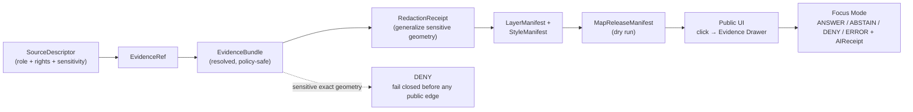

<!-- [KFM_META_BLOCK_V2]
doc_id: kfm://doc/flora-thin-slice-plan
title: Flora Domain — Thin Slice Plan
type: standard
version: v1
status: draft
owners: <flora-domain-steward> # PLACEHOLDER — assign before review
created: 2026-06-03
updated: 2026-06-03
policy_label: public
related: [docs/domains/flora/SOURCE_REGISTRY.md, docs/domains/flora/SOURCE_FAMILIES.md, docs/domains/flora/SOURCES.md, docs/domains/flora/SOURCE_INTAKE.md, docs/domains/flora/SOURCE_ROLES.md, docs/runbooks/flora/SOURCE_REFRESH_RUNBOOK.md, ai-build-operating-contract.md, directory-rules.md]
tags: [kfm]
notes: [CONTRACT_VERSION = "3.0.0"; Flora thin slice is a SENSITIVE-LANE staged build (roadmap Phase 12, default DENY) — it proves the trust path on a public-safe generalized derivative, never raw rare-plant occurrences; exit criteria mirror the hydrology proof slice (roadmap Phase 5 / Build Manual Phase 3); all repo paths PROPOSED until verified]
[/KFM_META_BLOCK_V2] -->

# 🌿 Flora Domain — Thin Slice Plan

> The smallest public-safe Flora slice that proves the full KFM trust path end to end — `SourceDescriptor → EvidenceRef → EvidenceBundle → LayerManifest → MapReleaseManifest → public UI` — while exercising the **deny-by-default** and **redaction** path that the Flora lane requires. A thin slice is a proof, not a product: it demonstrates the spine works before the lane broadens.

<!-- TODO: replace with real Shields.io endpoints (CI, last-updated) once wired -->

| Field | Value |
|---|---|
| **Status** | `draft` |
| **Owners** | `<flora-domain-steward>` · `<pipeline-owner>` · `<policy-reviewer>` *(PLACEHOLDER — assign before review)* |
| **Updated** | 2026-06-03 |
| **Lane** | Flora `[DOM-FLORA]` — **sensitive lane**, default DENY |
| **Build position** | Roadmap Phase 12 (sensitive-lane staged builds); depends on the Phase 5 hydrology proof slice spine |
| **Authority** | `ai-build-operating-contract.md` v3.0 · `directory-rules.md` |

---

## Contents

- [1. What a thin slice is](#1-what-a-thin-slice-is)
- [2. Why Flora is a special case](#2-why-flora-is-a-special-case)
- [3. Slice scope](#3-slice-scope)
- [4. The trust path this slice proves](#4-the-trust-path-this-slice-proves)
- [5. Deliverables](#5-deliverables)
- [6. Build sequence](#6-build-sequence)
- [7. Acceptance tests](#7-acceptance-tests)
- [8. No-network posture](#8-no-network-posture)
- [9. Rollback & failure posture](#9-rollback--failure-posture)
- [10. Out of scope for the slice](#10-out-of-scope-for-the-slice)
- [Open questions register](#open-questions-register)
- [Open verification backlog](#open-verification-backlog)
- [Changelog](#changelog-v0--v1)
- [Definition of done](#definition-of-done)
- [Related docs](#related-docs)

---

## 1. What a thin slice is

CONFIRMED doctrine / PROPOSED lane application. The KFM build sequence is **proof-first**: prove the trust spine with the smallest public-safe slice, then expand by lane. A thin slice takes one bounded, public-safe subject all the way through the trust path so the project can *test* that evidence, policy, release, and rollback are actually present — rather than assert it.

The canonical exemplar is the hydrology proof slice (roadmap Phase 5 / Build Manual Phase 3): a HUC12 fixture with `EvidenceBundle` closure, a layer manifest, a drawer payload, a release dry run, and a rollback card, where `click → governed resolution → drawer payload` is testable with **no live connectors**.

> [!IMPORTANT]
> A thin slice is judged by **whether its trust membrane can be exercised**, not by how much data it shows. Success is "click a feature → resolve an `EvidenceBundle` → open the Evidence Drawer → get a finite Focus outcome → see a receipt," plus the negative cases (stale, missing, sensitive) abstaining or denying correctly.

[↑ Back to top](#contents)

---

## 2. Why Flora is a special case

Flora is **not** a clean first slice like hydrology. It is a **sensitive lane** (roadmap Phase 12, default DENY), and geoprivacy controls for habitat/fauna/flora are a named dependency in the build dependency graph. `[DOM-FLORA]`

> [!CAUTION]
> **The Flora thin slice must prove the deny-and-redact path, not bypass it.** Exact rare/protected/culturally sensitive plant locations default to tier **T4 (Denied)**; the slice publishes only a **generalized, geoprivacy-transformed derivative** with a `RedactionReceipt`. A slice that publishes raw occurrences — even as a "demo" — is not a valid Flora thin slice. `[DOM-FLORA]`

This makes the Flora slice *more* valuable as a proof, because it exercises the sensitive-geometry deny fixture and the redaction transform that the easier lanes do not. The slice therefore picks a **non-sensitive or fully generalized** subject (see §3).

[↑ Back to top](#contents)

---

## 3. Slice scope

PROPOSED slice subject — pick the narrowest public-safe option:

| Option | Subject | Why it's public-safe | Source role |
|---|---|---|---|
| **A (preferred)** | One county's **vegetation-community or land-cover-derived flora context** layer | No exact occurrences; generalized polygons | `modeled` / `aggregate` |
| **B** | One county's **PLANTS county checklist** (presence at county scale only) | County-grain only; no per-point geometry | `aggregate` |
| **C** | A **generalized common-species occurrence grid** (non-sensitive taxa, hex-binned) | Grid-generalized; common taxa only | `observed` → generalized |

> [!NOTE]
> Whichever option is chosen, the slice **must** include at least one **sensitive-taxon deny fixture** so the redaction/deny path is proven, not just the happy path. The deny fixture is the point of doing Flora as a slice at all.

Bounded frame: one county (e.g., an Ellsworth-area county Focus frame), one time scope, fixtures only.

[↑ Back to top](#contents)

---

## 4. The trust path this slice proves

Every consequential claim resolves an `EvidenceRef` to an `EvidenceBundle` before display, or the surface abstains. No public client reaches `RAW`, `WORK`, `QUARANTINE`, or candidate stores. `[ENCY] [GAI] [DIRRULES]`

[↑ Back to top](#contents)

---

## 5. Deliverables

The slice produces this artifact set (PROPOSED homes; mirrors the Build Manual first-domain-proof-slice deliverables, plus Flora sensitivity artifacts):

| Deliverable | Purpose | PROPOSED home |
|---|---|---|
| Flora slice README + architecture note | Orient the slice | `docs/domains/flora/` |
| `SourceDescriptor` | Source identity, role, rights, sensitivity | `data/registry/sources/flora/` |
| Processed fixture | Generalized, public-safe flora derivative | `fixtures/domains/flora/` |
| `EvidenceBundle` + `EvidenceRef` | Resolve the claim before display | `fixtures/domains/flora/` |
| `RedactionReceipt` | Record the geometry generalization | `fixtures/domains/flora/` |
| `LayerManifest` + `StyleManifest` | What the layer may show / cite / hide | `fixtures/domains/flora/` |
| `TileArtifactManifest` or GeoJSON fixture | The carrier artifact | `fixtures/domains/flora/` |
| `MapReleaseManifest` (dry run) | Bind layers, evidence, rollback target | `fixtures/domains/flora/` |
| `RollbackCard` | Restore prior public state | `fixtures/domains/flora/` |
| **Sensitive-taxon deny fixture** | Prove exact geometry fails closed | `fixtures/domains/flora/` |
| **Stale-source fixture** | Prove STALE badge / ABSTAIN | `fixtures/domains/flora/` |
| `AIReceipt` + `CitationValidationReport` | Focus Mode accountability | `fixtures/domains/flora/` |

[↑ Back to top](#contents)

---

## 6. Build sequence

CONFIRMED doctrine: build the governance spine before public features. The Flora slice assumes the cross-cutting spine (schemas, validators, governed API, map shell) from earlier roadmap phases already exists; it adds the Flora-specific lane.

| Step | Deliver | Done when |
|---|---|---|
| 1 | Slice README + `SourceDescriptor` for the chosen subject (§3) | role, rights, sensitivity set at admission (Gate A) |
| 2 | Processed public-safe fixture + `RedactionReceipt` | generalization recorded; no exact rare-plant geometry present |
| 3 | `EvidenceBundle` + `EvidenceRef` closure | every slice claim resolves a bundle or abstains |
| 4 | `LayerManifest` + `StyleManifest` + carrier fixture | layer declares what it may show/cite/hide |
| 5 | `MapReleaseManifest` dry run + `RollbackCard` | release candidate can publish dry-run and roll back dry-run |
| 6 | Map shell wiring: click → Evidence Drawer | drawer validates evidence; negative-state badges render |
| 7 | Focus Mode over released slice evidence | `ANSWER` requires citations; stale/missing/sensitive abstain or deny; `AIReceipt` emitted |
| 8 | Deny + stale fixtures | sensitive exact geometry denied; stale source abstains |

> [!WARNING]
> Do not skip step 2's `RedactionReceipt` or step 8's deny fixture. For a sensitive lane, those are the steps that make the slice a *Flora* proof rather than a generic one. Style-only hiding of sensitive geometry **fails** the sensitivity test. `[DOM-FLORA]`

[↑ Back to top](#contents)

---

## 7. Acceptance tests

The slice is judged by whether the trust membrane can be exercised:

| Test | Expected result |
|---|---|
| **Evidence closure** | Every clicked slice feature resolves to `EvidenceBundle` or returns visible `ABSTAIN` / `ERROR`. |
| **No public raw path** | Browser cannot reach `RAW` / `WORK` / `QUARANTINE` / candidate stores or direct model runtime. |
| **Sensitive geometry** | Exact sensitive flora geometry is generalized/redacted **before** public release; style-only hiding fails. |
| **Policy deny** | Rights unknown, sensitive exact geometry, or missing source role produces `DENY` / `HOLD`. |
| **Citation validation** | Focus answers cite support or abstain. |
| **Release closure** | The slice layer artifact has hashes, manifest IDs, source refs, prior release, and rollback target. |
| **Rollback** | The slice release can be withdrawn/restored without deleting correction history. |
| **Stale source** | Stale source state appears in the layer badge, drawer, and Focus response. |
| **AI boundary** | Focus Mode receives only released slice context and returns finite outcomes with an `AIReceipt`. |
| **Role integrity** | An `aggregate` checklist is not citable as a per-place occurrence (`ROLE_COLLAPSE` denied). |

[↑ Back to top](#contents)

---

## 8. No-network posture

CONFIRMED doctrine: the slice runs against **no-network fixtures**. No live connectors are required to demonstrate the trust path. Live source activation is a later, separate, one-source-at-a-time maturity step (roadmap Phase 17) governed by the refresh runbook.

- All inputs are fixtures under `fixtures/domains/flora/` *(PROPOSED)*.
- Connectors and watchers, if exercised, run in dry-run / fixture mode and emit only to `data/raw/` or `data/quarantine/` — never publish (watcher-as-non-publisher).
- The no-network dry run is described in [`SOURCE_REFRESH_RUNBOOK.md`](../../runbooks/flora/SOURCE_REFRESH_RUNBOOK.md) §4.

[↑ Back to top](#contents)

---

## 9. Rollback & failure posture

CONFIRMED doctrine. Default failure posture for the Flora lane is **DENY**; the slice must be reversible at every public edge.

| Failure | Posture |
|---|---|
| Sensitive layer leak detected | Disable the sensitive layer; default DENY. |
| Release candidate invalid | HOLD at CATALOG; no public surface change. |
| Bad release published (dry run) | `RollbackCard` repoints to prior release; `CorrectionNotice` preserved. |
| Source role collapse | Refuse; restore role; correction = new descriptor + `CorrectionNotice`. |
| Rights unresolved | Quarantine; no activation. |

[↑ Back to top](#contents)

---

## 10. Out of scope for the slice

- **Broad live ingestion** → roadmap Phase 17 (one source at a time, with terms/tests/monitoring/rollback).
- **Full lane buildout** (all 12 object families) → expansion plan, after the slice proves the spine.
- **Cross-lane joins** (PLANTS × KDWP, GBIF × NatureServe) → governed separately (ADR-S-14 cross-lane join policy); the slice does not perform sensitive joins.
- **3D / synthetic flora scenes** → Planetary/3D lane (roadmap Phase 16).
- **Policy rule logic** → `policy/domains/flora/`, `policy/sensitivity/flora/` *(PROPOSED)*.

[↑ Back to top](#contents)

---

## Open questions register

| ID | Question | Owner role | Resolution path |
|---|---|---|---|
| OQ-FLORA-SLICE-01 | Which slice subject (A/B/C in §3) is chosen for the first proof? | flora steward | Steward decision + county selection. |
| OQ-FLORA-SLICE-02 | Which county frames the slice (Ellsworth-area)? | flora steward | County Focus Mode build plan. |
| OQ-FLORA-SLICE-03 | What is the generalization radius / grid cell for the deny-and-redact fixture? | policy reviewer | `policy/domains/flora/geoprivacy.yaml` (PROPOSED) + sensitivity rubric. |
| OQ-FLORA-SLICE-04 | Does the cross-cutting spine (governed API, map shell, Focus Mode) already exist to build on? | pipeline owner | Repo inspection; roadmap phase status. |

## Open verification backlog

These items remain `NEEDS VERIFICATION` before promotion from `draft` to `published`:

1. Status of the cross-cutting spine the slice depends on (governed API, map shell, validators).
2. Existence of `fixtures/domains/flora/` and the chosen slice subject's data.
3. Geoprivacy generalization parameters for the redaction fixture.
4. County frame and time scope.
5. Reviewer / steward / pipeline owners (currently PLACEHOLDER).

## Changelog v0 → v1

| Change | Type (per contract §37) | Reason |
|---|---|---|
| Initial Flora `THIN_SLICE_PLAN.md` created | new | No prior file; built from the proof-first roadmap (Phase 5 hydrology exemplar, Phase 12 sensitive-lane staging), Build Manual deliverables, and `[DOM-FLORA]` deny-default posture. |

> **Backward compatibility.** New file; no anchors to preserve.

## Definition of done

This document is done enough to enter the repository when:

- it is placed under `docs/domains/flora/` per Directory Rules §12;
- a docs steward, the flora steward, a pipeline owner, and a policy reviewer review it;
- it is linked from the Flora lane index and the roadmap;
- it does not conflict with accepted ADRs (notably ADR-S-14 cross-lane joins, ADR-S-05 sensitivity tiers);
- any conflict with current repo conventions is logged in `docs/registers/DRIFT_REGISTER.md`;
- the `GENERATED_RECEIPT.json` planned in Section 2 is wired into CI;
- the slice subject, county frame, and generalization parameters are chosen and placeholder owners resolved.

---

### Related docs

- [`docs/domains/flora/SOURCE_REGISTRY.md`](./SOURCE_REGISTRY.md) — doctrinal source registry
- [`docs/domains/flora/SOURCE_FAMILIES.md`](./SOURCE_FAMILIES.md) — upstream family profiles
- [`docs/domains/flora/SOURCES.md`](./SOURCES.md) — per-source admission register
- [`docs/domains/flora/SOURCE_INTAKE.md`](./SOURCE_INTAKE.md) — intake mechanics
- [`docs/domains/flora/SOURCE_ROLES.md`](./SOURCE_ROLES.md) — source-role discipline
- [`docs/runbooks/flora/SOURCE_REFRESH_RUNBOOK.md`](../../runbooks/flora/SOURCE_REFRESH_RUNBOOK.md) — refresh runbook
- `ai-build-operating-contract.md` — operating contract (`CONTRACT_VERSION = "3.0.0"`)
- `directory-rules.md` — placement law

**Last updated:** 2026-06-03 · **Contract:** `CONTRACT_VERSION = "3.0.0"`

[↑ Back to top](#contents)
