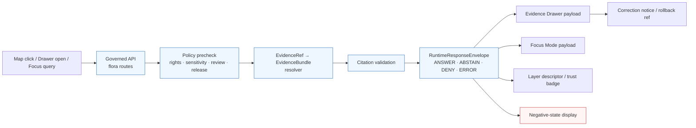

<!-- [KFM_META_BLOCK_V2]
doc_id: kfm://doc/domains/flora/ui_and_evidence_drawer
title: Flora — UI & Evidence Drawer Contract Notes
type: standard
version: v1
status: draft
owners: flora steward (TBD), UI/governed-AI steward (TBD)
created: 2026-05-08
updated: 2026-05-08
policy_label: public
related:
  - docs/domains/flora/README.md
  - docs/domains/flora/ARCHITECTURE.md
  - docs/domains/flora/PUBLICATION_AND_POLICY.md
  - docs/domains/flora/DATA_MODEL.md
  - docs/adr/ADR-flora-schema-home.md
  - docs/adr/ADR-flora-public-layer-strategy.md
  - docs/adr/ADR-flora-sensitive-location-policy.md
tags: [kfm, flora, ui, evidence-drawer, focus-mode, governed-api, runtime-contract]
notes:
  - "Repository was not mounted when this draft was written; all repo-shaped paths are PROPOSED."
  - "Schema home (contracts/flora vs schemas/contracts/v1/flora) is NEEDS VERIFICATION pending ADR-flora-schema-home."
[/KFM_META_BLOCK_V2] -->

# Flora — UI & Evidence Drawer Contract Notes

> Runtime / UI payload guide for the flora lane: what the **MapLibre public layer**, **Evidence Drawer**, and **Focus Mode** must show, must never expose, and must be wired to.

[]()
[]()
[]()
[]()
[]()
[]()

**Owners:** flora steward (TBD) · UI / governed-AI steward (TBD)
**Status:** PROPOSED — pending ADRs, mounted-repo verification, and schema-home decision.
**Stage:** doctrinal contract notes; no UI components are claimed to exist in this document.

> [!IMPORTANT]
> This file is **contract notes**, not implementation. It defines what the UI must receive from governed APIs, what fields the Evidence Drawer payload must carry, and which negative outcomes are first-class. Implementation files (components, adapters, runtime code) live under `apps/` / `packages/` / `ui/` and are **out of scope** for this document.

**Quick jumps:**
[Scope](#1-scope) ·
[Repo fit](#2-repo-fit) ·
[Inputs & exclusions](#3-accepted-inputs--exclusions) ·
[Trust contract](#4-ui-trust-contract) ·
[Request flow](#5-request-flow) ·
[Governed API surfaces](#6-governed-api-surfaces) ·
[UI behavior matrix](#7-ui-behavior-matrix) ·
[Evidence Drawer payload](#8-evidence-drawer-payload-contract) ·
[Focus Mode payload](#9-focus-mode-payload-contract) ·
[MapLibre layer descriptor](#10-maplibre-public-layer-contract) ·
[Negative outcomes](#11-negative-outcomes-as-first-class-states) ·
[Reason codes](#12-deny--abstain-reason-codes-flora-specific) ·
[Validation gates](#13-payload-validation-gates) ·
[Fixtures](#14-fixture-and-test-matrix) ·
[Open questions](#15-open-questions--verification-backlog) ·
[Changelog](#16-changelog-expectations)

---

## 1. Scope

This document specifies the **runtime contract** between the flora domain lane and the public UI surfaces — MapLibre public layer, Evidence Drawer, Focus Mode — together with the related governed API routes that feed them. It is the human-readable counterpart to:

- `contracts/flora/flora_layer_descriptor.schema.json` *(PROPOSED)*
- `contracts/flora/flora_evidence_bundle.schema.json` *(PROPOSED)*
- `contracts/flora/flora_decision_envelope.schema.json` *(PROPOSED)*
- `contracts/flora/flora_focus_payload.schema.json` *(PROPOSED, public-risk = HIGH)*
- `apps/governed_api/openapi/flora.v1.yaml` *(PROPOSED, repo-equivalent path)*

**In scope**

- What the MapLibre flora layer must render and must not render.
- What the Evidence Drawer must carry to make a flora claim inspectable.
- What Focus Mode must enforce when answering flora questions.
- How `ANSWER`, `ABSTAIN`, `DENY`, `ERROR` are surfaced on each UI surface.
- The trust state (rights, sensitivity, freshness, review, correction) attached to each payload.

**Not in scope**

- UI component code, styling, accessibility implementation, or framework choices.
- Schema field-level definitions (those live in `contracts/flora/*.schema.json`).
- Pipeline behavior (see `docs/domains/flora/PIPELINES_AND_LIFECYCLE.md`).
- Source descriptors and rights profiles (see `docs/domains/flora/SOURCE_REGISTRY.md`).
- Sensitivity / public-safe geometry policy details (see `docs/domains/flora/PUBLICATION_AND_POLICY.md`).

---

## 2. Repo fit

> **Path PROPOSED:** `docs/domains/flora/UI_AND_EVIDENCE_DRAWER.md`

**Directory Rules basis.** Per *Directory Rules.pdf* and the *Definitive Greenfield Building Plan*, domain materials live beneath responsibility roots — `docs/domains/<domain>/` for human-facing control-plane docs — not as new root-level domain folders. Flora is an evidence-bearing domain lane, so this document belongs under `docs/domains/flora/` alongside its peers (`README.md`, `ARCHITECTURE.md`, `PUBLICATION_AND_POLICY.md`, etc.). The `docs/` root carries the human-facing control-plane responsibility; `apps/` / `packages/` / `ui/` carry implementation; this file does not cross that boundary.

**Upstream (reads from):**

- `docs/domains/flora/ARCHITECTURE.md` — overall flora lane architecture *(PROPOSED).*
- `docs/domains/flora/DATA_MODEL.md` — object families and identity *(PROPOSED).*
- `docs/domains/flora/PUBLICATION_AND_POLICY.md` — rights & sensitivity rules *(PROPOSED).*
- `docs/adr/ADR-flora-public-layer-strategy.md` — generalization strategy *(PROPOSED, P0).*
- `docs/adr/ADR-flora-sensitive-location-policy.md` — exact vs public-safe split *(PROPOSED, P0).*
- KFM cross-domain UI doctrine: governed API, EvidenceBundle resolver, finite-outcome envelope.

**Downstream (referenced by):**

- `contracts/flora/flora_layer_descriptor.schema.json` *(PROPOSED).*
- `contracts/flora/flora_focus_payload.schema.json` *(PROPOSED).*
- `apps/governed_api/openapi/flora.v1.yaml` *(PROPOSED, repo-equivalent location).*
- UI fixture homes: `ui/evidence_drawer/fixtures/`, `ui/focus/fixtures/`, `ui/map/layers/` *(PROPOSED).*

> [!NOTE]
> The exact schema home — `contracts/flora/` vs `schemas/contracts/v1/flora/` — is **NEEDS VERIFICATION** pending `ADR-flora-schema-home.md`. Both forms appear in lineage; this doc uses `contracts/flora/` as the working placeholder and will be updated once the ADR lands.

---

## 3. Accepted inputs & exclusions

| What this doc accepts | What this doc refuses |
| :--- | :--- |
| Payload field requirements (claim, evidence, trust, freshness, review, correction). | UI component implementation claims (no component lives here). |
| Governed API route → payload mappings for flora. | Direct database, model-runtime, or RAW/WORK/QUARANTINE references. |
| Negative-state display rules (DENY / ABSTAIN / ERROR). | Generic UI styling, framework choices, or design tokens. |
| Validator / fixture expectations tied to runtime contracts. | Source-descriptor field definitions (live in source-registry doc). |
| Public-safe geometry expectations. | Exact sensitive coordinates, restricted IDs, internal refs. |

---

## 4. UI Trust Contract

The flora UI is built on three doctrinal commitments inherited from KFM whole-system doctrine. They are not negotiable per-feature:

1. **The Evidence Drawer payload is a trust object, not decorative text.** A map point or layer is only useful if the drawer can show *why* the claim is allowed, *what* sources support it, and *what* policy state governs it.
2. **Cite-or-abstain is the default truth posture.** Any consequential flora answer either cites a released `EvidenceBundle` or returns `ABSTAIN` / `DENY` / `ERROR`.
3. **AI is interpretive, not the root truth source.** Focus Mode runs *after* scope definition, evidence retrieval, `EvidenceRef → EvidenceBundle` resolution, policy/sensitivity checks, citation validation, and runtime envelope validation — never before.

> [!CAUTION]
> The renderer is **not** the truth source. MapLibre style state, layer visibility, filter expressions, and feature-properties payloads must not be treated as evidence, citation, policy decision, review state, or release state. If those signals are missing from the payload, the UI must surface a negative state — not infer one from rendering.

---

## 5. Request flow

The flora UI does not bypass governance. Every consequential interaction follows the same shape:



> [!NOTE]
> The browser must not call `Ollama`, `OpenAI`, a local model runtime, a vector database, a graph store, or an object store directly. All UI surfaces speak only to the governed API. *(Source: KFM Whole-UI / Governed-AI doctrine.)*

---

## 6. Governed API surfaces

The flora UI is fed by these governed routes. All paths and DTO references are **PROPOSED** until the API framework and OpenAPI home are verified in a mounted repo.

| Route *(PROPOSED)* | Payload / DTO | Boundary rule |
| :--- | :--- | :--- |
| `GET /flora/taxa/{taxon_id}` | `flora_taxon` + evidence / authority / status refs. | No raw taxon source dumps; unresolved taxonomy returns `ABSTAIN` / `ERROR` as appropriate. |
| `GET /flora/occurrences` | Public-safe occurrence summaries with **generalized** geometry and `EvidenceBundle` refs. | Never returns RAW / WORK / QUARANTINE refs or exact sensitive points. |
| `GET /flora/layers` | Layer descriptors with `source_role`, `freshness`, `policy`, `review`, `rights`, evidence route. | Style metadata does not become truth source. |
| `GET /flora/evidence/{bundle_id}` | Resolved `EvidenceBundle`, provenance, catalog refs, review / correction state. | Must enforce policy and access controls. |
| `POST /flora/focus` | Focus request / response with finite outcome, citations, reason codes, obligations, `audit_ref`. | AI runs **after** evidence + policy and **cannot** reveal restricted exact locations. |
| `GET /flora/review/candidates` | Internal / steward review queue for promotion / sensitivity / taxon issues. | Internal-only; ordinary public clients are denied. |
| `GET /flora/release/{release_id}` | Release manifest, catalog matrix status, rollback / correction refs. | No unpublished candidates exposed. |

*(Source: Flora Architecture Blueprint §15.1.)*

---

## 7. UI behavior matrix

| UI surface | Should show | Must not do |
| :--- | :--- | :--- |
| **MapLibre public flora layer** | Generalized / public-safe geometry, trust badge, freshness, source role, review state. | Read RAW / WORK / QUARANTINE; infer truth from renderer state; expose exact sensitive points. |
| **Evidence Drawer** | Claim summary, evidence refs, resolved bundle, source role, rights, sensitivity transform, catalog / provenance, correction state. | Hide negative outcomes; omit policy blocks; render unresolved evidence as an answer. |
| **Focus Mode** | Scope chips, evidence pool, finite-outcome banner, citations, `audit_ref`, denial / obligation codes. | Answer without citations; consume unpublished candidate data as public truth. |
| **Review surface** *(internal)* | Promotion candidates, sensitivity flags, redaction receipts, taxonomy conflicts, reviewer decision. | Let review bypass policy gates or rewrite source evidence. |
| **Layer controls** | Layer visibility with trust-visible state and public-safe geometry indicator. | Treat visibility, style, or filters as proof. |

*(Source: Flora Architecture Blueprint §15.2.)*

[Back to top](#flora--ui--evidence-drawer-contract-notes)

---

## 8. Evidence Drawer payload contract

The Evidence Drawer payload turns a clicked feature into an inspectable claim. The flora-specific shape mirrors the cross-domain `EvidenceDrawerPayload` and adds flora-specific knowledge-character distinctions (specimen vs. observation vs. modeled vs. steward status).

### 8.1 Required payload sections

| Section | Required fields *(PROPOSED, see schema for canonical names)* |
| :--- | :--- |
| **`claim`** | `claim_id`, `label`, bounded statement, spatial scope, temporal scope, **knowledge character** (specimen / observation / modeled / steward-status). |
| **`decision`** | `outcome` (`ANSWER` \| `ABSTAIN` \| `DENY` \| `ERROR`), `reason_codes`, `obligations`, `audit_ref`, `policy_label`. |
| **`evidence`** | `evidence_refs`, resolved `bundle_id`, source IDs, source roles, citations, checksums. |
| **`provenance`** | STAC / DCAT / PROV refs, `run_receipt_ref`, derivation IDs, catalog matrix status. |
| **`rights_and_sensitivity`** | License / terms, public eligibility, redaction receipt ref, `review_required` flag, `generalized_geometry` flag, sensitivity class. |
| **`freshness_review_correction`** | `as_of`, `valid_time`, `retrieved_at`, `review_state`, `correction_notice_ref`, `rollback_ref`. |

*(Source: Flora Architecture Blueprint §15.3 + Whole-UI EvidenceDrawerPayload doctrine.)*

### 8.2 Required behavior of the drawer

- **First-class negative states.** The drawer must visibly render `evidence_missing`, `restricted`, `stale`, `conflict`, `invalid_payload`, and `policy_denied` — not collapse them into a generic spinner or empty card.
- **`DENY` must show a safe reason and obligations.** It must not leak the protected attribute that triggered denial (e.g., the exact sensitive coordinate).
- **`ABSTAIN` must show what evidence is missing** and link to the verification backlog where applicable.
- **`ERROR` must show the `audit_ref`** and avoid making content claims.
- The drawer **does not re-rank evidence** or **create new claims in the browser**. It displays support and limitations only.

### 8.3 Knowledge-character discipline

The flora drawer must keep **observation**, **specimen**, **modeled output**, and **steward / regulatory status** visibly distinct:

- A modeled range surface presented as an observed occurrence is a `DENY` case (`reason_code = model_as_observation` or `knowledge_character_mismatch`).
- A herbarium specimen and a citizen-science occurrence are both evidence, but their `source_role` and `confidence` cards must not be collapsed.

---

## 9. Focus Mode payload contract

Focus Mode is **bounded explanation over released or authorized `EvidenceBundle`s**. It is not a chat surface and it does not invent flora content.

### 9.1 Required outcomes (finite)

| Outcome | Meaning |
| :--- | :--- |
| `ANSWER` | Evidence exists, policy allows, citations validate. |
| `ABSTAIN` | Evidence insufficient or unresolved. |
| `DENY` | Policy or sensitivity blocks the response (e.g., exact rare-plant location). |
| `ERROR` | System failure, malformed request, or service problem. |

### 9.2 What Focus Mode may and must not do

| Focus Mode **may** | Focus Mode **must not** |
| :--- | :--- |
| Summarize admissible **published** flora evidence tied to an `EvidenceBundle`. | Become source truth or override the bundle / policy / review. |
| Explain taxon / status / range / occurrence context with scope and citations. | Reveal restricted exact flora locations or controlled-access source details. |
| `ABSTAIN` when evidence is insufficient and `DENY` where policy blocks response. | Flatten modeled range, habitat suitability, and observed occurrence into one claim. |
| Emit machine-readable runtime envelopes with `ANSWER` / `ABSTAIN` / `DENY` / `ERROR`. | Bypass citation validation or use renderer state as evidence. |

*(Source: Flora Architecture Blueprint §16.)*

### 9.3 Required Focus payload fields *(PROPOSED)*

- `outcome`, `reason_codes`, `obligations`, `audit_ref`
- `scope` (taxon, geography, time-window chips)
- `evidence_pool` (resolved `EvidenceBundle` refs only — never raw or work refs)
- `citations` (validated; uncited `ANSWER` is a `DENY` case: `ai_missing_evidence_bundle_or_citations`)
- `freshness`, `policy_label`, `release_state`
- `denial_or_obligation_codes` (rendered explicitly when `DENY` / `ABSTAIN`)

> [!CAUTION]
> A fluent Focus Mode answer with no citations is a doctrinal failure, **not** a UX issue. The route must `DENY` rather than render.

---

## 10. MapLibre public layer contract

The flora MapLibre layer is a **disciplined renderer**. It loads only artifacts approved by a `LayerManifest` / `ReleaseManifest` and never reaches into canonical or internal stores.

### 10.1 Layer descriptor — required fields *(PROPOSED)*

Drawn from `flora_layer_descriptor.schema.json` *(PROPOSED, P1)* and harmonized with cross-domain layer-descriptor doctrine:

| Field family | Examples |
| :--- | :--- |
| **Identity** | `layer_id`, `title`, `layer_type`, `data_class`. |
| **Source / role** | `source_role`, `geometry_role`, `confidence_display`. |
| **Time** | `valid_time`, `observed_time`, `released_at`, `freshness_status`. |
| **Trust state** | `policy_label`, `review_state`, `rights_status`, `sensitivity_class`. |
| **Evidence handle** | `evidence_lookup_endpoint` (e.g., `GET /flora/evidence/{bundle_id}`). |
| **Render handle** | `tilejson_ref` / PMTiles / GeoJSON URL — must point only at `data/published/flora/...`. |

### 10.2 Public-surface rules

- **Generalized / public-safe geometry only.** Exact sensitive coordinates for rare / protected / culturally sensitive flora must not appear in any tile, GeoJSON, vector index, or feature-click payload.
- **Trust-visible state.** Layer controls must surface a public-safe-geometry indicator, a freshness badge, a review badge, a rights badge, and a correction badge.
- **Layer visibility is not proof.** A toggled-on layer with no resolved `EvidenceBundle` must still abstain on click.
- **No raw / work / quarantine reads.** Public layers load only from `data/published/flora/{layers,tilejson,geojson,manifests}/` *(PROPOSED home).*

### 10.3 Style metadata is not truth

Symbology choices (color, opacity, halo, classification breaks) are presentation only. They must not encode source role, confidence, sensitivity, or review state in a way the user is expected to read **without** the drawer. Trust signals must travel as payload fields, surfaced in badges and the drawer.

[Back to top](#flora--ui--evidence-drawer-contract-notes)

---

## 11. Negative outcomes as first-class states

Every flora UI surface treats `ABSTAIN`, `DENY`, and `ERROR` as renderable, inspectable states — never as errors to be hidden.

| Outcome | Drawer must show | Map / layer must show | Focus must show |
| :--- | :--- | :--- | :--- |
| **`ANSWER`** | Claim, evidence, bundle, source roles, freshness, review, correction. | Public-safe geometry + trust badge. | Cited summary with scope chips and `audit_ref`. |
| **`ABSTAIN`** | What evidence is missing; verification backlog ref where applicable; freshness status. | Layer marker still rendered if the layer is released; click resolves to ABSTAIN drawer. | Reason codes (e.g., `evidence_missing`, `unresolved_taxon`). |
| **`DENY`** | Safe reason, obligations, redaction receipt ref, generalization explanation. **No protected attribute leakage.** | If geometry is unsafe, layer falls back to generalized form or withdraws the feature. | Reason codes (e.g., `precise_sensitive_location_denied`, `controlled_access_publication_denied`). |
| **`ERROR`** | `audit_ref`, no content claim, retry hint where safe. | Stale-state badge or unavailable layer card. | `audit_ref`, no fabricated answer. |

> [!WARNING]
> A spinner, a generic toast, or a silent empty popover that masks `DENY` / `ABSTAIN` is a trust-membrane failure. Negative states are how KFM tells the truth when it cannot answer.

---

## 12. Deny / abstain reason codes (flora-specific)

These reason codes are emitted by the flora policy layer and must be carried verbatim through the runtime envelope to the drawer / focus payload.

| Reason code | Trigger | Outcome |
| :--- | :--- | :--- |
| `missing_rights` | License / terms unresolved for source. | `ABSTAIN` runtime; `DENY` promotion. |
| `unknown_rights` | Live source rights `UNKNOWN`. | `ABSTAIN`; blocks publication. |
| `missing_source_id` / `missing_evidence_bundle` | Required refs absent or unresolvable. | `DENY` consequential publication. |
| `precise_sensitive_location_denied` | Exact public geometry for sensitive rare flora. | `DENY`; require redaction / generalization receipt. |
| `geoprivacy_required` | Public payload would expose protected location. | `DENY`. |
| `public_payload_exposes_internal_ref` | Publication from RAW / WORK / QUARANTINE refs. | `DENY`. |
| `ambiguous_taxon_identity` / `accepted_taxon_required` | Unresolved taxonomy when accepted identity is required. | `DENY` or `QUARANTINE`. |
| `model_as_observation` / `knowledge_character_mismatch` | Modeled outputs presented as observed truth. | `DENY`. |
| `review_required` / `steward_review_missing` | Required review absent. | `DENY`. |
| `ai_missing_evidence_bundle_or_citations` | Uncited Focus / AI answer attempted. | `DENY`. |
| `catalog_matrix_not_closed` / `proof_bundle_incomplete` | Catalog or proof closure failed. | `DENY` promotion. |
| `invalid_geometry` / `public_geometry_not_generalized` | Geometry invalid or insufficiently generalized. | `DENY`. |

*(Source: Flora Architecture Blueprint §11.1, §12.)*

---

## 13. Payload validation gates

The runtime contract is enforced by validators that mirror the schema and policy bundle. Failure posture is **fail-closed**.

| Validator / gate | Required check | Failure posture |
| :--- | :--- | :--- |
| Schema validity | All flora JSON / YAML / GeoJSON payloads validate against current schema and version. | `ERROR` or `DENY` promotion. |
| Required provenance / source refs | `source_refs` and `evidence_refs` exist and resolve to descriptors / bundles. | `DENY` publication; `ABSTAIN` runtime if evidence insufficient. |
| Public-surface sensitivity leakage | No exact coordinates, restricted IDs, internal refs, or protected attributes leak into public payloads. | `DENY`; emit redaction receipt or quarantine. |
| API / runtime envelope validity | Finite outcome, reason codes, obligations, evidence, freshness, review, rights, and policy fields present. | `ERROR` in API tests; `DENY` release. |
| **Evidence Drawer payload validity** | Claim summary, evidence refs, resolved bundle, source roles, sensitivity, freshness, corrections present. | `ERROR` / `ABSTAIN`; do not render hidden trust state. |
| **Focus Mode payload validity** | Answer cites a released `EvidenceBundle`; `DENY` sensitive coordinate disclosure; `ABSTAIN` insufficient evidence. | `ANSWER` / `ABSTAIN` / `DENY` / `ERROR` only. |

*(Source: Flora Architecture Blueprint §11.)*

---

## 14. Fixture and test matrix

Each runtime payload type requires both **positive** and **negative** fixtures. Routes must never read `data/raw/` or `data/work/` paths.

> [!NOTE]
> All fixture paths below are **PROPOSED**. They follow the Flora blueprint's Appendix B layout; final paths track the schema-home ADR.

| Fixture family *(PROPOSED)* | Purpose |
| :--- | :--- |
| `ui/evidence_drawer/fixtures/flora_evidence_drawer_payload.answer.json` | Drawer with full ANSWER trust state. |
| `ui/evidence_drawer/fixtures/flora_evidence_drawer_payload.abstain_missing_evidence.json` | Drawer with unresolved `EvidenceRef`. |
| `ui/evidence_drawer/fixtures/flora_evidence_drawer_payload.deny_sensitive.json` | Drawer with `precise_sensitive_location_denied`. |
| `ui/evidence_drawer/fixtures/flora_evidence_drawer_payload.error_invalid.json` | Malformed payload → `ERROR`. |
| `ui/focus/fixtures/flora_focus_answer.json` | Cited Focus `ANSWER` for a published claim. |
| `ui/focus/fixtures/flora_focus_denied_sensitive.json` | Focus `DENY` for sensitive rare-plant location. |
| `ui/focus/fixtures/flora_focus_abstain_missing_evidence.json` | Focus `ABSTAIN` when bundle cannot resolve. |
| `ui/map/layers/flora_public_layers.json` | Public layer descriptor referencing `data/published/flora/...` only. |
| `ui/review/fixtures/flora_review_record.json` | Internal review fixture (not exposed to public client). |

**Companion test families** *(PROPOSED, under `tests/flora/` and `tests/fixtures/flora/{api,ui,policy}/`)*:

- Contract tests: every fixture validates against its schema; invalid fixtures fail closed.
- Negative-state tests: drawer / focus surfaces render `DENY` / `ABSTAIN` / `ERROR` without leaking protected attributes.
- No-network / no-RAW tests: routes never open `data/raw/` or `data/work/` paths.
- Citation-validation tests: Focus `ANSWER` without resolved citations fails.

---

## 15. Open questions / verification backlog

These items must be resolved before this document hardens beyond `draft`.

- [ ] **Repo mount.** Verify the actual repository structure for `apps/`, `packages/`, `ui/`, `contracts/` vs `schemas/contracts/v1/` — *NEEDS VERIFICATION.*
- [ ] **Schema home ADR.** Land `docs/adr/ADR-flora-schema-home.md` to fix `contracts/flora/` vs `schemas/contracts/v1/flora/` — *PROPOSED, P0.*
- [ ] **API framework.** Confirm the governed-API framework and the canonical OpenAPI home (`apps/governed_api/openapi/flora.v1.yaml` is illustrative) — *NEEDS VERIFICATION.*
- [ ] **Existing UI surfaces.** Search the repo for any existing `EvidenceDrawer`, `FocusPanel`, `LayerDescriptor`, or governed-client implementations before authoring contracts — *NEEDS VERIFICATION.*
- [ ] **Sensitive-location policy ADR.** Land `docs/adr/ADR-flora-sensitive-location-policy.md` to set thresholds for generalization buckets — *PROPOSED, P0.*
- [ ] **Public-layer strategy ADR.** Land `docs/adr/ADR-flora-public-layer-strategy.md` to fix MapLibre layer generalization strategy — *PROPOSED, P0.*
- [ ] **Reason-code registry.** Confirm whether flora reason codes share a cross-domain registry or live under `data/registry/flora/` — *NEEDS VERIFICATION.*
- [ ] **Accessibility baseline.** Confirm WCAG / a11y smoke tooling pinned at the repo level — *NEEDS VERIFICATION.*
- [ ] **Provider-adapter posture.** Confirm Focus Mode model-adapter binding posture (mock-first → live), per Whole-UI PR plan — *NEEDS VERIFICATION.*

> [!IMPORTANT]
> Until the repo is mounted and these items are checked, every path / route / DTO name in this document is **PROPOSED**. Do not treat the proposed tree as a repo fact in downstream docs, ADRs, or PRs.

[Back to top](#flora--ui--evidence-drawer-contract-notes)

---

## 16. Changelog expectations

This document is **living documentation**. Update it whenever any of the following changes:

- A flora governed API route is added, removed, renamed, or has its DTO altered.
- The Evidence Drawer payload shape is revised at the schema level.
- A new finite outcome, reason code, or obligation is introduced for flora.
- The MapLibre layer descriptor schema is changed.
- The sensitive-location, public-layer, or schema-home ADRs land or change.
- A new fixture family is required, or an existing fixture is renamed / moved.

Material changes must also be reflected in `docs/domains/flora/CHANGELOG.md` with a link back to this document and the corresponding schema / contract / policy / fixture diffs.

---

<details>
<summary><strong>Appendix A — Doctrinal anchors (cross-domain references)</strong></summary>

| Topic | Doctrinal anchor *(in attached corpus)* |
| :--- | :--- |
| Lifecycle (RAW → PUBLISHED) | *Definitive Greenfield Building Plan.* |
| Cite-or-abstain default truth posture | *KFM Encyclopedia* (cross-domain UI chapters); *Whole-UI Governed-AI Expansion Report.* |
| Finite outcomes (`ANSWER` / `ABSTAIN` / `DENY` / `ERROR`) | *Whole-UI Governed-AI Expansion Report;* *Flora Blueprint* §15–§16. |
| `EvidenceRef → EvidenceBundle` resolver | *KFM Build Companion* §10. |
| MapLibre as disciplined renderer | *KFM Encyclopedia* §8.A. |
| Evidence Drawer as trust object | *KFM Encyclopedia* §8.B; *Whole-UI Report* §19.1. |
| Focus Mode evidence boundary | *KFM Encyclopedia* §8.C; *Whole-UI Report* §19.2; *Flora Blueprint* §16. |
| Negative-state rendering rules | *Whole-UI Report* §19.1; *Greenfield Plan* (negative states section). |
| Flora sensitivity / public-safe geometry | *Flora Blueprint* §11–§12. |
| Domain placement under `docs/domains/<domain>/` | *Directory Rules.pdf;* *Greenfield Plan* §3 + §6.5. |

</details>

<details>
<summary><strong>Appendix B — Illustrative payload skeletons</strong></summary>

> The skeletons below are **illustrative only** — they show field families and outcome semantics, not the canonical schema. Final field names and types live in `contracts/flora/*.schema.json` once the schema-home ADR lands.

**Evidence Drawer payload — `ANSWER` (illustrative):**

```json
{
  "drawer_id": "kfm://drawer/flora/...",
  "opened_from": { "surface": "map", "layer_id": "flora_public_observations_v1", "feature_ref": "..." },
  "decision": {
    "outcome": "ANSWER",
    "reason_codes": [],
    "obligations": ["show_freshness_badge", "show_generalized_geometry_indicator"],
    "audit_ref": "kfm://audit/..."
  },
  "claim": {
    "claim_id": "kfm://claim/flora/...",
    "label": "Generalized public observation of <accepted_taxon> in <county/grid>.",
    "spatial_scope": { "geometry_role": "generalized", "precision_bucket": "county" },
    "temporal_scope": { "valid_time": "...", "observed_time": "..." },
    "knowledge_character": "observation"
  },
  "evidence": {
    "bundle_ref": "kfm://evidence/bundle/...",
    "evidence_refs": [{ "evidence_ref": "kfm://evidence/ref/...", "source_role": "observation" }],
    "citations": [ /* validated citation handles */ ]
  },
  "trust": {
    "rights_status": "open",
    "sensitivity_class": "public_generalized",
    "review_state": "approved",
    "freshness": { "status": "fresh", "checked_at": "..." }
  },
  "provenance": {
    "release_manifest_ref": "kfm://release/flora/...",
    "stac_item_ref": "...",
    "prov_activity_ref": "...",
    "correction_state": "none"
  }
}
```

**Evidence Drawer payload — `DENY` (illustrative):**

```json
{
  "drawer_id": "kfm://drawer/flora/...",
  "decision": {
    "outcome": "DENY",
    "reason_codes": ["precise_sensitive_location_denied", "geoprivacy_required"],
    "obligations": ["show_safe_reason", "do_not_disclose_protected_attribute"],
    "audit_ref": "kfm://audit/..."
  },
  "claim": {
    "label": "Exact location of a sensitive flora occurrence is not publishable.",
    "knowledge_character": "observation"
  },
  "evidence": { "bundle_ref": null, "evidence_refs": [], "citations": [] },
  "trust": {
    "rights_status": "open",
    "sensitivity_class": "restricted_precise",
    "review_state": "approved",
    "freshness": { "status": "fresh", "checked_at": "..." }
  }
}
```

**Focus Mode response — `ABSTAIN` (illustrative):**

```json
{
  "outcome": "ABSTAIN",
  "reason_codes": ["evidence_missing", "unresolved_taxon"],
  "obligations": ["link_verification_backlog"],
  "audit_ref": "kfm://audit/...",
  "scope": { "taxon": "...", "geography": "...", "time_window": "..." },
  "evidence_pool": [],
  "citations": [],
  "freshness": { "status": "unknown" }
}
```

</details>

<sub>This document is doctrinal contract notes; it does not assert that any matching code, schema, route, fixture, or workflow currently exists in the repository. All implementation claims await mounted-repo verification.</sub>
