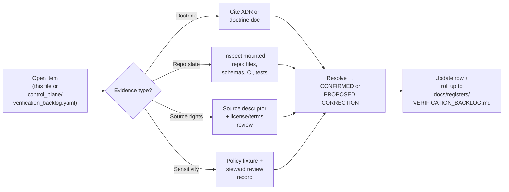
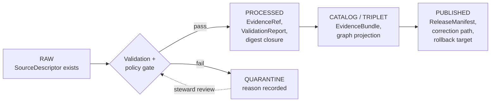
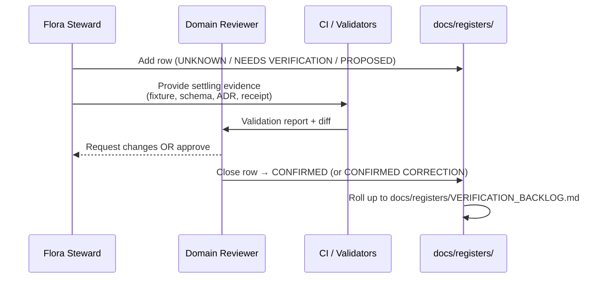

<!-- [KFM_META_BLOCK_V2]
doc_id: kfm://doc/domains/flora/verification-backlog
title: Flora — Verification Backlog
type: standard
version: v1.1
status: draft
owners: <flora-domain-stewards@TODO>, <governance-stewards@TODO>
created: 2026-05-16
updated: 2026-06-03
policy_label: public
related:
  - docs/domains/flora/README.md
  - docs/domains/flora/SOURCE_REGISTRY.md
  - docs/domains/flora/SOURCE_FAMILIES.md
  - docs/domains/flora/SOURCES.md
  - docs/domains/flora/SOURCE_INTAKE.md
  - docs/domains/flora/SOURCE_ROLES.md
  - docs/domains/flora/THIN_SLICE_PLAN.md
  - docs/runbooks/flora/SOURCE_REFRESH_RUNBOOK.md
  - docs/registers/VERIFICATION_BACKLOG.md
  - docs/registers/DRIFT_REGISTER.md
  - docs/adr/ADR-0001-schema-home.md
  - control_plane/verification_backlog.yaml
  - schemas/contracts/v1/domains/flora/
  - policy/sensitivity/flora/
tags: [kfm, domain, flora, verification, governance, register]
notes:
  - CONTRACT_VERSION = "3.0.0".
  - Domain-scoped backlog; rolls up into docs/registers/VERIFICATION_BACKLOG.md.
  - All implementation-layer claims are PROPOSED or NEEDS VERIFICATION until repo is mounted.
  - v1.1 reconciles ADR references to the canonical ADR-S-* backlog (source-role vocabulary is ADR-S-04, sensitivity tiers ADR-S-05) instead of inventing parallel flora-specific ADRs, and wires in the session-authored flora source suite.
[/KFM_META_BLOCK_V2] -->

# Flora — Verification Backlog

> Domain-scoped verification queue for the **Flora** lane: items whose **status as fact** in this repository cannot yet be settled from current doctrine alone, and the evidence that would settle them.

[](#)
[](./README.md)
[](#)
[](#)
[](../../adr/ADR-0001-schema-home.md)
[](#)
[](#)
[](#)

**Status:** draft · **Owners:** `<flora-domain-stewards@TODO>` · **Last reviewed:** 2026-06-03

---

## Contents

- [1. Purpose and posture](#1-purpose-and-posture)
- [2. How this backlog is used](#2-how-this-backlog-is-used)
- [3. Status legend](#3-status-legend)
- [4. Seed items from the Domains Atlas (§N)](#4-seed-items-from-the-domains-atlas-n)
- [5. Source rights, roles, and cadence](#5-source-rights-roles-and-cadence)
- [6. Taxonomy and identity resolution](#6-taxonomy-and-identity-resolution)
- [7. Sensitivity, rare-plant, and geoprivacy thresholds](#7-sensitivity-rare-plant-and-geoprivacy-thresholds)
- [8. Ethnobotanical and cultural review](#8-ethnobotanical-and-cultural-review)
- [9. Schema, contract, and policy homes](#9-schema-contract-and-policy-homes)
- [10. Pipeline and lifecycle gates (RAW → PUBLISHED)](#10-pipeline-and-lifecycle-gates-raw--published)
- [11. Public-safe map products and layer manifest](#11-public-safe-map-products-and-layer-manifest)
- [12. Governed AI behavior (Focus Mode, Evidence Drawer)](#12-governed-ai-behavior-focus-mode-evidence-drawer)
- [13. Validators, fixtures, and test enforcement](#13-validators-fixtures-and-test-enforcement)
- [14. Release, correction, and rollback drills](#14-release-correction-and-rollback-drills)
- [15. Open ADRs and design questions](#15-open-adrs-and-design-questions)
- [16. Verification workflow](#16-verification-workflow)
- [17. Related docs](#17-related-docs)
- [18. Promotion checklist](#18-promotion-checklist)
- [19. Changelog](#19-changelog)
- [Appendix A — Per-source verification checklist (collapsible)](#appendix-a--per-source-verification-checklist)
- [Appendix B — Backlog YAML projection (collapsible)](#appendix-b--backlog-yaml-projection)

---

## 1. Purpose and posture

This file is the **flora-domain verification queue**: a working list of items whose status as fact **in this repository** has not yet been settled, plus the evidence that would settle each one. It is the domain-scoped counterpart to the global register at `docs/registers/VERIFICATION_BACKLOG.md` (PROPOSED).

**Doctrinal grounding** (CONFIRMED):

- KFM Flora **owns plant taxa, specimens, occurrences, rare plants, vegetation communities, invasive plants, phenology, range, and habitat associations**; it does **not** own habitat patches, animal occurrences, soil/hydrology/agriculture truth, or land/parcel records. *(KFM Encyclopedia §7.6; Domains Atlas v1.1 §8.B)*
- Rare, protected, culturally sensitive, and steward-reviewed flora **default to generalized, withheld, staged, or denied public geometry**. *(Domains Atlas v1.1 §8.I)*
- Promotion through `RAW → WORK/QUARANTINE → PROCESSED → CATALOG/TRIPLET → PUBLISHED` is a **governed state transition**, not a file move. *(Directory Rules; Domains Atlas v1.1 §8.H)*
- **AI is never the root truth source**: it may summarize released EvidenceBundles, must ABSTAIN when evidence is insufficient, and must DENY where policy, rights, sensitivity, or release state blocks a request. *(Domains Atlas v1.1 §8.L; KFM Governed AI doctrine)*
- **Watcher-as-non-publisher**: workers may emit receipts and candidates only — they may not mutate canonical stores or bypass review. *(Directory Rules §13.5)*

> [!IMPORTANT]
> Every implementation-layer row in this file is **PROPOSED** or **NEEDS VERIFICATION** until a mounted repo, schemas, registry entries, tests, workflows, logs, or release manifests confirm otherwise. Doctrine is stated confidently; implementation maturity is not.

This backlog sits alongside the rest of the Flora source-and-proof surface authored in lineage with it: [`SOURCE_FAMILIES.md`](./SOURCE_FAMILIES.md) (upstream profiles), [`SOURCE_ROLES.md`](./SOURCE_ROLES.md) (role discipline), [`SOURCES.md`](./SOURCES.md) (admission register), [`SOURCE_INTAKE.md`](./SOURCE_INTAKE.md) (intake mechanics), [`SOURCE_REGISTRY.md`](./SOURCE_REGISTRY.md) (doctrinal registry), [`THIN_SLICE_PLAN.md`](./THIN_SLICE_PLAN.md) (the first proof slice), and the [`SOURCE_REFRESH_RUNBOOK.md`](../../runbooks/flora/SOURCE_REFRESH_RUNBOOK.md). Many rows below resolve by producing artifacts those documents specify.

[↑ Back to top](#contents)

---

## 2. How this backlog is used



**Operating rules.**

1. New items are added with the narrowest status that fits (UNKNOWN, NEEDS VERIFICATION, or PROPOSED).
2. An item is **closed** only when its **Evidence that would settle it** column has been produced (or a CONFIRMED CORRECTION ADR is filed); the closing PR cites the settling artifact.
3. Items that survive triage without resolution within their **review-burden cadence** roll up into `docs/registers/DRIFT_REGISTER.md` per Directory Rules §17.
4. Domain stewards own item routing; release managers own publication-blocking items; the docs steward owns roll-up to `docs/registers/VERIFICATION_BACKLOG.md`.

[↑ Back to top](#contents)

---

## 3. Status legend

| Label | Meaning | Where it can appear |
|---|---|---|
| **CONFIRMED** | Verified in this session from attached doctrine docs or mounted repo evidence. | Doctrine rows only, unless repo is mounted. |
| **PROPOSED** | Design, path, vocabulary, or recommendation not yet verified in implementation. | Default for any path, route, schema, policy, or test claim while repo is unmounted. |
| **NEEDS VERIFICATION** | Checkable, but not yet checked strongly enough to act as fact. | Default for source rights, steward roles, and live-source behavior. |
| **UNKNOWN** | Cannot be resolved without more evidence than this session offers. | Use sparingly; prefer NEEDS VERIFICATION when an inspection would settle it. |
| **EXTERNAL** | Sourced from authoritative external research; never applied to KFM repo-state or doctrine claims. | Standards references only. |

> [!NOTE]
> The encyclopedia uses the phrase *"mounted repo files, schemas, registry entries, tests, logs, emitted artifacts, review records, or release manifests"* as the canonical settling evidence for domain-N items. That phrase appears verbatim across multiple "Evidence that would settle it" rows below for consistency with the parent atlas.

[↑ Back to top](#contents)

---

## 4. Seed items from the Domains Atlas (§N)

These are the **four originating items** lifted from `Domains Atlas v1.1 §8.N` for Flora. They are the doctrinal seed; the rest of this file expands them into the verifiable sub-items implied by KFM Encyclopedia §7.6 and Directory Rules.

> [!NOTE]
> **CONFIRMED:** the Atlas Flora chapter §N lists exactly these four lines — *"Verify source endpoints and rights" · "Verify rare-plant steward policy" · "Verify exact/public geometry thresholds" · "Verify Focus Mode and Evidence Drawer behavior"* — each with the canonical settling-evidence phrase and status NEEDS VERIFICATION. The IDs below are KFM-local; the wording is faithful to the Atlas.

| # | Item to verify | Evidence that would settle it | Status |
|---|---|---|---|
| FLO-VB-001 | Verify Flora source endpoints and rights. | Mounted repo files, schemas, registry entries, tests, logs, emitted artifacts, review records, or release manifests. | NEEDS VERIFICATION |
| FLO-VB-002 | Verify rare-plant steward policy. | Mounted repo files, schemas, registry entries, tests, logs, emitted artifacts, review records, or release manifests. | NEEDS VERIFICATION |
| FLO-VB-003 | Verify exact/public geometry thresholds. | Mounted repo files, schemas, registry entries, tests, logs, emitted artifacts, review records, or release manifests. | NEEDS VERIFICATION |
| FLO-VB-004 | Verify Focus Mode and Evidence Drawer behavior for Flora. | Mounted repo files, schemas, registry entries, tests, logs, emitted artifacts, review records, or release manifests. | NEEDS VERIFICATION |

*Source:* `Domains Atlas v1.1 §8.N` (CONFIRMED doctrine line; implementation NEEDS VERIFICATION).

[↑ Back to top](#contents)

---

## 5. Source rights, roles, and cadence

Expands **FLO-VB-001**. Per `Domains Atlas v1.1 §8.D`, every flora source family carries a `SourceRole` (authority / observation / context / model), rights/sensitivity posture, and freshness profile that **must be source-vintage or cadence-specific** before any source is admitted past `RAW`. Family profiles and role assignments live in [`SOURCE_FAMILIES.md`](./SOURCE_FAMILIES.md) and [`SOURCE_ROLES.md`](./SOURCE_ROLES.md); admission decisions in [`SOURCES.md`](./SOURCES.md).

| # | Item to verify | Evidence that would settle it | Status |
|---|---|---|---|
| FLO-VB-005 | Confirm `SourceDescriptor` exists for **USDA PLANTS** (vascular plant checklists, county-level distribution; public-domain content per upstream guidance). Verify role, license citation, refresh cadence, and county-package sidecar (`package_url`, `etag`, `last_modified`, `species_count`, `listed_species` ids only, `spec_hash`). | `connectors/usda-plants/source_descriptor.json` (PROPOSED path) + license citation in `control_plane/source_authority_register.yaml` + no-network fixture in `tests/fixtures/flora/`. | PROPOSED |
| FLO-VB-006 | Confirm `SourceDescriptor` for **KDWP flora/listed-species context** with `SourceRole` constraint (authority for state listing; not occurrence aggregator). Verify rights, current terms, and sensitive-join fail-closed posture. | Steward agreement reference + rights review entry + policy fixture in `policy/sensitivity/flora/`. | NEEDS VERIFICATION |
| FLO-VB-007 | Confirm `SourceDescriptor` for **KDWP Ecological Review Tool / stewardship outputs**. Same role/rights verification as FLO-VB-006. | As FLO-VB-006. | NEEDS VERIFICATION |
| FLO-VB-008 | Confirm `SourceDescriptor` for **Kansas Biological Survey / KU R. L. McGregor Herbarium** surfaces (IPT / Darwin Core). Verify license, citation, and observation/specimen `SourceRole` separation. | IPT endpoint reference + DwC-A pull receipt + license declaration in source descriptor. | NEEDS VERIFICATION |
| FLO-VB-009 | Confirm `SourceDescriptor` for **Kansas State University Herbarium (KSC)** under stated CC-BY 4.0 attribution; verify attribution propagates to `EvidenceBundle` projections. | Attribution test in `tests/fixtures/flora/` + citation in `control_plane/source_authority_register.yaml`. | NEEDS VERIFICATION |
| FLO-VB-010 | Confirm `SourceDescriptor` for **USFWS ECOS plant context** (listed-species, critical habitat where applicable). | ECOS endpoint + listed-species fixture. | NEEDS VERIFICATION |
| FLO-VB-011 | Confirm `SourceDescriptor` for **NatureServe Explorer / Explorer Pro** with S-rank sensitivity mapping (e.g., S1/S2 → restricted public geometry). | NatureServe terms reference + sensitivity table in `policy/sensitivity/flora/ranks.yaml` (PROPOSED). | NEEDS VERIFICATION |
| FLO-VB-012 | Confirm `SourceDescriptor` for **GBIF vascular-plant downloads** with **GBIF Backbone Taxonomy DOI version pinning** in `RunReceipt`. | RunReceipt fixture carrying `gbif_backbone_doi: 10.15468/39omei@<version>`. | NEEDS VERIFICATION |
| FLO-VB-013 | Confirm `SourceDescriptor` for **iDigBio specimen records** and **iNaturalist-derived observations**, including observation-`SourceRole` constraint and de-duplication rule for GBIF-aggregated subsets. | De-duplication test in `tests/fixtures/flora/` + receipt fields. | NEEDS VERIFICATION |
| FLO-VB-014 | Verify each source family's **redistribution terms** before any public flora product is published. Block on unknown rights. | Per-source license entry + policy `deny` test for missing license. | NEEDS VERIFICATION |
| FLO-VB-015 | Verify **`SourceRole` anti-collapse**: authority, observation, aggregator, and model roles MUST NOT be conflated in fixtures or release manifests (per [`SOURCE_ROLES.md`](./SOURCE_ROLES.md) and ADR-S-04). | Negative-fixture set in `tests/fixtures/flora/source_role_collapse/` exercising `ROLE_COLLAPSE` / `ROLE_DOWNCAST_FORBIDDEN`. | PROPOSED |

> [!CAUTION]
> Per the broader Idea Index, **PLANTS becomes sensitive when joined with GBIF, iNaturalist, or heritage datasets** — a benign county species list in isolation can become a poaching map in combination. Joins are deny-by-default and require explicit policy clearance (cross-lane join policy is ADR-S-14).

[↑ Back to top](#contents)

---

## 6. Taxonomy and identity resolution

Expands **FLO-VB-001** and supports object-identity for `PlantTaxon` and `FloraTaxon Crosswalk` per `Domains Atlas v1.1 §8.E`.

| # | Item to verify | Evidence that would settle it | Status |
|---|---|---|---|
| FLO-VB-016 | Verify **ITIS TSN** anchor is required for every Kansas species record where ITIS has coverage; **GBIF Backbone** is second-line where ITIS is silent or stale. | `PlantTaxon` schema requires `itis_tsn` OR `gbif_taxon_key` with a `reason` if ITIS is absent. | PROPOSED |
| FLO-VB-017 | Verify **ITIS/GBIF tie-breaker policy** is codified (default: ITIS for federal-data reconciliation; GBIF for international comparability). | ADR `ADR-flora-itis-gbif-tiebreaker.md` (PROPOSED). | NEEDS VERIFICATION |
| FLO-VB-018 | Verify **GBIF Backbone version pinning** in every `RunReceipt` that touches GBIF-derived taxa; backbone version rotation playbook exists. | Receipt schema + `docs/runbooks/flora/BACKBONE_ROTATION.md` (PROPOSED; Pattern A runbook home). | PROPOSED |
| FLO-VB-019 | Verify treatment of **taxonomy drift** (rename) vs **package drift** (real presence/absence) in PLANTS county-package watcher. | Watcher unit tests demonstrating distinct outputs for rename vs add/remove events. | PROPOSED |
| FLO-VB-020 | Verify **Wikidata QID** is stored as routing anchor only, never as truth source, alongside upstream IRIs (ITIS, GBIF). | Crosswalk-provenance fields populated in `FloraTaxon Crosswalk`. | PROPOSED |
| FLO-VB-021 | Verify **World Flora Online** integration posture (intended role and override rules vs ITIS/GBIF). | Doctrine note in `docs/domains/flora/README.md` and source descriptor. | UNKNOWN |

[↑ Back to top](#contents)

---

## 7. Sensitivity, rare-plant, and geoprivacy thresholds

Expands **FLO-VB-002** and **FLO-VB-003**. Doctrine: rare/protected/culturally sensitive flora **fail closed**; public exposure is a governed state. *(Domains Atlas v1.1 §8.I; Encyclopedia §7.6.D)* The transform menu and sensitivity rubric are catalogued in [`SOURCE_REGISTRY.md`](./SOURCE_REGISTRY.md) §7.

| # | Item to verify | Evidence that would settle it | Status |
|---|---|---|---|
| FLO-VB-022 | Verify **`policy/sensitivity/flora/`** is the canonical policy home for the rare-plant lane (per Atlas v1.1 §24.13 row 8). | Directory exists; tests in `policy/tests/flora/`. | PROPOSED |
| FLO-VB-023 | Verify the **sensitivity tier scheme** (T0–T4 per ADR-S-05) is bound to NatureServe S-rank, KDWP listed-status, and steward designation. | Mapping table + policy fixture demonstrating S1/S2 → restricted. | NEEDS VERIFICATION |
| FLO-VB-024 | Verify **geoprivacy transform vocabulary** is defined: `suppress`, `generalize-to-grid` (H3 resolution PROPOSED, threshold TBD), `generalize-to-county`, `generalize-to-watershed`, `buffer`, `jitter-with-constraints` (deterministic, seeded per C6-03), `delayed-publication`, `steward-only-exact`. | Vocabulary in `schemas/contracts/v1/domains/flora/redaction_receipt.schema.json` + named profiles in `policy/redaction/profiles.yaml`. | PROPOSED |
| FLO-VB-025 | Verify **`RedactionReceipt`** records input class, output class, reason, policy id, reviewer, residual risk, and is content-addressed. | Schema + signed fixture. | PROPOSED |
| FLO-VB-026 | Verify **exact rare-plant locations fail closed** in public layer manifest; only generalized derivatives are referenced from public `LayerManifest`. | Negative test demonstrating denial of exact-geometry request without steward role. | NEEDS VERIFICATION |
| FLO-VB-027 | Verify the **specific public geometry threshold** for rare-plant occurrences (e.g., minimum aggregation unit — county? HUC? H3 r5/r6/r7?). The current doctrine is "generalize"; the **numeric threshold is UNKNOWN**. | ADR `ADR-flora-rare-plant-geoprivacy-threshold.md` (localizes the ADR-S-05 tier scheme for flora geometry). | UNKNOWN |
| FLO-VB-028 | Verify **InvasivePlantRecord** geoprivacy posture (typically less restricted than rare; verify whether any taxa are dual-flagged). | Policy fixture covering both invasive and rare classifications. | NEEDS VERIFICATION |
| FLO-VB-029 | Verify **stale-state rule** for rare-plant publications: a rank or listing change must trigger re-validation and possible quarantine (stale-state propagation is ADR-S-10). | Stale-state test + revocation hook. | PROPOSED |

[↑ Back to top](#contents)

---

## 8. Ethnobotanical and cultural review

The Atlas v1.1 §24.13 row for Flora notes **"ethnobotanical context governance"** as an explicit responsibility. Where flora records intersect cultural, Indigenous, or steward-controlled context, CARE-aligned controls apply.

| # | Item to verify | Evidence that would settle it | Status |
|---|---|---|---|
| FLO-VB-030 | Verify **CARE fields** (MetaBlock v2: `steward_org`, `authority_to_control`, `consent`, `obligations`, `benefit_commitments`) are required for any flora asset flagged ethnobotanical or culturally-sensitive. | Schema validation that fails on missing CARE fields when `care_applicable=true`. | PROPOSED |
| FLO-VB-031 | Verify **steward review record** exists as a precondition for promotion when ethnobotanical context is present. | `StewardReviewRecord` schema + promotion-gate policy test. | PROPOSED |
| FLO-VB-032 | Verify **default-deny on CARE-tagged flora assets** in the OPA/policy bundle. | Policy bundle test demonstrating denial without explicit `allow` rule. | PROPOSED |
| FLO-VB-033 | Verify the **scope** of Flora's ethnobotanical lane — exactly which taxa, contexts, or sources trigger CARE controls is not yet enumerated in domain doctrine. | Curatorial decision SOP + initial enumeration in `policy/sensitivity/flora/ethnobotanical.yaml` (PROPOSED). | UNKNOWN |

> [!WARNING]
> Ethnobotanical sensitivity is **not a cosmetic disclaimer**. Where steward review is required, bypassing it would undermine KFM's trust posture and can cause real harm. Verification items here block any public ethnobotanical surface.

[↑ Back to top](#contents)

---

## 9. Schema, contract, and policy homes

Per **ADR-0001** (schema-home rule), the default machine-schema home is `schemas/contracts/v1/...`; semantic Markdown lives under `contracts/`. The flora lane SHOULD follow that split without divergence.

| # | Item to verify | Evidence that would settle it | Status |
|---|---|---|---|
| FLO-VB-034 | Verify **`schemas/contracts/v1/domains/flora/`** is the live machine-schema home (per ADR-0001). | `git ls-tree` of `schemas/contracts/v1/domains/flora/` showing object schemas. | PROPOSED |
| FLO-VB-035 | Verify **`contracts/flora/`** holds semantic Markdown (object meaning), not JSON schemas. | Directory inspection. | PROPOSED |
| FLO-VB-036 | Verify there is **no divergent `contracts/<x>.schema.json`** mirror for flora objects; if a legacy mirror exists, it is frozen/lineage per Directory Rules §13.1. | Drift register entry resolved. | NEEDS VERIFICATION |
| FLO-VB-037 | Verify **`policy/sensitivity/flora/`** and **`policy/domains/flora/`** are the canonical policy homes; `policies/` (if present) is compatibility only. | Per-root README declares class. | PROPOSED |
| FLO-VB-038 | Verify schemas exist for every flora object family: `PlantTaxon`, `FloraTaxon Crosswalk`, `SpecimenRecord`, `Flora Occurrence`, `Rare Plant Record`, `Vegetation Community`, `InvasivePlantRecord`, `Phenology Observation`, `RangePolygon`, `Habitat Association`, `Botanical Survey`, `Restoration Planting`, `Redaction Receipt`. | Per-object schema file + at least one valid + one invalid fixture. | PROPOSED |
| FLO-VB-039 | Verify deterministic identity rule (`source_id + object_role + temporal_scope + normalized_digest`) is implemented in schema-level constraints and tested. | Identity test with collision negatives. | PROPOSED |

[↑ Back to top](#contents)

---

## 10. Pipeline and lifecycle gates (RAW → PUBLISHED)

Per `Domains Atlas v1.1 §8.H` and Directory Rules: flora follows the canonical lifecycle and **promotion is a governed state transition**. Intake mechanics (pre-RAW, Gate A) are detailed in [`SOURCE_INTAKE.md`](./SOURCE_INTAKE.md).



| # | Item to verify | Evidence that would settle it | Status |
|---|---|---|---|
| FLO-VB-040 | Verify `RAW` capture preserves source role, rights, sensitivity, citation, time, and content hash for every flora source. | RAW fixture set covering all source families in §5. | PROPOSED |
| FLO-VB-041 | Verify `WORK/QUARANTINE` gate normalizes schema, geometry, time, identity, evidence, rights, and policy; holds failures with a recorded quarantine reason. | Quarantine fixture + reason taxonomy. | PROPOSED |
| FLO-VB-042 | Verify `PROCESSED` emits validated objects, `RunReceipt`, and public-safe candidates with `EvidenceRef` and `ValidationReport`. | End-to-end no-network fixture pipeline. | PROPOSED |
| FLO-VB-043 | Verify `CATALOG/TRIPLET` produces `EvidenceBundle` and graph/triplet projections; catalog closure tests pass. | Catalog closure test set. | PROPOSED |
| FLO-VB-044 | Verify `PUBLISHED` artifacts are served only via **governed APIs** (`apps/governed-api/`), never via direct reads against canonical stores. | Static check forbidding direct `data/processed/` or `data/catalog/` reads from `apps/explorer-web/`. | PROPOSED |
| FLO-VB-045 | Verify **watcher-as-non-publisher**: any flora watcher emits receipts and `SourceIntakeRecord` candidates only — no writes to `data/processed/`, `data/catalog/`, or `data/published/`. | Static check + integration test asserting watcher write paths. | PROPOSED |

[↑ Back to top](#contents)

---

## 11. Public-safe map products and layer manifest

| # | Item to verify | Evidence that would settle it | Status |
|---|---|---|---|
| FLO-VB-046 | Verify a public `LayerManifest` exists for: generalized occurrence/range, vegetation community, invasive plant, phenology/condition, habitat-association summary, review candidate view. | Layer manifests in `data/manifests/flora/` (PROPOSED). | PROPOSED |
| FLO-VB-047 | Verify the **public-safe rare-plant product** (a public derivative whose every sensitive point has a corresponding `RedactionReceipt`) renders without leakage. This is the [`THIN_SLICE_PLAN.md`](./THIN_SLICE_PLAN.md) deliverable — the flora "first credible thin slice." | One published flora occurrence with full receipt closure + the thin-slice deny fixture. | PROPOSED |
| FLO-VB-048 | Verify PMTiles flora artifacts carry the integrity sidecar (root hash, optional bao outboard proofs) and the layer manifest references the sidecar. | PMTiles sidecar schema check. | PROPOSED |
| FLO-VB-049 | Verify **Evidence Drawer** payload for any flora feature filters by evidence and policy before rendering. | Drawer fixture for a sensitive vs non-sensitive feature. | NEEDS VERIFICATION |

[↑ Back to top](#contents)

---

## 12. Governed AI behavior (Focus Mode, Evidence Drawer)

Expands **FLO-VB-004**. Doctrine: AI may summarize **released** flora `EvidenceBundle`s and compare evidence; AI must **ABSTAIN** when evidence is insufficient and **DENY** where policy, rights, sensitivity, or release state blocks the request.

| # | Item to verify | Evidence that would settle it | Status |
|---|---|---|---|
| FLO-VB-050 | Verify **`RuntimeResponseEnvelope`** returns one of `ANSWER`, `ABSTAIN`, `DENY`, `ERROR` for every flora Focus Mode request. | Schema + finite-outcome fixture set. | PROPOSED |
| FLO-VB-051 | Verify **AI no-leak behavior** for rare/sensitive flora: AI text MUST NOT echo exact coordinates, locality names below the public threshold, or steward-only attributes. | Negative-fixture set ("AI side-channel audit"). | NEEDS VERIFICATION |
| FLO-VB-052 | Verify **`AIReceipt` presence rate = 100%** for flora Focus Mode answers, with `evidence_refs`, `policy_decision`, and `citation_validation` populated. | CI metric + sample receipts. | PROPOSED |
| FLO-VB-053 | Verify **citation validation**: every flora claim in an AI answer resolves to a released `EvidenceBundle` reachable via `EvidenceRef`. | Citation-validation report fixture. | PROPOSED |
| FLO-VB-054 | Verify **DENY reason distribution** for flora is stable; investigate large new-reason spikes. | Telemetry register entry. | PROPOSED |

[↑ Back to top](#contents)

---

## 13. Validators, fixtures, and test enforcement

Per `Domains Atlas v1.1 §8.K`, the flora lane requires the validator/fixture set below.

| # | Item to verify | Evidence that would settle it | Status |
|---|---|---|---|
| FLO-VB-055 | Verify **taxonomy reconciliation tests** (ITIS vs GBIF agreement; tie-breaker policy enforced). | Test set with negative cases. | PROPOSED |
| FLO-VB-056 | Verify **rights/sensitivity validators** block unknown-rights or unresolved-sensitivity records from promotion. | Negative fixture + CI gate. | PROPOSED |
| FLO-VB-057 | Verify **exact sensitive public geometry denial** test exists and passes. | Policy deny test. | PROPOSED |
| FLO-VB-058 | Verify **catalog closure tests** (every public flora claim resolves to an `EvidenceBundle`). | Closure test report. | PROPOSED |
| FLO-VB-059 | Verify **API finite-outcome fixtures** cover ANSWER, ABSTAIN, DENY, ERROR for every flora route. | Fixture set under `tests/fixtures/flora/runtime/`. | PROPOSED |
| FLO-VB-060 | Verify **no-live-network fixture pipeline** runs deterministically with mocked sources (the [`THIN_SLICE_PLAN.md`](./THIN_SLICE_PLAN.md) and [`SOURCE_REFRESH_RUNBOOK.md`](../../runbooks/flora/SOURCE_REFRESH_RUNBOOK.md) §4 no-network posture). | CI green on `no-network` profile. | PROPOSED |
| FLO-VB-061 | Verify **temporal-logic tests** keep source, observed, valid, retrieval, release, and correction times distinct where material. | Temporal-distinctness test. | PROPOSED |
| FLO-VB-062 | Verify **geometry-validity tests** (no self-intersecting polygons; valid CRS for vegetation community polygons). | Geometry test pack. | PROPOSED |

[↑ Back to top](#contents)

---

## 14. Release, correction, and rollback drills

| # | Item to verify | Evidence that would settle it | Status |
|---|---|---|---|
| FLO-VB-063 | Verify **`ReleaseManifest`** for any flora release names rights, evidence, validation/policy support, review state, correction path, stale-state rule, and rollback target. | Release manifest fixture passing release-gate policy. | PROPOSED |
| FLO-VB-064 | Verify **`CorrectionNotice`** flow accepts public flora corrections, routes through review, and emits a notice tied to the prior `EvidenceBundle`. | End-to-end correction drill. | PROPOSED |
| FLO-VB-065 | Verify **`RollbackCard`** is producible for a flora release; rollback drill restores a prior `LayerManifest` and notifies dependents. | Rollback drill log + restored manifest. | PROPOSED |
| FLO-VB-066 | Verify **revocation propagation**: a NatureServe S-rank change or a KDWP listing change can demote a flora release to QUARANTINE within the stated tolerance. | Revocation drill log. | PROPOSED |
| FLO-VB-067 | Verify **separation of duties** for policy-significant flora releases (rare-plant, ethnobotanical) where promoter and approver are distinct (reviewer separation is ADR-S-09). | Governance config + CI guard. | PROPOSED |

[↑ Back to top](#contents)

---

## 15. Open ADRs and design questions

These items are **ADR-class** under Directory Rules §2.4 and the Atlas master open-ADR backlog (§24.12). They are listed here because each blocks one or more rows above.

> [!IMPORTANT]
> Source-role vocabulary and the sensitivity-tier scheme are **already** ADR-class items in the canonical backlog — **ADR-S-04** (source-role vocabulary v1) and **ADR-S-05** (T0–T4 tier scheme). Flora must **localize** those, not fork parallel flora-specific source-role or tier ADRs (a parallel-authority anti-pattern). The flora-specific ADRs below are genuine local decisions that sit *under* the canonical ones.

| ADR id | Question | Why ADR-class |
|---|---|---|
| `ADR-0001-schema-home` (existing) | Confirm `schemas/contracts/v1/...` is the canonical schema home. | Schema-home rule is explicitly ADR-required. |
| **`ADR-S-04`** (canonical) | Source-role vocabulary v1 and its evolution rule. | Source-role anti-collapse is doctrine-significant; flora localizes, does not fork. |
| **`ADR-S-05`** (canonical) | T0–T4 sensitivity tier scheme. | Tier scheme governs every public rare-plant surface; flora binds S-rank/listing to it. |
| `ADR-flora-itis-gbif-tiebreaker` | When ITIS and GBIF disagree, which authority wins for which use? | Vocabulary stability across all flora downstream artifacts. |
| `ADR-flora-rare-plant-geoprivacy-threshold` | Numeric threshold for "generalize" (H3 resolution, county, HUC, or other) — localizing ADR-S-05 for flora geometry. | Policy-significant for every public rare-plant surface. |
| `ADR-flora-ethnobotanical-scope` | Which taxa/contexts/sources trigger CARE controls in flora. | Determines policy-bundle default-deny scope. |
| `ADR-flora-redaction-receipt-schema` | Canonical fields and content-addressing rule for `RedactionReceipt`. | Cross-cutting object family; receipt-class home is ADR-class (ADR-S-03). |

[↑ Back to top](#contents)

---

## 16. Verification workflow



> [!TIP]
> A row closes only when the **Evidence that would settle it** column has been produced. A PR that closes a row MUST cite the settling artifact in its description (per Directory Rules §16).

[↑ Back to top](#contents)

---

## 17. Related docs

**Flora source & proof surface (session lineage)**

- [`docs/domains/flora/SOURCE_REGISTRY.md`](./SOURCE_REGISTRY.md) — doctrinal source registry (sensitivity rubric + transform menu in §7).
- [`docs/domains/flora/SOURCE_FAMILIES.md`](./SOURCE_FAMILIES.md) — upstream family profiles.
- [`docs/domains/flora/SOURCE_ROLES.md`](./SOURCE_ROLES.md) — source-role discipline & anti-collapse.
- [`docs/domains/flora/SOURCES.md`](./SOURCES.md) — per-source admission register.
- [`docs/domains/flora/SOURCE_INTAKE.md`](./SOURCE_INTAKE.md) — intake mechanics (pre-RAW, Gate A).
- [`docs/domains/flora/THIN_SLICE_PLAN.md`](./THIN_SLICE_PLAN.md) — first public-safe proof slice.
- [`docs/runbooks/flora/SOURCE_REFRESH_RUNBOOK.md`](../../runbooks/flora/SOURCE_REFRESH_RUNBOOK.md) — refresh runbook.

**Registers, ADRs, doctrine**

- [`docs/domains/flora/README.md`](./README.md) — Flora domain orientation (PROPOSED).
- [`docs/registers/VERIFICATION_BACKLOG.md`](../../registers/VERIFICATION_BACKLOG.md) — Global verification backlog (rolls up domain queues).
- [`docs/registers/DRIFT_REGISTER.md`](../../registers/DRIFT_REGISTER.md) — Drift entries for items past their review cadence.
- [`docs/adr/ADR-0001-schema-home.md`](../../adr/ADR-0001-schema-home.md) — Schema-home rule.
- [`docs/doctrine/directory-rules.md`](../../doctrine/directory-rules.md) — Authority boundaries and the lifecycle law.
- [`control_plane/verification_backlog.yaml`](../../../control_plane/verification_backlog.yaml) — Machine-readable backlog projection.
- [`policy/sensitivity/flora/`](../../../policy/sensitivity/flora/) — Sensitivity policy home for the rare-plant lane.
- [`schemas/contracts/v1/domains/flora/`](../../../schemas/contracts/v1/domains/flora/) — Flora object schemas.
- KFM Encyclopedia §7.6 — Flora doctrinal mission and boundaries.
- Domains Atlas v1.1 §8 — Flora dossier (Sections A–N).

[↑ Back to top](#contents)

---

## 18. Promotion checklist

This document is done enough to enter the repository when:

- it is placed under `docs/domains/flora/` per Directory Rules §12;
- a flora domain steward and a governance steward review it;
- it is linked from the Flora lane README and rolls up into `docs/registers/VERIFICATION_BACKLOG.md`;
- it does not conflict with accepted ADRs (notably ADR-0001, ADR-S-04, ADR-S-05);
- the YAML projection (Appendix B) is kept in lockstep with `control_plane/verification_backlog.yaml`;
- any conflict with current repo conventions is logged in `docs/registers/DRIFT_REGISTER.md`;
- the `GENERATED_RECEIPT.json` planned in Section 2 is wired into CI;
- placeholder owners are resolved.

[↑ Back to top](#contents)

---

## 19. Changelog

### v1 → v1.1

| Change | Type (per contract §37) | Reason |
|---|---|---|
| Reconciled §15 ADRs: source-role vocab → `ADR-S-04`, sensitivity tiers → `ADR-S-05` (canonical), instead of inventing parallel flora ADRs | reconciliation | Forking parallel source-role/tier ADRs is a parallel-authority anti-pattern; flora localizes the canonical ADR-S-* items. |
| Confirmed §4 seed items against the actual Atlas §8.N four-item list | clarification | Atlas Flora §N lists exactly these four; wording verified faithful. |
| Wired in session-authored siblings (FAMILIES, ROLES, SOURCES, INTAKE, REGISTRY, THIN_SLICE_PLAN, refresh runbook) | reconciliation | Many rows resolve by producing artifacts those docs specify. |
| Corrected runbook reference `flora_BACKBONE_ROTATION.md` → `docs/runbooks/flora/BACKBONE_ROTATION.md` (Pattern A) | reconciliation | Runbooks live under `docs/runbooks/<domain>/` per Directory Rules §6.1.b. |
| Added §18 Promotion checklist and §19 Changelog companion sections; refreshed footer/badges | housekeeping | Doctrine-doc companion pattern; full presentation standard. |
| Pinned `CONTRACT_VERSION = "3.0.0"`; refreshed `updated` date | housekeeping | Doctrine-adjacent doc requirement. |
| FLO-VB-015 / FLO-VB-024 / FLO-VB-029 cross-linked to reason codes (ROLE_COLLAPSE), C6-03 jitter, ADR-S-10 | clarification | Strengthens the settling-evidence column without changing status. |

> **Backward compatibility.** All §1–§17 anchors preserved; Contents gained §18/§19 (the prior unnumbered footer is now formalized). Item IDs FLO-VB-001..067 unchanged. No row's status was upgraded to CONFIRMED — all implementation rows remain PROPOSED / NEEDS VERIFICATION / UNKNOWN pending mounted-repo evidence.

[↑ Back to top](#contents)

---

## Appendix A — Per-source verification checklist

<details>
<summary><strong>Expand: per-source verification checklist</strong></summary>

For each flora source family listed in `Domains Atlas v1.1 §8.D`, the following must be true before the source crosses out of `RAW`. All boxes default to **unchecked / NEEDS VERIFICATION**.

| Source family | `SourceDescriptor` | License / terms cited | `SourceRole` set | Cadence + freshness rule | Sensitivity posture | No-network fixture |
|---|---|---|---|---|---|---|
| USDA PLANTS | ☐ | ☐ | ☐ | ☐ | ☐ | ☐ |
| KDWP flora / listed-species context | ☐ | ☐ | ☐ | ☐ | ☐ | ☐ |
| KDWP Ecological Review Tool / stewardship outputs | ☐ | ☐ | ☐ | ☐ | ☐ | ☐ |
| Kansas Biological Survey / KU McGregor Herbarium | ☐ | ☐ | ☐ | ☐ | ☐ | ☐ |
| KSU Herbarium (KSC) | ☐ | ☐ | ☐ | ☐ | ☐ | ☐ |
| USFWS ECOS (plant context) | ☐ | ☐ | ☐ | ☐ | ☐ | ☐ |
| NatureServe Explorer / Pro | ☐ | ☐ | ☐ | ☐ | ☐ | ☐ |
| GBIF (vascular plants) | ☐ | ☐ | ☐ | ☐ | ☐ | ☐ |
| iDigBio specimen records | ☐ | ☐ | ☐ | ☐ | ☐ | ☐ |
| iNaturalist-derived observations | ☐ | ☐ | ☐ | ☐ | ☐ | ☐ |

</details>

---

## Appendix B — Backlog YAML projection

<details>
<summary><strong>Expand: YAML projection (mirrors <code>control_plane/verification_backlog.yaml</code>)</strong></summary>

```yaml
# kfm://control_plane/verification_backlog.yaml#/domains/flora
# PROPOSED projection — keep in lockstep with this file's rows.
domain: flora
seed_source: "Domains Atlas v1.1 §8.N"
items:
  - id: FLO-VB-001
    summary: "Verify Flora source endpoints and rights."
    status: NEEDS_VERIFICATION
    evidence_needed: "mounted repo files, schemas, registry entries, tests, logs, emitted artifacts, review records, or release manifests"
    blocks: ["public release of any flora layer"]
  - id: FLO-VB-002
    summary: "Verify rare-plant steward policy."
    status: NEEDS_VERIFICATION
    evidence_needed: "policy/sensitivity/flora/ bundle + steward review record"
    blocks: ["public rare-plant surfaces"]
  - id: FLO-VB-003
    summary: "Verify exact/public geometry thresholds."
    status: NEEDS_VERIFICATION
    evidence_needed: "geoprivacy transform vocabulary + ADR-flora-rare-plant-geoprivacy-threshold (localizes ADR-S-05)"
    blocks: ["public rare-plant occurrence layer"]
  - id: FLO-VB-004
    summary: "Verify Focus Mode and Evidence Drawer behavior for Flora."
    status: NEEDS_VERIFICATION
    evidence_needed: "finite-outcome fixtures + AI no-leak negative tests"
    blocks: ["Focus Mode answers about rare or sensitive flora"]
  # FLO-VB-005..FLO-VB-067 are expansions of the four seed items above.
  # Keep ids stable; status moves from UNKNOWN/NEEDS_VERIFICATION/PROPOSED to CONFIRMED only when settling evidence is produced.
```

</details>

---

### Document footer

This document is part of the KFM **human-facing control plane** (`docs/`). It does not, on its own, prove repository implementation: it is a queue of checks against doctrine, designed to be closed by mounted-repo evidence, schemas, tests, receipts, and ADRs.

**Related docs:** [Flora README](./README.md) · [Source Registry](./SOURCE_REGISTRY.md) · [Thin Slice Plan](./THIN_SLICE_PLAN.md) · [Global Verification Backlog](../../registers/VERIFICATION_BACKLOG.md) · [Directory Rules](../../doctrine/directory-rules.md) · [ADR-0001 schema home](../../adr/ADR-0001-schema-home.md)
**Owners:** `<flora-domain-stewards@TODO>`, `<governance-stewards@TODO>`
**Last updated:** 2026-06-03 · **Contract:** `CONTRACT_VERSION = "3.0.0"`
**Version:** v1.1 (draft)

[↑ Back to top](#contents)
