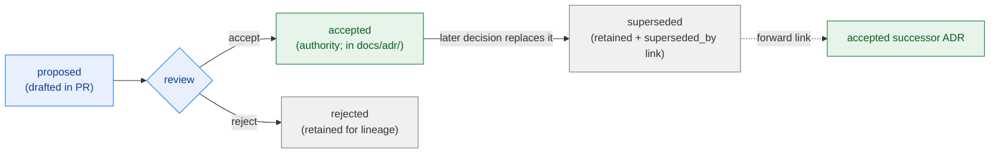

<!-- [KFM_META_BLOCK_V2]
doc_id: kfm://doc/docs-domains-flora-adr-readme
title: Flora Domain — ADR Folder README
type: standard
version: v1
status: draft
owners: [NEEDS VERIFICATION — flora domain steward; docs steward; architecture steward]
created: 2026-06-02
updated: 2026-06-02
policy_label: public
related:
  - docs/adr/README.md
  - docs/domains/flora/README.md
  - docs/doctrine/directory-rules.md
  - docs/doctrine/ai-build-operating-contract.md
  - docs/registers/DRIFT_REGISTER.md
tags: [kfm, domain, flora, adr, governance, placement]
notes:
  # PLACEMENT CONFLICT (read §1): docs/adr/ is the single canonical ADR home in the corpus. A per-domain docs/domains/flora/adr/ folder is a PARALLEL HOME, which is itself ADR-class per Directory Rules §2.4(5). This README does NOT bless that folder as an authority; it documents the conflict and routes ADR-class decisions to docs/adr/.
  # No corpus evidence sanctions docs/domains/<lane>/adr/. Treat this folder as CONFLICTED until an ADR (ADR-S-02-adjacent) decides domain-local ADR placement.
  # ADR template + triggers are CONFIRMED (Directory Rules §2.4). Flora domain ownership is CONFIRMED (Atlas Ch. 8).
  # Doctrine-adjacent doc; CONTRACT_VERSION = "3.0.0" pinned per AI Build Operating Contract v3.0.
[/KFM_META_BLOCK_V2] -->

<a id="top"></a>

# Flora Domain — ADR Folder README

> What this folder is for, what belongs in it, and — importantly — what does **not**. The canonical home for KFM Architecture Decision Records is the repo-wide `docs/adr/`. This README explains how a Flora-lane ADR folder relates to that home, and flags that the folder's own existence is an open placement question.

<p align="center">
  <b>One ADR home · Domain-local is CONFLICTED · ADR-class decisions go central · Surface, don't smooth</b>
</p>

---


**Status:** draft · **Owners:** _NEEDS VERIFICATION (flora + docs + architecture stewards)_ · **Last updated:** 2026-06-02 · **`CONTRACT_VERSION = "3.0.0"`**

---

## Quick links

- [1. Placement conflict (read first)](#1-placement-conflict-read-first)
- [2. Scope](#2-scope)
- [3. What an ADR is in KFM](#3-what-an-adr-is-in-kfm)
- [4. Where Flora ADR-class decisions actually go](#4-where-flora-adr-class-decisions-actually-go)
- [5. What may live in this folder](#5-what-may-live-in-this-folder)
- [6. ADR template](#6-adr-template)
- [7. Flora decisions likely to need ADRs](#7-flora-decisions-likely-to-need-adrs)
- [8. Lifecycle of an ADR](#8-lifecycle-of-an-adr)
- [9. Open questions register](#9-open-questions-register)
- [10. Verification backlog](#10-verification-backlog)
- [11. Changelog & definition of done](#11-changelog--definition-of-done)
- [12. Related docs](#12-related-docs)

---

## 1. Placement conflict (read first)

> [!WARNING]
> **This folder's existence is an open placement question.** Across the KFM corpus, the **single canonical home for Architecture Decision Records is the repo-wide `docs/adr/`** (e.g., `docs/adr/ADR-0001-schema-home.md`, `docs/adr/ADR-<NNNN>-...`). There is **no corpus evidence** sanctioning a per-domain `docs/domains/<lane>/adr/` folder. Creating one is a **parallel home for governance records**, which is exactly the kind of structural decision that **requires an ADR** under Directory Rules §2.4(5). [DIRRULES §2.4(5)] [ENCY §24.12]

What this means in practice:

- ADRs are **repo-wide governance**, not lane-local artifacts. An architectural decision rarely affects only one domain; even a "Flora-only" decision touches the shared schema home, policy lane, release lane, or trust membrane.
- A second ADR home fragments the decision record: reviewers would no longer have one place to find "what was decided and why," which is the entire point of an ADR set.
- Therefore this README **does not** declare `docs/domains/flora/adr/` an authority. It documents the conflict, routes ADR-class decisions to `docs/adr/`, and recommends resolution by ADR.

> [!IMPORTANT]
> **Recommendation:** file Flora architectural decisions in `docs/adr/` with a `flora` topical hint in the title (e.g., `ADR-<NNNN>-flora-rare-plant-geoprivacy.md`), **not** in this folder. Until an ADR decides whether domain-local ADR folders are permitted at all, treat this folder as **`PROPOSED / CONFLICTED`**, log it in `docs/registers/DRIFT_REGISTER.md`, and avoid placing authoritative ADRs here. [DIRRULES §2.5]

[Back to top ↑](#top)

---

## 2. Scope

**CONFIRMED doctrine / CONFLICTED placement.** This README orients a contributor who has landed in `docs/domains/flora/adr/` (or is considering creating it). It explains what an ADR is in KFM, where Flora's ADR-class decisions belong, what — if anything — may legitimately live in a lane-local ADR folder, and how to author an ADR correctly. The Flora lane governs plant taxonomic identity, occurrences, specimens, surveys, vegetation communities, and rare/protected/culturally sensitive flora controls (Atlas Ch. 8). [DOM-FLORA] [ENCY]

This README **explains**; it does not **decide**. The ADR home rule lives in Directory Rules; the ADR set lives in `docs/adr/`. On conflict, **Directory Rules wins on placement** (§2.1 authority order). [DIRRULES §2.1, §2.5]

[Back to top ↑](#top)

---

## 3. What an ADR is in KFM

**CONFIRMED doctrine.** An ADR records an architectural decision: the context, the decision, its consequences, and the alternatives considered. A new ADR is **required** before any of the following (Directory Rules §2.4): [DIRRULES §2.4]

1. Adding, removing, or renaming a **canonical root**.
2. Promoting a **compatibility root** to canonical, or deprecating a canonical root.
3. Changing the **schema-home rule** (`schemas/` vs `contracts/` authority).
4. Splitting or merging a **lifecycle phase** (`raw`, `work`, `quarantine`, `processed`, `catalog`, `triplets`, `published`, `receipts`, `proofs`, `registry`).
5. Creating a **parallel home** for any of: schemas, contracts, policy, sources, registries, releases, proofs, receipts.
6. **Bending an invariant** from Directory Rules §3.

> [!NOTE]
> Trigger 5 is why this very folder is contested: a domain-local ADR folder is a candidate parallel home for governance records. The doctrine's own rule turns the question back on the folder. [DIRRULES §2.4(5)]

[Back to top ↑](#top)

---

## 4. Where Flora ADR-class decisions actually go

| Decision type | Canonical home | Not here because |
|---|---|---|
| Any ADR-class decision (§2.4 triggers) | **`docs/adr/ADR-<NNNN>-flora-<slug>.md`** | ADRs are repo-wide governance; one home keeps the record findable |
| Flora schema-home questions | `docs/adr/` + `ADR-0001` (schema home) | Schema home is explicitly ADR-required (§2.4(3)) |
| Flora sensitivity-tier / rare-plant geoprivacy | `docs/adr/` (ADR-S-05 adjacent) + `policy/sensitivity/flora/` | Tier scheme governs public release; adoption is doctrine-class |
| Flora source-role vocabulary | `docs/adr/` (ADR-S-04) | Source-role anti-collapse is doctrine-significant |
| Cross-lane Flora ↔ Habitat / Fauna joins | `docs/adr/` (ADR-S-14) | Cross-lane joins span domains; not lane-local |
| Domain-scoped *conflicts* (not decisions) | `docs/registers/DRIFT_REGISTER.md` | Drift is tracked, then resolved by ADR |
| Domain-scoped *open questions* | `docs/domains/flora/OPEN_QUESTIONS.md` | Questions live in the lane; decisions go central |

> [!TIP]
> A useful test: *would this decision change a canonical root, the schema home, a lifecycle phase, a parallel home, or an invariant?* If yes, it is a `docs/adr/` ADR. If it is merely "which question should Flora answer next," it is an open-questions or verification-backlog item, not an ADR. [DIRRULES §2.4]

[Back to top ↑](#top)

---

## 5. What may live in this folder

**CONFLICTED — pending the placement ADR.** If a domain-local ADR folder is ever sanctioned, its legitimate role would be a **lane-scoped index/pointer**, not an authority. Until then:

| Candidate content | Verdict | Where it really belongs |
|---|---|---|
| Authoritative ADR files for Flora | **No** | `docs/adr/` |
| A pointer/index listing Flora-relevant ADRs by number | **Maybe** (this README can serve that role) | here, as a *non-authoritative* index back to `docs/adr/` |
| Flora ADR *proposals* drafted before filing | **Discouraged** | draft in the PR; file at `docs/adr/` once shaped |
| Decision *meaning* / object semantics | **No** | `contracts/domains/flora/` |
| Policy / sensitivity rules | **No** | `policy/domains/flora/`, `policy/sensitivity/flora/` |

A non-authoritative **Flora-relevant ADR index** (the one safe use) might look like:

```text
# Flora-relevant ADRs (index only — authority lives in docs/adr/)
ADR-0001  schema home (schemas/contracts/v1/...)        docs/adr/ADR-0001-schema-home.md
ADR-S-04  source-role vocabulary v1                     docs/adr/ (PROPOSED)
ADR-S-05  sensitivity tier scheme T0–T4                 docs/adr/ (PROPOSED)
ADR-S-14  cross-lane join policy (Flora↔Habitat/Fauna)  docs/adr/ (PROPOSED)
```

[Back to top ↑](#top)

---

## 6. ADR template

**CONFIRMED fields (Directory Rules §2.4).** Whether filed in `docs/adr/` (recommended) or, pending the placement ADR, indexed here, an ADR carries exactly these fields. Superseded ADRs MUST be retained with `status: superseded` and a forward link to the replacing ADR. [DIRRULES §2.4]

```markdown
---
id: ADR-<NNNN>            # or ADR-S-<NN> from the Atlas open-ADR backlog
title: <decision title; include "flora" when lane-relevant>
status: proposed | accepted | superseded | rejected
date: YYYY-MM-DD
supersedes: <ADR-id or none>
superseded_by: <ADR-id or none>
---

## Context
<the forces, constraints, and doctrine at play — cite Directory Rules / Atlas sections>

## Decision
<the decision, stated plainly>

## Consequences
<what becomes true, what is now constrained, what must migrate>

## Alternatives
<options considered and why they were not chosen>
```

> [!NOTE]
> Numbering: sequential `ADR-NNNN` for repo-wide decisions; `ADR-S-NN` references the Atlas §24.12 Master Open-ADR Backlog (15 pending slots). The corpus notes an **open numbering conflict around ADR-0003** — do not reuse a reserved number; confirm the next free number against the mounted `docs/adr/` set before filing. [ENCY §24.12]

[Back to top ↑](#top)

---

## 7. Flora decisions likely to need ADRs

These are CONFIRMED-as-ADR-class candidates for the Flora lane. Each is filed in `docs/adr/`, not here.

| Likely ADR | Why it is ADR-class | Atlas backlog tie |
|---|---|---|
| Flora rare-plant geoprivacy / sensitivity tier mapping | Governs public release of rare/protected/culturally sensitive plants | ADR-S-05 |
| Flora source-role assignments (KDWP, Kansas Biological Survey / KU herbarium, USFWS ECOS, NatureServe, GBIF, iDigBio, iNaturalist) | Source-role anti-collapse; authority vs observation vs context | ADR-S-04 |
| Flora ↔ Habitat / Fauna join policy (Vegetation Community, Habitat Association) | Cross-lane joins span domains | ADR-S-14 |
| RangePolygon / DistributionSurface release thresholds | Exact-vs-public geometry thresholds govern release | ADR-S-05 adjacent |
| Whether domain-local ADR folders are permitted at all | Parallel-home decision | this folder; §2.4(5) |

> [!CAUTION]
> **Rare/culturally sensitive plants are a sensitive domain.** Any ADR touching rare-plant locations, culturally sensitive flora, or steward-controlled records routes its disposition through the AI Build Operating Contract §23.2 sensitive-domain matrix (deny exact exposure; generalize; RedactionReceipt + steward review). The ADR records the decision; it does not itself publish coordinates. [OPCON §23.2] [DOM-FLORA]

[Back to top ↑](#top)

---

## 8. Lifecycle of an ADR



**Reading it.** An ADR is never deleted. A rejected ADR is retained as lineage; a superseded ADR is retained with `status: superseded` and a forward link to its replacement, so the decision history stays auditable. [DIRRULES §2.4]

[Back to top ↑](#top)

---

## 9. Open questions register

| ID | Question | Owner role | Resolution path |
|---|---|---|---|
| OQ-FLORA-ADR-01 | Are domain-local ADR folders (`docs/domains/<lane>/adr/`) permitted at all, or is `docs/adr/` the sole home? | Docs + architecture stewards | ADR (parallel-home decision, §2.4(5)); ADR-S-02 adjacent |
| OQ-FLORA-ADR-02 | If permitted, is the folder a non-authoritative index only, or may it hold draft proposals? | Docs steward | same ADR as OQ-FLORA-ADR-01 |
| OQ-FLORA-ADR-03 | Next free ADR number (open ADR-0003 numbering conflict noted in corpus). | Architecture steward | Inspect mounted `docs/adr/` set |
| OQ-FLORA-ADR-04 | Which Flora decisions in §7 are filed first (rare-plant geoprivacy vs source-role)? | Flora domain steward | Triage against ADR-S-04 / ADR-S-05 |

[Back to top ↑](#top)

---

## 10. Verification backlog

These items remain `NEEDS VERIFICATION` before this README is promoted from `draft` to `published`.

1. **NEEDS VERIFICATION** — Mounted-repo presence of `docs/adr/` and its README/index; confirm it is the live ADR home.
2. **NEEDS VERIFICATION** — Whether `docs/domains/flora/adr/` should exist at all (OQ-FLORA-ADR-01); if not, this README is repointed to `docs/domains/flora/README.md` as an "ADRs live in docs/adr/" note.
3. **NEEDS VERIFICATION** — Next free ADR number and the ADR-0003 conflict resolution.
4. **NEEDS VERIFICATION** — Presence of the Flora-relevant ADRs referenced in §5/§7 (ADR-0001 accepted; ADR-S-04/-S-05/-S-14 proposed).
5. **NEEDS VERIFICATION** — Owners of the Flora lane and the architecture/docs stewards.

[Back to top ↑](#top)

---

## 11. Changelog & definition of done

### 11.1 Changelog

| Change | Type (per contract §37) | Reason |
|---|---|---|
| Initial Flora ADR-folder README | new | No prior README existed at this path |
| Surfaced the parallel-home placement conflict as the lead section | clarification | `docs/adr/` is the single canonical ADR home; a domain-local folder is §2.4(5) ADR-class |
| Routed all ADR-class Flora decisions to `docs/adr/`; defined the one safe local use (non-authoritative index) | gap closure | Prevents a parallel governance home from hardening into authority |
| Reproduced the CONFIRMED ADR template + §2.4 triggers; noted ADR-0003 numbering conflict | gap closure | CONFIRMED Directory Rules doctrine |
| Pinned `CONTRACT_VERSION = "3.0.0"` | housekeeping | Doctrine-adjacent doc requirement |

> **Backward compatibility.** New file; no existing anchors. If OQ-FLORA-ADR-01 resolves against domain-local ADR folders, this file is retired and its one safe function (the ADR index) folds into `docs/domains/flora/README.md`.

### 11.2 Definition of done

This README is done enough to enter the repository when:

- the domain-local ADR-folder question (OQ-FLORA-ADR-01) is resolved by ADR, **or** this file is explicitly retained as a non-authoritative pointer with a DRIFT_REGISTER entry;
- a docs steward, the flora domain steward, and an architecture steward review it;
- it is linked from `docs/domains/flora/README.md` and `docs/adr/README.md`;
- it does not assert `docs/domains/flora/adr/` as an ADR authority;
- the placement conflict is logged in `docs/registers/DRIFT_REGISTER.md`;
- the `GENERATED_RECEIPT.json` planned for this artifact is wired into CI;
- future changes follow the operating contract's §37 lifecycle.

[Back to top ↑](#top)

---

## 12. Related docs

- [`docs/adr/README.md`](../../../adr/README.md) — **canonical** ADR home and index *(PROPOSED — verify presence)*
- [`docs/adr/ADR-0001-schema-home.md`](../../../adr/ADR-0001-schema-home.md) — schema-home rule *(referenced by Flora schema decisions)*
- [`docs/domains/flora/README.md`](../README.md) — Flora domain landing page *(PROPOSED)*
- [`docs/doctrine/directory-rules.md`](../../../doctrine/directory-rules.md) — §2.1 authority order, §2.4 ADR triggers + template, §2.5 conflict handling
- [`docs/doctrine/ai-build-operating-contract.md`](../../../doctrine/ai-build-operating-contract.md) — `CONTRACT_VERSION = "3.0.0"`; §23.2 sensitive-domain matrix
- [`docs/registers/DRIFT_REGISTER.md`](../../../registers/DRIFT_REGISTER.md) — where this folder's placement conflict is logged
- **Atlas references:** Atlas v1.1 Ch. 8 (Flora — ownership, object families, sensitivity), §24.12 (Master Open-ADR Backlog: ADR-S-02 doctrine-artifact placement, ADR-S-04 source-role vocabulary, ADR-S-05 tier scheme, ADR-S-14 cross-lane joins)

[Back to top ↑](#top)

---

### Footer

**Canonical ADR home:** [`docs/adr/`](../../../adr/README.md) · **Related:** [flora/README.md](../README.md) · [directory-rules.md](../../../doctrine/directory-rules.md) · [DRIFT_REGISTER.md](../../../registers/DRIFT_REGISTER.md)

**Last updated:** 2026-06-02 · **Owners:** _NEEDS VERIFICATION_ · **Status:** draft · **`CONTRACT_VERSION = "3.0.0"`** · **Placement:** _CONFLICTED — see §1_

[Back to top ↑](#top)
