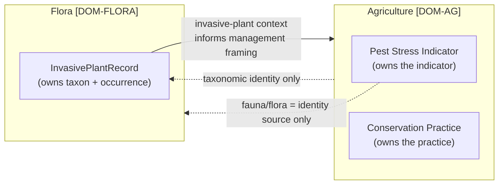

<!-- [KFM_META_BLOCK_V2]
doc_id: kfm://doc/flora-agriculture-overlap
title: Flora × Agriculture — Cross-Lane Overlap
type: standard
version: v1
status: draft
owners: <flora-domain-steward> # PLACEHOLDER — assign before review
created: 2026-06-03
updated: 2026-06-03
policy_label: public
related: [docs/domains/flora/SOURCE_REGISTRY.md, docs/domains/flora/SOURCE_ROLES.md, docs/domains/flora/VERIFICATION_BACKLOG.md, docs/domains/agriculture/README.md, ai-build-operating-contract.md, directory-rules.md]
tags: [kfm]
notes: [CONTRACT_VERSION = "3.0.0"; cross-lane overlap doc localizing Atlas §24.4.6 (Edges owned by Flora → Agriculture) and §24.4.7 (Agriculture edges); cross-lane join policy is ADR-S-14; PLANTS-join poaching-map risk governs deny-by-default; filename agriculture_overlap.md preserved as requested though lane convention is CROSS_LANE_RELATIONS.md — see Section 2; all repo paths PROPOSED]
[/KFM_META_BLOCK_V2] -->

# 🌿🌾 Flora × Agriculture — Cross-Lane Overlap

> Where the Flora and Agriculture lanes touch — invasive plants, vegetation/crop context, pest and conservation framing — and the ownership boundaries, join rules, and deny-by-default constraints that keep each lane's truth intact. Neither lane absorbs the other; they cite each other through governed joins.

<!-- TODO: replace with real Shields.io endpoints (CI, last-updated) once wired -->

| Field | Value |
|---|---|
| **Status** | `draft` |
| **Owners** | `<flora-domain-steward>` · `<agriculture-domain-steward>` · `<policy-reviewer>` *(PLACEHOLDER)* |
| **Updated** | 2026-06-03 |
| **Lanes** | Flora `[DOM-FLORA]` × Agriculture `[DOM-AG]` |
| **Edge authority** | Atlas §24.4.6 (Flora-owned edges) · §24.4.7 (Agriculture-owned edges) |
| **Authority** | `ai-build-operating-contract.md` v3.0 · `directory-rules.md` · ADR-S-14 |

---

## Contents

- [1. Why this overlap doc exists](#1-why-this-overlap-doc-exists)
- [2. What each lane owns](#2-what-each-lane-owns)
- [3. The overlap surface](#3-the-overlap-surface)
- [4. Edge direction & ownership](#4-edge-direction--ownership)
- [5. Join rules](#5-join-rules)
- [6. The "framing, never instruction" rule](#6-the-framing-never-instruction-rule)
- [7. Sensitivity at the boundary](#7-sensitivity-at-the-boundary)
- [8. Repo fit](#8-repo-fit)
- [9. What does not belong here](#9-what-does-not-belong-here)
- [Open questions register](#open-questions-register)
- [Open verification backlog](#open-verification-backlog)
- [Changelog](#changelog-v0--v1)
- [Definition of done](#definition-of-done)
- [Related docs](#related-docs)

---

## 1. Why this overlap doc exists

Flora and Agriculture describe overlapping ground — the same field can carry a crop, a weed, an invasive, and a native remnant. Without a clear boundary, the lanes drift: a crop observation gets cited as a botanical occurrence, or an invasive-plant record gets read as a land-management instruction. This document fixes the boundary and the rules for the few governed joins that cross it.

> [!IMPORTANT]
> **Each lane keeps its own truth.** Flora owns plant taxonomic identity and occurrences; Agriculture owns crop, yield, suitability, and stress observations. A cross-lane relation must preserve ownership, source role, sensitivity, and `EvidenceBundle` support on both sides. `[DOM-FLORA] [DOM-AG]`

[↑ Back to top](#contents)

---

## 2. What each lane owns

CONFIRMED dossier. The object families below are owned by their respective lanes; neither lane may relabel the other's objects.

| Flora owns `[DOM-FLORA]` | Agriculture owns `[DOM-AG]` |
|---|---|
| Plant Taxon · FloraTaxon Crosswalk · Flora Occurrence · SpecimenRecord · Rare Plant Record | Crop Observation · Field Candidate · Crop Rotation · Yield Observation |
| Vegetation Community · **InvasivePlantRecord** · Phenology Observation | Irrigation Link · **Conservation Practice** · **Soil Crop Suitability** |
| RangePolygon · Habitat Association · Botanical Survey · Restoration Planting | Agricultural Economy Observation · SupplyChainNode · **Drought Stress Indicator** · **Pest Stress Indicator** · Aggregation Receipt |

> [!NOTE]
> **Explicit non-ownership.** Flora does not own habitat patches (Habitat), animal taxa (Fauna), or soil/hydrology/agriculture truth. Agriculture does not own canonical soil map-unit semantics (Soil), water observations (Hydrology), or land ownership (People/Land). Where the lanes meet, they cite; they do not absorb. `[DOM-FLORA] [DOM-AG]`

[↑ Back to top](#contents)

---

## 3. The overlap surface

The genuine touch-points, drawn from the dossier cross-lane tables:

| Touch-point | Flora side | Agriculture side | Owner of the truth |
|---|---|---|---|
| **Invasive plants** | `InvasivePlantRecord` (taxon identity, occurrence) | management framing for weed/invasive pressure | Flora owns the record; Agriculture frames management context. |
| **Vegetation vs. crop** | Vegetation Community, Phenology | Crop Observation, crop progress | Each owns its own observation; not interchangeable. |
| **Pest pressure** | plant-host taxonomic identity (if cited) | `Pest Stress Indicator` | **Agriculture owns** the indicator; Flora/Fauna supply taxonomic identity only. |
| **Conservation / restoration** | Restoration Planting (native flora) | `Conservation Practice`, `Soil Crop Suitability` | Each owns its object; framing crosses, instruction does not. |
| **Vegetation indices** | NDVI as flora condition context (modeled) | NDVI as crop/drought context (modeled) | Each cites the modeled surface in its own role; neither claims the other's interpretation. |

[↑ Back to top](#contents)

---

## 4. Edge direction & ownership

CONFIRMED doctrine. The Atlas cross-lane atlas assigns each edge an **owner** — the lane that consumes context *from* the other. Direction matters: it fixes which lane's `EvidenceBundle` carries the claim.

| Edge owner | Consumes from | Relation (CONFIRMED doctrine) |
|---|---|---|
| **Flora** | Agriculture | Invasive-plant context informs management framing; **never an instruction**. (Atlas §24.4.6) |
| **Agriculture** | Fauna/Flora | Pest stress indicators are agriculture-owned; flora is the source of taxonomic identity only. (Atlas §24.4.5/§24.4.7) |
| **Agriculture** | People/Land | Field candidates may be joined to LandParcel context; **private person-parcel joins fail closed by default**. (Atlas §24.4.7) |

[↑ Back to top](#contents)

---

## 5. Join rules

CONFIRMED doctrine. Cross-lane joins are inference-risk multipliers; the cross-lane join policy is **ADR-S-14**. Every Flora × Agriculture join must preserve ownership, source role, sensitivity, and `EvidenceBundle` support on both sides.

| Join | Allowed? | Constraint |
|---|---|---|
| `InvasivePlantRecord` × Agriculture management context | ✅ as framing | Flora keeps record ownership; output is context, not a directive. |
| Agriculture `Pest Stress Indicator` × Flora taxon identity | ✅ identity only | Agriculture owns the indicator; Flora supplies taxon name, nothing more. |
| Flora occurrences × Agriculture field/parcel candidates | ⚠️ governed | Must not expose private person-parcel joins (those fail closed); must not reconstruct sensitive rare-plant locations. |
| PLANTS county checklist × any occurrence stream | ⚠️ **deny-by-default** | County checklist + GBIF/iNat/heritage can become a poaching map; route through steward review. |
| Rare-plant record × crop/field geometry | ❌ deny exact | Exact rare-plant geometry is T4; generalize first with a `RedactionReceipt`. |

> [!CAUTION]
> **Join-induced sensitivity is computed on the product, not inherited from the inputs.** A benign PLANTS county list and a benign occurrence stream can combine into a sensitive product. The join — not either input — carries the sensitivity, and a join that trips `SENSITIVITY_UNRESOLVED` fails closed. `[DOM-FLORA]`

[↑ Back to top](#contents)

---

## 6. The "framing, never instruction" rule

CONFIRMED doctrine. The Atlas Flora→Agriculture edge is explicit: invasive-plant context **informs management framing; never an instruction**. The same restraint applies to conservation-practice framing (habitat-quality scores frame conservation candidates but "never used to instruct land management," Atlas §24.4.4).

For KFM this means:

- Flora may supply *what is present* (invasive taxon, occurrence, phenology) as context.
- Agriculture may *frame* management questions around that context.
- Neither lane, and **no governed-AI surface**, may emit a land-management directive ("spray here," "remove this stand") as KFM authority.
- A Focus Mode answer that drifts toward instruction must `ABSTAIN` or be `BOUNDED`, with the boundary disclosed.

> [!WARNING]
> KFM is an evidence system, not an operational advisory. Crossing from *framing* to *instruction* is out of scope and, for any safety- or land-management-adjacent action, a deny condition. `[DOM-FLORA] [DOM-AG]`

[↑ Back to top](#contents)

---

## 7. Sensitivity at the boundary

> [!CAUTION]
> The most dangerous Flora × Agriculture interaction is **location reconstruction**. Crop/field geometry is often precise and public; rare-plant geometry is T4 (Denied). Joining them can de-anonymize a rare-plant site. Any join touching sensitive flora must generalize geometry and emit a `RedactionReceipt` before any public tier. `[DOM-FLORA]`

| Boundary risk | Default disposition |
|---|---|
| Rare-plant occurrence × precise field/parcel geometry | `DENY` exact; generalize first; `RedactionReceipt` + `ReviewRecord`. |
| PLANTS checklist × listed-species intersection | `needs-review`; deny public join until cleared. |
| Private person-parcel × any flora occurrence | Fail closed (People/Land owns the privacy boundary). |
| Modeled vegetation index cited as observed crop/flora fact | `DENY` / `ABSTAIN` — role collapse (`ROLE_COLLAPSE`). |

[↑ Back to top](#contents)

---

## 8. Repo fit

**Path (as requested):** `docs/domains/flora/agriculture_overlap.md`

Per `directory-rules.md` §12, Flora is a lane segment under `docs/domains/flora/`; a Flora-authored cross-lane doc belongs in the Flora lane and references Agriculture, not the reverse.

| Direction | Related surface (PROPOSED) | Relationship |
|---|---|---|
| **Authoritative edges** | Atlas §24.4.6 / §24.4.7 | Cross-lane atlas; this file localizes the Flora×Agriculture rows. |
| **Pairs with** | `docs/domains/agriculture/README.md` and its cross-lane doc | The Agriculture lane's reciprocal view. |
| **Governed by** | ADR-S-14 (cross-lane join policy) · `policy/sensitivity/flora/` *(PROPOSED)* | Join allow/deny/needs-review. |
| **Uses** | [`SOURCE_ROLES.md`](./SOURCE_ROLES.md) | Role integrity across the join. |

> [!NOTE]
> Every path above is **PROPOSED** until checked against a mounted repository. The lane's other cross-lane content typically lives in a `CROSS_LANE_RELATIONS.md`; this file is the Flora×Agriculture slice of that surface (see Open questions).

[↑ Back to top](#contents)

---

## 9. What does not belong here

- **Agriculture's internal object semantics** → `docs/domains/agriculture/`.
- **The full Flora cross-lane set** (Habitat, Fauna, Soil/Hydrology, Hazards, Archaeology) → `docs/domains/flora/CROSS_LANE_RELATIONS.md` *(PROPOSED)*; this file is Agriculture-only.
- **Join policy rule logic** → ADR-S-14 and `policy/` *(PROPOSED)*, not encoded here.
- **Source admission / roles** → the Flora source suite (`SOURCES.md`, `SOURCE_ROLES.md`).

[↑ Back to top](#contents)

---

## Open questions register

| ID | Question | Owner role | Resolution path |
|---|---|---|---|
| OQ-FLORA-AG-01 | Should this be a standalone `agriculture_overlap.md` or a section of `CROSS_LANE_RELATIONS.md`? | docs steward | Lane convention check; `DRIFT_REGISTER` if it diverges. |
| OQ-FLORA-AG-02 | Which Flora × Agriculture joins require steward review vs. deny vs. open? | flora + ag stewards | ADR-S-14 cross-lane join policy. |
| OQ-FLORA-AG-03 | What is the generalization radius for rare-plant × field-geometry joins? | policy reviewer | `policy/domains/flora/geoprivacy.yaml` (PROPOSED) + ADR-S-05. |
| OQ-FLORA-AG-04 | Does the Agriculture lane have a reciprocal overlap doc, and do the edges agree? | ag steward | Repo inspection; reconcile both sides. |

## Open verification backlog

These items remain `NEEDS VERIFICATION` before promotion from `draft` to `published`:

1. ADR-S-14 status (which joins are open/review/denied).
2. Existence and shape of `docs/domains/agriculture/` and a reciprocal overlap doc.
3. Generalization parameters for sensitive flora × agriculture geometry joins.
4. Whether the lane uses `agriculture_overlap.md` or folds this into `CROSS_LANE_RELATIONS.md`.
5. Reviewer / steward owners (currently PLACEHOLDER).

## Changelog v0 → v1

| Change | Type (per contract §37) | Reason |
|---|---|---|
| Initial Flora × Agriculture overlap doc created | new | No prior file; built from Atlas §24.4.6/§24.4.7 cross-lane edges, dossier ownership tables, and ADR-S-14. |

> **Backward compatibility.** New file; no anchors to preserve. If folded into `CROSS_LANE_RELATIONS.md`, preserve the §3–§7 boundary tables.

## Definition of done

This document is done enough to enter the repository when:

- it is placed under `docs/domains/flora/` per Directory Rules §12;
- a flora steward, an agriculture steward, and a policy reviewer review it;
- it agrees with the Agriculture lane's reciprocal cross-lane view;
- it does not conflict with accepted ADRs (notably ADR-S-14 cross-lane joins, ADR-S-05 sensitivity tiers);
- the standalone-vs-section question (OQ-FLORA-AG-01) is resolved or logged in `docs/registers/DRIFT_REGISTER.md`;
- the `GENERATED_RECEIPT.json` planned in Section 2 is wired into CI;
- placeholder owners and join parameters are resolved.

---

### Related docs

- [`docs/domains/flora/SOURCE_REGISTRY.md`](./SOURCE_REGISTRY.md) — Flora doctrinal source registry
- [`docs/domains/flora/SOURCE_ROLES.md`](./SOURCE_ROLES.md) — source-role discipline (join role integrity)
- [`docs/domains/flora/VERIFICATION_BACKLOG.md`](./VERIFICATION_BACKLOG.md) — Flora verification queue
- `docs/domains/flora/CROSS_LANE_RELATIONS.md` — full Flora cross-lane set *(TODO: confirm)*
- `docs/domains/agriculture/README.md` — Agriculture lane orientation *(TODO: confirm)*
- `ai-build-operating-contract.md` — operating contract (`CONTRACT_VERSION = "3.0.0"`)
- `directory-rules.md` — placement law · ADR-S-14 — cross-lane join policy

**Last updated:** 2026-06-03 · **Contract:** `CONTRACT_VERSION = "3.0.0"`

[↑ Back to top](#contents)
