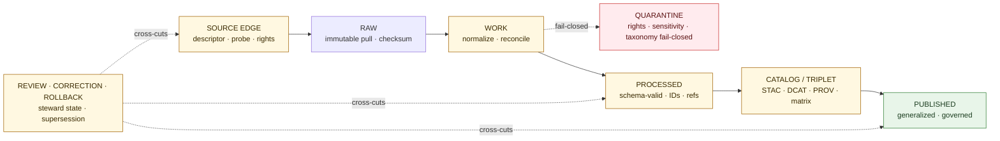

<!-- [KFM_META_BLOCK_V2]
doc_id: kfm://doc/docs-domains-flora-architecture-readme
title: Flora Domain — Architecture (Lane Entrypoint)
type: standard
version: v0
status: draft
owners: TODO-flora-steward
created: 2026-05-08
updated: 2026-05-08
policy_label: public
related:
  - docs/domains/flora/README.md
  - docs/architecture/README.md
  - docs/adr/ADR-flora-schema-home.md
  - docs/adr/ADR-flora-source-roles.md
  - docs/adr/ADR-flora-sensitive-location-policy.md
  - docs/adr/ADR-flora-public-layer-strategy.md
  - data/registry/flora/sources.yaml
  - contracts/flora/
  - schemas/contracts/v1/domains/flora/
  - policy/domains/flora/
tags: [kfm, domain, flora, architecture, governance, lifecycle]
notes:
  - All paths and file references are PROPOSED until verified against the mounted repository.
  - Folder-style "architecture/" home for this domain diverges from docs/domains/<domain>/ARCHITECTURE.md single-file pattern; PROPOSED CORRECTION pending ADR.
[/KFM_META_BLOCK_V2] -->

# Flora Domain — Architecture

> **Lane entrypoint.** Governed, evidence-first, map-first, time-aware architecture for plant taxa, occurrences, communities, range surfaces, and sensitive flora controls in the Kansas Frontier Matrix.

| Field | Value |
|---|---|
| **Status** | `experimental` — design-only; no implementation maturity claimed. |
| **Truth posture** | Mostly **PROPOSED**; doctrine **CONFIRMED**; repo state **UNKNOWN** (no mounted repo at draft time). |
| **Owners** | `TODO-flora-steward` · `TODO-data-governance` · `TODO-ui-evidence` |
| **Authority level** | Canonical doctrine for the Flora lane within `docs/domains/flora/`. |
| **Source baseline** | KFM Flora Architecture PDF-Only Implementation Blueprint (2026-04-21). |
| **Schema home** | UNKNOWN — blocked on `ADR-flora-schema-home.md`. |

<!-- Compact Shields.io badges. Targets are placeholders until CI, license, and registry routes are verified. -->


**Quick jump:** [Purpose](#purpose) · [Status](#status-and-truth-labels) · [Repo fit](#repo-fit) · [What belongs here](#scope--what-belongs-here) · [Architecture at a glance](#architecture-at-a-glance) · [Lifecycle](#lifecycle) · [Object families](#object-families) · [Source roles](#source-role-discipline) · [Sensitivity](#sensitivity-and-public-safe-surface) · [Trust surfaces](#trust-surfaces-and-contracts) · [API · UI · AI boundary](#api--ui--ai-boundary) · [Validation](#validation-and-policy-gates) · [Documents in this folder](#documents-planned-in-this-folder) · [Verification backlog](#verification-backlog) · [FAQ](#faq) · [Appendix](#appendix)

---

## Purpose

The Flora lane ingests, normalizes, validates, catalogs, publishes, explains, reviews, corrects, and rolls back flora information **without collapsing distinct kinds of knowledge into one truth surface.** A model output is not an observation. A range map is not a specimen. A generalized public polygon is not an internal sensitive occurrence point. An AI answer is not source evidence.

This document is the **entrypoint** for the architecture sub-folder under `docs/domains/flora/`. It describes the lane's mission, lifecycle, object boundaries, source-role discipline, sensitivity posture, trust surfaces, and the boundary between governed APIs, the MapLibre shell, and AI/Focus Mode. Detail pages (when written) are linked from the [Documents planned in this folder](#documents-planned-in-this-folder) table.

> [!IMPORTANT]
> Every consequential outward Flora claim must be reconstructable to source descriptors, `EvidenceRef` → `EvidenceBundle` resolution, policy decisions, review state, catalog records, and correction lineage. **The public layer is not the truth source.**

[Back to top](#flora-domain--architecture)

---

## Status and truth labels

| Aspect | Label | Note |
|---|---|---|
| Mission, lifecycle, source-role taxonomy, sensitivity posture | **CONFIRMED-DOCTRINE** | Drawn from the attached Flora Architecture Blueprint and adjacent KFM corpus (Components Passes 17–19, MapLibre UI doctrine). |
| All file paths, schema names, validator names, route names listed below | **PROPOSED** | Not verified against a mounted repository at draft time. |
| Folder-style `docs/domains/flora/architecture/` layout (this README) | **PROPOSED CORRECTION** | Adjacent domains (e.g., `docs/domains/hydrology/ARCHITECTURE.md`) use a single-file pattern. See [FAQ](#why-a-folder-rather-than-a-single-architecturemd). |
| Owners, badge targets, branch protections, CI status, package manager, OPA/Conftest availability | **UNKNOWN** | No mounted repo, no workflow evidence, no runtime evidence in the drafting session. |
| Source endpoints (KDWP, USFWS ECOS, GBIF, iDigBio, NatureServe, USDA PLANTS, ITIS/POWO/WFO, iNaturalist, HLS-VI, NLCD/NWI/GAP/LANDFIRE) | **NEEDS VERIFICATION** | Endpoints, rights, licensing, cadence, and rare-location policies must be re-verified before activation. |

Memory is not evidence. Generic best practice is not fact. Where this document does not have admissible evidence, it labels the claim and stops.

[Back to top](#flora-domain--architecture)

---

## Repo fit

**Where this folder sits** (PROPOSED — verify against repo):

```
docs/
├── architecture/                           ← cross-cutting system architecture
├── domains/
│   ├── README.md
│   ├── flora/
│   │   ├── README.md                       ← lane status & command map
│   │   ├── architecture/                   ← THIS FOLDER (PROPOSED CORRECTION)
│   │   │   └── README.md                   ← THIS FILE
│   │   ├── CURRENT_STATE.md
│   │   ├── SOURCE_REGISTRY.md
│   │   ├── DATA_MODEL.md
│   │   ├── PIPELINES_AND_LIFECYCLE.md
│   │   ├── PUBLICATION_AND_POLICY.md
│   │   ├── UI_AND_EVIDENCE_DRAWER.md
│   │   ├── VERIFICATION_BACKLOG.md
│   │   ├── ROADMAP.md
│   │   ├── FILE_MANIFEST.md
│   │   ├── GLOSSARY.md
│   │   ├── IDEA_INTAKE.md
│   │   └── CHANGELOG.md
│   ├── hydrology/   habitat/   fauna/   geology/   atmosphere/
│   ├── archaeology/ hazards/   roads-rail-trade/   settlements-infrastructure/
│   └── agriculture/ soil/      …
├── adr/
└── …
```

**Upstream (depends on):** the KFM Directory Rules (root authority boundaries), `docs/architecture/` (cross-cutting system architecture), the Flora Architecture Blueprint, and the four PROPOSED ADRs listed in the [meta block](#).

**Downstream (consumed by):** `contracts/flora/` or `schemas/contracts/v1/domains/flora/` (PROPOSED — pending `ADR-flora-schema-home.md`); `policy/domains/flora/`; `data/registry/flora/`; `tests/domains/flora/`; `pipelines/domains/flora/` and `pipeline_specs/flora/`; the Governed API; the MapLibre shell; the Evidence Drawer; Focus Mode.

[Back to top](#flora-domain--architecture)

---

## Scope — what belongs here

### Accepted inputs

- Architecture overview and entrypoint prose for the Flora lane.
- Lifecycle, object-family, source-role, sensitivity, and boundary explanations specific to flora.
- Cross-references to ADRs, schemas, contracts, policies, registries, pipelines, and UI surfaces.
- Mermaid diagrams that describe **real or governed-proposed** structure (not decoration).

### What does **not** belong here

| Goes here | Does **not** go here | Where it should go |
|---|---|---|
| Architectural prose, boundaries, lifecycle description | Steward-facing how-to runbooks | `docs/runbooks/` |
| Object boundary explanations | Machine-checkable schema files | `schemas/contracts/v1/domains/flora/` (PROPOSED) |
| Source-role doctrine and registry rationale | The actual source registry rows | `data/registry/flora/sources.yaml` (PROPOSED) |
| Sensitivity posture and policy boundaries | Executable Rego/Conftest rules | `policy/domains/flora/*.rego` (PROPOSED) |
| API/UI/AI boundary description | OpenAPI files, route bindings, DTOs | `apps/governed-api/` (PROPOSED) |
| Range/distribution **doctrine** | Actual GeoJSON/PMTiles/COG artifacts | `data/published/flora/` (PROPOSED) |
| Living status snapshots | A long aspirational roadmap | `docs/domains/flora/CURRENT_STATE.md`, `…/ROADMAP.md` |
| Sensitive examples or rare-species exact coordinates | — | **Never.** Quarantine and redact. |

> [!CAUTION]
> Do not paste exact coordinates of rare, protected, or culturally sensitive plants into any document under this folder, even as illustration. Use **generalized**, **withheld**, or clearly synthetic examples only.

[Back to top](#flora-domain--architecture)

---

## Architecture at a glance

The Flora lane is one **domain lane** inside the KFM trust membrane. It runs every consequential claim through six lifecycle stages (with review/correction/rollback as cross-cutting governance) and exposes only **published, governed, public-safe** surfaces to ordinary clients.



> [!NOTE]
> **Diagram status: PROPOSED-DOCTRINE.** Reflects the lifecycle and governance model from the Flora Architecture Blueprint. The named stages and the cross-cutting governance overlay are doctrinally CONFIRMED; the rendering is a faithful summary, not a guarantee that any pipeline is implemented in the repo.

### Non-collapse rule

These six knowledge characters must remain distinct **at every stage** of the lifecycle:

1. **Observed occurrence** — evidence of a plant at a place and time.
2. **Institutional / specimen evidence** — herbarium sheets, catalogued material.
3. **Modeled range or suitability** — derived spatial summary.
4. **Regulatory / stewardship context** — status assertions, listing, review.
5. **Generalized public-safe display layer** — outward MapLibre surface.
6. **AI explanation payload** — interpretive, citation-bound.

Collapsing any pair is a SEVERE invariant violation: it is the lane equivalent of treating a tile renderer as truth.

[Back to top](#flora-domain--architecture)

---

## Lifecycle

Promotion between stages is a **governed state transition, not a file move.** Each stage has fail-closed conditions. Derived layers stay derived unless explicitly promoted with full evidence.

| Stage | Flora responsibilities | Representative artifacts | Fail-closed conditions |
|---|---|---|---|
| **SOURCE EDGE** | Resolve descriptor; probe; capture rights/sensitivity; record ETag/Last-Modified/checksum if available. | `source_descriptor`, `source_probe_receipt`, source-role registry entry. | Unknown rights · unknown public sensitivity · unverified controlled source · missing authority boundary. |
| **RAW** | Store immutable raw pulls (or fixture equivalents) with source metadata and checksums. No destructive normalization. | raw artifact, `raw_manifest`, `run_receipt`. | Raw artifact referenced by a public payload · missing checksum on a release candidate. |
| **WORK / QUARANTINE** | Normalize, clean, reconcile taxon, handle CRS/precision, flag duplicates, capture quarantine reason codes. | `work_normalized` records, `quarantine_record`, `taxon_reconciliation_report`. | Rights failure · sensitivity failure · invalid geometry · ambiguous taxon · unresolved precision. |
| **PROCESSED** | Validated normalized objects with deterministic IDs, quality state, `source_refs`, `evidence_refs`, public-safe geometry **where allowed.** | `flora_taxon`, `flora_occurrence`, `plant_community`, `range_map`, `phenology_product`. | Schema failure · missing `source_refs` · missing `evidence_refs` · missing `spec_hash` · invalid CRS. |
| **CATALOG / TRIPLET** | Emit STAC for spatial assets, DCAT for datasets/distributions, PROV lineage; close `catalog_matrix`; project graph deltas if supported. | `stac_item`, `dcat_dataset`, `prov_activity`, `catalog_matrix`, `graph_delta`. | Catalog matrix open · digest mismatch · missing provenance · graph claim not tied to evidence. |
| **PUBLISHED** | Expose only public-safe layers, records, APIs, and evidence payloads behind governed interfaces. | `release_manifest`, `EvidenceBundle`, `layer_descriptor`, runtime response, public PMTiles/GeoJSON/TileJSON. | RAW/WORK/QUARANTINE leakage · exact sensitive geometry · unresolved rights · model presented as observation. |
| **REVIEW · CORRECTION · ROLLBACK** | Record review, correction notices, rollback cards, supersession links; preserve lineage. | `review_record`, `correction_notice`, `rollback_card`, `supersession_link`. | Silent replacement of public outputs · missing correction/rollback linkage after a public issue. |

[Back to top](#flora-domain--architecture)

---

## Object families

Each row below is a **distinct object family** that must not be collapsed into another. PROPOSED naming is illustrative; final identifiers depend on the schema home ADR.

| Family | Why it must remain distinct | Example object names |
|---|---|---|
| Taxon and naming | Identity vs. observation. Accepted name, raw text, common names, rank, authority, synonymy. | `flora_taxon`, `flora_taxon_status` |
| Synonym / common-name / historical-name crosswalks | Time-aware identity bridges; not occurrence evidence. | `synonym_crosswalk` (`source_authority`, `valid_from`, `valid_to`) |
| Occurrence / observation records | Point/area records may be uncertain, duplicated, licensed, or sensitive. | `flora_occurrence`, `occurrence_batch`, `occurrence_quality_state` |
| Survey / specimen / herbarium / checklist / plot / photo | Different methods carry different authority, precision, and review burdens. | `specimen_record`, `herbarium_sheet`, `plot_observation`, `photo_voucher` |
| Plant community / vegetation / ecosystem | Assemblages or mapped units, not individual plant occurrences. | `plant_community`, `vegetation_class`, `ecosystem_association` |
| Habitat and covariate linkages | Linked covariate evidence, not plant presence by itself. | `flora_habitat_association`, `covariate_sample`, `habitat_join` |
| Status / policy / review | Legal status, conservation rank, review, publication decision. | `review_record`, `status_assertion`, `policy_decision` |
| Native / introduced / invasive / cultivated | Interpretive / status properties; vary by jurisdiction and time. | `origin_status`, `invasive_status`, `cultivated_flag` |
| Rare / protected / culturally sensitive / steward-reviewed | Need exact-internal vs public-safe geometry, review state, redaction lineage. | `sensitivity_policy`, `redaction_receipt`, `steward_review_record` |
| Derived / modeled / generalized | Model outputs and generalized surfaces are derived, not observed truth. | `range_map`, `habitat_suitability_surface`, `generalized_public_occurrence` |
| Habitat suitability / range / distribution surfaces | Spatial summaries or models; not specimen/occurrence proof. | `flora_range_map`, `distribution_surface`, `suitability_model_card` |
| Vegetation index / condition / phenology | Remote-sensing products; need masks, windows, uncertainty, and source lineage. | `phenology_condition_product`, `vegetation_index_product` |
| Review / correction / rollback / supersession | Governance transitions that preserve lineage. | `correction_notice`, `rollback_card`, `supersession_link` |

[Back to top](#flora-domain--architecture)

---

## Source-role discipline

`source_role` is a **first-class field** on every descriptor and travels into processed records, EvidenceBundles, API envelopes, Evidence Drawer payloads, and layer descriptors. Source role does **not** automatically determine truth — it defines authority boundary, review burden, publication eligibility, and how claims should cite the source.

| Source role | Meaning | Default trust use | Publication default |
|---|---|---|---|
| `official` | Government or legally responsible source for status, regulation, or authoritative spatial layer. | Anchor official status claims within authority boundary. | Publish only after rights, sensitivity, and review resolve. |
| `institutional` | Museum, herbarium, university, research institute, or agency-managed collection. | Strong evidence for specimen/collection facts; license/precision constraints possible. | Publish public-safe metadata; exact geometry depends on rights and sensitivity. |
| `steward_reviewed` | Curated by responsible flora steward, heritage program, or qualified domain reviewer. | May lift quarantine or allow controlled internal use. | Public only with explicit release decision. |
| `corroborative` | Useful support but not controlling authority for legal/status claims. | Corroborate presence, name, or context; cannot override official source. | Usually aggregate/generalize; cite limitations. |
| `community_observation` | Public/community record (e.g., iNaturalist-derived, project datasets). | Useful with quality labels, reviewer status, and license checks. | Publish only if license and sensitivity allow; avoid false precision. |
| `controlled_access` | Source requiring terms, license, steward approval, or access-controlled use. | May inform internal review; cannot leak restricted attributes. | Deny exact public publication unless authorization is explicit. |
| `derived_model` | Model, index, interpolation, habitat suitability, range, or generalized summary. | Contextual / interpretive evidence; **not** observation truth. | Publish with model card, uncertainty, and evidence lineage. |
| `generalized_public_surface` | Public-safe geometry or layer derived from internal details. | Outward display layer after redaction/generalization. | Publishable when transform lineage, sensitivity, and rights are resolved. |

### Required descriptor fields (PROPOSED)

`source_id`, `title`/`provider`, `url_or_access_path`, `cadence_update_behavior`, `rights_license_terms`, `sensitivity_posture`, `source_role`, `authority_boundary`, `stable_identifiers`, `spatial_resolution`, `temporal_resolution`, `format_protocol`, `checksum_etag_last_modified`, `verification_status`, `public_publication_eligibility`.

> [!WARNING]
> **NEEDS VERIFICATION:** All candidate Flora source endpoints (KDWP, KDWP Ecological Review Tool, KU Biodiversity Institute / Kansas Biological Survey, USFWS ECOS, NatureServe Explorer, GBIF, iDigBio, USDA PLANTS, ITIS/POWO/WFO, iNaturalist-derived community data, HLS-VI / Landsat / Sentinel vegetation products, NLCD/NWI/GAP/LANDFIRE/soils/hydrology covariates) require endpoint, rights, cadence, and rare-location policy verification **before activation.** None are confirmed wired in this lane.

[Back to top](#flora-domain--architecture)

---

## Sensitivity and public-safe surface

> [!IMPORTANT]
> **Default posture: do not expose exact sensitive occurrence points.** Prefer generalized geometry, withheld geometry, denied publication, staged access, or delayed publication for rare, protected, or culturally sensitive flora. Preserve every transform in a `redaction_receipt`.

| Control | Required behavior |
|---|---|
| Sensitive species policy | Species-, status-, and source-specific rules with steward review and explicit public eligibility. |
| Exact-internal vs public-safe geometry | Internal precise geometry stays access-controlled; public payload carries generalized / withheld / obscured geometry only. |
| Generalized geometry | Record method, precision bucket, grid/region, input digest, output digest, reason code. |
| Withheld / obscured location logic | `DENY` or `ABSTAIN` when public geometry cannot be made safe or rights are unresolved. |
| Review-required flag | Promotion cannot proceed until a `review_record` exists and scope matches the target release. |
| Redaction / geoprivacy receipts | Receipt links source record, transform, policy, reviewer/actor (where allowed), and output public geometry. |
| Reason codes for denial | `precise_sensitive_location_denied`, `controlled_access_publication_denied`, `unknown_rights`, `review_required`, `public_geometry_not_generalized`. |
| Public-safe MapLibre layers | Generalized public surfaces and public-safe attributes only. No exact coordinates, no restricted source IDs, no internal refs. |
| Internal-only restrictions | Controlled data stays behind the governed API and access policy; never enters public layer bundles. |

[Back to top](#flora-domain--architecture)

---

## Trust surfaces and contracts

These are the **shared governance objects** the Flora lane participates in. Where the repository already provides a canonical home for any of these, the Flora lane reuses it; the lane creates flora-specific variants only with an ADR.

| Surface | Role in the Flora lane | Status |
|---|---|---|
| `EvidenceRef` | Lightweight, resolvable pointer carried on every claim. | Reuse shared if present; PROPOSED otherwise. |
| `EvidenceBundle` | Runtime-resolvable support for claims and Evidence Drawer payloads. | Reuse shared if present; PROPOSED otherwise. |
| `DecisionEnvelope` | Finite outcome (`ANSWER` · `ABSTAIN` · `DENY` · `ERROR`) with reasons, obligations, evidence, policy. | Reuse shared if present; PROPOSED otherwise. |
| `RunReceipt` | Process memory for fetch/normalize/validate runs; **not** a release proof. | Reuse shared if present; PROPOSED otherwise. |
| `RedactionReceipt` | Geoprivacy / generalization / withholding transform receipt. | Reuse shared if present; PROPOSED otherwise. |
| `ReviewRecord` | Human / steward review, decision, scope, actor, date, obligations. | Reuse shared if present; PROPOSED otherwise. |
| `PromotionCandidate` / `PromotionDecision` | Bundle input and gate output for publication. | Reuse shared if present; PROPOSED otherwise. |
| `ReleaseManifest` | Released artifact list, digests, catalog refs, policy decisions, rollback target. | Reuse shared if present; PROPOSED otherwise. |
| `CatalogMatrix` | Closure across STAC / DCAT / PROV / manifest / proofs / runtime payloads. | Reuse shared if present; PROPOSED otherwise. |
| `LayerDescriptor` | MapLibre-facing layer metadata: source role, freshness, policy, review, rights, evidence route, time semantics. | Reuse shared if present; PROPOSED otherwise. |
| `EvidenceDrawerPayload` | Drawer payload: claim, evidence, provenance, sensitivity, rights, review, correction, freshness. | Reuse shared if present; PROPOSED otherwise. |
| `FocusPayload` | Focus Mode request/response constrained by released evidence and policy. | Reuse shared if present; PROPOSED otherwise. |
| `RuntimeResponseEnvelope` | Governed API response envelope with finite outcomes and trust fields. | Reuse shared if present; PROPOSED otherwise. |

> [!NOTE]
> The schema-home question (`contracts/flora/` vs. `schemas/contracts/v1/domains/flora/`) is **CONFLICTED** in the lineage and **UNKNOWN** in the repo. It is blocked on `ADR-flora-schema-home.md`. No schema files should be created until that ADR lands.

[Back to top](#flora-domain--architecture)

---

## API · UI · AI boundary

Public and ordinary clients use **governed API routes and published/released artifacts** — never canonical or internal stores. Every consequential answer exposes freshness, policy, rights, review, source-role, and provenance fields. All outward outcomes are finite: `ANSWER`, `ABSTAIN`, `DENY`, `ERROR`.

### Governed API surfaces (PROPOSED)

| Surface | Payload / DTO | Boundary rule |
|---|---|---|
| `GET /flora/taxa/{taxon_id}` | `flora_taxon` plus evidence/authority/status refs. | No raw taxon dumps. Unresolved taxonomy returns `ABSTAIN` or `ERROR`. |
| `GET /flora/occurrences` | Public-safe occurrence summaries with generalized geometry and `EvidenceBundle` refs. | Never returns RAW/WORK/QUARANTINE refs or exact sensitive points. |
| `GET /flora/layers` | `LayerDescriptor`s with source role, freshness, policy, review, rights, evidence route. | Style metadata is not a truth source. |
| `GET /flora/evidence/{bundle_id}` | Resolved `EvidenceBundle`, provenance, catalog refs, review/correction state. | Enforces policy and access controls. |
| `POST /flora/focus` | Focus request/response with finite outcome, citations, reason codes, obligations, audit ref. | AI runs **after** evidence and policy; cannot reveal restricted exact locations. |
| `GET /flora/review/candidates` | Steward review queue: promotion / sensitivity / taxonomy issues. | Internal-only; ordinary public clients denied. |
| `GET /flora/release/{release_id}` | `ReleaseManifest`, catalog matrix status, rollback / correction refs. | No unpublished candidates exposed. |

### UI surfaces

| UI surface | Should show | Must not do |
|---|---|---|
| **MapLibre public flora layer** | Generalized / public-safe geometry, trust badge, freshness, source role, review state. | Read RAW/WORK/QUARANTINE or infer truth from renderer state. |
| **Evidence Drawer** | Claim summary, evidence refs, resolved bundle, source role, rights, sensitivity transform, catalog/provenance, correction state. | Hide negative outcomes or omit policy blocks. |
| **Focus Mode** | Scope chips, evidence pool, finite-outcome banner, citations, audit ref, denial / obligation codes. | Answer without citations or treat unpublished candidates as public truth. |
| **Review surface** | Promotion candidates, sensitivity flags, redaction receipts, taxonomy conflicts, reviewer decision. | Let review bypass policy gates or rewrite source evidence. |
| **Layer controls** | Layer visibility with trust-visible state and public-safe geometry indicator. | Treat visibility, style, or filters as proof. |

### AI / Focus Mode boundary

AI is **interpretive**, not the root truth source. Flora Focus Mode runs **after** scope definition, evidence retrieval, `EvidenceRef` → `EvidenceBundle` resolution, policy/sensitivity checks, context assembly, citation validation, and runtime envelope validation.

| AI may | AI must not |
|---|---|
| Summarize admissible published Flora evidence tied to an `EvidenceBundle`. | Become source truth or override `EvidenceBundle` / policy / review. |
| Explain taxon / status / range / occurrence context with scope and citations. | Reveal restricted exact flora locations or controlled-access source details. |
| Abstain when evidence is insufficient and deny where policy blocks the response. | Flatten modeled range, habitat suitability, and observed occurrence into one claim. |
| Emit machine-readable runtime envelopes with `ANSWER` / `ABSTAIN` / `DENY` / `ERROR`. | Bypass citation validation or use renderer state as evidence. |

[Back to top](#flora-domain--architecture)

---

## Validation and policy gates

Validators provide deterministic checks; policy gates provide decision logic. **CI is thin orchestration.** Missing policy evidence **fails closed**.

<details>
<summary><b>Required validators / gates (click to expand)</b></summary>

| Validator / gate | Required check | Failure posture |
|---|---|---|
| Schema validity | All flora JSON / YAML / GeoJSON payloads validate against the current schema and version. | `ERROR` or `DENY` promotion. |
| Required provenance / source refs | `source_refs` and `evidence_refs` exist and resolve to descriptors / bundles. | `DENY` publication; `ABSTAIN` runtime when evidence is insufficient. |
| Geometry validity | Valid GeoJSON/geometry, bbox, CRS declaration/normalization, no invalid rings. | `QUARANTINE` or `DENY`. |
| CRS normalization | Internal canonical CRS declared; transformations recorded; public layers state display CRS. | `DENY` if missing for release. |
| Coordinate precision / uncertainty | `coordinate_uncertainty_m`, georeference protocol, precision bucket, public precision claims checked. | `DENY` exact-public sensitive cases; `ABSTAIN` if precision is insufficient. |
| Taxon normalization integrity | Raw taxon text preserved; accepted taxon present when required; ambiguous reconciliation recorded. | `DENY` when accepted identity is required but unresolved. |
| Duplicate / conflicting identities | Source-native IDs, deterministic keys, duplicate candidates reconciled or quarantined. | `QUARANTINE`; `DENY` promotion if unresolved. |
| Rights / license state | License / terms / publication eligibility explicit; controlled-access obligations enforced. | `ABSTAIN` unknown rights; `DENY` prohibited rights. |
| Public-surface sensitivity leakage | No exact coordinates, restricted IDs, internal refs, or protected attributes leak into public payloads. | `DENY`; emit redaction receipt or quarantine. |
| Catalog closure integrity | STAC / DCAT / PROV / manifest / proof / runtime refs close and digest align. | `DENY` promotion. |
| `EvidenceBundle` integrity | Bundle IDs, evidence entries, checksums, sources, policy, review, claims are coherent. | `DENY` / `ERROR`. |
| Release / promotion bundle integrity | Promotion candidate has schema, catalog, policy, review, rights, sensitivity, proofs, rollback. | `DENY` promotion. |
| API / runtime envelope validity | Finite outcome, reason codes, obligations, evidence, freshness, review, rights, policy fields present. | `ERROR` in API tests; `DENY` release. |
| Evidence Drawer payload validity | Claim summary, evidence refs, resolved bundle, source roles, sensitivity, freshness, corrections. | `ERROR` / `ABSTAIN`; do not render hidden trust state. |
| Focus Mode payload validity | Answer must cite a released `EvidenceBundle`; `DENY` sensitive coordinate disclosure; `ABSTAIN` if evidence is insufficient. | `ANSWER` / `ABSTAIN` / `DENY` / `ERROR` only. |

</details>

<details>
<summary><b>Representative deny / quarantine reason codes</b></summary>

`missing_rights`, `unknown_rights`, `missing_source_id`, `missing_evidence_bundle`, `precise_sensitive_location_denied`, `geoprivacy_required`, `public_payload_exposes_internal_ref`, `ambiguous_taxon_identity`, `accepted_taxon_required`, `model_as_observation`, `knowledge_character_mismatch`, `review_required`, `steward_review_missing`, `ai_missing_evidence_bundle_or_citations`, `catalog_matrix_not_closed`, `proof_bundle_incomplete`, `invalid_geometry`, `public_geometry_not_generalized`, `controlled_access_publication_denied`.

</details>

[Back to top](#flora-domain--architecture)

---

## Documents planned in this folder

> [!NOTE]
> **All rows below are PROPOSED.** None of these files is asserted to exist yet. Rows are written so a maintainer can land them in dependency order.

| File | Role | Priority | Depends on |
|---|---|---|---|
| `README.md` (this file) | Lane architecture entrypoint | P0 | Flora Architecture Blueprint, Directory Rules |
| `system-context.md` | Where Flora sits in the KFM trust membrane and how it interacts with cross-cutting `docs/architecture/` | P0 | This README, `docs/architecture/system-context.md` |
| `lifecycle.md` | Detailed RAW → PUBLISHED with watcher behavior, fail-closed conditions, and receipts | P0 | This README, `pipelines/domains/flora/` |
| `object-model.md` | Per-family identity, IDs, hashing, deterministic fallbacks | P0 | `ADR-flora-schema-home.md` |
| `source-roles.md` | Source-role discipline expanded; per-source authority boundaries | P0 | `ADR-flora-source-roles.md`, `data/registry/flora/sources.yaml` |
| `sensitivity-and-public-surface.md` | Sensitive flora policy; redaction patterns; reason codes | P0 | `ADR-flora-sensitive-location-policy.md`, `policy/domains/flora/sensitivity.rego` |
| `api-and-ui-boundary.md` | Governed API contracts; MapLibre layer descriptors; Evidence Drawer payload shape | P1 | `ADR-flora-public-layer-strategy.md` |
| `ai-focus-boundary.md` | Focus Mode order of operations; citation validation; allowed/denied behaviors | P1 | shared AI/Focus governance docs |
| `catalog-and-proof-objects.md` | STAC / DCAT / PROV / `CatalogMatrix` / `EvidenceBundle` / `ReleaseManifest` linkage for Flora | P1 | shared catalog governance |
| `migration-and-anti-fragmentation.md` | How to update canonical homes in place; ADR routing; rollback discipline | P1 | this README |

> [!TIP]
> Until those detail pages exist, treat **this README** as the canonical architecture doc for the lane and use the [Flora Architecture Blueprint](#appendix) as the long-form companion.

[Back to top](#flora-domain--architecture)

---

## Related folders

| Folder (PROPOSED) | What it owns relative to this lane |
|---|---|
| `docs/domains/flora/` | The Flora lane's human-facing control plane (status, source registry guide, data model, pipelines guide, publication & policy guide, UI guide, verification backlog, glossary, idea intake, changelog, roadmap). |
| `docs/architecture/` | Cross-cutting system architecture, system-context, deployment topology, governed API, map shell, contract/schema/policy split. |
| `docs/adr/` | ADRs that resolve the schema home, source-role vocabulary, sensitive-location policy, and public-layer strategy for Flora. |
| `contracts/domains/flora/` *or* `schemas/contracts/v1/domains/flora/` | Machine-readable schemas/contracts (home pending ADR). |
| `policy/domains/flora/` | Rego/Conftest gates for publish, sensitivity, rights, taxon, catalog, AI, promotion, review. |
| `data/registry/flora/` | `sources.yaml`, `source_roles.yaml`, `sensitivity_policies.yaml`, `taxon_authorities.yaml`, `layer_registry.yaml`, `rights_profiles.yaml`. |
| `data/raw/flora/`, `…/work/flora/`, `…/quarantine/flora/`, `…/processed/flora/`, `…/catalog/{stac,dcat,prov}/flora/`, `…/triplets/flora/`, `…/receipts/flora/`, `…/proofs/flora/`, `…/published/flora/` | Lifecycle data, catalog, receipts, proofs, and published artifacts. |
| `pipelines/domains/flora/`, `pipeline_specs/flora/` | Executable pipeline logic and declarative pipeline configuration. |
| `tests/domains/flora/`, `fixtures/domains/flora/` | Schema, validator, policy, pipeline, catalog, API, UI tests and fixtures. |
| `apps/governed-api/` | Public trust path; binds Flora routes after the framework is verified. |
| `connectors/` (e.g., `connectors/gbif/`, `connectors/inaturalist/`) | Source-specific fetch and source-admission code. |
| `release/candidates/flora/` | Release candidates for promotion. |

[Back to top](#flora-domain--architecture)

---

## Anti-fragmentation guidance

1. **Update canonical homes in place.** Do not create parallel docs for the same concept. Where a doc already covers something, edit it.
2. **Route unresolved ideas** into `docs/domains/flora/IDEA_INTAKE.md`, an ADR under `docs/adr/`, or `docs/domains/flora/VERIFICATION_BACKLOG.md` — not into a new architecture sub-page.
3. **Preserve prior IDs, receipts, proofs, catalog records, reviews, and rollback lineage.** Promotion is a governed transition; rollback is a documented action.
4. **Schema-home discipline.** No schema files until `ADR-flora-schema-home.md` lands.
5. **Source-role discipline.** No new source-role values without `ADR-flora-source-roles.md`.
6. **Sensitive flora discipline.** No public exact geometry; no examples that include real rare-species coordinates; redaction receipts always.
7. **AI discipline.** AI runs after evidence and policy; uncited AI flora answers are denied.

[Back to top](#flora-domain--architecture)

---

## Verification backlog

These are the open checks this README cannot resolve from the corpus alone. Each becomes an entry in `docs/domains/flora/VERIFICATION_BACKLOG.md` and may spawn an ADR.

- [ ] **Schema home decision.** Confirm whether canonical home is `contracts/flora/`, `schemas/contracts/v1/domains/flora/`, or both with a documented split. (`ADR-flora-schema-home.md`)
- [ ] **Source-role vocabulary lock.** Confirm or extend the eight roles listed above. (`ADR-flora-source-roles.md`)
- [ ] **Sensitive-location policy thresholds.** Define exact-internal vs public-safe geometry thresholds, precision buckets, and reason codes. (`ADR-flora-sensitive-location-policy.md`)
- [ ] **Public-layer strategy.** Define MapLibre public layer set, generalization method, and freshness chips. (`ADR-flora-public-layer-strategy.md`)
- [ ] **Folder vs single file.** Decide whether `docs/domains/<domain>/architecture/` (folder) or `docs/domains/<domain>/ARCHITECTURE.md` (file) is the cross-domain pattern. Apply uniformly to flora, hydrology, fauna, etc.
- [ ] **Source endpoints.** Verify endpoints, rights, cadence, and rare-location policy for every candidate source family.
- [ ] **Trust surface reuse.** Inspect the mounted repo for shared `EvidenceBundle`, `DecisionEnvelope`, `RunReceipt`, `ReleaseManifest`, `CatalogMatrix`, `LayerDescriptor`, `FocusPayload`, `EvidenceDrawerPayload`, `RuntimeResponseEnvelope` and reuse rather than duplicate.
- [ ] **Governed API framework.** Confirm framework, routing convention, DTO style.
- [ ] **MapLibre shell path.** Confirm app and package structure (`apps/explorer-web/`, `packages/maplibre/`, `packages/ui/`).
- [ ] **Policy engine.** Confirm OPA / Conftest availability and Python mirror approach for parity tests.
- [ ] **CI conventions.** Confirm `.github/workflows/` pattern before introducing `flora-ci.yml`, `flora-promotion.yml`, `flora-source-probe-manual.yml`.
- [ ] **Owners.** Replace `TODO-flora-steward`, `TODO-data-governance`, `TODO-ui-evidence` with grounded owners.

[Back to top](#flora-domain--architecture)

---

## FAQ

### Why a folder rather than a single `ARCHITECTURE.md`?

The Flora Architecture Blueprint and the existing convention in adjacent lanes (e.g., `docs/domains/hydrology/ARCHITECTURE.md`) use a **single-file** pattern. This folder layout follows the precedent of top-level `docs/architecture/`, which is itself a folder with a `README.md` and several detail pages. Splitting into a folder lets the lane carry richer per-aspect detail (lifecycle, object model, source roles, sensitivity, API/UI, AI) without one file becoming unreadable. **PROPOSED CORRECTION:** decide cross-domain — apply uniformly to flora, hydrology, fauna, habitat, and the rest. Tracked in the [verification backlog](#verification-backlog).

### Is anything in this lane "implemented" today?

**Not in any way verifiable from this draft session.** The Flora Architecture Blueprint was written with no mounted KFM repository. Every path, validator, pipeline, schema, policy file, registry entry, route, and workflow named here is **PROPOSED** until checked against the actual repo.

### Why is AI subordinate to evidence here?

Because the public unit of value in KFM is the **inspectable claim**. A fluent answer that cannot be reconstructed to a source descriptor and an `EvidenceBundle` is not a claim — it is generated language. The Flora lane denies uncited AI answers because uncited claims about plant locations can directly enable harm to rare species and cultural resources.

### Can I add a new schema file under `contracts/flora/` today?

**No.** The schema home is unresolved (`ADR-flora-schema-home.md` pending). Adding files now risks creating two competing authority homes — the exact failure mode the Directory Rules warn against.

### Where do exact rare-plant coordinates go?

**Quarantine and access-controlled storage only.** Never into a public layer, never into a doc under this folder, and never into an AI prompt or an Evidence Drawer payload exposed to ordinary clients. The default outcome for a sensitive precision request is `DENY` with a `precise_sensitive_location_denied` reason code.

[Back to top](#flora-domain--architecture)

---

## Appendix

<details>
<summary><b>Source basis for this README</b></summary>

- **KFM Flora Architecture PDF-Only Implementation Blueprint** (2026-04-21) — primary baseline for mission, lifecycle, source roles, object families, sensitivity posture, validators, API/UI/AI boundary, thin-slice plan.
- **KFM Components Pass 17 / 18 / 19** — inspectable claim doctrine, biodiversity geoprivacy, schema/proof object sketches, governed release outline.
- **KFM MapLibre UI Architecture and Governed Interaction Design** — MapLibre shell, Evidence Drawer, Focus Mode, trust-visible state, layer/source/style governance.
- **Directory Rules** — root authority boundaries, recommended `docs/`, `contracts/`, `schemas/`, `policy/`, `tests/`, `data/`, `pipelines/`, `release/` structure; domain placement under responsibility roots.
- **Kansas Frontier Matrix Implementation Reference** — confirms that `docs/domains/<domain>/ARCHITECTURE.md` is a current convention for adjacent domain lanes (e.g., hydrology).

This README **does not** rely on:

- A mounted repository (none was available at draft time).
- Web search results.
- Generic best practice substituting for KFM evidence.

</details>

<details>
<summary><b>Glossary highlights (full glossary lives in <code>docs/domains/flora/GLOSSARY.md</code>)</b></summary>

| Term | Short meaning |
|---|---|
| **EvidenceRef** | Resolvable pointer to an `EvidenceBundle`; carried by claims. |
| **EvidenceBundle** | Resolved support set for a claim: refs, sources, policy, review, checksums. |
| **DecisionEnvelope** | Finite outcome carrier: `ANSWER` / `ABSTAIN` / `DENY` / `ERROR`. |
| **RunReceipt** | Process memory for a fetch/normalize/validate run. |
| **RedactionReceipt** | Receipt for a geoprivacy / generalization / withholding transform. |
| **ReviewRecord** | Steward / reviewer decision with scope and obligations. |
| **PromotionCandidate** | Bundle input to the promotion gate. |
| **ReleaseManifest** | Released artifact inventory with digests, refs, rollback target. |
| **CatalogMatrix** | Closure check across STAC, DCAT, PROV, manifest, proofs, runtime. |
| **LayerDescriptor** | MapLibre layer metadata with trust fields. |
| **Focus Mode** | Governed AI interaction surface; runs after evidence and policy. |
| **Evidence Drawer** | UI surface that exposes the claim's evidence and trust state. |
| **Trust membrane** | The boundary between canonical/internal stores and public clients. |

</details>

<details>
<summary><b>Truth labels used in this document</b></summary>

| Label | Meaning |
|---|---|
| **CONFIRMED** | Directly verified this session from attached docs, workspace evidence, or generated artifacts. |
| **CONFIRMED-DOCTRINE** | Confirmed in the attached KFM corpus; treated as doctrine; not necessarily implemented. |
| **INFERRED** | Reasonably derivable from visible evidence but not directly stated. |
| **PROPOSED** | Recommendation, file path, placement, validator, contract, or design not verified in implementation. |
| **PROPOSED CORRECTION** | A divergence from a higher source layer that is being deliberately surfaced for review. |
| **CONFLICTED** | Lineage implies multiple possible homes or conventions; no current repo evidence resolves them. |
| **UNKNOWN** | Not resolvable without more evidence. |
| **NEEDS VERIFICATION** | Specific checkable item (endpoint, rights, maintainer, branch rule, package manager, OPA version, source cadence). |

</details>

[Back to top](#flora-domain--architecture)
