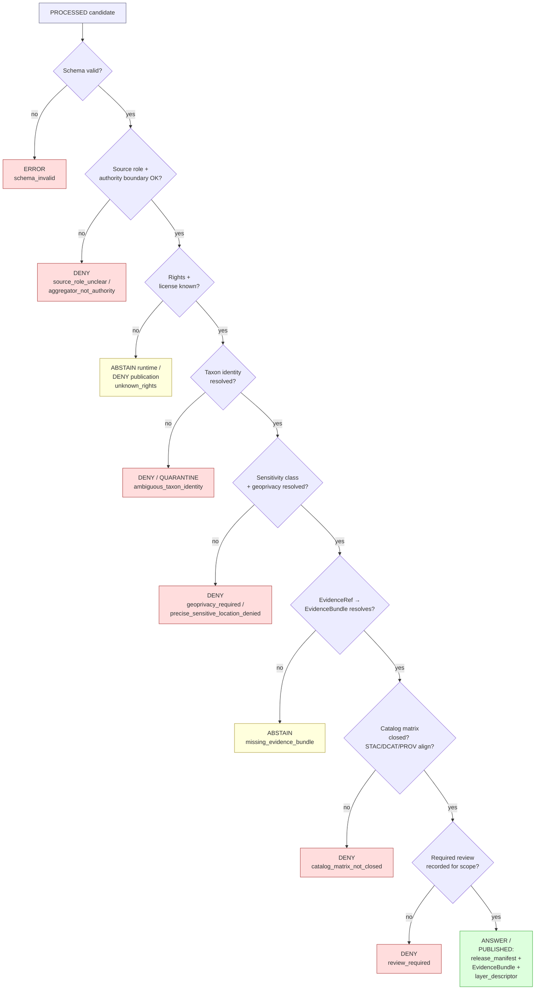

<!-- [KFM_META_BLOCK_V2]
doc_id: kfm://doc/flora-publication-and-policy
title: Flora Publication & Policy
type: standard
version: v0.1
status: draft
owners: flora steward (TBD), policy/sensitivity reviewer (TBD), release manager (TBD)
created: 2026-05-08
updated: 2026-05-08
policy_label: public
related:
  - docs/domains/flora/README.md
  - docs/domains/flora/PIPELINES_AND_LIFECYCLE.md
  - docs/domains/flora/SOURCE_REGISTRY.md
  - docs/domains/flora/UI_AND_EVIDENCE_DRAWER.md
  - docs/domains/flora/VERIFICATION_BACKLOG.md
  - docs/adr/ADR-flora-sensitive-location-policy.md
  - docs/adr/ADR-flora-public-layer-strategy.md
  - docs/adr/ADR-flora-source-roles.md
  - data/registry/flora/sensitivity_policies.yaml
  - data/registry/flora/rights_profiles.yaml
  - data/registry/flora/layer_registry.yaml
  - policy/flora/publish.rego
  - policy/flora/sensitivity.rego
  - policy/flora/rights.rego
  - policy/flora/ai.rego
  - policy/flora/promotion.rego
  - policy/flora/review.rego
tags: [kfm, flora, publication, policy, sensitivity, rights, governance]
notes:
  - This document is doctrinal/PROPOSED until the repo is mounted and inspected.
  - File path differs from the blueprint's canonical placement; see "Path Notice" below.
[/KFM_META_BLOCK_V2] -->

# Flora Publication & Policy

> Rights, sensitivity, and public-safe publication rules for the Kansas Frontier Matrix
> **Flora** lane. This is the human-readable companion to the machine policy bundle under
> `policy/flora/` and the registries under `data/registry/flora/`.

<!-- Badges are placeholders. Verify owning workflow names, branch targets, and label
     conventions when the repo is mounted. -->


<!-- TODO: replace with real CI / policy-test / docs-review badges once workflow names are confirmed -->

**Owners:** flora steward · policy / sensitivity reviewer · release manager
*(Placeholders — confirm via `CODEOWNERS` once the repo is mounted.)*

**Quick jumps:**
[Path Notice](#path-notice) ·
[Scope](#scope) ·
[Repo Fit](#repo-fit) ·
[Inputs](#accepted-inputs) ·
[Exclusions](#exclusions) ·
[Doctrine](#doctrine-summary) ·
[Sensitivity Classes](#sensitivity-classes) ·
[Source Roles](#source-roles--publication-eligibility) ·
[Publication Gate](#publication-gate) ·
[Geometry Rules](#geometry-rules-exact--generalized--withheld) ·
[Deny Reason Codes](#deny--quarantine-reason-codes) ·
[Finite Outcomes](#finite-runtime-outcomes) ·
[Rights & Licensing](#rights--licensing) ·
[Review · Correction · Rollback](#review-correction-rollback) ·
[Related Files](#related-machine-readable-files) ·
[Validation & Gates](#validation--gates) ·
[Open Verification](#open-verification-items) ·
[Glossary](#glossary)

---

## Path Notice

> [!CAUTION]
> **Path divergence — NEEDS VERIFICATION.**
> The Flora Architecture Blueprint places this document at
> `docs/domains/flora/PUBLICATION_AND_POLICY.md` (flat, directly under the flora lane).
> This file is currently authored at
> `docs/domains/flora/governance/PUBLICATION_AND_POLICY.md`.
>
> Under [Directory Rules](../../../../Directory_Rules.pdf) the flora lane has not yet
> opened a `governance/` sub-home. Either:
> 1. Move this file back to `docs/domains/flora/PUBLICATION_AND_POLICY.md`, **or**
> 2. Land an ADR (e.g. `docs/adr/ADR-flora-doc-subfolders.md`) that authorizes
>    `docs/domains/flora/governance/` as a documented sub-lane and lists the docs
>    that move there.
>
> Until reconciled, treat this path as **PROPOSED**.

[Back to top](#flora-publication--policy)

---

## Scope

This document governs **what may be published from the Flora lane, in what shape, and
under what evidentiary, rights, and sensitivity conditions**.

It is the human-readable contract that:

- Defines the **publication posture** for plant taxa, specimens, occurrences, vegetation
  communities, rare and protected plants, invasive plants, phenology, and range
  artifacts.
- Sets the **default sensitivity stance** (fail-closed for rare / protected / culturally
  sensitive flora).
- Names the **finite runtime outcomes** the governed API and AI/Focus surfaces are
  permitted to emit (`ANSWER`, `ABSTAIN`, `DENY`, `ERROR`).
- Lists the **deny / quarantine reason codes** that policy, validators, and CI must
  recognize.
- Describes how **review, correction, and rollback** preserve lineage rather than
  silently overwriting public outputs.

It is **not** a free-text policy. Every rule expressed here must be expressible — and
ultimately enforced — in machine policy under `policy/flora/` and registries under
`data/registry/flora/`. Where the human text and the machine policy diverge, the
machine policy is authoritative; this doc must be updated to match.

> Truth posture: **PROPOSED** until the repo is mounted and machine policy / fixtures
> are inspected. Doctrine is grounded in the Flora Architecture Blueprint, the Greenfield
> Building Plan, and Directory Rules; *implementation maturity is not yet established.*

[Back to top](#flora-publication--policy)

---

## Repo Fit

```text
docs/domains/flora/
├── README.md
├── PUBLICATION_AND_POLICY.md   ← canonical placement per blueprint
└── governance/                 ← PROPOSED sub-home (this file's location)
    └── PUBLICATION_AND_POLICY.md
```

**Upstream (this doc reads from):**

- Project doctrine — `docs/doctrine/` (truth-posture, trust-membrane, lifecycle-law,
  public-safety) — *PROPOSED, paths verified against Directory Rules.*
- Lane doctrine — `docs/domains/flora/{README,DATA_MODEL,PIPELINES_AND_LIFECYCLE,SOURCE_REGISTRY}.md`.
- ADRs — `docs/adr/ADR-flora-sensitive-location-policy.md`,
  `docs/adr/ADR-flora-public-layer-strategy.md`, `docs/adr/ADR-flora-source-roles.md`,
  `docs/adr/ADR-flora-schema-home.md`. *(All PROPOSED.)*

**Downstream (these read from this doc and the policy bundle):**

- `policy/flora/*.rego` — `publish`, `sensitivity`, `rights`, `taxon`, `catalog`, `ai`,
  `promotion`, `review`.
- `data/registry/flora/*.yaml` — `sensitivity_policies`, `rights_profiles`,
  `layer_registry`, `sources`, `source_roles`, `taxon_authorities`.
- `contracts/flora/*.schema.json` — release/runtime/decision/redaction/review schemas.
- Governed API runtime, MapLibre layer descriptors, Evidence Drawer payloads, Focus Mode.
- CI promotion gate, release dry-run, rollback rehearsal.

> All paths above are **PROPOSED** until the mounted repo confirms schema-home, policy
> root, and registry layout (see `ADR-flora-schema-home.md`).

[Back to top](#flora-publication--policy)

---

## Accepted Inputs

This document accepts and codifies rules that operate on the following object families
once they reach the **PROCESSED → CATALOG → PUBLISHED** edge of the lifecycle:

- `flora_taxon`, `flora_taxon_crosswalk`
- `flora_occurrence`, `flora_occurrence_batch`, `RarePlantRecord`, `SpecimenRecord`
- `flora_plant_community`, `flora_vegetation_class`, `flora_habitat_association`
- `flora_range_map`, `flora_phenology_condition_product`
- `flora_layer_descriptor`, `flora_focus_payload`, `flora_evidence_drawer_payload`
- `flora_runtime_response_envelope` / `flora_api_response`
- `flora_source_descriptor`, `flora_evidence_bundle`, `flora_decision_envelope`
- `flora_release_manifest`, `flora_catalog_matrix`, `flora_review_record`,
  `flora_promotion_candidate`, `flora_redaction_receipt`, `flora_run_receipt`

It also accepts **registry inputs** (sensitivity policies, rights profiles, layer
registry, source descriptors, source roles, taxon authorities) as the data-shaped
back-end of the rules expressed below.

[Back to top](#flora-publication--policy)

---

## Exclusions

The following do **not** belong in this document. Each has a clearer home elsewhere.

| Out of scope here | Belongs in |
|---|---|
| Schema field definitions, required-fields lists, JSON examples | `contracts/flora/*.schema.json` + `docs/domains/flora/DATA_MODEL.md` |
| Connector code, watcher schedules, retry/backoff logic | `connectors/flora/`, `pipeline_specs/domains/flora/`, `docs/domains/flora/PIPELINES_AND_LIFECYCLE.md` |
| Source endpoint URLs, credentials, controlled-access secrets | `data/registry/flora/sources.yaml` (descriptors only) + secret store; **never** in this doc |
| Exact sensitive coordinates or rare-plant locations | Internal/access-controlled stores only; **never** in any public-facing doc |
| MapLibre style JSON, render tuning, basemap choice | UI / map-shell docs + layer descriptors; style is not a truth source |
| AI prompts, model selection, runtime tuning | Governed AI docs + `policy/flora/ai.rego` |
| Cross-domain doctrine (lifecycle law, trust membrane) | `docs/doctrine/` |
| Per-PR change history | `docs/domains/flora/CHANGELOG.md` |

[Back to top](#flora-publication--policy)

---

## Doctrine Summary

Five invariants govern every flora publication:

1. **Lifecycle law.** `RAW → WORK / QUARANTINE → PROCESSED → CATALOG / TRIPLET → PUBLISHED`,
   with `REVIEW / CORRECTION / ROLLBACK` as explicit governance operations. **Promotion
   is a governed state transition, not a file move.**
2. **Trust membrane.** Public clients (map shell, Evidence Drawer, Focus Mode, exports,
   public APIs) read **only** from PUBLISHED artifacts and EvidenceBundles. They never
   read from `data/raw/`, `data/work/`, `data/quarantine/`, unpublished candidates, or
   canonical/internal stores.
3. **Cite-or-abstain.** Consequential answers require resolvable `EvidenceRef →
   EvidenceBundle`. If evidence is missing, the runtime returns `ABSTAIN`, not a guess.
4. **Fail-closed.** Missing rights, missing sensitivity classification, missing review,
   missing provenance, or unresolved precision **deny publication by default.**
5. **Derived stays derived.** Range maps, suitability surfaces, vegetation indices, and
   phenology products are *not* observed occurrences. They must be labeled and routed
   accordingly; presenting modeled output as observation fails closed.

> [!IMPORTANT]
> **Sensitive-location default = DENY.** Exact public geometry for rare, protected, or
> culturally sensitive plants is denied unless rights, policy, **and** review explicitly
> allow it, *and* a redaction / generalization receipt exists in the proof bundle.

[Back to top](#flora-publication--policy)

---

## Sensitivity Classes

Every flora object that may reach a public surface carries a sensitivity classification.
The class drives the geometry transform, layer eligibility, and runtime decision.

| Class | Examples | Default public posture | Required artifact when published |
|---|---|---|---|
| `public` | Common species occurrences with clear rights, public herbarium specimens, public vegetation classes | Allowed | EvidenceBundle, source descriptor, rights profile, layer descriptor |
| `public_generalized_only` | Species with elevated collection / poaching pressure; sources whose terms permit only generalized public release | Generalized geometry only | + `flora_redaction_receipt` recording precision bucket, method, input/output digests |
| `internal` | Records useful to stewards but not yet release-approved | Not exposed publicly | Internal access policy + audit log |
| `restricted` | NatureServe Pro–licensed data, herbarium controlled access, federally restricted records | Not exposed publicly | Controlled-access policy + steward review record |
| `controlled_access` | Steward-only stewardship review outputs, exact rare-plant points | Not exposed publicly | Steward review + access role + `redaction_receipt` for any derived public surface |
| `review_required` | Records that may be publishable after review (default while pending) | Not exposed publicly until reviewed | `flora_review_record` with scope and obligations |

> Class assignments live in `data/registry/flora/sensitivity_policies.yaml` (PROPOSED).
> Species-, status-, and source-specific overrides are expressed there, not here.

[Back to top](#flora-publication--policy)

---

## Source Roles & Publication Eligibility

Source roles are an **authority boundary**: a source is allowed to support certain claim
shapes and not others. Roles bind to fields on `flora_source_descriptor` and to the
`source_role` registry. Activation happens via a recorded `SourceActivationDecision`,
**not** by adding a connector.

| `source_role` | What it may support | Default public eligibility |
|---|---|---|
| `official` | Legal status, range/critical-habitat context, agency-published flora products | `public` if rights + sensitivity allow |
| `institutional` | Herbarium / specimen records with documented terms | `public` or `public_generalized_only` |
| `steward_reviewed` | Records that passed steward review with explicit scope | Per review record |
| `corroborative` | Aggregator records used to *support* a claim, never as sole authority | Subject to authority-boundary check |
| `community_observation` | iNaturalist-derived and similar; license + quality-grade gated | `public` only when license + grade + sensitivity all clear |
| `controlled_access` | Licensed or steward-restricted data (e.g., NatureServe Pro) | **DENY** by default; release requires explicit policy |
| `derived_model` | Range maps, suitability surfaces, vegetation indices, phenology | Always carries model lineage; never presented as observation |
| `generalized_public_surface` | Already-redacted public-safe layer derived from sensitive inputs | `public` if redaction receipt present and rights allow |

> Aggregators (e.g., GBIF, iNaturalist) are **not legal-status authorities**. Status
> claims must trace to an `official` descriptor. The validator
> `aggregator-not-authority` enforces this; a violation → `DENY`.

[Back to top](#flora-publication--policy)

---

## Publication Gate

The publication gate is the choke point between PROCESSED candidates and PUBLISHED
artifacts. Every PROPOSED check below must produce a deterministic `DecisionEnvelope`
outcome with reason codes; missing evidence fails closed.



> Diagram is **PROPOSED** doctrine. Real gate ordering is determined by
> `policy/flora/promotion.rego`, the validators under `tools/validators/flora/`, and CI
> orchestration; this diagram should be re-checked against those once mounted.

[Back to top](#flora-publication--policy)

---

## Geometry Rules: Exact / Generalized / Withheld

Geometry is the highest-risk surface in the flora lane. The internal/public split is
non-negotiable.

| Geometry mode | When used | Required artifact |
|---|---|---|
| **Exact (internal-only)** | Stored only in access-controlled internal stores; never in public payloads | Internal access policy + audit |
| **Generalized public** | Default for sensitive-but-publishable records, and for any record whose terms permit only generalized release | `flora_redaction_receipt` with `method`, `precision_bucket`, `grid_or_region`, `input_digest`, `output_digest`, `reason_code` |
| **Withheld / obscured** | Used when no safe public geometry is achievable but the record itself is publishable as a non-spatial fact | Receipt records the withholding decision and the reviewing actor (where allowed) |
| **Denied** | Used when neither rights, sensitivity, nor review permit any public emission | `DecisionEnvelope { outcome: DENY, reason_codes: [...] }`; no public artifact emitted |

> [!WARNING]
> Public payloads must **never** carry: exact rare-plant coordinates, restricted source
> IDs, internal `EvidenceRef`s pointing to RAW/WORK/QUARANTINE, or attributes that
> reverse a generalization (e.g., land-owner names, plot codes, precise dates that
> co-locate to a parcel). Reason code: `public_payload_exposes_internal_ref` →
> immediate `DENY`.

[Back to top](#flora-publication--policy)

---

## Deny / Quarantine Reason Codes

The codes below are the **named outcomes** the publication gate, runtime, AI surface,
and CI policy tests must recognize. They are stable identifiers — change them only via
ADR + migration note.

| Reason code | Trigger | Outcome |
|---|---|---|
| `unknown_rights` | License/terms not recorded on source descriptor | `ABSTAIN` runtime · `DENY` publication |
| `missing_rights` | Required rights field absent for publication-eligible release | `DENY` |
| `missing_source_id` | Claim lacks resolvable source descriptor reference | `DENY` |
| `missing_evidence_bundle` | `EvidenceRef` cannot be resolved to an `EvidenceBundle` | `ABSTAIN` runtime · `DENY` consequential publication |
| `precise_sensitive_location_denied` | Public geometry for sensitive taxon/location not generalized | `DENY` |
| `geoprivacy_required` | Sensitivity class requires generalization but no redaction receipt present | `DENY` |
| `public_geometry_not_generalized` | Public payload carries higher precision than policy permits | `DENY` |
| `invalid_geometry` | GeoJSON/CRS/bbox/ring validation failed | `QUARANTINE` or `DENY` |
| `public_payload_exposes_internal_ref` | Public payload references RAW/WORK/QUARANTINE or restricted IDs | `DENY` |
| `ambiguous_taxon_identity` | Accepted-taxon identity required but unresolved | `DENY` or `QUARANTINE` |
| `accepted_taxon_required` | Claim requires accepted taxon but only raw text present | `DENY` |
| `model_as_observation` | Modeled output presented as observed truth | `DENY` |
| `knowledge_character_mismatch` | Source role does not support the claim shape | `DENY` |
| `aggregator_not_authority` | Aggregator used as legal-status authority | `DENY` |
| `review_required` | Promotion requires review record, none for scope | `DENY` |
| `steward_review_missing` | Steward review explicitly required, not present | `DENY` |
| `controlled_access_publication_denied` | Controlled-access source attempted to reach public path | `DENY` |
| `ai_missing_evidence_bundle_or_citations` | AI/Focus answer not bound to released EvidenceBundle | `DENY` |
| `catalog_matrix_not_closed` | STAC/DCAT/PROV/manifest/proof refs do not close | `DENY` |
| `proof_bundle_incomplete` | Required proof artifact missing for release level | `DENY` |

> The canonical reason-code list lives in `policy/flora/` and the registry; this table
> is a human reference. Discrepancies → fix the rego/registry first, then this table.

[Back to top](#flora-publication--policy)

---

## Finite Runtime Outcomes

Every governed-API and AI/Focus response carries one of exactly four outcomes. There is
no fifth outcome; there is no "soft fail."

| Outcome | When to emit | Required envelope content |
|---|---|---|
| `ANSWER` | Evidence resolves, rights clear, sensitivity satisfied, review state matches scope | `evidence_refs[]`, `policy_decision`, `freshness`, `provenance`, `audit_ref` |
| `ABSTAIN` | Claim is plausible but evidence is insufficient or rights unknown | `obligations[]` (what would unblock), `verification_backlog_ref`, `audit_ref` |
| `DENY` | Policy forbids the disclosure (rights, sensitivity, review, or boundary) | `reason_codes[]` (from table above), safe explanation, no restricted detail in message, `audit_ref` |
| `ERROR` | System fault: schema parse failure, corrupt manifest, resolver exception | `audit_ref`, no fabricated content, no partial answer |

> AI/Focus must **never** invent species presence, distribution, conservation status, or
> sensitive locations. A free-text generation that lacks bound citations → `DENY` with
> `ai_missing_evidence_bundle_or_citations`.

[Back to top](#flora-publication--policy)

---

## Rights & Licensing

Rights are a publication-eligibility input, not a UI cosmetic. They live on the source
descriptor and on reusable rights profiles in `data/registry/flora/rights_profiles.yaml`.

Required fields on every flora source before activation:

- `license_id` (or explicit "no public license" marker)
- `terms_url` or written terms reference
- `attribution_required` (boolean) and the attribution string when true
- `redistribution_class` — `public_ok` · `public_generalized_only` · `controlled_only` · `deny` · `unknown`
- `obligations[]` — share-alike, non-commercial, attribution placement, etc.

Posture:

- `unknown` → `ABSTAIN` for runtime, `DENY` for new publication.
- `controlled_only` → never reach a public path; live in internal/restricted stores.
- `public_generalized_only` → public emission requires a redaction/generalization
  receipt.
- `public_ok` → publishable subject to all other gates (sensitivity, review, evidence,
  catalog closure).

External-source terms changes are a rollback trigger: disable the watcher, mark the
source `controlled` or `unknown`, and `ABSTAIN` / `DENY` affected runtime claims pending
review.

[Back to top](#flora-publication--policy)

---

## Review · Correction · Rollback

Governance transitions are first-class artifacts. They preserve lineage; they do not
overwrite history.

**Review.** Promotion to PUBLISHED requires a `flora_review_record` whose scope matches
the candidate. Reviewer roles (per the KFM separation-of-duties posture) include flora
steward, contract/schema reviewer, source steward, policy / sensitivity reviewer,
release manager, and UI trust reviewer. Generation, approval, publication, and
correction must not collapse into a single unreviewed path.

**Correction.** A public claim found to be wrong, harmful, or misleading triggers a
`correction_notice` linked to the affected `EvidenceBundle` and `release_manifest`. A
superseding bundle is published; the prior bundle is **marked superseded, not deleted**.
The Evidence Drawer surfaces the correction state to users.

**Rollback.** A signed `rollback_card` moves the public alias
(`data/published/flora/current/release_alias.json`) to the prior `spec_hash`. Immutable
release directories are preserved. Rollback rehearsal is part of CI; an unrehearsed
release is not release-ready.

| Trigger | Action | Evidence kept |
|---|---|---|
| Public layer leaks sensitivity | Disable layer registry entry + public alias; emit correction + rollback | Quarantine artifact, redaction receipt, decision envelope |
| Schema regression after release | Pin prior schema version; new schema goes draft-only if already in receipts | Versioned schema, rollback card |
| Source terms change | Disable watcher; mark source `controlled`/`unknown`; ABSTAIN affected claims | Source state hash, run receipts before/after |
| Validator/policy tightened or relaxed | Disable workflow invocation first; patch rego with allow/deny fixture proving expected behavior | Policy fixture, CI summary |
| Published artifact superseded | New release manifest; preserve old proof, catalog, receipts, lineage | Supersession link |

[Back to top](#flora-publication--policy)

---

## Related Machine-Readable Files

The rules above are enforced by these machine artifacts. *All paths and statuses below
are PROPOSED and need verification once the repo is mounted.*

| Path | Role | Status |
|---|---|---|
| `policy/flora/publish.rego` | Publication allow/deny rules | PROPOSED · P0 |
| `policy/flora/sensitivity.rego` | Sensitive geometry / rare-flora rules | PROPOSED · P0 |
| `policy/flora/rights.rego` | Rights / license / controlled-access rules | PROPOSED · P0 |
| `policy/flora/taxon.rego` | Accepted taxon and ambiguity rules | PROPOSED · P0 |
| `policy/flora/catalog.rego` | Catalog / proof closure rules | PROPOSED · P0 |
| `policy/flora/ai.rego` | AI / Focus citation + restricted-disclosure rules | PROPOSED · P0 |
| `policy/flora/promotion.rego` | Promotion candidate decision rules | PROPOSED · P0 |
| `policy/flora/review.rego` | Steward review requirements | PROPOSED · P0 |
| `data/registry/flora/sensitivity_policies.yaml` | Rare/protected/cultural sensitivity rules | PROPOSED · P0 |
| `data/registry/flora/rights_profiles.yaml` | Reusable license/terms/eligibility profiles | PROPOSED · P0 |
| `data/registry/flora/layer_registry.yaml` | Map layer IDs, public eligibility, evidence routes | PROPOSED · P0 |
| `data/registry/flora/source_roles.yaml` | Allowed source roles and definitions | PROPOSED · P0 |
| `contracts/flora/flora_release_manifest.schema.json` | Release artifact list, digests, decisions, rollback target | PROPOSED · P0 |
| `contracts/flora/flora_decision_envelope.schema.json` | Finite ANSWER/ABSTAIN/DENY/ERROR envelope | PROPOSED · P0 |
| `contracts/flora/flora_evidence_bundle.schema.json` | Runtime-resolvable evidence bundle | PROPOSED · P0 |
| `contracts/flora/flora_redaction_receipt.schema.json` | Geoprivacy / generalization / withholding receipt | PROPOSED · P0 |
| `contracts/flora/flora_review_record.schema.json` | Steward review, decision, scope, obligations | PROPOSED · P1 |
| `contracts/flora/flora_promotion_candidate.schema.json` | Promotion candidate input | PROPOSED · P0 |
| `tools/validators/flora/validate_release_bundle.py` | Promotion / release readiness | PROPOSED · P0 |
| `tools/validators/flora/validate_runtime_envelope.py` | Governed API + drawer envelope shape | PROPOSED · P0 |

> Where shared governance objects exist (`SourceDescriptor`, `EvidenceBundle`,
> `DecisionEnvelope`, `ReleaseManifest`, `CatalogMatrix`, `RedactionReceipt`,
> `ReviewRecord`), **reuse them**. Do not fork shared schemas without an ADR.

[Back to top](#flora-publication--policy)

---

## Validation & Gates

Definition of done for a flora publication PR (apply only the items relevant to the
PR's scope):

- [ ] All affected schemas validate; valid + invalid fixtures present.
- [ ] `policy/flora/*.rego` has fail-closed tests for every new reason code touched.
- [ ] CI runs the no-live-network fixture path; no real connector required.
- [ ] Source descriptor recorded in `data/registry/flora/sources.yaml` with
      `verification_status`, `rights`, `sensitivity_posture`, `authority_boundary`.
- [ ] Sensitivity class assigned; if `public_generalized_only` or below, redaction
      receipt is part of the proof bundle.
- [ ] EvidenceBundle resolves from EvidenceRefs in the runtime envelope fixture.
- [ ] Catalog matrix closes (STAC + DCAT + PROV + manifest + proof + runtime).
- [ ] Review record exists and matches release scope.
- [ ] DecisionEnvelope fixtures cover ANSWER, ABSTAIN, DENY, ERROR for the change.
- [ ] Layer descriptor (if a public layer) includes source role, freshness, policy,
      review, rights, evidence route.
- [ ] Rollback card written; rollback rehearsal recorded if release-grade.
- [ ] `docs/domains/flora/CHANGELOG.md` updated with rationale.
- [ ] No exact sensitive coordinates appear anywhere in PR diffs, fixtures, or docs.

[Back to top](#flora-publication--policy)

---

## Open Verification Items

These remain **NEEDS VERIFICATION / UNKNOWN** until the repo is mounted and inspected.
They are tracked in `docs/domains/flora/VERIFICATION_BACKLOG.md`.

| Item | State | How to verify |
|---|---|---|
| Schema home (`contracts/` vs `schemas/contracts/v1/`) | CONFLICTED | Land `ADR-flora-schema-home.md` after repo inspection |
| OPA / Conftest version + CI invocation | UNKNOWN | Inspect `.github/workflows/` and `policy/` |
| Existing shared `EvidenceBundle` / `DecisionEnvelope` / `ReleaseManifest` | UNKNOWN | Search `contracts/`, `schemas/contracts/v1/` for shared schemas |
| Rare-plant stewardship policy details | NEEDS VERIFICATION | Identify steward of record; capture review process and exact/public thresholds in `ADR-flora-sensitive-location-policy.md` |
| Source endpoints, rights, cadence | NEEDS VERIFICATION | Per-source probe with headers, terms capture, checksums |
| Branch protections + required checks | UNKNOWN | Inspect repository settings (cannot be inferred from files alone) |
| `CODEOWNERS` for the flora lane | UNKNOWN | Add and confirm with maintainers |
| Path of this doc (`flora/` vs `flora/governance/`) | NEEDS VERIFICATION | See **Path Notice** above; reconcile via move or ADR |

[Back to top](#flora-publication--policy)

---

## Glossary

<details>
<summary><b>Terms used in this document</b> (click to expand)</summary>

- **EvidenceRef / EvidenceBundle** — Pointer (`Ref`) and resolved package (`Bundle`) of
  evidence supporting a claim. Public answers cite EvidenceRefs that resolve cleanly.
- **DecisionEnvelope** — Wrapper carrying a finite outcome (`ANSWER` / `ABSTAIN` /
  `DENY` / `ERROR`), reason codes, obligations, and audit reference.
- **ReleaseManifest** — Inventory of published artifacts for a release, with digests,
  catalog references, policy decisions, and rollback target.
- **CatalogMatrix** — Closure check across STAC, DCAT, PROV, manifest, proof, and
  runtime payloads. "Open" matrix = `DENY` promotion.
- **RedactionReceipt** — Proof of a geometry transform: method, precision bucket,
  grid/region, input/output digests, reason code, actor (where allowed).
- **ReviewRecord** — Recorded steward/policy review with scope, decision, actor, date,
  obligations.
- **RollbackCard** — Signed instruction to move a public alias to a prior `spec_hash`
  while preserving immutable artifacts.
- **`spec_hash` vs `content_hash`** — `spec_hash` identifies schema/spec/process
  identity; `content_hash` identifies bytes. Distinct on purpose.
- **Source role** — Authority boundary attached to a source: what claim shapes that
  source is allowed to support.
- **Trust membrane** — The boundary public clients read across; they read PUBLISHED
  artifacts only, never RAW / WORK / QUARANTINE / canonical.
- **Cite-or-abstain** — Default truth posture: if you cannot cite, you abstain.

</details>

[Back to top](#flora-publication--policy)

---

<sub>Last updated 2026-05-08 · Status **draft / PROPOSED** · Doctrine source: Flora
Architecture Blueprint, Greenfield Building Plan, Directory Rules, KFM Encyclopedia ·
Implementation maturity not yet established (mounted-repo verification pending).</sub>
