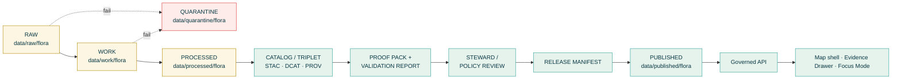

<!-- [KFM_META_BLOCK_V2]
doc_id: kfm://doc/flora-governance-readme
title: Flora Governance — Domain Lane Entrypoint
type: standard
version: v0.1
status: draft
owners: <flora-steward> (PLACEHOLDER — confirm against CODEOWNERS)
created: 2026-05-08
updated: 2026-05-08
policy_label: public
related:
  - ../README.md
  - ../PUBLICATION_AND_POLICY.md
  - ../ARCHITECTURE.md
  - ../adr/ADR-flora-schema-home.md
  - ../adr/ADR-flora-source-roles.md
  - ../adr/ADR-flora-sensitive-location-policy.md
  - ../adr/ADR-flora-public-layer-strategy.md
  - ../runbooks/flora-promotion.md
  - ../runbooks/flora-rollback.md
  - ../../../governance/README.md
  - ../../../doctrine/lifecycle-law.md
  - ../../../doctrine/trust-membrane.md
tags: [kfm, flora, governance, domain-lane, policy, sensitivity, publication]
notes:
  - "PROPOSED grouping: governance/ subdirectory under docs/domains/flora/ is not in the Flora Architecture Blueprint's directory tree; the blueprint places PUBLICATION_AND_POLICY.md, ADRs, and runbooks at the flora-domain root."
  - "All repo-state claims are PROPOSED or NEEDS VERIFICATION until the repository is inspected."
[/KFM_META_BLOCK_V2] -->

# Flora Governance

> Domain-scoped governance entrypoint for the **KFM Flora lane** — where rights, sensitivity, source-role authority, publication eligibility, review state, and rollback discipline are documented for everything that ingests, normalizes, validates, catalogs, publishes, or explains flora information.

<!-- Status / impact block -->
[](#status)
[](../README.md)
[](#3-sensitivity-and-public-safety)
[](#2-lifecycle-and-promotion-gates)
[](../../../doctrine/truth-posture.md)
<!-- TODO: replace with real CI/validation/license badges once .github/workflows/flora-* and CODEOWNERS are confirmed in the repo -->

> [!IMPORTANT]
> **Authority bounds.** This README *describes* and *indexes* governance for the Flora lane. It is **not** a policy authority. Machine-enforceable rules live in `policy/flora/*.rego`, registries live under `data/registry/flora/`, schemas live under `contracts/flora/` or `schemas/contracts/v1/flora/` (resolution pending [ADR-flora-schema-home](../adr/ADR-flora-schema-home.md)), and decisions live in ADRs. If this README and any of those sources disagree, the machine-enforceable source wins.

> [!NOTE]
> **PROPOSED location.** The path `docs/domains/flora/governance/` is **PROPOSED**. The Flora Architecture Blueprint places governance-relevant files (`PUBLICATION_AND_POLICY.md`, ADRs, runbooks) at the flora-domain root (`docs/domains/flora/`), not inside a `governance/` subdirectory. Adopting this grouping should be settled by an ADR (see [§7. Open Questions](#7-open-questions-and-needs-verification)).

---

## Quick jump

- [1. Scope](#1-scope)
- [2. Lifecycle and Promotion Gates](#2-lifecycle-and-promotion-gates)
- [3. Sensitivity and Public Safety](#3-sensitivity-and-public-safety)
- [4. Source-Role Discipline](#4-source-role-discipline)
- [5. Repo Fit, Inputs, and Exclusions](#5-repo-fit-inputs-and-exclusions)
- [6. Directory Tree (PROPOSED)](#6-directory-tree-proposed)
- [7. Open Questions and NEEDS VERIFICATION](#7-open-questions-and-needs-verification)
- [8. Definition of Done](#8-definition-of-done)
- [9. FAQ](#9-faq)
- [10. References](#10-references)

---

## 1. Scope

The Flora lane is a **governed, evidence-first, map-first, time-aware** domain lane. Its public outputs must be reconstructable to source descriptors, EvidenceRefs, EvidenceBundles, policy decisions, review records, catalog records, and correction lineage. The public surface is **never** the truth source: a generalized public polygon is not an internal sensitive occurrence point; a model output is not an observation; a range map is not a specimen; an AI answer is not source evidence.

This governance entrypoint covers, for the Flora lane specifically:

- **Authority boundaries.** Which sources are allowed to support which kinds of claims, under what license/sensitivity/role.
- **Lifecycle discipline.** RAW → WORK/QUARANTINE → PROCESSED → CATALOG/TRIPLET → PUBLISHED, with promotion as a *governed state transition*, not a file move.
- **Publication policy.** Rights, sensitivity, public-safe geometry, generalization receipts, and deny-by-default behavior for rare/protected/culturally sensitive flora.
- **Review state.** Steward review requirements, review records, two-key approval where maturity requires it.
- **AI / Focus discipline.** Cite-or-abstain enforcement on Focus-mode answers; finite `ANSWER` / `ABSTAIN` / `DENY` / `ERROR` outcomes.
- **Correction and rollback.** Visible, auditable supersession; rollback target preserved on every release.

It does **not** redefine doctrine. It localizes shared KFM doctrine — authority ladder, lifecycle law, trust membrane, cite-or-abstain — to the practical realities of flora data (rare-species coordinates, license-encumbered occurrence sources, ambiguous taxonomy, regulatory status drift).

[Back to top](#flora-governance)

---

## 2. Lifecycle and Promotion Gates

Promotion is **fail-closed**. An object cannot reach `data/published/flora/` without explicit gates evaluating explicit inputs and emitting auditable decisions. The shared **Promotion Gate matrix (A–G)** applies to flora; this section names how each gate manifests in the Flora lane.



> [!CAUTION]
> **No public reads from internal stages.** Public clients, public APIs, exports, AI/Focus, tile services, and search must not read directly from `data/raw/flora`, `data/work/flora`, `data/quarantine/flora`, unpublished candidates, canonical internal stores, model runtime outputs, or source-system side effects.

### Promotion gate manifestation (Flora-specific notes)

| Gate | Shared intent (KFM) | Flora-specific check (PROPOSED) | Primary policy file (PROPOSED) |
| :--- | :--- | :--- | :--- |
| **A · Schema valid** | Contract conformance, no unknown enums | `flora_taxon`, `flora_occurrence`, `flora_evidence_bundle`, `flora_layer_descriptor` validate against the Flora schema set | `policy/flora/publish.rego` |
| **B · License compliant** | SPDX or allowlist; required attribution | Per-source license map; community-observation licenses (e.g., iNaturalist-style CC variants); herbarium/institutional terms | `policy/flora/rights.rego` |
| **C · Provenance complete** | EvidenceBundle, run receipts resolve | Source-role and authority-boundary fields present; supersession/rollback well-formed | `policy/flora/publish.rego` |
| **D · Spatial integrity** | Geometry valid, EPSG sane | Coordinate uncertainty preserved; **public geometry generalized** for sensitive flora (no exact rare-species locations) | `policy/flora/sensitivity.rego` |
| **E · Temporal consistency** | `source_time` / `observed_time` / `published_time` consistent | Phenology windows, season tags, source-as-of dates carried into PROCESSED records | `policy/flora/publish.rego` |
| **F · Dedupe / identity** | Cross-source primary keys, deterministic tie-break | Stable `taxon_id`, `occurrence_id`; institutional accession preserved; deterministic fallback hashes for community observations | `policy/flora/taxon.rego` |
| **G · Drawer renders** | Source role · rights · attribution · spec_hash · `evidence_bundle` link · sensitivity badge | Flora Evidence Drawer payload validates; AI/Focus DENY for any uncited flora answer | `policy/flora/ai.rego` |

### Reason codes (deny / quarantine — non-exhaustive)

| Reason code | When it fires | Outcome |
| :--- | :--- | :--- |
| `precise_sensitive_location_denied` | Public payload would expose exact rare-species coordinates | DENY publication; require redaction/generalization receipt |
| `geoprivacy_required` | Sensitivity registry says generalize before publish | DENY raw geometry; require receipt |
| `unknown_rights` / `missing_rights` | Source descriptor has no resolved license/terms | ABSTAIN at runtime; DENY at promotion |
| `controlled_access_publication_denied` | Source role is `controlled_access` and request is public | DENY |
| `public_payload_exposes_internal_ref` | Outward payload references a RAW/WORK/QUARANTINE id | DENY |
| `ambiguous_taxon_identity` / `accepted_taxon_required` | Authority candidates conflict | DENY or QUARANTINE for steward review |
| `model_as_observation` / `knowledge_character_mismatch` | Modeled output presented as observed truth | DENY |
| `review_required` / `steward_review_missing` | Sensitivity or status policy requires steward sign-off | DENY |
| `ai_missing_evidence_bundle_or_citations` | Focus-mode answer lacks resolved EvidenceBundle | DENY |
| `catalog_matrix_not_closed` / `proof_bundle_incomplete` | STAC/DCAT/PROV closure missing | DENY |
| `invalid_geometry` / `public_geometry_not_generalized` | Geometry validity or generalization fails | DENY |

> All reason codes above are **PROPOSED** vocabulary derived from the Flora Architecture Blueprint and have not been verified against in-repo `policy/flora/*.rego` (no repo mounted in this session).

[Back to top](#flora-governance)

---

## 3. Sensitivity and Public Safety

> [!WARNING]
> **Default posture: deny exact public geometry for sensitive flora.** Rare, protected, or culturally significant taxa default to *generalized*, *withheld*, *delayed*, or *denied* public publication unless rights, sensitivity policy, and steward review explicitly allow exact disclosure.

Flora sensitivity is governed by three layers, each of which must be present and consistent before any related public release:

| Layer | Source | Role |
| :--- | :--- | :--- |
| **Sensitivity registry** | `data/registry/flora/sensitivity_policies.yaml` | Per-species / per-status / per-source rules; classifies what must be generalized, withheld, or denied |
| **Sensitive-location policy** | [`docs/domains/flora/adr/ADR-flora-sensitive-location-policy.md`](../adr/ADR-flora-sensitive-location-policy.md) | Defines exact-vs-public-safe geometry thresholds (precision bucket, grid size, region generalization) |
| **Sensitivity Rego** | `policy/flora/sensitivity.rego` | Machine enforcement; missing policy evidence **fails closed** |

### Required behaviors

- **Internal precise geometry** stays behind governed APIs and access policy. It does not enter public layer bundles.
- **Public payloads** carry only generalized / withheld / obscured geometry.
- **Generalization receipts** record method, precision bucket, grid/region, input digest, output digest, reviewer (where allowed), and reason code. Stored under `data/receipts/flora/redaction/`.
- **Withheld / obscured** items use `DENY` or `ABSTAIN` decision envelopes when public geometry cannot be made safe or rights are unresolved.
- **Public-safe MapLibre layers** carry only generalized public surfaces and public-safe attributes — no exact coordinates, no restricted source ids, no internal refs.

### What this README does **not** contain

It does not enumerate sensitive species, list precision buckets, or restate exact thresholds. Those live in the **sensitivity registry** and the **sensitive-location ADR**, and are subject to steward review.

[Back to top](#flora-governance)

---

## 4. Source-Role Discipline

Every flora source descriptor carries a **source role**. Role does not by itself decide truth — it defines *authority boundary*, *review burden*, and *publication eligibility*. The role travels into processed records, EvidenceBundles, API envelopes, Evidence Drawer payloads, and layer descriptors.

| Source role | Meaning | Default trust use | Publication default |
| :--- | :--- | :--- | :--- |
| `official` | Government / legally responsible source for status, regulation, or authoritative spatial layer | Anchors official status claims within authority boundary | Publish only after rights, sensitivity, and review resolve |
| `institutional` | Museum, herbarium, university, agency-managed collection | Strong evidence for specimen/collection facts; may carry license/precision constraints | Publish public-safe metadata; exact geometry depends on rights and sensitivity |
| `steward_reviewed` | Curated by responsible flora steward, heritage program, or qualified reviewer | Can lift quarantine or allow controlled internal use | Public only with explicit release decision |
| `corroborative` | Useful support but not controlling authority for legal/status claims | Can corroborate presence, name, or context; cannot override official | Usually aggregate / generalize; cite limitations |
| `community_observation` | iNaturalist-style observation or project dataset | Useful with quality labels, reviewer status, license checks | Publish only if license and sensitivity allow; avoid false precision |
| `controlled_access` | Source requiring terms, license, or steward approval | May inform internal review; cannot leak restricted attributes | Deny public exact publication unless authorization is explicit |
| `derived_model` | Model, index, interpolation, habitat suitability, generalized summary | Contextual / interpretive evidence only; not observation truth | Publish with model card, uncertainty, and evidence lineage |
| `generalized_public_surface` | Public-safe geometry / layer derived from internal details | Outward display layer after redaction / generalization | Publishable when transform lineage, sensitivity, and rights resolve |

The role vocabulary and authority boundaries are locked by [`ADR-flora-source-roles`](../adr/ADR-flora-source-roles.md) before any machine file (registry, validator, policy) may proliferate. **PROPOSED**.

[Back to top](#flora-governance)

---

## 5. Repo Fit, Inputs, and Exclusions

### Repo fit (PROPOSED)

This directory is the **human-facing governance index** for the Flora lane. It is part of the `docs/` control plane (per Directory Rules: `docs/` explains; control_plane / contracts / schemas / policy enforce).

**Upstream (this directory reads / depends on):**

- [`../README.md`](../README.md) — Flora lane orientation
- [`../ARCHITECTURE.md`](../ARCHITECTURE.md) — Flora architecture
- [`../../../doctrine/`](../../../doctrine/) — KFM authority ladder, lifecycle law, trust membrane, cite-or-abstain (paths PROPOSED per Directory Rules layout)
- [`../../../governance/`](../../../governance/) — Repo-wide governance docs (sibling of `docs/domains/`)

**Downstream (this directory motivates / indexes):**

- `policy/flora/*.rego` — `publish`, `sensitivity`, `rights`, `taxon`, `catalog`, `ai`, `promotion`, `review`
- `data/registry/flora/*.yaml` — `sources`, `source_roles`, `sensitivity_policies`, `taxon_authorities`, `layer_registry`, `rights_profiles`
- `contracts/flora/*.schema.json` **or** `schemas/contracts/v1/flora/*.schema.json` (home pending [`ADR-flora-schema-home`](../adr/ADR-flora-schema-home.md))
- `tools/validators/flora/*` — fail-closed CI checks
- `tests/flora/*` and `tests/fixtures/flora/{valid,invalid,promotion,policy,api,ui}/`
- `release/manifests/flora/`, `release/proof_packs/flora/`, `release/corrections/flora/`, `release/rollback/flora/`
- `apps/governed_api/openapi/flora.v1.yaml` (or repo-equivalent)

### Inputs (what belongs here)

- Governance-oriented narrative docs and indexes for the Flora lane (publication policy, sensitivity discipline, source-role discipline, review/promotion/rollback narratives).
- ADR pointers and summaries for governance-significant Flora decisions.
- Tables / checklists / FAQs that orient maintainers, reviewers, and downstream consumers.
- Cross-references to the machine-enforceable artifacts that actually carry the rules.

### Exclusions (what does **not** belong here)

| Excluded content | Correct home |
| :--- | :--- |
| Machine policy (Rego) | `policy/flora/` |
| Machine schemas (JSON Schema) | `contracts/flora/` or `schemas/contracts/v1/flora/` (per ADR) |
| Source registry data (YAML) | `data/registry/flora/` |
| Validators / scripts | `tools/validators/flora/`, `tools/diff/flora/`, `tools/ci/` |
| Operational runbooks (ingest, promote, rollback) | `../runbooks/` |
| Architecture decisions (full ADR text) | `../adr/` |
| Verification queue, idea parking lot | `../VERIFICATION_BACKLOG.md`, `../IDEA_INTAKE.md` |
| Public-facing Evidence Drawer / Focus payload contracts | `../UI_AND_EVIDENCE_DRAWER.md` |
| Pipelines, lifecycle code | `pipelines/flora/`, `../PIPELINES_AND_LIFECYCLE.md` |
| Exact sensitive-species coordinates, restricted attribution, credentials | **Never** in `docs/`. Internal stores only, behind governed access. |
| Release manifests / proof packs / rollback cards | `release/` (manifests, proof packs, corrections, rollback) |

> [!TIP]
> If unsure where a new file belongs, consult **Directory Rules** *before* creating a path. Pick by **responsibility root**, not topic name. Domain files belong under the proper responsibility root, not in a new root-level domain folder.

[Back to top](#flora-governance)

---

## 6. Directory Tree (PROPOSED)

The blueprint's canonical Flora layout places `PUBLICATION_AND_POLICY.md`, ADRs, and runbooks at `docs/domains/flora/` directly. The tree below shows **two** plausible organizations of this `governance/` subdirectory; **the choice between them is unresolved** and should be settled by an ADR (see [§7](#7-open-questions-and-needs-verification)).

### Option A — Index-only (lowest disruption)

`governance/` is a thin index. Authoritative files stay where the blueprint puts them, and this README cross-links them.

```text
docs/domains/flora/
├── README.md
├── ARCHITECTURE.md
├── PUBLICATION_AND_POLICY.md          # <- stays at flora root (blueprint canonical)
├── ...                                # other flora root docs (DATA_MODEL, ROADMAP, etc.)
├── adr/                               # <- stays at flora root (blueprint canonical)
│   ├── ADR-flora-schema-home.md
│   ├── ADR-flora-source-roles.md
│   ├── ADR-flora-sensitive-location-policy.md
│   └── ADR-flora-public-layer-strategy.md
├── runbooks/                          # <- stays at flora root (blueprint canonical)
│   ├── flora-ingest.md
│   ├── flora-promotion.md
│   └── flora-rollback.md
└── governance/                        # <- new, index-only
    └── README.md                      # this file
```

### Option B — Grouped (organizational change, requires ADR + migration note)

Governance-related docs are gathered under `governance/`. Requires updating the blueprint, anchors, and any inbound links.

```text
docs/domains/flora/
├── README.md
├── ARCHITECTURE.md
├── ...
└── governance/
    ├── README.md                       # this file
    ├── PUBLICATION_AND_POLICY.md       # moved from flora root
    ├── REVIEW_AND_PROMOTION.md         # PROPOSED new doc (was implicit at flora root)
    ├── ROLLBACK_AND_CORRECTION.md      # PROPOSED new doc
    ├── adr/                            # moved from flora root
    │   ├── ADR-flora-schema-home.md
    │   ├── ADR-flora-source-roles.md
    │   ├── ADR-flora-sensitive-location-policy.md
    │   └── ADR-flora-public-layer-strategy.md
    └── runbooks/                       # moved from flora root
        ├── flora-ingest.md
        ├── flora-promotion.md
        └── flora-rollback.md
```

> [!NOTE]
> **Default recommendation: Option A.** It carries the least risk: no anchors break, no inbound links rot, no parallel governance home is created. The blueprint already places the relevant files; this README simply *points* at them.

[Back to top](#flora-governance)

---

## 7. Open Questions and NEEDS VERIFICATION

| # | Question | Status | Resolution path |
| :-- | :--- | :--- | :--- |
| 1 | Should `docs/domains/flora/governance/` exist as a separate subdirectory, or should governance docs stay at the flora-domain root? | **NEEDS VERIFICATION** | Repo inspection + ADR (e.g., `ADR-flora-docs-layout`) |
| 2 | Schema home: `contracts/flora/` vs. `schemas/contracts/v1/flora/`? | **PROPOSED → blocked on ADR** | [`ADR-flora-schema-home`](../adr/ADR-flora-schema-home.md) |
| 3 | Source-role vocabulary final list and authority boundaries | **PROPOSED** | [`ADR-flora-source-roles`](../adr/ADR-flora-source-roles.md) |
| 4 | Exact precision buckets / grid resolutions for public-safe sensitive geometry | **PROPOSED** | [`ADR-flora-sensitive-location-policy`](../adr/ADR-flora-sensitive-location-policy.md) |
| 5 | MapLibre public-layer strategy and generalization rules | **PROPOSED** | [`ADR-flora-public-layer-strategy`](../adr/ADR-flora-public-layer-strategy.md) |
| 6 | CODEOWNERS / steward identities for `policy/flora/`, `contracts/flora/`, `data/registry/flora/` | **UNKNOWN** | Repo inspection of `.github/CODEOWNERS` |
| 7 | CI workflow names enforcing flora gates (`.github/workflows/flora-ci.yml`, `flora-promotion.yml`) | **UNKNOWN** | Repo inspection |
| 8 | Whether shared governance objects (`SourceDescriptor`, `EvidenceBundle`, `DecisionEnvelope`, `ReleaseManifest`, `CatalogMatrix`, `ReviewRecord`, `RedactionReceipt`, `PromotionCandidate`) already exist in the repo or must be added | **UNKNOWN** | Repo inspection — reuse first; fork only with documented justification |
| 9 | Live source activation status (GBIF, USFWS ECOS, KDWP rare-species, herbarium aggregators) — rights, cadence, terms verified? | **UNKNOWN** | Per-source steward review; no live network in CI |
| 10 | Whether badges in this README's impact block correspond to real CI workflows | **UNKNOWN** | Replace placeholders once workflows confirmed |

[Back to top](#flora-governance)

---

## 8. Definition of Done

This README is "good enough to publish" when each item below is either ✅ resolved or 📌 explicitly deferred to a referenced backlog item.

- [ ] 📌 Layout choice (Option A vs. Option B) recorded in an ADR.
- [ ] 📌 Schema-home ADR resolved and reflected in cross-links.
- [ ] 📌 Source-role ADR resolved and the table in [§4](#4-source-role-discipline) reconciled with `data/registry/flora/source_roles.yaml`.
- [ ] 📌 Sensitive-location-policy ADR resolved; reason codes in [§2](#2-lifecycle-and-promotion-gates) confirmed against `policy/flora/sensitivity.rego`.
- [ ] 📌 Public-layer-strategy ADR resolved; generalization receipts schema and `data/registry/flora/layer_registry.yaml` exist.
- [ ] 📌 CODEOWNERS confirms a flora steward; impact block `owners` placeholder replaced.
- [ ] 📌 Badge URLs point at real CI workflows (`flora-ci`, `flora-promotion`, validate, sign).
- [ ] 📌 All `policy/flora/*.rego` files referenced in [§2](#2-lifecycle-and-promotion-gates) exist with positive + negative fixtures and Conftest tests.
- [ ] 📌 `data/registry/flora/*.yaml` listed in [§5](#5-repo-fit-inputs-and-exclusions) exist with validators in `tools/validators/flora/`.
- [ ] 📌 Inbound links from [`../README.md`](../README.md) and [`../../README.md`](../../README.md) point here.
- [ ] 📌 `VERIFICATION_BACKLOG.md` carries any item not yet resolved.

[Back to top](#flora-governance)

---

## 9. FAQ

<details>
<summary><strong>Why is this README labeled "PROPOSED" if KFM doctrine is already settled?</strong></summary>

KFM **doctrine** is settled (lifecycle law, trust membrane, cite-or-abstain, fail-closed publication) and is referenced confidently here. What is **PROPOSED** is anything tied to *current repo state*: paths, file presence, CI workflow names, owners, registry contents, schema homes. No repository was inspected in this session, so repo-shaped claims default to PROPOSED / NEEDS VERIFICATION until verified.

</details>

<details>
<summary><strong>Why don't you list the sensitive species or precision buckets?</strong></summary>

Two reasons. First, those values are governance-significant data, not narrative — they belong in `data/registry/flora/sensitivity_policies.yaml` and the `ADR-flora-sensitive-location-policy.md` decision, where they can be reviewed, versioned, and enforced. Second, surfacing rare-species sensitivity rules in a public-facing README increases public-risk exposure for no governance benefit. The README points; the registry decides.

</details>

<details>
<summary><strong>Where do I find the actual machine-enforceable rules?</strong></summary>

- **Schemas:** `contracts/flora/*.schema.json` or `schemas/contracts/v1/flora/*.schema.json` (resolution pending ADR)
- **Policies:** `policy/flora/*.rego` (`publish`, `sensitivity`, `rights`, `taxon`, `catalog`, `ai`, `promotion`, `review`)
- **Registries:** `data/registry/flora/*.yaml`
- **Validators:** `tools/validators/flora/*`
- **Fixtures:** `tests/fixtures/flora/{valid,invalid,promotion,policy,api,ui}/`
- **CI:** `.github/workflows/flora-ci.yml`, `.github/workflows/flora-promotion.yml`

All paths are PROPOSED until repo inspection confirms.

</details>

<details>
<summary><strong>How does Focus Mode / AI cite flora claims?</strong></summary>

Every Focus answer about flora must cite a *released* `EvidenceBundle`. If no bundle resolves, or if citation would expose a sensitive coordinate, the AI returns `ABSTAIN` (no support) or `DENY` (policy-blocked). It never paraphrases unsupported flora claims. Enforcement lives in `policy/flora/ai.rego`. See `../UI_AND_EVIDENCE_DRAWER.md` and the shared governed-AI doctrine.

</details>

<details>
<summary><strong>What rolls back if a published flora release is wrong?</strong></summary>

Promotion records a rollback target. A correction creates a `CorrectionNotice` and, if needed, a `RollbackCard`; the prior release manifest stays auditable. Receipts and proof packs are **preserved** even after rollback — process memory is never silently overwritten. See `../runbooks/flora-rollback.md`.

</details>

<details>
<summary><strong>Is the flat layout in the blueprint wrong, then?</strong></summary>

No. The blueprint's flat layout (`docs/domains/flora/PUBLICATION_AND_POLICY.md`, `docs/domains/flora/adr/`, `docs/domains/flora/runbooks/`) is the canonical PROPOSED tree. This README is requested by the user as an entrypoint; whether it stays index-only (Option A) or governance docs migrate under it (Option B) is a layout decision that should be settled by ADR before any file is moved. Anti-fragmentation principle: don't create a parallel governance home without justification.

</details>

[Back to top](#flora-governance)

---

## 10. References

### In-repo (PROPOSED — pending repo inspection)

- [`../README.md`](../README.md) — Flora lane README
- [`../ARCHITECTURE.md`](../ARCHITECTURE.md), [`../CURRENT_STATE.md`](../CURRENT_STATE.md), [`../DATA_MODEL.md`](../DATA_MODEL.md)
- [`../PUBLICATION_AND_POLICY.md`](../PUBLICATION_AND_POLICY.md) — Rights / sensitivity / public-safe publication rules
- [`../PIPELINES_AND_LIFECYCLE.md`](../PIPELINES_AND_LIFECYCLE.md), [`../UI_AND_EVIDENCE_DRAWER.md`](../UI_AND_EVIDENCE_DRAWER.md)
- [`../SOURCE_REGISTRY.md`](../SOURCE_REGISTRY.md), [`../GLOSSARY.md`](../GLOSSARY.md)
- [`../VERIFICATION_BACKLOG.md`](../VERIFICATION_BACKLOG.md), [`../IDEA_INTAKE.md`](../IDEA_INTAKE.md), [`../ROADMAP.md`](../ROADMAP.md), [`../FILE_MANIFEST.md`](../FILE_MANIFEST.md), [`../CHANGELOG.md`](../CHANGELOG.md)
- ADRs: [`../adr/ADR-flora-schema-home.md`](../adr/ADR-flora-schema-home.md), [`../adr/ADR-flora-source-roles.md`](../adr/ADR-flora-source-roles.md), [`../adr/ADR-flora-sensitive-location-policy.md`](../adr/ADR-flora-sensitive-location-policy.md), [`../adr/ADR-flora-public-layer-strategy.md`](../adr/ADR-flora-public-layer-strategy.md)
- Runbooks: [`../runbooks/flora-ingest.md`](../runbooks/flora-ingest.md), [`../runbooks/flora-promotion.md`](../runbooks/flora-promotion.md), [`../runbooks/flora-rollback.md`](../runbooks/flora-rollback.md)
- KFM-wide: [`../../README.md`](../../README.md), [`../../../doctrine/`](../../../doctrine/), [`../../../architecture/`](../../../architecture/), [`../../../governance/`](../../../governance/), [`../../../adr/`](../../../adr/)

### Project corpus (attached, this session)

- *KFM Flora Architecture — PDF-Only Implementation Blueprint* — primary baseline for this README
- *Directory Rules* — root-folder authority and the "domain files under responsibility roots" principle
- *Kansas Frontier Matrix Definitive Greenfield Building Plan* — lifecycle law, gate matrix, milestones
- *KFM Governed AI — Source Ledger Architecture Report* — shared governance vocabulary and AI envelope
- *KFM Components Pass 10 / Pass 11 Part 2 — Idea Index, Category Atlas, and Expansion Dossier* — README MetaBlock v2 doctrine, Promotion Gate A–G, governed AI integration
- *Kansas Frontier Matrix Pipeline Living Implementation Manual v0.3* — verification backlog template, ADR index template

[Back to top](#flora-governance)
