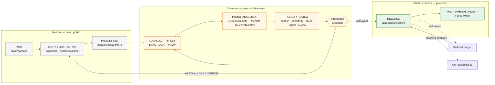

<!-- [KFM_META_BLOCK_V2]
doc_id: kfm://doc/REPLACE_WITH_UUID
title: Flora Lane — Review and Promotion
type: standard
version: v1
status: draft
owners: flora-steward (TODO confirm)
created: 2026-05-08
updated: 2026-05-08
policy_label: public
related:
  - docs/domains/flora/PUBLICATION_AND_POLICY.md
  - docs/domains/flora/PIPELINES_AND_LIFECYCLE.md
  - docs/domains/flora/DATA_MODEL.md
  - docs/domains/flora/SOURCE_REGISTRY.md
  - docs/adr/ADR-flora-schema-home.md
  - docs/adr/ADR-flora-sensitive-location-policy.md
  - docs/adr/ADR-flora-source-roles.md
  - docs/runbooks/flora-promotion.md
  - docs/runbooks/flora-rollback.md
tags: [kfm, flora, governance, promotion, review]
notes:
  - PROPOSED placement. Flora Architecture Blueprint Appendix B does not currently include a governance/ subdirectory; this file is a structural refinement and may be merged back into PUBLICATION_AND_POLICY.md after directory review.
  - Promotion Gate Matrix letter assignments are PROPOSED and depend on the canonical cross-domain promotion-gate ADR; the corpus presents the matrix in slightly different forms in different sections.
[/KFM_META_BLOCK_V2] -->

# Flora Lane — Review and Promotion

> Governance reference for how flora candidates become released claims:
> who reviews them, what the gates check, what the finite outcomes mean, and
> how to reverse a release safely.

<p align="left">
  
  
  
  
  
  
  
</p>

**Status:** PROPOSED · **Owners:** flora-steward _(TODO confirm)_ · **Lifecycle:** Docs / Control
· **Public-risk for this doc:** low · **Public-risk for surfaces it governs:** HIGH (sensitive flora)

**Quick jump:**
[Purpose](#purpose) ·
[Repo fit](#repo-fit) ·
[Decision grammar](#decision-grammar) ·
[Lifecycle](#promotion-lifecycle) ·
[Roles](#roles-and-separation-of-duties) ·
[Gate matrix](#promotion-gate-matrix) ·
[Review record](#review-record) ·
[Sensitive flora](#sensitive-flora--additional-burden) ·
[Runbook](#promotion-runbook-summary) ·
[Rollback](#rollback-and-correction) ·
[Open items](#open-verification-items) ·
[Related artifacts](#related-artifacts)

---

## Purpose

This document specifies how flora candidates move from `data/processed/flora/...`
to `data/published/flora/...` under the KFM trust membrane: which gates must
pass, which roles must sign, what evidence must be present, and what reversal
looks like when a released claim turns out to be wrong.

> [!IMPORTANT]
> **Promotion is a governed state transition, not a file move.** A flora artifact
> does not become "published" because it was copied into a published path. It
> becomes published when a `flora_promotion_candidate` clears every required gate,
> a `flora_release_manifest` closes catalog and proof, and an alias points to an
> immutable release with a tested rollback target.

The flora lane preserves four invariants from KFM doctrine:

- **Cite-or-abstain** is the default truth posture. Uncited flora claims are not
  released and are not surfaced through Focus Mode.
- **Fail-closed** is the default policy posture. When a gate cannot evaluate,
  when a reference cannot resolve, or when rights are unclear, the lane refuses
  release rather than guessing.
- **Knowledge character is preserved.** Observed occurrences, specimen evidence,
  modeled range, regulatory status, and AI explanations are distinct objects
  with distinct review burdens. They never collapse into a single "fact" surface.
- **Sensitive flora is generalized or denied by default.** Exact occurrence
  geometry for rare, protected, or culturally sensitive plants is not a public
  surface unless rights, sensitivity, and steward review explicitly allow it,
  with a recorded redaction receipt.

[Back to top](#flora-lane--review-and-promotion)

---

## Repo fit

**This file (PROPOSED).** `docs/domains/flora/governance/REVIEW_AND_PROMOTION.md`

> [!NOTE]
> The Flora Architecture Blueprint (Appendix B) lists flora docs at the flat
> level (e.g. `docs/domains/flora/PUBLICATION_AND_POLICY.md`) and does not name
> a `governance/` subdirectory. This file is a **PROPOSED** structural refinement
> that separates *publication and policy doctrine* from the *review and promotion
> mechanics* that operate on top of it. If the directory review prefers a flat
> layout, this file should be merged back into `PUBLICATION_AND_POLICY.md` or
> rehomed alongside it.

### Upstream — what this doc consumes

- `docs/domains/flora/PUBLICATION_AND_POLICY.md` — rights, sensitivity, public-safe rules.
- `docs/domains/flora/PIPELINES_AND_LIFECYCLE.md` — RAW → PUBLISHED stages and watcher behavior.
- `docs/domains/flora/DATA_MODEL.md` — object families, identity, and lifecycle fields.
- `docs/domains/flora/SOURCE_REGISTRY.md` — source roles, rights profiles, sensitivity policies.
- `docs/adr/ADR-flora-schema-home.md` — `contracts/` vs `schemas/contracts/v1/` resolution.
- `docs/adr/ADR-flora-sensitive-location-policy.md` — exact / internal vs public-safe geometry.
- `docs/adr/ADR-flora-source-roles.md` — source-role vocabulary and authority boundaries.

### Downstream — what this doc governs

- `policy/flora/promotion.rego`, `policy/flora/review.rego`, `policy/flora/publish.rego`.
- `contracts/flora/flora_promotion_candidate.schema.json`, `flora_review_record.schema.json`,
  `flora_release_manifest.schema.json`, `flora_decision_envelope.schema.json`,
  `flora_catalog_matrix.schema.json`.
- `.github/workflows/flora-promotion.yml`, `.github/workflows/flora-ci.yml`.
- `docs/runbooks/flora-promotion.md`, `docs/runbooks/flora-rollback.md`.

### Out of scope here

- Source-side decisions (intake, rights assessment, sensitivity assessment) — see `SOURCE_REGISTRY.md`.
- Schema mechanics — see `DATA_MODEL.md` and the schema-home ADR.
- UI trust display contracts — see `UI_AND_EVIDENCE_DRAWER.md`.
- Live connector activation — gated separately by source activation, not by this doc.

[Back to top](#flora-lane--review-and-promotion)

---

## Decision grammar

Every promotion gate, every review action, and every runtime envelope in the
flora lane uses the same finite outcome vocabulary. Free-form statuses, "warning",
"pending review forever", and silent fall-through are not allowed.

| Outcome   | Meaning at promotion time                                                              | Meaning at runtime / UI                                       |
|-----------|----------------------------------------------------------------------------------------|---------------------------------------------------------------|
| `ANSWER`  | Promote: the candidate passes all required gates; alias may move to the new release.   | Cited claim returned with a resolved `flora_evidence_bundle`. |
| `ABSTAIN` | Hold: evidence insufficient, ambiguous identity, stale, or scope too broad.            | No claim made; reason codes returned to caller.               |
| `DENY`    | Reject: rights unclear, sensitivity exposure, knowledge-character mismatch, etc.       | Claim refused; reason codes returned.                         |
| `ERROR`   | Cannot evaluate: schema invalid, policy engine unavailable, source ledger missing.     | Fail-closed; never falls through to a fluent default.         |

> [!CAUTION]
> A missing review, missing receipt, or missing policy decision is **not** a soft
> "needs attention" state. It is a `DENY` (for promotion) or `ABSTAIN` / `ERROR`
> (for runtime) until the missing artifact exists.

[Back to top](#flora-lane--review-and-promotion)

---

## Promotion lifecycle

The flora lane preserves the canonical KFM truth lifecycle:
**RAW → WORK / QUARANTINE → PROCESSED → CATALOG / TRIPLET → PUBLISHED**, with
**REVIEW**, **CORRECTION**, and **ROLLBACK** as explicit governance operations
sitting outside the linear path.



> [!NOTE]
> The diagram is a doctrinal view. Exact stage labels, directory shapes, and
> workflow names are PROPOSED until verified against the real repository tree
> and the canonical KFM lifecycle ADR.

### Stage requirements

| Stage                | Required objects                                                                                  | Decision rule                                                                                       |
|----------------------|---------------------------------------------------------------------------------------------------|------------------------------------------------------------------------------------------------------|
| Candidate prepared   | Processed records, validation reports, run receipts, source descriptors.                          | Candidate-only; not public.                                                                          |
| Catalog closure      | STAC item, DCAT entry, PROV record, `flora_catalog_matrix`.                                       | `DENY` if identifiers, digests, or source references do not close.                                   |
| Proof assembly       | `flora_evidence_bundle`, proof pack, `flora_release_manifest`, rollback target / reference.       | `DENY` if proof incomplete or rollback missing.                                                      |
| Policy and review    | Publish gate, sensitivity gate, rights gate, taxon gate, review record(s) where required.         | `DENY` / `ABSTAIN` until all obligations are satisfied.                                              |
| Promotion decision   | `flora_decision_envelope` + `flora_promotion_candidate` outcome.                                  | `ANSWER` ⇒ promote; `DENY` / `ABSTAIN` / `ERROR` ⇒ alias does not move.                              |
| Release              | Released artifacts under `data/published/flora/...` + manifest under the release home.            | Public alias points to immutable release; trust badge backed by manifest.                            |
| Rollback             | Rollback card / manifest + verification of prior release.                                         | Alias reverts to a prior verified release; tile / graph / vector projections invalidated and rebuilt.|
| Correction           | `CorrectionNotice` + updated catalog / release / changelog / supersession links.                  | Backlinks from superseded artifacts preserved.                                                       |

[Back to top](#flora-lane--review-and-promotion)

---

## Roles and separation of duties

Flora release-significant actions cannot be authored, validated, approved, and
published by a single actor. The early team may be small, but the **review trail
must record distinct roles** — even when the same person wears more than one hat
on a given release.

| Role                              | Primary responsibility (flora context)                                                       | Acts on                                                            |
|-----------------------------------|----------------------------------------------------------------------------------------------|--------------------------------------------------------------------|
| **Repo steward**                  | Path rules, ADRs, directory responsibility, compatibility roots.                             | Path-decision cards; ADRs.                                         |
| **Contract / schema reviewer**    | Object-shape integrity, schema versioning, fixture coverage.                                 | `contracts/flora/*.schema.json`; fixtures.                         |
| **Source steward**                | Source authority, rights, attribution, source activation.                                    | `data/registry/flora/sources.yaml`; source descriptors.            |
| **Domain (flora) steward**        | Lane-specific claim burden, source roles, taxon authority, caveats, sensitive-flora policy.  | Review records; taxon authority decisions; sensitivity exceptions. |
| **Policy / sensitivity reviewer** | Deny / restrict / abstain rules; public-safe transforms.                                     | `policy/flora/*.rego`; redaction receipts.                         |
| **Release manager**               | Promotion decisions, proof closure, release manifest, rollback target.                       | `flora_release_manifest`; alias moves; rollback cards.             |
| **UI trust reviewer**             | Evidence Drawer, Focus Mode, stale / corrected display, accessibility.                       | UI payload fixtures; negative-state tests.                         |
| **Security / operator**           | Secrets, access roles, deployment, audit, no-direct-model-client enforcement.                | Workflow secrets; deployment configs.                              |

### Two-key approval

The following promotion classes require **two-key approval** — a steward
decision **plus** a release-manager decision, recorded as separate
`flora_review_record` entries on the same candidate:

1. Public release of any flora layer that touches **rare**, **protected**,
   **culturally sensitive**, or **steward-flagged** taxa.
2. Public release of any **derived or modeled** flora surface (range maps,
   suitability surfaces, condition / phenology products) that could be misread
   as observed truth.
3. Any **schema-breaking** release of a flora contract that downstream UI or
   API consumers depend on.
4. Any **rollback** of a previously public flora release whose meaning changed
   (this also requires a `CorrectionNotice`).

> [!TIP]
> Where the team is small enough that the same person plays both keys, the second
> key still must be **recorded**, **dated**, and **scoped to a different concern**
> — for example, the domain steward signs taxonomy and sensitivity, while the
> release manager signs proof closure and rollback. Without two distinct review
> records, the promotion gate denies.

[Back to top](#flora-lane--review-and-promotion)

---

## Promotion gate matrix

Flora promotion gates are flora-specific obligations evaluated against the
canonical KFM **Promotion Gate Matrix A–G** pattern. Letter assignments below
are **PROPOSED** pending the cross-domain promotion-gate ADR; the doctrinal
content is stable and is drawn from the Flora Blueprint validator table.

| Gate (PROPOSED letter)             | What it checks                                                                                                                       | Outcome on failure                          | Example reason codes                                                                              |
|------------------------------------|--------------------------------------------------------------------------------------------------------------------------------------|---------------------------------------------|----------------------------------------------------------------------------------------------------|
| **A — Schema validity**            | All flora JSON / YAML / GeoJSON payloads validate against the current contract version.                                              | `ERROR` (engine) or `DENY` (promotion).     | `schema_invalid`, `schema_home_conflict`                                                          |
| **B — Provenance and source role** | `source_refs` and `evidence_refs` exist and resolve to descriptors and bundles. Source role is declared and admissible for the claim.| `DENY` publication; `ABSTAIN` runtime.      | `missing_source_id`, `missing_evidence_bundle`, `source_role_unclear`                              |
| **C — Geometry and CRS**           | Valid GeoJSON, declared / normalized CRS, transform recorded, coordinate uncertainty bucketed.                                       | `QUARANTINE` or `DENY`.                     | `invalid_geometry`, `crs_missing`, `precision_insufficient`                                       |
| **D — Taxon identity**             | Raw taxon text preserved, accepted taxon present when required, ambiguous reconciliation recorded against an authority.              | `DENY` when accepted identity is required.  | `ambiguous_taxon_identity`, `accepted_taxon_required`                                             |
| **E — Rights and license**         | License / terms / publication eligibility explicit; controlled-access obligations enforced.                                          | `ABSTAIN` unknown; `DENY` prohibited.       | `unknown_rights`, `missing_rights`, `controlled_access_publication_denied`                        |
| **F — Sensitivity (flora)**        | No exact coordinates, restricted IDs, internal refs, or protected attributes leak into public payloads. Generalization recorded.     | `DENY`; emit redaction receipt.             | `precise_sensitive_location_denied`, `geoprivacy_required`, `public_geometry_not_generalized`     |
| **G — Knowledge character**        | Observed, specimen, modeled, regulatory, and AI-derived flora objects do not collapse into a single "fact" surface.                  | `DENY`.                                     | `model_as_observation`, `knowledge_character_mismatch`                                            |
| **H — Catalog closure**            | STAC / DCAT / PROV / `flora_catalog_matrix` digests and IDs align; no dangling references.                                           | `DENY` promotion.                           | `catalog_matrix_not_closed`                                                                       |
| **I — Proof and manifest**         | `flora_evidence_bundle`, proof pack, `flora_release_manifest`, and rollback reference are coherent.                                  | `DENY` / `ERROR`.                           | `proof_bundle_incomplete`, `rollback_target_missing`                                              |
| **J — Review state**               | Required `flora_review_record`(s) exist; scope matches target release; two-key approval present where mandated.                      | `DENY`.                                     | `review_required`, `steward_review_missing`, `two_key_approval_missing`                           |
| **K — Public-payload validity**    | API envelope, Evidence Drawer payload, and Focus Mode payload conform; finite outcomes only; no internal refs in public shape.       | `ERROR` in API tests; `DENY` release.       | `public_payload_exposes_internal_ref`, `ai_missing_evidence_bundle_or_citations`                  |

> [!IMPORTANT]
> **Default deny.** Any gate that cannot be evaluated — because policy is missing,
> the bundle does not resolve, or the engine is unreachable — fails closed.
> Silence is never a pass. Missing evidence is not "probably fine."

### Policy parity (CI ≡ runtime)

The same Rego bundle (pinned by digest) under `policy/flora/` evaluates these
gates in two places:

1. **CI / PR time** — Conftest reads candidate fixtures and emits decision-log
   entries. A PR cannot merge to `main` unless every required gate passes.
2. **Runtime** — the governed API evaluates the same bundle on every
   claim-bearing response. A request for a flora claim that would violate
   Gate F or Gate G in CI must also fail at runtime.

If CI and runtime diverge — for example, a PR passes Conftest but the runtime
engine cannot load the same bundle — the lane fails closed at runtime and the
discrepancy is filed as a release-blocking incident.

[Back to top](#flora-lane--review-and-promotion)

---

## Review record

Every consequential flora promotion produces at least one `flora_review_record`.
The record is a governance artifact, not an editorial comment.

> [!NOTE]
> Exact field shapes live in `contracts/flora/flora_review_record.schema.json`
> and are PROPOSED. The list below describes the **content obligations** the
> schema must satisfy, drawn from the Flora Blueprint and the cross-domain
> review-record pattern.

A flora review record must capture:

- **Scope** — what is being reviewed: candidate id, release id, release scope,
  taxa, geometry envelope.
- **Reviewer identity and role** — at least one of the roles listed in
  [Roles and separation of duties](#roles-and-separation-of-duties); two-key
  cases record both.
- **Decision** — `ANSWER` / `ABSTAIN` / `DENY` / `ERROR`, with reason codes
  drawn from the gate matrix above.
- **Obligations** — for `ABSTAIN` / `DENY`, what would have to change to
  revisit. For `ANSWER`, any conditions attached (for example: "release with
  generalized geometry only", "stale-after = 2026-12-31").
- **Evidence references** — `EvidenceRef` values that resolve to the
  `flora_evidence_bundle` on which the review was based. Reviews that do not
  resolve to a bundle do not count as evidence-bearing.
- **Sensitivity context** — whether sensitive taxa were involved, what
  generalization applied, and which redaction receipt(s) link to this decision.
- **Time** — `decided_at` (RFC 3339), `valid_until` where applicable, and the
  `spec_hash` of the candidate at decision time.

### Illustrative payload (PROPOSED)

The following is illustrative only — field names will reconcile with the
canonical schema once `ADR-flora-schema-home.md` lands and
`flora_review_record.schema.json` is committed.

```json
{
  "review_id": "kfm://review/flora/0c6b…",
  "candidate_ref": "kfm://flora/promotion-candidate/sha256:…",
  "scope": {
    "release_id": "kfm://release/flora/2026-05-08/sha256:…",
    "taxa": ["Asclepias meadii"],
    "geometry_class": "generalized_public_only"
  },
  "reviewer":    { "role": "domain_steward",  "actor": "flora-steward" },
  "co_reviewer": { "role": "release_manager", "actor": "release-manager" },
  "decision": "ANSWER",
  "reason_codes": [],
  "obligations": [
    "publish_with_grid_5km_only",
    "stale_after_2026_12_31",
    "no_focus_mode_exact_disclosure"
  ],
  "evidence_refs": ["kfm://evidence/flora/sha256:…"],
  "sensitivity_context": {
    "sensitive_taxa": true,
    "redaction_receipt_ref": "kfm://receipt/redaction/flora/sha256:…"
  },
  "decided_at": "2026-05-08T14:02:11Z",
  "valid_until": "2026-12-31T23:59:59Z",
  "candidate_spec_hash": "sha256:…"
}
```

[Back to top](#flora-lane--review-and-promotion)

---

## Sensitive flora — additional burden

Rare, protected, culturally sensitive, or steward-flagged flora cannot reach
the public lane through the same path as routine occurrences.

| Control                                          | Required behavior                                                                                                                |
|--------------------------------------------------|----------------------------------------------------------------------------------------------------------------------------------|
| Sensitive species policy                         | Species- / status- / source-specific rules with steward review and explicit public eligibility.                                  |
| Exact / internal vs public-safe geometry split   | Internal precise geometry remains access-controlled; public payload carries generalized, withheld, or obscured geometry only.    |
| Generalized geometry                             | Record method, precision bucket, grid / region, input digest, output digest, and reason code in a redaction receipt.             |
| Withheld / obscured location                     | Use `DENY` or `ABSTAIN` when public geometry cannot be made safe or rights are unresolved.                                       |
| Review-required flags                            | Promotion cannot proceed until a `flora_review_record` exists and the scope matches the target release.                          |
| Redaction / geoprivacy receipts                  | Receipt links source record, transform, policy, reviewer / actor where allowed, and the resulting public geometry.               |
| Public-safe MapLibre layers                      | Only generalized public surfaces and public-safe attributes; no exact coordinates, no restricted source IDs, no internal refs.   |
| Internal-only restrictions                       | Controlled data stays behind the governed API and access policy; never enters public layer bundles.                              |

> [!WARNING]
> The **default for sensitive flora is denial of public exact location.** A
> request to "just generalize a little" is not satisfied by a coarser point —
> it requires a recorded transform with method, precision bucket,
> input / output digests, and a reviewer-bound reason code. Without those, the
> sensitivity gate denies.

[Back to top](#flora-lane--review-and-promotion)

---

## Promotion runbook (summary)

The full step-by-step lives in `docs/runbooks/flora-promotion.md` (PROPOSED).
At a glance, a flora promotion proceeds:

1. **Assemble the candidate.** Processed records + validation reports + run
   receipts + source descriptors are collected into a
   `flora_promotion_candidate`.
2. **Close the catalog.** Generate or verify STAC, DCAT, PROV, and
   `flora_catalog_matrix`. Any open reference fails Gate H.
3. **Assemble proof.** Resolve every `EvidenceRef` to a `flora_evidence_bundle`.
   Build the proof pack and the `flora_release_manifest`. Confirm a tested
   rollback target.
4. **Run policy.** Conftest evaluates `policy/flora/*.rego` against the
   candidate. Any deny rule fails closed.
5. **Record review.** At least one `flora_review_record`; two-key approval
   where required.
6. **Decide.** Emit a `flora_decision_envelope` whose outcome is one of
   `ANSWER`, `ABSTAIN`, `DENY`, `ERROR`. Only `ANSWER` allows the public alias
   to move.
7. **Move the alias.** Public alias points to the immutable release. Trust
   badge reflects the release manifest. Tile and graph projections rebuild
   from the new alias target.

[Back to top](#flora-lane--review-and-promotion)

---

## Rollback and correction

A flora release can be wrong. The lane assumes this, and reversal is governed.

> [!IMPORTANT]
> **Rollback never deletes the prior release.** The published alias repoints
> to a prior verified release; tile, graph, and vector projections built from
> the withdrawn release are invalidated and rebuilt from the alias target;
> a new rollback receipt is recorded.

| Event                                | Required artifact                                       | Public-surface effect                                            |
|--------------------------------------|---------------------------------------------------------|-------------------------------------------------------------------|
| Rollback (release withdrawn)         | Rollback card + verification of prior release.          | Alias moves; trust badge marks "rolled-back"; tiles rebuilt.      |
| Correction (meaning changed)         | `CorrectionNotice` + updated catalog / changelog.       | Public surfaces show "corrected" with a link to the notice.       |
| Supersession (new release)           | Updated catalog + supersedes / superseded-by links.     | Old release marked superseded; backlinks preserved.               |
| Withdrawal (release removed entirely)| Withdrawal notice + retained receipts and proofs.       | Alias points away; receipts and proofs are not deleted.           |

A `CorrectionNotice` is **required** when public outputs already existed and
the meaning changed, was corrected, or was withdrawn — even if the underlying
artifacts remain available for audit.

[Back to top](#flora-lane--review-and-promotion)

---

## Open verification items

The following are **NEEDS VERIFICATION** against the real repository before any
of this doc is used as authoritative implementation guidance.

- [ ] Confirm placement: `docs/domains/flora/governance/REVIEW_AND_PROMOTION.md`
      vs merge into `docs/domains/flora/PUBLICATION_AND_POLICY.md`. Flora
      Blueprint Appendix B does not currently include a `governance/`
      subdirectory.
- [ ] Resolve the schema-home ADR (`contracts/flora/...` vs
      `schemas/contracts/v1/flora/...`) before any contract path here is
      treated as canonical.
- [ ] Confirm canonical letter assignment for the Promotion Gate Matrix A–G;
      letters in this doc are PROPOSED and the corpus presents the matrix in
      slightly different forms in different sections.
- [ ] Confirm the `flora_review_record` field set against the schema once it
      lands; the illustrative payload here is not normative.
- [ ] Confirm whether `flora_decision_envelope` should be flora-specific or
      should reuse a shared cross-domain `DecisionEnvelope`. Reuse-over-fork
      is the Flora Blueprint default.
- [ ] Confirm two-key approval mechanics in
      `.github/workflows/flora-promotion.yml` and the corresponding
      `CODEOWNERS` rules.
- [ ] Confirm rollback rehearsal coverage in
      `docs/runbooks/flora-rollback.md`.
- [ ] Confirm the sensitivity escalation matrix alignment with
      `docs/adr/ADR-flora-sensitive-location-policy.md`.
- [ ] Confirm `flora-steward` placeholder against the real `CODEOWNERS` /
      maintainer list.

[Back to top](#flora-lane--review-and-promotion)

---

## Related artifacts

> [!NOTE]
> Every path below is **PROPOSED** until it is confirmed against the real
> repository tree and the schema-home / source-roles / public-layer-strategy
> ADRs.

<details>
<summary><b>Contracts and schemas (machine)</b></summary>

| Path                                                            | Role                                       | Priority |
|-----------------------------------------------------------------|--------------------------------------------|:--------:|
| `contracts/flora/flora_promotion_candidate.schema.json`         | Promotion candidate envelope.              | P1       |
| `contracts/flora/flora_review_record.schema.json`               | Steward / reviewer decision record.        | P1       |
| `contracts/flora/flora_decision_envelope.schema.json`           | Finite-outcome decision envelope.          | P0       |
| `contracts/flora/flora_release_manifest.schema.json`            | Release manifest with rollback target.     | P0       |
| `contracts/flora/flora_catalog_matrix.schema.json`              | Catalog / proof closure matrix.            | P0       |
| `contracts/flora/flora_evidence_bundle.schema.json`             | Resolved EvidenceBundle for releases.      | P0       |

</details>

<details>
<summary><b>Policy (machine)</b></summary>

| Path                              | Role                                            | Priority |
|-----------------------------------|-------------------------------------------------|:--------:|
| `policy/flora/promotion.rego`     | Promotion candidate decision rules.             | P0       |
| `policy/flora/review.rego`        | Steward review requirements.                    | P0       |
| `policy/flora/publish.rego`       | Publication allow / deny rules.                 | P0       |
| `policy/flora/sensitivity.rego`   | Sensitive geometry and rare-flora rules.        | P0       |
| `policy/flora/rights.rego`        | Rights / license / controlled-access rules.     | P0       |
| `policy/flora/taxon.rego`         | Accepted taxon and ambiguity rules.             | P0       |
| `policy/flora/catalog.rego`       | Catalog / proof closure rules.                  | P0       |
| `policy/flora/ai.rego`            | AI / Focus citation and disclosure rules.       | P0       |

</details>

<details>
<summary><b>Workflows, runbooks, and adjacent docs</b></summary>

| Path                                                  | Role                                          |
|-------------------------------------------------------|-----------------------------------------------|
| `.github/workflows/flora-promotion.yml`               | Gates-to-actions orchestration for flora.     |
| `.github/workflows/flora-ci.yml`                      | PR-time validation of flora candidates.       |
| `docs/runbooks/flora-promotion.md`                    | Step-by-step promotion runbook.               |
| `docs/runbooks/flora-rollback.md`                     | Step-by-step rollback runbook.                |
| `docs/runbooks/flora-ingest.md`                       | Watcher / ingest runbook (upstream).          |
| `docs/domains/flora/PUBLICATION_AND_POLICY.md`        | Publication doctrine (sibling).               |
| `docs/domains/flora/PIPELINES_AND_LIFECYCLE.md`       | Lifecycle doctrine (sibling).                 |
| `docs/domains/flora/DATA_MODEL.md`                    | Object families and identity (sibling).       |
| `docs/adr/ADR-flora-schema-home.md`                   | Schema-home decision.                         |
| `docs/adr/ADR-flora-sensitive-location-policy.md`     | Sensitivity policy thresholds.                |
| `docs/adr/ADR-flora-source-roles.md`                  | Source-role vocabulary.                       |

</details>

[Back to top](#flora-lane--review-and-promotion)

---

<sub>Document owner: <code>flora-steward</code> _(TODO confirm)_. This document is
<b>PROPOSED</b> and governs flora promotion mechanics. It does not by itself release
any flora data.</sub>
