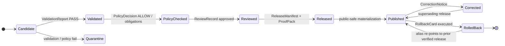

<!-- [KFM_META_BLOCK_V2]
doc_id: kfm://doc/flora/governance/rollback-and-correction
title: Flora — Rollback and Correction
type: standard
version: v0.1
status: draft
owners: <flora-steward> · <release-steward> · <policy-steward>   # TODO: assign CODEOWNERS
created: 2026-05-08
updated: 2026-05-08
policy_label: public
related:
  - docs/domains/flora/README.md
  - docs/domains/flora/ARCHITECTURE.md
  - docs/domains/flora/PUBLICATION_AND_POLICY.md
  - docs/domains/flora/PIPELINES_AND_LIFECYCLE.md
  - docs/domains/flora/runbooks/flora-rollback.md
  - docs/domains/flora/runbooks/flora-promotion.md
  - docs/domains/flora/CHANGELOG.md
  - docs/adr/ADR-flora-public-layer-strategy.md
  - docs/adr/ADR-flora-sensitive-location-policy.md
  - contracts/flora/flora_release_manifest.schema.json
  - contracts/flora/flora_evidence_bundle.schema.json
  - contracts/flora/flora_redaction_receipt.schema.json
  - contracts/flora/flora_review_record.schema.json
tags: [kfm, flora, governance, rollback, correction, supersession, release]
notes:
  - "Path placement (governance/) is PROPOSED — see notes; Flora Blueprint Appendix B places rollback procedure under runbooks/flora-rollback.md."
  - "All rollback artifacts and reason codes are PROPOSED until validators, fixtures, and CI exist."
[/KFM_META_BLOCK_V2] -->

# Flora — Rollback and Correction

> Governed procedure for **withdrawing, superseding, or correcting** any Flora release without
> silent overwrites, lost lineage, or hidden state. Rollback is a recorded state transition,
> not a file deletion.

<!-- Badges (placeholders until repo CI/badge targets are confirmed) -->
[](#status)
[](../README.md)
[](#lifecycle-position)
[](#public-safety-and-communication)
[](#no-delete-rule)
[](#truth-status)

---

## Quick jumps

- [Status](#status) · [Scope](#scope) · [Repo fit](#repo-fit)
- [Inputs](#inputs--what-belongs-here) · [Exclusions](#exclusions--what-does-not-belong-here)
- [Lifecycle position](#lifecycle-position)
- [Core artifacts](#core-artifacts)
- [Trigger matrix](#trigger-matrix)
- [Rollback procedure](#rollback-procedure)
- [Correction-only procedure](#correction-only-procedure)
- [Public-safety triage](#public-safety-and-communication)
- [No-delete rule](#no-delete-rule)
- [Rollback drill](#rollback-drill)
- [Anti-patterns](#anti-patterns)
- [Definition of done](#definition-of-done)
- [Open questions](#open-questions-and-needs-verification)

---

## Status

| Field | Value |
|---|---|
| Status | `draft` (PROPOSED — no mounted repo evidence in this session) |
| Owners | `<flora-steward>` · `<release-steward>` · `<policy-steward>` (CODEOWNERS TBD) |
| Truth status | All paths, schema names, and reason codes are **PROPOSED** until validated against the real repo. |
| Lifecycle role | `REVIEW / CORRECTION / ROLLBACK` operations on the Flora truth lifecycle. |
| Public risk | **HIGH** — rollback is the safety membrane for sensitive flora and rare-species locations. |

> [!IMPORTANT]
> If a public Flora layer ever exposes exact sensitive geometry, controlled-source content,
> a model presented as observation, or an uncited claim, the action is **immediate withdrawal
> via [Public-safety triage](#public-safety-and-communication)** — not a normal correction PR.

---

## Scope

This document defines **how a Flora release is corrected, superseded, withdrawn, or rolled back**
once anything has been promoted toward — or past — the public boundary. It is the human-facing
companion to:

- the schemas under `contracts/flora/` that encode rollback/correction objects,
- the policies under `policy/flora/` that decide whether the action is permitted,
- the validators under `tools/validators/flora/` that prove an action is well-formed,
- the runbook at `docs/domains/flora/runbooks/flora-rollback.md` (PROPOSED) that gives the
  operator-facing step list.

Rollback in KFM is **never** a silent file replacement. It is a governed state transition that
emits new receipts, new review records, and (where any public claim changed) a `correction_notice`
and a `rollback_card`.

---

## Repo fit

```text
docs/domains/flora/
├── README.md
├── ARCHITECTURE.md
├── PUBLICATION_AND_POLICY.md       ← upstream: defines public boundary
├── PIPELINES_AND_LIFECYCLE.md      ← upstream: defines RAW → PUBLISHED lifecycle
├── governance/
│   └── ROLLBACK_AND_CORRECTION.md  ← THIS DOCUMENT (PROPOSED placement)
├── runbooks/
│   ├── flora-promotion.md          ← peer: governs the forward path
│   └── flora-rollback.md           ← peer: operator step-list for rollback
└── CHANGELOG.md                    ← downstream: records every rollback / correction event
```

**Path note (PROPOSED):** The Flora Blueprint Appendix B does not list a `governance/`
subfolder; it places the rollback procedure under `runbooks/flora-rollback.md`. This file
has been written at the location requested by the working brief. If the repo later
adopts a flat `docs/domains/flora/ROLLBACK_AND_CORRECTION.md` (matching the Hazards
convention) or keeps procedure under `runbooks/`, this file should be moved with a
`supersession` note rather than deleted.

---

## Inputs — what belongs here

- The **doctrine** of how Flora handles correction, supersession, and rollback.
- The **trigger matrix** that maps a failure mode to a required action and a fail-safe default.
- The **artifact contract** for every rollback/correction event (which proof-objects must exist).
- The **public-safety triage** path for sensitivity / rights / leakage incidents.
- The **no-delete rule** and how lineage is preserved.
- A **rollback drill** template suitable for fixture-only execution in CI.

## Exclusions — what does not belong here

- **Operator step-by-step commands** — those live in `docs/domains/flora/runbooks/flora-rollback.md`.
- **Schema field definitions** — those live in `contracts/flora/*.schema.json`.
- **Policy logic / reason codes as enforcement** — those live in `policy/flora/*.rego`.
- **Per-release decisions** — those live in `data/proofs/flora/<release_id>/`.
- **Cross-domain rollback rules** — those live in shared `docs/doctrine/` and `docs/runbooks/`.

If a section here starts to drift toward operator commands or enforceable policy, move it.

---

## Lifecycle position

Flora preserves the KFM lifecycle:

`SOURCE EDGE → RAW → WORK / QUARANTINE → PROCESSED → CATALOG / TRIPLET → PUBLISHED`

with **`REVIEW / CORRECTION / ROLLBACK`** as **explicit governance operations**, not
afterthoughts. Promotion is a governed state transition, not a file move; the same is
true of rollback.



> [!NOTE]
> A rollback re-points the **public alias** to a prior verified release. It does **not**
> mutate or delete the rolled-back release. Both releases — and their proofs — remain
> permanently inspectable.

---

## Core artifacts

Every rollback or correction event must emit a complete, auditable bundle. None of these
artifacts are optional once a public surface has been touched.

| Artifact | Purpose | Proposed home | Schema / contract |
|---|---|---|---|
| `RollbackCard` | Records the alias re-point, prior/target releases, reason, verifier results, signoff. | `data/proofs/flora/<release_id>/rollback_card.json` | `contracts/flora/flora_rollback_card.schema.json` *(PROPOSED — verify name)* |
| `CorrectionNotice` | Public-safe explanation of what changed, what was wrong, and what supersedes it. | `data/proofs/flora/<release_id>/correction_notice.json` | shared `correction_notice.schema.json` (governance contract) |
| `ReleaseManifest` (new) | New release pointing back to the rollback target with `prior_release_ref`. | `data/proofs/flora/<release_id>/release_manifest.json` | `contracts/flora/flora_release_manifest.schema.json` |
| `EvidenceBundle` (preserved + new) | Old bundle stays immutable; new bundle carries `supersedes_bundle_ref`. | `data/proofs/flora/<release_id>/evidence_bundle.json` | `contracts/flora/flora_evidence_bundle.schema.json` |
| `ReviewRecord` | Steward / policy review of the rollback action itself. | `data/proofs/flora/<release_id>/review_record.json` | `contracts/flora/flora_review_record.schema.json` |
| `RunReceipt` | Process memory for the rollback execution. | `data/receipts/flora/rollback/<rollback_id>.json` | `contracts/flora/flora_run_receipt.schema.json` |
| `RedactionReceipt` *(if applicable)* | Records any geometry transform applied to recover safety. | `data/receipts/flora/redaction/<redaction_id>.json` | `contracts/flora/flora_redaction_receipt.schema.json` |
| Catalog updates | STAC / DCAT / PROV records mark the rolled-back release as superseded; PROV records a rollback activity. | `data/catalog/{stac,dcat,prov}/flora/` | catalog matrix validator |
| Layer / alias change | Public alias re-pointed via the layer registry; tile / PMTiles caches invalidated. | `data/registry/flora/layer_registry.yaml` | layer-descriptor validator |

> [!WARNING]
> A rollback that lacks any of the artifacts above must **not** be merged. The fail-safe
> for an incomplete rollback bundle is **DENY** at the promotion gate, not "land it now,
> backfill the receipt later."

---

## Trigger matrix

The following triggers come from Flora Blueprint §22 and are aligned to the broader
KFM correction/rollback model. Each row pairs a **trigger** with the **required action**
and the **fail-safe default** when the action cannot be completed in time.

| Trigger | Required action | Fail-safe default |
|---|---|---|
| Files proposed in PR but not merged | Remove from PR or split; no production correction needed. | PR revert. |
| Schema change causes compatibility issue | Revert or pin prior schema version; keep new schema as draft if already referenced by receipts. | Validation failure → `ERROR/HOLD`. |
| Source registry entry wrong | Revert descriptor; mark source `disabled` / `unverified`; preserve any probe receipt as process memory. | Source conflict → `ABSTAIN/HOLD`. |
| Validator / policy too strict or too loose | Disable new workflow invocation **first**; patch validator/policy with a fixture that proves the expected `DENY/ALLOW`. | Gate defaults to `DENY`. |
| Flora API route misbehaves after release | Disable route or feature-flag it; return `ERROR/ABSTAIN`; keep audit logs and `evidence_refs`. | Route unavailable → `ERROR`. |
| Public layer leaks sensitive geometry | **Immediate**: remove/disable layer registry entry and public alias; quarantine artifact; emit `correction_notice` and `rollback_card`. See [Public-safety triage](#public-safety-and-communication). | Layer aliased to last public-safe release; if none, layer disabled. |
| Published artifact is superseded | Publish new `release_manifest`; preserve old proof, catalog, receipt, and rollback lineage. | Public alias unchanged until new manifest verified. |
| External source terms change | Disable watcher; mark source `controlled` / `unknown`; `ABSTAIN` or `DENY` affected runtime claims pending review. | Runtime → `ABSTAIN`. |
| Modeled output presented as observed | Reclassify as derived / modeled; correction notice; affected release rolled back if public output existed. | `DENY` until reclassified. |
| Rights / licensing change | `PolicyDecision` update; possible withdrawal. | `DENY` public access. |
| Sensitivity reclassification | Apply redaction / generalization / withdrawal; redaction receipt required. | Exact location exposure closed immediately. |
| Stale evidence | Mark stale; `ABSTAIN` or show stale caveat publicly; do not pretend current. | Runtime → `ABSTAIN`. |
| Catalog closure mismatch | Block promotion; if already published, roll back to last manifest with verified closure. | Promotion gate `DENY`. |
| Withdrawn release | Withdraw assets from public routes; preserve audit; rollback target or withdrawal notice required. | Public alias removed. |

---

## Rollback procedure

This is the **doctrinal procedure**. The operator-facing command list belongs in
`docs/domains/flora/runbooks/flora-rollback.md`.

### Phase 0 — Triage

1. Classify the trigger using the [Trigger matrix](#trigger-matrix).
2. If the trigger is in the **public-safety class** (sensitivity leak, rights breach,
   model-as-observation, controlled-source publication), jump to
   [Public-safety triage](#public-safety-and-communication) **first**, then return here.
3. Open an incident receipt under `data/receipts/flora/rollback/` with `reason_code`
   and the proposed `from_release` / `to_release` ids.

### Phase 1 — Identify the rollback target

1. Read release lineage: `data/proofs/flora/`, `data/registry/flora/layer_registry.yaml`,
   the release index, and `EvidenceBundle` history.
2. Pick the **most recent prior release** whose:
   - `release_manifest` validates against the pinned schema,
   - `evidence_bundle` closes (every `evidence_ref` resolves),
   - `catalog_matrix` is closed (STAC / DCAT / PROV / manifest agree),
   - `policy_decision` was `ALLOW` for the affected scope at release time,
   - `review_record` is present and approved.
3. If no prior release qualifies, **disable the public layer** rather than aliasing to
   an unverified release.

### Phase 2 — Verify the rollback target

| Check | Pass criterion |
|---|---|
| Prior `release_manifest` integrity | Schema-valid; hashes match. |
| Prior `evidence_bundle` closure | Every claim resolves `EvidenceRef → EvidenceBundle`. |
| Prior `catalog_matrix` closure | STAC / DCAT / PROV identifiers, digests, and source refs all close. |
| Prior `proof_pack` integrity | Validation reports + checksum manifest verify. |
| Public-safe geometry | Layer descriptor still passes sensitivity validators **today** (rules may have tightened since). |
| Rights still valid | Source descriptors and rights profiles still permit publication. |

> [!CAUTION]
> If sensitivity rules have **tightened** since the rollback target was released, the
> target may no longer be public-safe. In that case, do not alias back to it — disable
> the layer and open a new release that satisfies current rules.

### Phase 3 — Execute the alias change

1. Repoint the public alias in `data/registry/flora/layer_registry.yaml` to the verified
   target release.
2. Update catalog records (`STAC` / `DCAT` / `PROV`): the rolled-back release is marked
   `superseded`; PROV records a `rollback` activity. Historical records are **not** mutated.
3. Invalidate downstream caches: TileJSON, PMTiles / vector tile caches, governed-API
   snapshots, public graph / search indexes, EvidenceBundle cache.
4. Rebuild any **derived** projections (graph / triplet) from the new alias target.
5. Re-run `geoprivacy` and `public-safety` validators against the restored outputs.

### Phase 4 — Emit governance artifacts

1. `RollbackCard` with `from_release_id`, `to_release_id`, `reason_code`, verifier results,
   reviewer signoff, `effective_at`.
2. `CorrectionNotice` (required if any public claim was wrong, leaked, stale, or
   misclassified) — public-safe explanation, affected scope, `superseded_by` link.
3. New `ReleaseManifest` if the rollback creates a new release id.
4. New `EvidenceBundle` with `supersedes_bundle_ref` to the rolled-back bundle.
5. New `ReviewRecord` for the rollback action.
6. New `RunReceipt` capturing the rollback execution.
7. **CHANGELOG** entry under `docs/domains/flora/CHANGELOG.md`.

### Phase 5 — Continuity check

| Check | Pass criterion |
|---|---|
| Old schema / layer / API aliases | Continuity validator confirms still pass or are explicitly mapped. |
| Fixture tests | All `tests/flora/*` and `tests/fixtures/flora/*` still pass against the alias target. |
| Promotion gate | Re-runs cleanly on the next promotion candidate without the rolled-back release in its evidence chain. |
| Public surface | Map shell, Evidence Drawer, Focus Mode, governed API envelopes show the restored state. |

---

## Correction-only procedure

A **correction without rollback** is appropriate when:

- the public release is still safe to keep aliased,
- the correction is additive or clarifying (e.g. an attribute update, source-citation
  refinement, status-code clarification, evidence supplement),
- no claim must be **withdrawn** publicly — only **amended**.

Steps:

1. Build a superseding **candidate** through the normal promotion path.
2. Issue a `CorrectionNotice` linking the prior release to the superseding one
   (`superseded_by`).
3. Promote the superseding release through the standard gate sequence.
4. The public alias moves only when the new release passes promotion. The prior release
   remains immutable and inspectable.

If during a correction it becomes clear the prior release is **unsafe** or **wrong**
in a public-facing way, escalate to a full [Rollback procedure](#rollback-procedure).

---

## Public-safety and communication

Public-safety triage applies when **any** of the following is true of a published artifact:

- exact sensitive flora geometry was exposed,
- a controlled-access source was republished without authorization,
- a derived model output was presented as observation,
- an AI / Focus answer was published without a resolvable `EvidenceBundle`,
- rights / licensing / sovereignty changed and current public exposure is no longer permitted.

> [!WARNING]
> Public-safety triage **bypasses normal PR cadence**. The first action is to **close the
> exposure**, not to write the explanation. Documentation follows containment.

### Triage order

1. **Disable the public surface.** Feature-flag the route, remove the layer alias, or
   pull the public payload. The default is `DENY`.
2. **Quarantine the artifact** under `data/quarantine/flora/<reason_code>/`.
3. **Emit an incident receipt** under `data/receipts/flora/rollback/`.
4. **Notify the steward(s)** named in CODEOWNERS for the affected source role.
5. **Run [Rollback procedure](#rollback-procedure) Phases 1–5.**
6. **Publish a `CorrectionNotice`** with a public-safe summary. The notice never
   re-exposes the sensitive content it is correcting.
7. **Post-incident review:** add a fixture that proves the validator/policy now denies
   the recurrence; update the relevant ADR if the rule changed.

### Reason codes (PROPOSED — must align with `policy/flora/*.rego`)

`precise_sensitive_location_denied` · `controlled_access_publication_denied` ·
`unknown_rights` · `review_required` · `public_geometry_not_generalized` ·
`ai_missing_evidence_bundle_or_citations` · `model_as_observation` ·
`catalog_matrix_not_closed` · `proof_bundle_incomplete` ·
`public_payload_exposes_internal_ref`

---

## No-delete rule

Rollback **never** deletes evidence. The following are **permanently retained**, even
when superseded:

- the rolled-back `release_manifest`,
- the rolled-back `evidence_bundle` and its `proof_pack`,
- all `run_receipt` and `redaction_receipt` entries,
- the `review_record` that originally approved the now-rolled-back release,
- catalog records (marked `superseded`, never removed),
- source descriptors (deactivated, with reason; history preserved).

Why this matters:

- The **rolled-back release is itself evidence** of how the system reached a wrong state
  and how it recovered. Deleting it destroys the audit chain.
- Downstream artifacts (graph deltas, derived layers, AI receipts) that referenced the
  rolled-back release must still be able to resolve their references for inspection.
- **Reversibility** depends on having both the prior and the current state available.

If retention policy ever requires removal, that removal is itself a governed action
emitting a `tombstone` receipt — not a silent delete.

---

## Rollback drill

A rollback plan that has never been rehearsed is a hope. The Flora lane should ship a
**fixture-only rollback drill** as part of CI, modeled on the Build Companion drill.

> [!TIP]
> Run the drill in a no-network environment using fixtures under
> `tests/fixtures/flora/promotion/`. The drill must not require live sources, live tile
> services, or production data.

```text
Drill (fixture-only):
  1. Publish fixture release   rel:flora:demo:v1   to a local published-artifact folder.
  2. Publish fixture release   rel:flora:demo:v2   with one corrected occurrence record.
  3. Emit CorrectionNotice     v1 → v2.
  4. Execute RollbackCard      v2 → v1   in dry-run mode.
  5. Confirm:
       - layer_registry now points to v1
       - catalog records show v2 as superseded
       - governed-API envelope returns v1 evidence refs
       - Evidence Drawer renders the restored state
       - Focus Mode either ABSTAINs (insufficient v1 evidence) or cites v1 only
  6. Re-run geoprivacy + public-safety validators against the restored outputs.
  7. Preserve all receipts; assert no fixture artifact was deleted.
```

This drill is **part of the promotion gate**: a release is not promotable until the
rollback drill against its predecessor passes.

---

<details>
<summary><strong>Example rollback artifacts (illustrative — not real release ids)</strong></summary>

#### `RollbackCard` — example

```json
{
  "rollback_id": "kfm://rollback/flora/2026-05-08-rare-leak-001",
  "from_release_id": "kfm://release/flora/2026-05-07/sha256:abcd...",
  "to_release_id":   "kfm://release/flora/2026-04-30/sha256:1234...",
  "reason_code": "precise_sensitive_location_denied",
  "verification": {
    "prior_release_manifest_verified": true,
    "prior_catalog_matrix_verified": true,
    "prior_evidence_bundle_verified": true,
    "prior_public_safe_geometry_verified": true,
    "current_sensitivity_rules_still_satisfied": true
  },
  "review_record_ref":   "kfm://review/flora/2026-05-08-rare-leak-001",
  "correction_notice_ref": "kfm://correction/flora/2026-05-08-rare-leak-001",
  "new_run_receipt_ref": "kfm://receipt/flora/rollback/2026-05-08-rare-leak-001",
  "cache_invalidations": ["tilejson", "pmtiles", "api_snapshot", "graph_index"],
  "executor_role": "<release-steward>",
  "effective_at": "2026-05-08T00:00:00Z"
}
```

#### `CorrectionNotice` — public-safe shape

```json
{
  "notice_id": "kfm://correction/flora/2026-05-08-rare-leak-001",
  "affected_release_id": "kfm://release/flora/2026-05-07/sha256:abcd...",
  "superseded_by_release_id": "kfm://release/flora/2026-04-30/sha256:1234...",
  "reason_summary_public": "A public layer briefly displayed sensitive flora geometry at higher precision than policy permits. The layer has been restored to the prior public-safe state.",
  "scope": ["public_layer:flora.occurrence.generalized.public.v1"],
  "review_state": "approved",
  "rollback_card_ref": "kfm://rollback/flora/2026-05-08-rare-leak-001",
  "created_at": "2026-05-08T00:00:00Z"
}
```

> Both examples are **illustrative**. Real instances must validate against the relevant
> schemas in `contracts/flora/` and the shared governance schemas.

</details>

---

## Anti-patterns

> [!CAUTION]
> Each of the following is a rollback **failure mode** the Flora lane must reject.

- **Silent overwrite.** Replacing a published artifact at its old id without a new
  manifest, new bundle, and rollback card.
- **Deletion of the rolled-back release.** The wrong state is itself evidence; deleting
  it destroys the audit chain.
- **Aliasing to an unverified prior release.** A prior release that no longer satisfies
  current sensitivity / rights rules is **not** a valid rollback target.
- **Skipping the correction notice when public claims changed.** If the public ever saw
  the wrong claim, a `CorrectionNotice` is required, even if rollback was fast.
- **Treating policy / validator changes as rollbacks.** Tightening a policy is a
  release of new rules, not a rollback; affected published artifacts may need their own
  rollback as a consequence, but the policy change itself follows the normal release path.
- **Backfilling receipts after the fact.** All rollback artifacts must exist **before**
  the alias change is merged.
- **Allowing AI / Focus answers to outlive their evidence.** When an `EvidenceBundle` is
  rolled back, dependent AI receipts must be invalidated or re-resolved against the new
  alias target.
- **Rolling back via tile-cache flush alone.** Cache invalidation is a step, not a
  rollback. Without manifest + alias changes, the canonical state is unchanged.

---

## Schemas, contracts, and policies referenced

> All paths below are **PROPOSED** until verified against the real repo. If the repo
> uses `schemas/contracts/v1/flora/...` rather than `contracts/flora/...`, replace
> uniformly. The schema-home decision is recorded in
> `docs/adr/ADR-flora-schema-home.md` (PROPOSED).

**Schemas — Flora-specific (PROPOSED home `contracts/flora/`):**

`flora_release_manifest.schema.json` · `flora_evidence_bundle.schema.json` ·
`flora_review_record.schema.json` · `flora_run_receipt.schema.json` ·
`flora_redaction_receipt.schema.json` · `flora_decision_envelope.schema.json` ·
`flora_catalog_matrix.schema.json` · `flora_layer_descriptor.schema.json` ·
`flora_promotion_candidate.schema.json` ·
`flora_rollback_card.schema.json` *(name PROPOSED — confirm with shared governance home)*

**Schemas — shared governance (canonical home TBD):**

`correction_notice.schema.json` · `rollback_card.schema.json` ·
`release_manifest.schema.json` · `supersession_record.schema.json`

**Policies (PROPOSED home `policy/flora/`):**

`publish.rego` · `sensitivity.rego` · `rights.rego` · `taxon.rego` ·
`catalog.rego` · `ai.rego` · `promotion.rego` · `review.rego`

**Validators (PROPOSED home `tools/validators/flora/`):**

`validate_schema_fixtures.py` · `validate_source_descriptors.py` ·
`<rollback drill validator>` *(name PROPOSED)*

---

## Definition of done

A Flora rollback or correction event is **done** when **every** box is true.

- [ ] Trigger classified against the [Trigger matrix](#trigger-matrix); reason code recorded.
- [ ] Public-safety triage executed first if applicable.
- [ ] Rollback target identified and verified (Phase 2 checks all pass).
- [ ] Public alias re-pointed; caches invalidated; derived projections rebuilt.
- [ ] `RollbackCard` emitted, schema-valid, reviewer signoff present.
- [ ] `CorrectionNotice` emitted (if any public claim changed), public-safe wording.
- [ ] New `ReleaseManifest` emitted (if a new release id was created).
- [ ] New `EvidenceBundle` emitted with `supersedes_bundle_ref`.
- [ ] New `ReviewRecord` and `RunReceipt` emitted.
- [ ] Catalog records (STAC / DCAT / PROV) updated; historical records untouched.
- [ ] No-delete rule respected: prior artifacts intact and reachable.
- [ ] Geoprivacy + public-safety validators re-run on restored outputs and pass.
- [ ] Continuity validator confirms aliases / fixtures still resolve.
- [ ] `docs/domains/flora/CHANGELOG.md` updated with the event.
- [ ] Rollback drill against the new state passes in CI.
- [ ] Post-incident fixture proving the recurrence now denies, where applicable.

---

## Open questions and NEEDS VERIFICATION

| Item | Status | How to verify |
|---|---|---|
| Schema home (`contracts/flora/` vs `schemas/contracts/v1/flora/`) | NEEDS VERIFICATION | `docs/adr/ADR-flora-schema-home.md`; inspect repo. |
| Rollback-card schema name and home (Flora-specific vs shared governance) | PROPOSED | Inspect shared governance schemas; align with hazards / geology / hydrology homes. |
| Correction-notice schema authority (per-domain vs shared) | PROPOSED | Search for an existing `correction_notice.schema.json`. |
| Layer-registry path and format | PROPOSED | Inspect `data/registry/flora/layer_registry.yaml` or repo equivalent. |
| Cache-invalidation surfaces (TileJSON / PMTiles / API / graph) | NEEDS VERIFICATION | Inspect `apps/governed_api/`, tile pipeline, graph projector. |
| Rollback drill test target (`tests/flora/`) | PROPOSED | Confirm test runner conventions and fixture layout. |
| Public-safety reason-code vocabulary | PROPOSED | Cross-check `policy/flora/sensitivity.rego` once it lands. |
| CODEOWNERS for flora steward / release steward / policy steward | UNKNOWN | Assign in `.github/CODEOWNERS` after repo review. |
| Branch protections required for rollback PRs | UNKNOWN | Repo settings; cannot infer from files. |
| Whether `governance/` subfolder is the agreed home for this doc | NEEDS VERIFICATION | Confirm with the docs roadmap; alternative: flat `docs/domains/flora/ROLLBACK_AND_CORRECTION.md` (Hazards convention) or `runbooks/flora-rollback.md` (Flora Blueprint Appendix B). |

---

## Related documents

- `docs/domains/flora/README.md` — lane entry point.
- `docs/domains/flora/ARCHITECTURE.md` — end-to-end Flora lane architecture.
- `docs/domains/flora/PIPELINES_AND_LIFECYCLE.md` — `RAW → PUBLISHED` lifecycle and watcher behavior.
- `docs/domains/flora/PUBLICATION_AND_POLICY.md` — rights, sensitivity, public-safe publication rules.
- `docs/domains/flora/runbooks/flora-rollback.md` — operator step-list (PROPOSED).
- `docs/domains/flora/runbooks/flora-promotion.md` — forward-path runbook (PROPOSED).
- `docs/domains/flora/CHANGELOG.md` — append every rollback / correction here.
- `docs/adr/ADR-flora-schema-home.md` — resolves schema authority.
- `docs/adr/ADR-flora-sensitive-location-policy.md` — defines exact / public-safe geometry thresholds.
- `docs/adr/ADR-flora-public-layer-strategy.md` — defines MapLibre public layer strategy.
- Cross-domain doctrine: `docs/doctrine/lifecycle-law.md`, `docs/runbooks/release-rollback.md` (PROPOSED, shared).

---

<sub>[Back to top](#flora--rollback-and-correction)</sub>
