<!-- [KFM_META_BLOCK_V2]
doc_id: kfm://doc/domains/flora/adr/public-layer-strategy
title: ADR — Flora Public Layer Strategy
type: standard
version: v1
status: draft
owners: KFM Flora Steward (TBD); KFM UI/Map Shell Steward (TBD)
created: 2026-05-08
updated: 2026-05-08
policy_label: public
related:
  - docs/domains/flora/governance/adr/ADR-flora-schema-home.md
  - docs/domains/flora/governance/adr/ADR-flora-source-roles.md
  - docs/domains/flora/governance/adr/ADR-flora-sensitive-location-policy.md
  - docs/domains/flora/PUBLICATION_AND_POLICY.md
  - docs/domains/flora/UI_AND_EVIDENCE_DRAWER.md
  - docs/architecture/map-shell.md
  - docs/architecture/contract-schema-policy-split.md
tags: [kfm, flora, adr, maplibre, public-layer, sensitivity, geoprivacy, governed-api]
notes:
  - "Path placement PROPOSED; reconciles user-supplied location with Flora blueprint Appendix B."
  - "Schema-home decision deferred to ADR-flora-schema-home.md; this ADR is contract-shape-neutral."
[/KFM_META_BLOCK_V2] -->

# ADR — Flora Public Layer Strategy

> How Flora-domain map layers are constructed, identified, governed, and exposed through MapLibre without leaking exact, sensitive, controlled, or model-as-observation content — and without letting style JSON or renderer state become a truth source.

<!-- BADGES (placeholders — verify targets when CI/branch settings are confirmed) -->


| Field | Value |
|---|---|
| **ADR ID** | `ADR-flora-public-layer-strategy` |
| **Status** | `draft` — proposed for review |
| **Domain** | Flora |
| **Owners** | Flora Steward · UI/Map Shell Steward · Sensitivity Reviewer (placeholders — assign in CODEOWNERS) |
| **Supersedes** | None |
| **Superseded by** | None |

**Quick jumps:** [1. Status](#1-status) · [2. Context](#2-context) · [3. Decision drivers](#3-decision-drivers) · [4. Options considered](#4-options-considered) · [5. Decision](#5-decision) · [6. Public layer flow](#6-public-layer-flow) · [7. Consequences](#7-consequences) · [8. Affected artifacts](#8-affected-artifacts) · [9. Validation, gates, and rollback](#9-validation-gates-and-rollback) · [10. Open questions](#10-open-questions--verification-backlog) · [11. Related decisions](#11-related-decisions-and-docs) · [12. Glossary](#12-glossary)

> [!IMPORTANT]
> The Flora **public layer is not the truth source.** A model output is not an observation. A range map is not a specimen. A generalized public polygon is not an internal sensitive occurrence point. An AI summary is not source evidence. This ADR exists to keep those distinctions enforceable inside MapLibre.

---

## 1. Status

`draft` (PROPOSED). This ADR is published for review by the Flora Steward, the UI/Map Shell Steward, the Sensitivity Reviewer, and the Release Steward. It is **not** an authorization to publish any Flora map layer. Publication remains gated by the schema, policy, review, and release artifacts named in §9.

This ADR depends on three sibling Flora ADRs and should be read alongside them:

- `ADR-flora-schema-home` — resolves whether Flora schemas live under `contracts/flora/` or `schemas/contracts/v1/flora/` (`PROPOSED`, schema-home conflict is repository-wide).
- `ADR-flora-source-roles` — locks the source-role vocabulary this ADR depends on.
- `ADR-flora-sensitive-location-policy` — defines exact-vs-public-safe geometry thresholds and reason codes that the public layer enforces.

> [!NOTE]
> If any sibling ADR has not been accepted, the layer registry **must not** activate any descriptor whose policy or source-role evaluation depends on the unsettled decision. CI gates should fail closed.

[Back to top](#adr--flora-public-layer-strategy)

---

## 2. Context

KFM is an evidence-first, map-first, time-aware, governed, auditable, reversible spatial knowledge system. The MapLibre 2D shell is the disciplined renderer and interaction runtime — it is **not** the truth store, the publication authority, the policy authority, the citation authority, or the AI authority. Flora amplifies the public-layer risk profile of the system because it carries:

- **Rare, protected, and culturally sensitive species** whose exact locations must default to denial, generalization, withholding, or staged access.
- **Multi-source occurrence data** (herbaria, GBIF, iNaturalist-style community observations, NatureServe, USFWS ECOS, KDWP) with heterogeneous rights, licensing, precision, and authority.
- **Derived surfaces** (range maps, habitat suitability, vegetation indices, phenology products) that must never masquerade as observed truth.
- **Vegetation communities and invasive plant spread** which are mapped assemblages, not individual occurrences.

The Flora architecture blueprint and the encyclopedia together establish that public Flora map exposure includes generalized occurrence/range, vegetation community, invasive plant spread, phenology calendar, vegetation index, restoration planting, and a deliberately public-safe rare plant product. Each of these is a separate object family with separate trust semantics. Without a binding ADR, MapLibre style JSON, dataset filenames, or ad-hoc layer naming could silently take on policy authority — a `FAILURE RULE` anti-pattern under KFM doctrine.

**Why now.** Per the Flora blueprint thin-slice plan, ADRs precede machine-file proliferation. No `data/registry/flora/layer_registry.yaml` entry, no `flora_layer_descriptor.schema.json` field set, no `apps/governed_api` `GET /flora/layers` route, and no MapLibre layer in `apps/explorer-web` should be added until this ADR is accepted.

[Back to top](#adr--flora-public-layer-strategy)

---

## 3. Decision drivers

| # | Driver | Doctrinal source (CONFIRMED in attached corpus) | Implication for this ADR |
|---|---|---|---|
| D1 | Public clients use governed interfaces, not canonical/internal stores. | KFM Core Invariants; Flora Blueprint §15. | The public layer is reached through `apps/governed_api`, never directly from `data/raw/`, `data/work/`, `data/quarantine/`, or `data/processed/`. |
| D2 | MapLibre layer metadata carries trust semantics outside style expressions. | Flora Blueprint Appendix C; MapLibre UI doctrine. | A layer descriptor (not a style JSON file) is the trust-bearing object. |
| D3 | `layer_id` is semantic identity, not a style file name. | Flora Blueprint §7. | IDs follow `kfm.layer.flora.<family>.<eligibility>.<purpose>.v<n>`. |
| D4 | Source role drives publication eligibility. | Flora Blueprint §5; source-role vocabulary. | Each public layer cites the source role(s) it derives from and an authority boundary. |
| D5 | Sensitive flora geometry must default to deny / generalize / withhold. | Flora Blueprint §12; encyclopedia §7.6.D. | No exact rare-plant coordinates appear in any public layer; exact geometry stays controlled. |
| D6 | Promotion is a governed state transition, not a file move. | KFM Core Invariants; Flora Blueprint §17. | A descriptor only becomes a public layer through `flora-promotion.yml` with full proof closure. |
| D7 | Cite-or-abstain is the default truth posture. | KFM Core Invariants. | Each public layer resolves to an `EvidenceBundle`; if it cannot, it must `ABSTAIN` or `DENY`. |
| D8 | Knowledge-character must not collapse. | Flora Blueprint §4. | A layer's class (observation / specimen / community / range / model / generalized public) is a first-class field; renderer state never alters it. |
| D9 | Style JSON is not the source of truth. | Flora Blueprint Appendix C. | MapLibre style files are derivable view-state; they may be regenerated from descriptors but never authored as authority. |
| D10 | Public surface must not leak RAW/WORK/QUARANTINE refs or restricted IDs. | Flora Blueprint §15.2. | Public-safe attribute schema is closed-list per layer family; non-allow-listed fields are stripped at the API boundary. |

[Back to top](#adr--flora-public-layer-strategy)

---

## 4. Options considered

> [!NOTE]
> Each option is summarized for the trade-off it carries, not as a recommendation. The chosen option is in §5.

**Option A — Style-JSON-as-authority.** Treat MapLibre style JSON as the canonical layer definition; rely on file naming and tile URL conventions for trust. *Rejected:* collapses style and policy into one un-reviewed surface (a KFM `FAILURE RULE` anti-pattern); style files are derivable, not normative.

**Option B — Per-layer ad-hoc descriptors.** Write a small JSON or YAML next to each layer with bespoke fields. *Rejected:* fragments authority across files, prevents schema validation, and prevents shared MapLibre/source/style governance reuse.

**Option C — Single governed layer descriptor schema, central registry, governed API exposure (chosen).** A versioned `flora_layer_descriptor` schema; a hand-authored `data/registry/flora/layer_registry.yaml`; a governed `GET /flora/layers` route; published artifacts under `data/published/flora/layers/...`; MapLibre consumes descriptors through the API and never authors policy. *Chosen* because it preserves the contract / schema / policy split, makes the trust membrane visible, and lets the same descriptor drive validation, promotion, the Evidence Drawer, the layer registry, and rollback.

**Option D — Defer the ADR; bind to a future shared cross-domain LayerDescriptor.** *Partially adopted:* the chosen option commits to align with shared MapLibre layer/source/style governance once it is confirmed in the repository, and to *extend* a shared `LayerDescriptor` rather than fork one. Until then, the Flora schema is a domain profile, not a parallel authority.

[Back to top](#adr--flora-public-layer-strategy)

---

## 5. Decision

The Flora public layer strategy is built on **one trust-bearing object (the layer descriptor), one registry, one governed API surface, one published artifact lane, and one renderer that does no policy work**. The following sub-decisions are accepted together; partial adoption is not authorized.

### 5.1 The layer descriptor is the trust-bearing object

A Flora public map layer is defined by a `flora_layer_descriptor` record, not by a style file, dataset filename, or tile URL. The descriptor is the object validated, reviewed, promoted, registered, and rolled back. Every public Flora layer has exactly one current descriptor; descriptor versions are immutable once promoted.

The descriptor MUST carry, at minimum:

| Field | Purpose |
|---|---|
| `layer_id` | Semantic identity per §5.4. |
| `layer_family` | One of: `taxon_page`, `occurrence_generalized`, `range`, `vegetation_community`, `invasive_spread`, `phenology_calendar`, `vegetation_index`, `restoration_planting`, `rare_plant_public_safe`. |
| `knowledge_character` | One of: `observed`, `specimen`, `community`, `range_map`, `model`, `generalized_public`, `index_product`. (Encodes D8.) |
| `source_role(s)` | From the locked vocabulary in `ADR-flora-source-roles`. |
| `authority_boundary` | What this source is allowed to support and what it cannot. |
| `public_publication_eligibility` | One of: `public_ok`, `public_generalized_only`, `controlled_only`, `deny`, `unknown`. |
| `evidence_route` | URI to the resolving `EvidenceBundle`; required for every public layer. |
| `policy_label` | Sensitivity / rights label evaluated by `policy/flora/sensitivity.rego` and rights gate. |
| `review_state` | Steward review, scope, decision, actor, date, obligations. |
| `freshness` | `as_of`, `valid_time`, `retrieved_at`. |
| `rights_profile_ref` | Reference into `data/registry/flora/rights_profiles.yaml`. |
| `redaction_receipt_ref` | Required when geometry has been generalized, withheld, or obscured. |
| `style_ref` *(optional)* | Pointer to a style fragment. **Style is downstream of the descriptor; it is never authority.** |
| `spec_hash` | Stable hash of schema/spec/process identity. |
| `content_hash` | Hash of the published artifact bytes. |

The exact field set lives in `flora_layer_descriptor.schema.json`. The schema home (`contracts/flora/` vs `schemas/contracts/v1/flora/`) is settled by `ADR-flora-schema-home`; this ADR is intentionally schema-home-neutral.

### 5.2 Public publication eligibility is a closed enum

A descriptor MUST set `public_publication_eligibility` to exactly one of:

| Value | Meaning | Default action when unclear |
|---|---|---|
| `public_ok` | Source-role, rights, sensitivity, review, and generalization all resolved; descriptor may be exposed as-is. | Never default into this state. |
| `public_generalized_only` | Exact geometry stays controlled; only generalized geometry may be served. | This is the safe default for occurrence and rare-plant families. |
| `controlled_only` | Layer exists internally but MUST NOT appear on any public-facing MapLibre style or `GET /flora/layers` response. | Required for stewardship surfaces. |
| `deny` | Publication is denied; descriptor records the reason for audit. | Required when rights are unresolved or the public-safe transform cannot be made to satisfy policy. |
| `unknown` | Unresolved; layer cannot be promoted; descriptor is quarantined for review. | Never expose; never silently re-classify. |

`unknown` and `deny` are **not** "soft" states. CI MUST fail closed on any release manifest that includes a descriptor in either state.

### 5.3 Generalization, redaction, and the public-safe transform

When a public layer is derived from internal or sensitive data, the transform is a first-class artifact:

- The transform is performed inside the `pipelines/flora/generalize_sensitive_geometry.*` job (path PROPOSED — confirm against repo conventions before implementation), never inside the renderer or the API layer.
- The transform produces a `flora_redaction_receipt` linking source record, transform method, precision bucket / grid / region, input digest, output digest, policy decision, reviewer (where allowed), reason code, and output public geometry.
- Public-safe attributes are an **explicit allow-list per `layer_family`**. Non-allow-listed fields (including but not limited to internal IDs, RAW/WORK/QUARANTINE refs, controlled-source identifiers, exact dates for sensitive species, and unredacted observer identity) are stripped at the API boundary and absent from the published artifact.
- A descriptor whose `redaction_receipt_ref` is missing — when its `layer_family` requires generalization — fails the promotion gate with reason code `public_geometry_not_generalized`.

> [!WARNING]
> The transform is **not** reversible from the public artifact. Internal precision MUST remain in `data/processed/flora/...` behind access controls. There is no public endpoint that reconstitutes exact sensitive geometry, regardless of caller identity, and no admin shortcut on the normal public path.

### 5.4 Layer identity

The layer descriptor's `layer_id` is a semantic identity, not a style file name and not a tile URL:

```
kfm.layer.flora.<family>.<eligibility>.<purpose>.v<n>
```

Examples (illustrative — not yet promoted):

```
kfm.layer.flora.occurrence.generalized.public.v1
kfm.layer.flora.range.range_map.public.v1
kfm.layer.flora.vegetation_community.nlcd_aligned.public.v1
kfm.layer.flora.rare_plant.public_safe_product.v1
kfm.layer.flora.phenology.calendar.public.v1
kfm.layer.flora.vegetation_index.hls.public.v1
```

`layer_id` is stable across style and tile-format changes. A descriptor with the same `layer_id` and a higher `vN` supersedes its predecessor through the promotion gate; the predecessor is preserved for rollback and audit.

### 5.5 Trust-visible state at the renderer

MapLibre layer controls MUST surface trust-visible state for every Flora public layer. The renderer reads from the layer descriptor (via `GET /flora/layers`) and displays:

- Trust badge tied to `source_role` and `authority_boundary`.
- Freshness chip from `as_of` / `retrieved_at`.
- Generalization indicator when `public_publication_eligibility = public_generalized_only`.
- Review state and any active correction notice.

> [!CAUTION]
> Layer **visibility, style, or filter state is never proof.** The renderer does not infer truth from what a user has toggled on. The Evidence Drawer is the citation surface; the layer panel is a navigation surface.

### 5.6 What MapLibre and the renderer must not do

| Renderer must not… | Why |
|---|---|
| Read `data/raw/`, `data/work/`, or `data/quarantine/` directly. | Bypasses the trust membrane and breaks RAW → WORK/QUARANTINE → PROCESSED → CATALOG/TRIPLET → PUBLISHED. |
| Treat a style JSON file as a layer authority. | Style is derivable; the descriptor is the authority. |
| Synthesize new layers from client-side joins of multiple sources. | A new claim requires a new descriptor, a new `EvidenceBundle`, and a new promotion. |
| Omit policy / negative-outcome blocks from the Evidence Drawer. | Hides denial state, which is a `FAILURE RULE` anti-pattern. |
| Reveal exact sensitive coordinates through hover, click, popup, query, or export. | Same prohibition as the served tiles. The denial extends to all client interactions. |
| Allow Focus Mode (AI) to consume unpublished candidate data. | Per Flora Blueprint §16, AI runs after evidence retrieval and policy. |

### 5.7 Promotion gates that apply to a Flora public layer

A descriptor promotes to a public layer only when **all** of the following are CONFIRMED for that descriptor's release candidate:

1. Schema validation against `flora_layer_descriptor.schema.json` passes.
2. Source-descriptor and source-role validation passes (per `ADR-flora-source-roles`).
3. Rights resolution: `rights_profile_ref` resolves; license terms are compatible with the chosen eligibility.
4. Sensitivity resolution: `policy/flora/sensitivity.rego` (path PROPOSED) returns ALLOW for the descriptor's `policy_label` and `public_publication_eligibility`.
5. Generalization closure: if required, a valid `flora_redaction_receipt` is linked and content-hashes match.
6. Review closure: a `flora_review_record` exists with scope matching this release.
7. Catalog closure: STAC / DCAT / PROV / `CatalogMatrix` close; digests align.
8. Evidence closure: every public claim resolves through `EvidenceRef` → `EvidenceBundle`.
9. Release manifest: `flora_release_manifest` lists the artifact and digests; rollback target is set.
10. Identity: `spec_hash` and `content_hash` are present and reproducible.

Any UNKNOWN, ABSTAIN, or DENY in steps 1–10 fails the promotion gate. There is no "warn-and-publish" path.

### 5.8 The shared-object alignment commitment

If a shared cross-domain `LayerDescriptor`, `SourceDescriptor`, `EvidenceBundle`, `DecisionEnvelope`, `ReleaseManifest`, or `CatalogMatrix` is confirmed in the repository (status: NEEDS VERIFICATION), the Flora descriptor extends the shared object with flora-specific fields and constraints **rather than forking**. Migration is performed in place; descriptors do not evolve in two parallel homes.

[Back to top](#adr--flora-public-layer-strategy)

---

## 6. Public layer flow

The diagram below reflects the lifecycle and authority boundaries this ADR commits to. Solid arrows are governed transitions; dashed arrows are advisory reads (UI / Evidence Drawer); the renderer never reads internal stores.

```mermaid
flowchart LR
    subgraph INTERNAL["INTERNAL · controlled access"]
        RAW["data/raw/flora"]
        WORK["data/work/flora"]
        QUAR["data/quarantine/flora"]
        PROC["data/processed/flora<br/>(exact geometry, internal IDs)"]
    end

    subgraph GATES["GATES · fail-closed"]
        SENS["sensitivity policy<br/>policy/flora/sensitivity.rego"]
        RIGHTS["rights gate<br/>rights_profiles.yaml"]
        REV["steward review<br/>flora_review_record"]
        TRANS["public-safe transform<br/>generalize / withhold"]
        REC["flora_redaction_receipt"]
    end

    subgraph DESCRIPTOR["DESCRIPTOR · trust-bearing object"]
        DESC["flora_layer_descriptor"]
        REG["data/registry/flora/<br/>layer_registry.yaml"]
        BUN["EvidenceBundle"]
        MAN["flora_release_manifest"]
    end

    subgraph PUBLIC["PUBLIC · published artifacts only"]
        PUB["data/published/flora/layers/...<br/>tilejson · geojson · pmtiles · manifests"]
    end

    subgraph CLIENT["CLIENT · governed surfaces"]
        API["GET /flora/layers<br/>(governed API)"]
        ML["MapLibre layer + style"]
        ED["Evidence Drawer"]
        FM["Focus Mode (AI)"]
    end

    RAW --> WORK --> PROC
    WORK -. invalid / sensitive .-> QUAR
    PROC --> SENS
    SENS --> RIGHTS --> REV
    REV --> TRANS --> REC
    REC --> DESC
    DESC --> BUN
    DESC --> REG
    DESC --> MAN
    MAN --> PUB
    REG --> API
    PUB --> API
    API --> ML
    ML -. read-only .-> ED
    ED -. read-only .-> FM

    classDef internal fill:#fdecea,stroke:#c0392b,color:#000
    classDef public   fill:#e8f6ec,stroke:#2e7d32,color:#000
    classDef gate     fill:#fff5e1,stroke:#b7791f,color:#000
    classDef desc     fill:#eef2ff,stroke:#3949ab,color:#000
    classDef client   fill:#f4f4f4,stroke:#555,color:#000

    class RAW,WORK,QUAR,PROC internal
    class SENS,RIGHTS,REV,TRANS,REC gate
    class DESC,REG,BUN,MAN desc
    class PUB public
    class API,ML,ED,FM client
```



> [!NOTE]
> The diagram is doctrinal, not implementation-attested. Specific paths and route names are PROPOSED until verified against the mounted repository.

[Back to top](#adr--flora-public-layer-strategy)

---

## 7. Consequences

**Positive**

- The trust membrane around Flora map exposure is explicit and inspectable: a single descriptor object carries authority, eligibility, rights, sensitivity, review state, and generalization lineage.
- MapLibre is preserved as a renderer, not promoted into a policy authority.
- Sensitivity, rights, and source-role decisions are auditable per layer and reversible through registry edits and rollback cards.
- Anti-fragmentation: future Flora layer families (phenology, restoration, vegetation index variants, invasive spread) all use the same descriptor shape, validators, gates, and rollback machinery.
- Cross-domain reuse is preserved: when a shared `LayerDescriptor` is confirmed, this ADR's Flora profile extends it rather than competing with it.

**Negative**

- One more schema, one more policy bundle, one more registry, and one more promotion gate to maintain.
- Style work for designers is gated behind descriptor authoring; rapid visual iteration is constrained.
- Descriptor versioning adds a small lifecycle tax to every public layer change.
- Some legitimate analytical questions ("show exact rare orchid points to a steward in the field") cannot be served through the public layer. They require an internal review console, governed access, or a separate sensitivity-cleared client. This ADR explicitly does not provide that path.

**Risks**

| Risk | Mitigation |
|---|---|
| A descriptor drifts from its emitted style or tile artifact, producing visible-but-uncited claims. | `content_hash` verification at API boundary and CI; rollback on mismatch. |
| A shared cross-domain `LayerDescriptor` is later adopted with different fields. | Field-level `spec_hash` and a migration ADR; in-place upgrade rather than fork. |
| A new flora source bypasses the registry through ad-hoc tile URLs. | `GET /flora/layers` is the only blessed enumeration; URLs not enumerated by the registry are not "Flora layers" for any governance purpose. |
| The MapLibre style file is edited to silently re-style a sensitive layer. | Style is derivable from descriptor; CI compares descriptor-derived style to authored style and fails on drift. (Path PROPOSED.) |

[Back to top](#adr--flora-public-layer-strategy)

---

## 8. Affected artifacts

> [!NOTE]
> All paths are PROPOSED. Exact homes (especially `contracts/` vs `schemas/contracts/v1/`) are settled by `ADR-flora-schema-home`. None of these files should be created until the relevant repo conventions are confirmed.

| Path (PROPOSED) | Role | Effect of this ADR |
|---|---|---|
| `contracts/flora/flora_layer_descriptor.schema.json` *or* `schemas/contracts/v1/flora/flora_layer_descriptor.schema.json` | Layer descriptor schema | Required fields per §5.1; closed enums per §5.2; eligibility-aware constraints. |
| `contracts/flora/flora_redaction_receipt.schema.json` *or* `schemas/.../flora_redaction_receipt.schema.json` | Redaction receipt schema | Required when generalization is performed; linked by the descriptor. |
| `data/registry/flora/layer_registry.yaml` | Layer ID and eligibility registry | Authoritative enumeration of Flora layers; consulted by the governed API. |
| `data/registry/flora/sensitivity_policies.yaml` | Sensitivity rules | Policy-label → eligibility mappings used in §5.7 step 4. |
| `data/registry/flora/rights_profiles.yaml` | Rights profiles | Resolves `rights_profile_ref` per descriptor. |
| `data/registry/flora/source_roles.yaml` | Locked source-role vocabulary | Sourced from `ADR-flora-source-roles`. |
| `policy/flora/sensitivity.rego` | Sensitivity gate | Implements `public_geometry_not_generalized`, `precise_sensitive_location_denied`, `controlled_access_publication_denied`, `unknown_rights`, `review_required`. |
| `pipelines/flora/generalize_sensitive_geometry.*` | Public-safe transform job | Emits `flora_redaction_receipt`; precision bucket / grid policy from the sensitivity registry. |
| `tools/validators/flora/validate_layer_descriptor.*` | Descriptor validator | Schema + cross-field validation including knowledge-character / source-role consistency. |
| `tools/validators/flora/validate_sensitivity_publication.*` | Eligibility validator | Confirms generalization, receipts, and review for non-`public_ok` cases. |
| `apps/governed_api/openapi/flora.v1.yaml` *(or repo-equivalent)* | Governed API contract | Adds `GET /flora/layers` per Flora Blueprint §15.1. |
| `data/published/flora/layers/...` | Published artifacts | Only produced post-promotion; structure follows `processed/flora/...` lineage. |
| `apps/explorer-web` MapLibre shell *(path UNKNOWN)* | Renderer | Consumes descriptors via `GET /flora/layers`; does no policy work. |
| `tests/fixtures/flora/valid/flora_layer_descriptor_public_generalized.json` | Valid fixture | Exercises §5.7 happy path. |
| `tests/fixtures/flora/invalid/precise_sensitive_public_geometry.json` | Invalid fixture | Asserts denial of exact sensitive geometry on the public surface. |
| `tests/fixtures/flora/invalid/modeled_as_observed.json` | Invalid fixture | Asserts knowledge-character collapse is denied. |
| `.github/workflows/flora-ci.yml`, `.github/workflows/flora-promotion.yml` | CI | Runs validators, fixtures, and promotion gate; never fetches live sources. |

[Back to top](#adr--flora-public-layer-strategy)

---

## 9. Validation, gates, and rollback

### 9.1 Validation

| Check | Mechanism | Outcome on failure |
|---|---|---|
| Descriptor schema | `validate_layer_descriptor` | DENY promotion. |
| Source-role consistency | Cross-field validator against `source_roles.yaml` | DENY promotion. |
| Rights resolution | Rights gate against `rights_profiles.yaml` | DENY or ABSTAIN per gate output. |
| Sensitivity / generalization | `policy/flora/sensitivity.rego` + receipt presence | DENY with explicit reason code. |
| Knowledge-character integrity | Validator: e.g., `range_map` cannot be served as `observed`. | DENY. |
| Catalog closure | `validate_catalog_matrix` | DENY promotion. |
| Evidence closure | `validate_evidence_bundle` | DENY promotion. |
| Public-safe attribute allow-list | API-boundary stripping + test fixture | DENY release if forbidden fields appear. |
| `spec_hash` / `content_hash` reproducibility | CI re-derives and compares | DENY release on mismatch. |

### 9.2 Reason codes (this ADR commits to surfacing these in DecisionEnvelopes)

`precise_sensitive_location_denied` · `controlled_access_publication_denied` · `unknown_rights` · `review_required` · `public_geometry_not_generalized` · `invalid_geometry` · `catalog_matrix_not_closed` · `proof_bundle_incomplete` · `knowledge_character_mismatch`.

### 9.3 Rollback path

| Situation | Required action |
|---|---|
| Descriptor merged but promotion not yet executed. | Revert PR; no public artifact emitted; no correction notice required. |
| Public layer leaks sensitivity (exact rare-plant location on public surface, restricted ID exposed, etc.). | Immediately disable the layer registry entry; quarantine the published artifact under `data/quarantine/flora/`; emit `flora_correction_notice` and `rollback_card` referencing the affected `release_id` and `layer_id`. |
| Style file drift from descriptor authority. | Disable layer at the API; preserve descriptor; emit correction notice; restore from descriptor-derived style on next promotion. |
| Rights or terms change at the source. | Mark descriptor `public_publication_eligibility = unknown` or `controlled_only`; `GET /flora/layers` stops listing; published artifact moves out of public manifest. |
| Schema change breaks descriptors. | Pin prior schema version; treat new schema as `draft`; do not promote new descriptors until migration ADR lands. |

> [!IMPORTANT]
> Rollback never silently overwrites prior receipts, proofs, catalog records, or release manifests. Lineage is preserved.

[Back to top](#adr--flora-public-layer-strategy)

---

## 10. Open questions / verification backlog

| # | Question | Status | How to resolve |
|---|---|---|---|
| Q1 | Is there a shared cross-domain `LayerDescriptor` already in the repository? | UNKNOWN — no mounted repo evidence in this session. | Inspect `contracts/` and `schemas/contracts/v1/` for a shared `LayerDescriptor` and align Flora as a profile. |
| Q2 | Does the repository use `contracts/flora/` or `schemas/contracts/v1/flora/` as the canonical schema home? | CONFLICTED in attached corpus. | Settled by `ADR-flora-schema-home`. |
| Q3 | Should this ADR live at `docs/domains/flora/governance/adr/`, `docs/domains/flora/adr/`, or `docs/adr/`? | PROPOSED — user-supplied path adds a `governance/` interlayer not present in the Flora blueprint Appendix B (`docs/domains/flora/adr/`) or the file matrix (`docs/adr/`). | Open a small Directory Rules ADR or accept the per-domain `governance/` convention explicitly in `docs/domains/README.md`. |
| Q4 | What precision buckets / grid sizes does the sensitivity policy require per family (rare plants, listed species, culturally sensitive species)? | NEEDS VERIFICATION. | Settled by `ADR-flora-sensitive-location-policy` and `sensitivity_policies.yaml`. |
| Q5 | What is the exact MapLibre shell path (`apps/explorer-web/...`) and how does it consume `GET /flora/layers`? | UNKNOWN. | Inspect `apps/explorer-web` once mounted; bind descriptor consumption there. |
| Q6 | Is the governed API framework FastAPI / Express / something else, and what is the route convention? | UNKNOWN. | Inspect `apps/governed_api` once mounted. |
| Q7 | Is OPA / Conftest available in CI for Rego policy execution? | UNKNOWN — tools absent in attached scan. | Decide repo-standard policy runner; this ADR is policy-runner-neutral. |
| Q8 | Who is the named Flora Steward, UI/Map Shell Steward, and Sensitivity Reviewer? | UNKNOWN. | Assign in `CODEOWNERS` and update the meta block. |
| Q9 | Are there pre-existing public Flora layers (legacy `ui/map/layers/` or similar) that this ADR must migrate? | UNKNOWN. | Inspect once mounted; emit migration ADR if found. |

[Back to top](#adr--flora-public-layer-strategy)

---

## 11. Related decisions and docs

- `docs/domains/flora/governance/adr/ADR-flora-schema-home.md` — schema-home authority for Flora (PROPOSED sibling).
- `docs/domains/flora/governance/adr/ADR-flora-source-roles.md` — locks the source-role vocabulary this ADR depends on (PROPOSED sibling).
- `docs/domains/flora/governance/adr/ADR-flora-sensitive-location-policy.md` — defines exact-vs-public-safe geometry thresholds (PROPOSED sibling).
- `docs/domains/flora/PUBLICATION_AND_POLICY.md` — narrative companion: rights, sensitivity, public-safe publication.
- `docs/domains/flora/UI_AND_EVIDENCE_DRAWER.md` — narrative companion: MapLibre / Evidence Drawer / Focus payload contracts.
- `docs/architecture/map-shell.md` — repo-wide MapLibre shell architecture (path PROPOSED per Directory Rules).
- `docs/architecture/contract-schema-policy-split.md` — the split this ADR honors.
- `docs/doctrine/trust-membrane.md`, `docs/doctrine/lifecycle-law.md`, `docs/doctrine/truth-posture.md` — repo-wide doctrine.

[Back to top](#adr--flora-public-layer-strategy)

---

## 12. Glossary

<details>
<summary><b>Expand glossary</b> — terms used in this ADR.</summary>

- **Layer descriptor** — the trust-bearing record that defines a Flora map layer's identity, source role, eligibility, rights, sensitivity, review state, evidence route, and lineage. Authoritative; not a style file.
- **`layer_id`** — semantic, version-bearing identifier of a Flora layer (`kfm.layer.flora.<family>.<eligibility>.<purpose>.v<n>`); stable across style and tile-format changes.
- **Knowledge character** — the kind of claim a layer carries (`observed`, `specimen`, `community`, `range_map`, `model`, `generalized_public`, `index_product`); must not collapse.
- **Public-safe transform** — the generalization / withholding / obscuration applied to internal precise geometry to produce a public-safe public layer. Always emits a `flora_redaction_receipt`.
- **Public publication eligibility** — closed enum: `public_ok`, `public_generalized_only`, `controlled_only`, `deny`, `unknown`.
- **Trust membrane** — the boundary between canonical/internal stores and public clients; KFM mandates that public clients reach truth only through governed interfaces.
- **EvidenceBundle / EvidenceRef** — the resolved citation closure for a claim; every public layer's claim must resolve here.
- **DecisionEnvelope** — the runtime envelope carrying the finite outcome (`ANSWER`, `ABSTAIN`, `DENY`, `ERROR`), reasons, obligations, and audit ref.
- **Promotion** — the governed state transition from candidate to published; not a file move.
- **Rollback card** — the durable record of a withdrawal, with target release, scope, reason, and lineage preservation.

</details>

[Back to top](#adr--flora-public-layer-strategy)
