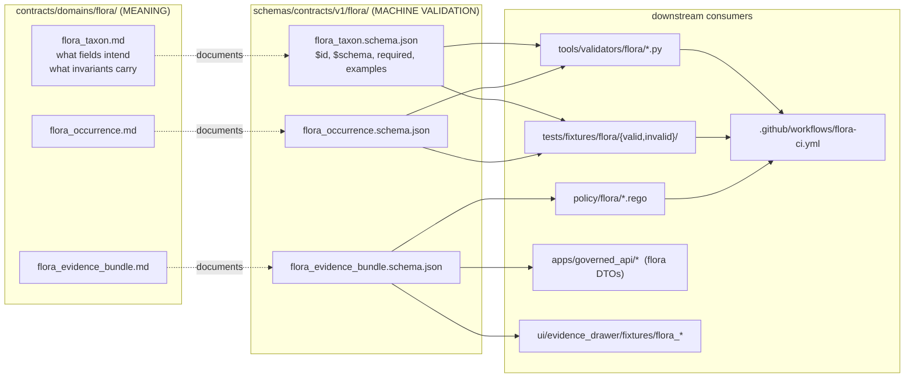

<!-- [KFM_META_BLOCK_V2]
doc_id: kfm://doc/adr/flora-schema-home
title: ADR — Flora Schema Home
type: standard
version: v1
status: proposed
owners: <flora-steward>, <governance-reviewer>
created: 2026-05-08
updated: 2026-05-08
policy_label: public
related:
  - docs/adr/ADR-0001-schema-home.md
  - docs/domains/flora/ARCHITECTURE.md
  - docs/domains/flora/DATA_MODEL.md
  - docs/domains/flora/governance/adr/ADR-flora-source-roles.md
  - docs/domains/flora/governance/adr/ADR-flora-sensitive-location-policy.md
  - docs/domains/flora/governance/adr/ADR-flora-public-layer-strategy.md
  - contracts/domains/flora/
  - schemas/contracts/v1/flora/
  - policy/flora/
tags: [kfm, adr, flora, schemas, contracts, governance]
notes:
  - "Schema-home ADR — must precede machine-file proliferation (P0)."
  - "Repository is not mounted in this session; placement is PROPOSED until repo evidence confirms it."
[/KFM_META_BLOCK_V2] -->

# ADR — Flora Schema Home

> Resolve where Flora machine schemas live before any `flora_*.schema.json` file lands in the repository, so contracts (meaning) and schemas (machine validation) do not split into two ungoverned homes.

<!-- Badges: targets are placeholders until ADR is accepted and CI is wired. -->
[](#status)
[](#priority)
[](../../README.md)
[](#decision)
[](#evidence-basis)

**Quick jumps:** [Status](#status) · [Context](#context) · [Decision](#decision) · [Consequences](#consequences) · [Alternatives](#alternatives-considered) · [Implementation Notes](#implementation-notes) · [Validation](#validation) · [Rollback & Supersession](#rollback--supersession) · [Open Questions](#open-questions) · [Related](#related)

---

## Status

| Field | Value |
| --- | --- |
| **Status** | `PROPOSED` |
| **Priority** | `P0` — must precede any `flora_*.schema.json` creation |
| **Owner / steward** | `<flora-steward>` (placeholder — confirm in repo `CODEOWNERS`) |
| **Reviewer** | `<governance-reviewer>` (placeholder) |
| **Decision class** | Architecture Decision Record (ADR) — domain instance of the repo-wide schema-home doctrine |
| **Supersedes** | _None_ |
| **Superseded by** | _None_ |

> [!IMPORTANT]
> No Flora JSON Schema file (`flora_*.schema.json`) should be created, validated, or imported until this ADR is **accepted** and the chosen home directory exists with a `README.md` declaring its authority level.

---

## Context

The Flora lane is governed, evidence-first, and map-first; every consequential outward Flora claim must reconstruct to source descriptors, EvidenceRefs, EvidenceBundles, policy decisions, review state, catalog records, and correction lineage. To make that closure mechanically enforceable, Flora needs **machine-readable schemas** for each object family — `flora_taxon`, `flora_taxon_crosswalk`, `flora_occurrence`, `flora_source_descriptor`, `flora_evidence_bundle`, `flora_decision_envelope`, `flora_release_manifest`, `flora_layer_descriptor`, `flora_evidence_drawer_payload`, `flora_run_receipt`, `flora_redaction_receipt`, `flora_review_record`, `flora_promotion_candidate`, `flora_catalog_matrix`, `flora_focus_payload`, and the modeled/ecological families (`flora_plant_community`, `flora_vegetation_class`, `flora_range_map`, `flora_habitat_association`, `flora_phenology_condition_product`).

The Flora architecture blueprint **PROPOSED** schema paths in two competing forms:

- `contracts/flora/*.schema.json`
- `schemas/contracts/v1/flora/*.schema.json`

Until this ADR resolves the home, **machine schemas could scatter across two ungoverned roots**, creating exactly the drift Directory Rules names as a top failure mode: `contracts/` and `schemas/` both claiming to be the same authority, with divergent definitions evolving in parallel.

### Doctrinal anchors

| Anchor | Statement |
| --- | --- |
| **Greenfield Decision Register D-004** | "Use `schemas/contracts/v1` as machine schema home." Rationale: separates human contracts from machine schemas while preserving contract meaning. Status: `PROPOSED`. Validation needed: ADR-0001 and drift tests. |
| **Directory Rules — `contracts/` vs `schemas/`** | `contracts/` should _define meaning_ — what objects mean, what their fields intend, what invariants they carry. `schemas/` is the canonical machine validation home. _"contracts/ should not be the only place where executable validation lives. It should say what objects mean."_ |
| **Directory Rules — domain placement** | A domain "should look like this": `docs/domains/<x>/`, `contracts/domains/<x>/`, `schemas/contracts/v1/domains/<x>/`, `policy/domains/<x>/`, `tests/domains/<x>/`, etc. Domain names do **not** become root folders. |
| **Flora blueprint, §10 (Schemas)** | Every `flora_*.schema.json` row carries the gate note: _"Machine ADR schema home + shared governance schemas"_ — i.e., the row is intentionally unresolved until this ADR fires. |
| **Cross-domain pattern** | `ADR-archaeology-schema-home`, `ADR-fauna-schema-home`, `ADR-0001-soil-truth-path`, `ADR-atmosphere-schema-compatibility`, hydrology and habitat schema-home ADRs all defer to the same `schemas/contracts/v1/<domain>/` default. |

### Current-session evidence limit

> [!NOTE]
> The repository is **not mounted** in this session. All path claims below are `PROPOSED` against KFM doctrine and the attached Flora blueprint; they are not yet verified against the actual repo. If the mounted repo proves a different schema authority — for example, an established `contracts/` schema home backed by a prior ADR — this ADR must be reconciled with that evidence (see [Rollback & Supersession](#rollback--supersession)).

---

## Decision

**Flora machine schemas live under `schemas/contracts/v1/flora/`.** Human-readable contract documents live under `contracts/domains/flora/`. They are not the same artifact and they do not share authority over machine validation.

### 1. Canonical schema home (machine validation)

```
schemas/contracts/v1/flora/
├── README.md                                       # authority declaration + index
├── flora_taxon.schema.json
├── flora_taxon_crosswalk.schema.json
├── flora_occurrence.schema.json
├── flora_occurrence_batch.schema.json
├── flora_source_descriptor.schema.json
├── flora_run_receipt.schema.json
├── flora_redaction_receipt.schema.json
├── flora_evidence_bundle.schema.json
├── flora_decision_envelope.schema.json
├── flora_release_manifest.schema.json
├── flora_catalog_matrix.schema.json
├── flora_review_record.schema.json
├── flora_promotion_candidate.schema.json
├── flora_layer_descriptor.schema.json
├── flora_focus_payload.schema.json
├── flora_evidence_drawer_payload.schema.json
├── flora_api_response.schema.json                  # flora_runtime_response_envelope
├── flora_plant_community.schema.json
├── flora_vegetation_class.schema.json
├── flora_range_map.schema.json
├── flora_habitat_association.schema.json
└── flora_phenology_condition_product.schema.json
```

### 2. Companion contract-meaning home (human meaning)

```
contracts/domains/flora/
├── README.md                                       # what each object means
├── flora_taxon.md
├── flora_occurrence.md
├── flora_source_descriptor.md
├── flora_evidence_bundle.md
├── flora_decision_envelope.md
├── flora_release_manifest.md
└── ...                                             # one .md per schema family
```

### 3. Authority split



### 4. Schema authoring rules

| Rule | Requirement |
| --- | --- |
| **Spec** | JSON Schema 2020-12 (or repo-confirmed equivalent — `NEEDS VERIFICATION`). |
| **Identity** | Each schema declares `$id` of the form `kfm://schema/flora/<object>/<version>` and an explicit `version` field. |
| **Required fields** | Schemas declare `required`, `additionalProperties`, and at least one passing and one failing fixture under `tests/fixtures/flora/`. |
| **Examples** | Each schema includes a non-trivial `examples` block aligned with the matching contract `.md`. |
| **Imports** | Validators, fixtures, API DTOs, and UI payload checks **import only** from `schemas/contracts/v1/flora/`. No fallback path. |
| **Reuse** | If a shared governance schema already exists (`evidence_bundle`, `decision_envelope`, `release_manifest`, `run_receipt`, `review_record`), prefer extension or `$ref` over duplication. The Flora variant exists only to add domain-specific required fields, not to replace the shared object. `NEEDS VERIFICATION` against the mounted repo's shared-schema home. |
| **Versioning** | Backward-incompatible changes require a `vN+1` schema, a compatibility note in `docs/domains/flora/CHANGELOG.md`, and an old-fixture parity test. No silent overwrite. |
| **Deprecation** | Old schema versions are pinned and marked deprecated, never deleted. |

### 5. What this ADR explicitly does **not** decide

- It does not relocate or rename existing repo content. (No mounted repo evidence in this session.)
- It does not select between JSON Schema 2020-12 and any repo-native alternative — that selection waits on mounted-repo evidence.
- It does not authorize publication of any schema. Schemas reach production only after the schema validator, fixture pass/fail tests, and policy parity tests are green and the governance gate signs off.
- It does not redefine source-role vocabulary, sensitive-location policy, or public-layer strategy — those are sibling ADRs (`ADR-flora-source-roles`, `ADR-flora-sensitive-location-policy`, `ADR-flora-public-layer-strategy`).

---

## Consequences

### Positive

- **One canonical import path.** Every validator, fixture loader, API DTO, UI payload check, CI workflow, and policy gate resolves Flora schemas through a single root, eliminating the dual-home risk Directory Rules calls out as a top drift mode.
- **Meaning and validation stay separate but linked.** `contracts/domains/flora/` answers _"what does this object mean?"_ and `schemas/contracts/v1/flora/` answers _"is this instance valid?"_ — neither displaces the other.
- **Aligns with greenfield D-004** and with all sibling domain ADRs (atmosphere, habitat, hydrology, archaeology, fauna, soil, transport), keeping cross-domain reasoning consistent.
- **Anti-fragmentation lock.** New machine contracts cannot land before this ADR resolves their home; the P0 gate prevents `contracts/flora/` and `schemas/contracts/v1/flora/` from accumulating drift in parallel.
- **Reuse-friendly.** Shared governance schemas (`evidence_bundle`, `decision_envelope`, `release_manifest`) keep their canonical home; the Flora lane references them via `$ref` rather than forking.

### Negative / cost

- **Two directories to keep in sync.** Every new schema implies a paired contract `.md`. A drift test or PR-review checklist is required to prevent one without the other. (`NEEDS VERIFICATION`: confirm whether a repo-wide drift test already exists before authoring a new one.)
- **Migration burden if repo evidence contradicts.** If the mounted repo proves an existing schema authority outside `schemas/contracts/v1/`, this ADR must be amended or superseded before Flora schemas land. Migration cost rises if other domains have already imported under the proposed path.
- **Shared-schema reuse requires resolved home.** Flora schemas that `$ref` shared objects (`evidence_bundle`, `decision_envelope`, …) cannot finalize until the shared schema location is also mounted-repo-verified.

### Neutral

- The `contracts/flora/*.schema.json` form proposed in earlier Flora drafts is now explicitly **rejected** (see [Alternatives](#alternatives-considered)) and should not appear in any future PR.

---

## Alternatives Considered

| Alternative | Verdict | Reason |
| --- | --- | --- |
| **A1.** Flat `contracts/flora/*.schema.json` (machine schemas under `contracts/`). | **Rejected** | Conflates `contracts/` (meaning) with `schemas/` (machine validation); violates the contract/schema split in Directory Rules and greenfield D-004. |
| **A2.** Flat `schemas/flora/*.schema.json` (skip the `contracts/v1/` segment). | **Rejected** | Drops version pinning at the path level; loses the `v1`/`v2` upgrade story used elsewhere; diverges from sibling domain ADRs. |
| **A3.** `jsonschema/flora/*.schema.json`. | **Rejected** | `jsonschema/` is a *compatibility / transitional* root per Directory Rules; it requires its own ADR before being used as a canonical home, and that bar is higher than just adopting the canonical `schemas/` root. |
| **A4.** Both homes coexisting (`contracts/flora/*.schema.json` and `schemas/contracts/v1/flora/*.schema.json` mirrored). | **Rejected** | Directly creates the drift mode Directory Rules calls out: divergent definitions in two ungoverned homes. The Flora blueprint already flags this as `do not maintain divergent definitions in both homes`. |
| **A5.** Defer the decision; let schemas land wherever PR authors choose. | **Rejected** | Violates the P0 anti-fragmentation gate; every unresolved schema home becomes a future migration cost. |
| **A6.** `schemas/contracts/v1/domains/flora/` (with the explicit `domains/` segment). | **Considered — `NEEDS VERIFICATION`** | Directory Rules' "Domain placement example" in the canonical doctrine page reads `schemas/contracts/v1/domains/<x>/`. The Flora blueprint and several sibling ADRs use `schemas/contracts/v1/<domain>/` (no `domains/` segment). This ADR adopts the **shorter** form to match the Flora blueprint and the broader sibling-ADR convention, but flags the choice for confirmation against the mounted repo. If the mounted repo establishes the `domains/` segment, a one-line amendment to this ADR can switch the path; the decision (canonical machine home under versioned `schemas/contracts/v1/`) does not change. |

---

## Implementation Notes

> [!TIP]
> Treat the steps below as an ordered checklist for the schema-home landing PR. Do not skip ordering — each step de-risks the next.

1. **Create the schema home with a README.**
   `schemas/contracts/v1/flora/README.md` declares: `Authority level: canonical · Status: PROPOSED → ACCEPTED on first schema landing · Inputs: ADR-flora-schema-home · Outputs: validators, fixtures, policy, API DTOs, UI payload checks · Validation: schema validator + fixture pass/fail · Review burden: flora steward + governance reviewer.`

2. **Create the contract-meaning home with a README.**
   `contracts/domains/flora/README.md` declares meaning authority and points to `schemas/contracts/v1/flora/` for machine validation.

3. **Land the first schema wave (P0 only).**
   Order: `flora_source_descriptor` → `flora_taxon` → `flora_taxon_crosswalk` → `flora_occurrence` → `flora_occurrence_batch` → `flora_evidence_bundle` → `flora_decision_envelope` → `flora_run_receipt` → `flora_release_manifest` → `flora_catalog_matrix` → `flora_focus_payload` → `flora_evidence_drawer_payload` → `flora_layer_descriptor` → `flora_api_response`.

4. **Pair each schema with a fixture.**
   At least one valid + one invalid fixture under `tests/fixtures/flora/{valid,invalid}/` per the Flora blueprint §17.

5. **Wire validators last.**
   `tools/validators/flora/validate_schema_fixtures.py` and friends run after schemas exist, not before. CI orchestration is thin; validators carry the policy-significant logic.

6. **P1 / P2 schemas follow.**
   `flora_redaction_receipt`, `flora_review_record`, `flora_promotion_candidate`, `flora_plant_community`, `flora_vegetation_class`, `flora_range_map`, `flora_habitat_association`, `flora_phenology_condition_product`.

### Example schema scaffold (illustrative — not yet a real file)

```json
{
  "$schema": "https://json-schema.org/draft/2020-12/schema",
  "$id": "kfm://schema/flora/flora_taxon/v1",
  "title": "FloraTaxon",
  "type": "object",
  "version": "v1",
  "additionalProperties": false,
  "required": [
    "taxon_id",
    "accepted_name",
    "rank",
    "authority",
    "source_id",
    "source_role",
    "spec_hash"
  ],
  "properties": {
    "taxon_id":      { "type": "string", "pattern": "^kfm://flora/taxon/" },
    "accepted_name": { "type": "string" },
    "rank":          { "type": "string", "enum": ["family","genus","species","subspecies","variety","form"] },
    "authority":     { "type": "string" },
    "raw_name":      { "type": "string" },
    "source_id":     { "type": "string" },
    "source_role":   { "type": "string", "enum": [
                        "official","institutional","steward_reviewed","corroborative",
                        "community_observation","controlled_access","derived_model",
                        "generalized_public_surface" ] },
    "valid_from":    { "type": "string", "format": "date-time" },
    "valid_to":      { "type": ["string","null"], "format": "date-time" },
    "spec_hash":     { "type": "string", "pattern": "^sha256:[0-9a-f]{64}$" }
  },
  "examples": [
    {
      "taxon_id": "kfm://flora/taxon/usda-plants/SCSC",
      "accepted_name": "Schizachyrium scoparium",
      "rank": "species",
      "authority": "USDA PLANTS",
      "raw_name": "Andropogon scoparius Michx.",
      "source_id": "flora.source.usda.plants.v1",
      "source_role": "official",
      "valid_from": "1971-01-01T00:00:00Z",
      "valid_to": null,
      "spec_hash": "sha256:0000000000000000000000000000000000000000000000000000000000000000"
    }
  ]
}
```

> Illustrative only — exact fields, pattern constraints, and shared-`$ref` reuse are resolved during schema-landing PRs after mounted-repo evidence is available.

---

## Validation

| Check | Method | Status |
| --- | --- | --- |
| Schema home exists and has a `README.md` declaring authority. | Path policy test (proposed). | `NEEDS VERIFICATION` |
| Each `flora_*.schema.json` has at least one valid and one invalid fixture. | `tools/validators/flora/validate_schema_fixtures.py`. | `PROPOSED` |
| No `flora_*.schema.json` exists outside `schemas/contracts/v1/flora/`. | Anti-fragmentation drift test. | `PROPOSED` |
| Each schema has a paired `contracts/domains/flora/<object>.md`. | Pair-completeness check. | `PROPOSED` |
| Validators, policy, API DTOs, UI fixtures import only from the canonical home. | Import-graph lint. | `PROPOSED` |
| Shared schemas (`evidence_bundle`, `decision_envelope`, `release_manifest`, `run_receipt`, `review_record`) are referenced via `$ref`, not duplicated. | Schema-graph audit. | `PROPOSED` |
| `flora-ci.yml` runs schema validation, fixture validation, and policy parity tests. | CI workflow inspection. | `UNKNOWN` (no mounted CI) |

---

## Rollback & Supersession

- **Rollback class:** version pin + deprecation, **never silent overwrite** (per Flora blueprint §10).
- **Path-change rollback.** If mounted-repo evidence forces a different home (e.g., `schemas/contracts/v1/domains/flora/` per the longer Directory Rules form, or a pre-existing `contracts/`-based schema authority), this ADR is **superseded** by a follow-up ADR that:
  1. Names the new home,
  2. Records the migration plan (rename, redirect, or alias),
  3. Preserves old schema `$id`s as deprecated aliases until consumers migrate,
  4. Adds a compatibility map and old-fixture parity tests.
- **Decision-class rollback.** This ADR's *substantive* claim — _machine schemas and contract-meaning live in separate roots_ — does not roll back even under path adjustment. Only the path string changes.
- **Never delete.** ADRs are versioned and never deleted (per repo doctrine); supersession leaves the prior decision visible in `docs/domains/flora/CHANGELOG.md` and in the ADR's `Superseded by` field.

---

## Open Questions

> [!CAUTION]
> Each item below is a real, scoped verification step. Do **not** treat it as resolved until repo evidence is checked.

- **OQ-1 — Repo evidence.** Is the mounted KFM repo using `schemas/contracts/v1/<domain>/` or `schemas/contracts/v1/domains/<domain>/`? Both forms appear in doctrine; the shorter form is adopted here pending mounted-repo confirmation. _Resolution: inspect `schemas/contracts/v1/` tree on the mounted repo._
- **OQ-2 — JSON Schema dialect.** Does the repo standardize on JSON Schema 2020-12, draft-07, or a repo-native validator format? _Resolution: inspect existing schemas (e.g., shared `evidence_bundle`) for `$schema` value._
- **OQ-3 — Shared-schema home.** Where do `evidence_bundle`, `decision_envelope`, `release_manifest`, `run_receipt`, `review_record` actually live? Flora schemas should `$ref` those, not duplicate them. _Resolution: inspect repo + cross-domain ADRs._
- **OQ-4 — `$id` URI scheme.** Is `kfm://schema/...` already in use, or does the repo use `https://kfm.example/...` URLs? _Resolution: inspect existing schemas._
- **OQ-5 — Companion contract docs.** Does `contracts/` already contain a `domains/` subfolder with per-domain `.md` files (per Directory Rules' recommended `contracts/` structure)? _Resolution: list `contracts/` directory on mounted repo._
- **OQ-6 — `CODEOWNERS`.** Confirm `<flora-steward>` and `<governance-reviewer>` placeholders against the actual `CODEOWNERS` file before promoting status from `PROPOSED` to `ACCEPTED`.
- **OQ-7 — Path of this ADR.** The Flora blueprint proposed `docs/domains/flora/adr/`; this file lives at `docs/domains/flora/governance/adr/`. Confirm the chosen sub-grouping matches the repo's docs convention or amend to match.

---

## Related

- `docs/adr/ADR-0001-schema-home.md` — repo-wide schema-home doctrine (authority root: `schemas/contracts/v1/`).
- `docs/domains/flora/ARCHITECTURE.md` — Flora lane architecture overview.
- `docs/domains/flora/DATA_MODEL.md` — Flora object families and lifecycle fields.
- `docs/domains/flora/governance/adr/ADR-flora-source-roles.md` — source-role vocabulary and authority boundaries.
- `docs/domains/flora/governance/adr/ADR-flora-sensitive-location-policy.md` — exact/internal vs public-safe geometry thresholds.
- `docs/domains/flora/governance/adr/ADR-flora-public-layer-strategy.md` — public layer derivation strategy.
- `contracts/domains/flora/` — Flora contract-meaning home (companion to this ADR).
- `schemas/contracts/v1/flora/` — Flora machine schema home (this ADR).
- `policy/flora/` — Flora policy gates (consumes Flora schemas).

<details>
<summary><b>Cross-domain schema-home ADRs (for consistency reference)</b></summary>

| Domain | ADR | Default home (per blueprint) |
| --- | --- | --- |
| Atmosphere | `ADR-0002-atmosphere-schema-compatibility` | `schemas/contracts/v1/atmosphere/` |
| Habitat | `ADR-0001-habitat-schema-home` | `schemas/contracts/v1/habitat/` |
| Hydrology | schema-home ADR | `schemas/contracts/v1/hydrology/` |
| Archaeology | `ADR-archaeology-schema-home` | `schemas/contracts/v1/archaeology/` |
| Fauna | `ADR-fauna-schema-home` | `schemas/contracts/v1/fauna/` |
| Soil | `ADR-0001-soil-truth-path` (+ siblings) | `schemas/contracts/v1/soil/` |
| Transport | schema-home ADR | `schemas/contracts/v1/transport/` (notes drift risk if `schemas/transport/` accumulates) |

Flora joins this pattern; deviating would force every consumer to special-case Flora imports.

</details>

---

[⬆ Back to top](#adr--flora-schema-home)
