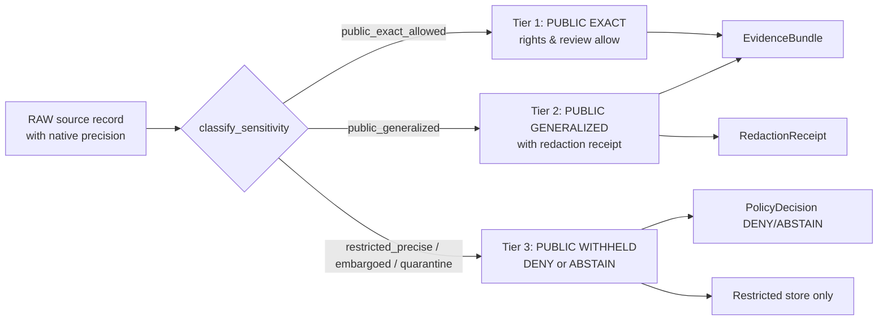

# ADR — Flora Sensitive Location Policy

> **Scope.** Defines the exact-internal vs public-safe geometry thresholds, the
> permitted public exposure shapes, the redaction-receipt obligations, and the
> finite decision outcomes for KFM flora occurrence/specimen/community records
> whose precise location carries elevated harm risk (rare, protected, sensitive,
> or rights-restricted plants).
>
> **Status:** PROPOSED. ADR must precede machine-file proliferation
> (schemas, policy modules, validators, fixtures) that depends on it.

---

## 1. Truth Labels Used in This ADR

| Label | Meaning |
| --- | --- |
| **CONFIRMED** | Verified in this session against attached KFM doctrine PDFs. |
| **PROPOSED** | Design choice not yet verified against a mounted repo. |
| **UNKNOWN** | Not resolvable without further evidence. |
| **NEEDS VERIFICATION** | Checkable, not yet checked strongly enough to act as fact. |

This ADR is authored under the current-session evidence limit: no mounted repo
was inspected. Path placements, validator wiring, route names, and runtime
behavior remain PROPOSED until verified.

---

## 2. Directory Rules Basis for This File's Location

**Requested path.** `docs/domains/flora/governance/adr/ADR-flora-sensitive-location-policy.md`

**Authority root.** `docs/` (canonical, human-facing control plane). Domain
material lives under `docs/domains/<domain>/`, consistent with KFM responsibility-
root discipline (Directory Rules.pdf — Section 4.2 docs/; Greenfield Plan §3).

**Divergence noted.** The Flora Architecture Blueprint (Appendix B) proposes
two homes for this ADR:

1. `docs/adr/ADR-flora-sensitive-location-policy.md` (root ADR home), and
2. `docs/domains/flora/adr/ADR-flora-sensitive-location-policy.md`
   (domain-local ADR home).

The requested path inserts a `governance/` grouping between `flora/` and `adr/`.
This is **PROPOSED** and does not weaken any invariant — it groups rights,
sensitivity, publication, and review ADRs under a governance subdir, which is
consistent with the corpus pattern of a `governance.md` doc family in other
domains (e.g., `kfm_settlements_infrastructure_extended_pro_plan_20260421.pdf`).

**Action required to ratify.** Author **`ADR-flora-doc-lineage-and-supersession`**
locking down whether `docs/domains/flora/governance/adr/` becomes the canonical
home for flora governance-class ADRs (preferred), or whether the file is
relocated under `docs/domains/flora/adr/` or `docs/adr/`. Until ratified, this
ADR carries an internal `path_pending_ratification: true` flag and any back-
references in domain docs should mark the link **PROPOSED**.

**Anti-fragmentation guard.** No parallel ADR home for flora may be created
elsewhere without superseding this ADR or the ratifying lineage ADR.

---

## 3. Context

### 3.1 Why this decision is needed (CONFIRMED doctrine)

Flora is a **public-risk HIGH** domain because some accepted Kansas flora taxa
carry conservation, legal, ethnobotanical, or rights-restricted sensitivity that
makes exact occurrence coordinates harmful to expose. The KFM corpus is
unambiguous:

- KFM Flora Architecture Blueprint §12: *"do not expose exact sensitive
  occurrence points unless rights, policy, and review explicitly allow it.
  Prefer generalized geometry, withheld geometry, denied publication, staged
  access, or delayed publication."*
- KFM Encyclopedia §13 *Sensitive / Deny-by-Default Register* — Rare species:
  *"DENY public exact location; generalized public products only."*
- Greenfield Plan §6.5 (flora): *"Exact rare-location DENY unless reviewed."*
- Components Pass 10 §C6 — sensitivity, redaction, and geoprivacy doctrine.

### 3.2 Threats this policy mitigates

| Threat | Example |
| --- | --- |
| **Targeted collection or destruction** | Exact coordinates of a federally listed orchid or state-tracked rare prairie plant published on a tile layer. |
| **Triangulation across snapshots** | Random per-render jitter that lets multiple tile pulls average back to truth. |
| **Aggregation re-identification** | County-level density combined with habitat raster narrowing a single S1 occurrence to one section. |
| **Source-rights breach** | Republishing precise coordinates from licensed feeds (NatureServe high-precision, KDWP steward review) into a public payload. |
| **Cultural / ethnobotanical exposure** | Publishing exact stands of culturally sensitive plants where steward consultation is required. |
| **Modeled-output-as-truth** | Presenting model-derived range polygons as observed occurrence and exposing pseudo-precise pinpoints. |

### 3.3 Source authority families this policy must defer to (NEEDS VERIFICATION)

| Source family | Role | Default sensitivity treatment |
| --- | --- | --- |
| KDWP listed-plant / steward review | official / steward_reviewed | Steward decision is binding; default DENY public exact. |
| USFWS ECOS listed plants and critical habitat | official | Exact public DENY for listed taxa unless ECOS publishes the precise feature. |
| NatureServe Explorer / Pro (S1, S2 tracked) | institutional / controlled_access / derived_model | Exact public DENY; model summaries separately attributed. |
| State rare plant programs | official / steward_reviewed | Steward gate; default DENY public exact. |
| Herbaria/specimen portals (KANU, KSC, iDigBio, KU Biodiversity Institute) | institutional | Honor `informationWithheld` and georeference precision flags. |
| GBIF vascular plant occurrence | corroborative | Filter on coordinatePrecision, license, sensitive-species masks. |
| iNaturalist (community) | community_observation | Honor "obscured / private" geoprivacy at source; never re-precise. |

**NEEDS VERIFICATION:** Each source's exact sensitivity-flag field name,
endpoint, redistribution terms, and obscure-vs-private semantics must be
verified during source-descriptor onboarding before any public payload is
emitted.

---

## 4. Decision

KFM flora SHALL operate a **three-tier exposure model** with **deny-by-default**
for exact public geometry of any record classified sensitive by taxon status,
source policy, occurrence context, or steward override. Each tier is bound to
required receipts, evidence, and decision envelope outcomes.

### 4.1 Three-tier exposure model (CONFIRMED doctrine; PROPOSED specifics)

| Tier | Exposure | Required gates |
| --- | --- | --- |
| **Tier 1 — Public Exact** | Native or near-native precision permitted in public payloads. | Source rights explicit; sensitivity = `public_exact_allowed`; steward review state = approved or N/A; coordinate uncertainty recorded; EvidenceBundle resolvable. |
| **Tier 2 — Public Generalized** | Cell, polygon, or jittered-aggregate geometry only. Exact geometry remains in restricted store. | RedactionReceipt with method/parameters/digests/reason; EvidenceBundle; review state recorded; precision bucket meets policy floor. |
| **Tier 3 — Public Withheld / Denied** | No public geometry. ABSTAIN at runtime, DENY at promotion. | Restricted store retains exact; PolicyDecision envelope with reason codes; supersession path noted. |

### 4.2 Sensitivity classification inputs (PROPOSED)

`classify_sensitivity(record)` SHALL combine, in order, with first DENY winning:

1. **Source-policy override** (e.g., KDWP steward DENY, NatureServe license).
2. **Legal/conservation status** (USFWS listed, KDWP T/E/SINC, NatureServe S1/S2).
3. **Source-native geoprivacy flags** (`informationWithheld`, GBIF
   `coordinateUncertaintyInMeters`, iNat geoprivacy).
4. **Steward override** (explicit hold or release in
   `data/registry/flora/sensitivity_policies.yaml`).
5. **Occurrence context** (small-population, recently relocated, restoration
   plot with vandalism risk, reintroduction site).
6. **Rights state** (license unknown → ABSTAIN; license forbids derivative →
   DENY public).

### 4.3 PROPOSED default precision floors by status

> These are **PROPOSED** starting points. Final per-status cell sizes require
> steward sign-off and per-source verification (see §10 Open Questions).
> Cells must verify against **k-anonymity at render time** — if a single cell
> contains exactly one record at the chosen resolution, the cell SHALL fall
> back to a coarser resolution or be withheld.

| Status / signal | Default public exposure | Default precision floor |
| --- | --- | --- |
| USFWS listed (Endangered/Threatened) | DENY public exact; Tier 2 only with steward approval | H3 r=4 (~22.6 km edge) or county; never finer than county |
| NatureServe S1 / KDWP Endangered | DENY public exact; Tier 2 only with steward approval | H3 r=4 or county |
| NatureServe S2 / KDWP Threatened | Tier 2 default | H3 r=5 (~8.5 km edge) or HUC-12 |
| KDWP SINC / S3 watch / steward-flagged | Tier 2 default | H3 r=6 (~3.2 km edge) |
| Source `informationWithheld=true` | Honor source; Tier 3 unless steward releases | n/a |
| Embargoed (temporal hold) | Tier 3 until embargo expires | n/a |
| `public_exact_allowed` (non-sensitive, rights clear) | Tier 1 | source-native precision |

**Rationale.** H3 was named in C6-04 as the recommended hex grid because of
stable, reproducible indexing. Resolution choices align density-revealing risk
with expected county-level density of the listed Kansas flora. **NEEDS
VERIFICATION** against actual KDWP and NatureServe datasets at first source
onboarding.

### 4.4 Geometry transforms permitted (CONFIRMED doctrine; PROPOSED parameters)

| Transform | When used | Receipt-required parameters |
| --- | --- | --- |
| **Grid generalization (H3 hex, default)** | Tier 2 default for occurrences. | resolution, cell_id, input_geometry_hash, output_geometry_hash, reason_code. |
| **Grid generalization (square, ST_SnapToGrid)** | Tier 2 alternative when consumer needs square cells. | cell_size_m, snap_origin, hashes, reason. |
| **Polygon generalization (county / HUC / watershed / boundary)** | Tier 2 when administrative boundary is the natural support. | boundary_layer_id, boundary_id, hashes, reason. |
| **Seeded reproducible jitter** | Display-only obfuscation **NEVER for sensitive rare flora as a sole control** (per C6-03 — jitter alone never substitutes for actual obfuscation). May appear on top of a generalized cell to prevent pixel-snapping artifacts. | distribution (uniform/Laplace), radius_m, prng_algorithm, seed_material (`spec_hash + occurrence_id`), salt_ref. |
| **Centroid-with-uncertainty** | Tier 2 fallback for low-density regions where cells reveal near-pinpoint. | centroid, uncertainty_m, source_method. |
| **Differential privacy (aggregates only)** | Tier 2 aggregate count layers only; never raw points (C6-05). | epsilon, delta, mechanism, budget_id. |
| **Withholding** | Tier 3 only. | reason_code, supersession_target. |

**Forbidden.** Random per-render jitter; jitter unsalted with a server-side
secret for the most sensitive classes (server-salt PROPOSED — see §10 Open
Questions); silent field stripping without a transform receipt; client-side
generalization that is not reproducible from receipt.

### 4.5 Required RedactionReceipt fields (PROPOSED schema contract)

Every Tier-2 transform SHALL emit a `flora_redaction_receipt` record. Final
field names belong in `contracts/flora/flora_redaction_receipt.schema.json`
and must reuse the shared `RedactionReceipt` schema if one already exists in
the repo.

| Field | Purpose |
| --- | --- |
| `receipt_id` | URN identity (deterministic hash over content). |
| `record_ref` | URN of source occurrence/specimen/community record. |
| `transform_class` | One of: `grid_generalization`, `polygon_generalization`, `seeded_jitter`, `centroid_with_uncertainty`, `dp_aggregate`, `withholding`. |
| `transform_parameters` | Object documenting all parameters per §4.4. |
| `input_geometry_hash` | sha256 over normalized input geometry (canonical CRS, ring order, precision). |
| `output_geometry_hash` | sha256 over normalized public geometry. Equals `null` for `withholding`. |
| `reason_code` | One of the deny/abstain codes in §5. |
| `policy_version` | Pinned version of `data/registry/flora/sensitivity_policies.yaml`. |
| `policy_decision_ref` | URN of governing PolicyDecision. |
| `actor` | Service or steward identity. |
| `run_id` | Pipeline run reference. |
| `source_refs` | List of contributing source descriptors. |
| `evidence_ref` | Resolves to EvidenceBundle. |
| `before_class`, `after_class` | Tier transition labels. |
| `created_at` | UTC timestamp. |
| `spec_hash` | Stable hash of transform spec (independent of timestamp). |

### 4.6 Decision envelope outcomes (CONFIRMED doctrine)

Every public-facing flora location request resolves to a finite outcome:

- **ANSWER** — Tier 1 with EvidenceBundle, or Tier 2 with EvidenceBundle and
  RedactionReceipt.
- **ABSTAIN** — rights unknown, evidence insufficient, review pending, or
  precision insufficient. No public geometry returned.
- **DENY** — sensitive exact requested for public, rights forbid, or
  generalization cannot meet floor. Reason code returned.
- **ERROR** — schema, validator, or envelope failure. No silent partial output.

### 4.7 Reason codes (CONFIRMED set, EXTENSIBLE)

Drawn from Flora Blueprint §11.1; this ADR pins the canonical subset. Validators
and policy modules SHALL emit exactly these codes for sensitive-location
violations:

- `precise_sensitive_location_denied`
- `geoprivacy_required`
- `public_geometry_not_generalized`
- `invalid_geometry`
- `public_payload_exposes_internal_ref`
- `missing_rights`
- `unknown_rights`
- `review_required`
- `steward_review_missing`
- `model_as_observation` (for modeled range polygons claimed as occurrence)
- `k_anonymity_floor_breached`
- `embargoed_record`

Any new reason code requires this ADR to be superseded or amended via the
ADR-flora-doc-lineage-and-supersession process.

---

## 5. Validators and Gates (PROPOSED wiring)

| Gate | Check | Failure posture |
| --- | --- | --- |
| `flora_public_geometry_safety_validator` | No exact coordinates, restricted IDs, internal refs, or protected attributes leak into public payloads; cell resolution meets §4.3 floor. | DENY; emit RedactionReceipt or quarantine. |
| `flora_redaction_receipt_validator` | All Tier-2 transforms have a complete receipt resolvable to EvidenceBundle, with input/output hashes verifying the transform. | DENY promotion. |
| `flora_sensitivity_policy_compliance` | `data/registry/flora/sensitivity_policies.yaml` schema-valid; per-record classification reproducible. | DENY promotion. |
| `flora_k_anonymity_render_check` | At publish-time precision, no cell contains exactly one record below k-floor (PROPOSED k=2 minimum, k=5 preferred). | Coarsen or withhold. |
| `flora_decision_envelope_validator` | ANSWER carries EvidenceBundle; DENY/ABSTAIN carries reason code; no other terminal states. | ERROR. |
| `flora_public_payload_diff_check` | Released geometry digest matches receipt's `output_geometry_hash`. | DENY publish; rollback. |

Validator paths and CI invocation (`.github/workflows/flora-promotion.yml`)
are PROPOSED and require repo verification.

---

## 6. Consequences

### 6.1 Positive

- **Public-safety default.** Any flora record absent rights, sensitivity
  resolution, or steward review fails closed at the public boundary.
- **Reversible publication.** Every public geometry is reproducible from
  receipts and rollbackable via release-state transition (not file delete).
- **Auditability.** Tier transitions, decisions, and transforms are traceable
  through RedactionReceipt → PolicyDecision → EvidenceBundle → ReleaseManifest.
- **Source-rights honoring.** Honoring `informationWithheld`, GBIF coordinate
  uncertainty, NatureServe license, and steward override is built into the
  classification order, not bolted on.
- **Cross-domain alignment.** Pattern matches Fauna sensitivity model (§12 of
  KFM Fauna Architecture) and Geology public-safe geometry plan (§16 of KFM
  Geology Report); reduces flora-only divergence.

### 6.2 Costs and friction

- **Higher onboarding cost** for sources with non-trivial sensitivity policy
  (NatureServe, KDWP steward review).
- **Steward review queue** becomes a publication critical path. Mitigated by
  Tier-2 default + steward override workflow.
- **Cell-floor coarseness** may frustrate ecological-research users for low-
  density taxa. Mitigated by stewarded research-access channel (separate ADR).
- **k-anonymity render check** requires render-time density inspection; may
  add latency to tile build.

### 6.3 Invariants preserved

- Lifecycle: RAW → WORK/QUARANTINE → PROCESSED → CATALOG/TRIPLET → PUBLISHED.
- Public clients consume governed APIs only; canonical/internal stores never
  exposed.
- Cite-or-abstain default truth posture: ANSWER requires EvidenceBundle.
- Policy-aware fail-safe defaults: classification first DENY wins.
- Deterministic identity: receipts and digests reproducible.
- Promotion is a governed state transition.

### 6.4 Invariants this ADR does not bend

None intentionally. Any apparent bend (e.g., Tier-1 public exact for a
sensitive taxon under explicit steward release) is itself a governed state
transition with reviewable receipts.

---

## 7. Alternatives Considered

### 7.1 Random per-render jitter as primary control — REJECTED

C6-03 is explicit: random-each-render jitter is **triangulable** across
snapshots; deterministic seeded jitter is reviewable but is **not a
substitute for actual obfuscation**. Rejected as a primary control for
sensitive flora; allowed only as a layered cosmetic on top of grid
generalization.

### 7.2 Suppress sensitive records entirely from any public surface — REJECTED

Over-protective; eliminates legitimate Tier-2 ecological public mapping.
Rare-plant range awareness is a public-good output where generalization
preserves utility. Withholding remains the **fallback** (Tier 3), not the
default.

### 7.3 Use coordinate-uncertainty buffering only — REJECTED

Buffering preserves a center point that, with multiple sources, can be
triangulated. Cell snapping breaks this attack model.

### 7.4 Per-record steward judgement only (no policy floors) — REJECTED

Operationally unscalable; produces inconsistent decisions; bypasses
policy-as-code; violates auditability invariant.

### 7.5 Adopt source-native geoprivacy verbatim with no KFM floor — REJECTED

GBIF coordinate uncertainty and iNaturalist obscured radii vary widely and
sometimes drop to zero for sensitive taxa due to source bugs or misclass-
ification. KFM applies its own floors **on top of** source geoprivacy, never
below it.

### 7.6 Differential privacy as primary control on raw points — REJECTED

C6-05 limits DP to **aggregate outputs** (counts, heatmaps). Applied to raw
points it produces noise that can be undone by repeated query or that
misleads users about location.

### 7.7 Place this ADR at `docs/adr/` (root) — DEFERRED

Per §2 Directory Rules basis. The user's requested path is honored; the
ratifying lineage ADR will pick a permanent home.

---

## 8. Migration / Rollback

### 8.1 Migration path (PROPOSED)

1. Land this ADR (PROPOSED status).
2. Author and land `ADR-flora-doc-lineage-and-supersession` ratifying the
   `docs/domains/flora/governance/adr/` home.
3. Land `data/registry/flora/sensitivity_policies.yaml` (P0).
4. Land `contracts/flora/flora_redaction_receipt.schema.json` (P1) — reuse
   shared `RedactionReceipt` schema if one exists per
   `ADR-flora-schema-home`.
5. Land `policy/flora/sensitive_location.rego` and validators.
6. Author `tests/flora/policy/sensitive_location_*` fixtures: a minimum of
   one valid Tier-1 case, one Tier-2 case (with passing receipt), one
   Tier-3 DENY, one DP aggregate case, and one k-anonymity-floor breach.
7. Wire `.github/workflows/flora-promotion.yml` to run the public-geometry
   safety validator on every release dry-run.
8. Move ADR status to `accepted` after the first non-network thin-slice
   proof shows a generalized public flora layer with a verifiable receipt.

### 8.2 Rollback path

- Status → `superseded` by a successor ADR (never delete).
- If a published geometry violates this ADR after acceptance: trigger
  release rollback via `release/rollback/` rollback card, restore prior
  ReleaseManifest, and quarantine the offending record. Receipts and
  proofs are preserved.
- If the underlying schemas change: pin previous schema version and emit
  a compatibility adapter; rolling deletion is forbidden.

---

## 9. Validation

This ADR is itself validated by:

- **Doc lint** of front matter and link targets.
- **ADR-template conformance** (title, status, context, decision,
  consequences, alternatives, migration/rollback present).
- **Cross-reference check**: every related ADR, doctrine doc, machine
  artifact, and reason code listed exists once accepted (currently all
  PROPOSED).
- **Anti-fragmentation check**: no parallel flora sensitive-location ADR
  exists at another path; the schema, policy, and registry homes named
  here align with `ADR-flora-schema-home`.

---

## 10. Open Questions / NEEDS VERIFICATION

1. **k-anonymity floor.** k=2 minimum, k=5 preferred — needs steward
   ratification per status class.
2. **Server-side jitter salt.** Should seeded jitter for the most sensitive
   classes carry a non-public salt to prevent third-party reproduction of
   the offset (per C6-03 open question)? **PROPOSED:** yes for S1/Endangered;
   no for S3/SINC. Pending steward decision.
3. **NatureServe high-precision data.** Lifecycle placement and access class
   for licensed NatureServe Explorer Pro data: restricted-store-only with
   no public derivative, or public summaries only? **PROPOSED:** public
   summaries only; precise data restricted.
4. **eBird / iNat-equivalent for plants.** What is the canonical KFM
   restricted-use registry entry for sources that forbid republication
   (e.g., NatureServe license terms)? Likely a row in
   `data/registry/flora/rights_profiles.yaml`.
5. **Cell-size verification.** Default H3 resolutions in §4.3 must be
   tested against actual Kansas distributions of S1 and S2 flora.
   Currently NEEDS VERIFICATION.
6. **DP epsilon for aggregate flora layers.** Corpus does not commit
   numbers (Pass 10 §C6-05). PROPOSED placeholder ε ∈ [0.1, 1.0] per
   layer with budget tracker; final numbers PENDING.
7. **Embargo windows.** Does flora carry temporal embargo cases
   (e.g., reintroduction-site silence period)? PROPOSED yes for steward-
   flagged restoration plots; standard embargoes UNKNOWN.
8. **Raster vs vector treatment.** Vegetation-index rasters and range
   model outputs may need an analogous tier model (Tier 1 indices, Tier 2
   masked/coarsened, Tier 3 withheld). May warrant a sibling ADR
   `ADR-flora-modeled-output-policy` rather than expanding this one.
9. **Cross-domain habitat overlay leakage.** When habitat-association
   covariates are combined with generalized flora cells, can the joint
   layer narrow location below the policy floor? Validation hook needed.
10. **Public review/correction surface.** What is the user-visible
    explanation when an ABSTAIN/DENY occurs in Focus Mode? Pending UI
    Evidence Drawer copy doctrine.

---

## 11. Affected Files / Artifacts (PROPOSED inventory)

| Path | Role | Action | Priority |
| --- | --- | --- | --- |
| `docs/domains/flora/governance/adr/ADR-flora-sensitive-location-policy.md` | This ADR | create (PROPOSED) | P0 |
| `docs/domains/flora/governance/adr/ADR-flora-doc-lineage-and-supersession.md` | Ratify governance/ subdir | create | P0 |
| `docs/domains/flora/PUBLICATION_AND_POLICY.md` | Living doctrine | update with reference to this ADR | P0 |
| `docs/domains/flora/ARCHITECTURE.md` | Architecture doc | update §sensitivity section to point here | P1 |
| `docs/domains/flora/VERIFICATION_BACKLOG.md` | Open verifications | append §10 items | P1 |
| `data/registry/flora/sensitivity_policies.yaml` | Machine policy registry | create | P0 |
| `data/registry/flora/rights_profiles.yaml` | Rights profile registry | create | P0 |
| `contracts/flora/flora_redaction_receipt.schema.json` | Receipt schema | create (or reuse shared) | P0 |
| `contracts/flora/flora_decision_envelope.schema.json` | Envelope schema | reuse shared | P0 |
| `policy/flora/sensitive_location.rego` | Policy module | create | P0 |
| `tools/validators/flora/public_geometry_safety.py` | Validator | create | P0 |
| `tests/flora/policy/sensitive_location_valid_tier1.json` | Fixture | create | P0 |
| `tests/flora/policy/sensitive_location_tier2_with_receipt.json` | Fixture | create | P0 |
| `tests/flora/policy/sensitive_location_tier3_deny.json` | Fixture | create | P0 |
| `tests/flora/policy/sensitive_location_k_anon_breach.json` | Fixture | create | P0 |
| `.github/workflows/flora-promotion.yml` | Promotion CI | wire validator | P0 |

All paths PROPOSED until confirmed against mounted repo per
`ADR-flora-schema-home`.

---

## 12. Evidence Basis

This ADR is grounded in the attached KFM doctrine PDFs:

- `KFM_Flora_Architecture_PDF_Only_Implementation_Blueprint.pdf` — §11.1
  policy deny/quarantine cases; §12 Flora Sensitivity and Public Safety;
  Appendix B proposed directory tree.
- `KFM_Components_Pass_10_Idea_Index_Category_Atlas_and_Expansion_Dossier.pdf`
  — C6-02 redaction profiles; C6-03 seeded jitter; C6-04 grid generalization;
  C6-05 differential privacy for aggregates; C6-06 k-anonymity.
- `kfm_encyclopedia.pdf` — §13 Sensitive / Deny-by-Default Register;
  §7.6 Flora.
- `Kansas_Frontier_Matrix_Definitive_Greenfield_Building_Plan.pdf` — §6.5
  flora; Decision Register.
- `Directory_Rules.pdf` — canonical and compatibility roots; responsibility-
  root principle.
- `KFM_Fauna_Architecture_PDF_Only_Report.pdf` — sibling sensitivity-
  policy pattern (§12).
- `KFM_Geology_Natural_Resources_Architecture_PDF_Only_Report_20260421.pdf`
  — §16 public-safe geometry and redaction plan (cross-domain pattern).
- `KFM_Components_Pass_11_Part_2_Idea_Index_Category_Atlas_and_Expansion_Dossier.pdf`
  — J.4.1 ADR template (status, context, decision, consequences,
  alternatives).

**Current-session evidence limit acknowledged.** No mounted repo, tests,
manifests, workflows, dashboards, or logs were inspected. All
implementation paths are PROPOSED. Doctrine claims are CONFIRMED from
attached PDFs. Numeric thresholds (cell sizes, k-floor, DP epsilon) are
PROPOSED defaults pending steward review and source-onboarding verification.
