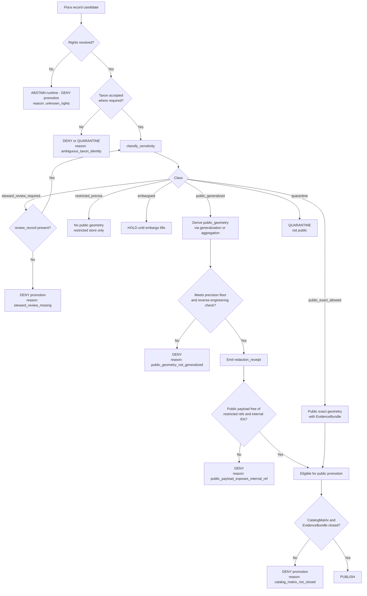

<!-- [KFM_META_BLOCK_V2]
doc_id: kfm://doc/adr/flora-sensitive-location-policy
title: ADR — Flora Sensitive Location Policy
type: standard
subtype: adr
version: v0.1
status: draft
owners: TBD — flora-steward, governance-steward, policy-steward
created: 2026-05-08
updated: 2026-05-08
policy_label: public
related:
  - docs/domains/flora/PUBLICATION_AND_POLICY.md
  - docs/domains/flora/governance/adr/ADR-flora-public-layer-strategy.md
  - docs/domains/flora/governance/adr/ADR-flora-source-roles.md
  - docs/domains/flora/governance/adr/ADR-flora-schema-home.md
  - data/registry/flora/sensitivity_policies.yaml
  - policy/flora/sensitivity.rego
  - policy/flora/publish.rego
tags: [kfm, adr, flora, sensitivity, geoprivacy, publication, policy]
notes:
  - Path PROPOSED — see "Path placement" note below; reconcile with ADR-flora-schema-home.md and any docs/adr authority decision.
  - Tests/policy/registry consumers are PROPOSED until ADR is accepted and downstream files land.
[/KFM_META_BLOCK_V2] -->

# ADR — Flora Sensitive Location Policy

> **Define the boundary between exact internal geometry and public-safe geometry for rare, protected, and culturally sensitive flora — and the receipts, reason codes, and review states that make that boundary auditable.**

<!-- Top-of-file impact block -->


| Field | Value |
|---|---|
| **ADR number** | `ADR-flora-sensitive-location-policy` (assign sequence on acceptance) |
| **Status** | **PROPOSED** |
| **Supersedes** | _none_ |
| **Superseded by** | _none_ |
| **Owners** | `TBD — flora-steward · governance-steward · policy-steward` |
| **Reviewers required** | flora steward · governance steward · policy steward · UI/API steward |
| **Decision date** | _pending_ |
| **Public-risk class** | **HIGH** — rare-species exact-location exposure can enable harm |

**Quick jump:** [Context](#1-context) · [Decision](#2-decision) · [Sensitivity classes](#3-sensitivity-classes) · [Public-safe geometry](#4-public-safe-geometry) · [Receipts](#5-receipts) · [Reason codes](#6-reason-codes) · [Decision flow](#7-decision-flow) · [Consequences](#8-consequences) · [Alternatives](#9-alternatives-considered) · [Validation](#10-validation--enforcement) · [Open questions](#11-open-questions--verification-backlog)

---

## 0. Path placement (NEEDS VERIFICATION)

This ADR is being authored at:

```
docs/domains/flora/governance/adr/ADR-flora-sensitive-location-policy.md
```

The KFM Flora blueprint corpus references **three** candidate homes for ADRs of this kind, and the chosen home should be reconciled before machine-file consumers (policies, registries, schemas) reference this ADR's slug:

| Candidate path | Source signal | Status |
|---|---|---|
| `docs/adr/ADR-flora-sensitive-location-policy.md` | Flora Blueprint §"Exact path" register; Directory Rules `docs/adr/` lane | **PROPOSED** |
| `docs/domains/flora/adr/ADR-flora-sensitive-location-policy.md` | Flora Blueprint Appendix B proposed tree | **PROPOSED** |
| `docs/domains/flora/governance/adr/...` (this file) | User-requested path; consistent with a per-domain governance subtree | **PROPOSED — NEEDS VERIFICATION** |

> [!IMPORTANT]
> Per the Directory Rule (`Directory_Rules.pdf`), domain content belongs under the appropriate responsibility root, not as a new root-level domain folder. `docs/domains/flora/.../adr/` is a valid domain-scoped governance home; `docs/adr/` is a valid repo-wide governance home. Both can coexist if `ADR-flora-schema-home.md` (or an equivalent `ADR-doc-home`) records the split. **This ADR does not pre-decide that question** — when `ADR-flora-schema-home.md` lands, update this file's path or add a redirect note as needed.

---

## 1. Context

CONFIRMED doctrine across the KFM corpus:

- The **Flora** domain owns plant taxonomy, specimen and occurrence evidence, **rare plants**, vegetation communities, invasive plants, phenology, and habitat associations. It must not expose **exact sensitive plant locations** publicly.
- The KFM **Sensitive / Deny-by-Default Register** lists *rare species — exact taxa occurrence/nest/den/roost/spawning sites* with the default outcome **DENY public exact location; generalized public products only**, requiring a geoprivacy transform receipt and steward review.
- The Flora Blueprint records that **"exact rare plant locations fail closed"** and that public layers must carry only generalized public surfaces with no exact coordinates, no restricted source IDs, and no internal refs.
- The Definitive Greenfield Building Plan summarizes flora's public-safe output rule as **"Generalized public outputs; exact rare-location DENY unless reviewed."**

What the corpus does **not** yet pin down — and what this ADR exists to settle — is the operational **threshold**, **vocabulary**, and **receipt contract** that turn this doctrine into something a validator, a Rego policy, a steward review, and a public layer can each act on without ambiguity.

### Why this matters

Rare-plant location exposure is a **HIGH public-risk** failure mode. Population-scale harms include:

- Targeted collection of orchids, cacti, and rare endemics for the horticultural and specimen trade.
- Habitat trampling at small or single-population sites where any visitation is a meaningful disturbance.
- Cascade exposure when a public layer joins an exact occurrence to a habitat polygon, vegetation index pixel, or steward-only field note.
- Reverse-engineering of restricted geometry from generalized layers when the generalization parameters are too coarse, too fine, or inconsistent across releases.

The cost of getting this wrong is asymmetric: a too-conservative public layer is a usability problem; a too-permissive one is a conservation problem with no clean remediation path once data is published.

> [!CAUTION]
> Once an exact sensitive coordinate is published, it cannot be unpublished from caches, mirrors, downloads, or screenshots. **Default deny is the only safe posture** until rights, sensitivity, and review explicitly authorize otherwise.

---

## 2. Decision

The Flora domain adopts the following policy. Each clause is normative for the flora knowledge subsystem and is enforced by the validators, registries, and Rego policies enumerated in §10.

### 2.1 Default posture: **deny exact public flora geometry**

For any flora object whose taxon, source, steward, rights, or context places it in a sensitive class, the default public outcome is:

- **DENY** exact public geometry.
- Permit a **generalized**, **withheld**, or **suppressed** public surface only when the sensitivity class, rights, and review state authorize it and a transform receipt is recorded.
- Permit exact public geometry **only** when the sensitivity classifier returns `public_exact_allowed` with explicit rights, source geoprivacy permission, and review state.

### 2.2 Two-store geometry split

| Geometry role | Store | Visibility |
|---|---|---|
| `restricted_geometry_ref` (exact, internal) | Restricted/governed store under access policy | Steward / authorized roles only |
| `public_geometry` (generalized / withheld / suppressed) | Public layer bundles, governed API public envelopes, Evidence Drawer payloads | Public, only after policy + review pass |

Internal precise geometry **never** appears in a public payload. Public payloads carry only the public role, plus a reference to the redaction/geoprivacy receipt.

### 2.3 Every transform leaves a receipt

Any transform that converts internal geometry into a public-safe form **must** emit a `redaction_receipt` (or `geoprivacy_receipt`) recording — at minimum — method, parameters, input digest, output digest, policy version, reason code, and the source/review refs that authorized the transform. Fields are never silently stripped.

### 2.4 Promotion is gated, not implicit

Promotion of a flora record to a public release requires:

1. Sensitivity classification result (§3) and a matching public geometry derivation (§4).
2. Receipt(s) (§5) linked to source and policy.
3. Required steward review where the sensitivity class demands it.
4. Resolved rights/license state.
5. EvidenceBundle and CatalogMatrix closure.

If any of these fail, the public outcome is **DENY** with a finite reason code (§6) — never silent omission.

---

## 3. Sensitivity classes

INFERRED from the corpus's Fauna sensitivity vocabulary, adapted for Flora consistent with the Flora Blueprint's "Flora Sensitivity and Public Safety" controls. **PROPOSED** as the binding flora vocabulary, pending acceptance of this ADR.

| Class | Meaning | Public geometry behavior |
|---|---|---|
| `public_exact_allowed` | Non-sensitive taxon, rights allow public exact geometry, source geoprivacy allows it, no steward override. | Exact public geometry may publish with evidence and rights. |
| `public_generalized` | Record may publish only at county / grid / watershed / bbox / generalized support. | Generalized or aggregated geometry **plus** redaction receipt. |
| `restricted_precise` | Precise coordinates protected by taxon listing, source policy, steward decision, or rare-plant program. | **No public precise geometry.** Restricted store only. |
| `embargoed` | Temporal delay required (e.g., active monitoring, undisclosed survey window, sensitive phenology event). | No public record until embargo lifts; public summary only. |
| `steward_review_required` | Human steward review required before any release class can be assigned. | **HOLD.** No public promotion. |
| `quarantine` | Rights, sensitivity, taxonomy, geometry, or source role unresolved. | **QUARANTINE.** Not public. |

**Classification inputs** (PROPOSED): taxon status (federal / state / NatureServe rank / state rare-plant program), source geoprivacy flags, occurrence context, coordinate uncertainty, life-stage / phenology window, steward overrides, rights/license terms, cultural-sensitivity flags from steward review.

**Classification function** (PROPOSED): `classify_sensitivity(record, status_records, source_policy) -> SensitivityClass` — concrete signature lives in `policy/flora/sensitivity.rego` and the flora policy package, and is bound by this ADR's vocabulary.

> [!NOTE]
> The Flora corpus also recognizes **culturally sensitive** plants (e.g., ceremonial or food-tradition species under Tribal stewardship). These are not separately classed here; instead, steward review can lift any record into `restricted_precise`, `embargoed`, or `steward_review_required` regardless of legal listing status.

---

## 4. Public-safe geometry

CONFIRMED doctrine: every public flora layer must be **generalized**, **withheld**, or **denied** when sensitivity rules require it. This ADR specifies the public-safe forms and the precision floor.

### 4.1 Public-safe forms

| Form | When used | Floor / parameters (PROPOSED) |
|---|---|---|
| **Generalized point → polygon** (grid / hex / watershed / county) | `public_generalized` for occurrences | Grid cell size declared per species class; never finer than the smallest cell that protects the population. |
| **Generalized polygon → enclosing region** | `public_generalized` for vegetation communities, range polygons, or community boundaries with sensitive members | Enclosing administrative or ecological region recorded; original boundary precision **not** disclosed. |
| **Withheld** | Sensitivity high enough that even a generalized cell would expose the population | No public geometry; public payload may carry attribute summary with no spatial component. |
| **Suppressed (no public record at all)** | `restricted_precise`, `embargoed`, `steward_review_required`, `quarantine` for a release window | No public envelope is emitted; promotion blocked with a reason code. |

### 4.2 Precision floor

PROPOSED parameters — each is a registry-driven value, not a hard-coded number, so it can evolve without code change:

- **Generalization cell size**, declared per `sensitivity_policies.yaml` entry.
- **Minimum count threshold** for aggregation (a cell with fewer than _n_ records may not publish, to prevent k-anonymity failures).
- **Coordinate uncertainty floor** for any public exact point, when `public_exact_allowed`.
- **Reverse-engineering check**: a fixture-based assertion that joining a public layer to any other public KFM layer cannot recover a precise location below the floor.

### 4.3 Forbidden public-payload contents

A public flora payload **must not** contain any of the following, even if syntactically present in the source record:

- Restricted geometry references (`restricted_geometry_ref`, internal point fields).
- Internal-only source IDs, run IDs, raw fetch URIs from RAW / WORK / QUARANTINE refs.
- Steward notes, restricted-access source attribution, or controlled-access taxon details.
- Joinable attributes (e.g., precise habitat polygon ID, exact ownership parcel) that would recover a precise location through join.

The validator `assert_no_restricted_geometry_in_public_payload(payload)` (PROPOSED) **fails closed** on any of these.

---

## 5. Receipts

Every transform that takes a sensitive flora record toward a public surface must produce one of the following receipts, stored under `data/receipts/flora/` (PROPOSED home; reconcile with `ADR-flora-schema-home.md`).

### 5.1 `redaction_receipt` / `geoprivacy_receipt`

Required fields (PROPOSED — exact JSON shape lives in the schema once `ADR-flora-schema-home.md` is accepted):

- `record_ref` — link to source flora record (internal ID; not exposed publicly).
- `transform_class` — `generalize_to_grid`, `generalize_to_polygon`, `withhold`, `suppress`, `aggregate`, `embargo`.
- `transform_parameters` — cell size, polygon kind, embargo window, etc.
- `policy_version` — version of `policy/flora/sensitivity.rego` and `data/registry/flora/sensitivity_policies.yaml` that authorized the transform.
- `reason_code` — one of the codes in §6.
- `before_geometry_hash` — deterministic hash of the input geometry (canonicalized).
- `after_geometry_hash` — deterministic hash of the output geometry (canonicalized).
- `actor_or_run` — system actor or run ID; reviewer ID where allowed.
- `source_refs` and `evidence_refs` — links into the EvidenceBundle.
- `created_at` — ISO 8601 timestamp.

### 5.2 `quarantine_receipt`

Emitted when a record falls into `quarantine`. Records the reason code and the unresolved fields (rights, sensitivity, taxonomy, geometry, source role).

### 5.3 `review_record` linkage

When `steward_review_required` is the class, promotion cannot proceed until a `review_record` exists, its scope matches the target release, and it is referenced from the `redaction_receipt` (or absence thereof).

---

## 6. Reason codes

CONFIRMED examples drawn from the Flora Blueprint policy table; PROPOSED as the binding closed set for flora release decisions. Additions require an ADR amendment.

| Code | When emitted | Outcome |
|---|---|---|
| `precise_sensitive_location_denied` | Public surface attempted to carry exact geometry for a sensitive flora record. | **DENY** publication; receipt required. |
| `geoprivacy_required` | Source geoprivacy flag present; cannot publish exact geometry. | **DENY** exact-public; emit generalized form if policy allows. |
| `public_geometry_not_generalized` | Public payload geometry below the precision floor in §4.2. | **DENY**; redo generalization. |
| `invalid_geometry` | Public geometry fails geometry validity (rings, CRS, bbox). | **DENY** or **QUARANTINE**. |
| `controlled_access_publication_denied` | Source under controlled access; rights do not permit public derivative. | **DENY**. |
| `unknown_rights` | Rights/license state unresolved. | **ABSTAIN** at runtime; **DENY** promotion. |
| `review_required` / `steward_review_missing` | Class is `steward_review_required`; no matching `review_record`. | **DENY** promotion. |
| `public_payload_exposes_internal_ref` | Payload carries RAW / WORK / QUARANTINE refs or restricted IDs. | **DENY**. |
| `model_as_observation` | Modeled output (range, suitability, vegetation index) presented as observed truth. | **DENY**. |
| `ambiguous_taxon_identity` / `accepted_taxon_required` | Accepted taxon not resolved when required. | **DENY** or **QUARANTINE**. |
| `catalog_matrix_not_closed` / `proof_bundle_incomplete` | Catalog/proof closure failed. | **DENY** promotion. |
| `ai_missing_evidence_bundle_or_citations` | AI-generated flora answer not anchored to a released EvidenceBundle. | **DENY** AI answer at the boundary. |

---

## 7. Decision flow

The Mermaid diagram below shows the classification → public geometry → publication flow this ADR commits to. It is the canonical reference for `policy/flora/sensitivity.rego` and `policy/flora/publish.rego` (PROPOSED) and for the validators in §10.



---

## 8. Consequences

### 8.1 Positive

- **Auditable boundary.** Every public flora geometry is the output of a recorded transform with a hash-anchored receipt; nothing reaches a public surface by accident.
- **Reversible release.** Because receipts and review records are first-class objects, a release can be rolled back and the rollback explained without reconstructing intent.
- **Composable controls.** The same vocabulary (`SensitivityClass`, reason codes, receipt fields) is reusable across ingest, promotion, governed API runtime, Evidence Drawer, Focus Mode, and search/graph projections.
- **Cross-domain consistency.** Aligning flora's class vocabulary with the Fauna pattern (and the Sensitive / Deny-by-Default Register more broadly) lowers the cost of cross-domain reasoning and shared geoprivacy machinery.

### 8.2 Costs and tradeoffs

- **Engineering cost.** Requires schemas, registries, Rego policies, validators, fixtures, and CI gates. This ADR explicitly demands them before machine-file proliferation; expect a real onboarding burden for the first slice.
- **UX cost.** Public flora layers will be deliberately less precise than the underlying data. Users who want exact occurrence data must go through governed access, not the public map.
- **Steward burden.** Sensitivity classification of borderline taxa is non-trivial and requires named flora stewards to be reachable. The `steward_review_required` class makes this visible rather than hiding it in source.
- **Asymmetric remediation.** Over-restriction can be relaxed through review; over-publication cannot be retracted. This ADR is intentionally biased toward over-restriction.

### 8.3 Files this ADR enables (PROPOSED)

| Path | Role | Status |
|---|---|---|
| `data/registry/flora/sensitivity_policies.yaml` | Per-taxon / per-source / per-status sensitivity rules and generalization parameters. | PROPOSED |
| `policy/flora/sensitivity.rego` | Rego policy implementing `classify_sensitivity` and `derive_public_geometry`. | PROPOSED |
| `policy/flora/publish.rego` | Publication allow/deny rules referencing this ADR's reason codes. | PROPOSED |
| `policy/flora/review.rego` | Steward-review requirements per sensitivity class. | PROPOSED |
| `tools/validators/flora/validate_public_payloads.py` | Asserts public payloads carry no restricted refs and meet the precision floor. | PROPOSED |
| `tests/fixtures/flora/policy/` | Rare-plant DENY fixtures, generalized-OK fixtures, embargo fixtures, quarantine fixtures. | PROPOSED |
| `schemas/contracts/v1/flora/redaction_receipt.schema.json` (or `contracts/flora/...`) | Schema for the receipt object, per `ADR-flora-schema-home.md`. | PROPOSED |
| `docs/domains/flora/PUBLICATION_AND_POLICY.md` | Human-facing publication and policy doc citing this ADR. | PROPOSED |

---

## 9. Alternatives considered

<details>
<summary><b>A. Per-record opt-in to public exact geometry (default-allow with explicit deny)</b></summary>

Rejected. Default-allow on a HIGH public-risk class fails closed only when authors remember to flag sensitivity. The corpus's Sensitive / Deny-by-Default Register and the broader KFM trust posture (cite-or-abstain; fail-safe defaults where risk matters) require deny-by-default.
</details>

<details>
<summary><b>B. A single global cell size for all generalization</b></summary>

Rejected. Different rare-plant species and source families need different precision floors — a hex appropriate for a widespread state-rare grass is wildly inappropriate for a single-population endemic. Cell size belongs in `sensitivity_policies.yaml`, not in code.
</details>

<details>
<summary><b>C. Run sensitivity logic inside the public layer build only</b></summary>

Rejected. Sensitivity gating must run at promotion (governed transition), not at layer-build time. If the gate lives only in a build script, a downstream consumer of the canonical store (Focus Mode, governed API, search index, graph projection) can leak exact geometry. This ADR places gating at the trust membrane: promotion. Layer build inherits a public-safe geometry that is already redacted.
</details>

<details>
<summary><b>D. Treat all flora as restricted by default and require per-record review</b></summary>

Rejected as too strict for the maintenance reality. Most common, non-listed plant occurrences carry no sensitivity risk; routing all of them through human review would starve steward attention from the records that actually need it. The `public_exact_allowed` class exists precisely so that low-risk records can move without ceremony, while the policy still fails closed for sensitive cases.
</details>

<details>
<summary><b>E. Use only withheld / suppressed (no generalization)</b></summary>

Rejected. Withholding is the right answer for the most sensitive cases, but a public-safe map of generalized rare-plant occurrence cells is genuinely valuable for conservation reporting, restoration prioritization, and public engagement. Generalization with a documented precision floor and reverse-engineering check delivers that value without exposing populations. Withholding remains the fallback when generalization cannot be made safe.
</details>

---

## 10. Validation & enforcement

PROPOSED — the validators below land alongside this ADR's downstream files (§8.3). Until they exist, this ADR is **doctrine without enforcement**, and its claims about runtime behavior are PROPOSED, not CONFIRMED.

| Gate / validator | What it checks | Failure posture |
|---|---|---|
| Schema validity | Flora payloads validate against current schema and version. | ERROR / DENY promotion. |
| Geometry validity | Valid GeoJSON, bbox, CRS declared and normalized, rings valid. | QUARANTINE or DENY. |
| Coordinate precision / uncertainty | `coordinate_uncertainty_m`, georeference protocol, precision bucket present and consistent. | DENY exact-public sensitive cases; ABSTAIN if precision insufficient. |
| Sensitivity classification | `classify_sensitivity` returns a value in §3 and matches registry rules. | ERROR if missing; DENY if mismatch. |
| Public geometry derivation | `derive_public_geometry` output meets the §4.2 floor and reverse-engineering check. | DENY with `public_geometry_not_generalized`. |
| Public payload sanity | `assert_no_restricted_geometry_in_public_payload` finds no restricted refs, internal IDs, or joinable identifiers. | DENY with `public_payload_exposes_internal_ref`. |
| Rights / license state | Explicit license/terms; controlled-access obligations enforced. | ABSTAIN unknown rights; DENY prohibited. |
| Review-required flags | Promotion has matching `review_record` in scope where required. | DENY with `steward_review_missing`. |
| Receipt integrity | `redaction_receipt` fields complete, hashes match, policy version pinned. | DENY; emit quarantine receipt. |
| AI / Focus Mode boundary | AI flora answers cite released EvidenceBundle; no sensitive coordinate disclosure. | DENY with `ai_missing_evidence_bundle_or_citations`. |
| Catalog / proof closure | STAC / DCAT / PROV / manifest / proof refs close and digests align. | DENY promotion. |

---

## 11. Open questions / verification backlog

These items must be resolved before this ADR moves from **PROPOSED** to **ACCEPTED**.

- [ ] **NEEDS VERIFICATION** — final ADR home: `docs/adr/`, `docs/domains/flora/adr/`, or `docs/domains/flora/governance/adr/`. Reconcile with `ADR-flora-schema-home.md` and any repo-wide ADR-home decision.
- [ ] **NEEDS VERIFICATION** — exact JSON shape of `redaction_receipt` / `geoprivacy_receipt` (deferred to schema home ADR).
- [ ] **NEEDS VERIFICATION** — registry shape for `data/registry/flora/sensitivity_policies.yaml` (per-taxon, per-source, per-status keys; precedence order).
- [ ] **UNKNOWN** — initial generalization cell sizes per sensitivity tier (likely watershed / county for `public_generalized`; need flora-steward input on rare-plant program tiers).
- [ ] **UNKNOWN** — minimum-count threshold for aggregated cells (k-anonymity floor).
- [ ] **NEEDS VERIFICATION** — list of upstream sources whose terms require explicit `controlled_access_publication_denied` handling (NatureServe Pro, KDWP Ecological Review, KU Biodiversity Institute restricted records — each tied to its own activation rule).
- [ ] **NEEDS VERIFICATION** — coordination with Tribal stewards on culturally sensitive plants; whether a separate `cultural_sensitivity` flag is needed in addition to existing classes, or whether steward overrides are sufficient.
- [ ] **NEEDS VERIFICATION** — alignment of this ADR's reason-code set with the cross-domain reason-code register (if one exists or is being created).
- [ ] **NEEDS VERIFICATION** — whether AI/Focus-Mode disclosure rules (`ai_missing_evidence_bundle_or_citations`, sensitive-coordinate denial) belong here or in a dedicated `ADR-flora-ai-disclosure-policy.md`.
- [ ] **PROPOSED** — adopt this ADR's vocabulary as the **flora** binding; revisit cross-domain harmonization when the Fauna and Archaeology equivalents land.

---

## 12. References

**KFM doctrine and architecture sources (CONFIRMED in attached corpus):**

- KFM Flora Architecture — PDF-Only Implementation Blueprint · §11 Validators · §11.1 Policy deny / quarantine cases · §12 Flora Sensitivity and Public Safety · §13 Pipelines, Watchers, and Normalization · Appendix B Proposed Directory Tree.
- KFM Domain and Capability Encyclopedia · §7.6 Flora · §13 Sensitive / Deny-by-Default Register.
- Kansas Frontier Matrix — Definitive Greenfield Building Plan · §6.5 flora · Phase plans.
- Kansas Frontier Matrix — Directory Rules · responsibility-root rule for domain content; `docs/adr/` and `docs/domains/<domain>/` lanes.
- KFM Fauna Architecture PDF-Only Report · §12 Sensitivity and geoprivacy plan (cross-domain pattern source for the `SensitivityClass` vocabulary).
- KFM Geology & Natural Resources Architecture · §16 Public-safe geometry and redaction plan (cross-domain pattern source for receipt obligations).

**Related ADRs (PROPOSED siblings):**

- `ADR-flora-schema-home` — schema/contract home (must precede machine-file proliferation).
- `ADR-flora-source-roles` — source-role vocabulary and authority boundaries.
- `ADR-flora-public-layer-strategy` — MapLibre public layer strategy and generalization presentation.

**Related downstream files (PROPOSED — see §8.3):**

- `data/registry/flora/sensitivity_policies.yaml`
- `policy/flora/{sensitivity,publish,review,rights,promotion,ai}.rego`
- `tools/validators/flora/validate_public_payloads.py`
- `docs/domains/flora/PUBLICATION_AND_POLICY.md`

---

[↑ Back to top](#adr--flora-sensitive-location-policy)
