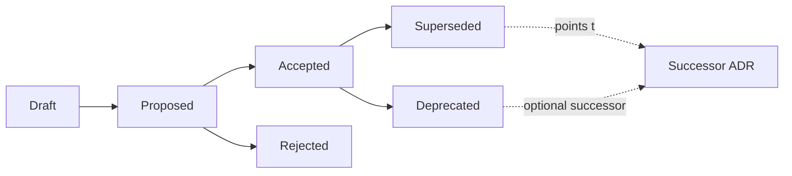

<!-- [KFM_META_BLOCK_V2]
doc_id: kfm://doc/flora-governance-adr-readme
title: Flora Governance — ADR Index
type: standard
version: v1
status: draft
owners: Flora steward; Architecture steward
created: 2026-05-08
updated: 2026-05-08
policy_label: public
related:
  - docs/domains/flora/README.md
  - docs/domains/flora/ARCHITECTURE.md
  - docs/domains/flora/PUBLICATION_AND_POLICY.md
  - docs/adr/README.md
  - contracts/flora/
  - policy/flora/
tags: [kfm, flora, adr, governance, doctrine]
notes:
  - PROPOSED path; the docs/domains/flora/governance/ lane is not yet visible in repo evidence.
  - PROPOSED home divergence from Flora Architecture Appendix B (docs/domains/flora/adr/) and from the repo-wide docs/adr/ registry — must be reconciled by an ADR before any Flora ADRs land here.
[/KFM_META_BLOCK_V2] -->

# Flora Governance — Architecture Decision Records (ADRs)

Domain-local index for Flora-scoped Architecture Decision Records. Decisions land here only when they govern Flora schemas, source roles, sensitivity, publication eligibility, or lane invariants — and only after their schema, contract, policy, and rollback implications have been written down.

> [!IMPORTANT]
> **Status:** experimental. No Flora ADRs are landed yet. Every entry below is **PROPOSED** and depends on repo conventions being verified. Path itself (`docs/domains/flora/governance/adr/`) is **PROPOSED** — see [Open questions](#open-questions).

---

## Top of file

| Field | Value |
| --- | --- |
| **Status** | experimental |
| **Owners** | Flora steward · Architecture steward |
| **Lane** | `docs/domains/flora/governance/adr/` *(PROPOSED)* |
| **Authority** | Decision record (lane-scoped) |
| **Audience** | Maintainers · Reviewers · Schema / Policy / UI stewards |

<!-- Badges are Shields.io placeholders; CI integration is NEEDS VERIFICATION -->


**Quick jump:**
[Scope](#scope) ·
[Repo fit](#repo-fit) ·
[What belongs here](#what-belongs-here) ·
[What does not belong here](#what-does-not-belong-here) ·
[ADR index](#adr-index) ·
[Lifecycle](#adr-lifecycle) ·
[Authoring](#authoring-an-adr) ·
[Template](#adr-template) ·
[Status legend](#status-legend) ·
[Naming](#naming-and-numbering) ·
[Supersession](#supersession-and-deprecation) ·
[Validation](#validation-and-gates) ·
[Related](#related-folders) ·
[FAQ](#faq) ·
[Open questions](#open-questions)

---

## Scope

This folder is the canonical home for **Flora-scoped Architecture Decision Records (ADRs)** — the auditable record of structural decisions that bind Flora schemas, registries, policy, publication rules, and UI surfaces.

ADRs precede machine-file proliferation: a Flora schema, registry shape, public layer, or sensitivity rule should not be cast into code until the decision behind it has been written down here. ADRs are **versioned and never deleted** — decisions are accepted, rejected, deprecated, or superseded; never silently revised.

[Back to top ↑](#flora-governance--architecture-decision-records-adrs)

## Repo fit

**Path (PROPOSED):** `docs/domains/flora/governance/adr/`

Upstream:
- [`docs/domains/flora/README.md`](../../README.md) — Flora lane entrypoint and status map
- [`docs/domains/flora/ARCHITECTURE.md`](../../ARCHITECTURE.md) — End-to-end lane architecture
- [`docs/adr/`](../../../../adr/) — Repo-wide ADR registry (cross-domain decisions)

Downstream (decisions here constrain these):
- `contracts/flora/` *(or `schemas/contracts/v1/flora/`)* — Schema home, gated by `ADR-flora-schema-home`
- `policy/flora/` — Rego rules, gated by source-role and sensitivity ADRs
- `data/registry/flora/` — Source / role / sensitivity / layer registries
- `apps/governed_api/` — DTOs and routes, gated by public-surface ADRs

> [!NOTE]
> All paths above are **PROPOSED**. The repository has not been inspected in this session; verify each link target and root location before creating files.

## What belongs here

- Decisions that **bind** Flora schemas, registries, policy, sensitivity rules, or public UI surfaces.
- Decisions whose **rationale** must survive personnel turnover.
- Decisions that **precede** machine-file proliferation (schemas, validators, layers, policy).
- Lane-internal decisions whose impact does not cross into other domains.

## What does not belong here

| Out of scope | Belongs in |
| --- | --- |
| Operational step-by-step procedures | [`docs/domains/flora/runbooks/`](../../runbooks/) |
| Domain change history | [`docs/domains/flora/CHANGELOG.md`](../../CHANGELOG.md) |
| Cross-domain or repo-wide doctrine | [`docs/adr/`](../../../../adr/) · [`docs/doctrine/`](../../../../doctrine/) |
| Unpromoted ideas / parking lot | [`docs/domains/flora/IDEA_INTAKE.md`](../../IDEA_INTAKE.md) |
| Open verification tasks | [`docs/domains/flora/VERIFICATION_BACKLOG.md`](../../VERIFICATION_BACKLOG.md) |
| Schema field definitions | `contracts/flora/*.schema.json` |
| Policy expressions (Rego) | `policy/flora/*.rego` |
| Term definitions / vocabulary | [`docs/domains/flora/GLOSSARY.md`](../../GLOSSARY.md) |

[Back to top ↑](#flora-governance--architecture-decision-records-adrs)

## ADR index

> All entries are **PROPOSED**. None have landed in repo evidence in this session. Decisions, priorities, and titles are drawn from the Flora Architecture blueprint (file reference matrix).

| # | ADR | Decision | Priority | Status |
| :-: | --- | --- | :-: | :-: |
| 1 | `ADR-flora-schema-home.md` | Resolve `contracts/flora/` vs `schemas/contracts/v1/flora/` placement | P0 | PROPOSED |
| 2 | `ADR-flora-source-roles.md` | Lock source role vocabulary and authority boundaries | P0 | PROPOSED |
| 3 | `ADR-flora-sensitive-location-policy.md` | Define exact / internal vs public-safe geometry thresholds | P0 | PROPOSED |
| 4 | `ADR-flora-public-layer-strategy.md` | Define MapLibre public layer strategy and generalization | P0 | PROPOSED |

Each ADR must precede the machine files it constrains:

- `ADR-flora-schema-home` → before any `flora_*.schema.json`
- `ADR-flora-source-roles` → before `data/registry/flora/source_roles.yaml` ships values
- `ADR-flora-sensitive-location-policy` → before any rare-species or precise-geometry layer is enabled
- `ADR-flora-public-layer-strategy` → before any Flora layer becomes publicly routable

> [!IMPORTANT]
> **Anti-fragmentation flag.** Flora ADR placement currently has **three PROPOSED homes** across the corpus:
> 1. [`docs/adr/ADR-flora-*.md`](../../../../adr/) — Flora Architecture §8.2 / file reference matrix
> 2. `docs/domains/flora/adr/ADR-flora-*.md` — Flora Architecture Appendix B
> 3. `docs/domains/flora/governance/adr/ADR-flora-*.md` — *this folder*
>
> A Flora topic must not have parallel ADRs. **Resolve via `ADR-flora-adr-home` before any of the four ADRs above are committed in this lane.**

[Back to top ↑](#flora-governance--architecture-decision-records-adrs)

## ADR lifecycle

ADRs move through a finite set of states. Edits that change a decision do not overwrite it — they create a successor that supersedes the prior record.



| Transition | Trigger | Required artifact |
| --- | --- | --- |
| Draft → Proposed | Author opens PR with full ADR | ADR file with `status: proposed` |
| Proposed → Accepted | Steward approval + linked validation | Update `status: accepted`; record acceptance date |
| Proposed → Rejected | Steward closes without merging | Note rejection reason; preserve the file for the reasoning trail |
| Accepted → Deprecated | Decision no longer relevant; no successor | Update `status: deprecated`; record reason |
| Accepted → Superseded | Replacement ADR accepted | Update `status: superseded by ADR-…`; successor links back |

> [!CAUTION]
> **Never delete an accepted ADR.** Supersession preserves the audit trail; deletion breaks lineage and the references downstream files (schemas, policy, receipts) carry to ADR ids.

## Authoring an ADR

```text
1. Identify the decision and its scope (Flora-only vs cross-domain).
2. Confirm a Flora ADR is the right home — not docs/adr/, not IDEA_INTAKE.md.
3. Copy the template below into a new file using the naming rule.
4. Fill in context, decision, consequences, alternatives, and rollback.
5. Link the ADR from:
     - this README's index
     - docs/domains/flora/CHANGELOG.md
     - any schema, policy, or registry file the ADR binds
6. Open a PR. Tag the Flora steward and Architecture steward.
7. On accept: update status, record acceptance date, refresh the index.
```

> [!TIP]
> An ADR that cannot point at the schemas, registries, or policy files it constrains is probably premature. Surface it in [`IDEA_INTAKE.md`](../../IDEA_INTAKE.md) first.

[Back to top ↑](#flora-governance--architecture-decision-records-adrs)

## ADR template

The template aligns with the KFM-corpus ADR shape: title, status, context, decision, consequences, alternatives considered. Versioned; never deleted.

<details>
<summary><strong>Click to expand: <code>ADR-flora-&lt;topic&gt;.md</code> template</strong></summary>

```markdown
<!-- [KFM_META_BLOCK_V2]
doc_id: kfm://doc/<uuid-or-slug>
title: ADR-flora-<topic> — <short title>
type: standard
version: v1
status: draft
owners: Flora steward; <secondary owner>
created: YYYY-MM-DD
updated: YYYY-MM-DD
policy_label: public
related:
  - docs/domains/flora/governance/adr/README.md
  - docs/domains/flora/ARCHITECTURE.md
tags: [kfm, flora, adr]
notes: []
[/KFM_META_BLOCK_V2] -->

# ADR-flora-<topic>: <short title>

- **Status:** proposed | accepted | rejected | deprecated | superseded by ADR-…
- **Date:** YYYY-MM-DD
- **Deciders:** Flora steward, Architecture steward, …
- **Consulted:** policy steward, schema steward, UI steward, …
- **Informed:** maintainers, reviewers
- **Supersedes:** _none_ | ADR-…
- **Superseded by:** _none_ | ADR-…

## Context

<What forces are at work? What constraints, evidence, prior art, repo state, doctrine,
or invariants apply? Cite specific files where possible. Mark unverifiable items
PROPOSED, UNKNOWN, or NEEDS VERIFICATION.>

## Decision

<The decision, stated as plainly as possible. One paragraph, then a list of binding
sub-rules if needed.>

## Consequences

### Positive
- <…>

### Negative / costs
- <…>

### Neutral
- <…>

## Alternatives considered

1. **<Alternative 1>** — <why not>.
2. **<Alternative 2>** — <why not>.

## Rollback / supersession plan

<How is this decision unwound? Version pin? Compatibility alias? Migration ADR?
Receipts and proofs to preserve? Public-surface impact?>

## Validation

- Tests: <fixture/policy/schema tests that prove the decision holds>
- Workflows: <CI workflows that enforce it>
- Receipts / proofs: <what evidence trail this decision creates>

## References

- <Doctrine doc>
- <Architecture doc>
- <Schema, policy, or registry files>
```

</details>

[Back to top ↑](#flora-governance--architecture-decision-records-adrs)

## Status legend

| Status | Meaning | Lifecycle |
| --- | --- | --- |
| `draft` | In-progress; not yet under review | mutable |
| `proposed` | Open for review and decision | mutable until accepted or rejected |
| `accepted` | Binding; constrains downstream files | immutable; supersede via successor |
| `rejected` | Considered and declined | immutable; preserve for reasoning trail |
| `deprecated` | No longer relevant; no successor | immutable |
| `superseded` | Replaced by a successor ADR | immutable; carries forward link |

## Naming and numbering

> **Convention (PROPOSED):** Topic-named, hyphen-delimited, no numeric prefix.

```text
ADR-flora-<topic>.md
ADR-flora-<topic>-v2.md      # if a successor needs to keep topic visibility
```

This matches the four ADRs proposed in the Flora Architecture blueprint and avoids prefix-collision risk against repo-wide ADRs in [`docs/adr/`](../../../../adr/).

> [!NOTE]
> Other KFM domains (atmosphere, agriculture, settlements/infrastructure) use **numeric prefixes** (`ADR-0001-…`). Flora's topic-named convention is **PROPOSED** and must be locked — either inside `ADR-flora-adr-home` or in a separate `ADR-flora-adr-naming` — before machine files start citing ADR ids.

## Supersession and deprecation

Supersession is a governed transition, not a file rewrite. When a Flora ADR is replaced:

1. Mark the prior ADR `status: superseded by ADR-flora-<successor>`.
2. Add `superseded_by:` and `supersedes:` cross-links in both files' meta blocks.
3. Update the [ADR index](#adr-index) row to point at the successor.
4. Record the supersession in [`docs/domains/flora/CHANGELOG.md`](../../CHANGELOG.md).
5. Preserve all prior receipts, proofs, and release manifests that referenced the prior ADR.

> [!WARNING]
> Deleting an accepted ADR breaks the audit trail. Public publications, validators, and policy gates may carry references to ADR ids — those references must continue to resolve to a valid record.

[Back to top ↑](#flora-governance--architecture-decision-records-adrs)

## Validation and gates

> **Status: PROPOSED · NEEDS VERIFICATION** — no CI checks are confirmed in this session.

Suggested gates (subject to ADR review and repo CI conventions):

- **Markdown lint** — required ADR sections present.
- **Meta-block lint** — `KFM_META_BLOCK_V2` is parseable and complete.
- **Status check** — exactly one of `{draft, proposed, accepted, rejected, deprecated, superseded}` and consistent with file location.
- **Reference check** — every accepted ADR points at the schemas, policies, or registries it constrains; targets exist.
- **Anti-fragmentation check** — a Flora topic does not have parallel ADRs in `docs/adr/`, `docs/domains/flora/adr/`, **and** here.

Hooks (PROPOSED):
- `.github/workflows/flora-ci.yml` → docs job
- `tools/validators/flora/adr_lint.py` *(or repo-equivalent)*

## Related folders

| Path | Relationship |
| --- | --- |
| [`docs/adr/`](../../../../adr/) | Repo-wide ADR registry; cross-domain decisions live here |
| [`docs/domains/flora/`](../../) | Flora lane control plane (architecture, current state, source registry, etc.) |
| [`docs/domains/flora/runbooks/`](../../runbooks/) | Operational procedures for Flora ingest, promotion, rollback |
| [`docs/domains/flora/CHANGELOG.md`](../../CHANGELOG.md) | Human change log; ADR acceptances and supersessions are recorded here |
| [`docs/domains/flora/IDEA_INTAKE.md`](../../IDEA_INTAKE.md) | Parking lot for ideas not yet shaped into an ADR |
| [`docs/domains/flora/VERIFICATION_BACKLOG.md`](../../VERIFICATION_BACKLOG.md) | Open verification items (some will become ADRs) |
| `contracts/flora/` · `schemas/contracts/v1/flora/` | Schema homes constrained by `ADR-flora-schema-home` |
| `policy/flora/` | Rego policies constrained by source-role and sensitivity ADRs |
| `data/registry/flora/` | Registries (sources, roles, sensitivity, layers) constrained by ADRs |

## FAQ

**Q. When does an idea graduate to an ADR?**
When the decision binds a schema, registry, policy, or public surface — and when reversing the decision later would require a migration. Until then it lives in [`IDEA_INTAKE.md`](../../IDEA_INTAKE.md).

**Q. Should this go here or in `docs/adr/`?**
Lane-only impact → here. Cross-domain or repo-wide impact → [`docs/adr/`](../../../../adr/). When in doubt, ask the Architecture steward — do not double-home the decision.

**Q. Can I edit an accepted ADR?**
Only for clarifications that do not change the decision (typo, broken link, terminology). Any change to the decision is a **supersession** — write a successor.

**Q. Where do I record the rationale for rejecting a proposal?**
Keep the rejected ADR file with `status: rejected`. Future contributors must be able to read why an idea was declined.

**Q. How are ADRs cited from machine files?**
By stable id in headers or annotations — for example `# ADR-flora-schema-home` at the top of `flora_taxon.schema.json` or in a Rego rule's annotation. Citation is what makes supersession safe.

[Back to top ↑](#flora-governance--architecture-decision-records-adrs)

## Open questions

| # | Question | Disposition |
| :-: | --- | --- |
| 1 | Does Flora ADR home live in `docs/adr/`, `docs/domains/flora/adr/`, or `docs/domains/flora/governance/adr/`? | **NEEDS VERIFICATION** — Flora Architecture proposes the first two; this README documents the third. Reconcile in a single ADR before machine ADRs land. |
| 2 | Topic-named vs numbered prefix for Flora ADRs? | **PROPOSED** — topic-named here; other domains use numbered. Lock by ADR. |
| 3 | What CI workflow lints these ADRs? | **UNKNOWN** — `.github/workflows/flora-ci.yml` is PROPOSED in Flora Architecture §8.1; not verified. |
| 4 | Is there a repo-wide ADR template at `docs/adr/README.md` to inherit from? | **UNKNOWN** — Directory Rules suggest one exists; not verified in this session. |
| 5 | Do ADR ids appear inside `flora_evidence_bundle` / `flora_decision_envelope` schemas? | **NEEDS VERIFICATION** — likely useful for traceability; confirm with schema steward. |
| 6 | Does `docs/domains/flora/governance/` host more than ADRs (charters, supersession map, etc.)? | **PROPOSED** — possible per the Greenfield Building Plan's `docs/governance/` precedent; not yet defined for the per-domain lane. |

---

<sub>This document is governed by KFM doctrine. Status, owners, and badges above must stay synchronized with PR reality.</sub>

[Back to top ↑](#flora-governance--architecture-decision-records-adrs)
