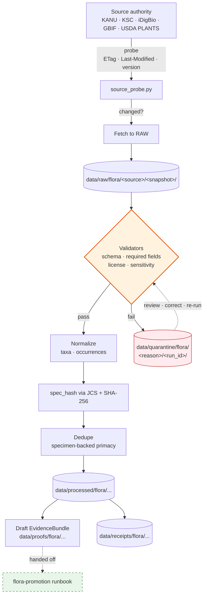

<!-- [KFM_META_BLOCK_V2]
doc_id: kfm://doc/flora/governance/runbooks/flora-ingest
title: Flora Ingest Runbook
type: standard
version: v0.1
status: draft
owners: <flora-steward> <governance-steward> [TODO: confirm]
created: 2026-05-08
updated: 2026-05-08
policy_label: public
related:
  - docs/domains/flora/README.md
  - docs/domains/flora/ARCHITECTURE.md
  - docs/domains/flora/SOURCE_REGISTRY.md
  - docs/domains/flora/PIPELINES_AND_LIFECYCLE.md
  - docs/domains/flora/PUBLICATION_AND_POLICY.md
  - docs/domains/flora/governance/runbooks/flora-promotion.md
  - docs/domains/flora/governance/runbooks/flora-rollback.md
  - docs/domains/flora/adr/ADR-flora-schema-home.md
  - docs/domains/flora/adr/ADR-flora-source-roles.md
  - docs/domains/flora/adr/ADR-flora-sensitive-location-policy.md
  - data/registry/flora/sources.yaml
  - data/registry/flora/sensitivity_policies.yaml
  - policy/flora/
  - .github/workflows/flora-ci.yml
tags: [kfm, flora, ingest, watcher, runbook, governance]
notes:
  - PROPOSED runbook path; canonical Blueprint Appendix B places domain runbooks at docs/domains/flora/runbooks/ rather than docs/domains/flora/governance/runbooks/. Resolve via ADR before promotion.
  - All paths, schemas, validators, and workflows referenced here are PROPOSED until verified against a mounted repo.
[/KFM_META_BLOCK_V2] -->

# Flora Ingest Runbook

> Operational procedure for governed ingestion of Kansas flora evidence — from
> authoritative source watchers through `RAW → WORK / QUARANTINE → PROCESSED`,
> stopping short of catalog closure and promotion. **This runbook does not
> publish, promote, or expose data.**

<!-- top-of-file impact block -->

| Field | Value |
| :--- | :--- |
| **Status** | `experimental` — doctrine grounded, implementation PROPOSED |
| **Owners** | Flora steward · Governance steward · CI steward · _confirm in CODEOWNERS_ |
| **Lifecycle phase** | Ingest only (`RAW → WORK / QUARANTINE → PROCESSED`) |
| **Network posture** | **No live network in CI.** Live watchers run only after steward authorization. |
| **Truth posture** | Cite-or-abstain · fail-closed · receipts-bearing · default-deny on sensitive geometry |

[](#)
[](#)
[](#)
[](#)
[](#)
[](#)

**Quick jumps** —
[Scope](#1-scope) ·
[Repo fit](#2-repo-fit) ·
[Inputs](#3-accepted-inputs) ·
[Exclusions](#4-exclusions) ·
[Sources](#5-source-registry-overview) ·
[Lifecycle](#6-lifecycle-and-paths) ·
[Procedure](#7-ingest-procedure) ·
[Diagram](#8-diagram) ·
[Validators & gates](#9-validators-and-fail-closed-gates) ·
[Run receipt](#10-run-receipt-and-evidencebundle) ·
[Sensitivity](#11-sensitivity-and-rights-handling) ·
[Quarantine](#12-quarantine-and-failure-paths) ·
[Rollback](#13-rollback-and-correction) ·
[Checklist](#14-operator-checklist) ·
[Open questions](#15-open-questions--verification-backlog)

---

## 1. Scope

The Flora Ingest Runbook governs how authoritative external flora data enters KFM
under the **generic watcher contract**: emit-only, fail-closed, receipts-bearing.
Watchers may **poll, fetch, validate, normalize, hash, and write** — they do not
promote, publish, or speak directly to clients. Promotion is a separate governed
state transition, documented in `flora-promotion.md`.

This runbook stops at the `PROCESSED` boundary. Catalog closure
(`STAC` / `DCAT` / `PROV`), proof bundles, release manifests, and public-safe
materialization are downstream of this document.

> [!IMPORTANT]
> Live network ingest is disabled by default. CI runs **no-live-network fixture
> ingest only**. Real watchers remain dark until endpoints, rights, sensitivity,
> update cadence, and steward approval are recorded against the source descriptor.

---

## 2. Repo fit

This runbook lives at: `docs/domains/flora/governance/runbooks/flora-ingest.md`
**(PROPOSED path)**.

> [!NOTE]
> The canonical Flora Architecture Blueprint places domain runbooks at
> `docs/domains/flora/runbooks/`. The `/governance/` segment used here is a
> **PROPOSED** organizational variant. The canonical home should be settled in
> `ADR-flora-doc-lineage-and-supersession.md` (or equivalent) before this
> runbook is treated as authoritative. Authority boundaries — not topic
> convenience — drive the decision per `Directory Rules`.

**Upstream (governs this runbook).** *(All PROPOSED until repo-verified.)*

- `docs/doctrine/lifecycle-law.md` — `RAW → WORK / QUARANTINE → PROCESSED → CATALOG / TRIPLET → PUBLISHED`
- `docs/architecture/governed-api.md` — trust-membrane separation
- `docs/domains/flora/ARCHITECTURE.md` — Flora lane mission and object families
- `docs/standards/CANONICALIZATION.md` — JCS / spec_hash discipline
- `docs/standards/RUN_RECEIPT.md` — universal receipt envelope

**Downstream (this runbook drives).** *(All PROPOSED until repo-verified.)*

- `pipelines/flora/source_probe.py`, `fixture_pipeline.py`, `normalize_taxa.py`, `normalize_occurrences.py`, `dedupe_occurrences.py`, `generalize_sensitive_geometry.py`, `build_catalog.py`
- `packages/flora/src/flora/{ids,hashing,source_registry,taxon_reconcile,geoprivacy,api_payloads}.py`
- `tools/validators/flora/*` and `policy/flora/*.rego`
- `.github/workflows/flora-ci.yml`, `flora-promotion.yml`, `flora-source-probe-manual.yml`
- `docs/domains/flora/governance/runbooks/flora-promotion.md`
- `docs/domains/flora/governance/runbooks/flora-rollback.md`

---

## 3. Accepted inputs

| Input class | Examples | Where it enters |
| :--- | :--- | :--- |
| Authoritative DwC-A archives | KANU IPT, KSC IPT | `data/raw/flora/<source>/<snapshot>/` |
| Aggregated occurrence pulls | GBIF (filtered by Kansas extent), iDigBio | `data/raw/flora/<source>/<snapshot>/` |
| Taxonomic / presence baselines | USDA PLANTS Complete Checklist + state/county distributions | `data/raw/flora/usda_plants/<snapshot>/` |
| Citizen-science observations (coverage tier) | iNaturalist (treated as observation, never as specimen) | `data/raw/flora/<source>/<snapshot>/` |
| Status / regulatory context | USFWS ECOS, state rare-plant program (probe metadata only by default) | `data/raw/flora/<source>/<snapshot>/` |
| No-live-network test fixtures | Hand-authored DwC-A and JSON fixtures under `tests/fixtures/flora/valid/` and `…/invalid/` | `tests/fixtures/flora/` |

A descriptor in `data/registry/flora/sources.yaml` (PROPOSED) is required for
**every** source: `source_id`, `source_role` (specimen / observation / aggregator
/ baseline / regulatory), endpoint URL, license / rights profile, sensitivity
profile, expected cadence, change-detection mechanism, and steward.

---

## 4. Exclusions

This runbook **does not cover**:

- **Promotion or publication.** See `flora-promotion.md`. A watcher must never
  write to `data/published/flora/`, the public API, MapLibre layer registry, or
  any tile output.
- **Rollback or correction releases.** See `flora-rollback.md`.
- **Live ingest of restricted rare-plant data without steward authorization.**
  NatureServe-restricted, federally listed, and state-listed precise locations
  default to **quarantine or denial** until policy and review records exist.
- **Animal records.** Fauna is a separate lane (see Fauna Architecture).
  Bird-only sources such as eBird are governed under fauna or the cross-cutting
  biodiversity ETL, not this runbook.
- **AI inference, summarization, or Focus Mode answers.** AI runs after evidence
  and policy resolution, never inside ingest.

---

## 5. Source registry overview

The flora corpus identifies the following source authorities and their roles.
Source roles are governance-significant — they drive dedupe tie-breakers,
license posture, and sensitivity defaults.

| Source | Role | Detection | License posture | Notes |
| :--- | :--- | :--- | :--- | :--- |
| **KANU** (KU R.L. McGregor Herbarium IPT) | Specimen-backed (Kansas-primary) | `ETag` / `Last-Modified` | Source-stated; capture per record | Highest preference in dedupe tie-break |
| **KSC** (Kansas State University Herbarium IPT) | Specimen-backed (Kansas-primary) | `ETag` / `Last-Modified` | Source-stated; capture per record | Second preference after KANU |
| **iDigBio** | Specimen-backed (extra-state digitized) | API filter / modified-since | Per-record license required | Third preference |
| **GBIF** (occurrence + filtered downloads) | Aggregator / observation-mixed | `modifiedSince` / dataset DOI snapshot | Per-record license required; `basisOfRecord` distinguishes specimen vs observation | Lowest preference for crowd records; specimen-backed GBIF rows still respected |
| **USDA PLANTS** | Federal taxonomic + state/county presence baseline | Snapshot version timestamps | `rights_status: public` (US federal public domain) | Provides `plants:symbol`, `nativeStatus`, `growthHabit`, `wetlandStatus` |
| **USFWS ECOS** | Regulatory / federal status context | Probe-only by default | Public; capture terms | Probe schema/metadata before any authoritative ingest |
| **NatureServe** | Restricted rare-plant context | Manual / authorized-only | **Restricted** — license + redistribution gate required | **Default deny** for public release of precise points; quarantine until review |
| **iNaturalist / eBird-equivalents** | Observation-only (citizen-science) | API / modified-since | Source license; observer attribution | Never displaces specimen records in dedupe |

**Cross-source preference** (specimen-backed primacy):
`KANU > KSC > iDigBio > GBIF (specimen) > GBIF (crowd) > observation-only`.
A complete tiebreak policy across all source pairings is **NEEDS VERIFICATION**;
deterministic rules for GBIF-vs-iDigBio collisions are not fully specified in
the corpus and must be resolved in `ADR-flora-source-roles.md`.

> [!WARNING]
> **Mandatory record-level fields** (validation rejects archives or rows missing
> any of these): `scientificName`, `decimalLatitude`, `decimalLongitude`,
> `eventDate`, `license`, `rightsHolder`, `datasetID`. Records without these
> are routed to `data/quarantine/flora/<reason>/<run_id>/` with a receipt — they
> are **never silently dropped or repaired**.

---

## 6. Lifecycle and paths

```text
RAW                  →  WORK / QUARANTINE        →  PROCESSED                    →  (catalog / proof / publication — separate runbooks)
data/raw/flora/         data/work/flora/             data/processed/flora/{taxa,
  <source>/<snapshot>/    <run_id>/                    occurrences,communities,
                        data/quarantine/flora/         range_maps,vegetation_index,
                          <reason>/<run_id>/           habitat_associations}/
                        data/receipts/flora/         data/proofs/flora/
                          <source>/                    (EvidenceBundles drafted here;
                                                       sealed at promotion only)
```

Path notes:

- `<snapshot>` is the source-side version anchor (timestamp, ETag, or version
  tag) recorded on retrieval. Once written, snapshot directories are immutable.
- `<run_id>` is the orchestrator-issued run identifier echoed in every receipt
  produced by the run. It is **not** the `spec_hash`.
- `data/processed/flora/<spec_hash>/` is also acceptable for content-addressed
  layout; choose one convention per source family and lock it in
  `ADR-flora-schema-home.md` (PROPOSED).
- `data/published/flora/` is **out of scope** for this runbook.

---

## 7. Ingest procedure

The procedure is identical in shape for every source — what varies is the
endpoint, the rights profile, the change-detection mechanism, and the
sensitivity defaults. Steps marked **GATE** must fail closed.

### 7.1 Pre-flight

1. Confirm a current source descriptor exists in `data/registry/flora/sources.yaml`
   for the target `source_id`. If absent → **STOP**. Author the descriptor and
   land it through review before continuing.
2. Confirm a sensitivity profile applies in `data/registry/flora/sensitivity_policies.yaml`.
   If unknown → treat as **restricted** by default. Do not relax.
3. Confirm steward authorization for live network ingest. CI must run
   no-network fixtures only.
4. Verify the orchestrator can write to `data/raw/flora/<source>/`,
   `data/work/flora/`, `data/quarantine/flora/`, and `data/receipts/flora/`,
   and that the JCS / SHA-256 helper from `packages/flora/src/flora/hashing.py`
   is importable.

### 7.2 Probe (descriptor-driven, read-only)

5. Run `pipelines/flora/source_probe.py --source <source_id>` (PROPOSED).
   The probe records HTTP validators (`ETag`, `Last-Modified`), schema
   advertisements, version timestamps, and license metadata against the
   descriptor — **without** retrieving payloads.
6. Compare probe output to the last recorded validators. If unchanged →
   **no-op** and emit a probe receipt. If changed → continue.

### 7.3 Fetch (RAW)

7. Retrieve the changed payload to a temp file under
   `data/work/flora/<run_id>/_inflight/`.
8. Compute `raw_checksum = sha256(<bytes>)`.
9. Move the payload to its immutable RAW path:
   `data/raw/flora/<source>/<snapshot>/`. Write a **fetch receipt** including
   `source_id`, `source_endpoint`, `request_params`, `fetched_at` (ISO 8601),
   `http_validators`, `raw_checksum`, `license_block`, `terms_url`,
   `attribution_required`, `embargo_until` (nullable), `data_sensitivity_hint`,
   and `run_receipt_id`.

### 7.4 Validate (GATE — fail-closed)

10. Run `tools/validators/flora/flora_dwca_validator` (PROPOSED) for DwC-A
    archives, or the format-appropriate validator for non-DwC sources.
11. **GATE A — schema validity:** archive opens, required Darwin Core fields
    parse.
12. **GATE B — required record fields:** every record carries `scientificName`,
    `decimalLatitude`, `decimalLongitude`, `eventDate`, `license`,
    `rightsHolder`, `datasetID`. Missing fields → quarantine the record (not
    the archive) with reason `missing_required_field`.
13. **GATE C — license parse:** `license` resolves to a known SPDX identifier
    or an explicitly enumerated source token. Unknown → quarantine with
    reason `unknown_rights`.
14. **GATE D — sensitivity hint:** if the record matches the
    sensitive-taxa registry **and** the geometry is precise, route to
    `data/quarantine/flora/sensitive_precise/<run_id>/` with a redaction
    receipt skeleton. Do not normalize a precise sensitive point into the
    `WORK` lane.

### 7.5 Normalize (WORK)

15. Run `pipelines/flora/normalize_taxa.py` and
    `pipelines/flora/normalize_occurrences.py` (PROPOSED). Outputs:
    canonicalized taxon and occurrence JSON in `data/work/flora/<run_id>/`.
16. Preserve **source-native fields** alongside normalized fields:
    raw taxon text, accepted normalized taxon, raw coordinates, normalized
    geometry, public-safe geometry (deferred — see §11), timestamps and
    precision, source timezone if present, rights, source role, review
    status, uncertainty.
17. Apply **USDA PLANTS** as the plant-name authority where reconciliation is
    required, with documented exceptions tracked in `taxon_authorities.yaml`.

### 7.6 Identity (`spec_hash`)

18. For each normalized record, compute `spec_hash` using **RFC 8785 JCS** then
    `SHA-256`. Record as `jcs:sha256:<hex>`.
19. **Excluded fields** (must not affect `spec_hash`): retrieval timestamp
    (`fetched_at` and any equivalents), `run_id`, `spec_hash` itself, and any
    field flagged `transient: true` in the relevant schema.
20. Determinism check: hash each record twice; assert equality.

### 7.7 Dedupe (across sources)

21. Primary key for cross-source dedupe:
    `institutionCode | catalogNumber | eventDate`.
22. Fallback when any primary key part is missing:
    `roundedCoordinate(2 dp) | eventDate | acceptedScientificName`.
23. Tiebreak by source role: `KANU > KSC > iDigBio > GBIF specimen > GBIF
    crowd > observation-only`. Other pairings → `data/quarantine/flora/dedupe_ambiguous/`
    pending review.

### 7.8 Persist (PROCESSED)

24. Write canonical records under
    `data/processed/flora/{taxa,occurrences,communities,…}/`.
25. Emit per-record **EvidenceRefs** that resolve to a draft EvidenceBundle in
    `data/proofs/flora/<source>/<run_id>/` (sealed only at promotion).
26. Emit the run receipt (see §10).

### 7.9 Hand-off

27. The runbook ends here. The release / catalog / proof closure is
    `flora-promotion.md`. Do not invoke `pipelines/flora/build_catalog.py`
    until promotion review is initiated.

---

## 8. Diagram



> [!NOTE]
> Diagram reflects the doctrinal flow described in the Flora Architecture
> Blueprint and the generic watcher contract. Concrete pipeline scripts are
> PROPOSED — verify against the mounted repo before treating any node label
> as a callable target.

---

## 9. Validators and fail-closed gates

| Gate | Purpose | Validator (PROPOSED) | Reason codes on failure |
| :--- | :--- | :--- | :--- |
| Schema validity | DwC-A or source-format parse | `tools/validators/flora/flora_dwca_validator` | `schema_invalid` |
| Required fields | Mandatory DwC fields present | same | `missing_required_field` |
| Rights parse | `license` resolves to SPDX or enumerated token | `policy/flora/rights.rego` (or Python mirror) | `unknown_rights`, `missing_rights` |
| Sensitivity | Sensitive-taxa registry hit + precise geometry | `policy/flora/sensitivity.rego` | `precise_sensitive_location_denied`, `geoprivacy_required` |
| Source descriptor | Descriptor present and current | `tools/validators/flora/validate_source_descriptor.py` | `missing_source_descriptor` |
| Identity | `spec_hash` recomputable and stable | `tools/validators/flora/validate_spec_hash.py` | `nondeterministic_identity` |
| Sensitivity public-leak (boundary) | No restricted-precise data crosses to public DTO | `tools/validators/flora/validate_sensitivity_public_surface.py` | `public_payload_exposes_internal_ref`, `public_geometry_not_generalized` |

> [!IMPORTANT]
> All gates fail closed. A gate that cannot determine an outcome
> (`UNKNOWN`) is a `DENY` for promotion purposes. The Public-DTO gate is
> evaluated at the publish boundary, not at ingest, but ingest is responsible
> for never producing a public-shaped record from RAW / WORK / QUARANTINE.

---

## 10. Run receipt and EvidenceBundle

Every ingest run emits a single small **run receipt** per source, alongside any
per-record fetch receipts. The receipt is the universal audit currency.

**Required fields** *(reuse the shared `run_receipt.v1` schema if present;
otherwise mirror its shape):*

| Field | Notes |
| :--- | :--- |
| `dataset_id` | Logical identifier for the source target (e.g., `flora.kanu`) |
| `dataset_version` | Source-stated version or snapshot tag |
| `source_id` | Matches `data/registry/flora/sources.yaml` |
| `source_endpoint` | Full URL retrieved |
| `request_params` | Filters / dates / extents used |
| `fetched_at` | ISO 8601 — **excluded from `spec_hash`** |
| `http_validators` | `{etag, last_modified}` pair seen at fetch |
| `spec_hash` | `jcs:sha256:<hex>` |
| `run_id` | Orchestrator-issued |
| `orchestrator` | Tool/version that ran the watcher |
| `transform_git_sha` | Commit SHA of the watcher code |
| `artifacts[]` | `{path, digest}` for each output written |
| `license_block` / `rights_spdx` | Parsed license token(s) |
| `terms_url` · `attribution_required` · `embargo_until` | Rights flags |
| `data_sensitivity_hint` | Default registry-derived class |
| `attestations[]` | `{type:"cosign", bundle_digest:"sha256:..."}` if signing keys are configured |
| `fail_closed_reason` | `null` on success; populated on quarantine |

**EvidenceBundle (draft).** Per-record `EvidenceRef`s emitted into
`data/proofs/flora/<source>/<run_id>/` resolve to the draft EvidenceBundle.
Required at runtime: `claim` scope (taxon / occurrence / community), source
role, rights, sensitivity transform (if any), provenance chain, review state,
and freshness. The bundle is **sealed at promotion**, not here.

> [!TIP]
> When `spec_hash` collisions appear across snapshots, suspect a non-canonical
> serializer or an accidentally-included transient field. Re-run with
> `compute_spec_hash.py --print-canonical` to inspect the canonical bytes.

---

## 11. Sensitivity and rights handling

Sensitivity defaults are **deny** for public exposure. The watcher's job is to
preserve enough provenance and uncertainty for a later, reviewed decision —
never to make the public-vs-private call itself.

| Class | Watcher behavior |
| :--- | :--- |
| **Restricted precise** (rare / listed taxa with point geometry) | Quarantine the record. Emit a redaction-receipt skeleton with input digest, source ref, and reason `precise_sensitive_location_denied`. Do not normalize a precise sensitive point into WORK. |
| **Restricted aggregate-eligible** | Allow into WORK only if a generalization rule exists in `data/registry/flora/sensitivity_policies.yaml`. Defer the actual generalization to `pipelines/flora/generalize_sensitive_geometry.py`, which is reviewed and promoted separately. |
| **Public-safe** | Pass through with rights captured. `rights_status: public` for USDA PLANTS, source-stated for others. |
| **Unknown rights** | Quarantine with reason `unknown_rights`. |
| **NatureServe-restricted** | **Default deny**. Live ingest only with steward authorization and a documented redistribution gate. **Open question** — corpus does not fully specify the licensing-and-distribution control for NatureServe. |

The **observation-vs-specimen tag** is set at ingest time and propagates to
the Evidence Drawer and Focus Mode downstream, so that crowd observations
never present with the same UI weight as specimen-backed records.

---

## 12. Quarantine and failure paths

Quarantine is a first-class lane, not an error sink.

```text
data/quarantine/flora/
├── missing_required_field/<run_id>/
├── unknown_rights/<run_id>/
├── sensitive_precise/<run_id>/
├── dedupe_ambiguous/<run_id>/
├── schema_invalid/<run_id>/
└── nondeterministic_identity/<run_id>/
```

Each quarantined record carries:

- The original raw bytes (or a digest reference into RAW)
- A receipt naming the gate that fired and the reason code
- A pointer to the source descriptor
- A `review_required` flag

> [!CAUTION]
> **Do not delete quarantined records to clear CI.** Quarantine receipts are
> evidence. They are removed only by a documented review decision with its own
> receipt, never by a silent re-run.

---

## 13. Rollback and correction

Watcher-level rollback is bounded: a watcher can be **disabled** and a RAW
snapshot can be **superseded**, but processed outputs and any downstream
catalog or release require the dedicated rollback runbook.

| Situation | Action | Receipt |
| :--- | :--- | :--- |
| Bad fetch or bad snapshot | Disable watcher in `flora-ci.yml` and `sources.yaml`; mark RAW snapshot `superseded`; do not delete | Disable receipt + supersession receipt |
| Bad normalization (logic error) | Roll back the offending PR; re-run from RAW; emit a re-run receipt referencing prior `spec_hash`(es) | Re-run receipt with `previous_spec_hash[]` |
| Sensitivity slip into PROCESSED (not yet promoted) | Move records to `data/quarantine/flora/sensitive_precise/`; emit redaction-receipt; PROCESSED entries with affected `spec_hash` are tombstoned, not silently overwritten | Quarantine + tombstone receipts |
| Sensitivity slip into PUBLISHED | **Out of scope here.** See `flora-rollback.md` — release alias, correction notice, rollback card. |

Release-aliasing, correction notices, and rollback cards are governed by
`flora-rollback.md`.

---

## 14. Operator checklist

Use this checklist when running, reviewing, or accepting a flora ingest PR.

- [ ] Source descriptor exists in `data/registry/flora/sources.yaml` and is current
- [ ] Sensitivity profile exists in `data/registry/flora/sensitivity_policies.yaml`
- [ ] CI ran on no-live-network fixtures and passed
- [ ] No live network calls in tests (verified by `flora-ci.yml`'s no-network smoke job)
- [ ] All schema, rights, sensitivity, and identity gates pass; `UNKNOWN` is treated as `DENY`
- [ ] `spec_hash` determinism asserted (compute twice, compare)
- [ ] Run receipt written under `data/receipts/flora/<source>/`
- [ ] Quarantine is **non-empty only with reasons** — nothing dropped silently
- [ ] No PROCESSED record carries precise geometry for a sensitive taxon
- [ ] No public-shaped artifact emitted (no `data/published/flora/` writes)
- [ ] Draft EvidenceBundle written to `data/proofs/flora/<source>/<run_id>/`
- [ ] Source-native fields preserved alongside normalized fields
- [ ] `observation` vs `specimen` tag set on every occurrence record
- [ ] CODEOWNERS reviewer is on the PR (flora steward + governance steward)
- [ ] Linked to a verification-backlog entry if any `UNKNOWN` survived

<details>
<summary><b>Definition of Done — flora ingest PR</b></summary>

A flora ingest PR is **Done** when:

1. The source descriptor and sensitivity profile are both present and reviewed.
2. `flora-ci.yml` passes on no-network fixtures, including:
   - schema validation,
   - required-field validation,
   - rights / SPDX validation,
   - sensitivity public-leak negative test (`fail_precise_sensitive_public_geometry.json`),
   - `spec_hash` determinism test,
   - dedupe tiebreak test against a multi-source fixture.
3. A run receipt fixture and a draft EvidenceBundle fixture are committed and
   schema-valid.
4. A quarantine fixture exists for at least one realistic failure mode
   (`unknown_rights` or `missing_required_field`), and the validators correctly
   route it to the matching `data/quarantine/flora/<reason>/` path in the test.
5. The PR description states the source role explicitly (specimen / observation
   / aggregator / baseline / regulatory) and links the source descriptor.
6. Reviewers from CODEOWNERS for `docs/domains/flora/`,
   `data/registry/flora/`, and `policy/flora/` have approved.

</details>

---

## 15. Open questions / verification backlog

| # | Question | Status | Disposition |
| :- | :--- | :--- | :--- |
| Q1 | Canonical runbook home: `docs/domains/flora/runbooks/` (Blueprint Appendix B) vs `docs/domains/flora/governance/runbooks/` (this file's path). | NEEDS VERIFICATION | Resolve in `ADR-flora-doc-lineage-and-supersession.md`. |
| Q2 | Schema home: `contracts/flora/*.schema.json` vs `schemas/contracts/v1/flora/*.schema.json`. | UNKNOWN | `ADR-flora-schema-home.md`. |
| Q3 | Deterministic dedupe tiebreaker for GBIF-vs-iDigBio collisions when both are specimen-backed. | UNKNOWN | `ADR-flora-source-roles.md`. |
| Q4 | Cadence per source — incremental modified-since vs frozen GBIF download with citable DOI. | NEEDS VERIFICATION | Source descriptor field plus per-source ADR if needed. |
| Q5 | NatureServe lifecycle posture — distribute, deny, or staged-access? | UNKNOWN | `ADR-flora-sensitive-location-policy.md`. |
| Q6 | Identity behavior on USDA PLANTS taxonomy renames — does `spec_hash` change, and how is the Evidence Drawer attribution reconciled? | UNKNOWN | Pair with the Taxonomy-Rename ADR (corpus item W3). |
| Q7 | Public-DTO field set for flora — fully enumerated schema. | NEEDS VERIFICATION | Pair with `public_dto.schema.json` work (corpus item W1). |
| Q8 | OPA / Conftest availability in CI for `policy/flora/*.rego`. | UNKNOWN | `flora-ci.yml` step is conditional; resolve in CI ADR. |
| Q9 | Live-watcher activation gate — exact steward + policy + descriptor checklist before flipping a watcher off no-network mode. | NEEDS VERIFICATION | Operational checklist in this runbook §7.1; confirm against `flora-source-probe-manual.yml`. |

> [!NOTE]
> Items above are PROPOSED until inspected against a mounted repository.
> No statement in this runbook should be read as evidence that the referenced
> path, validator, schema, workflow, or policy currently exists.

---

## Appendix A — Validation commands (PROPOSED)

These commands are PROPOSED and **not yet known to run** in this session. Use
the repo's actual `Makefile` / task runner / CI workflow once verified.

```bash
# No-live-network thin-slice fixture pipeline
python pipelines/flora/fixture_pipeline.py --root . --no-network

# Schema fixtures (valid + invalid)
pytest -q tests/flora/test_schemas.py

# Identity determinism
pytest -q tests/flora/test_spec_hash_determinism.py

# Sensitivity public-leak negative test
pytest -q tests/flora/test_no_sensitive_public_leak.py

# Policy parity (only if Conftest is available on PATH)
conftest test tests/fixtures/flora/policy -p policy/flora

# Aggregate local validator runner
python tools/validators/flora/run_all.py
```

## Appendix B — Glossary (compact)

- **Watcher** — Single-purpose agent that ingests one source under the generic watcher contract. Emit-only, fail-closed, receipts-bearing.
- **Source role** — Governance class of a source: specimen, observation, aggregator, baseline, regulatory.
- **`spec_hash`** — Deterministic identity computed as `SHA-256` over RFC 8785 JCS canonical bytes of a record, with transient fields excluded. Recorded as `jcs:sha256:<hex>`.
- **EvidenceRef / EvidenceBundle** — Reference resolving to a sealed bundle of provenance, rights, sensitivity transform, review, and freshness data backing a claim.
- **Quarantine** — First-class lane for records that fail a gate. Holds receipts, not silence.
- **Public-DTO gate** — Boundary check that no restricted-precise data crosses to a public-facing data structure. Enforced at promotion, not ingest.

[⬆ Back to top](#flora-ingest-runbook)
