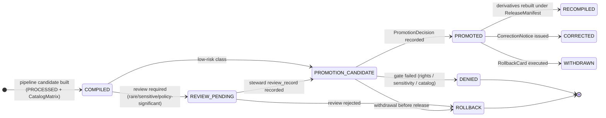
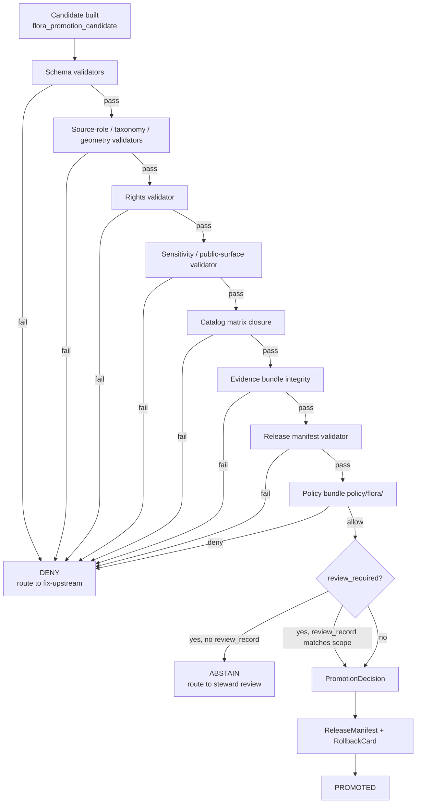

<!-- [KFM_META_BLOCK_V2]
doc_id: kfm://doc/<TODO-uuid-flora-promotion-runbook>
title: Flora Promotion Runbook
type: standard
version: v0.1
status: draft
owners: <TODO-flora-steward> · <TODO-release-officer>
created: 2026-04-21
updated: 2026-04-21
policy_label: public
related:
  - docs/domains/flora/README.md
  - docs/domains/flora/PIPELINES_AND_LIFECYCLE.md
  - docs/domains/flora/PUBLICATION_AND_POLICY.md
  - docs/domains/flora/governance/runbooks/flora-ingest.md
  - docs/domains/flora/governance/runbooks/flora-rollback.md
  - docs/adr/ADR-flora-public-layer-strategy.md
  - docs/adr/ADR-flora-sensitive-location-policy.md
  - docs/adr/ADR-flora-source-roles.md
  - docs/adr/ADR-flora-schema-home.md
tags: [kfm, flora, governance, runbook, promotion, release, lifecycle]
notes:
  - All paths, workflow names, schema files, and policy files are PROPOSED until verified against a mounted KFM repository.
  - This file location refines the Flora Architecture Blueprint (which proposed `docs/domains/flora/runbooks/`) by inserting a `governance/` subfolder. PROPOSED CORRECTION; resolve with an ADR and update the Flora architecture and FILE_MANIFEST when landed.
[/KFM_META_BLOCK_V2] -->

# Flora Promotion Runbook

> The operator procedure for moving a Flora candidate across the governed boundary into a released, public-safe artifact — without collapsing observation, model, specimen, steward review, sensitivity controls, and publication into a single truth surface.

<!-- Badges: placeholders until owners, CI, and policy targets are verified. -->


**Quick jumps** ·
[Scope](#1-scope) ·
[Repo fit](#2-repo-fit) ·
[What promotion is](#3-what-promotion-is-and-is-not) ·
[Lifecycle](#4-the-promotion-lifecycle) ·
[Preconditions](#5-preconditions--definition-of-ready) ·
[Procedure](#6-operator-procedure) ·
[Gates](#7-gates-and-validators) ·
[Sensitivity](#8-flora-sensitivity-gates) ·
[Decision](#9-the-promotiondecision) ·
[Reason codes](#10-reason-codes--finite-outcomes) ·
[Rollback](#11-rollback-and-correction) ·
[Done](#12-definition-of-done) ·
[Backlog](#13-verification-backlog) ·
[Related](#14-related) ·
[Appendix](#appendix-a--illustrative-pseudocode)

> [!IMPORTANT]
> **Promotion is a governed state transition, not a file move.** A candidate cannot promote itself, an AI cannot promote a candidate, and rendering on a map is not evidence of promotion. The presence of a file under `data/published/flora/` without a recorded `PromotionDecision`, a closed `CatalogMatrix`, an integrity-checked `EvidenceBundle`, a referenced `ReleaseManifest`, and a registered rollback target is a defect, not a release.

---

## 1. Scope

This runbook is the **operational procedure** for a single Flora promotion event: taking a `PROMOTION_CANDIDATE` produced by a Flora pipeline run and turning it into a `PROMOTED` artifact reachable through the governed API and the public MapLibre layer registry — with proof, rollback, and correction lineage intact.

It covers:

- The preconditions a candidate must satisfy before a promotion attempt is even valid.
- The order in which validators, policy gates, review records, and the `PromotionDecision` must be exercised.
- The Flora-specific sensitivity, taxonomy, and rights checks that override generic publication rules.
- The artifacts that must exist on disk and the fields that must close before a release manifest is written.
- The rollback obligations attached to every successful promotion.

It does **not** cover:

- Source descriptor authoring or watcher activation — see `flora-ingest.md`.
- Reverting a public release after issue — see `flora-rollback.md`.
- Schema evolution — see the relevant ADR and the schema home register.
- Cross-domain releases (e.g., habitat covariate joins) — coordinate with the habitat lane and the release register.

[↑ Back to top](#flora-promotion-runbook)

---

## 2. Repo fit

This document is a Flora-domain runbook under the `docs/domains/flora/` lane.

| Concern | Where it lives (PROPOSED) |
|---|---|
| This runbook | `docs/domains/flora/governance/runbooks/flora-promotion.md` |
| Lane entrypoint | `docs/domains/flora/README.md` |
| Lifecycle doctrine | `docs/domains/flora/PIPELINES_AND_LIFECYCLE.md` |
| Publication & policy doctrine | `docs/domains/flora/PUBLICATION_AND_POLICY.md` |
| Promotion candidate schema | `contracts/flora/flora_promotion_candidate.schema.json` *or* `schemas/contracts/v1/domains/flora/flora_promotion_candidate.schema.json` (pending schema-home ADR) |
| Promotion policy | `policy/flora/promotion.rego` (alongside `publish.rego`, `sensitivity.rego`, `rights.rego`, `taxon.rego`, `catalog.rego`, `review.rego`) |
| Promotion validators | `tools/validators/flora/` (incl. `validate_release_manifest.py`, `validate_evidence_bundle.py`, `validate_catalog_matrix.py`, `validate_sensitivity_public_surface.py`, `validate_rights.py`, `run_all.py`) |
| Promotion CI workflow | `.github/workflows/flora-promotion.yml` |
| Promotion test fixtures | `tests/fixtures/flora/promotion/` (e.g., `pass_public_generalized.json`, `fail_catalog_open.json`) |
| Release manifest output | `data/published/flora/manifests/` |
| Proof bundle output | `data/proofs/flora/` (incl. `evidence_bundles/`, `rollback_cards/`) |

> [!NOTE]
> The Flora Architecture Blueprint proposed runbooks at `docs/domains/flora/runbooks/`. This file's path inserts `governance/` between the lane and the runbook folder. Treat the change as a **PROPOSED CORRECTION** until an ADR resolves runbook home placement; then update the Flora `FILE_MANIFEST.md`, `ARCHITECTURE.md`, and proposed directory tree to match. The Directory Rules treat domain artifacts as belonging under responsibility roots inside the lane (here, governance is the responsibility root for runbooks/ADRs).

[↑ Back to top](#flora-promotion-runbook)

---

## 3. What promotion is — and is not

KFM treats truth as a lifecycle: `SOURCE EDGE → RAW → WORK / QUARANTINE → PROCESSED → CATALOG / TRIPLET → PUBLISHED`, with `REVIEW`, `CORRECTION`, and `ROLLBACK` as named governance operations. **Promotion** is the named transition that moves a `PROMOTION_CANDIDATE` (built from `PROCESSED` records and a closed `CatalogMatrix`) into a `PROMOTED` release whose artifacts are eligible for public exposure through the governed API and MapLibre layer registry.

| Promotion **is** | Promotion **is not** |
|---|---|
| A recorded `PromotionDecision` referencing the candidate, evidence, policy state, review state, and rollback target. | Copying or renaming a file from `processed/` to `published/`. |
| A fail-closed transition that requires every applicable gate to be satisfied or to have an explicit, signed waiver. | An override authority for missing rights, unknown sensitivity, or open catalog closure. |
| Reversible: every promoted artifact has a registered rollback path and a correction surface. | Silent replacement of a prior release. |
| Source-role-aware: official, institutional, steward-reviewed, corroborative, community, controlled-access, derived-model, and generalized-public-surface entries are treated differently. | A way to elevate a model output (suitability surface, range map) into observed-occurrence truth. |
| Sensitivity-aware: rare, protected, or culturally sensitive flora default to **DENY** of exact public geometry. | A bypass for unresolved rights, ambiguous taxonomy, or unverified authority boundaries. |

[↑ Back to top](#flora-promotion-runbook)

---

## 4. The promotion lifecycle

Promotion sits inside the broader Flora loop: validate → compile → review → promote → recompile derivatives. The state machine below is taken from the KFM pipeline manual loop spec and is the **only** legal path a Flora candidate may travel from `COMPILED` to `PROMOTED`.



The transitions `PROMOTION_CANDIDATE → PROMOTED` and `PROMOTED → CORRECTED|WITHDRAWN` are the high-stakes moves. Both demand a recorded decision artifact and an integrity-checked rollback target.

[↑ Back to top](#flora-promotion-runbook)

---

## 5. Preconditions — Definition of Ready

A Flora candidate is **not eligible** for a promotion attempt unless every item below is true. If any item is unknown or unverified, the answer is **ABSTAIN** (request more evidence) or **DENY** (block until resolved) — never "promote and patch later."

- [ ] The candidate references a `flora_promotion_candidate` record validated against its schema.
- [ ] Every claim in the candidate resolves to an `EvidenceBundle` whose hash and constituent `evidence_refs` integrity-check.
- [ ] All upstream `PROCESSED` records carry `source_id`, `source_role`, `spec_hash`, and a non-volatile deterministic identifier (`taxon_id`, `occurrence_id`, `community_id`, `layer_id` as applicable).
- [ ] The `CatalogMatrix` for the candidate's release scope is **closed**: `STAC`, `DCAT`, `PROV`, release manifest stub, proof bundle stub, and intended published refs all align by digest.
- [ ] `rights_license_terms` is resolved on every contributing source. Unknown rights → **DENY** for public release; route to controlled-access track if appropriate.
- [ ] `sensitivity_posture` and `public_publication_eligibility` are resolved on every contributing source and on every output geometry layer.
- [ ] If any contributing record carries `review_required = true` (rare-flora flag, controlled-access source, taxonomy ambiguity, model-as-observation risk), a `review_record` exists whose scope matches the target release.
- [ ] Public-bound geometry has been transformed through the documented generalization pipeline; a `redaction_receipt` is attached to every transformed record.
- [ ] A `RollbackCard` exists and points at a verified prior compiled state (or "no prior state — first release of this layer alias").
- [ ] The flora finite-outcome envelope (`ANSWER` / `ABSTAIN` / `DENY` / `ERROR`) for any consequential runtime claim is fixture-validated and policy-gated.

> [!CAUTION]
> Do **not** treat a passing CI run as definition-of-ready. CI is thin orchestration; the real gates are validators and policy. CI must execute every validator and every policy file; it must not relax them, and it must not promote when any gate is **UNKNOWN**.

[↑ Back to top](#flora-promotion-runbook)

---

## 6. Operator procedure

Run the steps in order. If any step fails or returns an unknown, **stop** and route to the failure path noted in [§ 10 Reason codes](#10-reason-codes--finite-outcomes) or [§ 11 Rollback and correction](#11-rollback-and-correction). Commands are illustrative pseudocode; the real package manager, runner, and entrypoints are PROPOSED until verified against the repo.

### 6.1 Stage the candidate

1. Locate the candidate produced by the upstream Flora pipeline. The candidate must already exist as a record validated against `flora_promotion_candidate.schema.json` and must reference its source descriptors, processed records, catalog refs, evidence bundle, and rollback target.
2. Confirm the candidate's `release_state` is one of `processed` or `promotion_candidate`. Reject any candidate carrying `release_state = published` or `withdrawn`.
3. Confirm the candidate's `spec_hash` matches the version of the schema/spec the validators are configured for. A drift here means the candidate was built against a different contract; rebuild upstream before proceeding.

### 6.2 Run the local validator suite

Run the aggregate validator runner against the candidate's release scope. Every validator below must report **PASS** or **explicit waiver**; **UNKNOWN** is a stop.

```bash
# Illustrative; entrypoints are PROPOSED until verified.
python tools/validators/flora/run_all.py \
  --candidate <path-to-flora_promotion_candidate.json> \
  --release-scope <release-scope-id> \
  --strict
```

| Order | Validator (PROPOSED path) | What it must prove |
|---|---|---|
| 1 | `validate_schema_fixtures.py` | Candidate and every referenced record validate against their schemas. |
| 2 | `validate_source_descriptors.py` | Every `source_id` resolves to a complete descriptor with role, rights, sensitivity, authority boundary. |
| 3 | `validate_taxon_crosswalk.py` | Accepted taxon identity is unambiguous; raw-name → accepted mapping is recorded. |
| 4 | `validate_occurrence_geometry.py` | CRS, precision bucket, and coordinate uncertainty are present and lawful for the layer's eligibility. |
| 5 | `validate_rights.py` | License/terms permit the intended publication form. |
| 6 | `validate_sensitivity_public_surface.py` | No exact rare-species point, no controlled-access attribute, and no internal-only geometry leaks into a public-bound payload. |
| 7 | `validate_catalog_matrix.py` | STAC/DCAT/PROV/release/evidence/published refs close by digest. |
| 8 | `validate_evidence_bundle.py` | Every claim's `EvidenceRef` resolves; bundle hash matches recorded value. |
| 9 | `validate_release_manifest.py` | Manifest references all artifacts, all digests, policy/review/correction refs, and a rollback target. |
| 10 | `validate_api_payloads.py` / `validate_focus_payload.py` | Runtime envelope and Focus payload validate against finite outcomes and required trust fields. |

### 6.3 Run the policy gates

Run the Flora policy bundle against the candidate. The promotion path requires every applicable file in `policy/flora/` to allow the transition. Missing policy evidence **fails closed**.

```bash
# Illustrative; runner (Conftest, OPA CLI, or repo equivalent) is PROPOSED until verified.
conftest test \
  --policy policy/flora/ \
  --data data/registry/flora/ \
  <path-to-flora_promotion_candidate.json>
```

The `policy/flora/promotion.rego` file is the gate of last resort: it must explicitly **deny** any candidate that targets `PUBLISHED` without a `PromotionDecision`, that contains a generated claim without `EvidenceBundle` closure, or that carries unknown rights with public release intent.

### 6.4 Confirm the review record (if required)

If any candidate input carries `review_required = true` (rare/protected/cultural flora, controlled-access source, ambiguous taxonomy, model-as-observation risk), confirm:

- A `review_record` exists, is signed by an authorized steward, and its scope matches the target release.
- The review's reasoning is recorded in human-readable form in the review record itself or in a linked correction-eligible note.
- The review covers **this** release scope. A prior review on a superseded release is not a substitute.

### 6.5 Record the PromotionDecision

The `PromotionDecision` is the artifact that authorizes the transition. It is **never self-issued** by the loop, the candidate generator, or the AI. A maintainer or steward with promotion authority writes it.

The decision must reference, at minimum: the candidate, the evidence bundle, the closed catalog matrix, the release manifest, the rollback target, the policy run output, the review record (if applicable), and the actor. See [§ 9 The PromotionDecision](#9-the-promotiondecision) for the illustrative shape.

### 6.6 Emit the release manifest and proof bundle

With the `PromotionDecision` in hand:

- Write the `ReleaseManifest` under `data/published/flora/manifests/` referencing all artifacts and digests.
- Write the proof bundle (or extend an existing one) under `data/proofs/flora/` including the resolved `EvidenceBundle`, the `PromotionDecision`, and the `RollbackCard`.
- Update `data/registry/flora/layer_registry.yaml` only if a new public layer alias is being introduced and the `ADR-flora-public-layer-strategy` permits the alias.

### 6.7 Recompile released derivatives only

Recompile only the derived artifacts covered by the new `ReleaseManifest`: tiles (PMTiles), GeoJSON exports, layer descriptors, governed API response fixtures, Evidence Drawer payload fixtures, and Focus Mode payload fixtures. Do **not** rebuild from `RAW`/`WORK`/`QUARANTINE`. Indexes and graphs are rebuilt only from promoted processed records.

### 6.8 Run the post-promotion smoke checks

- Confirm the public MapLibre layer registry exposes only the generalized public surface, with trust badges (freshness, source role, review state, rights, sensitivity transform indicator).
- Confirm the governed API returns `ANSWER` for the released claims with full `EvidenceBundle` refs, and `ABSTAIN`/`DENY` for any claim still gated.
- Confirm the Evidence Drawer payload exposes claim, decision (with `reason_codes`/`obligations`/`audit_ref`/`policy_label`), evidence, provenance, rights/sensitivity, and freshness/review/correction sections.
- Confirm `RAW`/`WORK`/`QUARANTINE` content is not reachable from the public path.

[↑ Back to top](#flora-promotion-runbook)

---

## 7. Gates and validators

The order in which gates fire matters: the cheaper structural checks gate the more expensive evidence and policy work, which gate the irreversible decision artifacts.



The `tools/validators/flora/run_all.py` runner is the single entrypoint for the validator chain. The policy bundle is run separately so that a policy update can be verified independently of validator changes.

[↑ Back to top](#flora-promotion-runbook)

---

## 8. Flora sensitivity gates

Flora carries domain-specific sensitivity that overrides any generic publication default.

| Control | Required behavior |
|---|---|
| Sensitive species policy | Species/status/source-specific rules with steward review and explicit public eligibility. |
| Exact / public geometry split | Internal precise geometry remains access-controlled; the public payload carries generalized, withheld, or obscured geometry only. |
| Generalized geometry | Record method, precision bucket, grid/region, input digest, output digest, reason code in the redaction receipt. |
| Withheld / obscured location logic | Use `DENY` or `ABSTAIN` when public geometry cannot be made safe or rights are unresolved. |
| Review-required flags | Promotion cannot proceed until a `review_record` exists whose scope matches the target release. |
| Redaction / geoprivacy receipts | Receipt must link source record, transform, policy, reviewer/actor where allowed, and the output public geometry. |
| Public-safe MapLibre layers | Only generalized public surfaces and public-safe attributes — no exact coordinates, no restricted source ids, no internal refs. |
| Internal-only restrictions | Controlled data stays behind the governed API and access policy and never enters public layer bundles. |

> [!WARNING]
> If `sensitivity_posture` is `unknown`, **do not** generalize and proceed. Generalization is a known transform with a known reason code; "unknown" sensitivity must be resolved by review, not by guesswork. Default outcome: **DENY** public release; route to controlled-access or quarantine.

[↑ Back to top](#flora-promotion-runbook)

---

## 9. The PromotionDecision

The `PromotionDecision` is the authority artifact for the transition. The shape below is **illustrative** — the canonical schema is `flora_promotion_candidate.schema.json` plus the shared `PromotionDecision` contract (PROPOSED — reuse the shared governance object if it exists; do not fork a Flora-only variant unless the shared contract lacks required domain fields).

```jsonc
{
  "decision_id": "kfm://review/flora/<uuid>",
  "decision_type": "PromotionDecision",
  "candidate": {
    "id": "kfm://flora/promotion-candidate/<sha256>",
    "spec_hash": "sha256:<hex>",
    "release_scope": "<release-scope-id>"
  },
  "outcome": "PROMOTED",
  "evidence_bundle": "kfm://evidence/flora/sha256:<hash>",
  "catalog_matrix": "data/catalog/flora/catalog_matrix/<release>.json",
  "release_manifest": "kfm://release/flora/<date>/<spec_hash>",
  "rollback_target": {
    "rollback_card": "data/proofs/flora/rollback_cards/<id>.json",
    "prior_state_ref": "<prior-release-id-or-null-for-first>"
  },
  "review_record": "kfm://review/flora/<uuid-or-null>",
  "policy_run": {
    "bundle": "policy/flora/",
    "result": "allow",
    "obligations": []
  },
  "actor": {
    "actor_id": "<TODO-actor-id>",
    "role": "flora_steward | release_officer",
    "auth_ref": "<TODO-auth-ref>"
  },
  "reason_codes": [],
  "policy_label": "public",
  "issued_at": "<ISO-8601>",
  "audit_ref": "<TODO-audit-ref>"
}
```

> [!IMPORTANT]
> A `PromotionDecision` whose `outcome` is `DENIED` or `ROLLBACK` is still a valid decision artifact and must be persisted. Denials are governance memory; deleting them removes the audit trail of why a candidate did not promote.

[↑ Back to top](#flora-promotion-runbook)

---

## 10. Reason codes & finite outcomes

Every promotion attempt resolves to one of four finite outcomes. The reason codes below are the documented denial codes for Flora; runners and policy must use these codes verbatim so dashboards, drawers, and rollback cards can link them across artifacts.

**Finite outcomes:** `ANSWER` · `ABSTAIN` · `DENY` · `ERROR`.

| Reason code | Meaning | Typical operator response |
|---|---|---|
| `precise_sensitive_location_denied` | A public-bound payload contained an exact location for a rare/protected/cultural-sensitive flora. | Send back to generalization; record `redaction_receipt`. |
| `controlled_access_publication_denied` | A controlled-access source's restricted attribute was about to leak into public output. | Quarantine the candidate; route to access-controlled track. |
| `unknown_rights` | License/terms could not be resolved for one or more contributing sources. | Resolve rights upstream; mark source disabled until verified. |
| `review_required` | A `review_required = true` flag is set and no matching `review_record` exists for this scope. | Route to steward review queue; do not retry until the review record is recorded. |
| `public_geometry_not_generalized` | A public-bound geometry was not transformed through the documented generalization pipeline. | Run the geoprivacy library; record method, precision bucket, input/output digests. |

> [!TIP]
> Reason codes are also the contract that the Evidence Drawer and Focus Mode use to explain a denial to a human reader. Keep them stable; a renamed reason code is a downstream UI break.

[↑ Back to top](#flora-promotion-runbook)

---

## 11. Rollback and correction

Every promotion ships with a registered rollback path. The runbook for executing a rollback is `flora-rollback.md`; this section lists only the obligations the promotion operator owes that runbook.

| Situation | Promotion operator's obligation |
|---|---|
| Public layer leaks sensitive precise geometry after release | Disable the layer registry entry and public alias immediately; emit `CorrectionNotice` and `RollbackCard`; preserve the proof, catalog, receipt, and rollback lineage. |
| Schema change causes downstream incompatibility | Pin the prior schema version; keep the new schema as draft only if already referenced by receipts; do not silently overwrite. |
| Source registry entry was wrong | Revert the descriptor; mark the source disabled/unverified; preserve any probe receipt as process memory. |
| Validator/policy proves too strict or too loose | Disable the new workflow invocation first; patch validator/policy with a fixture proving the corrected denial/allow behavior. |
| External source terms change | Disable the watcher; mark the source `controlled` / `unknown`; `ABSTAIN` or `DENY` affected runtime claims pending review. |
| Published artifact superseded | Publish a new release manifest; preserve the prior proof, catalog, receipt, and rollback lineage; never overwrite silently. |

> [!CAUTION]
> Silent replacement of a public artifact is a governance failure even when the new artifact is "more correct." Supersession requires a new `ReleaseManifest`, a `CorrectionNotice` linking the prior release, and a preserved `RollbackCard`.

[↑ Back to top](#flora-promotion-runbook)

---

## 12. Definition of Done

A promotion is complete when **all** of the following are true. Anything less is a partial state that must either advance to done or roll back.

- [ ] Every applicable validator under `tools/validators/flora/` reports PASS for the candidate's release scope.
- [ ] Every applicable file under `policy/flora/` reports `allow` for the candidate; obligations, if any, are recorded in the decision.
- [ ] A `review_record` exists for every input that flagged `review_required`, scoped to this release.
- [ ] A `PromotionDecision` is persisted with `outcome = PROMOTED`, references to candidate / evidence / catalog / manifest / rollback / actor / policy run, and a non-volatile `audit_ref`.
- [ ] A `ReleaseManifest` is written under `data/published/flora/manifests/` with full artifact inventory and digests.
- [ ] A `RollbackCard` is registered in `data/proofs/flora/rollback_cards/` and references this release.
- [ ] The governed API returns `ANSWER` for released claims with full `EvidenceBundle` refs; the public MapLibre layer registry exposes only generalized public surfaces with trust badges.
- [ ] No `RAW`/`WORK`/`QUARANTINE` content is reachable from the public path.
- [ ] Documentation: `CHANGELOG.md` and `CURRENT_STATE.md` for the Flora lane are updated to reflect the new release; `VERIFICATION_BACKLOG.md` is updated if any open item moved.
- [ ] CI for `flora-promotion.yml` (or its repo-equivalent) is green for this candidate. (CI alone is **not** done; this is the last item, not the first.)

[↑ Back to top](#flora-promotion-runbook)

---

## 13. Verification backlog

These items are open until the repository is mounted and inspected. Each blocks confident operationalization of this runbook.

| Item | Status | How to resolve |
|---|---|---|
| Schema home for `flora_promotion_candidate.schema.json` (`contracts/flora/` vs `schemas/contracts/v1/domains/flora/`) | CONFLICTED / NEEDS VERIFICATION | Land `ADR-flora-schema-home`; align this runbook's path. |
| Runbook home (`docs/domains/flora/runbooks/` vs `docs/domains/flora/governance/runbooks/`) | PROPOSED CORRECTION | Resolve in an ADR and update Flora `FILE_MANIFEST.md`, `ARCHITECTURE.md`, and proposed directory tree. |
| Existence of shared `PromotionDecision` / `ReleaseManifest` / `EvidenceBundle` / `CatalogMatrix` contracts | UNKNOWN | Search canonical contracts/schemas roots; reuse if present. Do not fork without an ADR. |
| Policy runner (Conftest / OPA / repo-equivalent) and version | UNKNOWN | Inspect `policy/`, CI workflows, and dev container. |
| Promotion CI workflow path & triggers | PROPOSED | Verify `.github/workflows/flora-promotion.yml` exists and uses `workflow_dispatch` or release-candidate PR triggers — not auto-merge to main. |
| Steward and release-officer roles | UNKNOWN | Assign in `CODEOWNERS` and link from this runbook's owners line. |
| Rare-flora exact/public thresholds | NEEDS VERIFICATION | Land `ADR-flora-sensitive-location-policy` with species/status/source-specific rules. |
| Public layer alias strategy | NEEDS VERIFICATION | Land `ADR-flora-public-layer-strategy`. |
| Source-role vocabulary lock | NEEDS VERIFICATION | Land `ADR-flora-source-roles`. |

[↑ Back to top](#flora-promotion-runbook)

---

## 14. Related

- `docs/domains/flora/README.md` — Flora lane entrypoint.
- `docs/domains/flora/PIPELINES_AND_LIFECYCLE.md` — `RAW → PUBLISHED` and watcher behavior.
- `docs/domains/flora/PUBLICATION_AND_POLICY.md` — Rights, sensitivity, public-safe publication rules.
- `docs/domains/flora/governance/runbooks/flora-ingest.md` — Source descriptor authoring and pipeline ingest. *(PROPOSED path)*
- `docs/domains/flora/governance/runbooks/flora-rollback.md` — Reverting a public release. *(PROPOSED path)*
- `docs/adr/ADR-flora-schema-home.md` — Resolves `contracts/` vs `schemas/contracts/v1` placement for Flora schemas.
- `docs/adr/ADR-flora-source-roles.md` — Locks the source-role vocabulary.
- `docs/adr/ADR-flora-sensitive-location-policy.md` — Defines exact/internal vs public-safe geometry thresholds.
- `docs/adr/ADR-flora-public-layer-strategy.md` — Defines the MapLibre public-layer strategy.

[↑ Back to top](#flora-promotion-runbook)

---

## Appendix A — Illustrative pseudocode

The block below is **illustrative**, not a runtime contract. The canonical authority for promotion-time denials is the policy bundle under `policy/flora/`; this Rego sketch is provided so reviewers can see the shape the operator should expect from the policy runner.

<details>
<summary>Illustrative <code>policy/flora/promotion.rego</code> (PROPOSED — not the canonical file)</summary>

```rego
package kfm.flora.promotion

# Default-deny posture: only allow when every gate has explicitly cleared.
default allow = false

# Promotion attempts targeting PUBLISHED must carry a recorded PromotionDecision.
deny[msg] {
  input.target_stage == "PUBLISHED"
  not input.promotion_decision_id
  msg := "flora promotion: cannot target PUBLISHED without PromotionDecision"
}

# Generated or model-derived claims must close to an EvidenceBundle.
deny[msg] {
  input.contains_generated_claim == true
  not input.evidence_bundle_ids[_]
  msg := "flora promotion: generated claim lacks EvidenceBundle closure"
}

# Unknown rights cannot reach public release.
deny[msg] {
  input.rights_status == "unknown"
  input.release_intent == "public"
  msg := "flora promotion: unknown rights block public release (unknown_rights)"
}

# Sensitive precise geometry cannot enter public payloads.
deny[msg] {
  input.public_payload_contains_exact_sensitive_geometry == true
  msg := "flora promotion: precise_sensitive_location_denied"
}

# Public-bound geometry must be generalized through the documented pipeline.
deny[msg] {
  input.release_intent == "public"
  not input.public_geometry_generalized
  msg := "flora promotion: public_geometry_not_generalized"
}

# Reviews are required for flagged inputs.
deny[msg] {
  input.review_required == true
  not input.review_record_id
  msg := "flora promotion: review_required"
}

allow {
  count({m | m := deny[_]}) == 0
  input.target_stage == "PUBLISHED"
  input.promotion_decision_id
  input.release_manifest_id
  input.rollback_card_id
}
```

</details>

<details>
<summary>Illustrative <code>flora_promotion_candidate</code> shape (PROPOSED)</summary>

```jsonc
{
  "$schema": "https://json-schema.org/draft/2020-12/schema",
  "$id": "kfm://schema/flora/flora_promotion_candidate/v1",
  "type": "object",
  "required": [
    "candidate_id",
    "spec_hash",
    "release_scope",
    "release_state",
    "processed_refs",
    "evidence_bundle_id",
    "catalog_matrix_ref",
    "release_manifest_ref",
    "rollback_target",
    "policy_label",
    "rights_status",
    "sensitivity_posture",
    "review_required"
  ],
  "properties": {
    "candidate_id":         { "type": "string", "pattern": "^kfm://flora/promotion-candidate/sha256:[0-9a-f]{64}$" },
    "spec_hash":            { "type": "string", "pattern": "^sha256:[0-9a-f]{64}$" },
    "release_scope":        { "type": "string" },
    "release_state":        { "enum": ["processed", "promotion_candidate"] },
    "processed_refs":       { "type": "array", "items": { "type": "string" } },
    "evidence_bundle_id":   { "type": "string", "pattern": "^kfm://evidence/flora/sha256:[0-9a-f]{64}$" },
    "catalog_matrix_ref":   { "type": "string" },
    "release_manifest_ref": { "type": "string" },
    "rollback_target":      { "type": "object" },
    "policy_label":         { "enum": ["public", "controlled", "internal"] },
    "rights_status":        { "enum": ["public_ok", "public_generalized_only", "controlled_only", "deny", "unknown"] },
    "sensitivity_posture":  { "enum": ["public", "internal", "restricted", "controlled", "review_required"] },
    "review_required":      { "type": "boolean" },
    "review_record_id":     { "type": "string" }
  }
}
```

</details>

[↑ Back to top](#flora-promotion-runbook)
