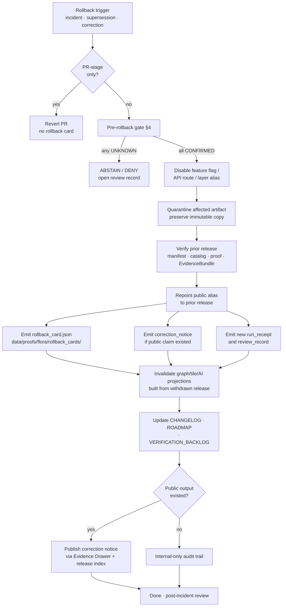

<!-- [KFM_META_BLOCK_V2]
doc_id: kfm://doc/flora-rollback-runbook
title: Flora — Rollback Runbook
type: standard
version: v0.1
status: draft
owners: <flora-stewards>, <release-stewards>, <governance-stewards>
created: 2026-05-08
updated: 2026-05-08
policy_label: public
related:
  - ../../PUBLICATION_AND_POLICY.md
  - ../../PIPELINES_AND_LIFECYCLE.md
  - ../../ROADMAP.md
  - ../../CHANGELOG.md
  - ../../../../adr/ADR-flora-sensitive-location-policy.md
  - ../../../../adr/ADR-flora-public-layer-strategy.md
  - ../../../../../contracts/flora/
  - ../../../../../policy/flora/
  - ../../../../../data/registry/flora/
  - ../../../../../data/proofs/flora/
  - ../../../../../data/published/flora/
tags: [kfm, flora, rollback, governance, runbook, release, correction]
notes:
  - PROPOSED. No mounted repo in this session; paths await verification.
  - Path adds a domain-local `governance/` segment — see Section 0 (Path note).
  - Reason codes and rollback-card field shapes are illustrative until flora schemas land.
[/KFM_META_BLOCK_V2] -->

# Flora — Rollback Runbook

> Operational procedure for reversing a flora release, withdrawing a public layer or API surface, and restoring a verified prior state — without deleting evidence, breaking lineage, or bypassing review.

<!-- BADGES — placeholders; targets to be wired after CI lands -->


> [!IMPORTANT]
> **Rollback is a governed state transition, not a file move and not a deletion.**
> A rollback re-points a verified public alias, emits new proof artifacts, and preserves the
> superseded release in full. If you cannot satisfy every gate in [§4](#4--pre-rollback-verification-gate),
> the correct outcome is `DENY` or `ABSTAIN`, not a partial rollback.

---

## Quick navigation

- [0 · Path note](#0--path-note)
- [1 · Scope and when to use this runbook](#1--scope-and-when-to-use-this-runbook)
- [2 · Doctrinal anchors](#2--doctrinal-anchors)
- [3 · Rollback decision matrix](#3--rollback-decision-matrix)
- [4 · Pre-rollback verification gate](#4--pre-rollback-verification-gate)
- [5 · Rollback flow (diagram)](#5--rollback-flow-diagram)
- [6 · Procedure](#6--procedure)
- [7 · Required artifacts](#7--required-artifacts)
- [8 · Post-rollback obligations](#8--post-rollback-obligations)
- [9 · Anti-patterns and failure modes](#9--anti-patterns-and-failure-modes)
- [10 · Reason-code catalogue](#10--reason-code-catalogue)
- [11 · Rollback drill](#11--rollback-drill)
- [12 · Roles and separation of duties](#12--roles-and-separation-of-duties)
- [13 · Related files and registries](#13--related-files-and-registries)
- [14 · Open verification items](#14--open-verification-items)

---

## 0 · Path note

> [!NOTE]
> **Path:** `docs/domains/flora/governance/runbooks/flora-rollback.md` — **PROPOSED.**
>
> The Flora Architecture Blueprint proposes flora runbooks at
> `docs/domains/flora/runbooks/flora-rollback.md` (no `governance/` segment).
> The path used here groups domain-local governance operations (runbooks, review records,
> rollback cards, ADR back-pointers) under a `governance/` subfolder, which is consistent
> with **Directory Rules** (responsibility-root grouping, anti-fragmentation), but the
> exact placement is **NEEDS VERIFICATION** until either an ADR lands or repo evidence
> is mounted. If the repo settles on the blueprint's flatter layout, this file moves
> with a supersession note rather than a silent rename.

---

## 1 · Scope and when to use this runbook

This runbook governs **flora-domain** rollback for any consequential, evidence-bearing
artifact: published layers, governed API surfaces, EvidenceBundles referenced by public
claims, release manifests, catalog projections, graph/triplet deltas, and tile pyramids.

| Use this runbook when … | Do **not** use this runbook for … |
|---|---|
| A flora release is superseded, withdrawn, or corrected. | PR-stage changes that never merged. |
| A flora public layer or API route is leaking RAW/WORK/QUARANTINE refs. | Editor-only doc fixes with no schema or release impact. |
| Exact sensitive geometry was published and must be withdrawn. | Validator/policy tuning that has not yet shipped to a release. |
| A flora EvidenceBundle backing public claims is invalid or outdated. | Flora taxon authority swaps that do not change a public release. |
| A flora schema/policy change broke compatibility post-release. | Source-registry entry edits that have not entered a release manifest. |
| AI/Focus Mode produced an answer cited to a withdrawn EvidenceBundle. | Routine source-refresh runs (use the source-refresh runbook). |

> [!TIP]
> If the change is **PR-stage only and unmerged**, prefer **Revert PR** or split into a
> smaller PR. No production correction is required, and no rollback card is emitted.

[Back to top ↑](#flora--rollback-runbook)

---

## 2 · Doctrinal anchors

Flora rollback inherits the KFM lifecycle and invariants. Anything that conflicts
with these anchors must be escalated, not worked around.

- **Lifecycle.** `RAW → WORK / QUARANTINE → PROCESSED → CATALOG / TRIPLET → PUBLISHED`,
  with **REVIEW / CORRECTION / ROLLBACK** as explicit governance operations. Promotion
  is a governed state transition, not a file move; the same is true in reverse.
- **Public surfaces are governed.** Public clients and ordinary UI surfaces read
  governed APIs and `data/published/flora/` only. Rollback never re-points a public
  alias to a candidate, RAW, WORK, or QUARANTINE artifact.
- **Cite-or-abstain.** While a rollback is in flight, affected runtime endpoints
  return `ABSTAIN` or `ERROR` rather than serving stale or unsupported claims.
- **Sensitivity-first.** Exact rare-flora locations, controlled-source data, and
  unresolved-rights artifacts default to **deny** during rollback, never the other way.
- **No silent overwrite, no deletion.** The superseded release manifest, proof bundle,
  EvidenceBundle, run receipt, and catalog records remain immutable. Aliases move;
  history is preserved.
- **Evidence outranks generation.** AI-derived flora claims (Focus Mode answers) are
  invalidated when their backing EvidenceBundle is rolled back. The fix is to ABSTAIN
  and republish — not to regenerate text against the prior alias.

> [!CAUTION]
> A rollback that bends an invariant (e.g., deleting a sensitive artifact rather than
> quarantining it, or repointing an alias without verifying the prior release's proof
> bundle) is itself a **policy event** and requires its own review record.

[Back to top ↑](#flora--rollback-runbook)

---

## 3 · Rollback decision matrix

Adapted from the Flora Architecture Blueprint's rollback table. **PROPOSED**.

| Situation | Correct response | Public output? | Artifacts emitted |
|---|---|:---:|---|
| Files proposed in PR but unmerged | Remove from PR; split if needed. | No | — (PR revert only) |
| Schema change breaks compatibility | Revert or pin the prior schema version; keep new schema as draft only if already referenced by receipts. | No (if not in release) | Schema deprecation / migration note |
| Source-registry entry wrong | Revert descriptor; mark source `disabled` / `unverified`; preserve any probe receipt as process memory. | Possibly | Updated `sources.yaml`; new run receipt |
| Validator or policy too strict / too loose | Disable the new workflow invocation **first**; then patch the validator/policy with a fixture proving the expected `deny`/`allow` behaviour. | No | Patched policy + fixture; CI receipt |
| Flora API route misbehaves | Disable route or feature flag; route returns `ERROR` / `ABSTAIN`; keep audit logs and evidence refs. | Yes | Run receipt; review record |
| Public layer leaks sensitivity | **Emergency.** Disable the layer registry entry and public alias immediately; quarantine the artifact; emit correction notice and rollback card. | Yes | Rollback card · Correction notice · Review record · Redaction receipt |
| Published artifact superseded | Publish new release manifest; rollback card links prior → new; preserve old proof, catalog, receipt, lineage. | Yes | New release manifest · Rollback card · Catalog supersession |
| External source terms changed | Disable the watcher; mark the source `controlled` / `unknown`; runtime returns `ABSTAIN` or `DENY` until reviewed. | Yes (degraded) | Source descriptor update · Review record |
| AI/Focus answer cites a withdrawn bundle | Invalidate the AI receipt; Focus route returns `ABSTAIN`; emit a corrected answer only after a new EvidenceBundle is released. | Yes | AI receipt · Correction notice |

[Back to top ↑](#flora--rollback-runbook)

---

## 4 · Pre-rollback verification gate

Before any alias moves or any public message is published, **all** of the following
must be **CONFIRMED** for the proposed rollback target. If any item is `UNKNOWN`,
abort the rollback and resolve evidence first.

- [ ] **Prior release manifest verified.** `flora_release_manifest` for the target
      prior release exists, parses against schema, and matches its catalog matrix.
- [ ] **Prior catalog matrix closed.** STAC / DCAT / PROV / manifest / proof / published
      refs all close for the prior release.
- [ ] **Prior EvidenceBundle verified.** Digests, source refs, review state, and
      correction-notice references resolve and are immutable.
- [ ] **Prior proof bundle integrity check passes.** Checksums match; signatures /
      attestations validate where the repo supports them.
- [ ] **Sensitivity policy still satisfied by the prior release.** Public-safe
      geometry rules in [`policy/flora/sensitivity.rego`](../../../../../policy/flora/sensitivity.rego)
      hold under the *current* sensitivity policy, not just the policy at the time of
      original release.
- [ ] **Rights still satisfied by the prior release.** Source rights / license /
      controlled-access state has not regressed.
- [ ] **Reason code chosen** from the catalogue in [§10](#10--reason-code-catalogue)
      and recorded on the rollback card.
- [ ] **Reviewer scope matches.** A `flora_review_record` with reviewer scope
      covering the affected layer / API / EvidenceBundle is present and decisive.
- [ ] **Promotion-style separation of duties.** The actor performing the rollback
      is **not** the same actor who authored the originating release, where repo
      maturity supports separation. (See [§12](#12--roles-and-separation-of-duties).)
- [ ] **Communication plan ready.** A correction notice is drafted *before*
      the public alias is repointed if any public claim already existed.

> [!WARNING]
> "Verified" means **machine-checked this session**, not "remembered to be true".
> Re-run the catalog-matrix and proof-pack validators against the prior release
> immediately before the alias move; do not rely on the original release receipt alone.

[Back to top ↑](#flora--rollback-runbook)

---

## 5 · Rollback flow (diagram)

The diagram below shows the standard governed rollback path. It reflects KFM
doctrine (lifecycle, governance, no-silent-overwrite) and is **PROPOSED** until
flora release tooling is mounted and verified.



[Back to top ↑](#flora--rollback-runbook)

---

## 6 · Procedure

### 6.1 · Triage and classify

1. Identify the **trigger class** from [§3](#3--rollback-decision-matrix) and
   record it on a rollback intake note. If unsure, escalate to the flora steward.
2. Identify every affected artifact:
   public layer id(s), API route(s), EvidenceBundle id(s), release manifest id(s),
   PMTiles / GeoJSON / GeoParquet outputs, graph deltas, AI receipts citing the
   bundle, and downstream story/Focus payloads.
3. Open or update a `flora_review_record` with scope = the affected artifacts.

### 6.2 · Stop the bleed

4. **Disable first, decide second.** Flip the relevant feature flag or remove the
   alias entry from
   [`data/registry/flora/layer_registry.yaml`](../../../../../data/registry/flora/layer_registry.yaml)
   so public clients and the governed API stop serving the affected surface.
   Routes return `ERROR` or `ABSTAIN` while the rollback is in flight.
5. For sensitivity / rights incidents, **quarantine** the affected artifact under
   `data/quarantine/flora/<reason>/<run_id>/` — never delete. Record a
   `flora_redaction_receipt` if exact geometry was exposed.
6. Pause any flora watchers that could pull the same defective payload again
   (`data/registry/flora/sources.yaml` → set `state: disabled` with reason).

### 6.3 · Verify the rollback target

7. Run the verification gate ([§4](#4--pre-rollback-verification-gate)) end-to-end
   against the **target prior release**. Capture validator output as a run receipt.
8. If any item fails: **abort.** The correct posture is `DENY` until the prior
   release can be re-verified or a different target chosen. Open a verification
   item (see [§14](#14--open-verification-items)).

### 6.4 · Execute the alias move

9. Repoint the public alias to the verified prior release **manifest id**, not to
   a file path. The alias is the contract; the release manifest is the truth.
10. Re-run the public-no-leak validator against the resulting alias to confirm
    no RAW/WORK/QUARANTINE refs surface.
11. Confirm the governed API now serves the prior release's EvidenceBundle refs
    and that Evidence Drawer payloads resolve.

### 6.5 · Emit governance artifacts

12. Create a **rollback card** at
    `data/proofs/flora/rollback_cards/<rollback_id>.json` (see [§7.1](#71--rollback-card)).
13. Create a **correction notice** if any public output already existed
    (see [§7.2](#72--correction-notice)).
14. Update the **review record** with the final decision, reviewer, obligations,
    and any unresolved items.
15. Emit a new **run receipt** under `data/receipts/flora/` recording the rollback
    operation itself.

### 6.6 · Invalidate derivatives

16. Invalidate **graph / triplet** projections (`data/triplet/flora/`) built from
    the withdrawn release; re-derive from the alias target.
17. Invalidate **tile** projections (PMTiles / TileJSON) and rebuild from the
    alias target only after `policy/flora/publish.rego` and
    `policy/flora/sensitivity.rego` re-pass against the new public surface.
18. Invalidate **AI receipts** that cited the withdrawn EvidenceBundle. Focus
    Mode must `ABSTAIN` for affected scopes until a new EvidenceBundle is
    published and re-cited.

### 6.7 · Communicate and close

19. Update [`docs/domains/flora/CHANGELOG.md`](../../CHANGELOG.md) and
    [`docs/domains/flora/ROADMAP.md`](../../ROADMAP.md) with supersession links.
20. If a public claim was affected, surface the correction notice in the Evidence
    Drawer correction-state chip and in the public release index.
21. Schedule a post-incident review. Add any new verification items to
    [`docs/domains/flora/VERIFICATION_BACKLOG.md`](../../VERIFICATION_BACKLOG.md).
22. Update the **rollback drill** fixture set if this incident exposed a gap
    ([§11](#11--rollback-drill)).

[Back to top ↑](#flora--rollback-runbook)

---

## 7 · Required artifacts

> [!NOTE]
> The exact field shapes below are **illustrative**. Authoritative fields live in the
> flora schemas (PROPOSED) once they land:
> [`contracts/flora/`](../../../../../contracts/flora/). The field set draws on
> sister-domain rollback-card patterns (Geology, Archaeology, Soil, Hydrology) which
> the flora schemas are expected to follow with domain-specific additions.

### 7.1 · Rollback card

A rollback card is the **auditable state transition** for the public alias. It does
not mutate or replace the prior release; it records the move.

```json
// data/proofs/flora/rollback_cards/<rollback_id>.json — ILLUSTRATIVE / PROPOSED
{
  "rollback_id": "kfm://rollback/flora/<uuid>",
  "from_release_id": "kfm://release/flora/<date>/<spec_hash_current>",
  "to_release_id":   "kfm://release/flora/<date>/<spec_hash_prior>",
  "current_alias":   "kfm.alias.flora.public.current",
  "reason_code":     "PUBLIC_GEOMETRY_NOT_GENERALIZED",
  "reason_text":     "Generalized layer regression exposed exact rare-flora coordinates.",
  "affected_artifacts": [
    "kfm.layer.flora.occurrence.generalized.public.v1",
    "kfm://evidence/flora/sha256:<hash>"
  ],
  "disable_flags": ["flora.public_layer.disabled", "flora.api.occurrences.abstain"],
  "verification": {
    "prior_release_manifest_verified": true,
    "prior_catalog_matrix_verified":   true,
    "prior_evidence_bundle_verified":  true,
    "prior_proof_bundle_integrity":    true
  },
  "review_record_ref":     "kfm://review/flora/<uuid>",
  "correction_notice_ref": "kfm://correction/flora/<uuid>",
  "new_run_receipt_ref":   "kfm://receipt/flora/<uuid>",
  "policy_decision_ref":   "kfm://decision/flora/<uuid>",
  "reviewer":              "<flora-steward-id>",
  "requested_at":          "YYYY-MM-DDTHH:MM:SSZ",
  "executed_at":           "YYYY-MM-DDTHH:MM:SSZ",
  "effective_at":          "YYYY-MM-DDTHH:MM:SSZ"
}
```

### 7.2 · Correction notice

A correction notice is required **whenever a public output already existed** and the
meaning changed, was corrected, or was withdrawn.

```json
// data/proofs/flora/corrections/<correction_id>.json — ILLUSTRATIVE / PROPOSED
{
  "correction_id":         "kfm://correction/flora/<uuid>",
  "issue_type":            "PUBLIC_GEOMETRY_NOT_GENERALIZED",
  "affected_claims":       ["<claim_id>", "..."],
  "affected_artifacts":    ["<release_id>", "<bundle_id>", "<layer_id>"],
  "prior_release_ref":     "kfm://release/flora/<date>/<spec_hash_current>",
  "corrected_release_ref": "kfm://release/flora/<date>/<spec_hash_prior>",
  "public_summary":        "Plain-language explanation suitable for the Evidence Drawer.",
  "evidence_ref":          "kfm://evidence/flora/sha256:<hash>",
  "reviewer":              "<flora-steward-id>",
  "issued_at":             "YYYY-MM-DDTHH:MM:SSZ"
}
```

### 7.3 · Review record (rollback scope)

A `flora_review_record` covers **scope, evidence checked, sensitivity checked, rights
checked, and obligations**. For rollback, scope must include every artifact listed
in the rollback card's `affected_artifacts`.

### 7.4 · Run receipt (rollback operation)

The rollback itself is a process. Emit a `flora_run_receipt` capturing actor,
inputs, validator outputs, alias-move outcome, and timestamps. Do not reuse the
release run receipt.

### 7.5 · Supersession links

The new and prior release manifests must reference each other:

- New manifest → `supersedes_release_ref` → prior manifest.
- Prior manifest → `superseded_by_release_ref` → new manifest *and*
  `rollback_card_ref` → this rollback card.

The prior EvidenceBundle remains immutable; the new bundle (if emitted) must
carry `supersedes_bundle_ref`.

[Back to top ↑](#flora--rollback-runbook)

---

## 8 · Post-rollback obligations

| Surface | Obligation |
|---|---|
| `data/published/flora/manifests/` | Alias points to verified prior release manifest; old manifest preserved as immutable lineage. |
| `data/proofs/flora/` | New rollback card and correction notice present; old proof bundle untouched. |
| `data/triplet/flora/` | Graph deltas built from the withdrawn release invalidated and rebuilt from the alias target. |
| `data/receipts/flora/` | New run receipt for the rollback operation; old receipts preserved. |
| `data/catalog/{stac,dcat,prov}/flora/` | STAC / DCAT records marked deprecated/superseded; PROV records a rollback / correction activity. |
| Governed API (`/flora/*`) | Returns the alias-target's payloads; affected scopes that lack a verified bundle return `ABSTAIN`. |
| MapLibre public flora layer | Layer descriptor's `release_id` and `evidence_lookup_ref` track the alias target; trust badge reflects current state. |
| Evidence Drawer | `correction_state` chip surfaces the correction notice; freshness reflects rollback `effective_at`. |
| Focus Mode (AI) | Affected scopes `ABSTAIN` until a new EvidenceBundle is released and re-cited. |
| `docs/domains/flora/CHANGELOG.md` | Entry with rollback id, affected scope, reason code, and supersession links. |
| `docs/domains/flora/VERIFICATION_BACKLOG.md` | Any new verification items opened by the incident. |

[Back to top ↑](#flora--rollback-runbook)

---

## 9 · Anti-patterns and failure modes

> [!CAUTION]
> Each of the following is a **rollback-discipline violation** even if it appears
> faster, simpler, or more user-friendly. None of them are acceptable shortcuts.

- **Silent replacement.** Overwriting a published artifact's bytes in place. The
  artifact must remain immutable; the alias moves.
- **Deletion of the superseded release.** Deletes break lineage, audit, and the
  ability to compare diffs. Always preserve, supersede, and link.
- **Repointing to an unverified prior release.** A prior release is not a safe
  target until its catalog matrix, proof bundle, and EvidenceBundle re-verify
  *under the current policy*.
- **Rollback to skip review.** Rollbacks must be reviewed; using a rollback as a
  workaround for a missing review record collapses generation and approval.
- **Treating the layer descriptor as truth.** The layer descriptor reflects the
  release; it does not authorize one. The release manifest is the truth source.
- **Letting AI/Focus continue to answer from a withdrawn bundle.** A withdrawn
  bundle invalidates citations. Affected scopes must `ABSTAIN`, not regenerate.
- **Skipping the correction notice when "no one will notice".** If a public
  output existed and the meaning changed, a correction notice is required.
- **Re-enabling watchers before patching policy/validators.** Watchers will
  pull the same defective payload again; patch first, re-enable second.
- **Touching `data/raw/`, `data/work/`, or `data/quarantine/` to "clean up".**
  These stages are immutable for a reason. Quarantine more, never less.
- **Performing the rollback as the same actor who authored the release**
  in mature setups. Separation of duties is a release control, not a courtesy.

[Back to top ↑](#flora--rollback-runbook)

---

## 10 · Reason-code catalogue

Reason codes mirror the Flora Architecture Blueprint's policy deny / quarantine
catalogue. Pick the **narrowest applicable code**; if none fit, open a backlog
item to extend the catalogue rather than inventing one. **PROPOSED** until the
authoritative list lands in `policy/flora/`.

<details>
<summary><strong>Show reason codes</strong></summary>

| Reason code | Trigger | Typical rollback class |
|---|---|---|
| `precise_sensitive_location_denied` | Exact rare-flora coordinates exposed in public output. | Public layer leaks sensitivity (emergency). |
| `geoprivacy_required` | Public geometry needs generalization but was emitted exact. | Public layer leaks sensitivity. |
| `public_geometry_not_generalized` | Generalization recipe regressed; public-safe geometry validator failed post-release. | Public layer leaks sensitivity. |
| `controlled_access_publication_denied` | Controlled-source data appeared on a public surface. | Public layer leaks sensitivity. |
| `unknown_rights` | Source rights / license unresolved at release time and now contested. | External source terms changed. |
| `missing_rights` | Source rights field missing on a referenced descriptor. | Source-registry entry wrong. |
| `missing_source_id` | A claim resolves to a payload without a stable source id. | Schema / catalog regression. |
| `missing_evidence_bundle` | A claim cites a bundle that no longer resolves. | Published artifact superseded. |
| `public_payload_exposes_internal_ref` | A public payload references a `RAW` / `WORK` / `QUARANTINE` artifact. | Public layer leaks sensitivity. |
| `ambiguous_taxon_identity` | Accepted taxon required but unresolved. | Schema / data regression. |
| `accepted_taxon_required` | Public claim asserts an accepted taxon that is no longer accepted. | Published artifact superseded. |
| `model_as_observation` | Modeled output presented as observed. | API or layer misbehaviour. |
| `knowledge_character_mismatch` | `observed` / `modeled` / `inferred` mismatch in payload. | API or layer misbehaviour. |
| `review_required` | Public release advanced without the required `review_record`. | Schema / governance regression. |
| `steward_review_missing` | Reviewer scope did not cover affected artifacts. | Governance regression. |
| `ai_missing_evidence_bundle_or_citations` | Focus Mode answer lacks a resolvable EvidenceBundle. | AI/Focus answer cites withdrawn bundle. |
| `catalog_matrix_not_closed` | STAC / DCAT / PROV / manifest / proof / published refs do not close. | Schema / catalog regression. |
| `proof_bundle_incomplete` | Proof bundle digest, signature, or refs missing. | Published artifact superseded. |
| `invalid_geometry` | CRS, ring closure, or precision invalid in a public payload. | Public layer leaks sensitivity. |

</details>

[Back to top ↑](#flora--rollback-runbook)

---

## 11 · Rollback drill

A rollback drill validates this runbook against synthetic flora releases without
exposing real public surfaces. Drills are part of the trust membrane: a release
that has never been rolled back in a drill is not safe to roll back live.

**PROPOSED** drill outline (no-network, fixture-only):

1. Stand up a synthetic flora release using fixtures under `tests/fixtures/flora/`
   covering at least: a public-safe occurrence layer, an EvidenceBundle, a
   release manifest, a catalog matrix, and a redaction receipt.
2. Stage a synthetic incident from each row of [§3](#3--rollback-decision-matrix)
   (one per drill cycle is sufficient).
3. Walk the procedure in [§6](#6--procedure) end-to-end against the fixture set.
4. Assert that:
   - The verification gate fails closed when prior-release proofs are tampered.
   - The alias move does not require deletion.
   - The rollback card and correction notice match their schemas.
   - Graph / tile / AI projections are invalidated.
   - `policy/flora/publish.rego` and `policy/flora/sensitivity.rego` re-pass
     against the alias target.
5. Capture the drill output as a run receipt under
   `data/receipts/flora/drills/<drill_id>.json`.

> [!TIP]
> Add a CI job that runs the rollback drill on a recent fixture set on every
> change to `policy/flora/`, `contracts/flora/`, or `data/registry/flora/`.

[Back to top ↑](#flora--rollback-runbook)

---

## 12 · Roles and separation of duties

> [!NOTE]
> Specific named owners are deliberately left as placeholders. Repo-level
> CODEOWNERS and steward assignments are **UNKNOWN** in this session.

| Role | Responsibility in rollback |
|---|---|
| **Flora steward** | Owns flora data, sensitivity policy, and review records. Authorises classification and reason code. |
| **Release steward** | Owns release manifests, alias moves, and rollback cards. Executes the alias move and emits proof artifacts. |
| **Governance steward** | Owns review-record scope, separation-of-duty enforcement, and post-incident review. |
| **Policy steward** | Owns `policy/flora/*.rego` and re-runs the public-no-leak / sensitivity validators against the alias target. |
| **CI steward** | Owns workflow gates and drill execution; verifies CI receipts match expected `deny` / `allow` outcomes. |
| **Communications owner** | Owns the public-facing correction notice text and Evidence Drawer correction state. |

When repo maturity supports it, the actor who **authored the originating release**
must not be the actor who **executes the rollback alias move**. Until that maturity
exists, record both actors on the rollback card and review record so the audit
trail can later be retro-checked.

[Back to top ↑](#flora--rollback-runbook)

---

## 13 · Related files and registries

> [!NOTE]
> All paths below are **PROPOSED** until repo evidence is mounted. The flora
> blueprint proposes them; this runbook references them by their proposed homes.

**Schemas** ([`contracts/flora/`](../../../../../contracts/flora/))

- `flora_release_manifest.schema.json`
- `flora_evidence_bundle.schema.json`
- `flora_decision_envelope.schema.json`
- `flora_review_record.schema.json`
- `flora_redaction_receipt.schema.json`
- `flora_run_receipt.schema.json`
- `flora_layer_descriptor.schema.json`
- `flora_catalog_matrix.schema.json`

**Policy** ([`policy/flora/`](../../../../../policy/flora/))

- `publish.rego` — publication allow/deny rules
- `sensitivity.rego` — sensitive geometry and rare flora rules
- `rights.rego` — rights / license / controlled-access rules
- `catalog.rego` — catalog / proof closure rules
- `ai.rego` — AI / Focus citation and restricted-disclosure rules
- `review.rego` — steward review requirements

**Registries** ([`data/registry/flora/`](../../../../../data/registry/flora/))

- `sources.yaml` · `source_roles.yaml` · `sensitivity_policies.yaml`
- `taxon_authorities.yaml` · `layer_registry.yaml` · `rights_profiles.yaml`

**Lifecycle paths**

- `data/proofs/flora/rollback_cards/` — rollback cards
- `data/proofs/flora/corrections/` — correction notices
- `data/proofs/flora/evidence_bundles/` — EvidenceBundles
- `data/published/flora/manifests/` — release manifests
- `data/receipts/flora/` — run receipts
- `data/triplet/flora/` — graph / triplet projections
- `data/catalog/{stac,dcat,prov}/flora/` — catalog projections

**Decision records** ([`docs/adr/`](../../../../adr/))

- `ADR-flora-schema-home.md`
- `ADR-flora-source-roles.md`
- `ADR-flora-sensitive-location-policy.md`
- `ADR-flora-public-layer-strategy.md`

**Sibling flora docs** ([`docs/domains/flora/`](../../))

- [`PUBLICATION_AND_POLICY.md`](../../PUBLICATION_AND_POLICY.md)
- [`PIPELINES_AND_LIFECYCLE.md`](../../PIPELINES_AND_LIFECYCLE.md)
- [`UI_AND_EVIDENCE_DRAWER.md`](../../UI_AND_EVIDENCE_DRAWER.md)
- [`VERIFICATION_BACKLOG.md`](../../VERIFICATION_BACKLOG.md)
- [`CHANGELOG.md`](../../CHANGELOG.md) · [`ROADMAP.md`](../../ROADMAP.md)

[Back to top ↑](#flora--rollback-runbook)

---

## 14 · Open verification items

The following items must be resolved before this runbook moves from `draft` to
`published`. They mirror the Flora Blueprint's "Open Questions and Verification
Backlog" and are flagged as **UNKNOWN** or **NEEDS VERIFICATION** in this session.

| # | Item | Status | Verification method |
|--:|---|---|---|
| 1 | Mounted-repo flora layout (paths in §13) | UNKNOWN | Mount checkout; rerun directory pre-flight. |
| 2 | Schema home (`contracts/flora/` vs `schemas/contracts/v1/flora/`) | NEEDS VERIFICATION | ADR `ADR-flora-schema-home.md`. |
| 3 | Existing shared rollback-card schema reuse | UNKNOWN | Search for `rollback_card.schema.json`, `correction_notice.schema.json`. |
| 4 | Exact `flora_release_manifest` / `flora_review_record` field shape | NEEDS VERIFICATION | Inspect flora schemas after they land. |
| 5 | OPA / Conftest version and CI gating | UNKNOWN | Inspect `.github/workflows/` and `policy/flora/`. |
| 6 | MapLibre layer-registry path and shell | UNKNOWN | Inspect `apps/` map shell + `data/registry/flora/layer_registry.yaml`. |
| 7 | Governed API framework and route names for `/flora/*` | UNKNOWN | Inspect `apps/governed_api/`. |
| 8 | Tile-invalidation tooling (PMTiles rebuild) | UNKNOWN | Inspect tile build pipeline / proofs. |
| 9 | AI receipt invalidation surface in Focus adapter | UNKNOWN | Inspect Focus adapter and `runtime/ai/`. |
| 10 | Branch protections and required checks for rollback PRs | UNKNOWN | Inspect repository settings. |
| 11 | CODEOWNERS / steward assignment for flora rollback | UNKNOWN | Assign in CODEOWNERS after repo review. |
| 12 | Drill fixture coverage for each row in §3 | NEEDS VERIFICATION | Build fixtures under `tests/fixtures/flora/`. |
| 13 | Path validity of this runbook (`docs/domains/flora/governance/runbooks/`) vs blueprint's `docs/domains/flora/runbooks/` | NEEDS VERIFICATION | ADR or repo evidence; supersede with migration note if changed. |

[Back to top ↑](#flora--rollback-runbook)

---

> _This document is **PROPOSED** and lives under domain governance for flora. It
> does not authorise any rollback by itself; it codifies the procedure that an
> authorised flora steward and release steward must follow. Evidence still wins._
