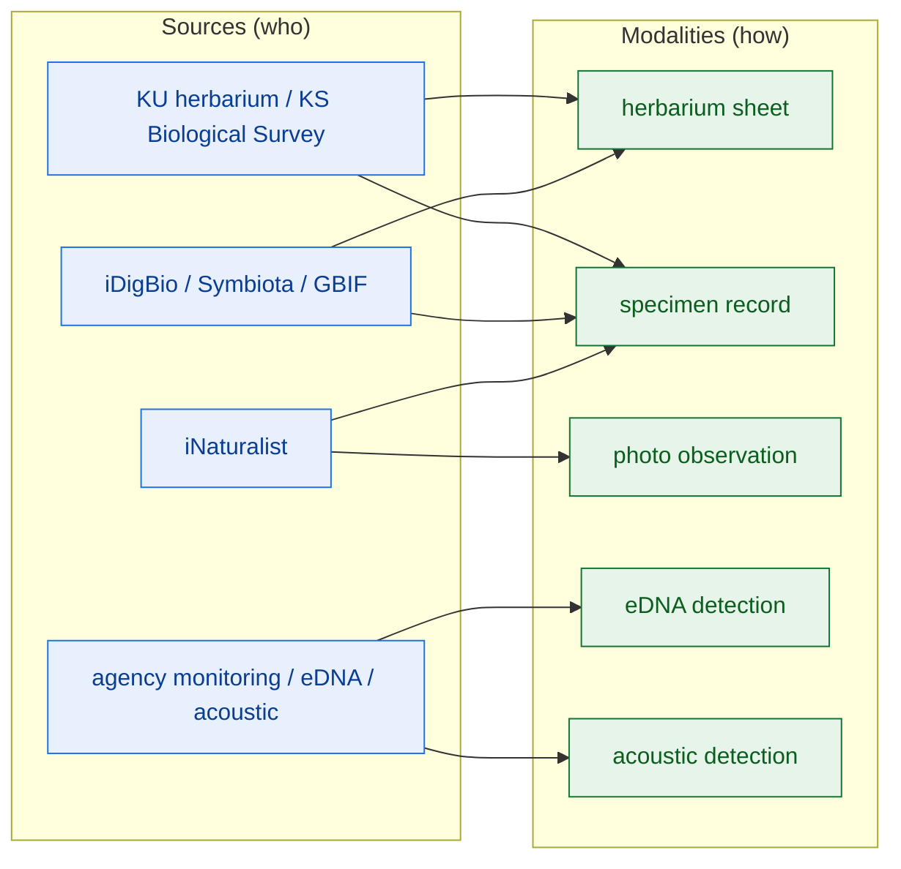
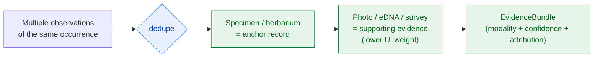

<!-- [KFM_META_BLOCK_V2]
doc_id: kfm://doc/docs-domains-flora-modalities-readme
title: Flora Domain — Observation Modalities
type: standard
version: v1
status: draft
owners: [NEEDS VERIFICATION — flora domain steward; source steward; docs steward]
created: 2026-06-02
updated: 2026-06-02
policy_label: public
related:
  - docs/domains/flora/README.md
  - docs/domains/flora/SOURCES.md
  - docs/domains/flora/SOURCE_FAMILIES.md
  - docs/domains/flora/SENSITIVITY.md
  - docs/doctrine/directory-rules.md
  - docs/doctrine/ai-build-operating-contract.md
tags: [kfm, domain, flora, modality, observation-type, evidence-weight, dedupe]
notes:
  # "Modality" = observation/evidence TYPE (specimen, photo, eDNA, acoustic, herbarium sheet). This is a DOCUMENTATION FRAMING, not a canonical KFM term — the corpus has no "modality"/"modalities". See §1.
  # Modality is NOT source: one source delivers many modalities; one modality comes from many sources. Do not collapse with SOURCES.md / SOURCE_FAMILIES.md.
  # Modality affects evidentiary weight (specimen anchors dedupe) and sensitivity (rare-plant exact location fails closed regardless of modality).
  # Folder placement is a sub-segment under docs/domains/flora/; novel — confirm it does not duplicate the source docs. CONFLICTED-lite; see §1.
  # Flora ownership + object families CONFIRMED (Atlas Ch. 8). Doctrine-adjacent; CONTRACT_VERSION = "3.0.0" pinned.
[/KFM_META_BLOCK_V2] -->

# Flora Domain — Observation Modalities

> The forms a Flora observation can take — specimen, photograph, eDNA, acoustic, herbarium sheet — and why the form matters: it sets evidentiary weight in dedupe and display, and it never overrides the lane's sensitivity rules. This README orients the `modalities/` sub-area; truth about sources lives in [SOURCES.md](../SOURCES.md), and sensitivity rules in [SENSITIVITY.md](../SENSITIVITY.md).

  <b>Modality ≠ source · Specimen anchors dedupe · Weight varies · Sensitivity is modality-independent</b>

---

**Status:** draft · **Owners:** _NEEDS VERIFICATION (flora + source + docs stewards)_ · **Last updated:** 2026-06-02 · **`CONTRACT_VERSION = "3.0.0"`**

---

## Quick links

- [1. A note on the term, and the folder](#1-a-note-on-the-term-and-the-folder)
- [2. Scope](#2-scope)
- [3. Modality is not source](#3-modality-is-not-source)
- [4. The Flora modalities](#4-the-flora-modalities)
- [5. Evidentiary weight and dedupe](#5-evidentiary-weight-and-dedupe)
- [6. Sensitivity is modality-independent](#6-sensitivity-is-modality-independent)
- [7. Modality → object family → source role](#7-modality--object-family--source-role)
- [8. What belongs in this folder](#8-what-belongs-in-this-folder)
- [9. Open questions register](#9-open-questions-register)
- [10. Verification backlog](#10-verification-backlog)
- [11. Changelog & definition of done](#11-changelog--definition-of-done)
- [12. Related docs](#12-related-docs)

---

## 1. A note on the term, and the folder

> [!IMPORTANT]
> **"Modality" is a documentation framing, not a canonical KFM term.** The KFM corpus does not use "modality" or "modalities." It does, however, clearly distinguish observation *types* and weight them differently — specimen-backed vs citizen-science photo vs eDNA vs acoustic vs coverage-layer — and it makes dedupe and UI-weight decisions turn on exactly that distinction. This README uses "modality" as a convenient label for **observation/evidence type**. The underlying *distinctions* are CONFIRMED doctrine; the *word* is this doc's framing. [DOM-FLORA] [ENCY KFM-P2 cards]

> [!WARNING]
> **Folder placement is novel — confirm it earns its own home.** `docs/domains/flora/modalities/` is a sub-segment under the Flora lane. That is defensible (a topical sub-area of `docs/domains/flora/`), but Directory Rules warns against convenience groupings that duplicate an existing home. Modality detail must **not** restate [SOURCES.md](../SOURCES.md) or [SOURCE_FAMILIES.md](../SOURCE_FAMILIES.md). If this folder would only repeat source content, fold it into those docs instead and log the decision in `docs/registers/DRIFT_REGISTER.md`. [DIRRULES §3, §13]

[Back to top ↑](#top)

---

## 2. Scope

**CONFIRMED distinctions / framing-level term.** This folder documents the **observation modalities** of the Flora lane: the physical or methodological form a plant observation takes, the evidentiary weight each carries, and how modality interacts with — but never overrides — the lane's sensitivity rules. The Flora lane governs plant taxonomic identity, occurrences, specimens, surveys, vegetation communities, and rare/protected/culturally sensitive flora (Atlas Ch. 8). [DOM-FLORA] [ENCY]

This README **explains**; it does not **decide**. Source identity/rights/role live in [SOURCES.md](../SOURCES.md); sensitivity rules live in [SENSITIVITY.md](../SENSITIVITY.md); object shape lives in the schema home. On conflict, those win over this orientation doc.

[Back to top ↑](#top)

---

## 3. Modality is not source

The single most important distinction in this folder: **a modality is how an observation was made; a source is who provided it.** They are orthogonal.

- **One source delivers many modalities.** iNaturalist carries photos *and* (sometimes) specimen-vouchered records; a herbarium portal carries specimen sheets *and* their digitized images.
- **One modality comes from many sources.** Herbarium specimens arrive via iDigBio, Symbiota, KU herbarium surfaces, and GBIF alike.

> [!NOTE]
> Because the mapping is many-to-many, modality is recorded **per observation**, not per source. A `SourceDescriptor` says who and under what rights/role; the observation record says which modality. Conflating them re-creates the source-role anti-collapse error at the evidence layer. [ENCY §24.1]

[Back to top ↑](#top)

---

## 4. The Flora modalities

**CONFIRMED distinctions / PROPOSED enumeration.** The set below is the observation-type distinction the corpus draws for biological evidence, applied to Flora. The *list* is a PROPOSED enumeration for this lane; the *weight/sensitivity behavior* is CONFIRMED doctrine. [DOM-FLORA] [ENCY]

| Modality | What it is | Evidentiary weight | Typical Flora object family |
|---|---|---|---|
| **Herbarium sheet** | A physical pressed/mounted specimen with a catalog record (often digitized) | Highest — vouchered, re-examinable | SpecimenRecord |
| **Specimen record** | A vouchered physical specimen record (collection-backed) | Highest — anchors dedupe | SpecimenRecord |
| **Photo observation** | A georeferenced photograph (e.g., citizen science), often with a confidence grade | Medium — verifiable but not vouchered | Flora Occurrence |
| **eDNA detection** | Environmental-DNA evidence of presence | Medium — presence signal; not a physical voucher | Flora Occurrence (detection) |
| **Acoustic detection** | Less common for flora; included for completeness where a methodology applies | Low/specialized | Flora Occurrence (detection) |
| **Survey record** | A botanical survey observation (effort-based) | Medium — method-dependent | Botanical Survey |

> [!CAUTION]
> Acoustic detection is rare for flora and is included only for parity with the broader biological-evidence vocabulary. Do not assert an acoustic Flora pipeline exists without evidence — its presence in this lane is **NEEDS VERIFICATION**.

[Back to top ↑](#top)

---

## 5. Evidentiary weight and dedupe

**CONFIRMED doctrine.** Flora observation modalities differ in weight, and the lane must not flatten that difference. The discipline mirrors the Fauna lane's. [ENCY KFM-P2 cards] [DOM-FLORA]

1. **Specimen-backed modalities anchor dedupe.** When the same occurrence is reported by a herbarium specimen and a citizen-science photo, the **specimen anchors** the deduplicated record; the photo does not displace it.
2. **Citizen-science modalities carry less UI weight.** Photo observations and detections should **not** be presented with identical UI weight to specimen-backed points — the quality variance is real and must be visible to a viewer.
3. **Modality and confidence flow into the EvidenceBundle.** The modality, the confidence grade (e.g., research-grade), and the verifier/attribution travel into the EvidenceBundle so downstream consumers can filter.

> [!NOTE]
> This is the same anti-collapse discipline applied *within* the `observed` source role: a research-grade photo and a vouchered specimen are both `observed`, but they are not interchangeable in dedupe or display. Modality is the field that records the difference. [ENCY §24.1]

[Back to top ↑](#top)

---

## 6. Sensitivity is modality-independent

> [!CAUTION]
> **Modality never relaxes sensitivity.** A rare/protected/culturally sensitive plant's exact location **fails closed regardless of how it was observed** — specimen, photo, eDNA, or survey. A high-resolution herbarium label and a citizen-science photo are equally subject to geoprivacy generalization + RedactionReceipt before any public release. Modality affects *weight*, not *permission*. [DOM-FLORA] [OPCON §23.2]

| Modality | Sensitivity behavior |
|---|---|
| Herbarium sheet / specimen | Label locality for a rare plant is sensitive; generalize before public release |
| Photo observation | Embedded GPS / background cues can reveal exact location; respect obscured-coordinate flags |
| eDNA / acoustic detection | Detection geometry for a sensitive taxon fails closed |
| Survey record | Survey points for sensitive taxa fail closed; aggregate for public |

Disposition routes through the AI Build Operating Contract §23.2 sensitive-domain matrix (rare-species / culturally sensitive rows): DENY exact exposure; generalize; RedactionReceipt + steward review. This README points to [SENSITIVITY.md](../SENSITIVITY.md); it does not restate the parameters. [OPCON §23.2]

[Back to top ↑](#top)

---

## 7. Modality → object family → source role

How modality sits alongside the lane's other classifications (each orthogonal, none a substitute for the others):

| Axis | Question it answers | Where it lives |
|---|---|---|
| **Modality** | *How was it observed?* | the observation record (this folder explains it) |
| **Object family** | *What kind of thing is it?* | `contracts/domains/flora/` + `schemas/contracts/v1/domains/flora/` |
| **Source role** | *What authority does the source carry?* | `SourceDescriptor.source_role` (canonical seven-class enum) |
| **Sensitivity tier** | *May it be released, and how?* | `policy/sensitivity/flora/` |

> [!TIP]
> A worked read: *a research-grade iNaturalist photo (modality: photo) of a rare orchid (object: Flora Occurrence / Rare Plant Record) from an aggregator (source role: observed) defaults to deny at exact location (sensitivity: T4-equivalent).* Four orthogonal facts; none collapses into another.

[Back to top ↑](#top)

---

## 8. What belongs in this folder

| Candidate content | Verdict | Where it really belongs |
|---|---|---|
| Per-modality explainer pages (specimen, photo, eDNA, survey) | **Yes** | here (`docs/domains/flora/modalities/<modality>.md`) |
| Modality → evidentiary-weight / dedupe doctrine | **Yes** | here (this README + per-modality pages) |
| Source identity / rights / role | **No** | [SOURCES.md](../SOURCES.md) / [SOURCE_FAMILIES.md](../SOURCE_FAMILIES.md) |
| Sensitivity rules / geoprivacy parameters | **No** | `policy/sensitivity/flora/`; explained in [SENSITIVITY.md](../SENSITIVITY.md) |
| Object schemas | **No** | `schemas/contracts/v1/domains/flora/` |
| A `modality` enum used by schemas | **Schema home, not here** | `schemas/contracts/v1/...`; this folder only explains it |

> [!WARNING]
> If, on review, this folder would only restate source content, **retire it** and move the dedupe/weight doctrine into [SOURCE_FAMILIES.md §7](../SOURCE_FAMILIES.md) (the Fauna sibling already homes that discipline there). The test for keeping `modalities/` is whether per-modality explainer pages add value that the source docs cannot. [DIRRULES §13]

[Back to top ↑](#top)

---

## 9. Open questions register

| ID | Question | Owner role | Resolution path |
|---|---|---|---|
| OQ-FLORA-MOD-01 | Does `docs/domains/flora/modalities/` earn its own home, or should modality doctrine fold into SOURCE_FAMILIES.md? | Docs + flora stewards | Review against SOURCES/SOURCE_FAMILIES; DRIFT_REGISTER if retained |
| OQ-FLORA-MOD-02 | Is there a canonical `modality` field on Flora observation schemas, and what is its enum? | Schema steward | `schemas/contracts/v1/domains/flora/` + ADR |
| OQ-FLORA-MOD-03 | Should "modality" become canonical KFM vocabulary, or stay a doc framing for "observation type"? | Docs steward | Glossary ADR |
| OQ-FLORA-MOD-04 | Dedupe authority order across specimen / photo / eDNA / survey for Flora. | Flora domain steward | Dedupe policy + tests |
| OQ-FLORA-MOD-05 | Whether acoustic modality applies to Flora at all in this repo. | Flora domain steward | Repo + method inspection |

[Back to top ↑](#top)

---

## 10. Verification backlog

These items remain `NEEDS VERIFICATION` before this README is promoted from `draft` to `published`.

1. **NEEDS VERIFICATION** — Whether the `modalities/` folder should exist (OQ-FLORA-MOD-01) vs folding into the source docs.
2. **NEEDS VERIFICATION** — Presence/absence of a `modality` field in the Flora observation schemas and its enum values.
3. **NEEDS VERIFICATION** — Dedupe authority order and UI-weight rules for Flora modalities.
4. **NEEDS VERIFICATION** — Whether acoustic (and the full eDNA pipeline) apply to Flora in this repo.
5. **NEEDS VERIFICATION** — Presence of sibling Flora docs (`README.md`, `SOURCES.md`, `SOURCE_FAMILIES.md`, `SENSITIVITY.md`) this README links to.
6. **NEEDS VERIFICATION** — Owners.

[Back to top ↑](#top)

---

## 11. Changelog & definition of done

### 11.1 Changelog

| Change | Type (per contract §37) | Reason |
|---|---|---|
| Initial Flora modalities sub-area README | new | No prior README existed at this path |
| Flagged "modality" as a doc framing, not canonical KFM vocabulary | clarification | Corpus has no "modality"/"modalities"; truth-label discipline |
| Surfaced the folder-placement question (modality vs source duplication) | clarification | Directory Rules §13 convenience-grouping caution |
| Grounded modality → weight / dedupe / sensitivity in CONFIRMED biological-evidence doctrine | gap closure | Specimen-anchors-dedupe and modality-independent-sensitivity are CONFIRMED |
| Pinned `CONTRACT_VERSION = "3.0.0"` | housekeeping | Doctrine-adjacent doc requirement |

> **Backward compatibility.** New file; no existing anchors. If OQ-FLORA-MOD-01 resolves against the folder, this content folds into `SOURCE_FAMILIES.md` / `SENSITIVITY.md` and the folder is retired with a DRIFT_REGISTER note.

### 11.2 Definition of done

This README is done enough to enter the repository when:

- the folder-existence question (OQ-FLORA-MOD-01) is resolved, or the folder is explicitly retained with a DRIFT_REGISTER entry;
- a flora domain steward, a source steward, and a docs steward review it;
- it is linked from `docs/domains/flora/README.md`;
- it does not duplicate `SOURCES.md` / `SOURCE_FAMILIES.md` (modality ≠ source is preserved);
- it does not restate sensitivity parameters (those stay in `policy/sensitivity/flora/`);
- the `GENERATED_RECEIPT.json` planned for this artifact is wired into CI;
- future changes follow the operating contract's §37 lifecycle.

[Back to top ↑](#top)

---

## 12. Related docs

- [`docs/domains/flora/README.md`](../README.md) — Flora domain landing page *(PROPOSED — verify presence)*
- [`docs/domains/flora/SOURCES.md`](../SOURCES.md) — source doctrine, canonical role enum *(PROPOSED)*
- [`docs/domains/flora/SOURCE_FAMILIES.md`](../SOURCE_FAMILIES.md) — per-family detail; dedupe / UI-weight discipline *(PROPOSED)*
- [`docs/domains/flora/SENSITIVITY.md`](../SENSITIVITY.md) — deny-by-default, rare-plant geoprivacy *(PROPOSED)*
- [`docs/doctrine/directory-rules.md`](../../../doctrine/directory-rules.md) — §3 (root/sub-segment rule), §13 (convenience-grouping anti-pattern)
- [`docs/doctrine/ai-build-operating-contract.md`](../../../doctrine/ai-build-operating-contract.md) — `CONTRACT_VERSION = "3.0.0"`; §23.2 sensitive-domain matrix
- **Atlas references:** Atlas v1.1 Ch. 8 (Flora — object families incl. SpecimenRecord, Flora Occurrence, Rare Plant Record, Botanical Survey), §24.1 (source-role anti-collapse); Pass-2/Pass-9 KFM-P2 cards (specimen vs citizen-science weight; eDNA/coverage-layer handling)

[Back to top ↑](#top)

---

### Footer

**Related docs:** [flora/README.md](../README.md) · [SOURCES.md](../SOURCES.md) · [SOURCE_FAMILIES.md](../SOURCE_FAMILIES.md) · [SENSITIVITY.md](../SENSITIVITY.md)

**Last updated:** 2026-06-02 · **Owners:** _NEEDS VERIFICATION_ · **Status:** draft · **`CONTRACT_VERSION = "3.0.0"`** · **Term note:** _"modality" is a doc framing, not canonical_

[Back to top ↑](#top)
