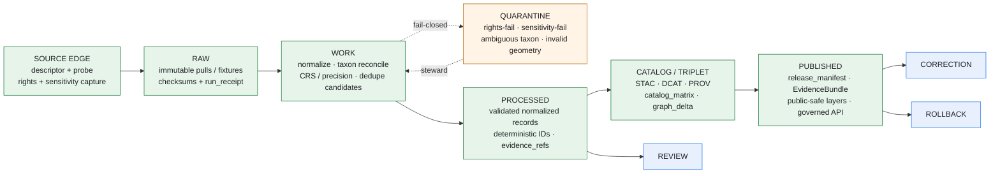

<!-- [KFM_META_BLOCK_V2]
doc_id: kfm://doc/flora-pipelines-and-lifecycle
title: Flora — Pipelines and Lifecycle
type: standard
version: v0.1
status: draft
owners: <flora-steward — TBD>
created: 2026-05-08
updated: 2026-05-08
policy_label: public
related:
  - ../README.md
  - ../ARCHITECTURE.md
  - ../SOURCE_REGISTRY.md
  - ../DATA_MODEL.md
  - ../PUBLICATION_AND_POLICY.md
  - ../UI_AND_EVIDENCE_DRAWER.md
  - ../VERIFICATION_BACKLOG.md
  - ../CHANGELOG.md
  - ../adr/ADR-flora-schema-home.md
  - ../adr/ADR-flora-source-roles.md
  - ../adr/ADR-flora-sensitive-location-policy.md
  - ../runbooks/flora-ingest.md
  - ../runbooks/flora-promotion.md
  - ../runbooks/flora-rollback.md
tags: [kfm, flora, pipelines, lifecycle, watchers, governance, ingest, promotion]
notes:
  - "The path docs/domains/flora/operations/PIPELINES_AND_LIFECYCLE.md is PROPOSED. The Flora Architecture Blueprint Appendix B places this file flat at docs/domains/flora/PIPELINES_AND_LIFECYCLE.md; the operations/ subfolder NEEDS VERIFICATION against current repo evidence or an ADR before this path is treated as canonical."
  - "All flora implementation paths, schemas, validators, pipeline modules, CI workflows, and runtime routes named here are PROPOSED until the repository is mounted and inspected."
  - "Lifecycle invariants (SOURCE EDGE → RAW → WORK/QUARANTINE → PROCESSED → CATALOG/TRIPLET → PUBLISHED, with REVIEW/CORRECTION/ROLLBACK as governance ops) are CONFIRMED KFM doctrine."
[/KFM_META_BLOCK_V2] -->

# Flora — Pipelines and Lifecycle

> The watcher and lifecycle guide for the KFM Flora lane: how plant data moves from external authorities through governed stages into public-safe layers, with receipts, gates, and rollback at every step.

<!-- Impact block -->
[](#status-and-maturity)
[](#1-scope-and-authority)
[](#5-lifecycle-architecture)
[](#11-ci-workflows-no-live-network)
[](#9-sensitivity-geoprivacy-and-quarantine)
[](#status-and-maturity)
<!-- Owner / status placeholders are deliberately left for review. -->

**Owners:** flora steward _(name TBD — see [Flora README](../README.md))_  
**Status:** _draft, control-plane authority_  
**Repo fit:** `docs/domains/flora/operations/` (PROPOSED — see [Repo fit](#2-repo-fit))

---

### Quick jumps

[1. Scope & authority](#1-scope-and-authority) ·
[2. Repo fit](#2-repo-fit) ·
[3. Inputs](#3-inputs) ·
[4. Exclusions](#4-exclusions) ·
[5. Lifecycle architecture](#5-lifecycle-architecture) ·
[6. Lifecycle stages](#6-lifecycle-stages-and-fail-closed-conditions) ·
[7. Watcher contract](#7-watcher-contract) ·
[8. Source families & roles](#8-source-families-and-source-roles) ·
[9. Sensitivity & quarantine](#9-sensitivity-geoprivacy-and-quarantine) ·
[10. Pipeline file matrix](#10-pipeline-file-matrix) ·
[11. CI workflows](#11-ci-workflows-no-live-network) ·
[12. Receipts, manifests, proofs](#12-receipts-manifests-and-proofs) ·
[13. Promotion gates](#13-promotion-gates) ·
[14. Rollback & correction](#14-rollback-and-correction) ·
[15. Anti-fragmentation](#15-anti-fragmentation-rules) ·
[16. Open verification](#16-open-verification-items) ·
[17. Related docs](#17-related-documents)

---

## Status and maturity

> [!IMPORTANT]
> Most claims in this guide are **PROPOSED**. The repository was not mounted in the session that produced this draft. Until the working repo, contracts, validators, and CI are inspected, every path, schema name, route, validator command, and CI workflow named below is a design target — not a fact about current implementation.

| Truth label | Applies to |
|---|---|
| **CONFIRMED** | KFM lifecycle invariants; watcher pattern shape; source-role discipline; promotion-gate doctrine; cite-or-abstain default. |
| **PROPOSED** | All `pipelines/flora/*`, `packages/flora/*`, `tools/validators/flora/*`, `data/registry/flora/*`, schema homes, CI workflow filenames, and the `docs/domains/flora/operations/` subfolder location. |
| **NEEDS VERIFICATION** | Whether this file lives flat under `docs/domains/flora/` (per the Flora Blueprint Appendix B) or under `docs/domains/flora/operations/` (per current request). Schema home: `contracts/flora/` vs `schemas/contracts/v1/flora/`. NatureServe distribution policy. Cross-source dedupe tie-breakers. |
| **UNKNOWN** | Repo evidence depth (workflows, tests, runtime). Real validator/CI tool versions. Steward identity. |

---

## 1. Scope and authority

This document is the **flora lane control plane** for ingestion-through-publication. It defines _how_ flora data is governed end-to-end and _why_ each stage exists. It does not implement schemas, validators, or routes — those live in machine-readable contracts, code, and tests.

**Authority level.** Control-plane / implementation-bearing doctrine. Changes here are policy-significant and require flora-steward review.

**Companion documents** (sibling control-plane docs):

- [`../SOURCE_REGISTRY.md`](../SOURCE_REGISTRY.md) — human guide to flora source descriptors and rights notes
- [`../DATA_MODEL.md`](../DATA_MODEL.md) — object families, IDs, relations, lifecycle fields
- [`../PUBLICATION_AND_POLICY.md`](../PUBLICATION_AND_POLICY.md) — rights, sensitivity, public-safe rules
- [`../UI_AND_EVIDENCE_DRAWER.md`](../UI_AND_EVIDENCE_DRAWER.md) — runtime payload contract
- [`../VERIFICATION_BACKLOG.md`](../VERIFICATION_BACKLOG.md) — open checks and evidence gaps
- [`../CHANGELOG.md`](../CHANGELOG.md) — material changes to flora docs/contracts

> [!NOTE]
> **Anti-fragmentation rule.** Update this file in place when flora pipeline behavior changes; do not create parallel pipeline docs for the same concept. Route unresolved ideas into `../IDEA_INTAKE.md`, an ADR, or `../VERIFICATION_BACKLOG.md`. (See §15.)

---

## 2. Repo fit

**This file (PROPOSED):** `docs/domains/flora/operations/PIPELINES_AND_LIFECYCLE.md`

**Directory Rules basis.** Per [`Directory Rules.pdf`](../../../../Directory_Rules.pdf), domain folders never become repo roots; flora belongs under responsibility roots — `docs/domains/`, `schemas/contracts/v1/domains/`, `policy/domains/`, `tests/domains/`, `data/raw/<domain>/`, `data/processed/<domain>/`, etc. This file therefore lives under `docs/domains/flora/`. The `operations/` subfolder is a **PROPOSED** sub-organization that NEEDS VERIFICATION against the live repo or an ADR; the Flora Blueprint Appendix B currently places this file flat at `docs/domains/flora/PIPELINES_AND_LIFECYCLE.md`.

```text
docs/
└── domains/
    └── flora/
        ├── README.md
        ├── ARCHITECTURE.md
        ├── SOURCE_REGISTRY.md
        ├── DATA_MODEL.md
        ├── PUBLICATION_AND_POLICY.md
        ├── UI_AND_EVIDENCE_DRAWER.md
        ├── VERIFICATION_BACKLOG.md
        ├── CHANGELOG.md
        ├── ROADMAP.md
        ├── adr/
        │   ├── ADR-flora-schema-home.md
        │   ├── ADR-flora-source-roles.md
        │   └── ADR-flora-sensitive-location-policy.md
        ├── runbooks/
        │   ├── flora-ingest.md
        │   ├── flora-promotion.md
        │   └── flora-rollback.md
        └── operations/                      # PROPOSED subfolder
            └── PIPELINES_AND_LIFECYCLE.md   # ← this file
```

**Upstream feeders (PROPOSED machine homes):**

- `data/registry/flora/sources.yaml` (descriptors, rights, sensitivity)
- `data/registry/flora/source_roles.yaml`, `sensitivity_policies.yaml`, `taxon_authorities.yaml`
- `contracts/flora/*.schema.json` _or_ `schemas/contracts/v1/flora/*.schema.json` (schema home — ADR pending)
- `policy/flora/*.rego`
- Shared KFM doctrine: pipeline lifecycle law, EvidenceBundle, ReleaseManifest, PROV/STAC/DCAT contracts

**Downstream consumers (PROPOSED):**

- `pipelines/flora/*` modules and `packages/flora/src/flora/*` libraries
- `tools/validators/flora/*` and `tools/ci/render_flora_summary.py`
- `tests/flora/*` and `tests/fixtures/flora/{valid,invalid,promotion,policy,api,ui}/`
- `apps/governed_api/openapi/flora.v1.yaml` (or repo-equivalent governed API contract)
- `.github/workflows/flora-ci.yml`, `.github/workflows/flora-promotion.yml`

---

## 3. Inputs

This guide is the human reading lane for _the lifecycle of plant data_. The materials below are admissible inputs:

- **Source descriptors and registries** — flora `SourceDescriptor` records, source-role definitions, sensitivity policies, taxon authority maps.
- **Pipeline code & libraries** — modules under `pipelines/flora/` and `packages/flora/`, plus their fixtures.
- **Validators and policy** — `tools/validators/flora/*` outputs, OPA/Rego policies under `policy/flora/`.
- **Receipts, manifests, and proofs** — run/transform/redaction receipts; release manifests; proof bundles produced in governed runs.
- **Adjacent doctrine** — KFM Pipeline Living Implementation Manual, Flora Architecture Blueprint, Directory Rules, Encyclopedia.

---

## 4. Exclusions

> [!WARNING]
> **What does not belong here.**
>
> - **Live endpoint secrets, API keys, or rotation procedures** — these belong in repo-wide secrets handling and `SECURITY.md`.
> - **Exact sensitive coordinates** for rare/protected/culturally sensitive flora — public docs never carry exact rare-plant points. See [`../PUBLICATION_AND_POLICY.md`](../PUBLICATION_AND_POLICY.md).
> - **Schema field-by-field reference** — that is the role of contract files and [`../DATA_MODEL.md`](../DATA_MODEL.md). Cite schema names; do not redefine them.
> - **UI rendering rules** — see [`../UI_AND_EVIDENCE_DRAWER.md`](../UI_AND_EVIDENCE_DRAWER.md).
> - **Promotion or rollback step-by-step procedures** — see runbooks under [`../runbooks/`](../runbooks/).
> - **Marketing or aspirational language** — claims must be CONFIRMED, PROPOSED, NEEDS VERIFICATION, or UNKNOWN.

---

## 5. Lifecycle architecture

KFM Flora preserves the project-wide truth lifecycle. **Promotion is a governed state transition, not a file move.** Derived layers remain derived unless explicitly promoted.



**Trust-membrane rule.** Public clients — MapLibre layers, governed APIs, Evidence Drawer, Focus Mode, exports — read **only** from `PUBLISHED` artifacts via governed interfaces. They never reach into `RAW`, `WORK`, `QUARANTINE`, or unpublished candidate stores.

[↑ Back to top](#flora--pipelines-and-lifecycle)

---

## 6. Lifecycle stages and fail-closed conditions

Each stage has narrow responsibilities and explicit fail-closed conditions. _(PROPOSED — derived from the Flora Architecture Blueprint §6.)_

| Stage | Flora responsibilities | Objects / artifacts | Fail-closed conditions |
|---|---|---|---|
| **SOURCE EDGE** | Resolve descriptor; probe access; capture rights/sensitivity; record `ETag` / `Last-Modified` / checksum where available. | `source_descriptor`, `source_probe_receipt`, `source_role` registry | Unknown rights; unknown sensitivity for public use; unverified controlled source; missing authority boundary. |
| **RAW** | Store immutable raw pulls or fixture equivalents with source metadata and checksums; **no destructive normalization**. | `raw_artifact`, `raw_manifest`, `run_receipt` | RAW artifact referenced by a public payload; missing checksum for a release candidate. |
| **WORK / QUARANTINE** | Normalize, clean, reconcile taxon, handle CRS/precision, flag duplicates, capture quarantine reason codes. | `work_normalized` records, `quarantine_record`, `taxon_reconciliation_report` | Rights failure; sensitivity failure; invalid geometry; ambiguous taxon; unresolved precision. |
| **PROCESSED** | Validated normalized objects with deterministic IDs, quality state, `source_refs`, `evidence_refs`, public-safe geometry where allowed. | `flora_taxon`, `flora_occurrence`, `plant_community`, `range_map`, `phenology_product` | Schema failure; missing `source_refs`; missing `evidence_refs`; missing `spec_hash`; invalid CRS. |
| **CATALOG / TRIPLET** | Emit STAC for spatial assets, DCAT for datasets/distributions, PROV lineage; close the catalog matrix; project graph/triplet if supported. | `stac_item`, `dcat_dataset`, `prov_activity`, `catalog_matrix`, `graph_delta` | Catalog matrix open; digest mismatch; missing provenance; graph claim not tied to evidence. |
| **PUBLISHED** | Expose only public-safe layers, records, APIs, and evidence payloads behind governed interfaces. | `release_manifest`, `EvidenceBundle`, `layer_descriptor`, `runtime_response`, public PMTiles / GeoJSON / TileJSON | RAW / WORK / QUARANTINE leakage; exact sensitive geometry; unresolved rights; model-as-observation. |
| **REVIEW / CORRECTION / ROLLBACK** | Record review, correction notices, rollback cards, supersession links, preserved lineage. | `review_record`, `correction_notice`, `rollback_card`, `supersession_link` | Attempt to silently replace public outputs; missing correction/rollback linkage after a public issue. |

### Lifecycle directories (PROPOSED)

```text
data/
├── registry/flora/
│   ├── sources.yaml                # source descriptors
│   ├── source_roles.yaml           # role vocabulary
│   ├── sensitivity_policies.yaml   # rights + sensitivity rules
│   ├── taxon_authorities.yaml      # USDA PLANTS-anchored
│   ├── layer_registry.yaml         # public-safe layer descriptors
│   └── rights_profiles.yaml
├── raw/flora/<source>/<timestamp>/        # immutable
├── work/flora/<run_id>/                   # transient
├── quarantine/flora/<run_id>/             # rights-fail / sensitivity-fail
├── processed/flora/
│   ├── taxa/         occurrences/   communities/
│   ├── range_maps/   vegetation_index/   habitat_associations/
├── catalog/{stac,dcat,prov}/flora/
├── triplet/flora/
├── receipts/flora/
├── proofs/flora/
└── published/flora/{layers,tilejson,geojson,manifests}/
```

[↑ Back to top](#flora--pipelines-and-lifecycle)

---

## 7. Watcher contract

> [!NOTE]
> **Watchers do not publish.** A watcher's job ends at PROCESSED + RECEIPT. Catalog closure, promotion, and publication are separate, gated transitions.

The flora watcher pattern follows the canonical KFM watcher shape, instantiated for plant data. _(Steps PROPOSED for flora; pattern CONFIRMED across multiple KFM domain blueprints — agriculture, roads/rail, infrastructure, hazards.)_

1. **Load** the `SourceDescriptor` with `activation_state ∈ { disabled | candidate | active }`.
2. **Probe** access only if `active`. Use pinned endpoints and conditional headers (`If-None-Match` / `If-Modified-Since`) where the source supports them. Always emit a probe receipt — even for no-change.
3. **Capture RAW.** Store the raw bytes (or the fixture equivalent in CI) with retrieval metadata, source `ETag` / `Last-Modified` / checksum, and the source-declared license/rights snapshot. Compute `source_payload_hash`.
4. **Normalize → WORK.** Preserve raw fields where they matter for evidence (raw `scientificName` text, raw coordinates, source timezone, source QC flags, source units). Emit a `run_receipt` carrying source version, transform version, and `spec_hash`.
5. **Validate.** Run schema, geometry, temporal-logic, source-role, rights, and sensitivity checks. Failures route to **QUARANTINE** with reason codes — never silently drop.
6. **Reconcile and dedupe.** Use source-native IDs first (`institutionCode + catalogNumber + eventDate`); fall back to `(rounded_coordinate, eventDate, accepted_taxon)`. Tie-break per source-role policy (specimen-backed > observation; see §8).
7. **Promote candidates → PROCESSED** only after validation reports pass. PROCESSED records carry deterministic `feature_id`, `source_refs`, `evidence_refs`, `spec_hash`, and quality state.
8. **Apply geoprivacy / generalization** for any record routed toward public surfaces. Emit a `redaction_receipt` linking source record, transform, policy, and resulting public geometry.
9. **Emit catalog + proof candidates.** Write STAC items (spatial), DCAT datasets/distributions, PROV activities, and update the `catalog_matrix`. The **promotion gate** decides PUBLISHED — never the watcher.

### Watcher invariants

- **Receipts always.** Every watcher run emits receipts — including no-change, denial, and quarantine outcomes.
- **No raw mutation.** RAW is immutable. Re-pulls go to a new timestamped raw folder.
- **No retrieval-time in identity.** Retrieval timestamps live in receipts. `spec_hash` excludes volatile retrieval times so identity is reproducible.
- **Anomalies are artifacts, not edits.** Outage events and anomaly detections are separate records, never silent edits to readings.
- **No live network in CI.** CI runs the no-live-network fixture pipeline; live activation is steward-gated.

### Pipeline processing steps (per-stage receipts)

Aligned with the KFM Pipeline Living Implementation Manual §15. Each step is small, receipt-emitting, and fail-closed.

| Step | Input | Output | Receipts / validation | Failure handling |
|---|---|---|---|---|
| `source_discovery` | `SourceDescriptor` | candidate fetch plan | `RunReceipt`, `PolicyDecision` | ABSTAIN / ERROR; never publish partial output |
| `intake` | descriptor + endpoint or fixture | RAW capture | `RunReceipt`, source checksum | ERROR; do not advance |
| `checksum_capture` | RAW artifact | hashed raw with ETag/Last-Modified | `RunReceipt` | ERROR; do not advance |
| `normalize` | RAW | WORK normalized record | `TransformReceipt`, `ValidationReport` | QUARANTINE on fail |
| `taxon_reconcile` | WORK record | accepted taxon resolution | `TransformReceipt` | QUARANTINE if `accepted_taxon` required and unresolved |
| `dedupe` | WORK records across sources | duplicate cluster decisions | `TransformReceipt` | QUARANTINE on conflict |
| `geoprivacy_generalize` | WORK record + sensitivity policy | public-safe geometry | `redaction_receipt` | DENY exact public geometry; route to QUARANTINE |
| `validate_processed` | candidate PROCESSED record | validated record | `ValidationReport`, `PolicyDecision` | DENY promotion |
| `catalog_emit` | PROCESSED batch | STAC / DCAT / PROV items | `catalog_matrix` closure check | DENY if matrix open |
| `promotion_candidate` | PROCESSED + catalog + EvidenceBundle | promotion candidate bundle | `PromotionDecision` (gate) | DENY release |
| `publish` | approved candidate | `release_manifest`, public artifacts | release proof, signatures (if available) | rollback path |

[↑ Back to top](#flora--pipelines-and-lifecycle)

---

## 8. Source families and source roles

Source role is a **first-class field** in every flora record and travels through processed records, EvidenceBundles, API envelopes, Evidence Drawer payloads, and layer descriptors. Source role does _not_ automatically determine truth; it defines authority boundary, review burden, and publication eligibility. _(CONFIRMED doctrine; flora source family list PROPOSED.)_

### Flora source-role vocabulary

| Source role | Meaning (flora context) | Default trust use | Default publication posture |
|---|---|---|---|
| `official` | Government or legally responsible authority for status, regulation, or authoritative spatial layer (e.g., USDA PLANTS, USFWS ECOS). | Anchors official status claims within authority boundary. | Publish only after rights/sensitivity/review resolved. |
| `institutional` | Museum, herbarium, university, or research institute collection (KANU, KSC, iDigBio). | Strong evidence for specimen / collection facts. | Publish public-safe metadata; exact geometry depends on rights and sensitivity. |
| `steward_reviewed` | Curated by responsible flora steward or qualified domain reviewer. | May lift quarantine or allow controlled internal use. | Public only with explicit release decision. |
| `corroborative` | Useful supporting source; not controlling for legal/status claims (e.g., GBIF aggregate). | Corroborates presence/name/context; cannot override `official`. | Usually aggregate/generalize; cite limitations. |
| `community_observation` | Public/community record (iNaturalist-like project datasets). | Useful with quality labels and license check. | Publish only if license and sensitivity allow; avoid false precision. |
| `controlled_access` | Source requiring terms, license, or steward approval (e.g., NatureServe). | May inform internal review; cannot leak restricted attributes. | Deny public exact publication unless authorization is explicit. |
| `derived_model` | Habitat suitability, range, or interpolated surface. | Contextual / interpretive only; **not** observation truth. | Publish with model card, uncertainty, and evidence lineage. |
| `generalized_public_surface` | Public-safe geometry derived from internal precise data. | Outward display layer after redaction. | Publishable when transform lineage, sensitivity, and rights are resolved. |

### Candidate flora source families to verify before activation

> [!IMPORTANT]
> Sources below are **PROPOSED** until each is verified through a SourceDescriptor with confirmed endpoint, terms, sensitivity posture, and steward approval. Live activation is gated by the [Verification Backlog](../VERIFICATION_BACKLOG.md). No live network runs in CI.

| Source family | Watcher / fetch role | Normalization output | Controlled failure modes |
|---|---|---|---|
| **KU R.L. McGregor Herbarium (KANU IPT)** — institutional, Kansas-primary | DwC-Archive pull on `ETag`/`Last-Modified`. Specimen-backed observations; preferred over crowd. | `flora_occurrence` (specimen), preserved DwC fields, license, `rightsHolder`, `datasetID`. | License missing; coordinate uncertainty absent; precision-vs-sensitivity conflict. |
| **Kansas State University Herbarium (KSC IPT)** — institutional, Kansas-primary | DwC-Archive pull on `ETag`/`Last-Modified`. Specimen-backed. | Same shape as KANU. | Same as KANU. |
| **GBIF (occurrence + download)** — corroborative, aggregator | `modified-since` incremental + frozen citable downloads. | Occurrence evidence candidates with `datasetKey`, `license`, `basisOfRecord`. | License missing; coordinate uncertainty absent; duplicates with KANU/KSC; sensitive species precision. |
| **iDigBio** — institutional | Snapshot pulls of digitized natural-history collections. | Specimen-backed occurrence with provenance to provider record. | License variance across providers; ID stability across re-pulls. |
| **USDA PLANTS Complete Checklist + state/county distribution** — official, taxonomy + state-presence baseline | Version-timestamp pull. Public domain. | `flora_taxon` (canonical name + author + family); state/county distributions. | Symbol rename across snapshots; historical-vs-current taxonomy; state/county FIPS normalization. |
| **USFWS ECOS** — official, federal context | Probe species/status/critical habitat after verification. | `federal_status_context`, `critical_habitat_covariate` refs. | Schema drift; terms uncertainty; federal-vs-state status mismatch. |
| **State flora status / range context** — official-or-stewarded, state-level | Probe descriptors; capture version/last-modified/checksum. | `status_assertions`, public range layer descriptors. | Unknown rights/cadence; exact sensitive geometry; ambiguous authority. |
| **NatureServe (rare/protected products)** — controlled_access | Do **not** live-fetch without licensed access and steward authorization. Offline controlled intake only. | Internal occurrence candidates, redaction receipts, review records. | Default-deny public exact geometry; quarantine missing steward approval. |
| **Rare species controlled data (general)** — controlled_access / steward_reviewed | Steward-mediated; never exposed at exact precision in public layers. | Internal records, review/correction lineage. | Default-deny public exact geometry; quarantine missing approval. |

### Cross-source preference (PROPOSED tie-breaker)

For overlapping records, the dedupe tie-break order follows the source-role discipline:

```text
KANU (institutional, specimen-backed)
  > KSC (institutional, specimen-backed)
  > iDigBio (institutional, broader)
  > GBIF (corroborative, mixed observation/specimen)
```

> [!NOTE]
> The corpus does **not** specify deterministic tie-breakers across all source pairings. The full preference order should be encoded in `data/registry/flora/source_roles.yaml` and locked by [`ADR-flora-source-roles.md`](../adr/ADR-flora-source-roles.md). Until that ADR lands, dedupe conflicts go to QUARANTINE.

[↑ Back to top](#flora--pipelines-and-lifecycle)

---

## 9. Sensitivity, geoprivacy, and quarantine

> [!CAUTION]
> **Default deny.** Do not expose exact sensitive flora locations unless rights, policy, and review explicitly allow it. Prefer generalized geometry, withheld geometry, denied publication, staged access, or delayed publication for rare / protected / culturally sensitive flora. Preserve transform lineage in redaction / geoprivacy receipts.

### Sensitivity controls (PROPOSED)

| Control | Required behavior |
|---|---|
| **Sensitive species policy** | Species/status/source-specific rules with steward review and explicit public eligibility. Lives under `policy/flora/`. |
| **Exact / internal vs. public-safe geometry split** | Internal precise geometry stays access-controlled; public payloads carry only generalized / withheld / obscured geometry. |
| **Generalized geometry receipt** | Records method, precision bucket, grid/region, input digest, output digest, reason code. |
| **Withheld / obscured location logic** | Use DENY or ABSTAIN when public geometry cannot be made safe or rights are unresolved. |
| **Review-required flags** | Promotion cannot proceed until a `review_record` exists and its scope matches the target release. |
| **Public-safe MapLibre layers** | Only generalized public surfaces and public-safe attributes — no exact coordinates, no restricted source IDs, no internal refs. |

### Quarantine reason codes (illustrative)

| Reason code | Outcome |
|---|---|
| `missing_rights`, `unknown_rights` | ABSTAIN at runtime; DENY promotion if publication requires rights. |
| `missing_source_id`, `missing_evidence_bundle` | DENY consequential publication. |
| `precise_sensitive_location_denied`, `geoprivacy_required` | DENY public release; require redaction/generalization receipt. |
| `public_payload_exposes_internal_ref` | DENY (RAW/WORK/QUARANTINE leakage to public). |
| `ambiguous_taxon_identity`, `accepted_taxon_required` | DENY or QUARANTINE. |
| `model_as_observation`, `knowledge_character_mismatch` | DENY (do not present modeled outputs as observed truth). |
| `review_required`, `steward_review_missing` | DENY. |
| `ai_missing_evidence_bundle_or_citations` | DENY (uncited AI flora answers). |
| `catalog_matrix_not_closed`, `proof_bundle_incomplete` | DENY. |
| `invalid_geometry`, `public_geometry_not_generalized` | DENY. |

[↑ Back to top](#flora--pipelines-and-lifecycle)

---

## 10. Pipeline file matrix

> [!NOTE]
> Every path below is **PROPOSED**. Owners and tests are listed as the design intent; activation requires repo verification and an ADR for the schema home.

<details>
<summary><b>Pipeline modules (P1)</b> — <code>pipelines/flora/*</code></summary>

| Path | Role | Inputs | Outputs / receipts | Public-risk |
|---|---|---|---|---|
| `pipelines/flora/fixture_pipeline.py` | No-live-network RAW → PROCESSED → CATALOG fixture pipeline | tests/fixtures, registries | `run_receipt`, fixture catalog matrix | low/medium |
| `pipelines/flora/source_probe.py` | Descriptor-driven source probe stub | `SourceDescriptor`, registry | `source_probe_receipt` | low/medium |
| `pipelines/flora/normalize_taxa.py` | Taxon normalization job | RAW DwC / USDA PLANTS extracts | `flora_taxon` candidates | low/medium |
| `pipelines/flora/normalize_occurrences.py` | Occurrence normalization | RAW DwC / GBIF / iDigBio | `flora_occurrence` candidates | **HIGH** (sensitive coords) |
| `pipelines/flora/dedupe_occurrences.py` | Cross-source duplicate / conflict job | WORK occurrences | dedupe decisions, `quarantine_record` | **HIGH** |
| `pipelines/flora/generalize_sensitive_geometry.py` | Public-safe geometry transform | PROCESSED + sensitivity policy | public geometry + `redaction_receipt` | low/medium |
| `pipelines/flora/build_catalog.py` | Catalog/proof/release object emission | PROCESSED + receipts | STAC / DCAT / PROV items, `catalog_matrix` | low/medium |

</details>

<details>
<summary><b>Library packages</b> — <code>packages/flora/src/flora/*</code></summary>

| Path | Role |
|---|---|
| `packages/flora/src/flora/ids.py` | Deterministic ID helpers (`feature_id` derivation) |
| `packages/flora/src/flora/hashing.py` | Canonical JSON (RFC 8785 / JCS) and `spec_hash` / `content_hash` helpers |
| `packages/flora/src/flora/source_registry.py` | Registry loader / resolver |
| `packages/flora/src/flora/taxon_reconcile.py` | Taxon reconciliation library |
| `packages/flora/src/flora/geoprivacy.py` | Sensitivity and generalization library |
| `packages/flora/src/flora/api_payloads.py` | DTO builders for runtime / UI payloads |

</details>

<details>
<summary><b>Validators</b> — <code>tools/validators/flora/*</code> (P0)</summary>

| Validator | Required checks | Failure posture |
|---|---|---|
| `validate_source_descriptors.py` | Descriptor schema, rights, sensitivity, source-role coverage | DENY activation |
| `validate_schema_fixtures.py` | Pass/fail fixture validation against contracts | ERROR / DENY |
| `validate_sensitivity_public_surface.py` | No exact rare-plant points / restricted IDs / internal refs in public payloads | DENY release |
| `validate_catalog_matrix.py` | STAC / DCAT / PROV / manifest / proofs / runtime references close; digests align | DENY promotion |
| `validate_evidence_bundle.py` | Bundle IDs, evidence entries, checksums, sources, policy, review, claims coherent | DENY / ERROR |
| `validate_release_manifest.py` | Release manifest integrity (digests, rollback target, proof summary) | DENY release |
| `validate_api_payloads.py` | Finite outcomes, reason codes, obligations, evidence/freshness/review/rights/policy fields | ERROR |
| `validate_focus_payload.py` | Focus answers cite released `EvidenceBundle`; DENY sensitive coordinate disclosure | ERROR / DENY |
| `run_all.py` | Aggregate local validation runner | DENY on any sub-failure |

</details>

<details>
<summary><b>Schemas (PROPOSED)</b> — <code>contracts/flora/*</code> <i>or</i> <code>schemas/contracts/v1/flora/*</code></summary>

Schema home is **UNKNOWN** until [`ADR-flora-schema-home.md`](../adr/ADR-flora-schema-home.md) lands.

`flora_taxon`, `flora_taxon_crosswalk`, `flora_occurrence`, `flora_occurrence_batch`, `flora_source_descriptor`, `flora_run_receipt`, `flora_redaction_receipt`, `flora_evidence_bundle`, `flora_decision_envelope`, `flora_release_manifest`, `flora_catalog_matrix`, `flora_review_record`, `flora_promotion_candidate`, `flora_layer_descriptor`, `flora_focus_payload`, `flora_evidence_drawer_payload`, `flora_runtime_response_envelope`, `flora_plant_community`, `flora_vegetation_class`, `flora_range_map`, `flora_habitat_association`, `flora_phenology_condition_product`.

</details>

[↑ Back to top](#flora--pipelines-and-lifecycle)

---

## 11. CI workflows (no live network)

> [!IMPORTANT]
> CI **must not** fetch live sources or publish artifacts. CI activates the no-live-network fixture pipeline, the validators, the policy tests, and the reviewer summary renderer. All workflow filenames are **PROPOSED**.

| Workflow | Trigger | Actions | Must not |
|---|---|---|---|
| `flora-ci.yml` | `pull_request` paths: `docs/domains/flora/**`, `data/registry/flora/**`, `contracts/flora/**` (or `schemas/contracts/v1/flora/**`), `policy/flora/**`, `tools/validators/flora/**`, `tests/flora/**`, `pipelines/flora/**` | Install deps; run schema fixtures, validators, no-network smoke; run policy tests if available; render summary. | Fetch live sources or publish artifacts. |
| `flora-promotion.yml` | `workflow_dispatch` or release-candidate PR | Validate promotion candidate, catalog matrix, EvidenceBundle, release manifest, policy, signatures (if supported), rollback card. | Promote when any gate is UNKNOWN. |
| `flora-source-probe-manual.yml` | Manual only | Probe source headers/metadata; write report artifact for review. | Commit source pulls or sensitive results automatically. |

### PROPOSED local validation commands

```bash
# All paths PROPOSED — adjust to the real repo package manager and tooling after checkout.
python tools/validators/flora/validate_source_descriptors.py --root .
python tools/validators/flora/validate_schema_fixtures.py     --root .
python pipelines/flora/fixture_pipeline.py                    --root . --no-network
python tools/validators/flora/validate_catalog_matrix.py      --root .
python tools/validators/flora/validate_evidence_bundle.py     --root .
conftest test tests/fixtures/flora/policy -p policy/flora
python tools/validators/flora/run_all.py                      --root .
```

> Do not claim any command passed until it has been run in the real repository. Status today: **NEEDS VERIFICATION**.

[↑ Back to top](#flora--pipelines-and-lifecycle)

---

## 12. Receipts, manifests, and proofs

The flora lane is **receipt-bearing end-to-end**. Receipts are process memory; proofs are release-significant evidence. They are kept separate.

| Object | Lifecycle stage | Purpose | Lives under |
|---|---|---|---|
| `source_probe_receipt` | SOURCE EDGE | Records probe outcome — including no-change / denial. | `data/receipts/flora/probes/` |
| `run_receipt` | RAW / WORK / PROCESSED | One per pipeline run; carries `spec_hash`, source version, transform version. | `data/receipts/flora/runs/` |
| `transform_receipt` | WORK / PROCESSED | Records each transform step + inputs/outputs digests. | `data/receipts/flora/transforms/` |
| `quarantine_record` | QUARANTINE | Reason codes, source ref, reviewer obligations. | `data/receipts/flora/quarantine/` |
| `redaction_receipt` | WORK / PROCESSED → public | Geoprivacy / generalization / withholding transform receipt. | `data/receipts/flora/redactions/` |
| `taxon_reconciliation_report` | WORK | Taxon decisions and conflicts. | `data/receipts/flora/taxonomy/` |
| `validation_report` | PROCESSED / candidate | Validator outputs. | `data/receipts/flora/validation/` |
| `policy_decision` | any gate | OPA/Rego decision with reason codes and obligations. | `data/receipts/flora/policy/` |
| `review_record` | REVIEW | Human/steward review, decision, scope, actor, date, obligations. | `data/receipts/flora/reviews/` |
| `EvidenceBundle` | PROCESSED → PUBLISHED | Resolved evidence (sources, claims, policy state, review state). | `data/proofs/flora/evidence/` |
| `catalog_matrix` | CATALOG | Closure across STAC / DCAT / PROV / manifests / proofs. | `data/proofs/flora/catalog/` |
| `proof_pack` | promotion candidate | Bundle of digests, lineage, and validator reports. | `data/proofs/flora/packs/` |
| `release_manifest` | PUBLISHED | Artifact list, digests, catalog refs, policy decisions, rollback target. | `data/proofs/flora/releases/` |
| `correction_notice` | post-PUBLISHED | Records corrections that affect public outputs. | `data/proofs/flora/corrections/` |
| `rollback_card` | post-PUBLISHED | Rollback target, supersession links, lineage preservation. | `data/proofs/flora/rollback/` |

> [!NOTE]
> **Receipt vs. proof distinction.** Receipts are evidence _that a process ran_. Proofs are evidence _that a claim should be trusted_. Receipts must never be mistaken for proof of truth — that conflation is a known KFM anti-pattern.

[↑ Back to top](#flora--pipelines-and-lifecycle)

---

## 13. Promotion gates

A flora release advances to **PUBLISHED** only after all promotion gates close. Gate vocabulary follows the KFM Pipeline Living Implementation Manual (CONFIRMED doctrine).

| Gate | Requirement |
|---|---|
| **A. Schema & fixture validation** | All flora records, candidate deltas, and fixtures validate against current schemas. |
| **B. Source rights & source-role** | Intended use allowed by source role, terms, rights, and steward posture. License compliance verified. |
| **C. Evidence & citation closure** | `EvidenceRef` resolves to `EvidenceBundle`; unsupported claims are removed or abstained. Provenance complete. |
| **D. Sensitivity & redaction** | Sensitive exact locations and restricted fields denied or transformed with `redaction_receipt`. Spatial integrity verified. |
| **E. Catalog closure** | STAC, DCAT, PROV, internal catalog matrix, manifest, and proofs reference each other and digests align. |
| **F. ProofPack & ReleaseManifest** | Hashes, rollback target, manifest, and proof summary present and signed where the repo supports signing. |
| **G. Review approval** | Reviewer / steward approval matches risk class. Required reviews exist and scope matches target release. |
| **H. (Loop) RecompileManifest closure** | If the change came from the query-save-recompile loop, recompile inputs and outputs match approved deltas. _(per Pipeline Manual v0.3)_ |

> [!IMPORTANT]
> **Cross-domain rule.** The Kansas flora watcher in the broader corpus describes seven flora-specific gates ("schema valid, license compliant, provenance complete, spatial integrity verified, temporal consistency, deduplication across sources, Evidence Drawer renders correctly"). These map onto Gates A–G above and **do not replace** the KFM-wide gate vocabulary. Use the lettered gates as the canonical names.

### Negative outcomes

Promotion outcomes are **finite**: `ANSWER` (release approved), `ABSTAIN` (insufficient evidence), `DENY` (policy or rights violation), or `ERROR` (system fault). The runtime API and Evidence Drawer must surface these — they must not hide negative state.

[↑ Back to top](#flora--pipelines-and-lifecycle)

---

## 14. Rollback and correction

Public flora releases carry a **rollback target** and a **correction path**. Silent replacement of public outputs is forbidden.

| Action | Trigger | Required artifacts | Public-surface effect |
|---|---|---|---|
| **Rollback** | Released artifact found defective, sensitivity-violating, or rights-violating. | `rollback_card` linking affected `release_manifest` / layer / API; preserved lineage. | Public artifact disabled or replaced; lineage stays auditable. |
| **Correction** | Released claim found incorrect but rollback is not warranted. | `correction_notice` linked to affected feature(s); supersession link to corrected release. | Drawer / API surface corrected claim plus correction trail. |
| **Supersession** | New release supersedes prior. | `supersession_link` between manifests; preserved prior `EvidenceBundle`. | Prior release remains inspectable; current release is canonical. |

**Rollback discipline** — operationally:

1. Disable the route, layer, or workflow target in CI / gateway. Do not delete receipts or proofs.
2. Issue the `rollback_card`. Update [`../CHANGELOG.md`](../CHANGELOG.md) with the affected release IDs.
3. If sensitivity or rights triggered the rollback, the inputs route back through QUARANTINE — not back to PROCESSED — until policy is re-satisfied.
4. The runbook [`../runbooks/flora-rollback.md`](../runbooks/flora-rollback.md) carries the step-by-step procedure.

[↑ Back to top](#flora--pipelines-and-lifecycle)

---

## 15. Anti-fragmentation rules

| Concern | Rule | Rationale |
|---|---|---|
| Schema home | Pick **one** of `contracts/flora/` or `schemas/contracts/v1/flora/`. Do not duplicate. ADR before machine-file proliferation. | Multiple schema homes fracture identity. |
| Source registry | Single canonical `data/registry/flora/sources.yaml`. Extend in place; rollback by reverting the registry addition. | Multiple registries fracture authority. |
| Policy gates | Policy under `policy/flora/`; repo-standard execution; fail-closed on missing tools. | Burying policy in workflow YAML hides decisions. |
| Pipeline modules | One canonical `pipelines/flora/` tree. Do not create parallel pipelines for the same concept. | Avoids drift and duplicate proofs. |
| Documentation | Update _this file_ when pipeline behavior changes. Route unresolved ideas to [`../IDEA_INTAKE.md`](../IDEA_INTAKE.md), an [ADR](../adr/), or [`../VERIFICATION_BACKLOG.md`](../VERIFICATION_BACKLOG.md). | One canonical home per concept. |
| Public artifacts | No current public flora release is verified. Versioned public-safe artifacts only after promotion. Quarantine and emit a rollback card on any issue. | Doctrine: promotion is a state transition, not a file move. |

[↑ Back to top](#flora--pipelines-and-lifecycle)

---

## 16. Open verification items

Track these in [`../VERIFICATION_BACKLOG.md`](../VERIFICATION_BACKLOG.md). They are **PROPOSED → CONFIRMED** transitions waiting for repo evidence or steward decisions.

- [ ] **Path verification** — Confirm `docs/domains/flora/operations/` subfolder against repo state or land an ADR; otherwise migrate file flat to `docs/domains/flora/PIPELINES_AND_LIFECYCLE.md` per Flora Blueprint Appendix B.
- [ ] **Schema home ADR** — Land `ADR-flora-schema-home.md` (`contracts/flora/` vs `schemas/contracts/v1/flora/`).
- [ ] **Source-roles ADR** — Land `ADR-flora-source-roles.md` and lock cross-source dedupe tie-breaker order.
- [ ] **Sensitive-location policy ADR** — Land `ADR-flora-sensitive-location-policy.md` (exact-internal vs public-safe geometry thresholds).
- [ ] **NatureServe distribution policy** — Define how NatureServe products move through the lifecycle (or are denied).
- [ ] **GBIF cadence** — Pick incremental `modified-since` vs frozen citable downloads (or both, with explicit handoff rules).
- [ ] **USDA PLANTS rename handling** — Decide whether `feature_id` / `spec_hash` follow upstream symbol renames.
- [ ] **`accepted_taxon` policy** — When is `accepted_taxon` strictly required? Ambiguous taxon → QUARANTINE rules.
- [ ] **CI tools** — Verify availability of OPA / Conftest, signing keys (cosign), STAC / DCAT / PROV serializers.
- [ ] **Validator parity** — Python policy mirror for any Rego rules used at promotion.
- [ ] **No-live-network fixtures** — Stand up fixture pipeline + invalid fixtures (`fail_unknown_rights.json`, `fail_precise_sensitive_public_geometry.json`, `modeled_as_observed.json`).
- [ ] **End-to-end thin slice** — Prove KANU + GBIF → single public-safe layer with renderable Evidence Drawer attribution.

[↑ Back to top](#flora--pipelines-and-lifecycle)

---

## 17. Related documents

- **Flora control-plane (siblings)** — [`README`](../README.md) · [`ARCHITECTURE`](../ARCHITECTURE.md) · [`SOURCE_REGISTRY`](../SOURCE_REGISTRY.md) · [`DATA_MODEL`](../DATA_MODEL.md) · [`PUBLICATION_AND_POLICY`](../PUBLICATION_AND_POLICY.md) · [`UI_AND_EVIDENCE_DRAWER`](../UI_AND_EVIDENCE_DRAWER.md) · [`VERIFICATION_BACKLOG`](../VERIFICATION_BACKLOG.md) · [`ROADMAP`](../ROADMAP.md) · [`CHANGELOG`](../CHANGELOG.md) · [`GLOSSARY`](../GLOSSARY.md)
- **ADRs** — [`ADR-flora-schema-home`](../adr/ADR-flora-schema-home.md) · [`ADR-flora-source-roles`](../adr/ADR-flora-source-roles.md) · [`ADR-flora-sensitive-location-policy`](../adr/ADR-flora-sensitive-location-policy.md)
- **Runbooks** — [`flora-ingest`](../runbooks/flora-ingest.md) · [`flora-promotion`](../runbooks/flora-promotion.md) · [`flora-rollback`](../runbooks/flora-rollback.md)
- **KFM doctrine (project-wide)** — Pipeline Living Implementation Manual v0.3 · Definitive Greenfield Building Plan · Directory Rules · Encyclopedia · Idea Index / Category Atlas / Expansion Dossier

### Changelog expectations

Update this document **whenever flora pipeline behavior changes materially**, including: lifecycle stages, watcher contract, source-role vocabulary, sensitivity controls, validator surface, promotion gates, CI workflows, or rollback flow. Record the change in [`../CHANGELOG.md`](../CHANGELOG.md). Documentation drift is a governance failure, not a cosmetic one.

[↑ Back to top](#flora--pipelines-and-lifecycle)
