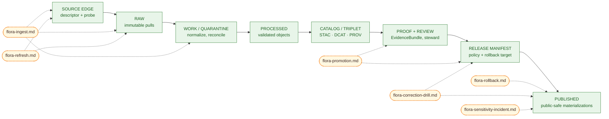

# `docs/domains/flora/operations/` — Flora Lane Operations

> Operational runbooks, drills, and incident playbooks for the **KFM flora** governed lane.

<!-- Top-of-file impact block -->

[](#1-status--authority)
[](#1-status--authority)
[](../README.md)
[](../PIPELINES_AND_LIFECYCLE.md)
[](../PUBLICATION_AND_POLICY.md)
[](#11-review-burden)

> **Status:** **PROPOSED** — `operations/` is a project-chosen umbrella for runbooks, drills, refresh procedures, and incident playbooks. The canonical Flora architecture blueprint specifies a sibling folder named `runbooks/` ([Directory Rules basis](#3-directory-rules-basis)).

**Quick jump:** [Status](#1-status--authority) · [Repo fit](#2-repo-fit) · [Directory Rules basis](#3-directory-rules-basis) · [Inputs / exclusions](#4-what-belongs-here) · [Tree](#6-directory-tree-proposed) · [Lifecycle map](#7-lifecycle-context) · [Runbook inventory](#8-runbook-inventory) · [DoD](#9-definition-of-done-per-runbook) · [Validation](#10-validation) · [Open questions](#13-open-questions--verification-backlog)

---

## 1. Status & authority

| Field | Value |
|---|---|
| **Status** | PROPOSED — folder, file paths, and runbook coverage all unverified against a mounted repo. |
| **Authority level** | **Operational, non-canonical.** Runbooks operationalize doctrine; they do **not** redefine schemas, contracts, policies, or release law. |
| **Doctrinal source of truth** | Flora architecture documents and shared KFM governance docs — not this folder. |
| **Owners** | flora steward — *placeholder, see [`CODEOWNERS`](../../../../CODEOWNERS) once assigned.* |
| **Public exposure posture** | Documents only. Runbooks must **not** carry exact rare-taxon coordinates, secrets, or controlled-access endpoints. |
| **Last reviewed** | YYYY-MM-DD *(placeholder — update on edits)* |

> [!IMPORTANT]
> Operations docs **operationalize** lifecycle, policy, and release rules. They never become a parallel source of truth. If a runbook and a contract / schema / policy disagree, the contract / schema / policy wins and the runbook is corrected.

---

## 2. Repo fit

```text
repo-root/
├── docs/
│   └── domains/
│       └── flora/
│           ├── README.md                       # flora lane orientation
│           ├── ARCHITECTURE.md                 # what the lane is
│           ├── PIPELINES_AND_LIFECYCLE.md      # how data moves
│           ├── PUBLICATION_AND_POLICY.md       # what may go public
│           ├── VERIFICATION_BACKLOG.md         # open checks
│           ├── adr/                            # decisions
│           ├── runbooks/                       # CANONICAL home per Flora blueprint
│           └── operations/      ← this folder  # PROPOSED umbrella variant
└── ...
```

**Upstream (read-by ops docs):** `docs/domains/flora/PIPELINES_AND_LIFECYCLE.md`, `docs/domains/flora/PUBLICATION_AND_POLICY.md`, `docs/domains/flora/SOURCE_REGISTRY.md`, `docs/adr/ADR-flora-*.md`, `data/registry/flora/*.yaml`, `policy/flora/*.rego`, `contracts/flora/*.schema.json`.

**Downstream (operationalized by ops docs):** `pipelines/flora/*`, `tools/validators/flora/*`, `tests/flora/*`, `.github/workflows/flora-*.yml`, governed-API and MapLibre flora layer wiring.

> [!NOTE]
> All paths above are **PROPOSED** under Directory Rules. They reflect the Flora blueprint's proposed homes; none has been verified against a mounted repo in this session.

---

## 3. Directory Rules basis

The Flora architecture blueprint places operational human-authored runbooks at `docs/domains/flora/runbooks/` with an initial set of `flora-ingest.md`, `flora-promotion.md`, `flora-rollback.md`. Directory Rules require domain-scoped operational docs to live **under the domain's documentation root** rather than fragmenting into a parallel root-level operations folder.

This `operations/` subfolder is a **PROPOSED organizational variant** of that pattern. It does the same job (housing flora-scoped operational documents) under a name that more naturally absorbs adjacent operational concerns — refresh procedures, correction drills, incident playbooks, dashboard pointers, and on-call notes — without each becoming its own root-level folder.

**Tradeoff to record before broad use.** Two homes (`runbooks/` and `operations/`) for adjacent doc kinds risks anti-fragmentation drift — exactly what Directory Rules warn against ("Domain folders becoming root folders and fragmenting the lifecycle"). One of these resolutions is required before machine-file proliferation:

1. **Adopt this folder as the canonical home** and migrate the `runbooks/` files into it. Requires an ADR (proposed: `docs/adr/ADR-flora-operations-folder.md`).
2. **Keep `runbooks/` canonical** and treat `operations/` as a redirect / deprecation stub.
3. **Split by genre**: `runbooks/` for stepwise procedures, `operations/` for incident / refresh / drill content. Requires an ADR documenting the split.

> [!CAUTION]
> Until that ADR lands, **NEEDS VERIFICATION** applies to every path under `operations/`. Do not author broad sets of runbooks here without checking which home the repo actually uses.

---

## 4. What belongs here

- **Stepwise runbooks** for flora lane operations: ingest, promotion, refresh, rollback, correction.
- **Drill scripts** that exercise governance machinery on **fixtures only** — no live network calls, no sensitive coordinates.
- **Incident playbooks** for sensitivity leaks, source-rights changes, schema drift, watcher failure, taxon-authority change, and license revocation.
- **Refresh cadence notes** keyed to each source descriptor.
- **Pointers** (links only) to dashboards, CI workflows, validators, and policies that the runbook executes.
- **Definition-of-done checklists** for operational tasks tied to gates and rollback paths.

## 5. What does not belong here

- Schemas, contracts, policies, source descriptors, or any machine-readable governance artifact — those live under `contracts/`, `schemas/`, `policy/`, `data/registry/flora/`.
- ADRs — those live under `docs/adr/` (or `docs/domains/flora/adr/` if the lane's ADRs are co-located).
- Architecture, data-model, or doctrine prose — those live in the flora domain root (`ARCHITECTURE.md`, `DATA_MODEL.md`, etc.).
- Test fixtures, validator code, pipeline code, or workflow YAML — those have responsibility roots elsewhere.
- **Live sensitive data**, exact rare-plant coordinates, controlled-access endpoints, secrets, or any payload that should be quarantined.
- Auto-generated reports — those belong under `data/receipts/flora/`, `data/proofs/flora/`, or `artifacts/`.

> [!WARNING]
> A runbook is allowed to **describe** how to redact sensitive geometry. A runbook is **not** allowed to **embed** a sensitive coordinate as an example. Use placeholder fixtures or reference `tests/fixtures/flora/` instead.

---

## 6. Directory tree (PROPOSED)

```text
docs/domains/flora/operations/
├── README.md                        # this file
├── flora-ingest.md                  # PROPOSED — descriptor → RAW → WORK/QUARANTINE
├── flora-promotion.md               # PROPOSED — proof → review → release manifest
├── flora-rollback.md                # PROPOSED — alias repoint, supersession lineage
├── flora-refresh.md                 # PROPOSED — per-source cadence + incident triage
├── flora-correction-drill.md        # PROPOSED — fixture-only correction/rollback drill
└── flora-sensitivity-incident.md    # PROPOSED — sensitivity leak response playbook
```

> All filenames above are **PROPOSED**. Final names depend on the resolution captured in the ADR referenced in [§3](#3-directory-rules-basis).

---

## 7. Lifecycle context

Flora operations attach to the governed truth lifecycle. Each runbook intervenes at specific stages, never bypasses them, and never collapses generation and approval into one path.



> [!TIP]
> Promotion is a **governed state transition**, not a file move. Rollback **repoints aliases** and emits supersession links — it never silently overwrites or deletes published lineage.

---

## 8. Runbook inventory

Status, scope, gates, and rollback notes for each PROPOSED runbook. Path priorities follow the Flora blueprint conventions (P0 = required first).

| Runbook | Status | Lifecycle scope | Primary gates exercised | Rollback path | Priority |
|---|---|---|---|---|---|
| [`flora-ingest.md`](./flora-ingest.md) | PROPOSED | SOURCE EDGE → RAW → WORK / QUARANTINE | Source descriptor present · rights resolved · sensitivity captured · checksum recorded | Disable watcher; mark source `controlled` / `unknown`; preserve probe receipts. | **P0** |
| [`flora-promotion.md`](./flora-promotion.md) | PROPOSED | PROCESSED → CATALOG → PROOF → RELEASE | Schema valid · evidence resolvable · catalog closure · policy compliant · rollback target set · review recorded | Deny promotion; keep candidate; emit `flora_promotion_candidate` denial reason codes. | **P0** |
| [`flora-rollback.md`](./flora-rollback.md) | PROPOSED | PUBLISHED → REVIEW / CORRECTION | Rollback card references release · alias repoint signed · correction notice linked · lineage preserved | This **is** the rollback path; failed rollback → escalate to incident playbook. | **P0** |
| [`flora-refresh.md`](./flora-refresh.md) | PROPOSED | SOURCE EDGE → RAW (cadence) | Per-source cadence honored · ETag / Last-Modified diff · politeness budget enforced | Disable watcher target; preserve last-known-good RAW snapshot. | P1 |
| [`flora-correction-drill.md`](./flora-correction-drill.md) | PROPOSED | Fixture-only RELEASE / ROLLBACK rehearsal | Fixture release v1 → v2 → CorrectionNotice → RollbackCard → restored state visible in catalog/API/Drawer | Reset fixture release dir; no production impact. | P1 |
| [`flora-sensitivity-incident.md`](./flora-sensitivity-incident.md) | PROPOSED | PUBLISHED → REVIEW (incident) | Layer disabled · public alias withdrawn · artifact quarantined · correction notice + rollback card emitted | Document timeline; preserve receipts; do not delete superseded layer artifacts. | **P0** |

> Source / authority for these gate names: KFM Flora architecture blueprint §11 (validators), §12 (sensitivity), §17 (tests / fixtures / promotion), §22 (rollback plan), and the shared promotion gate set (Gates A–H) used across KFM domains. CONFIRMED as doctrine; PROPOSED as enforcement until repo verified.

---

## 9. Definition of Done (per runbook)

Each runbook in this folder must satisfy these checks before merge. Borrowed and constrained from KFM operational doc conventions.

- [ ] **Scope is bounded.** Runbook names a specific lifecycle stage or incident type — not a general-purpose grab bag.
- [ ] **Preconditions are explicit.** Required tools, registries, fixtures, credentials posture, and policy state are listed.
- [ ] **Steps are linear and reversible.** Each numbered step states its inputs, command, expected output, and rollback if it fails mid-flight.
- [ ] **Gate references are explicit.** Every promotion / publication / rollback step cites the gate name (and policy file when applicable) it is exercising.
- [ ] **Failure modes are enumerated.** At minimum: deny, abstain, error, quarantine, escalate. Each has a named recovery path.
- [ ] **Receipts and proofs are addressed.** Where receipts (`run_receipt`, `redaction_receipt`) and proofs (`EvidenceBundle`, `proof_pack`) are produced or required, the runbook says where they go.
- [ ] **No live network in CI.** Drills and rehearsals run against `tests/fixtures/flora/` only.
- [ ] **No sensitive payloads embedded.** Exact rare-taxon coordinates, controlled-access tokens, and secrets are referenced by **placeholder** or via fixture path — never inline.
- [ ] **Rollback path documented.** Every runbook ends with a "what to do if this goes wrong" section that points to `flora-rollback.md` or the incident playbook.
- [ ] **Cross-links are valid.** Relative links resolve; ADR / contract / schema / policy references exist or are marked `NEEDS VERIFICATION`.
- [ ] **Owners and review burden are named.** A reviewer with policy-significant authority is identified for each runbook section that crosses a gate.

---

## 10. Validation

How this folder is checked. All entries below are **PROPOSED** until repo evidence confirms which actually run.

| Check | Where it runs | What it verifies |
|---|---|---|
| Markdown lint + link check | CI (proposed `flora-ci.yml` docs job) | All relative links resolve; no broken anchors. |
| Docs-successor / orphan check | Repo-wide `tools/ci/check_docs_successors.py` | Every runbook is referenced by at least one of: `flora/README.md`, `flora/PIPELINES_AND_LIFECYCLE.md`, an ADR, a workflow, or `docs/registers/domain-file-index.md`. |
| Fixture-pipeline drill | `pipelines/flora/fixture_pipeline.py` (no-network) | `flora-correction-drill.md` runs end-to-end from RAW fixture to public generalized output and back to a rolled-back state. |
| Anti-fragmentation review | Reviewer / steward | New runbooks do not duplicate canonical schema / contract / policy content; they reference it. |
| Sensitivity lint | Manual review + reviewer checklist | No exact coordinates, no controlled-access endpoints, no secrets in any operations doc. |

---

## 11. Review burden

| Concern | Required reviewer |
|---|---|
| Lifecycle / promotion / rollback content | **flora steward** + release reviewer (separation of duties when policy-significant) |
| Sensitivity / public-safety content | **flora steward** + sensitivity / rights reviewer |
| Source-rights or license content | **flora steward** + rights reviewer |
| Pure prose edits (typos, clarifications) | Any maintainer |
| New runbook (any kind) | **flora steward** + at least one additional maintainer; ADR if it changes the operational shape |

---

## 12. Related folders & docs

<details>
<summary>Click to expand cross-reference map (PROPOSED paths)</summary>

- **Doctrine:** [`../README.md`](../README.md) · [`../ARCHITECTURE.md`](../ARCHITECTURE.md) · [`../PIPELINES_AND_LIFECYCLE.md`](../PIPELINES_AND_LIFECYCLE.md) · [`../PUBLICATION_AND_POLICY.md`](../PUBLICATION_AND_POLICY.md) · [`../DATA_MODEL.md`](../DATA_MODEL.md) · [`../SOURCE_REGISTRY.md`](../SOURCE_REGISTRY.md)
- **Decisions:** [`docs/adr/ADR-flora-schema-home.md`](../../../adr/ADR-flora-schema-home.md) · [`docs/adr/ADR-flora-source-roles.md`](../../../adr/ADR-flora-source-roles.md) · [`docs/adr/ADR-flora-sensitive-location-policy.md`](../../../adr/ADR-flora-sensitive-location-policy.md)
- **Contracts / schemas:** `contracts/flora/*.schema.json` *or* `schemas/contracts/v1/flora/*.schema.json` (home pending ADR)
- **Policy gates:** `policy/flora/publish.rego` · `policy/flora/sensitivity.rego` · `policy/flora/rights.rego` · `policy/flora/promotion.rego` · `policy/flora/review.rego`
- **Pipelines:** `pipelines/flora/source_probe.py` · `pipelines/flora/normalize_taxa.py` · `pipelines/flora/normalize_occurrences.py` · `pipelines/flora/dedupe_occurrences.py` · `pipelines/flora/generalize_sensitive_geometry.py` · `pipelines/flora/build_catalog.py` · `pipelines/flora/fixture_pipeline.py`
- **Validators / CI:** `tools/validators/flora/*` · `tools/ci/render_flora_summary.py` · `.github/workflows/flora-ci.yml` · `.github/workflows/flora-promotion.yml`
- **Data lifecycle:** `data/registry/flora/` · `data/raw/flora/` · `data/work/flora/` · `data/quarantine/flora/` · `data/processed/flora/{taxa,occurrences,communities,range_maps,vegetation_index,habitat_associations}/` · `data/catalog/{stac,dcat,prov}/flora/` · `data/receipts/flora/` · `data/proofs/flora/` · `data/published/flora/`
- **Tests / fixtures:** `tests/fixtures/flora/{valid,invalid,promotion,policy,api,ui}/` · `tests/flora/*`

</details>

---

## 13. Open questions & verification backlog

| Open item | Status | Verification method |
|---|---|---|
| Canonical home of operational docs (`runbooks/` vs. `operations/` vs. split) | **NEEDS VERIFICATION** | Author `docs/adr/ADR-flora-operations-folder.md`; inspect repo for any existing runbooks/operations files. |
| Existence of `docs/domains/flora/` and sibling docs (`README.md`, `PIPELINES_AND_LIFECYCLE.md`, etc.) | UNKNOWN | Mount the repo and `ls docs/domains/flora/`. |
| Resolved schema home (`contracts/flora/` vs. `schemas/contracts/v1/flora/`) | **NEEDS VERIFICATION** | Land [`ADR-flora-schema-home.md`](../../../adr/ADR-flora-schema-home.md). |
| Real CI workflow file names and required checks | UNKNOWN | Inspect `.github/workflows/` and branch protection settings. |
| OPA / Conftest availability and policy-test convention | UNKNOWN | Inspect `policy/`, `tools/`, and existing CI logs. |
| Steward / CODEOWNERS assignment for flora lane | UNKNOWN | Resolve in `CODEOWNERS` once repo is mounted. |
| Existence of shared `RunReceipt`, `EvidenceBundle`, `DecisionEnvelope`, `ReleaseManifest`, `CatalogMatrix` objects | UNKNOWN | Search `contracts/`, `schemas/`, `packages/` for shared governance objects. |
| Sensitivity policy thresholds (exact / internal / public-safe geometry) | **NEEDS VERIFICATION** | Land [`ADR-flora-sensitive-location-policy.md`](../../../adr/ADR-flora-sensitive-location-policy.md). |
| Source-role vocabulary lock | **NEEDS VERIFICATION** | Land [`ADR-flora-source-roles.md`](../../../adr/ADR-flora-source-roles.md). |

> [!NOTE]
> **Current-session evidence limit.** This README was authored from KFM doctrine documents (Flora blueprint, Directory Rules, Greenfield plan, Encyclopedia) and prior domain blueprints (Hazards, Atmosphere, Settlements). No mounted repository was inspected in this session, so all path, file, contract, schema, policy, workflow, route, and runtime claims remain **PROPOSED** or **UNKNOWN** until verified.

---

## Appendix A — Why "operations" rather than "ops" or "playbooks"

PROPOSED naming rationale, recorded so the eventual ADR has prior art to cite:

- **`operations/`** — verbose, but unambiguous in folder listings and search; avoids collision with the language used in code (`apps/`, `runtime/`).
- **`ops/`** — concise but ambiguous; `ops` is also widely used for SRE / infrastructure code, which this folder is **not**.
- **`playbooks/`** — leans incident; under-covers stepwise operations like ingest and promotion.
- **`runbooks/`** — already proposed in the Flora blueprint; preferred if no broader umbrella is needed.

The ADR referenced in [§3](#3-directory-rules-basis) should pick one name and migrate the other if both ever land in the repo.

<sub>[Back to top ↑](#docsdomainsfloraoperations--flora-lane-operations)</sub>
