<!-- [KFM_META_BLOCK_V2]
doc_id: kfm://doc/flora-registers-readme
title: Flora Registers — docs/domains/flora/registers/README.md
type: standard
version: v0.1
status: draft
owners: TODO — flora steward; TODO — registers reviewer (NEEDS VERIFICATION; no mounted CODEOWNERS)
created: 2026-05-07
updated: 2026-05-07
policy_label: public
related:
  - docs/domains/flora/README.md
  - docs/domains/flora/SOURCE_REGISTRY.md
  - docs/registers/README.md
  - docs/adr/ADR-flora-schema-home.md
  - docs/adr/ADR-flora-source-roles.md
  - docs/adr/ADR-flora-sensitive-location-policy.md
  - docs/adr/ADR-flora-public-layer-strategy.md
  - data/registry/flora/sources.yaml
  - data/registry/flora/source_roles.yaml
  - data/registry/flora/sensitivity_policies.yaml
  - data/registry/flora/taxon_authorities.yaml
  - data/registry/flora/layer_registry.yaml
  - data/registry/flora/rights_profiles.yaml
  - control_plane/source_authority_register.yaml
  - control_plane/object_family_register.yaml
tags: [kfm, flora, registers, governance, docs]
notes:
  - PROPOSED placement; docs/domains/flora/registers/ is not directly attested in Directory Rules or the Flora Architecture blueprint and should be confirmed against the mounted repo.
  - All linked machine registers under data/registry/flora/ are PROPOSED until the real repo is mounted.
  - Owners/badges/dates are placeholders pending repo evidence.
[/KFM_META_BLOCK_V2] -->

# Flora Registers — Domain Index

> Human-readable index for the **flora-domain registers**. The canonical machine-readable register entries live under [`data/registry/flora/`](../../../../data/registry/flora/); this folder is the docs side of that authority — what the registers mean, what governs them, and how they enter and leave the trust path.

<!-- impact block -->
<p align="left">
  
  
  
  
  
  
  
</p>

**Quick jump:** [Scope](#1-scope) · [Repo fit](#2-repo-fit) · [Inputs](#3-inputs) · [Exclusions](#4-exclusions) · [Directory tree](#5-directory-tree) · [Register-of-registers](#6-register-of-registers) · [Lifecycle](#7-lifecycle) · [Diagram](#8-diagram) · [Quickstart](#9-quickstart) · [Gates & Definition of Done](#10-gates--definition-of-done) · [FAQ](#11-faq) · [Appendix](#12-appendix)

> [!IMPORTANT]
> **Truth posture for this folder.** Every register file referenced below is **PROPOSED** until verified in a mounted KFM repository checkout. The Flora Architecture blueprint defines the register set; the Directory Rules define the responsibility roots; neither has been validated against a mounted repo in this session. Treat path claims as `PROPOSED` and `NEEDS VERIFICATION`.

---

## 1. Scope

The flora registers describe **who is allowed to say what about Kansas plants**, **under which rights and sensitivity rules**, **with what taxon authority**, and **on which public layers**. They are the lane-specific instances of the KFM source-authority discipline applied to the **flora** domain.

**This folder owns the docs-side of those registers.** It explains:

- The **purpose** and **authority level** of each flora register.
- The **vocabulary** the registers carry (source roles, sensitivity postures, rights profiles, taxon authorities, layer eligibility).
- The **gate behavior** registers enforce in the lifecycle (`RAW → WORK/QUARANTINE → PROCESSED → CATALOG/TRIPLET → PUBLISHED`).
- The **change discipline** — how registers move from `PROPOSED` to `CONFIRMED` and how they are corrected, rolled back, or deprecated.

The canonical machine-readable register entries live under `data/registry/flora/`; the canonical schemas live under the schema home selected by **`ADR-flora-schema-home.md`**; the canonical policy gates live under `policy/flora/`.

> [!NOTE]
> A register is **not** a publication. It is a governed catalog of source descriptors, role bindings, sensitivity rules, taxon authority precedence, layer eligibility, and rights profiles that **other parts of the trust path read from**.

[Back to top](#flora-registers--domain-index)

---

## 2. Repo fit

| Boundary | Path | Authority | Status |
|---|---|---|---|
| **This folder** | `docs/domains/flora/registers/` | Human-readable register index for the flora domain | `PROPOSED` (placement not directly attested; see Notes below) |
| **Domain doc parent** | [`docs/domains/flora/`](../) | Flora domain doc home | `PROPOSED` |
| **Repo-wide registers index** | [`docs/registers/`](../../../registers/) | Repo-wide register documentation hub | `PROPOSED` (Directory Rules) |
| **Canonical machine home** | [`data/registry/flora/`](../../../../data/registry/flora/) | Machine-readable register YAML files | `PROPOSED` (Flora Architecture blueprint) |
| **Schema home** | `contracts/flora/*.schema.json` **or** `schemas/contracts/v1/domains/flora/*.schema.json` | Machine-checkable shape | `CONFLICTED` — resolved by `ADR-flora-schema-home.md` |
| **Policy gates** | `policy/flora/*.rego` | Allow/deny/restrict/abstain decisions | `PROPOSED` |
| **Control-plane register-of-registers** | `control_plane/source_authority_register.yaml`, `control_plane/object_family_register.yaml` | Cross-domain authority and object family map | `PROPOSED` |

**Upstream:** ADRs (`ADR-flora-schema-home.md`, `ADR-flora-source-roles.md`, `ADR-flora-sensitive-location-policy.md`, `ADR-flora-public-layer-strategy.md`); the KFM Directory Rules; the Flora Architecture blueprint.

**Downstream:** validators (`tools/validators/flora/*`), policy gates (`policy/flora/*.rego`), pipelines (`pipelines/flora/*`), governed API (`apps/governed_api/openapi/flora.v1.yaml`), MapLibre layer descriptors, Evidence Drawer payloads, Focus Mode payloads, promotion gate, release manifests.

[Back to top](#flora-registers--domain-index)

---

## 3. Inputs

What belongs in this folder:

- **`README.md`** — this file; the register index for flora.
- **Per-register explainers** (`PROPOSED`): short Markdown notes (`sources.md`, `source-roles.md`, `sensitivity-policies.md`, `taxon-authorities.md`, `layer-registry.md`, `rights-profiles.md`) describing what each register is for, the field semantics, the policy gates it interacts with, and worked examples drawn from fixtures.
- **Crosswalks** (`PROPOSED`): human-readable notes mapping flora register fields to shared KFM contracts (`SourceDescriptor`, `EvidenceRef`, `EvidenceBundle`, `PolicyDecision`, `ReleaseManifest`).
- **Verification backlog notes** (`PROPOSED`): scoped lists of register entries awaiting source-rights confirmation, sensitivity review, or taxon-authority resolution.

[Back to top](#flora-registers--domain-index)

---

## 4. Exclusions

What does **not** belong here, and where it goes instead:

| Material | Belongs in | Why |
|---|---|---|
| Machine-readable register YAML | `data/registry/flora/*.yaml` | Canonical machine home; read by validators, policy, pipelines, API. |
| JSON Schemas for register entries | `contracts/flora/` **or** `schemas/contracts/v1/domains/flora/` (per ADR) | Schema home is single-sourced by ADR; not by docs. |
| Policy gates | `policy/flora/*.rego` | Policy-as-code lives in `policy/`; docs explain it but do not enforce it. |
| Raw or live source data | `data/raw/flora/<source_id>/<run_id>/` | RAW lifecycle stage; never a docs concern. |
| Public-safe published artifacts | `data/published/flora/` | Publication is downstream of validation, policy, review, and release. |
| Release decisions / manifests / rollback cards | `release/manifests/`, `release/rollback_cards/`, `release/correction_notices/` | Release is a separate governance root. |
| AI-generated narrative or explanation | Not in this folder; AI output is interpretive, not authoritative | Governed AI Rule: EvidenceBundle outranks generated language. |

> [!WARNING]
> **Anti-fragmentation.** Do not create a parallel registry, schema, contract, policy, or release home under this folder. The Directory Rules forbid duplicate authority roots; if you need a different home, write an ADR and update `control_plane/source_authority_register.yaml`.

[Back to top](#flora-registers--domain-index)

---

## 5. Directory tree

PROPOSED layout for this folder. Items marked `PROPOSED` should be created only after the placement of `docs/domains/flora/registers/` is itself confirmed against the mounted repo.

```text
docs/domains/flora/registers/
├── README.md                       # this file — flora register index
├── sources.md                      # PROPOSED — explainer for data/registry/flora/sources.yaml
├── source-roles.md                 # PROPOSED — explainer for data/registry/flora/source_roles.yaml
├── sensitivity-policies.md         # PROPOSED — explainer for data/registry/flora/sensitivity_policies.yaml
├── taxon-authorities.md            # PROPOSED — explainer for data/registry/flora/taxon_authorities.yaml
├── layer-registry.md               # PROPOSED — explainer for data/registry/flora/layer_registry.yaml
├── rights-profiles.md              # PROPOSED — explainer for data/registry/flora/rights_profiles.yaml
├── crosswalks/                     # PROPOSED — register field → shared contract crosswalks
│   └── README.md                   # PROPOSED
└── verification-backlog.md         # PROPOSED — open register-level verification items
```

The canonical machine home this folder documents:

```text
data/registry/flora/
├── sources.yaml                    # PROPOSED — source descriptor registry
├── source_roles.yaml               # PROPOSED — allowed source roles + definitions
├── sensitivity_policies.yaml       # PROPOSED — rare/protected/cultural rules
├── taxon_authorities.yaml          # PROPOSED — accepted authority + precedence
├── layer_registry.yaml             # PROPOSED — map layer IDs + public eligibility
└── rights_profiles.yaml            # PROPOSED — reusable license/terms/eligibility
```

[Back to top](#flora-registers--domain-index)

---

## 6. Register-of-registers

The six flora registers, the field families they own, the policy/validator gates that read them, and the shared contracts they bind to. **All entries are `PROPOSED` until validated in a mounted repo.**

| # | Register | Machine home (`PROPOSED`) | Owns | Reads from / Binds to | Primary gates |
|---|---|---|---|---|---|
| 1 | **Sources** | `data/registry/flora/sources.yaml` | `source_id`, `title`, `provider`, `url_or_access_path`, `cadence`, `format_protocol`, `stable_identifiers`, `verification_status` | `SourceDescriptor` (shared contract); `source_roles`; `rights_profiles`; `sensitivity_policies` | `validate_source_descriptors.py`; `policy/flora/rights.rego`; promotion gate |
| 2 | **Source roles** | `data/registry/flora/source_roles.yaml` | Allowed roles: `official`, `institutional`, `steward_reviewed`, `corroborative`, `community_observation`, `controlled_access`, `derived_model`, `generalized_public_surface` | `ADR-flora-source-roles.md`; every entry in `sources.yaml`; Evidence Drawer payload | `policy/flora/publish.rego`; `policy/flora/ai.rego` |
| 3 | **Sensitivity policies** | `data/registry/flora/sensitivity_policies.yaml` | Sensitivity postures (`public`, `internal`, `restricted`, `controlled`, `review_required`); rare/protected/cultural rules; geometry generalization thresholds | `ADR-flora-sensitive-location-policy.md`; `flora_occurrence` records; redaction receipts | `policy/flora/sensitivity.rego`; `validate_sensitivity_public_surface.py` |
| 4 | **Taxon authorities** | `data/registry/flora/taxon_authorities.yaml` | Accepted taxon authority candidates and precedence (e.g., USDA PLANTS, ITIS, WFO, POWO — each `NEEDS VERIFICATION`) | `flora_taxon`, `flora_taxon_crosswalk`, `flora_taxon_status` | `policy/flora/taxon.rego`; `validate_taxon_crosswalk.py` |
| 5 | **Layer registry** | `data/registry/flora/layer_registry.yaml` | Map layer IDs, public eligibility, evidence routes, generalization profile, source-role provenance | MapLibre layer descriptors; `flora.v1.yaml` governed API; Focus Mode payloads | `policy/flora/publish.rego`; `validate_api_payloads.py`; `validate_focus_payload.py` |
| 6 | **Rights profiles** | `data/registry/flora/rights_profiles.yaml` | Reusable license / terms / attribution / publication eligibility profiles | Every entry in `sources.yaml`; release manifests | `policy/flora/rights.rego`; `validate_rights.py` |

> [!TIP]
> When in doubt, read the register before writing the schema, and read the ADR before writing the register. Schema breakage is fixable; authority drift is not.

[Back to top](#flora-registers--domain-index)

---

## 7. Lifecycle

Registers participate in every lifecycle stage. They are **not data** and **not publications** — they are the governance map that other lifecycle objects read from.

| Stage | Register responsibilities | Fail-closed conditions |
|---|---|---|
| **SOURCE EDGE** | Resolve descriptor; bind `source_role`, `rights_profile`, `sensitivity_policy`; record `source_probe_receipt` | Unknown rights, unknown sensitivity for public use, unverified controlled source, missing authority boundary |
| **RAW** | Persist source attribution and checksums alongside immutable raw pulls or fixtures | Raw artifact referenced by a public payload; missing checksum on a release candidate |
| **WORK / QUARANTINE** | Apply taxon-authority reconciliation; apply sensitivity transforms; record quarantine reason codes | Rights failure, sensitivity failure, ambiguous taxon, unresolved precision |
| **PROCESSED** | Validate that processed objects carry `source_refs`, `evidence_refs`, `spec_hash`, `source_role`, `rights_profile`, public-safe geometry where required | Schema failure, missing `source_refs`, missing `evidence_refs`, missing `spec_hash`, invalid CRS |
| **CATALOG / TRIPLET** | Bind layer registry entries to STAC/DCAT/PROV records; record `EvidenceBundle` closure | Catalog closure failure; orphan layer entry |
| **PUBLISHED** | Layer registry gates public eligibility; rights profile gates attribution; sensitivity policy gates geometry; release manifest closes the proof | Any policy `DENY` / `ABSTAIN`; missing review record; missing release manifest |

> [!IMPORTANT]
> **Promotion is a governed state transition, not a file move.** Registers are *read* during promotion; promotion does **not** write to registers. Register changes are themselves governed by ADR + PR review + validator + policy gate, never by side effect of a release.

[Back to top](#flora-registers--domain-index)

---

## 8. Diagram

```mermaid
flowchart LR
  subgraph Docs["docs/domains/flora/registers/ (this folder)"]
    R0[README.md]
    R1[sources.md]
    R2[source-roles.md]
    R3[sensitivity-policies.md]
    R4[taxon-authorities.md]
    R5[layer-registry.md]
    R6[rights-profiles.md]
  end

  subgraph ADR["docs/adr/"]
    A1[ADR-flora-schema-home]
    A2[ADR-flora-source-roles]
    A3[ADR-flora-sensitive-location-policy]
    A4[ADR-flora-public-layer-strategy]
  end

  subgraph Reg["data/registry/flora/ (canonical machine home)"]
    Y1[sources.yaml]
    Y2[source_roles.yaml]
    Y3[sensitivity_policies.yaml]
    Y4[taxon_authorities.yaml]
    Y5[layer_registry.yaml]
    Y6[rights_profiles.yaml]
  end

  subgraph Gates["validators / policy / pipelines"]
    V[tools/validators/flora/*]
    P[policy/flora/*.rego]
    PL[pipelines/flora/*]
  end

  subgraph Surfaces["governed surfaces"]
    API[apps/governed_api/openapi/flora.v1.yaml]
    UI[MapLibre layers / Evidence Drawer / Focus Mode]
    REL[release/ manifests + rollback cards]
  end

  ADR --> Reg
  Docs -.documents.-> Reg
  Reg --> Gates
  Gates --> Surfaces
  Surfaces -. correction lineage .-> ADR
```



The arrows show authority flow: **ADRs decide → registers record → gates enforce → surfaces consume**. Documentation describes; it does not enforce.

[Back to top](#flora-registers--domain-index)

---

## 9. Quickstart

> [!NOTE]
> All commands below are **illustrative**. The actual commands depend on the package manager, validator framework, and CI conventions selected in the mounted repo (`UNKNOWN` in this session).

**Read a register and its docs side by side**

```bash
# View the docs-side description and the canonical machine entry together.
${EDITOR:-less} docs/domains/flora/registers/sources.md \
                data/registry/flora/sources.yaml
```

**Validate registers locally before opening a PR (illustrative)**

```bash
# Aggregate runner; PROPOSED.
python tools/validators/flora/run_all.py \
  --registry data/registry/flora \
  --schemas  schemas/contracts/v1/domains/flora \
  --fixtures tests/fixtures/flora
```

**Smoke-check a single register against its policy gate (illustrative)**

```bash
# OPA / Conftest is one PROPOSED policy runtime; the actual choice is set by ADR.
opa eval --data policy/flora/rights.rego \
         --input data/registry/flora/sources.yaml \
         "data.flora.rights.deny"
```

**Add a new flora source (high-level workflow)**

```text
1. Open or update an ADR if a vocabulary or authority boundary changes.
2. Add the source descriptor to data/registry/flora/sources.yaml.
3. Bind the source to a source_role, rights_profile, and sensitivity_policy.
4. Add a fixture under tests/fixtures/flora/valid/ (and an invalid one to lock the failure mode).
5. Run validators + policy gates locally.
6. Open a PR with the register diff, the ADR, and the fixture.
7. Promotion remains gated; no auto-publish.
```

[Back to top](#flora-registers--domain-index)

---

## 10. Gates & Definition of Done

A register change reaches **Definition of Done** only when **every** box is checked. Items marked `PROPOSED` reflect the current evidence boundary.

- [ ] **ADR coverage.** Every change to a vocabulary, authority boundary, or eligibility rule is anchored in an ADR (`ADR-flora-schema-home`, `ADR-flora-source-roles`, `ADR-flora-sensitive-location-policy`, `ADR-flora-public-layer-strategy`, or a new ADR).
- [ ] **Schema validation.** Register YAML validates against its JSON Schema in the schema home selected by `ADR-flora-schema-home.md`.
- [ ] **Fixture coverage.** At least one **valid** and one **invalid** fixture under `tests/fixtures/flora/` exercises the new or changed field.
- [ ] **Policy decision.** Relevant `policy/flora/*.rego` evaluates the change without unintended `ALLOW` regressions; `DENY`/`ABSTAIN` paths remain explicit.
- [ ] **Source-role discipline.** Every new `sources.yaml` entry binds a `source_role` from `source_roles.yaml` and an `authority_boundary`.
- [ ] **Rights resolved.** `rights_license_terms` is non-null or the entry is explicitly `controlled_access` / `verification_status: unverified`.
- [ ] **Sensitivity resolved.** `sensitivity_posture` is set; rare/protected/cultural entries cite the relevant rule from `sensitivity_policies.yaml`.
- [ ] **Taxon authority precedence respected.** Taxon entries cite an authority listed in `taxon_authorities.yaml` and preserve raw source taxon text.
- [ ] **Public layer eligibility.** Any `layer_registry.yaml` change separates internal vs. public-safe geometry per `ADR-flora-sensitive-location-policy.md`.
- [ ] **EvidenceBundle closure.** If the register entry will support a public claim, the corresponding `EvidenceBundle` resolves end to end.
- [ ] **Receipts & rollback.** A `run_receipt` is emitted for register-touching pipeline runs; a rollback path (PR revert, release-alias correction) is documented.
- [ ] **Docs follow code.** The matching explainer in this folder (`sources.md` / `source-roles.md` / etc.) is updated, and `VERIFICATION_BACKLOG.md` is updated if the change opens new checks.
- [ ] **Truth labels honest.** Entries are tagged `CONFIRMED` / `PROPOSED` / `UNKNOWN` / `NEEDS VERIFICATION` / `CONFLICTED` per the KFM truth posture.

[Back to top](#flora-registers--domain-index)

---

## 11. FAQ

**Why not put the register YAML files inside `docs/`?**
Because docs explain; they do not enforce. The Directory Rules treat `data/registry/` as the canonical home for machine-readable registry content. Putting YAML in `docs/` would create a parallel authority and break the trust path.

**Why a `registers/` subfolder under `docs/domains/flora/` instead of a single `SOURCE_REGISTRY.md`?**
The Flora Architecture blueprint lists a single `SOURCE_REGISTRY.md`, but the domain has **six** distinct registers with different vocabularies, gates, and review burdens. A folder lets each register get its own explainer and crosswalks without overloading one file. This placement is **`PROPOSED`** and may be reconciled with `SOURCE_REGISTRY.md` (kept, redirected to this folder, or deprecated) by a follow-up ADR or migration note.

**Can I add a new source role?**
Not unilaterally. New roles require an ADR update (`ADR-flora-source-roles.md`), a `source_roles.yaml` change, fixture coverage, and policy review. The existing role list is `{ official, institutional, steward_reviewed, corroborative, community_observation, controlled_access, derived_model, generalized_public_surface }` — sourced from the Flora Architecture blueprint.

**Where do AI-generated descriptions go?**
Not here, and not in the canonical registers. Per the Governed AI Rule, AI output is interpretive and is governed through `policy/flora/ai.rego` and Focus Mode payloads — never as register authority.

**What if a flora source is sensitive (rare, protected, culturally significant)?**
Default to deny-by-default. Bind it to a `controlled_access` role (or stronger), reference the relevant rule in `sensitivity_policies.yaml`, and require a steward review record before any public surface uses generalized geometry.

**How do I correct a published claim that depended on a wrong register entry?**
Issue a `correction_notice` and a `rollback_card` under `release/`, update the register, regenerate the catalog records, and preserve lineage. Do **not** silently overwrite a register entry — every change must be auditable.

[Back to top](#flora-registers--domain-index)

---

## 12. Appendix

<details>
<summary><b>A. Doctrinal anchors</b> (click to expand)</summary>

- **Directory Rules** — KFM root folders are authority boundaries, not convenience buckets. Domain content sits under responsibility roots (`docs/domains/`, `schemas/contracts/v1/domains/`, `policy/domains/`, `tests/domains/`, `data/raw/<domain>/`, `data/processed/<domain>/`). Domains do not become root folders.
- **Lifecycle invariant** — `RAW → WORK/QUARANTINE → PROCESSED → CATALOG/TRIPLET → PUBLISHED`. Promotion is a governed state transition, not a file move.
- **Cite-or-abstain** — the default truth posture for any consequential outward claim.
- **Governed AI Rule** — `EvidenceBundle` outranks generated language; AI is interpretive, never authoritative.
- **Publication, rights, sensitivity** — public release requires identity, rights, sensitivity, validation, provenance, integrity, receipts, policy checks, review state, release state, correction path, and rollback path.

</details>

<details>
<summary><b>B. Glossary (flora-scoped)</b></summary>

| Term | Meaning |
|---|---|
| **Register** | Governed catalog read by validators, policies, pipelines, and APIs. Not a publication. |
| **Source role** | First-class field that defines authority boundary, review burden, and publication eligibility for a source. |
| **Authority boundary** | What a source is allowed to support — and what it is **not** allowed to support. |
| **Sensitivity posture** | `public` / `internal` / `restricted` / `controlled` / `review_required`. Drives redaction. |
| **Rights profile** | Reusable license / terms / attribution / publication-eligibility bundle. |
| **Taxon authority** | Source accepted as the precedence anchor for accepted name + identity (e.g., USDA PLANTS, ITIS, WFO, POWO — each `NEEDS VERIFICATION`). |
| **Generalized public surface** | Public-safe geometry derived from internal exact records via redaction/generalization. Never the truth source. |
| **EvidenceBundle** | Closure object that resolves an `EvidenceRef` into source descriptors, validation evidence, policy decisions, and review state. |

</details>

<details>
<summary><b>C. Related work and pointers</b></summary>

- [`docs/domains/flora/README.md`](../README.md) — domain entry point.
- [`docs/domains/flora/SOURCE_REGISTRY.md`](../SOURCE_REGISTRY.md) — single-file source registry (relationship to this folder is `PROPOSED` and may be reconciled).
- [`docs/registers/`](../../../registers/) — repo-wide register documentation hub.
- [`docs/adr/`](../../../adr/) — ADRs that govern register vocabulary and placement.
- [`data/registry/flora/`](../../../../data/registry/flora/) — canonical machine home.
- [`control_plane/source_authority_register.yaml`](../../../../control_plane/source_authority_register.yaml) — cross-domain authority register.
- **Truth posture in this folder:** `PROPOSED` until paths and contents are confirmed against a mounted KFM checkout.

</details>

<details>
<summary><b>D. Verification backlog (initial)</b></summary>

| # | Item | Status |
|---|---|---|
| 1 | Confirm `docs/domains/flora/registers/` placement against the mounted repo and adjacent ADRs | `NEEDS VERIFICATION` |
| 2 | Resolve `ADR-flora-schema-home.md` (`contracts/flora/` vs. `schemas/contracts/v1/domains/flora/`) | `CONFLICTED` |
| 3 | Lock source-role vocabulary under `ADR-flora-source-roles.md` | `PROPOSED` |
| 4 | Set sensitive-location thresholds under `ADR-flora-sensitive-location-policy.md` | `PROPOSED` |
| 5 | Confirm taxon-authority precedence (USDA PLANTS / ITIS / WFO / POWO candidates) | `NEEDS VERIFICATION` |
| 6 | Bind every `sources.yaml` entry to a `rights_profile` and `sensitivity_policy` | `PROPOSED` |
| 7 | Verify policy runtime (OPA/Conftest vs. repo-equivalent) | `UNKNOWN` |
| 8 | Reconcile this folder with `SOURCE_REGISTRY.md` | `PROPOSED` |

</details>

[Back to top](#flora-registers--domain-index)
