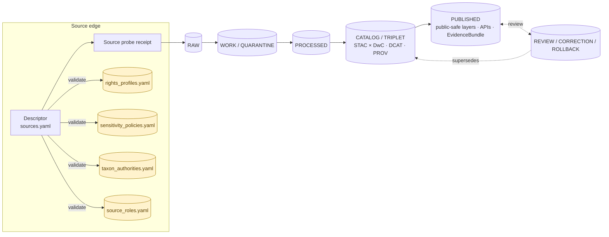

<!-- [KFM_META_BLOCK_V2]
doc_id: kfm://doc/flora-source-registry
title: Flora — Source Registry (Human-Readable Companion)
type: standard
version: v1
status: draft
owners: TBD-flora-steward (NEEDS VERIFICATION — owner not confirmed in current evidence)
created: 2026-05-07
updated: 2026-05-07
policy_label: public
related:
  - docs/domains/flora/README.md
  - docs/domains/flora/ARCHITECTURE.md
  - docs/domains/flora/PUBLICATION_AND_POLICY.md
  - docs/domains/flora/DATA_MODEL.md
  - docs/adr/ADR-flora-source-roles.md
  - data/registry/sources/flora/sources.yaml
  - data/registry/sources/flora/source_roles.yaml
  - data/registry/sources/flora/sensitivity_policies.yaml
  - data/registry/sources/flora/taxon_authorities.yaml
  - data/registry/sources/flora/rights_profiles.yaml
  - data/registry/sources/flora/layer_registry.yaml
  - control_plane/source_authority_register.yaml
tags: [kfm, flora, registry, sources, governance, sensitivity, taxonomic-authority]
notes:
  - "Owner placeholder — confirm flora steward against repo CODEOWNERS or governance register before publishing."
  - "Path placement under docs/domains/flora/registers/ follows the user-requested path; the Flora Architecture Blueprint places this doc directly at docs/domains/flora/SOURCE_REGISTRY.md. Reconcile via ADR before promotion."
  - "Machine registry path under data/registry/sources/flora/ follows Directory Rules (data/registry/sources/<domain>/); the Flora Blueprint uses data/registry/flora/. Reconcile via ADR before promotion."
[/KFM_META_BLOCK_V2] -->

# Flora — Source Registry

> **Human-readable companion** to the machine source registry for the KFM **Flora** domain lane.
> Explains *what* sources are admitted, *under what role*, *with what rights and sensitivity*, and *how* they enter the truth path. The YAML registry is the binding artifact; this document exists so a maintainer or reviewer can read the registry without parsing it.

---

<!-- Status / Ownership / Quick links -->


| Field | Value |
| --- | --- |
| **Status** | `draft` — PROPOSED; no mounted repo evidence in current session |
| **Owners** | `TBD-flora-steward` *(NEEDS VERIFICATION)* |
| **Doc role** | Human companion to `data/registry/sources/flora/*.yaml` *(PROPOSED path; see Notes)* |
| **Authority level** | Implementation-bearing documentation (governs what enters the lane) |
| **Lifecycle stage** | Source-edge → admission |
| **Truth posture** | Evidence-first · cite-or-abstain · fail-closed on rights/sensitivity gaps |

**Jump to:** [Scope](#scope) · [Repo fit](#repo-fit) · [Inputs & exclusions](#accepted-inputs--exclusions) · [Source roles](#source-role-discipline) · [Descriptor fields](#required-source-descriptor-fields) · [Candidate sources](#candidate-flora-source-families) · [Sensitivity](#sensitivity-rights--public-safety) · [Lifecycle](#lifecycle-traceability) · [Diagram](#registry--lifecycle-diagram) · [Gates](#validation--gates) · [Task list](#task-list--definition-of-done) · [FAQ](#faq) · [Glossary](#appendix--glossary)

---

## Scope

**This document explains** the admission, classification, governance, and publication eligibility of every source the **Flora** lane references. It is the human-readable face of the lane's **source registry**, paired with the machine descriptors under `data/registry/sources/flora/`.

**What it does not do.** It does not encode credentials, store exact sensitive coordinates, replace the YAML registry, or substitute for the policy bundle, validators, receipts, or `EvidenceBundle`. Every consequential outward Flora claim must remain reconstructable to source descriptors, `EvidenceRef` → `EvidenceBundle`, policy decisions, review state, catalog records, and correction lineage. The public layer is **not** the truth source. A model output is **not** an observation. A range map is **not** a specimen. *(PROPOSED — sourced from the KFM Flora Architecture Blueprint, §3.)*

> [!IMPORTANT]
> **Cite-or-abstain.** A source without a complete, validated descriptor — rights resolved, sensitivity classified, role assigned, authority boundary stated — is **not admitted**. The Flora lane fails closed rather than publishing under uncertainty.

---

## Repo fit

```text
docs/domains/flora/
├── README.md                       ← lane entrypoint
├── ARCHITECTURE.md
├── DATA_MODEL.md
├── PIPELINES_AND_LIFECYCLE.md
├── PUBLICATION_AND_POLICY.md
├── registers/
│   └── SOURCE_REGISTRY.md          ← THIS FILE
├── CURRENT_STATE.md
├── VERIFICATION_BACKLOG.md
└── ...

data/registry/sources/flora/        ← machine companion (PROPOSED path per Directory Rules)
├── sources.yaml                    ← descriptor entries
├── source_roles.yaml               ← role vocabulary
├── sensitivity_policies.yaml       ← rare/protected/cultural rules
├── taxon_authorities.yaml          ← accepted taxon authority precedence
├── rights_profiles.yaml            ← reusable license/terms profiles
└── layer_registry.yaml             ← public layer eligibility
```

> [!NOTE]
> Two path conventions appear across the source corpus:
> - **Directory Rules** specify `data/registry/sources/<domain>/` for the machine registry.
> - The **Flora Architecture Blueprint** uses `data/registry/flora/`.
>
> This document tracks Directory Rules. The discrepancy is **NEEDS VERIFICATION** and should be resolved by `ADR-flora-schema-home.md` and/or `ADR-flora-source-roles.md` before activation.

**Upstream of this document**

- `KFM Components Pass 10 — Idea Index, Category Atlas, and Expansion Dossier` *(C6 sensitivity, C7 authority anchoring, C10 domain datasets, C15 FAIR + CARE)*.
- `Kansas Frontier Matrix — Flora Architecture PDF-Only Implementation Blueprint` *(Sections 4–8, 11–14)*.
- `Directory Rules` *(per-domain placement: `docs/domains/<lane>/`, `data/registry/sources/<lane>/`)*.

**Downstream of this document**

- `data/registry/sources/flora/*.yaml` *(machine descriptors)*.
- `tools/validators/flora/validate_source_descriptors.*` *(registry validator)*.
- `policy/domains/flora/*.rego` *(rights / sensitivity / publication gates)*.
- `pipelines/domains/flora/source_probe.*` and the RAW → PUBLISHED watchers.
- Catalog records (STAC × Darwin Core hybrid for occurrences; DCAT for datasets), `EvidenceBundle` payloads, Evidence Drawer, and the Focus Mode boundary.

---

## Accepted inputs & exclusions

<table>
<tr><th align="left">✅ Belongs here</th><th align="left">⛔ Does not belong here</th></tr>
<tr>
<td>

- Human-readable summary of every Flora source in `data/registry/sources/flora/sources.yaml`.
- Authoritative role assignment per source *(official, institutional, …)*.
- Rights/license profile and publication eligibility per source.
- Sensitivity posture and the redaction profile that applies.
- Authority boundary — what a source can and cannot anchor.
- Cadence, fetch protocol, validator hints, and stable identifier hooks.
- Pointers to `ADR-flora-source-roles.md` and related ADRs.

</td>
<td>

- Credentials, API keys, signed URLs, internal endpoints.
- Exact sensitive coordinates (S1/S2 species, KDWP-SINC-listed taxa, archaeological context).
- Run-time state (receipts, dashboards, CI logs) — those live with their artifacts.
- Schema field definitions — those live in `contracts/domains/flora/*.schema.json`.
- Publication policy text — that lives in `PUBLICATION_AND_POLICY.md` and `policy/domains/flora/*.rego`.
- Aspirational sources without resolved rights, sensitivity, and role.

</td>
</tr>
</table>

---

## Source-role discipline

Every descriptor must carry a `source_role`. Role is a **first-class field** that travels with the record into processed objects, `EvidenceBundle` payloads, API envelopes, Evidence Drawer payloads, and layer descriptors. Role does **not** auto-confer truth — it bounds *authority*, *review burden*, and *publication eligibility*. *(PROPOSED — from Flora Blueprint §5.)*

| Role | Meaning | Default trust use | Default publication |
| --- | --- | --- | --- |
| `official` | Government / legally responsible body for status, regulation, or authoritative spatial layer. | Anchors official status claims **within** authority boundary. | Publish only after rights, sensitivity, and review resolve. |
| `institutional` | Museum, herbarium, university, research institute, or agency-managed collection. | Strong evidence for specimen / collection facts. | Public-safe metadata; exact geometry depends on rights & sensitivity. |
| `steward_reviewed` | Curated by responsible flora steward, heritage program, or qualified domain reviewer. | Can lift quarantine or allow controlled internal use. | Public only with explicit release decision. |
| `corroborative` | Useful support; not controlling for legal/status claims. | Corroborates presence, name, or context. | Usually aggregate / generalize; cite limitations. |
| `community_observation` | Public/community record (e.g., iNaturalist-like). | Useful with quality grade and license labels. | Publish only if license and sensitivity allow; avoid false precision. |
| `controlled_access` | Source requiring terms, license, or steward approval. | Informs internal review only; cannot leak restricted attributes. | Deny public exact publication unless explicitly authorized. |
| `derived_model` | Model, index, interpolation, range, or generalized summary. | Contextual / interpretive evidence, not observation truth. | Publish with model card, uncertainty, and lineage. |
| `generalized_public_surface` | Public-safe geometry derived from internal details. | Outward display layer after redaction / generalization. | Publishable when transform lineage, sensitivity, and rights resolve. |

> [!CAUTION]
> A `derived_model` source may **never** be elevated to substitute for an observed occurrence. A `generalized_public_surface` may **never** be back-resolved into an internal exact-geometry layer. Crossing these wires collapses the lane's audit posture.

---

## Required source descriptor fields

Every entry in `data/registry/sources/flora/sources.yaml` must populate the fields below; missing values **fail closed** at the source-admission gate. *(PROPOSED — from Flora Blueprint §5.1.)*

| Field | Purpose / gate relationship |
| --- | --- |
| `source_id` | Stable identifier for joins, provenance, receipts, `EvidenceBundle` refs, and catalog closure. Pattern example: `flora.source.kdwp.status.v1`. |
| `title` / `provider` | Human review and authority boundary. |
| `url_or_access_path` | Fetch / probe target or controlled-access reference; may be `null` for offline / steward data. |
| `cadence_update_behavior` | Watcher scheduling and freshness chips. |
| `rights_license_terms` | Required before publication; missing or unknown **fails closed** or abstains. |
| `sensitivity_posture` | `public` / `internal` / `restricted` / `controlled` / `review_required`; drives redaction profile selection. |
| `source_role` | One of the eight roles above. |
| `authority_boundary` | What this source is allowed to support — and what it cannot. |
| `stable_identifiers` | Native IDs (taxon IDs, occurrence IDs, accession IDs, collection codes, layer IDs). |
| `spatial_resolution` / `temporal_resolution` | Claim precision, valid-time / as-of handling. |
| `format_protocol` | CSV, JSON, ArcGIS REST, STAC, OGC API, Darwin Core Archive, GeoJSON, COG, PMTiles, … |
| `checksum_etag_last_modified` | Change detection and receipt reproducibility. |
| `verification_status` | `unverified` / `probed` / `fixture_validated` / `steward_reviewed` / `release_approved`. |
| `public_publication_eligibility` | `public_ok` / `public_generalized_only` / `controlled_only` / `deny` / `unknown`. |

> [!TIP]
> Keep `source_id` semantically stable across descriptor revisions; carry change in version fields (e.g., `…v1` → `…v2`). Re-issuing a `source_id` invalidates downstream joins and breaks receipt replay.

---

## Candidate Flora source families

Sources expected to appear in the registry. Each is **PROPOSED** and **NEEDS VERIFICATION** before activation; no source enters the lane until its descriptor passes the schema validator and the rights / sensitivity gate. *(PROPOSED — from Flora Blueprint §5.2; cross-referenced with KFM corpus C7 taxonomic authorities and C7.d Kansas-First domain authorities.)*

| Candidate source | Default role | Activation rule (must pass before admission) |
| --- | --- | --- |
| **KDWP** flora / listed-species status and range context | `official` | Verify endpoint, official scope, rights, county / range semantics, **rare-location policy**. |
| **KDWP Ecological Review Tool** / stewardship review outputs | `official` · `steward_reviewed` · `controlled_access` | Treat exact records as `controlled_access`; record review state and release authorization. |
| **Kansas Biological Survey / KU Biodiversity Institute** herbarium and rare-species access surfaces | `institutional` · `controlled_access` | Public collection metadata only until access terms and precision limits are explicit. |
| **USFWS ECOS** species and critical-habitat context for plants | `official` | Verify API fields, critical-habitat layer scope, federal status boundary, update cadence. |
| **NatureServe Explorer / Explorer Pro** | `institutional` · `controlled_access` · `derived_model` | Separate public status / model summaries from licensed or precise occurrence data. |
| **GBIF** vascular plant occurrence downloads and APIs | `corroborative` | Require dataset-level license, `basisOfRecord`, coordinate uncertainty, and quality filters. Pin GBIF Backbone DOI version (`10.15468/39omei`) per receipt. |
| **iDigBio** specimen records | `institutional` | Preserve `institutionCode`, `collectionCode`, `catalogNumber`, georeference quality, and rights. |
| **iNaturalist**-derived community observations | `community_observation` | Filter by license, quality grade / review, taxon, precision, and sensitive coordinates. |
| **Taxon authorities** — USDA PLANTS, ITIS, **WFO**, POWO candidates | `official` · `institutional` | Choose precedence in `ADR-flora-source-roles.md` and `taxon_authorities.yaml`; preserve raw taxon text and accepted ID. |
| **Remote-sensing vegetation products** — HLS-VI, Landsat, Sentinel-derived indices | `derived_model` | Use as condition / phenology evidence only; carry masks, windows, and uncertainty. |
| **Habitat covariates** — NLCD / NWI / GAP / LANDFIRE / soils / hydrology overlays | `derived_model` · `official` | Link as covariates; do **not** convert habitat context into occurrence truth. |

> [!WARNING]
> **eBird-style restricted-use precedent.** The KFM corpus (C10-06) flags eBird EBD as restricted-use. Flora candidates with comparable terms — KDWP rare-species data, NatureServe Pro, herbarium-controlled accessions — must travel through the `controlled_access` role and be checked against an EBD-style derivative-release policy *before* any public layer is generated.

---

## Sensitivity, rights & public safety

Flora sensitivity policy reuses the KFM **C6 sensitivity rubric (0–5)** and binds named redaction profiles per rank. The rubric is registered in the lane's `sensitivity_policies.yaml`; this document only summarizes the obligations it places on registry entries. *(PROPOSED — from Flora Blueprint §12 and KFM corpus C6-01 / C6-02 / C6-04.)*

| Rank | Default Flora interpretation | Default profile (PROPOSED) | Public-layer behavior |
| --- | --- | --- | --- |
| 0 | Public / open *(common cultivated, non-native ornamentals where appropriate)* | `kfm:redact:none` | Publish exact. |
| 1 | Common non-sensitive native | `kfm:redact:none` | Publish exact. |
| 2 | Watchlist | `point_3km_jitter_v1` *(seeded)* | Publish jittered display geometry. |
| 3 | KDWP-SINC / locally sensitive | `point_10km_hex_seeded_v1` | Publish hex-cell only; no point. |
| 4 | Threatened / rare / federally listed *(plant-specific)* | `point_10km_hex_seeded_v1` or stricter mask + embargo | Strict mask or embargo; review-required. |
| 5 | Sacred / culturally restricted / steward-denied | `kfm:fail-closed` | **No** map / timeline exposure; deny by default. |

Rules every descriptor must satisfy:

1. **Rights resolved before publication.** A descriptor without a `rights_license_terms` value cannot enter `processed/`; it abstains.
2. **Sensitivity classified before exposure.** No source publishes through a public layer until its sensitivity rank and matching profile are recorded in `sensitivity_policies.yaml`.
3. **Determinism for jitter and grids.** Display redaction uses seeded PRNGs (`spec_hash` + occurrence id); random-each-render is forbidden because it is triangulable across snapshots *(KFM C6-03)*.
4. **Differential privacy is for aggregates only.** DP epsilon-delta applies to count surfaces and heatmaps, never raw points *(KFM C6-05)*.
5. **Cultural sensitivity outranks technical convenience.** When sovereignty, stewardship, or cultural rules are unclear, the lane prefers quarantine, redaction, generalization, staged access, delayed publication, or denial.

> [!IMPORTANT]
> A source descriptor cannot lower its own sensitivity. Re-classification flows from `steward_reviewed` evidence and a recorded `review_record`, never from a descriptor edit alone.

---

## Lifecycle traceability

Every source entry in this registry is reconstructable across the KFM truth path. *(PROPOSED — from Flora Blueprint §6 and KFM corpus invariants.)*

| Stage | Source-registry obligation | Fail-closed condition |
| --- | --- | --- |
| **SOURCE EDGE** | Resolve descriptor; probe access; capture rights / sensitivity; record ETag / Last-Modified / checksum where available. | Unknown rights, unknown sensitivity for public use, unverified controlled source, missing authority boundary. |
| **RAW** | Store immutable raw pulls (or fixture equivalents) with source metadata and checksums. | Raw artifact referenced by public payload; missing checksum for release candidate. |
| **WORK / QUARANTINE** | Carry `source_id`, role, and authority boundary alongside the normalized record; flag duplicates and quarantine reasons. | Rights failure, sensitivity failure, ambiguous taxon, unresolved precision. |
| **PROCESSED** | Bind `source_refs[]` and `evidence_refs[]` into every Flora object (taxon, occurrence, community, range_map, phenology product). | Schema failure, missing `source_refs`, missing `evidence_refs`, missing `spec_hash`, invalid CRS. |
| **CATALOG / TRIPLET** | Emit STAC items (occurrences via STAC × Darwin Core hybrid; KFM C4-03), DCAT datasets, PROV activities, catalog-matrix closure. | Catalog-matrix open; digest mismatch; provenance missing; graph claim not tied to evidence. |
| **PUBLISHED** | Expose only public-safe layers and APIs; carry `EvidenceBundle` resolution behind governed interfaces. | RAW / WORK / QUARANTINE leakage, exact sensitive geometry, unresolved rights, model-as-observation. |
| **REVIEW / CORRECTION / ROLLBACK** | Preserve lineage; supersession links; never silently replace public outputs. | Missing correction or rollback linkage after a public issue. |

---

## Registry & lifecycle diagram



The four registry-side YAMLs (`source_roles`, `rights_profiles`, `sensitivity_policies`, `taxon_authorities`) act as **input gates** for descriptor admission. A descriptor that does not resolve against all four gates does not reach RAW.

---

## Validation & gates

| Gate | Where it runs | What it enforces | On failure |
| --- | --- | --- | --- |
| **Schema gate** | `tools/validators/flora/validate_source_descriptors.*` (CI: `flora-ci.yml`) | Descriptor matches `flora_source_descriptor.schema.json`; all required fields present. | Reject PR. |
| **Role gate** | Validator + Rego policy | `source_role` is one of the eight; role default trust use is consistent with declared `authority_boundary`. | Reject; require ADR if a new role is needed. |
| **Rights gate** | Rego policy `policy/domains/flora/rights.rego` | `rights_license_terms` resolves to a profile in `rights_profiles.yaml`. | Abstain from publication; quarantine. |
| **Sensitivity gate** | Rego policy `policy/domains/flora/sensitivity.rego` | `sensitivity_posture` resolves to a profile in `sensitivity_policies.yaml`; rank ≥ 3 carries a redaction profile id. | Fail closed; no public layer. |
| **Authority gate** | Rego policy + `taxon_authorities.yaml` | Taxon-bearing sources resolve to an accepted authority within precedence (e.g., ITIS → WFO → POWO → Wikidata-as-router). | Reject taxon-level publication; allow corroborative use only. |
| **Anti-fragmentation gate** | Docs review | No parallel `source_registry` home is created without an ADR. | Reject PR. |

> [!NOTE]
> All gates run **before** promotion. Promotion is a governed state transition recorded in a `run_receipt` and an updated `EvidenceBundle`; it is never a file move.

---

## Task list / Definition of done

Required to take this document from `draft` → `review` → `published`:

- [ ] **Owners confirmed.** Replace `TBD-flora-steward` with the verified steward from the governance register.
- [ ] **Path placement reconciled.** Resolve `docs/domains/flora/SOURCE_REGISTRY.md` vs `docs/domains/flora/registers/SOURCE_REGISTRY.md` via ADR.
- [ ] **Machine registry path reconciled.** Resolve `data/registry/sources/flora/` vs `data/registry/flora/` via ADR.
- [ ] **`ADR-flora-source-roles.md`** merged and referenced here.
- [ ] **`flora_source_descriptor.schema.json`** present in `contracts/domains/flora/` (or repo-canonical schema home) and referenced from this doc.
- [ ] **All eight YAMLs** present under the chosen registry path; each validates against its schema; no-network fixtures pass.
- [ ] **Each candidate source** in §[Candidate Flora source families](#candidate-flora-source-families) either becomes a populated descriptor or is moved to `IDEA_INTAKE.md` with a reason.
- [ ] **Sensitivity rubric** binding written in `sensitivity_policies.yaml`; KDWP-SINC list version recorded.
- [ ] **`flora-ci.yml`** runs the schema, role, rights, sensitivity, authority, and anti-fragmentation gates on PRs touching `docs/domains/flora/**` or `data/registry/sources/flora/**`.
- [ ] **`CURRENT_STATE.md`** updated to reflect what is CONFIRMED vs PROPOSED after first repo scan.
- [ ] **Public-layer eligibility** (`public_publication_eligibility`) reviewed for every entry; `public_ok` only after rights + sensitivity + review.
- [ ] **No credentials, no exact sensitive coordinates** anywhere in this file or its companions.

---

## FAQ

<details>
<summary><strong>Why isn't every Kansas plant occurrence published exactly where it was observed?</strong></summary>

Because publishing precise locations of vulnerable species can cause real harm — collection pressure, habitat damage, poaching for traded plants. The C6 sensitivity rubric sets the default to *fail closed* for ranks 4 and 5; locally sensitive species (rank 3, default profile `point_10km_hex_seeded_v1`) are published as deterministic hex cells. Determinism is non-negotiable: random-each-render jitter is triangulable across snapshots and would defeat the obfuscation.
</details>

<details>
<summary><strong>Why both ITIS and the GBIF Backbone for taxonomy?</strong></summary>

ITIS TSN is the U.S.-canonical authority and the join key for federal datasets (USFWS, USDA, NRCS). GBIF Backbone (DOI `10.15468/39omei`) is the international crosswalk and the only viable anchor for clades where ITIS lags — many plants, fungi, and invertebrates. KFM stores both anchors and pins the GBIF Backbone DOI version in the run receipt for reproducibility *(KFM C7-07 / C7-08)*. The accepted-name tie-breaker is recorded in `ADR-flora-source-roles.md`.
</details>

<details>
<summary><strong>Why is iNaturalist a <code>community_observation</code> and not <code>institutional</code>?</strong></summary>

Because the role classifies *authority and review burden*, not data quality. iNaturalist research-grade observations can be high quality — and many are — but the curation chain is community-driven, license terms vary per record, and obscured-coordinates conventions may already be in effect. Flagging as `community_observation` makes those handling rules explicit downstream rather than inheriting institutional defaults that don't apply.
</details>

<details>
<summary><strong>Can a derived range map become an "official" range?</strong></summary>

No. `derived_model` and `official` are separate roles for a reason. A range map can carry official *status* metadata if the underlying status comes from an `official` source, but the geometry remains modeled. Treating a model as an observation collapses the C7 authority discipline and would surface in the catalog-matrix gate.
</details>

<details>
<summary><strong>What happens when a source's rights or sensitivity terms change after publication?</strong></summary>

The lane records a `correction_notice` (and, if needed, a `rollback_card`) tied to the affected `release_manifest`. Public outputs are never silently replaced. The supersession link is preserved in the catalog so reviewers can trace what changed and why.
</details>

---

## Open questions

- Which Kansas authority (KDWP, KBS, KU NHM) holds the canonical rare-plant precision policy KFM should adopt as the default `point_10km_hex_seeded_v1` rationale? *(NEEDS VERIFICATION)*
- Should USDA PLANTS sit at the same precedence tier as ITIS for Kansas vascular flora, or below it? *(Resolve in `ADR-flora-source-roles.md`.)*
- Is there a Kansas-specific noxious-weed authority that should appear under `official`? *(NEEDS VERIFICATION — not enumerated in the current corpus.)*
- For `controlled_access` sources, is the Flora lane the right level for terms negotiation, or does the lane defer to a KFM-wide license registry? *(Cross-lane; pending ADR.)*

---

## Appendix — Glossary

<details>
<summary><strong>Roles, fields, and terms</strong></summary>

- **`EvidenceBundle`** — Content-addressed bundle of resolved evidence, policy state, review state, and artifact digests; the resolution target of every `EvidenceRef`.
- **`EvidenceRef`** — Reference object that, at render time or query time, resolves to an `EvidenceBundle`. Public claims that depend on evidence must travel with one.
- **`run_receipt`** — Canonical receipt for any pipeline run; carries `run_id`, `spec_hash`, source descriptor versions, fetch validators, transform identity, and outputs.
- **`spec_hash`** — Stable hash of schema / spec / process identity (RFC 8785 JCS + SHA-256). Not a timestamp; not a policy.
- **`content_hash`** — Hash of source / processed / catalog / proof / published artifacts, where relevant.
- **`source_id`** — Stable identifier for a source descriptor across descriptor revisions; version fields carry change.
- **`authority_boundary`** — Declarative scope statement: what a given source is *allowed* to support, and what it is *not* allowed to support.
- **`policy bundle`** — Pinned, content-addressed Rego bundle evaluated identically in CI fixtures and at runtime.
- **C6 sensitivity rubric** — KFM-wide 0–5 rank that maps records to redaction obligations.
- **C7 authority anchoring** — KFM-wide rule that every published entity carries one or more durable external authority IRIs.
- **STAC × Darwin Core hybrid** — KFM convention for biodiversity occurrences encoded as STAC Items with DwC properties (KFM C4-03).
- **FAIR + CARE** — Open metadata, gated assets; consent and benefit travel with the data.

</details>

<details>
<summary><strong>Truth labels used in this document</strong></summary>

- **CONFIRMED** — verified in this session from attached docs, workspace evidence, tests, logs, or generated artifacts.
- **PROPOSED** — design / placement / inference not yet verified in implementation.
- **UNKNOWN** — not verified strongly enough in this session.
- **NEEDS VERIFICATION** — checkable, but not yet checked strongly enough to act as fact.

Most paths and bindings in this document are **PROPOSED** because no KFM repository tree was mounted in the current session. Activate against repo evidence before publishing.

</details>

---

[⬆ Back to top](#flora--source-registry)
