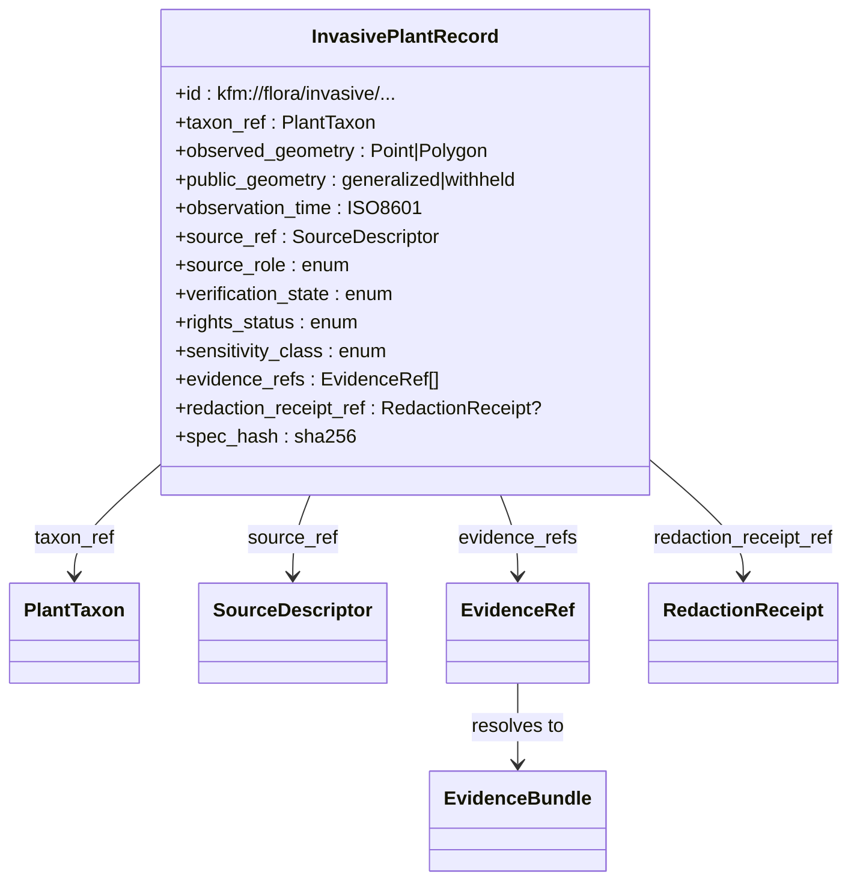
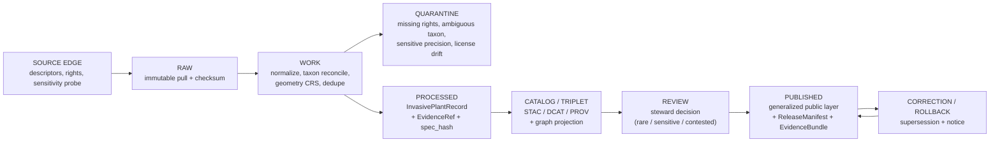
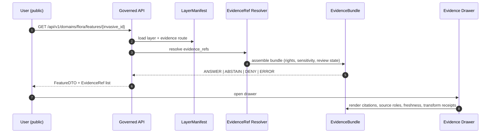

<!-- [KFM_META_BLOCK_V2]
doc_id: kfm://doc/flora-tracking-invasive-spread
title: Flora — Invasive Plant Spread Tracking
type: standard
version: v0.1
status: draft
owners: <flora steward — TBD>
created: 2026-05-08
updated: 2026-05-08
policy_label: public
related:
  - docs/domains/flora/README.md
  - docs/domains/flora/ARCHITECTURE.md
  - docs/domains/flora/DATA_MODEL.md
  - docs/domains/flora/PIPELINES_AND_LIFECYCLE.md
  - docs/domains/flora/PUBLICATION_AND_POLICY.md
  - docs/domains/flora/UI_AND_EVIDENCE_DRAWER.md
  - docs/domains/flora/SOURCE_REGISTRY.md
  - docs/domains/flora/VERIFICATION_BACKLOG.md
tags: [kfm, flora, invasive, tracking, spread, evidence, governance]
notes:
  - "PROPOSED placement — `tracking/` subfolder is not in the current Flora Appendix B tree; see §2 Repo fit."
  - "All repository-state claims are PROPOSED until verified against the mounted repo."
[/KFM_META_BLOCK_V2] -->

# Flora — Invasive Plant Spread Tracking

> Governance-first reference for the **invasive plant spread** map surface and analytical function inside the Flora lane: what it tracks, where evidence comes from, how it moves through the KFM truth lifecycle, and where it must fail closed.

<!-- Badges are placeholders until owners, CI workflow names, and policy gates are confirmed against the mounted repo. -->

**Quick jump:**
[Scope](#1-scope) ·
[Repo fit](#2-repo-fit) ·
[Doctrinal anchor](#3-doctrinal-anchor) ·
[Tracked object](#4-tracked-object--invasiveplantrecord) ·
[Source roles](#5-source-role-expectations) ·
[Lifecycle](#6-lifecycle-and-promotion) ·
[Public-safe surface](#7-public-safe-surface-rules) ·
[Analytical function](#8-analytical-function--invasive-spread) ·
[Governance gates](#9-governance-gates-and-deny-cases) ·
[Evidence Drawer & UI](#10-evidence-drawer-focus-mode-and-ui-payload) ·
[AI rules](#11-ai-and-focus-mode-rules) ·
[Backlog](#12-verification-backlog-and-open-questions) ·
[Related docs](#13-related-docs)

---

## 1. Scope

This document is the **lane-internal reference** for how Kansas Frontier Matrix tracks the **spread of invasive plants** as an evidence-backed, governed map surface. It covers:

- The canonical object that carries an invasive observation (`InvasivePlantRecord`).
- The source roles that may legitimately contribute to invasive evidence — and the ones that may not.
- The truth lifecycle that any invasive record must pass through before reaching a public layer.
- The public-safe geometry rules that apply when a record is also rare, sensitive, or rights-restricted.
- The deny/abstain cases that protect users from false precision, model-as-observation, or unreviewed sensitive locations.

> [!IMPORTANT]
> This file is **planning doctrine**, not implementation status. Public layers, routes, validators, schemas, and CI workflows referenced here are **PROPOSED** until verified against the mounted repository. Status labels follow the project truth-label convention: **CONFIRMED**, **INFERRED**, **PROPOSED**, **NEEDS VERIFICATION**, **UNKNOWN**.

**Out of scope for this doc:**

- Generic Flora lifecycle wiring → [`PIPELINES_AND_LIFECYCLE.md`](../PIPELINES_AND_LIFECYCLE.md) **(PROPOSED)**.
- Flora-wide schema homes → [`DATA_MODEL.md`](../DATA_MODEL.md) **(PROPOSED)** + relevant ADR.
- General sensitivity policy → [`PUBLICATION_AND_POLICY.md`](../PUBLICATION_AND_POLICY.md) **(PROPOSED)**.
- Animal invasives — those belong to the Fauna lane (`InvasiveSpeciesRecord`) and are governed there.

---

## 2. Repo fit

> [!WARNING]
> **Path is PROPOSED.** The Flora architecture's Appendix B directory tree (PROPOSED) lists a flat set of files under `docs/domains/flora/` plus `adr/` and `runbooks/`. It does **not** currently list a `tracking/` subdirectory. Landing this file at `docs/domains/flora/tracking/INVASIVE_SPREAD.md` is therefore an **organizational expansion** that should be justified by an ADR or merged back into one of the existing planned docs.

**Three placement options — pick one before the file lands:**

| Option | Path | Tradeoff |
|---|---|---|
| **A. New `tracking/` subfolder** *(this draft)* | `docs/domains/flora/tracking/INVASIVE_SPREAD.md` | Cleanly groups future tracking-style references (phenology, range expansion, vegetation index) at the cost of a new subfolder + ADR. |
| **B. Section in `ARCHITECTURE.md`** | `docs/domains/flora/ARCHITECTURE.md#invasive-spread` | Keeps the doc tree flat per Appendix B; risks crowding the architecture doc. |
| **C. Section in `DATA_MODEL.md` + `UI_AND_EVIDENCE_DRAWER.md`** | split across two existing docs | Aligns with object-model vs surface-contract split; increases cross-doc navigation cost. |

**Directory Rules basis (CONFIRMED doctrine):** root folders must carry repo-wide responsibility; **domain names should not become root folders**, and lane-internal fragmentation should not parallel responsibility roots. A `tracking/` subfolder *inside* `docs/domains/flora/` does not violate the rule, but it does add lane structure that should be justified.

**Authority level (this doc):** lane-internal reference, hand-authored, non-normative for schemas or policy. Schema, policy, and registry content **must** live in their canonical homes (see §13).

**Upstream inputs**

- [`docs/domains/flora/README.md`](../README.md) — flora lane orientation **(PROPOSED)**.
- [`docs/domains/flora/SOURCE_REGISTRY.md`](../SOURCE_REGISTRY.md) — human guide to the flora source registry **(PROPOSED)**.
- [`data/registry/flora/sources.yaml`](../../../../data/registry/flora/sources.yaml) — machine source descriptors **(PROPOSED)**.
- [`data/registry/flora/sensitivity_policies.yaml`](../../../../data/registry/flora/sensitivity_policies.yaml) — sensitivity classes **(PROPOSED)**.

**Downstream consumers**

- The flora layer registry and any `kfm.layer.flora.invasive.*` layer manifest.
- Governed API responses for invasive-feature lookups.
- Evidence Drawer + Focus Mode payloads for invasive features.
- Reviewer summaries, release manifests, correction notices touching invasive layers.

**Accepted inputs to this doc:** plain Markdown summarizing the doctrine, lifecycle, and contracts already established in the corpus.

**Exclusions:** schemas, validator code, policy rules, route definitions, real source URLs, exact sensitive coordinates, draft fixtures with live data.

---

## 3. Doctrinal anchor

These are direct doctrine restatements from the project corpus. They are **CONFIRMED doctrine / PROPOSED implementation** unless otherwise marked.

> [!NOTE]
> The Flora domain *owns* `plant taxa, specimen/occurrence evidence, rare plants, vegetation communities, **invasive plants**, phenology, range and habitat associations` (Encyclopedia §7.6.A). Invasive plant spread is one of Flora's named map products and one of its named analytical functions.

| Doctrinal claim | Source basis (CONFIRMED in corpus) |
|---|---|
| **Object family** for invasive plants is `InvasivePlantRecord`, distinct from `FloraOccurrence`, `RarePlantRecord`, and `VegetationCommunity`. | Encyclopedia §7.6.C; Appendix C Domain Object Index. |
| **Map / viewing product:** "invasive plant spread" is a public-eligible flora viewing surface. | Encyclopedia §7.6.E; greenfield plan §6.5. |
| **Analytical function:** "invasive spread" is named in Flora alongside phenology trends, plant-community classification, restoration suitability, and rare-plant habitat association. | Encyclopedia §7.6.G. |
| **Rare-plant locations fail closed.** Exact rare plant locations do not publish; redaction/generalization is the default. | Encyclopedia §7.6.D; Flora Blueprint §12; Sensitive / Deny-by-Default Register. |
| **EvidenceBundle outranks generated language**, including for invasive context. | Encyclopedia capability table; Build Companion §10. |
| **Source role cannot be invented.** Aggregator and observation sources are not legal-status authorities. | Fauna source-role registry (analogous doctrine for biodiversity sources). |
| **Lifecycle is not a file move.** Promotion is a governed state transition. | Build Companion; Flora Blueprint §6; Pipeline Living Manual. |

---

## 4. Tracked object — `InvasivePlantRecord`

`InvasivePlantRecord` is the canonical Flora object that carries an invasive observation, detection, or report. The authoritative field shape lives in the schema (PROPOSED home: `contracts/flora/flora_invasive_record.schema.json` **or** `schemas/contracts/v1/flora/flora_invasive_record.schema.json` — resolved by `ADR-flora-schema-home.md`). The summary below is **PROPOSED** content guidance only; field names below are illustrative until the schema lands.

*Diagram is illustrative; field names must align with the landed schema.*

### What an invasive record is **not**

- **Not** a legal-status assertion. Legal listing belongs to a state/federal regulatory authority and lives behind a different source role.
- **Not** a habitat or vegetation community. Spread *uses* habitat layers as covariates; it does not rewrite them.
- **Not** an emergency advisory. KFM does not issue control instructions or treatment guidance.
- **Not** a substitute for steward judgment on rare or culturally sensitive flora.

---

## 5. Source-role expectations

Invasive plant spread tracking pulls from many sources. Each must be classified by **role**, and policy must deny any attempt to use a source outside its role. The table reflects CONFIRMED doctrine from the Flora and Fauna source-role registries; concrete source descriptors live in `data/registry/flora/sources.yaml` (PROPOSED).

| Source-role class | Examples | Allowed authority scope | Default publication posture |
|---|---|---|---|
| **State legal/status authority** *(invasive/noxious weed listing)* | KDA-style noxious weed lists, KDWP-aligned status sources | State legal/regulatory **listing context only**; not occurrence truth. | Public legal status likely publishable after rights/citation; **NEEDS VERIFICATION** of endpoint, terms, and update cadence. |
| **Federal legal/status authority** | USFWS ECOS, federal noxious weed lists where applicable | Federal listing/critical-habitat context only. | Public after citation/rights confirmation. |
| **Conservation-status authority** | NatureServe Explorer | Status/rank/model context within licensed scope. | Public-resolution only unless license/steward review allow more. **NatureServe distribution control NEEDS VERIFICATION.** |
| **Occurrence aggregators** | GBIF, BISON, iDigBio | Occurrence evidence/corroboration. **Never** legal-status authority. | Record-level rights and geoprivacy required. |
| **Specimen / herbarium collections** | KU R.L. McGregor (KANU) IPT, Kansas State (KSC) IPT, iDigBio collections | Specimen evidence with collection metadata. | Respect collection rights; sensitive locality may be restricted. |
| **Community science observations** | iNaturalist, EDDMapS user reports | Observation evidence post quality filter. **Never** legal-status authority. | License/API terms enforced; generalize or hold sensitive records. |
| **Invasive monitoring feeds** | EDDMapS verified reports, agency invasive monitoring | Detection / reporting context with verification state. | Public if source terms allow and no sensitive/private detail; **cite verification state**. |
| **Habitat / context layers** | NLCD, NWI, PAD-US, SSURGO, hydrology, climate | Environmental covariates, not species occurrence. | Public after source rights; link as derived context. |
| **Corroborative-only** | unverified web pages, news, public maps without provenance | Discovery queue only. | **Never authoritative**; verification required before any use. |

> [!CAUTION]
> **Aggregators and community-science feeds (GBIF, iNaturalist, eBird, iDigBio, BISON, EDDMapS) are not legal-status authorities.** Any public claim that a species *is invasive in Kansas as a matter of regulation* must trace to a verified state or federal regulatory source, not to an aggregator hit count.

---

## 6. Lifecycle and promotion

Invasive records follow the standard KFM truth lifecycle (CONFIRMED doctrine). Promotion is a governed state transition with explicit gates; it is **not** a file move.

*Lifecycle restated from Flora Blueprint §6 and the Pipeline Living Manual; PROPOSED implementation.*

### Promotion gates that apply specifically to invasive spread

| Gate | What it checks | Fail-closed behavior |
|---|---|---|
| **Schema closure** | Record validates against the flora invasive schema. | Quarantine. |
| **Source-role match** | Source's declared role permits this claim type (e.g. aggregator → occurrence, not legal status). | Deny promotion; reason `source_role_mismatch`. |
| **Rights resolution** | License + redistribution terms are explicit; unknown rights fail closed. | Deny promotion; reason `unknown_rights`. |
| **Taxon resolution** | Accepted taxon resolved against authoritative backbone (e.g. USDA PLANTS / GBIF backbone after verification). | Deny or quarantine; reason `accepted_taxon_required`. |
| **Geometry validity** | CRS, precision, and uncertainty are present; geometry is not invalid. | Deny; reason `invalid_geometry`. |
| **Sensitivity / geoprivacy** | If taxon is rare or location is otherwise sensitive, public geometry must be generalized/withheld with a redaction receipt. | Deny exact public geometry; reason `precise_sensitive_location_denied` or `public_geometry_not_generalized`. |
| **Verification-state visibility** | Source's verification state (e.g. EDDMapS verified vs reported) is preserved end-to-end. | Deny silent loss of verification state. |
| **Evidence closure** | Every public claim has an `EvidenceRef` that resolves to a closed `EvidenceBundle`. | Deny; reason `ai_missing_evidence_bundle_or_citations` (when AI-generated) or `missing_evidence_bundle` (general). |
| **Catalog matrix closure** | STAC + DCAT + PROV references are consistent. | Deny; reason `catalog_matrix_not_closed`. |
| **Review state** | Sensitive / contested records require steward review with scope match. | Deny; reason `review_required`. |

---

## 7. Public-safe surface rules

The public invasive plant spread layer is a **generalized derivative**. It does not expose exact rare-plant coordinates and does not silently aggregate restricted source data into public artifacts.

| Surface | Public exposure rule |
|---|---|
| Layer manifest (`kfm.layer.flora.invasive.*`) | Public-safe attributes only; declares evidence route, rights, freshness, and sensitivity badges. **Renderer cannot invent truth.** |
| Geometry | Generalized (e.g. county, HUC, grid bucket) for sensitive taxa; exact only where **all** of: rights public, sensitivity class permits, no rare-status flag, source role authorizes. |
| Attribute redaction | Restricted source IDs, internal refs, and steward-only fields stripped. |
| Verification state | Always visible (e.g. *verified*, *reported*, *unverified*) — never silently flattened. |
| Stale / freshness | Stale-state and freshness badges visible; abstain when source is out of policy window. |
| Tile / vector pyramid | Public PMTiles built only from PROCESSED + REVIEWED + RELEASED artifacts; **no raw bypass**. |

> [!IMPORTANT]
> If a candidate record cannot be made safely public (rights unknown, geometry too precise for a sensitive taxon, ambiguous taxon, contested source role), the correct outcome is **DENY** or **ABSTAIN** with a reason code — not a quietly truncated value.

---

## 8. Analytical function — "invasive spread"

CONFIRMED doctrine: "invasive spread" is one of Flora's named analytical functions (Encyclopedia §7.6.G). PROPOSED scope of the function:

- **Front-edge expansion** — first-detection counts and earliest dates per spatial bucket and time window.
- **Density change** — generalized density rasters or aggregates compared across time slices.
- **Range stability vs novelty** — flags new buckets vs continuing presence using prior release manifests.
- **Habitat join (read-only)** — overlay against habitat / land-cover context layers as derived support, not as evidence of occurrence.
- **Uncertainty surfaces** — coordinate uncertainty, source-role mix, and verification-state mix made visible.

> [!NOTE]
> Models, derived rasters, and aggregated counts are **support surfaces**, not occurrence proof. They must trace back to records and source descriptors via `EvidenceRef → EvidenceBundle`. A spread map is never permitted to stand as its own authority.

---

## 9. Governance gates and deny cases

The deny cases below are restated from the Flora Blueprint §11 (PROPOSED policy posture) and apply directly to invasive tracking.

| Case | Reason codes (illustrative) | Outcome |
|---|---|---|
| Missing rights | `missing_rights`, `unknown_rights` | ABSTAIN runtime; DENY public promotion |
| Missing evidence/source refs | `missing_source_id`, `missing_evidence_bundle` | DENY consequential publication |
| Exact public geometry for sensitive taxon | `precise_sensitive_location_denied`, `geoprivacy_required` | DENY; require redaction/generalization receipt |
| RAW / WORK / QUARANTINE leaking into public | `public_payload_exposes_internal_ref` | DENY |
| Ambiguous taxon when accepted identity required | `ambiguous_taxon_identity`, `accepted_taxon_required` | DENY or QUARANTINE |
| Modeled output presented as observed | `model_as_observation` | DENY |
| Aggregator as legal-status authority | `source_role_mismatch` | DENY |
| Missing required steward review | `review_required`, `steward_review_missing` | DENY |
| Uncited AI invasive claims | `ai_missing_evidence_bundle_or_citations` | DENY |
| Catalog / proof bundle incomplete | `catalog_matrix_not_closed`, `proof_bundle_incomplete` | DENY |
| Public geometry not generalized | `invalid_geometry`, `public_geometry_not_generalized` | DENY |

---

## 10. Evidence Drawer, Focus Mode, and UI payload

Public invasive features render only via the governed UI path. The flow below mirrors the cross-domain governed UI contract.

*Endpoint shape and DTO names are PROPOSED (Encyclopedia §7.6.J).*

**Drawer must show:**

- Source role (aggregator / specimen / monitoring / regulatory) and citation handle.
- Verification state (verified vs reported, where applicable).
- Rights status and attribution.
- Sensitivity class and, when relevant, transform receipt summary (no internal coordinates).
- Freshness / stale badges and release/correction lineage.

**Drawer must never show:**

- Exact coordinates of records flagged sensitive.
- Internal source IDs, raw artifact paths, or quarantine references.
- AI-generated narrative that does not resolve to the bundle.

---

## 11. AI and Focus Mode rules

| AI behavior | Rule |
|---|---|
| Allowed | Evidence-bounded summarization over **released** EvidenceBundles; citation-backed explanation; evidence comparison; steward drafting; anomaly explanation; schema/validator suggestions. |
| Required output envelope | `RuntimeResponseEnvelope` with finite outcome `ANSWER` / `ABSTAIN` / `DENY` / `ERROR`. |
| Required receipt | `AIReceipt` with `evidence_refs`, `policy_decision`, and `citation_validation`. |
| Forbidden | Fluent invasive narratives that bypass `EvidenceBundle`; sensitive-coordinate disclosure; presenting model output as observed truth; inventing source roles. |

> [!CAUTION]
> If the resolver returns `unresolved`, `denied`, `stale`, `review_needed`, or `conflicted`, the AI surface **must** abstain or deny with a reason code — never paper over a gap with plausible-sounding text.

---

## 12. Verification backlog and open questions

Tracked items that block this surface from being declared CONFIRMED implementation. These should mirror entries in [`VERIFICATION_BACKLOG.md`](../VERIFICATION_BACKLOG.md) (PROPOSED).

- [ ] **Schema home resolved** for `flora_invasive_record.schema.json` via `ADR-flora-schema-home.md`.
- [ ] **Source descriptors landed** for at least one invasive-relevant source (EDDMapS or KDA noxious weed list), with rights, terms, cadence, and verification status.
- [ ] **Sensitivity policy** lists invasive-but-rare overlap cases and which class wins.
- [ ] **NatureServe distribution control** clarified for invasive-adjacent records (Open Question carried forward from the Flora watcher idea).
- [ ] **Tie-break order** for cross-source duplicates (KANU > KSC > iDigBio > GBIF crowd, PROPOSED) lands as policy.
- [ ] **Layer manifest fixture** for `kfm.layer.flora.invasive.generalized.public.v1` with EvidenceBundle attribution.
- [ ] **Policy fixtures**: deny tests for `precise_sensitive_location_denied`, `source_role_mismatch`, `unknown_rights`, `model_as_observation`.
- [ ] **CI workflow names** confirmed (`.github/workflows/flora-ci.yml`, `flora-promotion.yml` — PROPOSED).
- [ ] **Path decision** for this file (Option A/B/C in §2) recorded in an ADR or merged in.

---

## 13. Related docs

> [!NOTE]
> All paths below are **PROPOSED** until verified against the mounted repository.

**Inside the Flora lane**

- [`README.md`](../README.md) — flora lane entrypoint
- [`ARCHITECTURE.md`](../ARCHITECTURE.md) — end-to-end flora architecture
- [`DATA_MODEL.md`](../DATA_MODEL.md) — object families incl. `InvasivePlantRecord`
- [`SOURCE_REGISTRY.md`](../SOURCE_REGISTRY.md) — human source registry guide
- [`PIPELINES_AND_LIFECYCLE.md`](../PIPELINES_AND_LIFECYCLE.md) — RAW → PUBLISHED behavior
- [`PUBLICATION_AND_POLICY.md`](../PUBLICATION_AND_POLICY.md) — rights, sensitivity, publication rules
- [`UI_AND_EVIDENCE_DRAWER.md`](../UI_AND_EVIDENCE_DRAWER.md) — runtime / UI payload contract
- [`VERIFICATION_BACKLOG.md`](../VERIFICATION_BACKLOG.md) — open verification queue

**Cross-cutting**

- `docs/adr/ADR-flora-schema-home.md` — schema placement
- `docs/adr/ADR-flora-source-roles.md` — source role vocabulary
- `docs/adr/ADR-flora-sensitive-location-policy.md` — public-safe geometry thresholds

**Related machine-readable homes (PROPOSED)**

- `data/registry/flora/sources.yaml`, `source_roles.yaml`, `sensitivity_policies.yaml`, `taxon_authorities.yaml`, `layer_registry.yaml`, `rights_profiles.yaml`
- `contracts/flora/*.schema.json` **or** `schemas/contracts/v1/flora/*.schema.json`
- `policy/flora/*.rego`
- `tests/flora/*`, `tests/fixtures/flora/{valid,invalid,promotion,policy,api,ui}/`

<strong>Appendix A — Glossary (lane-local)</strong>

| Term | Meaning in this doc |
|---|---|
| **InvasivePlantRecord** | Canonical Flora object that carries an invasive observation/detection/report. |
| **Verification state** | Provenance flag from a monitoring/observation source (e.g. *verified*, *reported*) preserved end-to-end. |
| **Generalized geometry** | Public-safe geometry produced by a recorded transform (precision bucket / aggregation / region) with a `RedactionReceipt`. |
| **Source role** | Registry-controlled classification of what a source is allowed to assert (legal status, occurrence, model, observation, monitoring, etc.). |
| **EvidenceRef → EvidenceBundle** | Pointer-to-proof closure that any consequential public claim must satisfy. |
| **Stale state** | Source/data freshness condition that demotes runtime answers to abstain or warn. |
| **Spread (analytical function)** | Aggregated, derived view of front-edge expansion, density change, and range novelty over time, traceable back to InvasivePlantRecords. |

<strong>Appendix B — Doctrine quotes used as anchors</strong>

- *"Owns plant taxa, specimen/occurrence evidence, rare plants, vegetation communities, **invasive plants**, phenology, range and habitat associations."* — Encyclopedia §7.6.A.
- *"Plant species pages, generalized occurrence/range, vegetation community, **invasive plant spread**, phenology calendar, vegetation index, restoration planting, public-safe rare plant product."* — Encyclopedia §7.6.E.
- *"Phenology trends; plant community classification; **invasive spread**; restoration suitability; rare plant habitat association; botanical survey completeness; redaction and uncertainty scoring."* — Encyclopedia §7.6.G.
- *"Exact rare plant locations fail closed."* — Encyclopedia §7.6.D.
- *"GBIF, iNaturalist, eBird, iDigBio, BISON, EDDMapS, and similar sources must not be legal-status authorities."* — Fauna Architecture Report §9 (analogous biodiversity-source doctrine, applied here for non-animal invasives).
- *"EvidenceBundle outranks generated text."* — Encyclopedia capability table.

[Back to top](#flora--invasive-plant-spread-tracking)
