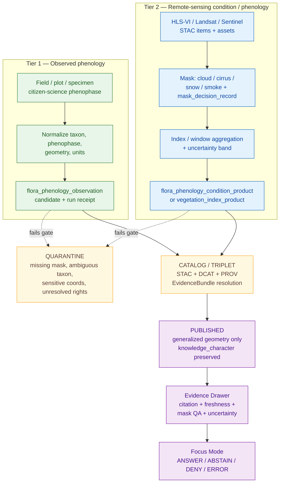

<!-- [KFM_META_BLOCK_V2]
doc_id: kfm://doc/flora/tracking/phenology-and-condition
title: Flora Tracking — Phenology and Condition
type: standard
version: v0.1
status: draft
owners: flora-stewards (TODO: assign GitHub handles)
created: 2026-05-08
updated: 2026-05-08
policy_label: public
related:
  - docs/domains/flora/README.md
  - docs/domains/flora/ARCHITECTURE.md
  - docs/domains/flora/DATA_MODEL.md
  - docs/domains/flora/PIPELINES_AND_LIFECYCLE.md
  - docs/domains/flora/PUBLICATION_AND_POLICY.md
  - docs/domains/flora/SOURCE_REGISTRY.md
  - docs/domains/flora/UI_AND_EVIDENCE_DRAWER.md
  - docs/domains/flora/VERIFICATION_BACKLOG.md
  - docs/adr/ADR-flora-source-roles.md
  - docs/adr/ADR-flora-public-layer-strategy.md
tags: [kfm, flora, tracking, phenology, vegetation-index, remote-sensing, condition, governance]
notes:
  - "Subdirectory docs/domains/flora/tracking/ is a PROPOSED grouping; not present in the Flora Blueprint's flat doc tree. See §2."
  - "All implementation claims are PROPOSED until a real repo is inspected and an ADR confirms placement."
[/KFM_META_BLOCK_V2] -->

# Flora Tracking — Phenology and Condition

> Governance and lane guide for phenology and vegetation-condition tracking inside the KFM Flora domain. Two evidence tiers, one trust posture: observed plant-phenology records and remote-sensing condition/phenology products are kept distinct, masked, windowed, uncertainty-bounded, and citation-resolved before any public surface ever sees them.

<p align="left">
  
  
  
  
  
  <!-- TODO: replace with verified CI / coverage / docs-build badge targets once repo is mounted -->
  
</p>

**Status:** experimental · **Owners:** `flora-stewards` (TODO assign) · **Repo home:** `docs/domains/flora/tracking/` (PROPOSED — see [Repo fit](#repo-fit))

**Quick jump:** [Scope](#scope) · [Repo fit](#repo-fit) · [Inputs](#inputs) · [Exclusions](#exclusions) · [Doctrine](#doctrine) · [Object families](#object-families) · [Source-role map](#source-role-map) · [Lifecycle](#lifecycle) · [Diagram](#diagram) · [Mask · window · uncertainty](#mask--window--uncertainty-discipline) · [Public-safe publication](#public-safe-publication) · [Validators and gates](#validators-and-policy-gates) · [Tests and fixtures](#tests-and-fixtures) · [Verification backlog](#verification-backlog) · [Open questions](#open-questions) · [Related docs](#related-docs) · [Appendix](#appendix)

> [!IMPORTANT]
> **All implementation references in this doc are PROPOSED** unless the real repository confirms otherwise. The Flora Architecture Blueprint is treated as the doctrinal baseline; any path under `contracts/`, `schemas/`, `policy/`, `pipelines/`, `data/`, or `tools/` requires verification against current repo evidence and the Directory Rules before becoming repo fact.

---

## Scope

This document governs how the Flora lane **tracks plant phenology and vegetation condition through time** without collapsing two fundamentally different kinds of evidence:

1. **Observed phenology** — plant-life-cycle events recorded by people in the field (or surrogates derived from on-the-ground methods). Each record is an atomic observation tied to a taxon, a place, a time, a method, and a source. This is the lane's `PhenologyObservation` family.
2. **Remote-sensing condition / phenology products** — vegetation indices, masked composites, and derived phenology metrics computed from satellite or airborne sensors. These are `derived_model` artifacts; they signal condition, they do not prove plant identity at a place. This is the lane's `phenology_condition_product` and `vegetation_index_product` family.

The tracking concern unifies these two tiers under one governance posture — the same trust membrane, the same lifecycle, the same fail-closed gates — while preserving their separateness in identity, schema, source role, knowledge character, and public surface treatment.

[Back to top ↑](#flora-tracking--phenology-and-condition)

---

## Repo fit

> [!NOTE]
> **Directory Rules basis.** KFM root folders are authority boundaries, not topic buckets. `docs/domains/flora/` is the correct responsibility root for this content. The Flora Architecture Blueprint's *Appendix B Proposed Directory Tree* lists the flora docs as a flat set (e.g., `README.md`, `DATA_MODEL.md`, `PIPELINES_AND_LIFECYCLE.md`, `PUBLICATION_AND_POLICY.md`, `VERIFICATION_BACKLOG.md`). Introducing a `tracking/` subdirectory groups topical guides that operate across the data-model, lifecycle, and publication docs without duplicating them. This grouping is **PROPOSED** and should be ratified by an ADR (or replaced with a flat `FLORA_PHENOLOGY_AND_CONDITION.md`) once the real repo is mounted and conventions are visible. Do not let `tracking/` become a parallel doctrine home.

| Aspect | Value | Status |
| :--- | :--- | :--- |
| Responsibility root | `docs/` (human-facing control plane) | CONFIRMED doctrine |
| Domain lane | `docs/domains/flora/` | CONFIRMED doctrine |
| Sub-grouping | `docs/domains/flora/tracking/` | **PROPOSED** — needs ADR or flat-file alternative |
| Authority level | implementation-bearing guidance (not canonical schema) | CONFIRMED for doctrine; PROPOSED for path |
| Companion machine homes | `contracts/flora/` *or* `schemas/contracts/v1/flora/` (pending ADR-flora-schema-home) | PROPOSED |
| Companion policy home | `policy/flora/` (or `policy/domains/flora/` per Directory Rules pattern) | PROPOSED |
| Public-surface posture | Generalized layers + Evidence Drawer payloads only | CONFIRMED doctrine |

**Upstream docs (read these first):** [`docs/domains/flora/ARCHITECTURE.md`](../ARCHITECTURE.md) · [`docs/domains/flora/DATA_MODEL.md`](../DATA_MODEL.md) · [`docs/domains/flora/PIPELINES_AND_LIFECYCLE.md`](../PIPELINES_AND_LIFECYCLE.md) · [`docs/domains/flora/SOURCE_REGISTRY.md`](../SOURCE_REGISTRY.md)

**Downstream docs (kept consistent with this one):** [`docs/domains/flora/PUBLICATION_AND_POLICY.md`](../PUBLICATION_AND_POLICY.md) · [`docs/domains/flora/UI_AND_EVIDENCE_DRAWER.md`](../UI_AND_EVIDENCE_DRAWER.md) · [`docs/domains/flora/VERIFICATION_BACKLOG.md`](../VERIFICATION_BACKLOG.md)

[Back to top ↑](#flora-tracking--phenology-and-condition)

---

## Inputs

This doc operates on artifacts authored under these (PROPOSED) machine homes:

- **Schemas / contracts.** `flora_taxon`, `flora_taxon_crosswalk`, `flora_occurrence`, `flora_phenology_condition_product`, `flora_vegetation_class`, `flora_habitat_association`, `flora_evidence_bundle`, `flora_run_receipt`, `flora_redaction_receipt`, `flora_decision_envelope`, `flora_release_manifest`, `flora_layer_descriptor`, `flora_evidence_drawer_payload`. These are the schema candidates from the Flora Blueprint's *Proposed Schema / Contract Wave*. A `flora_phenology_observation` schema may either reuse `flora_occurrence` with a phenophase extension or be authored as a separate schema; this is **UNKNOWN** pending ADR.
- **Source descriptors.** `flora_source_descriptor` entries under `data/registry/flora/sources.yaml`, with `source_role`, `rights_license_terms`, `sensitivity_posture`, `cadence_update_behavior`, `format_protocol`, and `verification_status`.
- **Registries.** `data/registry/flora/source_roles.yaml`, `sensitivity_policies.yaml`, `taxon_authorities.yaml`, `layer_registry.yaml`, `rights_profiles.yaml`.
- **Receipts and proofs.** Run receipts, redaction receipts, EvidenceBundles, ReleaseManifests, RollbackCards, ReviewRecords — all under the lane's lifecycle stages.

[Back to top ↑](#flora-tracking--phenology-and-condition)

---

## Exclusions

What does **not** belong in this tracking guide (and where it goes instead):

| Out of scope here | Rationale | Goes to |
| :--- | :--- | :--- |
| Modeled species **range maps** and habitat **suitability surfaces** | Spatial summaries / model outputs, not tracking observations | `docs/domains/flora/DATA_MODEL.md` (range/suitability families) |
| **Plant community / vegetation class** classification | Assemblages, not phenology of individual plants | `docs/domains/flora/DATA_MODEL.md` (community/vegetation_class) |
| **Crop progress / crop condition** statistics (USDA NASS) | Belong to Agriculture; aggregate official statistics, not field truth | `docs/domains/agriculture/` |
| **Soil moisture** station/grid products (SMAP, Mesonet, SCAN, USCRN) | Belong to Soils / Agriculture, not Flora | `docs/domains/soils/`, `docs/domains/agriculture/` |
| **Air quality / smoke** detection and indices | Atmosphere lane; smoke is an *input mask* here, not a tracked product | `docs/domains/atmosphere/` |
| **Animal phenology** (migration, breeding) | Fauna lane | `docs/domains/fauna/` |
| Sensitive **rare-plant exact coordinates** | Default DENY; geometry must be generalized or withheld | `docs/domains/flora/PUBLICATION_AND_POLICY.md`, `policy/flora/sensitivity.rego` |
| Live-network ingest implementation | Belongs to pipeline code, not docs | `pipelines/flora/`, `packages/flora/src/flora/` |

[Back to top ↑](#flora-tracking--phenology-and-condition)

---

## Doctrine

The tracking lane operates under the same KFM invariants as the rest of the Flora domain. The non-negotiables for this guide:

- **Two-tier evidence separation.** Observed phenology and remote-sensing condition products are different source roles, different knowledge characters, and different public-surface treatments. They never silently merge into a unified "phenology" claim.
- **Derived stays derived.** A vegetation-index time series, a greenup/senescence date estimate, a stress indicator — these are `derived_model` outputs. They are **never** treated as observed plant occurrence or as proof of taxon presence at a place. Promoting them does not change their knowledge character.
- **Cite-or-abstain.** Every tracking claim that reaches a public surface resolves through `EvidenceRef → EvidenceBundle`. If it cannot, the runtime returns `ABSTAIN` (insufficient evidence) or `DENY` (policy block) — never a fluent fallback.
- **Mask before metric.** No vegetation index, change alert, or phenology metric is computed without an explicit cloud / cirrus / snow / smoke mask whose decision is recorded as part of the product's lineage.
- **Window labeling is mandatory.** Every product carries an explicit temporal window (e.g., 8-day, 16-day) and an explicit `valid_time` separate from `retrieved_at`. Stale windows trigger freshness chips and may force `ABSTAIN`.
- **Uncertainty travels with the value.** Every tracked metric carries an uncertainty descriptor — quantile bands, confidence interval, or QA-flag class — propagated from source through processed and into the published payload.
- **Public geometry is generalized by default** for any record bound to a sensitive taxon. Generalization is a transform with a redaction receipt, not a quiet rounding.
- **Promotion is a state transition.** Files are not phenology-tracked because they sit in `processed/`. They become trackable when an EvidenceBundle resolves, the catalog matrix closes, the policy gate clears, and the release manifest references them.

[Back to top ↑](#flora-tracking--phenology-and-condition)

---

## Object families

The tracking concern uses a small, deliberate set of object families. Each family has a distinct identity, a distinct schema, and a distinct public-surface treatment.

| Family | Tier | Knowledge character | Status | Identity hint | Public surface |
| :--- | :--- | :--- | :--- | :--- | :--- |
| `flora_phenology_observation` *(may reuse `flora_occurrence` + phenophase extension; ADR pending)* | **Observed** | observation | PROPOSED | `kfm://flora/phenology-observation/sha256:<hash>` over source_id + record_id + event_date + taxon + phenophase | Generalized point/area + Evidence Drawer; sensitive taxa redacted by default |
| `flora_phenology_condition_product` | **Remote-sensing** | derived_model | PROPOSED (P2 in blueprint) | `kfm://flora/condition/<sensor>/<product>/<window>/<spec_hash>` | Released vegetation-condition layer with mask, window, uncertainty |
| `vegetation_index_product` | **Remote-sensing** | derived_model | PROPOSED | `kfm://flora/vegindex/<sensor>/<index>/<window>/<spec_hash>` | Released index tile/COG with QA mask + lineage |
| `phenology_metric_estimate` *(e.g., greenup, peak, senescence date)* | **Remote-sensing → derived analytic** | derived_model | PROPOSED | `kfm://flora/phenology-metric/<method>/<input_refs_hash>` | Released only after method card + uncertainty + reference period are in place |
| `mask_decision_record` *(cloud / smoke / snow / cirrus)* | **Lineage** | derived_model | PROPOSED | `kfm://flora/mask/<sensor>/<scene>/<algo_version>` | Internal lineage; surfaces in Evidence Drawer as a `mask_qa` summary |
| `flora_run_receipt` | **Process memory** | governance | PROPOSED | `kfm://run/flora/<uuid>` | Internal; not a release proof |
| `flora_redaction_receipt` | **Transform lineage** | governance | PROPOSED | `kfm://redaction/flora/<uuid>` | Drawer summary only |
| `flora_evidence_bundle` | **Release/runtime** | governance | PROPOSED (P0) | `kfm://evidence/flora/sha256:<hash>` | Resolved through governed API |

> [!TIP]
> The Flora Blueprint already names `flora_phenology_condition_product.schema.json` and `flora_evidence_bundle.schema.json` as schema-wave candidates. The exact field set lives in those schemas, not here. This doc tells you *what tracking expects of those schemas*; the schema files tell you *what is enforceable today*.

[Back to top ↑](#flora-tracking--phenology-and-condition)

---

## Source-role map

The Flora Blueprint defines a fixed `source_role` vocabulary and an authority boundary for each candidate source. Tracking uses this map without renaming or collapsing roles.

| Source candidate | `source_role` | Tier | Activation rule |
| :--- | :--- | :--- | :--- |
| Field plot survey, herbarium specimen with phenophase, photo voucher | `institutional` / `corroborative` | Observed | Verify rights, taxon precision, phenophase vocabulary |
| Citizen-science phenology (e.g., iNaturalist with phenophase annotation) | `community_observation` | Observed | License filter, quality grade, taxon resolution, sensitive-coord filter |
| Steward-reviewed phenology submissions | `steward_reviewed` | Observed | Record review state and release authorization |
| HLS-VI / Landsat / Sentinel-derived indices | `derived_model` | Remote-sensing | Use as condition/phenology evidence only; **must** include masks, windows, uncertainty |
| NLCD / NWI / GAP / LANDFIRE / soils / hydrology overlays | `derived_model` / `official` | Covariate (linked) | Linked as covariates; never converted to tracked observation |
| USFWS / NatureServe range or status context | `official` / `controlled_access` | Status (linked) | Treat as status context, not as phenology observation |

> [!CAUTION]
> **Anti-collapse rule.** Aggregate official statistics (e.g., USDA NASS *Crop Progress* phenology) describe **agricultural commodity progress**, not native plant phenology. They live in the Agriculture lane and must never be re-labeled as flora phenology observations.

[Back to top ↑](#flora-tracking--phenology-and-condition)

---

## Lifecycle

Tracked phenology and condition artifacts follow the canonical KFM lifecycle. The flow is the same for both tiers; the lifecycle responsibilities differ where mask discipline and uncertainty propagation only apply to the remote-sensing tier.

| Stage | Observed-tier responsibilities | Remote-sensing-tier responsibilities | Fail-closed conditions |
| :--- | :--- | :--- | :--- |
| `SOURCE EDGE` | Resolve descriptor, capture rights/sensitivity, ETag/Last-Modified/checksum | Same, plus product version, processing level, asset list, scene IDs | Missing rights or unknown role → halt |
| `RAW` | Source-native record under `data/raw/flora/<source>/<run>/` | Source-native STAC item + asset references; **no mutation** | Public surfaces never read RAW |
| `WORK` | Normalize taxon, phenophase, geometry, units; canonical record | Apply mask (cloud/smoke/snow/cirrus); compute candidate index/metric; emit `mask_decision_record` | Missing mask QA → quarantine |
| `QUARANTINE` | Ambiguous taxon, missing rights, bad geometry, sensitive-coord exposure | Failed mask QA, low scene confidence, processing-level mismatch | Held, not deleted; lineage preserved |
| `PROCESSED` | `data/processed/flora/<spec_hash>/` candidate observation | `data/processed/flora/vegetation_index/...` and condition-product candidates with window + uncertainty | Missing `spec_hash` or window → block |
| `CATALOG / TRIPLET` | STAC + DCAT + PROV records; EvidenceBundle resolves refs | Same, plus method card / model card refs | Catalog matrix not closed → DENY promotion |
| `PUBLISHED` | Generalized public layer + Evidence Drawer payload | Released condition layer with `derived_model` knowledge character + mask/window/uncertainty | Public payload exposes internal ref → DENY |

Promotion remains a **governed state transition**, not a copy. RAW/WORK/QUARANTINE are never read by public clients; release flows through the governed API only.

[Back to top ↑](#flora-tracking--phenology-and-condition)

---

## Diagram

The two evidence tiers run in parallel and converge only at the Evidence Drawer, where each tier carries its own knowledge character and its own freshness/uncertainty/mask metadata.



[Back to top ↑](#flora-tracking--phenology-and-condition)

---

## Mask · window · uncertainty discipline

These three disciplines apply to the remote-sensing tier and to any analytic derived from it. They are non-optional.

### Mask discipline

- Every scene that contributes to a tracked product carries a `mask_decision_record` linking the algorithm, version, input flags (cloud, cirrus, snow, smoke, water, shadow), and per-pixel exclusion semantics.
- A scene whose mask QA fails (no QA band, version mismatch, untrusted upstream flags) is **quarantined**, not silently included with a permissive fallback.
- Smoke and cirrus that overlap the **target phenological window** are an explicit risk class. The published product must surface this risk in its Evidence Drawer caveat; if exclusion would violate a minimum-coverage threshold, the lane must `ABSTAIN` rather than emit a low-confidence value as fact.

### Window discipline

- Composite/aggregation windows (commonly 8-day or 16-day for HLS-VI/Landsat-style products) are recorded as explicit ISO 8601 intervals.
- Each tracked product separates the temporal axes:
  - `observed_window` — the period the product describes,
  - `valid_time` / `as_of` — the period for which it is considered current,
  - `retrieved_at` — when the lane fetched it,
  - `release_time` — when it was promoted.
- Windows that fall outside the source's published cadence (e.g., a re-released archive) carry a freshness chip and a recomputation note.

### Uncertainty discipline

- Every value carries an uncertainty descriptor appropriate to the source. Examples: quantile bands (e.g., q05 / q50 / q95) for index products, classification confidence for phenology-stage classifications, propagated standard error for downstream metrics.
- Uncertainty is **not** a UI ornament. Validators check that uncertainty is present, finite, and consistent with the source's stated semantics.
- Public layers and Evidence Drawer payloads must render uncertainty visibly — a single value with no band is **not** a public-safe value.

> [!WARNING]
> A "clean-looking" composite without an explicit mask, window, and uncertainty is suspect by default. The lane prefers an honest `ABSTAIN` to a confident-looking value the validators cannot defend.

[Back to top ↑](#flora-tracking--phenology-and-condition)

---

## Public-safe publication

Tracked products use the same publication gates as the rest of Flora; the tracking-specific obligations are listed below.

- **Knowledge character is preserved on every payload.** Observed-tier and remote-sensing-tier products carry distinct `knowledge_character` labels (e.g., `observation` vs `derived_model`). UI and AI surfaces never flatten the two.
- **Generalized geometry by default for sensitive taxa.** A `flora_redaction_receipt` records the generalization method (precision bucket, grid/region, input/output digests, reason code). Exact-coordinate exposure for sensitive rare flora is `DENY` unless rights, policy, and review explicitly allow it.
- **Freshness chips are mandatory.** Stale state is shown, not hidden. A stale window is a possible `ABSTAIN` trigger.
- **Aggregate official statistics never substitute for field truth.** Imported phenology context from official aggregate sources is presented at the geography it was published at and labeled as such.
- **Source-role and source-authority labels travel end-to-end.** A vegetation-index value never reaches the public payload without its `source_role: derived_model` label and its `EvidenceRef` set.
- **Internal-only references stay internal.** Public payloads never expose `RAW`/`WORK`/`QUARANTINE` URIs or unpublished candidate IDs.

| Payload section | Required for tracking products |
| :--- | :--- |
| `claim` | Bounded statement, spatial scope, temporal scope, `knowledge_character` |
| `evidence` | `evidence_refs`, resolved `bundle_id`, `source_id`, `source_role`, citations, checksums |
| `provenance` | STAC / DCAT / PROV refs, run receipt refs, mask decision ref, derivation ids |
| `rights/sensitivity` | License/terms, public eligibility, redaction receipt, `review_required`, `generalized_geometry` flag |
| `freshness/review/correction` | `as_of`, `valid_time`, `retrieved_at`, `review_state`, `correction_notice`, `rollback_ref` |

[Back to top ↑](#flora-tracking--phenology-and-condition)

---

## Validators and policy gates

CI is thin orchestration; the policy-significant logic lives in validators and policy files.

| Concern | Validator (PROPOSED) | Policy gate (PROPOSED) | Failure outcome |
| :--- | :--- | :--- | :--- |
| Schema shape | `tools/validators/flora/validate_schema_fixtures.py` | — | DENY promotion |
| Source descriptor completeness | `tools/validators/flora/validate_source_descriptors.py` | `policy/flora/promotion.rego` | Fail closed |
| Rights / license | `validate_rights.py` (PROPOSED) | `policy/flora/rights.rego` | `ABSTAIN` runtime; `DENY` promotion |
| Sensitivity / geoprivacy | `validate_sensitivity.py` (PROPOSED) | `policy/flora/sensitivity.rego` | `DENY` exact public geometry |
| Taxon identity | `validate_taxon.py` (PROPOSED) | `policy/flora/taxon.rego` | `QUARANTINE` ambiguous |
| Catalog closure | `validate_catalog_matrix.py` (PROPOSED) | `policy/flora/catalog.rego` | `DENY` until closed |
| Mask / QA presence (RS tier) | `validate_mask_qa.py` (PROPOSED — tracking-specific) | `policy/flora/promotion.rego` | `QUARANTINE` scene |
| Window + uncertainty presence | `validate_window_uncertainty.py` (PROPOSED — tracking-specific) | `policy/flora/promotion.rego` | `DENY` promotion |
| Knowledge-character integrity | `validate_knowledge_character.py` (PROPOSED) | `policy/flora/promotion.rego` | `DENY` if observation/derived collapsed |
| AI / Focus citation | `validate_citations.py` (PROPOSED) | `policy/flora/ai.rego` | `DENY` uncited tracking answer |

> [!IMPORTANT]
> **Missing policy evidence fails closed.** A tracked product without a recorded mask decision, without a window, without an uncertainty descriptor, or without a resolved EvidenceBundle does not get promoted, even if the schema validator passes.

[Back to top ↑](#flora-tracking--phenology-and-condition)

---

## Tests and fixtures

PROPOSED test families and minimum coverage for the tracking concern (no live network in CI):

- **Valid fixtures** for `flora_phenology_observation`, `flora_phenology_condition_product`, `vegetation_index_product`, `mask_decision_record`, and the matching `flora_evidence_bundle`.
- **Invalid fixtures** that prove validators catch:
  - missing mask QA on a RS scene that contributes to a tracked window,
  - missing window or `valid_time`,
  - missing uncertainty descriptor,
  - knowledge-character collapse (a `derived_model` product mislabeled as `observation`),
  - exact-coordinate exposure for a sensitive taxon.
- **Pipeline thin-slice** (no network) producing one observed-tier and one RS-tier candidate from fixture sources, closing the catalog matrix, and rendering both into a fixture Evidence Drawer payload.
- **Policy parity tests** for the deny cases above.
- **Non-regression tests** for prior tracked releases when corrections or rollbacks supersede them.

A successful thin slice for tracking is the smallest defensible end-to-end demonstration: one observed phenophase record + one masked windowed condition product → one Evidence Drawer payload → one Focus answer with a finite outcome and validated citations.

[Back to top ↑](#flora-tracking--phenology-and-condition)

---

## Verification backlog

Items that are checkable but **not yet checked strongly enough** in this session to act as fact:

- **NEEDS VERIFICATION** — schema-home placement (`contracts/flora/` vs `schemas/contracts/v1/flora/`); resolved by ADR-flora-schema-home before any new tracking schema lands.
- **NEEDS VERIFICATION** — whether `flora_phenology_observation` is a separate schema or an extension of `flora_occurrence` with a phenophase block. Decision belongs in an ADR.
- **NEEDS VERIFICATION** — exact source descriptors and activation rules for HLS-VI, Landsat, and Sentinel as flora-lane derived sources (rights, processing level, atmospheric correction, regional Kansas coverage).
- **NEEDS VERIFICATION** — the precise public-eligibility rule for citizen-science phenology with sensitive-coordinate annotations.
- **UNKNOWN** — whether a Kansas-relevant ground-phenology authority (e.g., a state extension network) is admissible as `institutional`; descriptor research required.
- **UNKNOWN** — the canonical method for publishing a `phenology_metric_estimate` (greenup, peak, senescence date) — direct release vs steward-reviewed only — pending an ADR.
- **PROPOSED** — every path in this doc that points to `contracts/`, `schemas/`, `policy/`, `pipelines/`, `tools/`, or `data/`. Mark each one verified or replace it once the repo is mounted.

[Back to top ↑](#flora-tracking--phenology-and-content)

---

## Open questions

1. **Where does NatureServe sit?** Status / model context is licensed and access-controlled; the corpus does not fully specify how (or whether) NatureServe phenology-adjacent products are distributed downstream of the Flora lane.
2. **What confidence threshold for vegetation-change alerts?** The corpus acknowledges that smoke and cirrus overlap real change at certain phenological windows; whether the threshold is global or season/ecoregion-specific remains open.
3. **Late-arriving observation policy.** General KFM policy for back-dated records is unspecified; the tracking lane needs an explicit rule for how a late phenology record amends a prior published window.
4. **Public posture for `phenology_metric_estimate`.** Are derived metric estimates ever publicly released without steward review, or always steward-reviewed first?
5. **Identity for renamed taxa across snapshots.** A phenology-observation series tied to a taxon whose accepted identity has changed needs an explicit cross-snapshot identity rule (Flora Blueprint flags this for USDA PLANTS specifically; it generalizes to tracking).

[Back to top ↑](#flora-tracking--phenology-and-condition)

---

## Related docs

| Path | Why it relates |
| :--- | :--- |
| [`docs/domains/flora/README.md`](../README.md) | Domain entry point and lane status |
| [`docs/domains/flora/ARCHITECTURE.md`](../ARCHITECTURE.md) | End-to-end lane architecture |
| [`docs/domains/flora/DATA_MODEL.md`](../DATA_MODEL.md) | Object families, IDs, relations |
| [`docs/domains/flora/PIPELINES_AND_LIFECYCLE.md`](../PIPELINES_AND_LIFECYCLE.md) | RAW → PUBLISHED watcher behavior |
| [`docs/domains/flora/PUBLICATION_AND_POLICY.md`](../PUBLICATION_AND_POLICY.md) | Rights, sensitivity, public-safe rules |
| [`docs/domains/flora/UI_AND_EVIDENCE_DRAWER.md`](../UI_AND_EVIDENCE_DRAWER.md) | MapLibre / Drawer / Focus contract notes |
| [`docs/domains/flora/SOURCE_REGISTRY.md`](../SOURCE_REGISTRY.md) | Human-readable source registry |
| [`docs/domains/flora/VERIFICATION_BACKLOG.md`](../VERIFICATION_BACKLOG.md) | Open checks and evidence gaps |
| [`docs/adr/ADR-flora-schema-home.md`](../../../adr/ADR-flora-schema-home.md) | Schema-home placement (PROPOSED) |
| [`docs/adr/ADR-flora-source-roles.md`](../../../adr/ADR-flora-source-roles.md) | Source-role vocabulary lock (PROPOSED) |
| [`docs/adr/ADR-flora-public-layer-strategy.md`](../../../adr/ADR-flora-public-layer-strategy.md) | Public-layer strategy (PROPOSED) |
| Adjacent lanes — [`docs/domains/agriculture/`](../../agriculture/), [`docs/domains/atmosphere/`](../../atmosphere/), [`docs/domains/habitat/`](../../habitat/) | Cross-domain joins (covariates, smoke, land cover) |

[Back to top ↑](#flora-tracking--phenology-and-condition)

---

## Appendix

<details>
<summary><b>Illustrative payload sketches</b> — not authoritative; live shapes belong to the schemas in <code>contracts/flora/</code> or <code>schemas/contracts/v1/flora/</code></summary>

> [!NOTE]
> The following blocks are **illustrative**. They show the *shape* the tracking guide expects of the schema wave, not the binding contract. Do not copy these into validators.

```jsonc
// Illustrative — flora_phenology_observation candidate (PROPOSED)
{
  "phenology_observation_id": "kfm://flora/phenology-observation/sha256:...",
  "taxon_id": "kfm://flora/taxon/<authority>/<id>",
  "phenophase": "flowering",                 // controlled vocabulary; ADR pending
  "phenophase_intensity": "peak",            // optional, source-dependent
  "method": "field_plot",                    // field_plot | photo_voucher | citizen_observation | herbarium_phenophase
  "event_date": "2026-05-08",
  "event_time_zone": "America/Chicago",
  "geometry": { /* generalized public-safe geometry by default */ },
  "geometry_uncertainty_m": 250,
  "knowledge_character": "observation",
  "source_id": "flora.source.<provider>.<dataset>.v1",
  "source_role": "institutional",            // or community_observation | steward_reviewed | corroborative
  "rights": { "license": "...", "rights_holder": "..." },
  "sensitivity": { "policy_label": "public", "redaction_receipt": null },
  "review_state": "unreviewed",
  "evidence_refs": [ "kfm://evidence/flora/sha256:..." ],
  "spec_hash": "sha256:..."
}
```

```jsonc
// Illustrative — flora_phenology_condition_product candidate (PROPOSED)
{
  "product_id": "kfm://flora/condition/HLS/HLSL30.2.0/8day/sha256:...",
  "knowledge_character": "derived_model",
  "source_id": "flora.source.hls.l30.v2",
  "source_role": "derived_model",
  "sensor": "Landsat-8/9 + Sentinel-2 (HLS)",
  "product": "HLS-VI 8-day composite",
  "index": "NDVI",                           // or EVI, NBR, etc.
  "observed_window": { "start": "2026-04-30", "end": "2026-05-07" },
  "valid_time": "2026-05-07T23:59:59Z",
  "retrieved_at": "2026-05-08T01:14:22Z",
  "spatial_support": { "grid": "HLS tile", "tile_id": "T14SLB", "pixel_m": 30 },
  "mask_decision_ref": "kfm://flora/mask/HLS/T14SLB/2026-05-07/v1",
  "mask_summary": { "cloud_pct": 8.4, "cirrus_pct": 1.1, "snow_pct": 0.0, "smoke_flag": false },
  "uncertainty": { "method": "quantile", "q05": 0.41, "q50": 0.58, "q95": 0.71 },
  "evidence_refs": [ "kfm://evidence/flora/sha256:..." ],
  "spec_hash": "sha256:..."
}
```

```jsonc
// Illustrative — Evidence Drawer payload section for a tracked product
{
  "claim": {
    "claim_id": "kfm://flora/claim/...",
    "label": "Vegetation greenness, T14SLB, 2026-04-30 to 2026-05-07",
    "knowledge_character": "derived_model"
  },
  "evidence": {
    "bundle_id": "kfm://evidence/flora/sha256:...",
    "source_role": "derived_model",
    "citations": [ "HLS L30 v2.0, NASA / USGS" ]
  },
  "provenance": {
    "stac_ref": "...", "dcat_ref": "...", "prov_ref": "...",
    "run_receipt_ref": "kfm://run/flora/...",
    "mask_decision_ref": "kfm://flora/mask/HLS/T14SLB/2026-05-07/v1"
  },
  "rights": { "license": "public-domain", "public_eligibility": "public_ok" },
  "freshness": { "as_of": "2026-05-07T23:59:59Z", "retrieved_at": "2026-05-08T01:14:22Z" },
  "review": { "review_state": "auto_promoted_with_gates" },
  "uncertainty_summary": "NDVI q50 0.58 [q05 0.41, q95 0.71]"
}
```

</details>

<details>
<summary><b>Glossary (tracking-scoped subset)</b></summary>

- **Phenophase.** A defined plant life-cycle event (e.g., leaf-out, flowering, fruiting, senescence) recorded against a controlled vocabulary.
- **Knowledge character.** Whether a value is an `observation`, `derived_model`, `regulatory_context`, `legal_status`, etc. Preserved on every payload that reaches a public surface.
- **Mask decision record.** The recorded outcome of cloud/cirrus/snow/smoke screening for a remote-sensing scene that contributes to a tracked window. Stored as lineage, surfaced as a Drawer summary.
- **Window.** The temporal interval a product describes (e.g., 8-day or 16-day composite). Distinct from `valid_time`, `retrieved_at`, and `release_time`.
- **Uncertainty descriptor.** The form in which a value carries its uncertainty (quantile bands, confidence interval, classification confidence). Required, not optional.
- **Generalized geometry.** Geometry produced by a transform that reduces precision (rounding, gridding, regionalization) and emits a redaction receipt; the default for sensitive taxa.

</details>

[Back to top ↑](#flora-tracking--phenology-and-condition)
