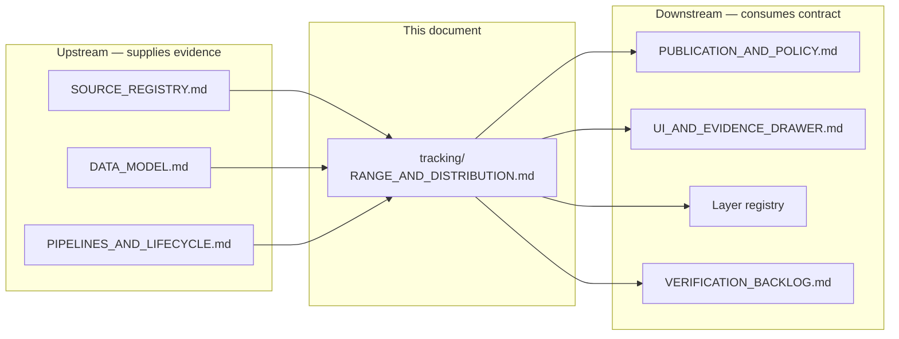
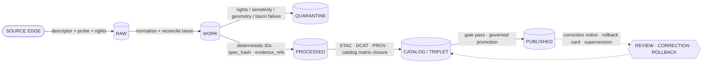

<!-- [KFM_META_BLOCK_V2]
doc_id: kfm://doc/flora-tracking-range-and-distribution
title: Flora — Range and Distribution Tracking
type: standard
version: v0.1
status: draft
owners: TBD-flora-steward
created: 2026-05-08
updated: 2026-05-08
policy_label: public
related:
  - docs/domains/flora/README.md
  - docs/domains/flora/ARCHITECTURE.md
  - docs/domains/flora/DATA_MODEL.md
  - docs/domains/flora/SOURCE_REGISTRY.md
  - docs/domains/flora/PUBLICATION_AND_POLICY.md
  - docs/domains/flora/UI_AND_EVIDENCE_DRAWER.md
  - docs/adr/ADR-flora-public-layer-strategy.md
  - docs/adr/ADR-flora-sensitive-location-policy.md
  - docs/adr/ADR-flora-source-roles.md
tags: [kfm, flora, range, distribution, derived-surfaces, geoprivacy]
notes:
  - "Path `docs/domains/flora/tracking/` is PROPOSED — not present in Flora Architecture Blueprint Appendix B; confirm via repo inspection or ADR."
  - "Repo not mounted in this session; all repo-shaped claims are PROPOSED / NEEDS VERIFICATION."
[/KFM_META_BLOCK_V2] -->

# Flora — Range and Distribution Tracking

How the Flora lane records, versions, and publishes plant **range** and **distribution** as governed *derived surfaces* — never as a substitute for specimen or occurrence evidence.

> **Status** · `draft` &nbsp;|&nbsp; **Owners** · `flora-steward (TBD)` &nbsp;|&nbsp; **Lane** · `flora` &nbsp;|&nbsp; **Doc class** · `standard`


**Jump to:** [Purpose](#1-purpose) · [Repo fit](#2-repo-fit) · [Core distinction](#3-core-distinction--observation-vs-derived) · [Object families](#4-object-families) · [Source roles](#5-source-roles-for-rangedistribution) · [Temporal model](#6-temporal-model) · [Lifecycle](#7-lifecycle) · [Sensitivity](#8-sensitivity--public-safe-geometry) · [Validation gates](#9-validation-gates--deny-reasons) · [Public layers](#10-public-layer-mapping) · [EvidenceBundle](#11-evidencebundle-requirements) · [Anti-patterns](#12-anti-patterns) · [Verification backlog](#13-verification-backlog) · [Open questions](#14-open-questions) · [Related](#15-related-docs)

> [!IMPORTANT]
> A **range map is not a specimen.** A **generalized public polygon is not an internal sensitive occurrence point.** Range and distribution surfaces are **derived** — they summarize, model, or generalize over evidence. They cannot be promoted into the role of root truth.

---

## 1. Purpose

This document is the focused reference for the **range-and-distribution tracking concern** within the Flora lane. It defines:

- which Flora objects describe range and distribution (and which do not),
- which sources are allowed to support range/distribution claims, and in what role,
- how range/distribution evolves over time,
- how the lifecycle from raw inputs to public-safe published surfaces is governed,
- which sensitivity and policy gates apply before any public release,
- which Evidence Drawer / Layer Manifest contracts these objects must satisfy.

It does **not** redefine taxonomy, occurrence schemas, vegetation communities, or the broader publication policy — those live in the sibling docs listed in [§15](#15-related-docs).

> **Truth labels used below.** `CONFIRMED` (verified in this session from attached docs), `INFERRED` (reasonably derivable from visible evidence), `PROPOSED` (design not yet verified in implementation), `UNKNOWN` (not resolvable without more evidence), `NEEDS VERIFICATION` (checkable but not yet checked).

---

## 2. Repo fit

> [!NOTE]
> The repository is **not mounted** in this session. All paths in this section are read from the **Flora Architecture PDF-Only Implementation Blueprint** (Appendix B) and the **Definitive Greenfield Building Plan** (§6.5 flora). They are `PROPOSED` until verified against the live repo.

### 2.1 Path placement

| Aspect | Value | Status |
|---|---|---|
| This file | `docs/domains/flora/tracking/RANGE_AND_DISTRIBUTION.md` | `PROPOSED` |
| Parent lane index | `docs/domains/flora/README.md` | `PROPOSED` (Appendix B) |
| Schema home (range/distribution) | `schemas/contracts/v1/flora/*.schema.json` **or** `contracts/flora/*.schema.json` | `CONFLICTED` — resolve via `docs/adr/ADR-flora-schema-home.md` before machine files land |
| Processed data home | `data/processed/flora/range_maps/` | `PROPOSED` (Blueprint §6, p. 13) |
| Publication home | `data/published/flora/{layers,tilejson,geojson,manifests}/` | `PROPOSED` (Appendix B) |
| Policy | `policy/flora/*.rego` | `PROPOSED` |
| Tests / fixtures | `tests/flora/*` · `tests/fixtures/flora/{valid,invalid}/` | `PROPOSED` |

> [!CAUTION]
> The `docs/domains/flora/tracking/` subfolder is **not** in the Flora Architecture Blueprint Appendix B directory tree. Its placement is `PROPOSED` and `NEEDS VERIFICATION`. If repo evidence shows a different convention (e.g. all flora reference docs at the lane root), this file should move and an ADR should record the placement decision. Do not create a parallel `tracking/` home in other lanes without alignment.

### 2.2 Upstream / downstream



---

## 3. Core distinction — observation vs derived

The Flora architecture **explicitly forbids** collapsing the following five categories into one another:

1. observed occurrence,
2. institutional / specimen evidence,
3. modeled range or suitability,
4. regulatory / stewardship context,
5. generalized public-safe display layer.

Range and distribution work touches three of those categories at once and is therefore the area where collapse is most likely. The defense is to **keep object families separate end-to-end** — including identity, schema, storage path, catalog record, evidence bundle, and rendered drawer payload.

| If you have… | …it is | Allowed to support a range claim? | Public exact geometry? |
|---|---|---|---|
| `specimen_record`, `herbarium_sheet`, `plot_observation`, `photo_voucher` | observation / specimen evidence | **Yes**, as direct support | only if non-sensitive **and** rights allow |
| `flora_occurrence` (GBIF / iNaturalist crowd) | corroborative observation | **Yes**, with source-role caveats | usually **generalize**; sensitive taxa **DENY** |
| USDA PLANTS state/county presence array | official distribution baseline | **Yes**, at state/county granularity only | yes — public domain federal source |
| `flora_range_map`, `distribution_surface` | **derived** spatial summary or model | **Itself a claim**, supported by other refs | **derived** — never present as observation |
| `habitat_suitability_surface`, `suitability_model_card` | model output | covariate / interpretive support | model-as-observation is `DENY` |
| `phenology_condition_product`, `vegetation_index_product` | remote-sensing condition signal | indirect; needs masks/windows/uncertainty | derived only |
| `generalized_public_occurrence` | public-safe redacted view | derived from evidence under transform receipt | yes — that is its purpose |

> [!WARNING]
> Treating a `flora_range_map` or a `distribution_surface` as if it were an observation is the failure mode this document exists to prevent. The Flora policy reason code for this is `model_as_observation` / `knowledge_character_mismatch` and the outcome is `DENY`.

---

## 4. Object families

All objects below are `PROPOSED` per the Flora Architecture Blueprint §4 and §6. Field-level shapes belong in `DATA_MODEL.md` and the schemas (once the schema-home ADR resolves); this section names the families and their boundaries.

### 4.1 Range / distribution surfaces (derived)

| Object | Role | Identity | Notes |
|---|---|---|---|
| `flora_range_map` | named, time-scoped polygon (or polygon set) describing the spatial extent of a taxon under a stated method | deterministic ID over `(taxon_id, method, scope, valid_from, source_role, spec_hash)` | a single taxon may have many; do not silently merge |
| `distribution_surface` | continuous or gridded surface (e.g. county presence raster, hex grid presence) | deterministic ID over `(taxon_id, grid/scope, method, valid_from, spec_hash)` | gridding parameters are part of identity |
| `suitability_model_card` | model description tied to a habitat-suitability surface | deterministic ID over `(model_recipe, training_evidence_digest, version)` | the *card* is canonical; the surface is its referent |
| `generalized_public_occurrence` | public-safe redacted geometry derived from a sensitive `flora_occurrence` | deterministic ID over `(source_occurrence_id, transform, policy_version)` | links to a `redaction_receipt` |
| `public_range_polygon` *(layer-side)* | published generalization for MapLibre | layer-stable `layer_id` with alias map | renders only generalized geometry |

### 4.2 Distribution-presence claims (categorical, evidence-bearing)

| Object | Role | Notes |
|---|---|---|
| State presence (USDA PLANTS) | `(taxon, USPS_state_code, presence, first_observed?)` | federal public domain; the canonical presence baseline |
| County presence (USDA PLANTS) | `(taxon, FIPS_5_county, presence, first_observed?)` | uses 5-digit FIPS county codes |
| `status_assertion` | nativity / introduced / invasive / cultivated, jurisdiction-scoped | interpretive; varies by jurisdiction and time |

### 4.3 Supporting governance objects

| Object | Role |
|---|---|
| `EvidenceBundle` | the bundle resolved from any `EvidenceRef` on a range/distribution object |
| `redaction_receipt` | records the exact-to-public-safe geometry transform when applicable |
| `review_record` | steward review state required before promotion of sensitive surfaces |
| `correction_notice` / `rollback_card` / `supersession_link` | governance transitions; preserve lineage rather than deleting history |

---

## 5. Source roles for range/distribution

Range/distribution work **must not** treat all biodiversity sources as equal. Each source has a role, an authority scope, and a default publication posture. The full registry lives in `data/registry/flora/sources.yaml` (`PROPOSED`); the table below summarizes how those roles apply to range/distribution specifically.

| Source role class | Examples | What it can support for range/distribution | Default publication posture |
|---|---|---|---|
| Federal taxonomic / distribution baseline | USDA PLANTS Complete Checklist + state/county distribution | state/county presence + first-observed; taxonomic backbone | `public` (federal public domain) |
| Federal status / habitat | USFWS ECOS, critical habitat | federal listing, critical habitat polygons | public after citation; precise location respected |
| Conservation rank / model | NatureServe Explorer | rank, modeled range context where licensed | controlled by license; precise locations restricted |
| Specimen / herbarium | KANU, KSC, iDigBio | specimen-backed presence at locality | respect collection rights; sensitive taxa restricted |
| Aggregator (occurrence) | GBIF, iNaturalist | corroborative occurrence; per-record license | record-level rights and geoprivacy required |
| State rare plant program | Kansas-specific stewardship sources | rare-plant status + steward-controlled locations | default `DENY` exact public geometry |
| Remote-sensing context | LANDFIRE, vegetation indices | derived covariate / condition only | not occurrence proof; publish as derived surface |

> [!NOTE]
> A **range claim** must declare which source roles support it. A range surface backed only by community-science observations is not interchangeable with one backed by herbarium specimens or by an authoritative federal distribution. The Evidence Drawer must surface this difference; see [§11](#11-evidencebundle-requirements).

---

## 6. Temporal model

Range and distribution are **time-aware**. Every object should carry the temporal fields below where applicable; collapsing them is a known failure mode.

| Field | Meaning |
|---|---|
| `valid_from` / `valid_to` | the period during which the claim is asserted to hold |
| `observed_at` | event time of the underlying observation (when relevant) |
| `source_date` / `source_vintage` | when the source asserted the value |
| `retrieved_at` | when KFM fetched it |
| `release_date` | when the surface was published by KFM |
| `first_observed` | earliest evidence-anchored observation in scope (e.g. USDA PLANTS county first-observed) |
| `superseded_by` | link to the surface that replaced this one (preserved, not deleted) |

> [!WARNING]
> Do **not** collapse event time, source time, processing time, and publication time. The time slider, the Evidence Drawer freshness chip, and the release manifest each rely on different fields. Collapsing them produces freshness-misleading layers.

### 6.1 Tracking change over time

Distribution understanding evolves as new evidence arrives. The pattern is **append + supersede**, never **silent overwrite**:

```mermaid
sequenceDiagram
  autonumber
  participant SRC as Source(s)
  participant W as WORK / QUARANTINE
  participant P as PROCESSED (range_map / surface)
  participant C as CATALOG / TRIPLET
  participant R as Released layer
  participant N as New evidence

  SRC->>W: ingest + normalize
  W->>P: validate + assign deterministic IDs (spec_hash)
  P->>C: emit STAC / DCAT / PROV
  C->>R: governed promotion (gate must pass)
  Note over R: layer_v1 published (valid_from=t0)
  N->>W: later evidence arrives
  W->>P: produce range_map_v2 (spec_hash differs)
  P->>C: catalog matrix closure
  C->>R: promote v2; emit supersession_link v1->v2
  Note over R: layer_v1 retains lineage; not deleted
```

---

## 7. Lifecycle

`PROPOSED`. Range and distribution flow through the standard KFM truth lifecycle. Promotion is a **governed state transition**, never a file move.



| Stage | What range/distribution work produces | Fail-closed conditions |
|---|---|---|
| `SOURCE EDGE` | source descriptor, probe receipt | unknown rights, unknown sensitivity, unverified controlled source |
| `RAW` | immutable raw pulls (or fixtures), checksums | raw artifact referenced by public payload |
| `WORK / QUARANTINE` | normalized records, taxon reconciliation, quarantine reasons | rights/sensitivity/geometry/taxon failures |
| `PROCESSED` | `flora_range_map` · `distribution_surface` · `suitability_model_card` with `spec_hash`, `source_refs`, `evidence_refs` | schema failure, missing refs, missing `spec_hash`, invalid CRS |
| `CATALOG / TRIPLET` | STAC item, DCAT dataset, PROV activity, catalog matrix, optional graph delta | catalog matrix open; digest mismatch; provenance gap |
| `PUBLISHED` | release manifest, EvidenceBundle, public layer descriptor, public PMTiles/GeoJSON/TileJSON | RAW/WORK/QUARANTINE leakage; sensitive exact geometry; model-as-observation |
| `REVIEW / CORRECTION / ROLLBACK` | review records, correction notices, rollback cards, supersession links | silent replacement of public outputs |

> [!IMPORTANT]
> Identity is deterministic. `spec_hash` identifies the schema/spec/process; `content_hash` identifies bytes. A USDA PLANTS taxonomy rename, a NatureServe range update, or a new herbarium accession **must** produce a new identity — not silently mutate an existing one.

---

## 8. Sensitivity & public-safe geometry

`PROPOSED`. Range/distribution publication is governed by the Flora sensitivity policy. Default posture: **do not expose exact sensitive occurrence points** unless rights, policy, **and** review explicitly allow it.

| Class (analog of fauna sensitivity classes) | Public geometry behavior |
|---|---|
| `public_exact_allowed` | exact public geometry may publish with evidence and rights |
| `public_generalized` | generalized geometry only (county / grid / watershed / bbox); requires `redaction_receipt` |
| `restricted_precise` | no public precise geometry; restricted store only |
| `embargoed` | temporal delay before any public release |
| `steward_review_required` | HOLD; no public promotion until review record is recorded |
| `quarantine` | rights / sensitivity / taxonomy / geometry / source role unresolved |

For range/distribution objects specifically:

- A **`flora_range_map` derived from sensitive precise points** must be generalized before any public publication, with the transform recorded in a `redaction_receipt`.
- A **`distribution_surface` at fine resolution** that could reveal a protected location is `DENY` for public layers; coarsen the grid or hold internally.
- A **`suitability_model_card`** that publishes high-suitability cells coincident with rare-plant locations needs a steward review specific to public release.

> [!CAUTION]
> Geoprivacy is not just "blur the points." It is a transform with a receipt: source record, transform class, parameters, reason code, policy version, actor/run, source refs, before/after hashes. Without the receipt, the surface is not publishable.

---

## 9. Validation gates & deny reasons

`PROPOSED`. Promotion gates **A through G** must all pass before a range/distribution surface is publishable:

1. **A — Schema valid** (against the relevant `schemas/contracts/v1/flora/*.schema.json`)
2. **B — License compliant** (rights resolved; `unknown_rights` is fail-closed)
3. **C — Provenance complete** (PROV activity + source refs + evidence refs)
4. **D — Spatial integrity verified** (CRS, topology, generalization parameters)
5. **E — Temporal consistency** (`valid_from` / `valid_to` / `source_date` / `retrieved_at` coherent)
6. **F — Cross-source dedupe** where overlapping evidence is bundled
7. **G — Evidence Drawer renders correctly** with the public-safe payload

### 9.1 Common deny / quarantine reason codes

| Reason code | When | Outcome |
|---|---|---|
| `missing_rights`, `unknown_rights` | rights/license unresolved | `ABSTAIN` runtime; `DENY` promotion |
| `missing_source_id`, `missing_evidence_bundle` | refs missing | `DENY` consequential publication |
| `precise_sensitive_location_denied`, `geoprivacy_required` | public exact geometry for sensitive flora | `DENY`; require redaction/generalization receipt |
| `public_payload_exposes_internal_ref` | publication references RAW / WORK / QUARANTINE | `DENY` |
| `ambiguous_taxon_identity`, `accepted_taxon_required` | taxonomy unresolved | `DENY` or `QUARANTINE` |
| `model_as_observation`, `knowledge_character_mismatch` | derived surface presented as observed truth | `DENY` |
| `review_required`, `steward_review_missing` | required review missing | `DENY` |
| `catalog_matrix_not_closed`, `proof_bundle_incomplete` | catalog or proof incomplete | `DENY` |
| `invalid_geometry`, `public_geometry_not_generalized` | geometry fails validator | `DENY` |

---

## 10. Public layer mapping

`PROPOSED`. The MapLibre layer registry exposes only public-safe surfaces. Range/distribution participates as follows:

| Layer family (PROPOSED) | Content | Controls |
|---|---|---|
| `flora.range_public_polygons` | generalized public range polygons per taxon | source-role badge, sensitivity summary, EvidenceBundle popup link |
| `flora.distribution_state_county` | USDA PLANTS state/county presence with first-observed | federal public-domain attribution, county FIPS only |
| `flora.suitability_public` | public-safe modeled habitat suitability surfaces | model provenance, uncertainty, `suitability_model_card` link |
| `flora.occurrence_density_grid` | aggregated public occurrence density grid | min cell threshold; no exact sensitive locations |
| `flora.invasive_spread_public` | invasive plant spread summaries where source terms allow | source verification state, rights |

Layer descriptors must carry: stable `layer_id`, alias map, `valid_from`/`valid_to`, freshness, sensitivity flag, rights, source role badges, and the proof/ref metadata needed to interpret the layer at point of use. Click events must not expose feature properties as claims — they must trigger a governed claim-resolution request returning a `DecisionEnvelope` and an `EvidenceDrawerPayload`.

---

## 11. EvidenceBundle requirements

Every consequential range/distribution surface in the public layer must be **one hop** from an `EvidenceBundle` resolution. The drawer payload for a clicked range/distribution feature must include, at minimum:

<details>
<summary><strong>Required Evidence Drawer fields for range/distribution features</strong> (PROPOSED, modeled on the soil drawer payload contract)</summary>

- `title` and human label
- `support_type` — observation · specimen · aggregator · model · generalized · official-distribution
- `source_id`, `source_role`, `source_authority`, `source_date`
- `taxon_id` (accepted) and any `taxon_crosswalk_refs`
- `range_or_distribution_object_id` and `object_class` (e.g. `flora_range_map`)
- `valid_from`, `valid_to`, `observed_at`, `release_date`, freshness label
- `content_spec_hash`, `run_receipt_ref`, `evidence_bundle_ref`
- `catalog_refs` (STAC / DCAT / PROV)
- `policy_labels` — sensitivity, rights, public-eligibility
- `transform_lineage` if generalized — links to the `redaction_receipt`
- `known_limitations` — model assumptions, sampling bias, coverage gaps
- `last_validated_at`

</details>

> [!TIP]
> Range/distribution surfaces are exactly the kind of object where users expect to drill into "*why* does this polygon say this?" The drawer payload should make the path from polygon → bundle → sources → receipts navigable in a few clicks, with negative states (`ABSTAIN` / `DENY` / `ERROR`) rendered explicitly.

---

## 12. Anti-patterns

What this document exists to prevent. Each one maps to a deny reason code or a doctrinal prohibition.

- ❌ Treating a `flora_range_map` as a specimen or observation. *(`model_as_observation`)*
- ❌ Publishing exact rare-plant point geometry with no `redaction_receipt`. *(`precise_sensitive_location_denied`)*
- ❌ Silently overwriting `range_map_v1` instead of producing `range_map_v2` with a `supersession_link`. *(governance transition violation)*
- ❌ Using GBIF aggregator records to assert a *legal status* about a taxon. *(authority-boundary misuse)*
- ❌ Reaching past the governed API into `data/processed/flora/range_maps/` from a public client. *(invariant violation)*
- ❌ Letting a layer descriptor carry only a `layer_id` and source URL, with no source role, sensitivity flag, valid-time, or evidence ref. *(drawer contract violation)*
- ❌ Collapsing `valid_from` / `observed_at` / `release_date` into a single "date" attribute. *(time-semantics collapse)*
- ❌ Treating PMTiles, vector indexes, search views, summaries, embeddings, or AI explanations of a range as sovereign truth. *(derived layers ≠ root truth)*

---

## 13. Verification backlog

Items that must be checked before this document graduates from `draft`. Move closed items to `CHANGELOG.md`.

- [ ] Confirm or relocate `docs/domains/flora/tracking/` placement against actual repo (`PROPOSED`).
- [ ] Resolve `docs/adr/ADR-flora-schema-home.md` (`contracts/` vs `schemas/contracts/v1/`) before any `flora_range_map` schema lands.
- [ ] Confirm `data/processed/flora/range_maps/` exists or land it via PR with this doc as the rationale.
- [ ] Validate the public layer family names in [§10](#10-public-layer-mapping) against any existing `ui/map/layers/flora_public_layers.json` (or repo-equivalent).
- [ ] Author `tests/fixtures/flora/valid/flora_range_map.json` and `tests/fixtures/flora/invalid/modeled_as_observed.json`.
- [ ] Wire the validator family `tools/validators/flora/validate_sensitivity_public_surface.py` and confirm it covers range/distribution surfaces explicitly.
- [ ] Verify that the Evidence Drawer payload field list in [§11](#11-evidencebundle-requirements) matches the cross-domain drawer contract.
- [ ] Confirm policy/Rego deny reasons in [§9](#9-validation-gates--deny-reasons) are reflected in `policy/flora/*.rego`.

---

## 14. Open questions

`UNKNOWN` until resolved by repo evidence, ADR, or steward decision.

1. **Taxonomy rename and identity.** When a USDA PLANTS symbol's accepted scientific name changes across snapshots, does `flora_range_map` identity carry forward or break? How is the change reflected in the Evidence Drawer? *(noted as an open question in the corpus)*
2. **NatureServe distribution products.** Where exactly do NatureServe range/distribution products sit in the lifecycle, and how is licensing-controlled distribution honored at the consumer boundary?
3. **Aggregator promotion to point precision.** Should aggregator (GBIF / iNaturalist) records ever support a public layer at point precision, or always be aggregated to a coarser cell? Default per corpus: aggregate.
4. **Suitability surface publication threshold.** What modeled-suitability threshold (probability, confidence, min cell area) is the minimum bar for public release of a `suitability_model_card`-backed surface?
5. **Cross-jurisdiction nativity conflicts.** When two authorities disagree on a taxon's `origin_status` (native / introduced / invasive) for the same area and time, do we publish both, prefer one, or `ABSTAIN`?

---

## 15. Related docs

| Path | Role |
|---|---|
| [`../README.md`](../README.md) | Flora lane index |
| [`../ARCHITECTURE.md`](../ARCHITECTURE.md) | Flora lane architecture |
| [`../DATA_MODEL.md`](../DATA_MODEL.md) | Object families and schema home |
| [`../SOURCE_REGISTRY.md`](../SOURCE_REGISTRY.md) | Source descriptors and source roles |
| [`../PIPELINES_AND_LIFECYCLE.md`](../PIPELINES_AND_LIFECYCLE.md) | Watcher, normalization, lifecycle stages |
| [`../PUBLICATION_AND_POLICY.md`](../PUBLICATION_AND_POLICY.md) | Rights, sensitivity, public-safe publication rules |
| [`../UI_AND_EVIDENCE_DRAWER.md`](../UI_AND_EVIDENCE_DRAWER.md) | Drawer payload contract and Focus Mode |
| [`../VERIFICATION_BACKLOG.md`](../VERIFICATION_BACKLOG.md) | Cross-doc verification queue |
| [`../../../adr/ADR-flora-schema-home.md`](../../../adr/ADR-flora-schema-home.md) | Schema-home decision |
| [`../../../adr/ADR-flora-source-roles.md`](../../../adr/ADR-flora-source-roles.md) | Source role vocabulary |
| [`../../../adr/ADR-flora-sensitive-location-policy.md`](../../../adr/ADR-flora-sensitive-location-policy.md) | Geoprivacy thresholds |
| [`../../../adr/ADR-flora-public-layer-strategy.md`](../../../adr/ADR-flora-public-layer-strategy.md) | MapLibre layer strategy |

> [!NOTE]
> Sibling docs in `docs/domains/flora/tracking/` (e.g. `PHENOLOGY.md`, `INVASIVE_SPREAD.md`, `POPULATION_TRENDS.md`) are anticipated but `UNKNOWN`. Add cross-links here when they land.

[Back to top](#flora--range-and-distribution-tracking)
