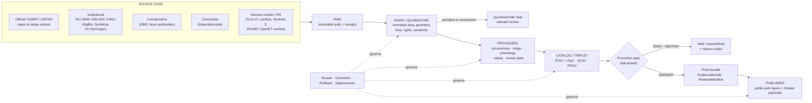

<!-- [KFM_META_BLOCK_V2]
doc_id: kfm://doc/REPLACE-WITH-UUID
title: Flora · Tracking (Time-Aware Monitoring of Plants)
type: standard
version: v0.1
status: draft
owners: TBD — Flora Steward, Governance Reviewer, Remote-Sensing Reviewer
created: 2026-05-07
updated: 2026-05-07
policy_label: public
related:
  - docs/domains/flora/README.md
  - docs/domains/flora/ARCHITECTURE.md
  - docs/domains/flora/PUBLICATION_AND_POLICY.md
  - docs/domains/flora/SOURCE_REGISTRY.md
  - docs/domains/flora/DATA_MODEL.md
  - docs/domains/flora/PIPELINES_AND_LIFECYCLE.md
  - docs/domains/flora/UI_AND_EVIDENCE_DRAWER.md
tags: [kfm, flora, tracking, phenology, monitoring, time-aware, biodiversity]
notes:
  - PROPOSED placement — `docs/domains/flora/tracking/` subfolder is not yet confirmed against a mounted repo or ADR.
  - All schema, policy, validator, and pipeline paths referenced here are PROPOSED in the Flora blueprint and UNKNOWN as repo implementation.
  - Replace `doc_id` UUID, owners, and any `TODO` badge targets before publishing.
[/KFM_META_BLOCK_V2] -->

# Flora · Tracking — Time-Aware Monitoring of Kansas Plants

> The Flora lane's **time-aware sub-surface**: phenology, condition, repeat occurrences, distribution shifts, invasive spread, and status changes — governed end-to-end with the rest of Flora.

<!-- Badges: replace TODO targets after the repo conventions and CI workflow IDs are confirmed. -->


**Status:** `draft` &middot; **Owners:** TBD &middot; **Truth posture:** evidence-first, cite-or-abstain, fail-closed.

**Quick jump:** [Scope](#1-scope) · [Repo fit](#2-repo-fit) · [Inputs](#3-accepted-inputs) · [Exclusions](#4-exclusions) · [Directory tree](#5-directory-tree-proposed) · [Quickstart](#6-quickstart) · [Lifecycle](#7-lifecycle--diagram) · [Object families](#8-object-families) · [Sensitivity](#9-sensitivity-and-public-safety) · [Sources](#10-candidate-sources) · [Validators & gates](#11-validators-and-fail-closed-gates) · [Tasks](#12-task-list--definition-of-done) · [FAQ](#13-faq) · [Appendix](#appendix)

---

## 1. Scope

> [!IMPORTANT]
> **What this folder is.** A focused entry point for everything in the Flora lane that is **time-aware** — i.e., where the meaning of a record depends on *when* it was observed, sensed, listed, or modeled. This is not a separate truth surface; it inherits Flora doctrine, identity, lifecycle, and policy.

Tracking covers, within the Flora lane:

- repeat **occurrences** and **survey/specimen** observations as they accumulate over time;
- **vegetation index / condition / phenology** products from remote sensing (windowed, masked, with explicit uncertainty);
- **range / distribution / suitability** surfaces and how they change between epochs;
- **invasive spread** surveillance from agency and community sources where rights and quality permit;
- **status, listing, and stewardship** changes (federal, state, conservation rank, KDWP SINC, NatureServe);
- **review, correction, supersession, and rollback** of any time-bound flora claim.

> [!NOTE]
> *Status:* **PROPOSED** — `docs/domains/flora/tracking/` as a subfolder is not yet pinned by an ADR. If the repo already concentrates time-aware Flora content into a single doc (for example `docs/domains/flora/PIPELINES_AND_LIFECYCLE.md` or `…/CURRENT_STATE.md`), this folder should either fold into it or be ratified by `ADR-flora-tracking-scope.md` before adding files.

[Back to top ↑](#flora--tracking--time-aware-monitoring-of-kansas-plants)

---

## 2. Repo fit

**Path basis (PROPOSED).** Per the Directory Rules, domain names belong under responsibility roots, not as root folders. The Flora lane lives under `docs/domains/flora/` (docs), `schemas/contracts/v1/domains/flora/` *or* `contracts/flora/` (schemas — schema-home **CONFLICTED**, ADR required), `policy/domains/flora/`, `tests/domains/flora/`, `data/raw/flora/ … data/published/flora/`, etc.

This README is the **navigation node** for the time-aware sub-area; it does not own canonical schemas, policy, or data.

| Direction       | Linked surface                                                                                              | Status      |
| --------------- | ----------------------------------------------------------------------------------------------------------- | ----------- |
| ⬆ Upstream doc  | [`docs/domains/flora/README.md`](../README.md) — lane entry point                                            | PROPOSED    |
| ⬆ Upstream doc  | [`docs/domains/flora/ARCHITECTURE.md`](../ARCHITECTURE.md) — full lane architecture                          | PROPOSED    |
| ↔ Sibling doc   | [`docs/domains/flora/PIPELINES_AND_LIFECYCLE.md`](../PIPELINES_AND_LIFECYCLE.md) — watchers and lifecycle    | PROPOSED    |
| ↔ Sibling doc   | [`docs/domains/flora/PUBLICATION_AND_POLICY.md`](../PUBLICATION_AND_POLICY.md) — rights/sensitivity gates    | PROPOSED    |
| ↔ Sibling doc   | [`docs/domains/flora/UI_AND_EVIDENCE_DRAWER.md`](../UI_AND_EVIDENCE_DRAWER.md) — Drawer / Focus payloads     | PROPOSED    |
| ⬇ Schemas       | `flora_phenology_condition_product`, `flora_range_map`, `flora_occurrence`, `flora_review_record`           | PROPOSED    |
| ⬇ Policy        | `policy/flora/sensitivity.rego`, `…/publish.rego`, `…/promotion.rego`, `…/review.rego`                       | PROPOSED    |
| ⬇ Pipelines     | `pipelines/flora/normalize_occurrences.py`, `…/dedupe_occurrences.py`, `…/build_catalog.py`                  | PROPOSED    |
| ⬇ Data lifecycle| `data/raw/flora/ → data/work/flora/ → data/processed/flora/{occurrences,range_maps,vegetation_index} → data/catalog/{stac,dcat,prov}/flora/ → data/proofs/flora/ → data/published/flora/` | PROPOSED |

[Back to top ↑](#flora--tracking--time-aware-monitoring-of-kansas-plants)

---

## 3. Accepted inputs

What this sub-area is willing to host, govern, and link out from:

- **Time-bound flora records** with explicit valid-time and as-of semantics: occurrences, specimens, survey/plot/photo vouchers, monitoring events.
- **Derived condition surfaces** — vegetation indices, phenology / greenness windows, fractional cover — *labeled* `derived_model` and *never* presented as observation.
- **Distribution and range** snapshots that carry their epoch, method, and source provenance.
- **Status, listing, and stewardship** changes that affect public eligibility (federal listing, KDWP SINC rank, NatureServe S-rank, cultural-sensitivity flags).
- **Review, correction, rollback, supersession** records that operate on any of the above.
- **Public-safe generalized** layers and summaries derived from internal precise data, with `redaction_receipt` lineage attached.

Each accepted input must arrive with: `source_id`, `source_role`, `rights_license_terms`, `sensitivity_posture`, `spatial_resolution`, `temporal_resolution`, `verification_status`, and `public_publication_eligibility` per the Flora source-descriptor contract.

[Back to top ↑](#flora--tracking--time-aware-monitoring-of-kansas-plants)

---

## 4. Exclusions

> [!WARNING]
> The following do **not** belong in `docs/domains/flora/tracking/`. Each exclusion exists to preserve a KFM invariant.

| Exclusion                                                                                  | Why                                                                                                                                  | Belongs in / under                                                                  |
| ------------------------------------------------------------------------------------------ | ------------------------------------------------------------------------------------------------------------------------------------ | ----------------------------------------------------------------------------------- |
| Fauna telemetry, animal movement, banding/ring data                                        | Wrong lane. Tracking here is **plant** time-aware monitoring.                                                                        | `docs/domains/fauna/…` (fauna_monitoring_event)                                     |
| Habitat unit definitions, ecosystem typologies                                             | These are habitat-lane primitives even when joined to flora.                                                                          | `docs/domains/habitat/…`                                                            |
| Raw datasets, fixtures, or schema files                                                    | Docs are not a data or schema home.                                                                                                   | `data/{raw,work,processed,…}/flora/`, `schemas/contracts/v1/domains/flora/`         |
| Live API endpoints, credentials, or controlled-source URLs                                 | Public docs must not surface controlled access paths.                                                                                 | Source registry (machine), secret store; never in docs.                             |
| Exact coordinates of rare, protected, or culturally sensitive flora                        | Default-deny exact public location for sensitive species (NatureServe S1/S2, KDWP SINC, steward-flagged).                              | Internal-only stores; public payloads carry generalized geometry only.              |
| AI-generated narratives without resolved EvidenceBundle and citations                      | AI is interpretive, not the truth source. Cite-or-abstain.                                                                            | Focus Mode answers must cite released evidence; otherwise ABSTAIN.                  |
| Implementation maturity claims ("the repo enforces…", "CI denies…") not currently verified | Repository is not mounted in this session; runtime/CI behavior is **UNKNOWN**.                                                        | Mark statements PROPOSED / UNKNOWN / NEEDS VERIFICATION until the repo is checked.  |

[Back to top ↑](#flora--tracking--time-aware-monitoring-of-kansas-plants)

---

## 5. Directory tree (PROPOSED)

> Convention check: the only file currently asserted to exist in this folder is **this `README.md`**. The rest is proposed and should be ratified by `ADR-flora-tracking-scope.md` before any files land.

```text
docs/domains/flora/
├── README.md                       # lane entry point (PROPOSED, see Flora blueprint)
├── ARCHITECTURE.md                 # full lane architecture (PROPOSED)
├── DATA_MODEL.md                   # object families, identity (PROPOSED)
├── PIPELINES_AND_LIFECYCLE.md      # watcher + lifecycle guide (PROPOSED)
├── PUBLICATION_AND_POLICY.md       # rights/sensitivity/publish rules (PROPOSED)
├── SOURCE_REGISTRY.md              # human source registry guide (PROPOSED)
├── UI_AND_EVIDENCE_DRAWER.md       # runtime / UI payload guide (PROPOSED)
├── VERIFICATION_BACKLOG.md         # open verification queue (PROPOSED)
└── tracking/                       # ← THIS FOLDER (PROPOSED)
    ├── README.md                   # this file — navigation + scope
    ├── PHENOLOGY_AND_CONDITION.md  # remote-sensing time-windowed products  (PROPOSED, P2)
    ├── REPEAT_OCCURRENCES.md       # re-survey / longitudinal occurrence streams (PROPOSED, P1)
    ├── RANGE_AND_DISTRIBUTION.md   # range-shift, suitability, epoch handling  (PROPOSED, P1)
    ├── INVASIVE_SPREAD.md          # invasive surveillance from agency + community (PROPOSED, P2)
    ├── STATUS_AND_LISTING.md       # listing/conservation-rank change tracking  (PROPOSED, P1)
    └── REVIEW_AND_ROLLBACK.md      # corrections, supersessions, rollbacks      (PROPOSED, P0)
```

[Back to top ↑](#flora--tracking--time-aware-monitoring-of-kansas-plants)

---

## 6. Quickstart

> [!TIP]
> All commands below are **illustrative**. Tool names follow the paths in the Flora blueprint and assume the schema-home, package manager, and CI runner from the active repo. They are **PROPOSED** until verified.

### 6.1 Read before you write

1. Read [`docs/domains/flora/ARCHITECTURE.md`](../ARCHITECTURE.md) — lane invariants and source-role discipline.
2. Read [`docs/domains/flora/PUBLICATION_AND_POLICY.md`](../PUBLICATION_AND_POLICY.md) — rights, sensitivity, and publication gates.
3. Skim [`docs/domains/flora/PIPELINES_AND_LIFECYCLE.md`](../PIPELINES_AND_LIFECYCLE.md) — what watchers do and do not do.

### 6.2 Add a time-aware flora source descriptor (fixture-first)

```bash
# 1) Author or update a descriptor in the source registry (machine-readable home).
$EDITOR data/registry/sources/flora/<source>.yaml          # PROPOSED path

# 2) Validate descriptors locally.
python tools/validators/flora/validate_source_descriptors.py    # PROPOSED tool

# 3) Run the no-live-network fixture pipeline (RAW → processed → catalog).
python pipelines/flora/fixture_pipeline.py                       # PROPOSED tool

# 4) Validate fixtures, taxa, geometry, rights, sensitivity, and catalog closure.
python tools/validators/flora/run_all.py                         # PROPOSED tool
```

### 6.3 Promote a tracking artifact

```bash
# Build catalog/proof objects for the candidate.
python pipelines/flora/build_catalog.py                          # PROPOSED tool

# Evaluate the promotion decision (fail-closed).
python tools/validators/flora/validate_release_manifest.py       # PROPOSED tool
# A missing review_record, missing rights, exact public sensitive geometry,
# or modeled-as-observed mismatch must DENY promotion.
```

> [!CAUTION]
> Never promote a `derived_model` (range / suitability / phenology) artifact whose payload omits a model card, evidence refs, mask/window metadata, or uncertainty fields. The `model_as_observation` reason code must DENY.

[Back to top ↑](#flora--tracking--time-aware-monitoring-of-kansas-plants)

---

## 7. Lifecycle — diagram



> Diagram basis: KFM lifecycle invariant `RAW → WORK/QUARANTINE → PROCESSED → CATALOG/TRIPLET → PUBLISHED` and Flora source-role taxonomy (`official`, `institutional`, `steward_reviewed`, `corroborative`, `community_observation`, `controlled_access`, `derived_model`, `generalized_public_surface`).

[Back to top ↑](#flora--tracking--time-aware-monitoring-of-kansas-plants)

---

## 8. Object families

These are the time-aware shapes the tracking sub-area exposes; canonical definitions live in the Flora schema wave (PROPOSED).

| Family                                  | Examples                                                                              | Knowledge character                       | Status   |
| --------------------------------------- | ------------------------------------------------------------------------------------- | ----------------------------------------- | -------- |
| Repeat occurrences                      | `flora_occurrence`, `occurrence_batch`, longitudinal joins by site/grid                | observed                                  | PROPOSED |
| Survey / specimen / plot / photo voucher| `specimen_record`, `plot_observation`, `photo_voucher`                                 | observed                                  | PROPOSED |
| Phenology / condition products          | `flora_phenology_condition_product`, vegetation indices, fractional cover              | derived (RS, with masks + uncertainty)    | PROPOSED |
| Range / distribution surfaces           | `flora_range_map`, `distribution_surface`, suitability epochs                          | derived (model card required)             | PROPOSED |
| Status / listing / rank                 | `status_assertion`, federal / state listing, NatureServe rank, KDWP SINC               | governance context                        | PROPOSED |
| Invasive spread evidence                | invasive observation streams, agency verification states                               | observed + verified                       | PROPOSED |
| Review / correction / rollback          | `review_record`, `correction_notice`, `rollback_card`, `supersession_link`             | governance transitions                    | PROPOSED |
| Generalized public-safe layers          | grid-binned occurrence layers, generalized range polygons                              | derived from internal precise data        | PROPOSED |

[Back to top ↑](#flora--tracking--time-aware-monitoring-of-kansas-plants)

---

## 9. Sensitivity and public safety

> [!CAUTION]
> **Default:** *do not* expose exact coordinates for rare, protected, or culturally sensitive flora. Prefer generalized geometry, withheld geometry, denied publication, staged access, or delayed publication. Preserve transform lineage in `redaction_receipt`s.

Triggers that flip a record into restricted handling include any of:

- NatureServe rank S1 or S2 (or jurisdictional equivalents);
- KDWP SINC sensitive listing;
- USFWS or state listing where the source mandates location protection;
- steward-flagged cultural sensitivity;
- controlled-access source terms (license / contract);
- georeferencing precision insufficient for the public claim being made.

Required behavior:

- **Internal vs public split.** Internal precise geometry stays behind governed API/access policy; public payloads carry only generalized or withheld geometry.
- **Receipts.** Every transform records `redaction_receipt` linking source record, transform, policy decision, reviewer/actor (where allowed), and output public geometry.
- **Reason codes.** `precise_sensitive_location_denied`, `controlled_access_publication_denied`, `unknown_rights`, `review_required`, `public_geometry_not_generalized`, `model_as_observation`, `ai_missing_evidence_bundle_or_citations`.

[Back to top ↑](#flora--tracking--time-aware-monitoring-of-kansas-plants)

---

## 10. Candidate sources

> Verify each candidate against current endpoints, rights, sensitivity, and update cadence before activation. All entries are **PROPOSED / NEEDS VERIFICATION**.

| Candidate source                                                                    | Source role                                              | Tracking value                                  |
| ------------------------------------------------------------------------------------ | -------------------------------------------------------- | ----------------------------------------------- |
| **KDWP** flora / listed-species status, range context, ESRT review outputs           | `official` / `steward_reviewed` / `controlled_access`    | Status & listing change; rare-flora oversight   |
| **Kansas Biological Survey** / **KU Biodiversity Institute** (incl. **McGregor Herbarium**, ~454k specimens cited in corpus) | `institutional` / `controlled_access` | Specimen-grade longitudinal evidence            |
| **FHSU Sternberg Museum**                                                            | `institutional`                                          | In-state collection of record                   |
| **USFWS ECOS** species & critical habitat for plants                                 | `official`                                               | Federal status / critical habitat context       |
| **NatureServe** / **NatureServe Explorer Pro**                                       | `institutional` / `controlled_access` / `derived_model`  | Conservation rank trajectory; modeled summaries |
| **GBIF** vascular plant occurrence (downloads / API)                                 | `corroborative`                                          | Aggregated occurrence with license & uncertainty|
| **iDigBio** specimen records · **Symbiota** portal aggregations                      | `institutional`                                          | Specimen catalog with georeference quality      |
| **iNaturalist**-style community observations                                         | `community_observation`                                  | Volume + quality grade with sensitivity filters |
| **USDA PLANTS** · **ITIS** · **WFO** · **POWO** taxon authorities                    | `official` / `institutional`                             | Identity over time, synonymy, valid-from/to     |
| **HLS-VI**, **Landsat**, **Sentinel-2** vegetation indices                           | `derived_model`                                          | Phenology / condition windows                   |
| **OpenET** (CC-BY-4.0)                                                               | `derived_model`                                          | ET-derived condition context                    |
| **RCMAP** 30 m fractional cover, 1985–2024                                           | `derived_model`                                          | 40-year ecosystem-trend depth                   |
| **Sentinel-2** fractional cover, 10 m, 2018–                                         | `derived_model`                                          | Higher-resolution recent trend                  |
| Habitat covariates: **NLCD**, **NWI**, **GAP**, **LANDFIRE**, soils, hydrology       | `derived_model` / `official`                             | Covariate joins (do not invert into truth)      |

[Back to top ↑](#flora--tracking--time-aware-monitoring-of-kansas-plants)

---

## 11. Validators and fail-closed gates

> Every check below is **PROPOSED** at the surface level shown here. Names and homes are subject to schema-home and runtime-framework ADRs.

| Validator / gate                          | Required check                                                                                              | Failure posture                |
| ----------------------------------------- | ----------------------------------------------------------------------------------------------------------- | ------------------------------ |
| Schema validity                           | Time-bound payloads validate against current schema and version                                              | ERROR / DENY promotion         |
| Provenance / EvidenceRef resolution       | `source_refs` and `evidence_refs` resolve to descriptors / EvidenceBundles                                   | ABSTAIN runtime · DENY release |
| Time semantics                            | Valid-time, as-of, and observation timestamp present and internally consistent                              | DENY                           |
| Geometry / CRS                            | Valid GeoJSON, declared CRS, recorded transforms                                                            | DENY · QUARANTINE              |
| Coordinate uncertainty / precision        | `coordinate_uncertainty_m` and georeference protocol present at the precision being claimed                 | DENY exact public sensitive    |
| Taxon normalization                       | Raw taxon text preserved; accepted taxon present where required                                              | DENY ambiguous identity        |
| Rights / license                          | License/terms/eligibility explicit; controlled-access obligations enforced                                  | ABSTAIN unknown · DENY restricted |
| Sensitivity leakage                       | No exact coordinates / restricted IDs / internal refs in public payloads                                    | DENY · emit redaction receipt  |
| Catalog matrix closure                    | STAC / DCAT / PROV / manifest / proofs / runtime refs close and digests align                                | DENY                           |
| EvidenceBundle integrity                  | Bundle ids, entries, checksums, sources, policy, review, claims coherent                                    | DENY / ERROR                   |
| Promotion candidate integrity             | Candidate has schema, catalog, policy, review, rights, sensitivity, proofs, rollback                        | DENY                           |
| API / Drawer / Focus payload integrity    | Finite outcome (`ANSWER` / `ABSTAIN` / `DENY` / `ERROR`); evidence; obligations; freshness; review; rights  | ERROR / ABSTAIN                |
| AI / Focus citation                       | Tracking answers must cite a released EvidenceBundle; ABSTAIN if insufficient                                | DENY uncited · ABSTAIN insufficient |

[Back to top ↑](#flora--tracking--time-aware-monitoring-of-kansas-plants)

---

## 12. Task list — definition of done

A `tracking/` doc or artifact is **done** when:

- [ ] Path placement is ratified by `ADR-flora-tracking-scope.md` (or this folder is folded into a sibling doc and this README is removed).
- [ ] Schema-home ADR (`ADR-flora-schema-home.md`) is merged before any new schema in this area is added.
- [ ] All time-aware schemas (`flora_phenology_condition_product`, `flora_range_map`, `flora_occurrence`, `flora_review_record`) have golden valid + invalid fixtures under `tests/fixtures/flora/`.
- [ ] Fail-closed validators (rights, sensitivity, geometry, taxon, catalog closure, EvidenceBundle, release manifest, API / Drawer / Focus payload) run green on fixtures.
- [ ] Sensitive-leak fixture (`tests/fixtures/flora/invalid/precise_sensitive_public_geometry.json`) **fails closed** in CI.
- [ ] Modeled-as-observed fixture (`tests/fixtures/flora/invalid/modeled_as_observed.json`) **fails closed** in CI.
- [ ] Public-safe MapLibre layers carry only generalized geometry and public-safe attributes; no exact coordinates, no restricted IDs, no internal refs.
- [ ] Evidence Drawer fixture renders claim, EvidenceBundle, source role, sensitivity, rights, review state, freshness, and corrections.
- [ ] Focus Mode fixture pair: `flora_focus_answer.json` (answer with citations) and `flora_focus_denied_sensitive.json` (DENY with reason code).
- [ ] Each linked sibling doc (`PHENOLOGY_AND_CONDITION.md`, `REPEAT_OCCURRENCES.md`, `RANGE_AND_DISTRIBUTION.md`, `INVASIVE_SPREAD.md`, `STATUS_AND_LISTING.md`, `REVIEW_AND_ROLLBACK.md`) exists or is explicitly deferred.
- [ ] `VERIFICATION_BACKLOG.md` is updated with any unresolved endpoint, rights, or cadence question.
- [ ] Rollback target is named in any release manifest produced under this sub-area.

[Back to top ↑](#flora--tracking--time-aware-monitoring-of-kansas-plants)

---

## 13. FAQ

> [!NOTE]
> **Why a `tracking/` folder under Flora and not a single `TRACKING.md`?**
> Because the time-aware surface spans several distinct concerns — phenology vs repeat occurrences vs range shift vs invasive spread vs status change vs review/rollback — that read better as siblings than as one long file. This is a **PROPOSED** organization; if the repo's established pattern keeps Flora docs flat, fold this back to a single `TRACKING.md`.

> [!NOTE]
> **Is a phenology product an observation?**
> No. Vegetation indices, fractional cover, and phenology windows are `derived_model` artifacts. They require a model card, masks, windows, uncertainty, and explicit lineage. Treating them as observations is a **DENY** with reason code `model_as_observation`.

> [!NOTE]
> **Why is a community observation accepted but a community summary not?**
> The atomic record from a community source can be ingested with quality labels and license capture. A community **summary** that is not anchored to released, cited evidence is interpretive and must ABSTAIN unless cited.

> [!NOTE]
> **Why does the public layer not show exact rare-plant points?**
> Geoprivacy. Rare, protected, and culturally sensitive flora default to generalized or withheld geometry; exact coordinates remain behind governed access. Lineage of every transform is recorded in a `redaction_receipt`.

> [!NOTE]
> **Where does AI fit?**
> Below evidence. AI may summarize or explain a tracking claim **only** when it cites a released EvidenceBundle. Otherwise it must ABSTAIN. Fluent text is never a substitute for evidence, policy, review, or release state.

[Back to top ↑](#flora--tracking--time-aware-monitoring-of-kansas-plants)

---

## Appendix

<details>
<summary><strong>A. Truth labels used in this doc</strong></summary>

| Label              | Meaning                                                                                          |
| ------------------ | ------------------------------------------------------------------------------------------------ |
| CONFIRMED          | Verified in this session from attached docs, workspace evidence, or generated artifacts.         |
| PROPOSED           | Design / placement / inference not yet verified in repo implementation.                          |
| UNKNOWN            | Not verifiable in this session (e.g. no mounted repo, no CI logs).                                |
| NEEDS VERIFICATION | Checkable but not yet checked strongly enough to act as fact.                                     |

</details>

<details>
<summary><strong>B. Evidence basis (high-level)</strong></summary>

- **Doctrine (CONFIRMED in this session via attached corpus):** KFM Components Pass 10 — Idea Index, Category Atlas, and Expansion Dossier; KFM Directory Rules; KFM Flora Architecture PDF-Only Implementation Blueprint; KFM Habitat + Fauna lineage where it intersects flora.
- **Repository state (UNKNOWN):** no mounted Kansas-Frontier-Matrix Git repository was available to this session. All path / schema / policy / pipeline / CI / API references in this README are PROPOSED until verified against the actual repo.
- **External research:** none used to override project doctrine in this draft.

</details>

<details>
<summary><strong>C. Open questions / verification backlog</strong></summary>

- ADR: confirm or deny `docs/domains/flora/tracking/` as a subfolder vs single doc (`TRACKING.md`).
- ADR: schema home — `schemas/contracts/v1/domains/flora/` vs `contracts/flora/` (`ADR-flora-schema-home.md`).
- Verify current endpoints, rights, and update cadence for each candidate source in §10.
- Confirm whether the repo already exposes shared `EvidenceBundle`, `DecisionEnvelope`, `RunReceipt`, `ReleaseManifest`, `CatalogMatrix` objects to reuse.
- Confirm CI workflow IDs and badge targets for the badges at the top of this file.
- Confirm owners (Flora steward, governance reviewer, remote-sensing reviewer) and update the `owners` field in the meta block.

</details>

<details>
<summary><strong>D. Glossary (lane shorthand)</strong></summary>

- **EvidenceBundle / EvidenceRef** — content-addressed evidence object; refs resolve to bundles before claims are made.
- **DecisionEnvelope** — finite outcome wrapper: `ANSWER` / `ABSTAIN` / `DENY` / `ERROR`, with reasons, obligations, evidence, policy.
- **Run receipt / spec_hash** — process memory + deterministic identity for fetch / normalize / validate runs.
- **RedactionReceipt** — transform record for any geoprivacy / generalization / withholding step.
- **STAC × DwC** — STAC item profile that carries Darwin Core terms under a `taxon` object for biodiversity payloads.
- **Source role** — first-class authority boundary: `official` / `institutional` / `steward_reviewed` / `corroborative` / `community_observation` / `controlled_access` / `derived_model` / `generalized_public_surface`.

</details>

[Back to top ↑](#flora--tracking--time-aware-monitoring-of-kansas-plants)
