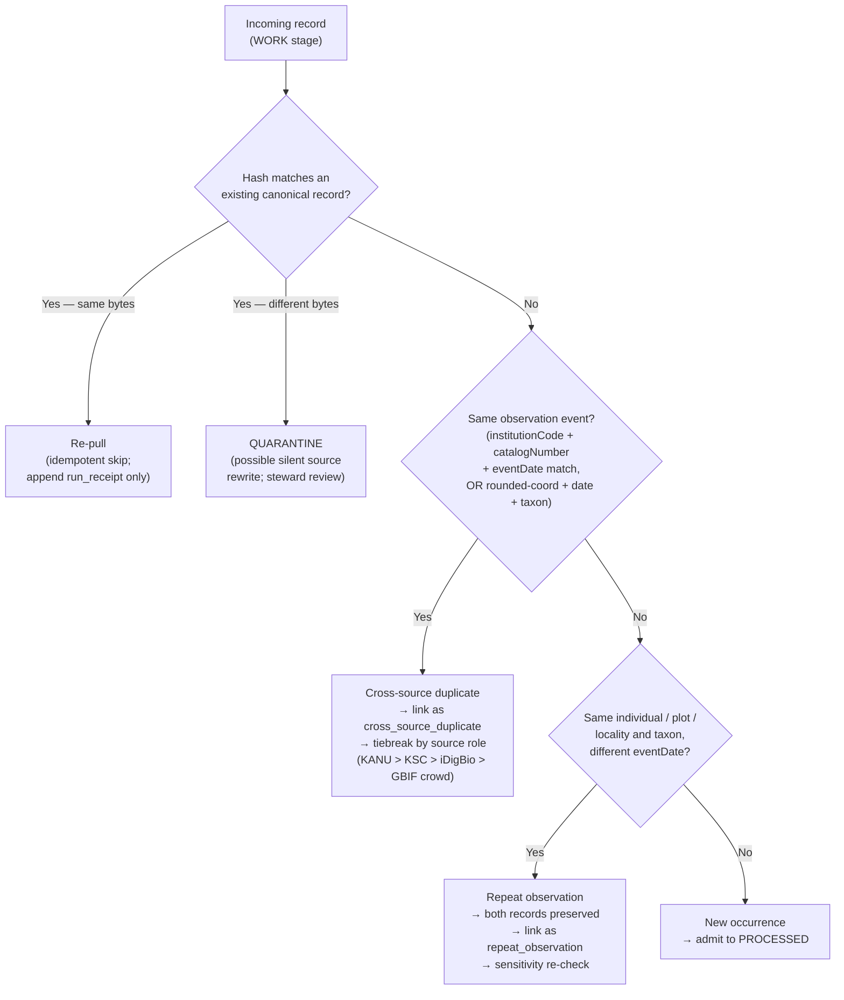

<!-- [KFM_META_BLOCK_V2]
doc_id: kfm://doc/flora-repeat-occurrences-v0-1
title: Flora — Repeat Occurrences
type: standard
version: v0.1
status: draft
owners: <flora-steward — TBD>
created: 2026-05-08
updated: 2026-05-08
policy_label: public
related:
  - docs/domains/flora/README.md
  - docs/domains/flora/DATA_MODEL.md
  - docs/domains/flora/PIPELINES_AND_LIFECYCLE.md
  - docs/domains/flora/PUBLICATION_AND_POLICY.md
  - docs/domains/flora/SOURCE_REGISTRY.md
  - docs/domains/flora/VERIFICATION_BACKLOG.md
  - docs/domains/flora/adr/ADR-flora-source-roles.md
  - docs/domains/flora/adr/ADR-flora-sensitive-location-policy.md
tags: [kfm, flora, tracking, occurrences, identity, dedupe, time-semantics]
notes:
  - "Placement under docs/domains/flora/tracking/ is PROPOSED — no `tracking/` subfolder exists in the Flora blueprint's proposed doc tree. See `Repo Fit` for alternatives and the ADR requirement."
  - "Late-arrival policy is UNKNOWN per the corpus (A.2.13). Tracked in `Open Questions` and `Verification Backlog`."
  - "All schema names, paths, and field lists in this document are PROPOSED until verified against the actual repository."
[/KFM_META_BLOCK_V2] -->

# Flora — Repeat Occurrences

Governance, identity, and time-model rules for **repeated plant observations** — distinguishing
re-observations of the same individual, plot, or locality from **cross-source duplicates** of
the same observation event, and from **re-pulls** of the same source record.

> [!IMPORTANT]
> A repeat is **not** a duplicate. A duplicate is the same observation captured by two sources;
> a repeat is two distinct observations that share an individual, plot, locality, or taxon. KFM
> must preserve both as separate, evidence-bearing records and link them through a governed
> relationship — never collapse them.

<!-- BADGES: targets are placeholders. Replace once CI workflow names, branch protection rules, and ADR IDs are confirmed. -->


**Quick jump:** [Scope](#scope) · [Repo fit](#repo-fit) · [Core distinction](#core-distinction-repeat-vs-duplicate-vs-re-pull) ·
[Time model](#time-model-alignment) · [Identity rules](#identity-rules) · [Object & link model](#object-and-link-model-proposed) ·
[Lifecycle placement](#lifecycle-placement) · [Cross-source dedupe](#cross-source-dedupe-matrix) ·
[Sensitivity](#sensitivity-and-rights-implications) · [Validators & gates](#validators-and-gates-expected) ·
[Open questions](#open-questions) · [Verification backlog](#verification-backlog) ·
[Related docs](#related-docs) · [Changelog](#changelog)

---

## Scope

This document governs how the Flora lane treats records that **recur** across:

- **Time** — the same individual, plot, or locality observed on different `eventDate`s.
- **Sources** — the same observation event re-published by a second source (mirror, aggregator, replicated specimen).
- **Pulls** — the same source record returned again by a later watcher run (idempotent re-fetch).
- **Lineage** — the same accepted taxon at the same geometry across taxonomic renames or descriptor revisions.

It does **not** govern:

- Plant **community** or **vegetation class** re-mapping (see `DATA_MODEL.md` → community objects).
- **Phenology / vegetation index** time-series products (see `flora_phenology_condition_product` schema, P2).
- **Range** or **suitability** model updates — these are derived surfaces, not occurrences.
- **Correction / supersession** of a previously released occurrence — see `PUBLICATION_AND_POLICY.md` and the
  `correction_notice` / `rollback_card` objects.

> [!NOTE]
> Repeats are an **observation-layer** concern. Derived layers (range maps, suitability, phenology
> products) draw on the underlying occurrences but follow their own governance and may not
> import repeat-handling decisions implicitly.

[Back to top](#flora--repeat-occurrences)

---

## Repo fit

**Status — PROPOSED placement.** The Flora architecture blueprint enumerates a flat doc tree under
`docs/domains/flora/` plus `adr/` and `runbooks/` subfolders. It does **not** establish a `tracking/`
subdirectory. Three placement options are on the table:

| Option | Path | Tradeoff | Status |
|---|---|---|---|
| A — User-specified path | `docs/domains/flora/tracking/REPEAT_OCCURRENCES.md` | Keeps related "tracking" topic docs together (idempotency, late arrival, dedupe) | **PROPOSED** — requires `ADR-flora-doc-subfolders.md` to legitimize the `tracking/` subdirectory |
| B — Flat alongside other topic docs | `docs/domains/flora/REPEAT_OCCURRENCES.md` | Matches the Flora blueprint's proposed flat tree; no new convention | **PROPOSED** — minimum-change option |
| C — Distributed across existing docs | Sections in `DATA_MODEL.md` + `PIPELINES_AND_LIFECYCLE.md` | No new file, but loses focused governance lens | **PROPOSED** — viable if the topic stays small |

This document was authored at **Option A** at the user's explicit request. **Until an ADR establishes
the `tracking/` subfolder, treat its existence as PROPOSED.**

**Directory Rules basis.** Root folders are authority boundaries, not topic buckets. The same
principle applies recursively inside `docs/domains/<domain>/`: subfolders should carry a stated
governance role, not a convenience grouping. A `tracking/` subfolder is defensible if it
consolidates **observation-recurrence governance** (this doc, plus probable companions on
idempotency, late arrival, and cross-source dedupe), but the subfolder must be declared in an ADR.

**Upstream inputs**

- `docs/domains/flora/ARCHITECTURE.md` — lane mission, scope, object families.
- `docs/domains/flora/DATA_MODEL.md` — `flora_occurrence`, `specimen_record`, identity rules.
- `docs/domains/flora/PIPELINES_AND_LIFECYCLE.md` — RAW → PROCESSED → PUBLISHED, watcher behavior.
- Source-level guidance from `KFM Components Pass 11 / A.2.2` (Kansas flora watcher) and
  `A.2.1` (Kansas biodiversity ETL) — cross-source dedupe primary key and rounded-coordinate fallback.

**Downstream dependents**

- Pipeline modules: `pipelines/flora/dedupe_occurrences.py`, watcher diff/idempotency logic.
- Schema home (PROPOSED): `flora_occurrence.schema.json`, `flora_occurrence_batch.schema.json`,
  and a candidate `flora_occurrence_link.schema.json` for repeat/duplicate linkage.
- Policy: `policy/flora/sensitive_repeat_at_known_location.rego` (PROPOSED).
- Evidence Drawer / Focus Mode payload behavior when a feature has multiple linked observations.

[Back to top](#flora--repeat-occurrences)

---

## Accepted inputs

What this doc legitimately governs:

- Two or more **`flora_occurrence`** records that **share** taxon and geometry within a tolerance.
- Specimen records (`specimen_record`, `herbarium_sheet`) that may correspond to the same physical
  collection event recorded across more than one institutional source.
- Plot observations (`plot_observation`) at a returning monitoring site.
- Photo vouchers (`photo_voucher`) of the same individual taken on different `eventDate`s.

## Exclusions

What does **not** belong in this doc:

| Out of scope | Where it lives |
|---|---|
| Taxon synonymy / naming changes | `flora_taxon_crosswalk.schema.json` and `DATA_MODEL.md` |
| Vegetation community re-mapping | `flora_plant_community.schema.json` (P1) |
| Phenology time series | `flora_phenology_condition_product.schema.json` (P2) |
| Public correction / withdrawal of an already-released occurrence | `correction_notice`, `rollback_card`, `PUBLICATION_AND_POLICY.md` |
| Cross-domain re-observation (e.g., a flora taxon also referenced in habitat or agriculture lanes) | Owning lane retains authority; flora cross-references through `flora_habitat_association` |

[Back to top](#flora--repeat-occurrences)

---

## Core distinction: repeat vs duplicate vs re-pull

The most consequential definitional move in this document. Three superficially similar phenomena
must remain governed as distinct cases:

| Case | What is shared | What differs | Correct disposition |
|---|---|---|---|
| **Repeat occurrence** | Same individual / plot / locality / taxon | Distinct observation event (different `eventDate`, possibly different observer / method / source) | **Preserve both** as separate `flora_occurrence` records; link via a `flora_occurrence_link` of type `repeat_observation`; lineage chain is auditable. |
| **Cross-source duplicate** | Same observation event (same `(institutionCode, catalogNumber, eventDate)` or rounded-coordinate + date + taxon) reported by ≥2 sources | The source, license, and rights metadata may differ | **Designate one canonical record** by source-role precedence (specimen-backed > crowd); preserve the other(s) as `flora_occurrence_link` of type `cross_source_duplicate`; carry the strongest evidence chain forward. |
| **Re-pull of the same record** | Same source record returned again by a later watcher run | Only metadata (retrieval timestamp, ETag) differs | **Idempotent skip**: the canonical record's identity hash does not change; emit a `run_receipt` entry but no new processed object. Mismatched bytes ⇒ quarantine for review (potential silent source rewrite). |



> [!CAUTION]
> Collapsing repeats into duplicates **destroys evidence**. A second observation of the same
> individual six years later is independent corroboration — sometimes the only signal that a
> rare plant is still present. It must not be discarded as a "duplicate" because the geometry
> rounds to the same cell.

[Back to top](#flora--repeat-occurrences)

---

## Time model alignment

Repeats are a temporal phenomenon. The KFM Build Companion's seven-time model applies in full;
each linked observation in a repeat chain carries its own complete time vector.

| Time field | Per-observation? | Per-link? | Notes |
|---|---|---|---|
| `valid_time` | ✅ each observation | n/a | When the assertion (plant present at this place) is held to apply. |
| `observed_time` / `eventDate` | ✅ each observation | n/a | Distinguishes observations along the chain. |
| `source_time` | ✅ each observation | n/a | The source's record creation/update time; differs per source. |
| `retrieval_time` | ✅ each observation | n/a | Watcher pull timestamp; never used as evidence of real-world condition. |
| `process_time` | ✅ each observation | n/a | KFM ETL timestamp. |
| `release_time` | ✅ each observation | ✅ link | A repeat link is itself a release-bearing object. |
| `correction_time` | ✅ if applicable | ✅ if applicable | Repeat chains can be corrected (e.g., reclassifying an apparent repeat as a duplicate or vice versa). |

> [!IMPORTANT]
> **Repeat links are time-bearing governance objects, not metadata annotations.** A change to
> a repeat link is itself a reviewable, auditable transition with its own `valid_time`, evidence,
> and supersession chain. Silent overwriting of a repeat link is a governance violation.

[Back to top](#flora--repeat-occurrences)

---

## Identity rules

Anchored to the Flora blueprint's deterministic-identity table.

| Object | Identity rule | Repeat-handling consequence |
|---|---|---|
| `flora_occurrence.occurrence_id` | Source-native ID preferred; deterministic fallback hashes `source_id`, `source_record_id`, `eventDate`, normalized geometry, and taxon. | **Each observation in a repeat chain has its own `occurrence_id`.** Identity does not collapse across `eventDate`. |
| `taxon_id` | Authority-derived; provisional deterministic key otherwise. | Taxon renames do not split a repeat chain — the chain is anchored on individual/plot/locality identity, not on volatile naming. |
| `taxon_crosswalk_id` | Hash over `(authority, raw_name, accepted_taxon_id, validity interval)`. | A rename across the chain is recorded as a crosswalk transition, not as a chain break. |
| `flora_occurrence_link.link_id` (PROPOSED) | Hash over `(link_type, ordered occurrence_ids, evidence_refs, valid_time)`. | New link instances per substantive change; supersession chain preserved. |
| `spec_hash` | SHA-256 over canonical (RFC 8785 JCS) JSON of schema/spec/process identity, **excluding** retrieval timestamps. | A re-pull producing identical canonical bytes does **not** advance `spec_hash`. |
| `content_hash` | SHA-256 over artifact bytes. | A re-pull with mismatched bytes triggers QUARANTINE. |

**Hard rule.** No two distinct observation events share a single `occurrence_id`. If a watcher
emits two records that hash to the same `occurrence_id` and are not bytewise-identical, the record
is sent to QUARANTINE with a `quarantine_record.reason = identity_collision` for steward review.

[Back to top](#flora--repeat-occurrences)

---

## Object and link model (PROPOSED)

The Flora schema wave (Section 10 of the blueprint) does not currently include a dedicated link
schema for repeats. The minimum proposal:

### `flora_occurrence_link` (PROPOSED — P1, schema home pending `ADR-flora-schema-home`)

| Field | Type | Required | Notes |
|---|---|---|---|
| `link_id` | string (URI) | ✅ | `kfm://flora/occurrence-link/sha256:<hash>` |
| `link_type` | enum | ✅ | `repeat_observation` \| `cross_source_duplicate` \| `re_pull_idempotent` |
| `members` | array of `occurrence_id` | ✅ | Two or more members. Order is meaningful for `repeat_observation` (chronological by `observed_time`). |
| `relation_basis` | enum | ✅ | `shared_individual` \| `shared_plot` \| `shared_locality_within_uncertainty` \| `shared_event_key` \| `shared_bytes` |
| `tolerance` | object | conditional | Required when `relation_basis` is `shared_locality_within_uncertainty`; carries radius (m), `coordinateUncertaintyInMeters` ceiling, and CRS. |
| `canonical_member` | `occurrence_id` | conditional | Required when `link_type = cross_source_duplicate`; resolved by source-role tiebreaker. |
| `tiebreak_rule` | string | conditional | Names the tiebreak policy version applied (see `Cross-source dedupe matrix`). |
| `valid_time` | object | ✅ | `{ from, to }` for the link's claim. |
| `source_refs` | array | ✅ | `SourceDescriptor` references for each member's source. |
| `evidence_refs` | array | ✅ | Resolves to `EvidenceBundle` at release time. |
| `review_state` | enum | ✅ | `system_inferred` \| `steward_confirmed` \| `steward_reclassified` \| `steward_split` |
| `policy_decision_ref` | string | conditional | Required when sensitivity policy escalation applies (see below). |
| `superseded_by` | `link_id` | optional | Supersession chain for corrected links. |
| `spec_hash` | string | ✅ | Schema/process identity. |

> [!NOTE]
> The two existing flora schemas closest to this object are `flora_occurrence.schema.json`
> (atomic occurrence) and `flora_occurrence_batch.schema.json` (manifest). Neither is a link
> object. If a shared cross-domain `RelationEdge` schema already exists in the repo, prefer
> reusing it; otherwise this remains a flora-local schema until governance promotes it.

### Boundaries against existing object families

| Existing object | What it does | Why it is NOT a substitute for `flora_occurrence_link` |
|---|---|---|
| `flora_taxon_crosswalk` | Bridges names across authorities | Taxonomic identity, not occurrence recurrence |
| `flora_habitat_association` | Links taxon/occurrence to habitat | Cross-lane evidence, not repeat governance |
| `correction_notice` / `supersession_link` | Public corrections after release | Post-release governance; repeats happen pre-release in the WORK/PROCESSED stages |
| `redaction_receipt` | Geoprivacy transform record | Sensitivity transform receipt, not a repeat link |

[Back to top](#flora--repeat-occurrences)

---

## Lifecycle placement

Repeat detection runs in **WORK / QUARANTINE**, never in PUBLISHED.

| Stage | What happens to repeat candidates | Fail-closed conditions |
|---|---|---|
| **SOURCE EDGE** | Source descriptor probed; ETag/Last-Modified captured for re-pull detection. | Unknown rights; unverified controlled source. |
| **RAW** | Immutable raw pull stored; no link logic yet. | Bytes mismatch from a prior identical-key pull → QUARANTINE before WORK. |
| **WORK** | Normalize Darwin Core; compute `occurrence_id`; apply the [decision flow](#core-distinction-repeat-vs-duplicate-vs-re-pull); emit candidate links. | Identity collision; ambiguous taxon; missing `eventDate`; missing geometry; missing `coordinateUncertaintyInMeters` when fallback dedupe is required. |
| **QUARANTINE** | Ambiguous repeats (e.g., same individual claim with conflicting taxon) wait for steward review. | TTL expiry without resolution → demote and notify. |
| **PROCESSED** | Confirmed `flora_occurrence` records and their `flora_occurrence_link` siblings emitted with `evidence_refs`. | Schema failure; missing `evidence_refs`; missing `spec_hash`. |
| **CATALOG / TRIPLET** | Links projected into PROV lineage and (optional) graph projection. | Catalog matrix open; graph claim not tied to evidence. |
| **PUBLISHED** | Public payloads expose repeat chains only at the public-safe geometry tier; sensitive repeat patterns may be suppressed. | Exact sensitive geometry leakage; raw stage referenced from public payload. |

**Where artifacts land** (PROPOSED, anchored to the Flora blueprint's lifecycle layout):

```
data/raw/flora/<source>/<timestamp>/
data/work/flora/<run_id>/repeat_candidates.parquet
data/quarantine/flora/<run_id>/identity_collision/
data/processed/flora/occurrences/<spec_hash>/
data/processed/flora/occurrence_links/<spec_hash>/    # PROPOSED — pending schema-home ADR
data/catalog/{stac,dcat,prov}/flora/
data/receipts/flora/<run_id>/dedupe_report.json
data/proofs/flora/<release>/evidence_bundle.json
data/published/flora/{layers,geojson,manifests}/
```

[Back to top](#flora--repeat-occurrences)

---

## Cross-source dedupe matrix

Anchored to the Kansas flora watcher (A.2.2) and Kansas biodiversity ETL (A.2.1) recipes.

**Primary dedupe key:** `(institutionCode, catalogNumber, eventDate)`.
**Fallback dedupe key:** `(rounded coordinate, eventDate, accepted_taxon_id)`,
where rounding precision is governed by `coordinateUncertaintyInMeters` and the configured
sensitive-taxa coarsening rule.

### Tiebreak (`canonical_member` selection)

> [!NOTE]
> Tiebreak honors **specimen-backed primacy**. The corpus identifies `KANU > KSC > iDigBio > GBIF crowd`
> for Kansas flora but does **not** fully specify deterministic tiebreakers across all source
> pairings. Anything beyond the named ordering is **PROPOSED** and pending an ADR.

| Tier | Source role | Examples |
|---|---|---|
| 1 | `institutional` (specimen-backed) | KU R.L. McGregor Herbarium (KANU), Kansas State University Herbarium (KSC) |
| 2 | `institutional` (specimen aggregator) | iDigBio specimen records |
| 3 | `corroborative` (mixed observation aggregator) | GBIF occurrences |
| 4 | `community_observation` | iNaturalist-derived data, after license/quality filters |

**Within-tier tiebreak (PROPOSED):**

1. Greater `coordinateUncertaintyInMeters` precision (smaller uncertainty wins).
2. Earlier `source_time` (the originating record, not the latest mirror).
3. Stronger license (CC0 > CC-BY-4.0 > permissive > restricted).
4. Stable lexicographic order on `source_id` as last resort.

The chosen tiebreak rule version is recorded on every `flora_occurrence_link` of type
`cross_source_duplicate` via the `tiebreak_rule` field.

### Conflict modes worth quarantining

| Conflict | Why quarantine | Reviewer disposition |
|---|---|---|
| Primary key matches but taxa differ | Source-side identification disagreement | Steward review; possibly split into two non-duplicate occurrences |
| Fallback key matches but `coordinateUncertaintyInMeters` differs by orders of magnitude | One source's geometry is far less precise; conflation would falsify precision | Prefer the more precise source as canonical; record both in evidence |
| Primary key matches but `basisOfRecord` disagrees (e.g., `PreservedSpecimen` vs `HumanObservation`) | The corpus warns the observation/specimen boundary is "not always crisp at the record level" | Steward review; specimen-backed wins by doctrine |
| Cultivated/captive flag set on one side only | Cultivated occurrences should not enter public wild-population layers without review | Quarantine; route through cultivated-vs-wild policy |

[Back to top](#flora--repeat-occurrences)

---

## Sensitivity and rights implications

A repeat at a **sensitive locality** is more sensitive than the original — successive observations
confirm persistence and can de-anonymize generalized public layers. Repeat handling must therefore
trigger sensitivity re-evaluation, not inherit the prior decision.

> [!WARNING]
> **Repeat-confirmation effect.** Two coarse observations published independently can, when
> linked, narrow a rare plant's location far below the protective resolution of either alone.
> Public-layer repeat exposure for `sensitivity:restricted` taxa **fails closed** by default.
> Approval requires a `policy_decision_ref` and a documented `redaction_receipt` covering the
> linked product, not just the individual records.

### Sensitivity escalation rules (PROPOSED)

| Member sensitivity | Link type | Default disposition |
|---|---|---|
| All `public` | any | Public-layer publication permitted under normal policy |
| Mixed `public` + `restricted` | `cross_source_duplicate` | Canonical = the more permissive license **only if** the locality is not sensitive; otherwise inherit `restricted` and apply geoprivacy generalization to the link's public projection |
| Mixed `public` + `restricted` | `repeat_observation` | Inherit `restricted` for the linked product; generalize public geometry to coarser cell; record `redaction_receipt` |
| All `restricted` | any | Internal-only by default; public exposure requires explicit `policy_decision_ref` and steward review |
| Any member with `cultivated_flag = true` | any | Exclude from wild-occurrence public layers; permit on cultivated/restoration layers if scope allows |
| Any member from a `controlled_access` source (e.g., NatureServe) | any | Distribution governed by the source's terms; the link itself may be internal-only even if other members are public |

### Rights propagation

- The link object **inherits the strictest** rights constraint among its members for any
  derivative product.
- License attributions for **every** member must propagate end-to-end to the Evidence Drawer
  payload — repeat governance is not a pretext to drop attribution.
- An `EvidenceBundle` published for a repeat-derived layer must resolve **all** member
  `EvidenceRef`s, not just the canonical member.

[Back to top](#flora--repeat-occurrences)

---

## Validators and gates expected

> [!NOTE]
> Validator and policy file **paths and names below are PROPOSED**. They follow the Flora
> blueprint's pattern (`tools/validators/flora/*`, `policy/flora/*.rego`) and the build
> companion's "policy-significant logic in policy bundles, not workflow YAML" principle.
> Final paths require ADR-flora-schema-home and a confirmed real-repo layout.

### Schema-level (must be deterministic; no policy logic)

| Validator (PROPOSED path) | Checks |
|---|---|
| `tools/validators/flora/validate_occurrence_link.py` | `flora_occurrence_link` shape; ≥2 members; member `occurrence_id`s exist; `link_type` matches `relation_basis`; tolerance present when geometry-fallback is used |
| `tools/validators/flora/validate_occurrence_id_collision.py` | No two distinct events share an `occurrence_id`; QUARANTINE on collision |
| `tools/validators/flora/validate_dedupe_keys.py` | Primary key `(institutionCode, catalogNumber, eventDate)` and fallback `(rounded coordinate, eventDate, accepted_taxon_id)` derivable for every PROCESSED record |
| `tools/validators/flora/validate_repull_idempotency.py` | A re-pull producing identical canonical bytes does not advance `spec_hash` and does not emit a new processed object |

### Policy gates (fail-closed; emit `DecisionEnvelope`)

| Policy file (PROPOSED path) | Decision |
|---|---|
| `policy/flora/repeat_at_sensitive_locality.rego` | DENY or REDACT public projection of any link whose union of member geometries falls within a sensitive-taxa buffer |
| `policy/flora/cross_source_duplicate_tiebreak.rego` | Resolve `canonical_member` by source-role tier and within-tier rules; ABSTAIN with steward routing on ties not covered by the rule version |
| `policy/flora/cultivated_in_repeat.rego` | Exclude repeat chains containing a cultivated record from wild-occurrence public layers |
| `policy/flora/license_propagation.rego` | Verify every member license is preserved in the link's `EvidenceBundle` |

### Promotion gate dependencies

A flora release that includes repeat-derived products must pass the seven Flora promotion gates
(A–G) plus the link-specific gates above. Specifically:

- **Gate F (deduplication across sources)** — the corpus already requires this; this document
  scopes the gate to also cover `flora_occurrence_link` emission.
- **Gate G (Evidence Drawer renders correctly)** — repeat chains must render with all member
  attributions and the link's review state.

[Back to top](#flora--repeat-occurrences)

---

## Open questions

> [!IMPORTANT]
> Each item below is **UNKNOWN** or **NEEDS VERIFICATION** at the time of writing. They are
> tracked here verbatim and mirrored into `docs/domains/flora/VERIFICATION_BACKLOG.md`.

1. **Late-arrival policy (UNKNOWN — corpus A.2.13).** When a record dated 2018 arrives in 2026,
   does it retroactively form a repeat link with already-released 2018-dated occurrences? Does
   the linked product re-release, supersede, or remain frozen?
2. **NatureServe distribution boundary (UNKNOWN).** Where in the lifecycle do NatureServe-derived
   members of a repeat chain sit, and under what terms can the chain be published when one
   member is `controlled_access`?
3. **Cross-snapshot taxonomy renames (UNKNOWN — corpus A.2.6).** When a USDA PLANTS symbol's
   accepted scientific name changes between snapshots, does an existing repeat chain remain
   intact, fork, or require steward re-confirmation?
4. **Within-tier deterministic tiebreak (PROPOSED).** The named ordering
   `KANU > KSC > iDigBio > GBIF crowd` is doctrinal; the within-tier rules in the table above
   are PROPOSED until adopted in an ADR.
5. **Rounded-coordinate fallback granularity (NEEDS VERIFICATION).** The fallback dedupe rounds
   coordinates, but the precision (decimal places vs. fixed cell size) and its interaction with
   `coordinateUncertaintyInMeters` need to be pinned in `flora_occurrence.schema.json`.
6. **Plot identity beyond Darwin Core (NEEDS VERIFICATION).** Permanent monitoring plots have a
   `plotID` semantics not standardized in DwC. The `flora_occurrence_link.relation_basis = shared_plot`
   case requires a stable plot identity registry; the corpus does not define one.
7. **Bitemporal repeat history (PROPOSED).** Should `flora_occurrence_link` carry a transaction-time
   axis in addition to `valid_time`, to preserve "what KFM thought yesterday about this chain"?
   The Build Companion's bitemporal acceptance test is permissive but unspecified for flora.

[Back to top](#flora--repeat-occurrences)

---

## Verification backlog

| ID | Item | Status | Owner | Resolves to |
|---|---|---|---|---|
| FRO-V1 | Confirm `tracking/` subdirectory placement via ADR | NEEDS VERIFICATION | flora-steward + docs | `ADR-flora-doc-subfolders.md` |
| FRO-V2 | Pin `flora_occurrence_link.schema.json` home | PROPOSED | flora-steward | `ADR-flora-schema-home.md` |
| FRO-V3 | Resolve late-arrival re-release behavior | UNKNOWN | flora-steward + release | New ADR; updates to `PIPELINES_AND_LIFECYCLE.md` |
| FRO-V4 | Pin within-tier tiebreak rule version | PROPOSED | flora-steward | `policy/flora/cross_source_duplicate_tiebreak.rego` |
| FRO-V5 | Define plot identity for monitoring plots | NEEDS VERIFICATION | flora-steward + habitat | Plot identity registry; cross-lane crosswalk |
| FRO-V6 | Verify `coordinateUncertaintyInMeters` rounding rule | NEEDS VERIFICATION | flora-steward | `flora_occurrence.schema.json` |
| FRO-V7 | Add fixture: same individual, two `eventDate`s, one source | PROPOSED | flora-steward + tests | `tests/fixtures/flora/valid/repeat_observation.json` |
| FRO-V8 | Add fixture: cross-source duplicate, KANU + GBIF | PROPOSED | flora-steward + tests | `tests/fixtures/flora/valid/cross_source_duplicate.json` |
| FRO-V9 | Add fixture: re-pull idempotent | PROPOSED | flora-steward + tests | `tests/fixtures/flora/valid/repull_idempotent.json` |
| FRO-V10 | Add negative fixture: identity collision quarantine | PROPOSED | flora-steward + tests | `tests/fixtures/flora/invalid/identity_collision.json` |
| FRO-V11 | Wire repeat sensitivity policy into Evidence Drawer payload contract | PROPOSED | flora-steward + UI | `flora_evidence_drawer_payload.schema.json` |
| FRO-V12 | NatureServe distribution boundary for repeat chains | UNKNOWN | flora-steward + policy | Source-specific addendum to `PUBLICATION_AND_POLICY.md` |

[Back to top](#flora--repeat-occurrences)

---

## Related docs

<details>
<summary><strong>Within the Flora lane</strong></summary>

- `docs/domains/flora/README.md` — lane orientation
- `docs/domains/flora/ARCHITECTURE.md` — mission, scope, object families
- `docs/domains/flora/DATA_MODEL.md` — `flora_occurrence`, `specimen_record`, identity rules
- `docs/domains/flora/PIPELINES_AND_LIFECYCLE.md` — RAW → PUBLISHED, watcher behavior
- `docs/domains/flora/PUBLICATION_AND_POLICY.md` — sensitivity, rights, public-safe rules
- `docs/domains/flora/SOURCE_REGISTRY.md` — KANU, KSC, GBIF, iDigBio, USDA PLANTS, NatureServe roles
- `docs/domains/flora/VERIFICATION_BACKLOG.md` — open checks and evidence gaps
- `docs/domains/flora/GLOSSARY.md` — term normalization
- `docs/domains/flora/adr/ADR-flora-source-roles.md` — source-role precedence ADR (PROPOSED)
- `docs/domains/flora/adr/ADR-flora-sensitive-location-policy.md` — sensitivity policy ADR (PROPOSED)
- `docs/domains/flora/adr/ADR-flora-schema-home.md` — schema home ADR (PROPOSED)
- `docs/domains/flora/runbooks/flora-ingest.md` — ingest runbook
</details>

<details>
<summary><strong>Cross-cutting KFM doctrine</strong></summary>

- KFM Build Companion — Section 7, "Time model" (seven-time vocabulary and acceptance tests)
- KFM Components Pass 11 — `A.2.1` Kansas biodiversity ETL thin-slice; `A.2.2` Kansas flora watcher; `A.1.4` Diff Detection and Idempotency
- KFM Components Pass 10 — `C2-04` Scheduler-as-Authorizer with idempotent run IDs
- Greenfield Building Plan — responsibility-root monorepo and lifecycle invariants
- Directory Rules — root folders as authority boundaries
- Domain-Driven Design — Domain Events as immutable, identity-bearing records
</details>

[Back to top](#flora--repeat-occurrences)

---

## Changelog

| Version | Date | Author | Notes |
|---|---|---|---|
| v0.1 | 2026-05-08 | flora-steward (TBD) | Initial draft. Placement under `tracking/` flagged PROPOSED. `flora_occurrence_link` proposed as a P1 schema. Late-arrival policy carried forward as UNKNOWN. |

[Back to top](#flora--repeat-occurrences)
