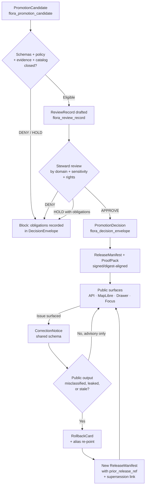

<!-- [KFM_META_BLOCK_V2]
doc_id: kfm://doc/flora-tracking-review-and-rollback
title: Flora — Review and Rollback Tracking
type: standard
version: v0.1
status: draft
owners: flora steward; release manager; policy/sensitivity reviewer
created: 2026-05-08
updated: 2026-05-08
policy_label: public
related:
  - docs/domains/flora/README.md
  - docs/domains/flora/PUBLICATION_AND_POLICY.md
  - docs/domains/flora/VERIFICATION_BACKLOG.md
  - docs/domains/flora/runbooks/flora-promotion.md
  - docs/domains/flora/runbooks/flora-rollback.md
  - docs/adr/ADR-flora-sensitive-location-policy.md
  - contracts/flora/flora_review_record.schema.json
  - contracts/flora/flora_promotion_candidate.schema.json
  - contracts/flora/flora_release_manifest.schema.json
  - contracts/flora/flora_decision_envelope.schema.json
  - policy/flora/review.rego
  - policy/flora/promotion.rego
tags: [kfm, flora, governance, review, rollback, tracking]
notes:
  - PROPOSED — no repo mounted in this session; all paths require verification.
  - The tracking/ subfolder is PROPOSED; Appendix B of the Flora blueprint shows a flat docs/domains/flora/ tree plus adr/ and runbooks/ subfolders only.
[/KFM_META_BLOCK_V2] -->

# Flora — Review and Rollback Tracking

> Operational tracking doctrine for steward review, promotion decisions, corrections, and
> rollbacks within the KFM Flora lane. Review and rollback are **governed state transitions**,
> never silent file operations.

[](#)
[](../README.md)
[](#)
[](#)
[](#)

**Owners:** flora steward · release manager · policy/sensitivity reviewer
**Audience:** flora maintainers, reviewers, release managers, CI/promotion-gate authors,
operators of the correction/rollback queue.

---

## Quick jump

- [1. Scope](#1-scope)
- [2. Repo fit](#2-repo-fit)
- [3. What this doc does and does not do](#3-what-this-doc-does-and-does-not-do)
- [4. Doctrine](#4-doctrine)
- [5. Object families tracked here](#5-object-families-tracked-here)
- [6. Review lifecycle](#6-review-lifecycle)
- [7. Reviewer roles and separation of duties](#7-reviewer-roles-and-separation-of-duties)
- [8. Review obligations and triggers](#8-review-obligations-and-triggers)
- [9. Rollback situations and required actions](#9-rollback-situations-and-required-actions)
- [10. Tracking surfaces and file homes](#10-tracking-surfaces-and-file-homes)
- [11. Audit-record invariants](#11-audit-record-invariants)
- [12. Validation, CI, and policy hooks](#12-validation-ci-and-policy-hooks)
- [13. Operational dashboards relevant to flora review and rollback](#13-operational-dashboards-relevant-to-flora-review-and-rollback)
- [14. Anti-patterns this document explicitly forbids](#14-anti-patterns-this-document-explicitly-forbids)
- [15. Open verification items](#15-open-verification-items)
- [Appendix A. Glossary](#appendix-a-glossary)
- [Appendix B. Cross-reference index](#appendix-b-cross-reference-index)

---

## 1. Scope

This document is the **flora-lane control plane** for review and rollback events. It
defines how those events are produced, recorded, audited, and tracked over time so that
every consequential outward flora claim remains reconstructable to a `ReviewRecord`,
release state, correction lineage, and rollback target.

It complements — and does not replace — the operational runbooks. The runbooks tell an
operator what to *do*; this document tells the lane what must be *true*, *recorded*, and
*tracked* whenever any of those operations run.

> [!IMPORTANT]
> Review and rollback are governed state transitions, not file moves and not deletions.
> Old releases, evidence bundles, catalog records, and receipts remain immutable and
> discoverable. New state always emits a new receipt that points to the prior state.

[Back to top](#flora--review-and-rollback-tracking)

---

## 2. Repo fit

**Proposed location.** `docs/domains/flora/tracking/REVIEW_AND_ROLLBACK.md`

**Directory Rules basis (PROPOSED).** Under Directory Rules, `docs/` is the human-facing
control plane and `docs/domains/<lane>/` owns the per-lane control plane. Reviewable,
trust-bearing operational doctrine (review state, rollback policy, audit invariants)
belongs in `docs/`, not under `data/`, `tools/`, or `policy/`. A `tracking/` subfolder
collects docs whose job is to describe **how operational state is observed, recorded, and
audited** for the lane — distinct from architecture, data model, or runbooks.

> [!WARNING]
> **NEEDS VERIFICATION.** The Flora blueprint's Appendix B shows a flat
> `docs/domains/flora/` tree plus `adr/` and `runbooks/` subfolders — it does **not**
> currently list `tracking/`. Before this file lands, confirm with the repo steward
> whether the lane convention is:
> 1. Add `tracking/` as a new subfolder (this file's current placement), or
> 2. Place this content as `docs/domains/flora/REVIEW_AND_ROLLBACK.md` at the lane root.
>
> The choice should be reflected in `docs/domains/flora/FILE_MANIFEST.md` and, if a new
> subfolder is created, in an ADR or migration note.

**Upstream inputs (PROPOSED):**

- KFM doctrine — authority ladder, lifecycle law, trust membrane, separation of duties.
- Flora blueprint — object families, lifecycle, rollback plan, fail-closed policy posture.
- Build Companion — review operations, observability, audit invariants.

**Downstream dependents (PROPOSED):**

- Flora promotion gate (`policy/flora/promotion.rego`, `tools/validators/flora/*`).
- Flora release manager workflows (`.github/workflows/flora-promotion.yml`).
- Flora UI surfaces showing review state, correction state, and stale state.
- Operational dashboards for source health, release state, and correction backlog.

[Back to top](#flora--review-and-rollback-tracking)

---

## 3. What this doc does and does not do

| Does | Does not do |
| --- | --- |
| Define the review and rollback lifecycle for flora artifacts. | Replace runbooks. Procedural step-by-step lives in `runbooks/`. |
| Name the object families and their tracking homes. | Define schema fields. Field-level shape lives in `contracts/flora/*.schema.json`. |
| Describe reviewer roles and separation-of-duties. | Assign people. CODEOWNERS and steward assignment are repo-level. |
| Tabulate rollback situations and required actions. | Authorize emergency action. Emergency disable is gated by the security/operator role. |
| State audit-record invariants. | Implement the audit store. The store is a runtime concern. |
| Enumerate tracking surfaces and validators that must exist. | Implement them. Implementation lives under `tools/`, `pipelines/`, and `policy/`. |

[Back to top](#flora--review-and-rollback-tracking)

---

## 4. Doctrine

The following statements are CONFIRMED in KFM corpus doctrine and govern every review or
rollback action in the flora lane.

1. **Cite-or-abstain.** A flora claim that depends on evidence resolves an `EvidenceRef`
   to an `EvidenceBundle` *before* answering. If resolution fails, the lane returns
   `ABSTAIN` or `DENY`, never plausible-sounding generation.
2. **Promotion is a governed state transition.** A file copy into `data/published/flora/`
   is not a release. A `ReleaseManifest` plus a `ProofPack` plus a recorded
   `PromotionDecision` is.
3. **Rollback is not deletion.** A rollback re-points a public alias to a prior verified
   release only after the prior `ProofPack`, `CatalogMatrix`, and `EvidenceBundle` are
   verified. The rollback itself emits a new `RollbackCard`, a correction notice where
   public claims changed, and a new `RunReceipt`.
4. **Separation of duties at release boundaries.** Generation, validation, policy review,
   domain stewardship, release approval, and rollback execution are distinct roles. Early
   maturity may collapse some of them onto a small team, but the *record* of who did what
   must always be distinct.
5. **Fail-closed for sensitivity.** Missing rights, missing sensitivity classification,
   unverified rare-plant geometry thresholds, or absent policy evidence all fail closed.
6. **Old state is immutable.** Old releases, bundles, receipts, and catalog records are
   never overwritten. Supersession is recorded; it never silently replaces.

[Back to top](#flora--review-and-rollback-tracking)

---

## 5. Object families tracked here

PROPOSED. These are the governance objects whose lifecycle this document tracks. Where a
shared, cross-lane object already exists in the repo, the flora lane reuses it rather
than creating a parallel home.

| Object | Purpose | Schema home (PROPOSED) | Receipt / artifact home (PROPOSED) |
| --- | --- | --- | --- |
| `flora_promotion_candidate` | Bundle proposed for promotion: artifacts, evidence, catalog, policy results, continuity. | `contracts/flora/flora_promotion_candidate.schema.json` | `data/proofs/flora/<release>/candidate.json` |
| `flora_review_record` | Human/steward review state, decision, scope, actor, date, obligations. | `contracts/flora/flora_review_record.schema.json` | `data/receipts/flora/reviews/<review_id>.json` |
| `flora_decision_envelope` | Finite outcome (`ANSWER` / `ABSTAIN` / `DENY` / `ERROR`) with reasons, obligations, evidence, policy. | `contracts/flora/flora_decision_envelope.schema.json` | Returned in API runtime; logged to audit. |
| `flora_release_manifest` | Released artifact list, digests, catalog refs, policy decisions, rollback target. | `contracts/flora/flora_release_manifest.schema.json` | `data/published/flora/manifests/<release_id>.json` |
| `ProofPack` *(shared)* | Closure bundle: `ValidationReport` + `PolicyDecision` + `EvidenceBundle` + `ReleaseManifest`. | shared `schemas/contracts/v1/promotion/proof_pack.schema.json` (PROPOSED reuse) | `data/proofs/flora/<release>/proof_pack.json` |
| `flora_redaction_receipt` | Geoprivacy/generalization/withholding transform receipt. | `contracts/flora/flora_redaction_receipt.schema.json` | `data/receipts/flora/redactions/<receipt_id>.json` |
| `CorrectionNotice` *(shared)* | Public/steward record of correction, withdrawal, or supersession. | shared `schemas/contracts/v1/governance/correction_notice.schema.json` (PROPOSED reuse) | `data/corrections/flora/<notice_id>.json` |
| `RollbackCard` | Auditable rollback of current alias: prior/target spec_hash, reason, reviewer, evidence refs. | shared (PROPOSED reuse) or `contracts/flora/flora_rollback_card.schema.json` | `data/proofs/flora/<release>/rollback_card.json` |
| `SupersessionLink` | Records replacement lineage; old release remains discoverable. | shared (PROPOSED reuse) | `data/receipts/flora/supersession/<link_id>.json` |
| `RunReceipt` | Process memory: `run_id`, `spec_hash`, inputs, outputs, validation results. | shared `RunReceipt` schema (PROPOSED reuse) | `data/receipts/flora/runs/<run_id>.json` |

> [!NOTE]
> Field-level shape and required keys are out of scope for this document. They live in
> the corresponding schema files. This document tracks the **lifecycle, decision points,
> and audit obligations** that wrap those objects.

[Back to top](#flora--review-and-rollback-tracking)

---

## 6. Review lifecycle

PROPOSED — derived from KFM lifecycle doctrine and the flora blueprint's promotion plan.
The diagram captures responsibility boundaries; it is not a workflow YAML.



**Stage notes (PROPOSED, lifecycle-significant):**

- **Eligibility check (B).** Gate behavior follows the flora promotion gate
  (`policy/flora/promotion.rego`) and the closure validators in
  `tools/validators/flora/`. Any UNKNOWN policy evidence fails closed.
- **Steward review (D).** Sensitivity, rights, and taxon ambiguity each have their own
  reviewer obligations (see [§8](#8-review-obligations-and-triggers)). Review duties may
  be split across multiple reviewers.
- **Publication (F → G).** The `ReleaseManifest` is the truth source for what is public.
  The renderer, the layer descriptor, the API response, the Evidence Drawer, and the
  Focus Mode payload all derive from it; none of them is a sovereign claim.
- **Rollback (J).** Performed only after the prior `ReleaseManifest`, `ProofPack`,
  `CatalogMatrix`, and `EvidenceBundle` re-validate. The new `RollbackCard` is itself a
  governed artifact and is preserved.

[Back to top](#flora--review-and-rollback-tracking)

---

## 7. Reviewer roles and separation of duties

CONFIRMED doctrine from KFM Build Companion §21. Roles named below are the **records of
responsibility**; small teams may attach multiple roles to one person, but the recorded
actor for each decision must still be distinct per action where the policy requires it.

| Role | Primary responsibility for the flora lane | Required record |
| --- | --- | --- |
| Repo steward | Path rules, ADRs, directory responsibility, compatibility roots. | Path-decision card and ADR review on structural change. |
| Contract / schema reviewer | Meaning/shape split; schema versioning; fixtures pass for flora schemas. | Contract-schema crosswalk passes. |
| Source steward | Source authority, rights, source activation, attribution. | `SourceActivationDecision` recorded before any flora connector activation. |
| Domain steward (flora) | Lane-specific claim burden, source roles, taxonomic and ecological caveats. | Flora fixtures and source-role table approved. |
| Policy / sensitivity reviewer | Deny / restrict / abstain rules; public-safe transforms; rare-plant geoprivacy. | Policy fixtures cover risky cases (public exact rare points, unknown rights, modeled-as-observed). |
| Release manager | Promotion, proof pack, release manifest, rollback target. | Release dry-run passes; `ReleaseManifest` references rollback target. |
| UI trust reviewer | Evidence Drawer, Focus Mode, stale and correction display, accessibility. | UI payload contracts and negative-state tests pass for flora. |
| Security / operator | Secrets, access roles, local exposure, deployment, audit. | No-direct-model-client and "deny internal paths" tests pass for flora endpoints. |

> [!IMPORTANT]
> **Release-significant separation rule.** A single actor must not be the recorded
> implementer, validator, policy reviewer, domain steward, release approver, **and**
> rollback executor for the same release. When maturity justifies it, these duties are
> assigned to distinct people or groups; until then, the *record* must still distinguish
> the actions even if performed by the same human.

### 7.1 PR review card (illustrative)

For non-trivial flora PRs the reviewer attaches a compact card. The fields below are
derived from the KFM Build Companion review-card pattern; the exact form is repo-level.

```yaml
# illustrative — copy into PR description, do not treat as a contract
goal:
owning_root:                # e.g., docs/, contracts/, policy/, data/, tools/
directory_rules_basis:
object_families_affected:   # PromotionCandidate? ReviewRecord? RollbackCard?
contracts_changed:
schemas_changed:
fixtures_added_or_updated:
policy_gates_affected:
public_exposure_possible:   # yes / no
evidence_ref_impact:
release_or_correction_or_rollback_impact:
validation_commands_run:
known_unknowns:
rollback_plan:
```

[Back to top](#flora--review-and-rollback-tracking)

---

## 8. Review obligations and triggers

PROPOSED. Triggers below are derived from KFM doctrine and the flora blueprint's
sensitivity and rights posture. Exact thresholds (which species, which administrative
status, which rights class) live in `policy/flora/sensitivity.rego` and the
sensitivity-policy ADR — not in this document.

| Trigger | Reviewer queue | Default outcome before sign-off |
| --- | --- | --- |
| Rare-plant exact geometry candidate. | Domain steward + policy/sensitivity reviewer. | `DENY` for public exact; `generalized_only` for public release. |
| Rights status `unknown` or `restricted` for a candidate source. | Source steward + policy reviewer. | `DENY` public release; `ABSTAIN` runtime claim. |
| Taxon ambiguity above policy threshold (split / lumped / disputed authority). | Domain steward + contract reviewer if schema impact. | `HOLD`; record obligations. |
| Modeled range or suitability surface presented as observation. | Domain steward + UI trust reviewer. | `DENY`; reclassify as derived modeled product. |
| External source terms changed since last activation. | Source steward + policy reviewer. | Disable watcher; `ABSTAIN` or `DENY` affected runtime claims pending review. |
| AI / Focus Mode answer with unresolved or conflicting `EvidenceRef`. | UI trust reviewer + policy reviewer. | `ABSTAIN` with reason code; preserve `AIReceipt`. |
| Public layer leak suspected (exact sensitive geometry on public surface). | Security / operator + release manager + policy reviewer. | Emergency disable; rollback card + correction notice. |

[Back to top](#flora--review-and-rollback-tracking)

---

## 9. Rollback situations and required actions

CONFIRMED — direct mapping from the flora blueprint's rollback plan. Every row below
emits at least one durable artifact (receipt, card, or notice) that this tracking
document covers.

| Rollback situation | Required action |
| --- | --- |
| Files proposed in PR but not merged. | Remove proposed files from PR or split into a smaller PR; no production correction needed. |
| Schema change causes compatibility issue. | Revert or pin prior schema version; keep new schema as draft only if already referenced by receipts. |
| Source registry entry wrong. | Revert descriptor; mark source disabled or unverified; preserve any probe receipt as process memory. |
| Validator or policy too strict or too loose. | Disable the new workflow invocation first; patch validator or policy with a fixture proving the expected denial / allow behavior. |
| Flora API route introduced later misbehaves. | Disable route or feature flag; return `ERROR` / `ABSTAIN`; keep audit logs and evidence refs. |
| Public layer introduced later leaks sensitivity. | Immediately remove or disable the layer-registry entry and the public alias; quarantine artifact; emit correction notice and rollback card. |
| Published artifact is superseded. | Publish a new release manifest; preserve old proof, catalog, receipt, and rollback lineage; do not overwrite silently. |
| External source terms change. | Disable watcher; mark source as controlled or unknown; `ABSTAIN` or `DENY` affected runtime claims pending review. |

> [!CAUTION]
> **Sensitive-geometry leak is a P0 incident.** The public layer is removed first, then
> the rollback card and correction notice are issued. Do not attempt to "edit" a
> published artifact to remove sensitive geometry — quarantine and re-publish a
> generalized artifact under a new release.

### 9.1 Minimum rollback record

Every rollback emits a `RollbackCard` whose minimum fields are aligned with the soil and
geology rollback patterns in the corpus. The flora schema (PROPOSED) is expected to
include at least:

```json5
{
  "rollback_id": "kfm://rollback/flora/<uuid>",
  "from_release_id": "kfm://release/flora/<current>",
  "to_release_id":   "kfm://release/flora/<prior>",
  "reason_code": "PUBLIC_EXACT_GEOMETRY_DENIED",
  "verification": {
    "prior_release_manifest_verified": true,
    "prior_catalog_matrix_verified":  true,
    "prior_evidence_bundle_verified": true
  },
  "review_record_ref":     "kfm://review/flora/<id>",
  "correction_notice_ref": "kfm://correction/flora/<id>",
  "new_run_receipt_ref":   "kfm://receipt/flora/<id>",
  "actor":         "<role or person>",
  "requested_at":  "YYYY-MM-DDTHH:MM:SSZ",
  "executed_at":   "YYYY-MM-DDTHH:MM:SSZ"
}
```

> Illustrative shape only. Authoritative field set is in
> `contracts/flora/flora_rollback_card.schema.json` (PROPOSED) or the shared
> `RollbackCard` schema if the repo already provides one.

[Back to top](#flora--review-and-rollback-tracking)

---

## 10. Tracking surfaces and file homes

PROPOSED. The flora lane writes review and rollback events into the lifecycle data tree
described in the Directory Rules. The homes below are the proposed locations; reuse
shared paths where the repo already has them, and **do not** create parallel homes.

```text
data/
└── flora/                                # NOTE: most lanes nest under data/<bucket>/flora/
                                          # rather than data/flora/. Verify against repo.
data/receipts/flora/
├── runs/                # RunReceipt per pipeline run (success, denial, quarantine)
├── reviews/             # ReviewRecord artifacts
├── redactions/          # Redaction / generalization receipts
└── supersession/        # Supersession links between releases

data/proofs/flora/
└── <release_id>/
    ├── candidate.json           # PromotionCandidate
    ├── proof_pack.json          # ProofPack closure
    └── rollback_card.json       # RollbackCard if and when emitted

data/corrections/flora/
└── <notice_id>.json     # CorrectionNotice (public/steward visible)

data/published/flora/
├── manifests/<release_id>.json  # ReleaseManifest — the truth source for what is public
└── layers/...                   # public-safe materializations only
```

> [!NOTE]
> The exact bucketing of `data/raw/flora/`, `data/work/flora/`, `data/processed/flora/`,
> `data/catalog/{stac,dcat,prov}/flora/`, `data/published/flora/...` is given in the
> flora blueprint Appendix B and the Directory Rules. The tree above shows only the
> review- and rollback-tracking subset.

### 10.1 What gets written when

| Event | Artifact written | Home (PROPOSED) | Immutable after write? |
| --- | --- | --- | --- |
| Pipeline run (any outcome). | `RunReceipt` | `data/receipts/flora/runs/<run_id>.json` | Yes. |
| Steward review concludes. | `ReviewRecord` | `data/receipts/flora/reviews/<review_id>.json` | Yes; new review supersedes via link. |
| Promotion candidate built. | `PromotionCandidate` + `ProofPack` | `data/proofs/flora/<release>/...` | Yes. |
| Promotion decision recorded. | `DecisionEnvelope` | Logged + audit; references release. | Yes. |
| Public release. | `ReleaseManifest` | `data/published/flora/manifests/<release_id>.json` | Yes. |
| Geoprivacy transform applied. | `RedactionReceipt` | `data/receipts/flora/redactions/<id>.json` | Yes. |
| Correction issued. | `CorrectionNotice` | `data/corrections/flora/<notice_id>.json` | Yes. |
| Rollback executed. | `RollbackCard` + new `ReleaseManifest` | `data/proofs/flora/<release>/rollback_card.json` + new manifest | Yes; alias re-points only. |
| Release superseded. | `SupersessionLink` | `data/receipts/flora/supersession/<id>.json` | Yes. |

[Back to top](#flora--review-and-rollback-tracking)

---

## 11. Audit-record invariants

CONFIRMED. These five invariants are the audit floor for any flora review or rollback
event. They are repeated here verbatim in spirit because they are the contract a
reviewer can be held to.

1. Every material state transition has an actor or tool, time, input refs, output refs,
   and reason.
2. Every public answer or map claim can name its release and evidence refs.
3. Every denial or abstention carries a stable reason code.
4. Every correction preserves both old and new state.
5. Every rollback target is explicit before release.

> [!IMPORTANT]
> If any of the five invariants cannot be satisfied for a candidate flora release, the
> default disposition is `HOLD` with obligations recorded in the `DecisionEnvelope` —
> not `ANSWER` with caveats.

[Back to top](#flora--review-and-rollback-tracking)

---

## 12. Validation, CI, and policy hooks

PROPOSED. The hooks below describe what *must* be in place for the review/rollback
tracking surface to be trustworthy. Each item is a placeholder until repo evidence
confirms its actual location.

| Hook | Role | Proposed home |
| --- | --- | --- |
| Schema validation for `flora_review_record`, `flora_promotion_candidate`, `flora_release_manifest`, `flora_decision_envelope`. | Pass/fail fixtures in CI. | `tests/flora/test_schemas.py` + `tests/fixtures/flora/{valid,invalid}/...` |
| Promotion gate policy. | OPA / Conftest or repo-standard policy harness. | `policy/flora/promotion.rego` |
| Steward review policy. | OPA / Conftest. | `policy/flora/review.rego` |
| Catalog closure validator. | STAC + DCAT + PROV + manifests + proofs aligned. | `tools/validators/flora/validate_catalog_matrix.py` |
| Release manifest validator. | Manifest closure + rollback target + digests. | `tools/validators/flora/validate_release_manifest.py` |
| Rollback card validator. | Required fields + prior-release verification refs. | `tools/validators/flora/validate_rollback_card.py` *(PROPOSED — not yet enumerated in flora blueprint)* |
| Sensitive-public-leak validator. | Exact rare-plant geometry cannot enter public artifact. | `tools/validators/flora/validate_sensitivity_public_surface.py` |
| Promotion / rollback / correction round-trip test. | End-to-end fixture: candidate → release → correction → rollback. | `tests/flora/test_rollback_card.py` |
| CI workflows. | Thin orchestration; policy-significant logic lives in validators and policy. | `.github/workflows/flora-ci.yml`, `.github/workflows/flora-promotion.yml` |

> [!WARNING]
> **Missing policy evidence fails closed.** If `policy/flora/*.rego` is absent or the
> policy harness is unavailable in CI, the promotion gate denies. It is **not** acceptable
> to skip the gate "until tooling is wired up."

[Back to top](#flora--review-and-rollback-tracking)

---

## 13. Operational dashboards relevant to flora review and rollback

PROPOSED. The KFM Build Companion identifies eight operational dashboards. The four
below are the most relevant to the surface this document tracks; the others remain
useful but are not flora-review-and-rollback specific.

| Dashboard | Questions it answers for flora |
| --- | --- |
| Policy decisions | What flora candidates were `DENY`d, `RESTRICT`ed, or `ABSTAIN`ed, and why? |
| Release state | Which flora releases are published, stale, corrected, withdrawn, or rollback-ready? |
| Correction backlog | Which flora user or steward challenges and corrections are open? Which have unresolved obligations? |
| AI runtime audit | Which flora Focus Mode answers were generated, cited, abstained, denied, or failed citation validation? |

> [!NOTE]
> Dashboards do **not** replace proofs. A green dashboard is not evidence; the underlying
> receipts, manifests, proofs, and review records are.

[Back to top](#flora--review-and-rollback-tracking)

---

## 14. Anti-patterns this document explicitly forbids

| Anti-pattern | Why it is forbidden |
| --- | --- |
| Treating a file move into `data/published/flora/` as a release. | Publication is a release-state transition with a `ReleaseManifest` and `ProofPack`, not a copy. |
| Editing a published flora artifact in place to "fix" it. | Old state must remain immutable. Issue a new release with a `SupersessionLink` and a `CorrectionNotice`. |
| Deleting a release directory to roll back. | Rollback re-points the public alias and emits a `RollbackCard`. Old proof and catalog stay discoverable. |
| Letting one actor hold implementer + validator + reviewer + release-approver + rollback-executor records for the same release. | Violates separation-of-duties record requirement. |
| Suppressing the `DecisionEnvelope` reason code on a denial. | Every denial carries a stable reason code; "blocked" without a code is not a record. |
| Letting the renderer, the layer style, the search index, or an AI summary be cited as a flora claim. | None of these is a truth source. They derive from released evidence. |
| Skipping the promotion gate because policy tooling "isn't ready yet." | Missing policy evidence fails closed; it does not waive the gate. |
| Issuing a `CorrectionNotice` without an `EvidenceBundle` or `ReviewRecord` reference. | Corrections preserve lineage; an unsourced correction is not a governed correction. |

[Back to top](#flora--review-and-rollback-tracking)

---

## 15. Open verification items

NEEDS VERIFICATION. The following items must be resolved before this document is treated
as anything other than draft doctrine for the lane.

- [ ] Confirm whether `docs/domains/flora/tracking/` is an accepted subfolder, or whether
      this content should sit at `docs/domains/flora/REVIEW_AND_ROLLBACK.md`.
- [ ] Confirm flora schema home: `contracts/flora/` vs `schemas/contracts/v1/flora/`
      (`ADR-flora-schema-home.md`).
- [ ] Confirm reuse vs lane-local for `ReviewRecord`, `CorrectionNotice`, `RollbackCard`,
      `RunReceipt`, `ProofPack`, `EvidenceBundle`, `DecisionEnvelope`.
- [ ] Confirm policy harness (OPA / Conftest / repo-standard) and CI-level availability.
- [ ] Confirm rare-plant stewardship policy: who reviews, exact-vs-public thresholds,
      species/status triggers (`ADR-flora-sensitive-location-policy.md`).
- [ ] Confirm CODEOWNERS / steward assignments for each row of [§7](#7-reviewer-roles-and-separation-of-duties).
- [ ] Confirm release manifest, proof pack, and rollback-card conventions against
      `data/proofs/`, `data/published/`, and existing release docs if any.
- [ ] Confirm CI required-checks list includes the flora schema, policy, catalog,
      sensitivity-leak, and rollback-card validators.

[Back to top](#flora--review-and-rollback-tracking)

---

## Appendix A. Glossary

<details>
<summary>Click to expand glossary</summary>

- **`ABSTAIN`** — Finite outcome in a `DecisionEnvelope` indicating that evidence,
  policy, review, or release state is insufficient to answer. Carries a stable reason
  code.
- **`ANSWER`** — Finite outcome indicating an evidence-bounded reply that resolves to a
  released `EvidenceBundle`.
- **`CorrectionNotice`** — Public or steward-visible record of a correction, withdrawal,
  or supersession. References the affected release and the reviewing actor.
- **`DecisionEnvelope`** — Finite outcome (`ANSWER` / `ABSTAIN` / `DENY` / `ERROR`) with
  reason codes, obligations, evidence refs, and policy labels.
- **`DENY`** — Finite outcome indicating a policy or rights violation. Stable reason
  code is required.
- **`EvidenceBundle`** — Resolved bundle of artifacts, source refs, catalog refs, proof
  refs, rights, and sensitivity summary that supports a claim.
- **`EvidenceRef`** — Pointer that resolves to an `EvidenceBundle`. Unresolved refs
  trigger `ABSTAIN` or `DENY`.
- **`ProofPack`** — Closure bundle of `ValidationReport`, `PolicyDecision`,
  `EvidenceBundle`, and `ReleaseManifest`. Required for promotion.
- **`PromotionCandidate`** — Bundle proposed for promotion: artifacts, evidence, catalog
  matrix, policy results, continuity mapping, rollback refs.
- **`PromotionDecision`** — Recorded decision on a `PromotionCandidate`. Distinct from
  the `ReviewRecord` that informs it.
- **`ReleaseManifest`** — Released artifact list with digests, catalog refs, policy
  decisions, and rollback target. The truth source for what is public.
- **`ReviewRecord`** — Human or steward review state, decision, scope, actor, date, and
  obligations.
- **`RollbackCard`** — Auditable rollback event: prior and target spec_hashes, reason,
  reviewer, evidence refs, and verification of prior release.
- **`RunReceipt`** — Process memory: `run_id`, `spec_hash`, source snapshot refs,
  parameters, validation results, output refs.
- **`spec_hash`** — Stable hash of a spec/process identity. Not a timestamp; not policy
  by itself.
- **`SupersessionLink`** — Receipt that records release replacement lineage. Old release
  remains discoverable.

</details>

[Back to top](#flora--review-and-rollback-tracking)

---

## Appendix B. Cross-reference index

PROPOSED. Update once paths are confirmed against the mounted repo.

- `docs/domains/flora/README.md` — lane entrypoint.
- `docs/domains/flora/PUBLICATION_AND_POLICY.md` — rights, sensitivity, public-safe rules.
- `docs/domains/flora/VERIFICATION_BACKLOG.md` — open checks and evidence gaps.
- `docs/domains/flora/runbooks/flora-promotion.md` — operator procedure for promotion.
- `docs/domains/flora/runbooks/flora-rollback.md` — operator procedure for rollback.
- `docs/adr/ADR-flora-schema-home.md` — resolves contracts vs schemas authority.
- `docs/adr/ADR-flora-sensitive-location-policy.md` — exact vs public-safe geometry thresholds.
- `contracts/flora/flora_review_record.schema.json` *(PROPOSED)*
- `contracts/flora/flora_promotion_candidate.schema.json` *(PROPOSED)*
- `contracts/flora/flora_release_manifest.schema.json` *(PROPOSED)*
- `contracts/flora/flora_decision_envelope.schema.json` *(PROPOSED)*
- `contracts/flora/flora_redaction_receipt.schema.json` *(PROPOSED)*
- `policy/flora/review.rego`, `policy/flora/promotion.rego`, `policy/flora/sensitivity.rego`,
  `policy/flora/publish.rego`, `policy/flora/rights.rego` *(all PROPOSED)*
- `tools/validators/flora/validate_release_manifest.py`,
  `validate_catalog_matrix.py`,
  `validate_evidence_bundle.py`,
  `validate_sensitivity_public_surface.py` *(all PROPOSED)*
- `tests/flora/test_rollback_card.py`,
  `test_no_sensitive_public_leak.py`,
  `test_catalog_closure.py` *(all PROPOSED)*
- `.github/workflows/flora-ci.yml`, `.github/workflows/flora-promotion.yml` *(PROPOSED)*

[Back to top](#flora--review-and-rollback-tracking)
