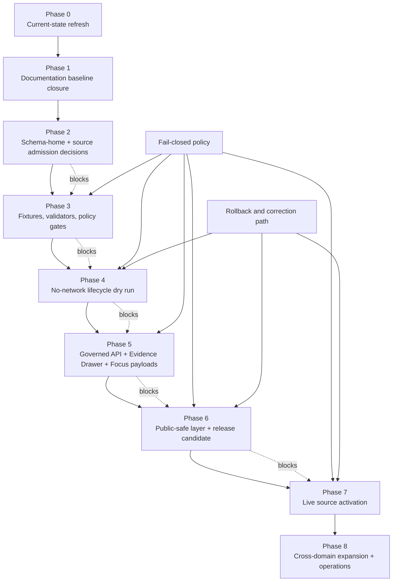

<!-- [KFM_META_BLOCK_V2]
doc_id: kfm://doc/NEEDS-VERIFICATION__docs-domains-flora-tracking-roadmap
title: Flora Roadmap
type: standard
version: v1
status: draft
owners: NEEDS-VERIFICATION__flora-steward
created: NEEDS-VERIFICATION__existing-file
updated: 2026-05-08
policy_label: NEEDS-VERIFICATION__public-doc-no-sensitive-source-data
related: [docs/domains/flora/README.md, docs/domains/flora/CURRENT_STATE.md, docs/domains/flora/architecture/ARCHITECTURE.md, docs/domains/flora/architecture/DATA_MODEL.md, docs/domains/flora/registers/SOURCE_REGISTRY.md, docs/domains/flora/operations/PIPELINES_AND_LIFECYCLE.md, docs/domains/flora/governance/PUBLICATION_AND_POLICY.md, docs/domains/flora/architecture/UI_AND_EVIDENCE_DRAWER.md, docs/domains/flora/tracking/VERIFICATION_BACKLOG.md, docs/domains/flora/tracking/CHANGELOG.md, docs/domains/flora/registers/FILE_MANIFEST.md, schemas/flora/README.md, contracts/source/kansas_flora/README.md, policy/flora/usda_plants_review.rego]
tags: [kfm, flora, roadmap, tracking, biodiversity, governance, evidence, policy]
notes: [Existing ROADMAP.md was fetched from main and revised as a richer tracking document. doc_id, owners, created date, and policy label require steward verification. This roadmap is planning and gate sequencing; it does not claim live source activation, passing CI, deployed API behavior, or public Flora release.]
[/KFM_META_BLOCK_V2] -->

<a id="top"></a>

# Flora Roadmap

Sequenced maturation plan for the KFM Flora lane: from verified documentation surfaces to fixture-backed validation, governed payloads, public-safe layers, and reversible release practice.


> [!IMPORTANT]
> **Roadmap status:** draft / tracking  
> **Evidence mode:** connector-visible repository evidence plus attached KFM doctrine; local checkout was not mounted during this authoring pass.  
> **Current rule:** do not upgrade this roadmap into proof of implementation. A phase is complete only when the exit evidence exists in the repository, test output, emitted artifacts, review records, or release objects.

**Quick jumps:** [Reading rules](#reading-rules) · [Repo fit](#repo-fit) · [Current position](#current-position) · [Roadmap flow](#roadmap-flow) · [Phase plan](#phase-plan) · [Acceptance gates](#acceptance-gates) · [Update triggers](#update-triggers) · [Open verification](#open-verification) · [Definition of done](#definition-of-done)

---

## Reading rules

The original four-phase roadmap is preserved, but expanded into reviewable gates that match the current Flora documentation structure and KFM governance posture.

| Label | Meaning in this roadmap |
| --- | --- |
| **CONFIRMED** | Verified from connector-visible `main`, current-session workspace inspection, or governing KFM doctrine. |
| **PROPOSED** | Recommended next work that is not verified as current implementation. |
| **UNKNOWN** | Not verified strongly enough to treat as fact. |
| **NEEDS VERIFICATION** | Checkable before acting, but not yet checked strongly enough. |
| **BLOCKED** | Should not proceed until named dependencies are resolved. |
| **DONE** | Completed only when exit evidence is linked or recorded. |

> [!NOTE]
> This file plans work across documentation, source contracts, schemas, policy, fixtures, validators, lifecycle artifacts, governed API payloads, Evidence Drawer payloads, Focus outcomes, release manifests, and rollback readiness. It does not store those artifacts.

[Back to top](#top)

---

## Repo fit

`docs/domains/flora/tracking/ROADMAP.md` is the lane tracking surface for sequencing and gate review. It belongs under `docs/domains/flora/` because Flora is a domain lane, while machine schemas, policies, tests, source descriptors, lifecycle data, releases, and runtime code belong under their responsibility roots.

| Direction | Path | Role | Current posture |
| --- | --- | --- | --- |
| Parent lane entry | [`../README.md`](../README.md) | Flora domain orientation and navigation | **CONFIRMED** |
| Current-state ledger | [`../CURRENT_STATE.md`](../CURRENT_STATE.md) | Evidence inventory, conflicts, unknowns, refresh procedure | **CONFIRMED** |
| Architecture | [`../architecture/ARCHITECTURE.md`](../architecture/ARCHITECTURE.md) | Flora flow, boundaries, and invariants | **CONFIRMED** |
| Data model | [`../architecture/DATA_MODEL.md`](../architecture/DATA_MODEL.md) | Flora object families and modeling rules | **CONFIRMED** |
| Source registry guide | [`../registers/SOURCE_REGISTRY.md`](../registers/SOURCE_REGISTRY.md) | Source roles, descriptor fields, admission posture | **CONFIRMED** |
| Lifecycle guide | [`../operations/PIPELINES_AND_LIFECYCLE.md`](../operations/PIPELINES_AND_LIFECYCLE.md) | Intake-to-publication stages and gate outcomes | **CONFIRMED** |
| Publication policy | [`../governance/PUBLICATION_AND_POLICY.md`](../governance/PUBLICATION_AND_POLICY.md) | Rights, sensitivity, public geometry, release checks | **CONFIRMED** |
| UI and evidence guide | [`../architecture/UI_AND_EVIDENCE_DRAWER.md`](../architecture/UI_AND_EVIDENCE_DRAWER.md) | Map layer, Evidence Drawer, Focus outcome boundaries | **CONFIRMED** |
| Verification backlog | [`VERIFICATION_BACKLOG.md`](VERIFICATION_BACKLOG.md) | Priority verification tasks | **CONFIRMED** |
| Change history | [`CHANGELOG.md`](CHANGELOG.md) | Human-readable Flora doc changes | **CONFIRMED** |
| File manifest | [`../registers/FILE_MANIFEST.md`](../registers/FILE_MANIFEST.md) | Flora documentation inventory | **CONFIRMED / needs path reconciliation** |
| Source contracts | [`../../../../contracts/source/kansas_flora/README.md`](../../../../contracts/source/kansas_flora/README.md) | Semantic source-admission surface for Kansas Flora | **CONFIRMED** |
| Schema surface | [`../../../../schemas/flora/README.md`](../../../../schemas/flora/README.md) | Flora schema entrypoint | **CONFIRMED / schema-home NEEDS VERIFICATION** |
| Policy asset | [`../../../../policy/flora/usda_plants_review.rego`](../../../../policy/flora/usda_plants_review.rego) | USDA PLANTS review policy asset | **CONFIRMED / enforcement UNKNOWN** |

[Back to top](#top)

---

## Current position

### What is already grounded enough to build on

| Area | Status | Roadmap consequence |
| --- | --- | --- |
| Flora documentation lane | **CONFIRMED** | Continue from existing docs; do not restart from a blank slate. |
| Grouped Flora doc structure | **CONFIRMED / CONFLICTED** | Roadmap should align to grouped homes such as `architecture/`, `registers/`, `operations/`, `governance/`, and `tracking/`. |
| Source contracts | **CONFIRMED / bounded** | Build source-admission work around existing `contracts/source/kansas_flora/` surface. |
| Schema surface | **CONFIRMED / NEEDS VERIFICATION** | Use `schemas/flora/` as visible current surface, but do not treat schema-home authority as settled. |
| Policy asset | **CONFIRMED / enforcement UNKNOWN** | Existing Rego is a policy asset; CI/runtime enforcement still must be proven. |
| USDA PLANTS slice | **CONFIRMED / bounded** | Treat as no-network, fixture-backed documentation and tooling path unless live activation is directly proven. |
| Runtime API/UI/release state | **UNKNOWN** | Do not claim live governed Flora routes, Evidence Drawer wiring, Focus integration, public release, dashboards, or emitted proof objects. |

### The active risk

The strongest near-term risk is not lack of ideas. It is **authority drift**: flat vs grouped docs, schemas vs contracts, policy assets vs policy enforcement, and tool names that sound like release/publication without proof that a release exists.

[Back to top](#top)

---

## Roadmap flow



**Roadmap law:** every later phase depends on source-role clarity, rights/sensitivity posture, evidence closure, validation, review, release, and rollback evidence. If those are missing, hold, deny, quarantine, or abstain.

[Back to top](#top)

---

## Phase plan

### Phase 0 — Current-state refresh and path reconciliation

**Status:** ACTIVE  
**Priority:** P0  
**Goal:** make repository reality and documentation layout explicit before adding stronger claims.

| Work item | Status | Exit evidence |
| --- | --- | --- |
| Refresh `CURRENT_STATE.md` from a mounted checkout or connector-visible repo inventory. | **PARTLY CONFIRMED** | Current-state file records commit/ref, checked paths, and unknowns. |
| Reconcile flat companion links with grouped homes. | **NEEDS VERIFICATION** | README, manifest, and companion docs agree on `architecture/`, `registers/`, `operations/`, `governance/`, and `tracking/` homes. |
| Verify owner and policy placeholders. | **NEEDS VERIFICATION** | `CODEOWNERS`, steward registry, or governance record resolves owner and policy label. |
| Confirm whether `tests/flora` and `tests/fixtures/flora` exist. | **UNKNOWN** | Repo tree or search/fetch evidence records presence or absence. |
| Record current branch, commit, and dirty state when a checkout is mounted. | **UNKNOWN** | `git status`, `git branch`, and `git rev-parse HEAD` results copied to current-state ledger. |

**Do not proceed to Phase 2 with unresolved layout drift that creates duplicate source, schema, or policy homes.**

---

### Phase 1 — Documentation baseline closure

**Status:** PARTLY CONFIRMED  
**Priority:** P0  
**Goal:** keep the Flora lane navigable, reviewable, and internally consistent.

| Work item | Status | Exit evidence |
| --- | --- | --- |
| Keep `README.md` as the lane entrypoint. | **CONFIRMED** | README links grouped companion docs and states accepted inputs/exclusions. |
| Keep `ARCHITECTURE.md` focused on lane flow and invariants. | **CONFIRMED** | Architecture references source descriptors, validation, promotion, governed API, UI, and EvidenceBundle closure. |
| Keep `DATA_MODEL.md` focused on object families. | **CONFIRMED** | Object families remain distinct: taxon, occurrence, specimen, status, vegetation product, transform receipt, EvidenceBundle, DecisionEnvelope, ReleaseManifest. |
| Keep `SOURCE_REGISTRY.md` focused on source roles and descriptor expectations. | **CONFIRMED** | Unknown role, rights, or sensitivity blocks promotion. |
| Keep `PUBLICATION_AND_POLICY.md` as human policy guide, not policy-as-code. | **CONFIRMED** | Deny conditions and public geometry classes remain visible. |
| Keep `UI_AND_EVIDENCE_DRAWER.md` bounded to payload and trust behavior. | **CONFIRMED** | UI guidance prohibits RAW/WORK reads and restricted precise disclosure. |
| Update `CHANGELOG.md` for this roadmap revision. | **PROPOSED** | Changelog entry references changed roadmap scope and path reconciliation. |

**Exit gate:** the documentation set has no stale flat-path links except deliberate compatibility notes.

---

### Phase 2 — Schema-home and source-admission decisions

**Status:** BLOCKED on ADR/source registry verification  
**Priority:** P0  
**Goal:** prevent parallel machine authority and source-role drift.

| Work item | Status | Exit evidence |
| --- | --- | --- |
| Verify or create `ADR-flora-schema-home.md`. | **NEEDS VERIFICATION** | ADR states whether Flora schemas live under `schemas/flora/`, `schemas/contracts/v1/flora/`, `contracts/`, or another repo-confirmed home. |
| Confirm machine source registry home. | **NEEDS VERIFICATION** | `data/registry/flora/` or repo-native equivalent is verified, or explicitly proposed. |
| Align source contracts with machine descriptors. | **PROPOSED** | `contracts/source/kansas_flora/` docs map to source descriptor records without duplicating machine truth. |
| Define stable source-role vocabulary. | **PARTLY CONFIRMED / NEEDS VERIFICATION** | Source-role vocabulary is mirrored across docs, schemas, fixtures, and policy. |
| Identify shared governance schemas before creating Flora-specific forks. | **NEEDS VERIFICATION** | Search/fetch evidence for shared `SourceDescriptor`, `EvidenceBundle`, `DecisionEnvelope`, `ReleaseManifest`, and related objects. |

**Exit gate:** source descriptor and schema-home decisions are explicit enough that fixtures and validators know which shapes to test.

---

### Phase 3 — Fixture-backed validation and fail-closed policy gates

**Status:** PROPOSED  
**Priority:** P0 / P1  
**Goal:** turn the documentation baseline into testable constraints without live source activation.

| Fixture / gate | Required cases | Exit evidence |
| --- | --- | --- |
| Source descriptor | Valid descriptor; unknown role; unknown rights; unresolved sensitivity | Valid/invalid fixtures and validator output. |
| Taxon identity | Accepted name; synonym/crosswalk; unresolved taxon | Invalid unresolved merge fails. |
| Occurrence/specimen | Public-safe occurrence; restricted precise occurrence; georeference uncertainty | Exact sensitive public geometry denied. |
| Rights/sensitivity | Public allowed; public generalized; controlled only; embargoed; steward review | Policy or validator explains outcome. |
| EvidenceBundle | Closed refs; dangling refs; unsupported claim | Dangling evidence fails. |
| DecisionEnvelope | `ANSWER`, `ABSTAIN`, `DENY`, `ERROR` | All finite outcomes represented. |
| ReleaseManifest | Complete release; missing rollback; raw/work/quarantine reference | Incomplete release denied. |

**Exit gate:** a no-network validation run can fail meaningful negative cases before any source fetcher, public layer, or runtime path is trusted.

---

### Phase 4 — No-network lifecycle dry run

**Status:** PROPOSED  
**Priority:** P1  
**Goal:** prove the Flora lane can traverse the KFM truth path using synthetic or fixture-backed data only.

```text
SourceDescriptor
  -> fixture-backed RAW/control intake
  -> WORK normalization candidate
  -> validation report
  -> PROCESSED flora objects
  -> catalog/proof closure
  -> promotion decision
  -> release candidate manifest
  -> rollback card
```

| Work item | Status | Exit evidence |
| --- | --- | --- |
| Create dry-run manifest for one public-safe Flora slice. | **PROPOSED** | RunReceipt or dry-run report with input/output refs. |
| Emit validation report. | **PROPOSED** | Schema, policy, source-role, geometry, rights, and sensitivity results recorded. |
| Emit catalog/proof closure objects. | **PROPOSED** | Catalog refs and EvidenceBundle refs close. |
| Emit promotion decision. | **PROPOSED** | Outcome is `HOLD`, `DENY`, or release-candidate approval with reasons. |
| Emit rollback target/card for any release candidate. | **PROPOSED** | Rollback path is reviewable before publication. |

**Exit gate:** the dry run proves reversibility and denial paths. It does not publish live Flora data.

---

### Phase 5 — Governed API, Evidence Drawer, and Focus payload contracts

**Status:** PROPOSED / runtime UNKNOWN  
**Priority:** P1 / P2  
**Goal:** define and test public-facing envelopes without direct RAW/WORK/QUARANTINE access.

| Surface | Required behavior | Exit evidence |
| --- | --- | --- |
| Governed Flora API payload | Resolves EvidenceRef to EvidenceBundle; carries policy/review/release state | Contract or fixture plus negative no-raw-path test. |
| Evidence Drawer payload | Shows claim summary, EvidenceBundle refs, source role, rights, sensitivity/redaction, decision outcome, reason code | Fixture validates public-safe disclosure. |
| Focus payload | Emits `ANSWER`, `ABSTAIN`, `DENY`, or `ERROR` only | Finite outcome fixtures and citation validation. |
| Map layer descriptor | Carries public-safe geometry, source role, freshness, review state, sensitivity class | Layer descriptor does not encode truth in style alone. |
| Review payload | Shows candidates, conflicts, sensitivity flags, and review obligations | Human/steward decision path recorded. |

**Exit gate:** public runtime examples demonstrate both positive and negative states without restricted precise location leakage.

---

### Phase 6 — Public-safe layer and release candidate

**Status:** PROPOSED  
**Priority:** P2  
**Goal:** create one boring, public-safe, reversible Flora release candidate.

A good first public-safe Flora layer is intentionally modest: generalized or non-sensitive, source-role explicit, rights explicit, fixture- or reviewed-source-backed, and linked to evidence and rollback.

| Work item | Status | Exit evidence |
| --- | --- | --- |
| Select one low-risk public-safe layer candidate. | **PROPOSED** | Candidate record states why exact sensitivity risk is low or transformed. |
| Generate public-safe geometry or aggregate. | **PROPOSED** | Transform receipt exists if precision is reduced. |
| Generate layer manifest. | **PROPOSED** | Manifest links source role, catalog refs, EvidenceBundle refs, release ID, and correction path. |
| Run promotion gate. | **PROPOSED** | PromotionDecision records approve/hold/deny and reviewer or policy context. |
| Prepare rollback card. | **PROPOSED** | Rollback target and affected surfaces are clear. |
| Update docs and changelog. | **PROPOSED** | ROADMAP, CURRENT_STATE, CHANGELOG, and relevant companion docs reflect actual release state. |

**Exit gate:** release candidate is reviewable and reversible. Public publication remains unclaimed until release artifacts are verified.

---

### Phase 7 — Live source activation

**Status:** DEFERRED / BLOCKED  
**Priority:** P2 / P3  
**Goal:** activate live source fetching only after source terms, policy gates, tests, and no-network proof are already in place.

| Source family | Current posture | Required before activation |
| --- | --- | --- |
| USDA PLANTS | **No-network slice CONFIRMED; live activation UNKNOWN** | Current terms, endpoint, rights, attribution, cadence, no-auto-publish guard, fixtures, policy, reviewer path. |
| GBIF / aggregator sources | **Source contract search-visible; activation UNKNOWN** | License, sensitive species handling, source-role limitations, quality labels, attribution, rate/cadence. |
| KSC/IPT / institutional sources | **Source contract search-visible; activation UNKNOWN** | Access terms, institutional rights, georeference uncertainty, sensitive-location rules, public geometry policy. |
| Steward-reviewed/controlled records | **NEEDS VERIFICATION** | Steward process, access controls, review records, sensitivity transforms, public-safe release policy. |

**Exit gate:** live fetch cannot auto-promote, auto-publish, expose exact sensitive geometry, or create source authority without source-role review.

---

### Phase 8 — Cross-domain expansion and operations

**Status:** PROPOSED  
**Priority:** P3  
**Goal:** expand Flora responsibly across habitat, soil, hydrology, atmosphere, agriculture, and fauna without collapsing object boundaries.

| Expansion path | Must preserve |
| --- | --- |
| Flora ↔ Habitat | Habitat association is a derived relation, not occurrence truth. |
| Flora ↔ Soil | Soil context supports interpretation; it does not prove plant presence. |
| Flora ↔ Hydrology | Wetland/riparian context is evidence-adjacent and time-aware. |
| Flora ↔ Atmosphere | Phenology/condition products must distinguish observation, model, and climate context. |
| Flora ↔ Agriculture | Crop/weed/invasive context needs source-role and rights clarity. |
| Flora ↔ Fauna | Shared sensitive-location policy must not leak either lane’s restricted records. |

**Exit gate:** cross-domain joins have versioned inputs, evidence refs, uncertainty notes, policy decisions, and rebuildable outputs.

[Back to top](#top)

---

## Acceptance gates

### Phase promotion checklist

A phase can move to **DONE** only when the exit evidence is checked and linked in the appropriate doc, registry, test output, artifact, or review record.

| Gate | Blocks phases | Required proof |
| --- | --- | --- |
| Path reconciliation | 0 → 1 | README, manifest, and companion docs agree on current grouped structure. |
| Schema-home ADR | 2 → 3 | ADR or current-state evidence resolves schema authority. |
| Source registry verification | 2 → 3 | Machine descriptor home and semantic contract relationship are explicit. |
| Fixture coverage | 3 → 4 | Valid and invalid no-network fixtures exist. |
| Policy denial coverage | 3 → 4 | Unknown rights, unknown role, unresolved sensitivity, and restricted exact geometry deny/hold. |
| Lifecycle dry run | 4 → 5 | RunReceipt, ValidationReport, catalog/proof closure, PromotionDecision, rollback target. |
| Runtime envelope fixtures | 5 → 6 | Governed API / Evidence Drawer / Focus fixtures cover positive and negative outcomes. |
| Public-safe geometry review | 6 → 7 | TransformReceipt and release review support public precision. |
| Live source terms | 7 onward | Current source rights, terms, attribution, cadence, access, and steward review recorded. |
| Release rollback | 6 onward | Every public release candidate has rollback and correction path. |

### Roadmap status values

| Status | Use |
| --- | --- |
| `TODO` | Work not started. |
| `ACTIVE` | Work underway with owner or current PR. |
| `BLOCKED` | Cannot proceed until named dependency closes. |
| `HOLD` | Deliberately paused due to policy, source, or evidence issue. |
| `DONE` | Exit evidence exists and is referenced. |
| `DEFERRED` | Valuable but not safe or useful yet. |
| `SUPERSEDED` | Replaced by a later roadmap decision with lineage. |

[Back to top](#top)

---

## Update triggers

Update this roadmap when any of the following changes:

- A Flora doc is added, moved, renamed, or deprecated.
- `CURRENT_STATE.md` upgrades or downgrades a repo-state claim.
- Schema-home authority is resolved or changes.
- A source descriptor, source contract, or source registry record is added.
- A rights, sensitivity, or public-geometry policy changes.
- A Flora validator, fixture pack, policy test, or CI workflow is added.
- A no-network dry run emits receipts, validation reports, catalog/proof objects, promotion decisions, or rollback cards.
- A governed API, Evidence Drawer, Focus, review, or MapLibre layer payload is added.
- A release candidate, public-safe layer, rollback, correction, or withdrawal occurs.
- A live source connector is activated, disabled, or restricted.
- Cross-domain joins with habitat, soil, hydrology, atmosphere, agriculture, or fauna are proposed.

[Back to top](#top)

---

## Open verification

These items should remain open until direct evidence is inspected.

| Item | Status | Notes |
| --- | --- | --- |
| Flora owner / steward | **NEEDS VERIFICATION** | Resolve from `CODEOWNERS`, steward registry, or governance records. |
| Meta block `doc_id` | **NEEDS VERIFICATION** | Replace placeholder only after document registry authority is known. |
| Schema-home ADR | **NEEDS VERIFICATION** | Avoid parallel schema authority. |
| Source registry home | **NEEDS VERIFICATION** | Confirm `data/registry/flora/` or repo-native equivalent. |
| Flora tests and fixtures | **UNKNOWN** | Do not claim validator coverage until inspected or created. |
| Policy enforcement | **UNKNOWN** | Rego file presence is not CI/runtime enforcement proof. |
| Runtime/API routes | **UNKNOWN** | No governed Flora route behavior verified. |
| UI layer registry | **UNKNOWN** | No MapLibre layer integration verified. |
| Evidence Drawer wiring | **UNKNOWN** | Human-level contract exists; implementation proof absent. |
| Focus Mode wiring | **UNKNOWN** | Finite outcome expectation exists; runtime proof absent. |
| Release artifacts | **UNKNOWN** | No Flora release manifest, proof pack, rollback card, or public artifact verified. |
| Live source activation | **UNKNOWN / DEFERRED** | No live source should be treated as active from documentation names alone. |
| Exact sensitive geometry rules | **NEEDS VERIFICATION** | Public precision thresholds and transform receipt schema must be confirmed. |

[Back to top](#top)

---

## Definition of done

This roadmap revision is ready for review when:

- [x] It includes KFM Meta Block v2 with unresolved values clearly marked.
- [x] It preserves the existing roadmap intent while expanding it into governed phases.
- [x] It uses grouped Flora doc paths verified in the current repository evidence.
- [x] It distinguishes documentation, schemas, source contracts, policy, fixtures, lifecycle artifacts, runtime payloads, and releases.
- [x] It does not claim live source activation, passing CI, deployed runtime behavior, or public release.
- [x] It includes fail-closed handling for rights, sensitivity, source-role, evidence, and exact-location risk.
- [x] It includes acceptance gates and update triggers.
- [ ] Owner, policy label, created date, and `doc_id` placeholders are resolved by steward/governance review.
- [ ] `CHANGELOG.md` is updated when this roadmap lands.
- [ ] `CURRENT_STATE.md` is refreshed after the next mounted-checkout scan.
- [ ] The schema-home ADR and source registry home are verified before implementation phases advance.

[Back to top](#top)
