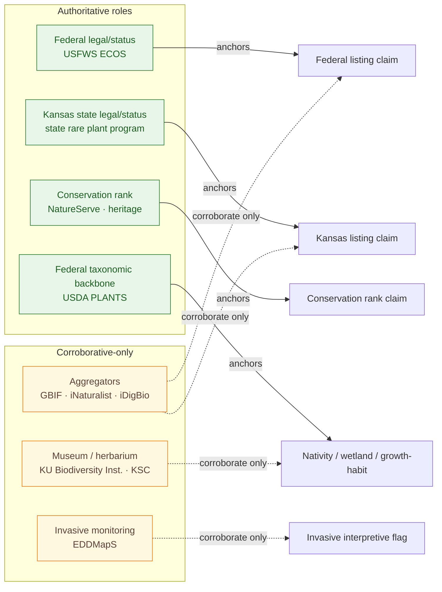
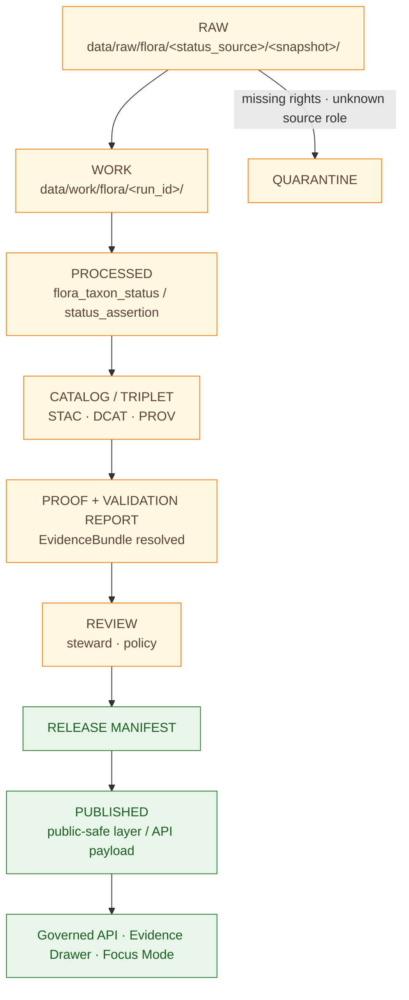

<!-- [KFM_META_BLOCK_V2]
doc_id: kfm://doc/<UUID-PLACEHOLDER>
title: Flora — Status and Listing
type: standard
version: v0.1
status: draft
owners: <flora-steward> · <docs-maintainer>
created: 2026-05-08
updated: 2026-05-08
policy_label: public
related:
  - docs/domains/flora/README.md
  - docs/domains/flora/ARCHITECTURE.md
  - docs/domains/flora/SOURCE_REGISTRY.md
  - docs/domains/flora/DATA_MODEL.md
  - docs/domains/flora/PIPELINES_AND_LIFECYCLE.md
  - docs/domains/flora/PUBLICATION_AND_POLICY.md
  - docs/domains/flora/UI_AND_EVIDENCE_DRAWER.md
  - docs/domains/flora/adr/ADR-flora-schema-home.md
  - docs/domains/flora/adr/ADR-flora-source-roles.md
  - docs/domains/flora/adr/ADR-flora-sensitive-location-policy.md
tags: [kfm, flora, status, listing, conservation, esa, natureserve, listing-tracking]
notes:
  - PROPOSED placement under docs/domains/flora/tracking/ — NEEDS VERIFICATION against Directory Rules.
  - Doctrine CONFIRMED from flora & fauna architecture blueprints; flora-specific status schema name INFERRED by analogy with fauna_species_status.
[/KFM_META_BLOCK_V2] -->

# 🌱 Flora — Status and Listing

> Govern how KFM represents plant **legal listings**, **conservation ranks**, and **interpretive status flags** (nativity, invasiveness, cultivated) so authoritative status claims are sourced, scoped, time-aware, and published without collapsing into occurrence evidence, modeled range, or aggregator opinions.


| Field         | Value                                                                                  |
| ------------- | -------------------------------------------------------------------------------------- |
| **Owners**    | `<flora-steward>` · `<docs-maintainer>` *(placeholders — assign before publish)*       |
| **Status**    | Draft — doctrine grounded; implementation PROPOSED                                     |
| **Authority** | Topical doc within the flora domain; not a schema, contract, or policy file            |
| **Path**      | `docs/domains/flora/tracking/STATUS_AND_LISTING.md` *(PROPOSED — see [§2](#2-repo-fit-and-placement-caveat))* |

**Quick jumps:** [Scope](#1-scope) · [Repo fit](#2-repo-fit-and-placement-caveat) · [Status objects](#3-status-object-families) · [Source-role discipline](#4-source-role-discipline-for-status-claims) · [Status types](#5-status-types) · [Hard separations](#6-hard-separations) · [Lifecycle](#7-status-lifecycle) · [Sensitivity](#8-sensitivity-and-public-safety) · [Schemas](#9-schemas-and-contracts) · [Policy gates](#10-policy-gates) · [Change tracking](#11-tracking-status-changes-over-time) · [Open questions](#12-verification-backlog) · [Related](#13-related-docs)

---

## 1. Scope

**In scope.**

- Federal legal/status (USFWS ECOS / ESA listings, candidate/proposed, references to critical habitat *as references*, not as habitat truth).
- Kansas state legal/status for plants *(specific Kansas plant authority — NEEDS VERIFICATION; the wildlife pathway via KDWP does not transfer directly to plants)*.
- Conservation rank (NatureServe global / national / state ranks; state heritage program outputs where licensed).
- Interpretive status flags — **jurisdiction- and time-aware**: nativity (native / introduced), invasiveness, cultivated.
- Source-role discipline: which source families may **anchor** which kind of status claim, and which may only **corroborate**.
- Lifecycle for status assertions, including time-aware revision and publication eligibility.
- Sensitivity controls when listing or rank implies rare-plant location risk.

**Out of scope.**

- Plant occurrence and specimen records → see `DATA_MODEL.md`, `PIPELINES_AND_LIFECYCLE.md`.
- Modeled range, habitat suitability, vegetation index → separate object families.
- Critical-habitat *geometry* as habitat truth — this lane links to USFWS critical-habitat references but treats them as **regulatory references**, not as modeled or observed habitat.
- General publication mechanics (badges, drawer payload schema, layer descriptors) → see `PUBLICATION_AND_POLICY.md`, `UI_AND_EVIDENCE_DRAWER.md`.

## 2. Repo fit and placement caveat

> [!IMPORTANT]
> **Placement is PROPOSED.** The current flora architecture blueprint proposes flora docs at the flat path `docs/domains/flora/` — entries such as `README.md`, `ARCHITECTURE.md`, `DATA_MODEL.md`, `PUBLICATION_AND_POLICY.md`, etc. A `tracking/` subdirectory **is not documented** in that blueprint and **NEEDS VERIFICATION** against Directory Rules and current repo conventions. If no ADR endorses `docs/domains/flora/tracking/`, consider relocating this file to `docs/domains/flora/STATUS_AND_LISTING.md` to preserve the documented home and avoid creating a parallel doc layout.

**Upstream — where status content originates** *(all PROPOSED until verified in the repo)*:

- `data/registry/flora/sources.yaml` — source descriptors with role, rights, cadence.
- `data/registry/flora/source_roles.yaml` — allowed source-role enumeration.
- `data/registry/flora/taxon_authorities.yaml` — accepted taxon authority precedence.
- `data/registry/flora/sensitivity_policies.yaml` — rare/protected/cultural rules.
- `data/raw/flora/<status_source>/<snapshot>/` — federal / state / heritage status snapshots.

**Downstream — where status claims surface** *(all PROPOSED)*:

- Governed API: `GET /flora/taxa/{taxon_id}` — status refs alongside taxon identity.
- Governed API: `GET /flora/evidence/{bundle_id}` — resolves a status assertion's `EvidenceRefs`.
- Layer descriptors — status-aware filters in the flora layer registry.
- Evidence Drawer / Focus Mode — status badges and authority chips.

## 3. Status object families

The flora architecture flags **status / policy / review** as a distinct object family that must remain separate from occurrence, naming, model, and habitat objects.

| Object family                                                | Purpose                                                                                  | Why it must stay distinct                                  | Truth label |
| ------------------------------------------------------------ | ---------------------------------------------------------------------------------------- | ---------------------------------------------------------- | ----------- |
| `flora_taxon_status`                                         | Anchor between an accepted taxon and one or more status assertions                       | Status is *about* a taxon; it is not the taxon itself      | PROPOSED    |
| `status_assertion`                                           | A single jurisdiction-scoped, source-anchored status claim with validity dates           | Each authority/jurisdiction/scope yields its own row       | PROPOSED    |
| `policy_decision`                                            | Publication / release decision tied to a status assertion                                | Distinguishes *truth* from *publication eligibility*       | PROPOSED    |
| `review_record`                                              | Steward review event covering a status assertion or rare-plant policy                    | Governance event, not data                                 | PROPOSED    |
| `origin_status` / `invasive_status` / `cultivated_flag`      | Interpretive status that varies by jurisdiction and time                                 | Not a regulatory listing; not occurrence                    | PROPOSED    |
| `redaction_receipt`                                          | Geoprivacy / generalization receipt when listed status implies sensitive location        | Required for rare-plant publication paths                  | PROPOSED    |

> [!NOTE]
> The fauna architecture defines an analogous `fauna_species_status.schema.json` carrying *taxon_id, status_code, jurisdiction/scope, source_role, source_id, evidence_refs, date*. **By analogy, this doc PROPOSES** that flora adopt the same shape under `flora_species_status` (or an equivalent name confirmed in `ADR-flora-schema-home.md`). The flora blueprint's published schema-wave does not yet enumerate this schema explicitly — it is **INFERRED** from the flora object-family scope plus fauna precedent.

## 4. Source-role discipline for status claims

> [!CAUTION]
> **Authority is bounded, not transitive.** A federal legal/status authority is **not** a Kansas state authority. A conservation-rank authority is **not** a legal authority. An occurrence aggregator is **never** a legal-status authority. Policies must deny any attempt to use a source outside its role; unknown rights **fail closed**.



| Source-role class                  | Examples                                                                | Allowed authority scope                                          | Default publication posture                                  |
| ---------------------------------- | ----------------------------------------------------------------------- | ---------------------------------------------------------------- | ------------------------------------------------------------ |
| Federal legal/status authority     | USFWS ECOS Species Data Explorer; critical-habitat references           | Federal ESA / listing context only; **not** Kansas legal         | BLOCKED until endpoint, schema, terms verified               |
| Kansas legal/status authority      | State rare plant program *(specific Kansas authority NEEDS VERIFICATION)* | Kansas listing/status only; **not** federal authority            | BLOCKED until source URL, terms, cadence, steward use verified |
| Conservation-status authority      | NatureServe Explorer; state heritage outputs where licensed             | Conservation rank within licensed/public scope; **not** legal    | Public-resolution only unless license / steward review allow more |
| Federal taxonomic backbone         | USDA PLANTS (Complete Checklist + state/county distribution)            | Taxonomy + nativity / wetland / growth habit                     | Public-domain attribution end-to-end                         |
| Occurrence aggregator              | GBIF; iNaturalist; iDigBio; BISON-class portals                         | **Corroboration only**; never legal authority                    | Record-level rights / geoprivacy required                    |
| Museum / specimen collection       | KU Biodiversity Institute; KSC; herbaria                                | Specimen evidence with collection metadata                       | Respect collection rights; sensitive locality may be restricted |
| Community science observation     | iNaturalist; project datasets                                           | Observation evidence with quality filters; never legal           | License + sensitivity gating                                 |
| Invasive species monitoring        | EDDMapS                                                                 | Invasive detection / verification context only                   | Public if terms allow + no sensitive detail                  |

## 5. Status types

### 5.1 Federal legal status — `status_kind: federal_legal`

- **Authority.** USFWS ECOS / Species Data Explorer (status, listing date, references to critical habitat).
- **Scope.** ESA listing, candidate, proposed, recovery, delisted, etc.
- **Boundary.** Federal status alone does **not** establish Kansas state status.
- **Publication.** Public legal status is generally publishable after endpoint, schema, terms, and citation are verified.
- **Verification gap.** Endpoint schemas, service versions, citation strings — **NEEDS VERIFICATION** before connector activation.

### 5.2 Kansas state legal/status — `status_kind: state_legal`

- **Authority.** Kansas state rare plant authority — **NEEDS VERIFICATION**. KDWP serves wildlife, not plants; the canonical Kansas plant authority must be confirmed (and in the registry) before any state plant listing claim is anchored.
- **Scope.** State-listed threatened / endangered / SINC-equivalent / watch designations for plants in Kansas.
- **Boundary.** State status alone does **not** establish federal status; conservation rank does **not** equal legal listing.
- **Publication.** BLOCKED by default until source URL, terms, rights, cadence, steward use, and sensitivity are verified.

### 5.3 Conservation rank — `status_kind: conservation_rank`

- **Authority.** NatureServe Explorer (global / national / state ranks); state natural heritage program outputs where licensed.
- **Scope.** Methodological rarity / imperilment classification — **not** a legal listing.
- **Boundary.** A high-imperilment rank is **not** a legal protection; legal status must come from a legal authority.
- **Publication.** Public-resolution data only unless licensed access and steward review allow more; precise locations remain controlled.

### 5.4 Interpretive status — `status_kind: interpretive`

- **Native / introduced.** Per USDA PLANTS `nativeStatus` — jurisdiction-aware (a taxon may be native in one state and introduced in another). Time-aware: determinations can shift with new evidence.
- **Invasive.** Jurisdiction-aware regulatory or interpretive flag. **Listed noxious weed** (regulatory) and **invasive** (interpretive) are *not* interchangeable.
- **Cultivated.** Distinguishes garden / ornamental presence from wild occurrence; affects whether an occurrence counts toward range support.

> [!TIP]
> Interpretive flags are **statements about a taxon-in-context**, not laws. Always carry the jurisdiction (`scope: state=KS` or `scope: county=Ellis,KS`) and the source authority. The same plant can carry contradictory interpretive flags across jurisdictions — that is expected and must be representable, not flattened.

## 6. Hard separations

The flora architecture is explicit that the system **forbids collapsing** observed occurrence, institutional / specimen evidence, modeled range or suitability, regulatory / stewardship context, generalized public-safe display, and AI explanation payload. The status-and-listing layer adds these specific separations:

| Forbidden collapse                                              | Why it is forbidden                                                                | Reason code (PROPOSED)                       |
| --------------------------------------------------------------- | ---------------------------------------------------------------------------------- | -------------------------------------------- |
| Federal legal status used as Kansas state status                | Two separate jurisdictions, two separate authorities                               | `wrong_jurisdiction_authority`               |
| NatureServe rank used as legal listing                          | Conservation rank is methodological, not regulatory                                | `rank_treated_as_legal`                      |
| Occurrence aggregator used as status authority                  | Aggregators carry occurrence evidence, not regulatory authority                    | `aggregator_not_authority`                   |
| Modeled habitat used as critical habitat                        | Critical habitat is a regulatory designation, not a model output                   | `model_as_critical_habitat`                  |
| Listed noxious weed conflated with invasiveness flag            | Regulatory listing vs. interpretive flag — different evidence and review burdens   | `regulatory_vs_interpretive_collapse`        |
| Status assertion published without an EvidenceBundle ref        | Cite-or-abstain is the default truth posture                                       | `ai_missing_evidence_bundle_or_citations`    |
| Listed/rare taxon published with precise location               | Geoprivacy required for sensitive flora                                            | `precise_sensitive_location_denied`          |

## 7. Status lifecycle

Status assertions follow the canonical KFM lifecycle, with status-specific gates added at promotion and publication.



**Required at each gate** *(PROPOSED, drawn from flora promotion gates A–G in the flora blueprint)*:

| Gate | Requirement                                                                                                |
| ---- | ---------------------------------------------------------------------------------------------------------- |
| A    | Schema valid for the status-assertion shape.                                                               |
| B    | License / rights compliant for the status source.                                                          |
| C    | Provenance complete — source descriptor + `EvidenceBundle` resolves.                                       |
| D    | Taxon resolved — no ambiguous identity; ambiguous → ABSTAIN / HOLD.                                        |
| E    | Jurisdiction and scope present and matched to the source's authority boundary.                             |
| F    | Temporal validity — `valid_from` set; conflicts with prior assertions surfaced, not silently overwritten.  |
| G    | Evidence Drawer renders correctly with status badge, authority chip, and citation.                         |

> [!WARNING]
> **Public clients consume governed APIs and published artifacts only.** No public route may read directly from `data/raw/`, `data/work/`, `data/quarantine/`, or unpublished candidates. This applies in full to status content.

## 8. Sensitivity and public safety

Listed and ranked plants frequently carry **HIGH sensitivity** because the listing itself can attract collection or disturbance pressure.

- Default for rare / protected / culturally sensitive flora: **DENY exact public geometry** unless rights, policy, and review explicitly allow it.
- Prefer generalized geometry, withheld geometry, denied publication, staged access, or delayed publication for sensitive listed taxa.
- Preserve transform lineage in **redaction / geoprivacy receipts** — record method, precision bucket, grid / region, input digest, output digest, reason code.
- The status assertion itself may be public (the *fact* of a listing) even when occurrence locations are restricted (the *places*).

> [!IMPORTANT]
> **The listing is not the location.** A federal threatened listing is generally publishable; a precise occurrence point of a federally threatened plant is generally not. Keep these decisions separate, with separate receipts and separate review trails.

## 9. Schemas and contracts

| Schema (PROPOSED path)                                                                              | Purpose                                                                                                  | Status               | Notes                                                                                                       |
| --------------------------------------------------------------------------------------------------- | -------------------------------------------------------------------------------------------------------- | -------------------- | ----------------------------------------------------------------------------------------------------------- |
| `contracts/flora/flora_taxon.schema.json` *or* `schemas/contracts/v1/flora/flora_taxon.schema.json` | Accepted flora taxon identity, status pointers                                                           | PROPOSED             | Schema-home contested between `contracts/` and `schemas/contracts/v1/`; resolve in `ADR-flora-schema-home.md`. |
| `contracts/flora/flora_taxon_crosswalk.schema.json`                                                 | Raw / accepted / synonym / common / historical-name crosswalk                                            | PROPOSED             | Time-aware identity bridge (`valid_from` / `valid_to`).                                                     |
| `flora_species_status.schema.json` *(name PROPOSED)*                                                | Status assertion: jurisdiction, scope, source role, source id, status code, evidence refs, validity     | PROPOSED · INFERRED  | Not enumerated in the flora blueprint's schema-wave; INFERRED by analogy with `fauna_species_status.schema.json`. |
| `contracts/flora/flora_source_descriptor.schema.json`                                               | Machine-readable source registry entry                                                                   | PROPOSED             | Required fields include `source_role`, `rights_license_terms`, `sensitivity_posture`.                       |
| `contracts/flora/flora_evidence_bundle.schema.json`                                                 | Release / runtime evidence bundle resolved from `EvidenceRefs`                                           | PROPOSED             | Reuse the shared `EvidenceBundle` shape if one exists in the repo.                                          |
| `contracts/flora/flora_redaction_receipt.schema.json`                                               | Geoprivacy / generalization / withholding transform receipt                                              | PROPOSED             | Required when listed-status occurrences are generalized for public release.                                 |

> [!NOTE]
> **Schema-home decision required.** The flora blueprint flags an unresolved choice between `contracts/flora/*.schema.json` and `schemas/contracts/v1/flora/*.schema.json`. This document does **not** decide it; `ADR-flora-schema-home.md` must.

## 10. Policy gates

The flora blueprint defines deny / quarantine cases that apply directly to status content. The most relevant for status and listing:

- `wrong_jurisdiction_authority` — a federal source used to anchor a Kansas claim, or vice versa → **DENY**.
- `aggregator_not_authority` — GBIF / iNaturalist / iDigBio used as a legal-status source → **DENY**.
- `rank_treated_as_legal` — NatureServe rank presented as legal listing → **DENY**.
- `missing_rights` / `unknown_rights` — **ABSTAIN** runtime; **DENY** publication.
- `missing_source_id` / `missing_evidence_bundle` — **DENY** consequential publication.
- `ambiguous_taxon_identity` / `accepted_taxon_required` — **DENY** or **QUARANTINE**.
- `precise_sensitive_location_denied` / `geoprivacy_required` — **DENY**; require redaction receipt.
- `review_required` / `steward_review_missing` — **DENY** publication.
- `ai_missing_evidence_bundle_or_citations` — **DENY** uncited AI flora answers.

> Reason-code spellings above are **PROPOSED** and align with the flora blueprint's policy deny / quarantine examples; finalization belongs in `policy/flora/*.rego` with parity tests in `tests/flora/`.

## 11. Tracking status changes over time

Status assertions are **time-aware**, like taxon crosswalks. A given taxon can carry many concurrent assertions across jurisdictions and many sequential assertions within a jurisdiction.

- Each assertion records `valid_from` (and optionally `valid_to`) per the source authority's terms.
- Re-pulls of a status source produce **idempotent deltas**: same authority + same scope + same effective dates collapse to a single assertion; different effective dates produce new rows.
- Identity uses **JSON Canonicalization (JCS)** over the spec; the retrieval timestamp is **excluded** from `spec_hash`.
- Conflicts — for example a state list contradicting a federal list, or a NatureServe rank disagreeing with a heritage program output — are **surfaced**, not smoothed: each assertion stands by its own authority and its own `EvidenceBundle`.
- Listing changes (new listing, delisting, reclassification) produce a **new assertion**. If a published artifact must be re-issued, a `correction_notice` accompanies it; rollback uses the standard `RollbackCard` pattern. Existing receipts and proofs are **preserved** through correction and rollback.

<details>
<summary><b>Illustrative status-assertion shape (NOT a schema; for orientation only)</b></summary>

```json
{
  "status_assertion_id": "kfm://flora/status/sha256:<hash>",
  "taxon_id": "kfm://flora/taxon/<authority>/<id>",
  "status_kind": "federal_legal",
  "status_code": "<authority-specific code>",
  "jurisdiction": "US",
  "scope": { "level": "national" },
  "source_role": "official",
  "source_id": "<source descriptor id>",
  "valid_from": "YYYY-MM-DD",
  "valid_to": null,
  "evidence_refs": ["kfm://evidence/..."],
  "review_state": "released | review_pending | quarantine",
  "spec_hash": "sha256:<...>"
}
```

This sketch is **illustrative**. Field names, codes, and required-vs-optional flags must come from the eventual `flora_species_status.schema.json` (or the equivalent name chosen in ADR) — not from this doc.

</details>

## 12. Verification backlog

Open verification items specific to status and listing. These belong on the flora `VERIFICATION_BACKLOG.md` once that doc exists.

- [ ] **Kansas plant legal authority.** Identify the canonical Kansas state authority for plant listings and confirm it is **not** the wildlife pathway (KDWP). NEEDS VERIFICATION.
- [ ] **USFWS ECOS endpoints.** Confirm Species Data Explorer endpoints, schemas, terms, cadence, and citation format. NEEDS VERIFICATION.
- [ ] **NatureServe access class.** Resolve where NatureServe outputs sit in the lifecycle and what license / distribution controls apply. UNKNOWN per flora blueprint.
- [ ] **`flora_species_status` schema.** Confirm the schema name and decide `contracts/flora/` vs `schemas/contracts/v1/flora/` via `ADR-flora-schema-home.md`. PROPOSED.
- [ ] **`tracking/` subdirectory.** Confirm whether `docs/domains/flora/tracking/` is endorsed by Directory Rules, or relocate this doc to `docs/domains/flora/STATUS_AND_LISTING.md`. PROPOSED placement.
- [ ] **Reason-code vocabulary.** Finalize policy reason codes in `policy/flora/*.rego` with fixture parity in `tests/flora/`.
- [ ] **Steward / owner assignments.** `CODEOWNERS` entries for status content. UNKNOWN.
- [ ] **NatureServe publication boundary.** Confirm whether NatureServe rank text is publishable in the Evidence Drawer or only summarized; record the decision in `ADR-flora-public-layer-strategy.md`.

## 13. Related docs

- [`docs/domains/flora/README.md`](../README.md) *(PROPOSED)* — flora lane entrypoint.
- [`docs/domains/flora/ARCHITECTURE.md`](../ARCHITECTURE.md) *(PROPOSED)* — full lane architecture.
- [`docs/domains/flora/SOURCE_REGISTRY.md`](../SOURCE_REGISTRY.md) *(PROPOSED)* — human-readable source registry guide.
- [`docs/domains/flora/DATA_MODEL.md`](../DATA_MODEL.md) *(PROPOSED)* — object families, IDs, relations.
- [`docs/domains/flora/PIPELINES_AND_LIFECYCLE.md`](../PIPELINES_AND_LIFECYCLE.md) *(PROPOSED)* — RAW → PUBLISHED lifecycle.
- [`docs/domains/flora/PUBLICATION_AND_POLICY.md`](../PUBLICATION_AND_POLICY.md) *(PROPOSED)* — rights, sensitivity, publication.
- [`docs/domains/flora/UI_AND_EVIDENCE_DRAWER.md`](../UI_AND_EVIDENCE_DRAWER.md) *(PROPOSED)* — drawer payload contract.
- [`docs/domains/flora/adr/ADR-flora-schema-home.md`](../adr/ADR-flora-schema-home.md) *(PROPOSED)* — schema-home decision.
- [`docs/domains/flora/adr/ADR-flora-source-roles.md`](../adr/ADR-flora-source-roles.md) *(PROPOSED)* — source-role discipline.
- [`docs/domains/flora/adr/ADR-flora-sensitive-location-policy.md`](../adr/ADR-flora-sensitive-location-policy.md) *(PROPOSED)* — sensitive-location policy.

[⬆ Back to top](#-flora--status-and-listing)
