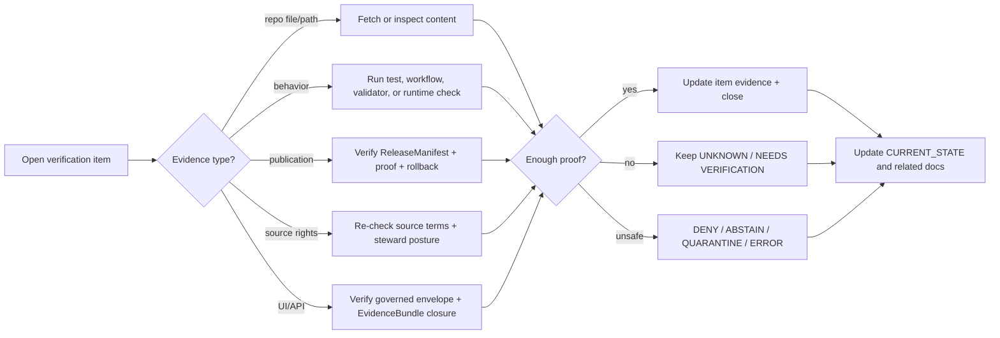

<!-- [KFM_META_BLOCK_V2]
doc_id: kfm://doc/NEEDS-VERIFICATION__docs-domains-flora-tracking-verification-backlog
title: Flora Verification Backlog
type: standard
version: v1
status: draft
owners: NEEDS-VERIFICATION__flora-steward
created: NEEDS-VERIFICATION__existing-file
updated: 2026-05-08
policy_label: NEEDS-VERIFICATION__public-doc-no-sensitive-source-data
related: [docs/domains/flora/CURRENT_STATE.md, docs/domains/flora/README.md, docs/domains/flora/usda_plants/README.md, contracts/source/kansas_flora/README.md, schemas/flora/README.md, policy/flora/usda_plants_review.rego, docs/registers/domain_file_index.md, docs/registers/domain_doc_index.md]
tags: [kfm, flora, verification, tracking, evidence, governance, backlog]
notes: [doc_id, owner, created date, and policy label remain reviewable placeholders until steward and CODEOWNERS evidence are verified., This backlog tracks evidence required before stronger Flora implementation, CI, release, API, UI, and publication claims are made., Public-sensitive flora details, exact rare-plant locations, credentials, raw source payloads, and controlled-access records do not belong in this file.]
[/KFM_META_BLOCK_V2] -->

<a id="top"></a>

# Flora Verification Backlog

Evidence-first backlog for closing KFM Flora gaps without upgrading proposals, search-visible files, policy assets, or helper names into implementation proof.


> [!IMPORTANT]
> **Status:** `draft`  
> **Owners:** `NEEDS-VERIFICATION__flora-steward`  
> **Path:** `docs/domains/flora/tracking/VERIFICATION_BACKLOG.md`  
> **Document role:** tracking ledger for verification work, not a release proof, roadmap, schema, policy gate, source registry, or runtime claim.  
> **Evidence posture:** file/path presence is not behavior proof. Close items only with inspectable repository, test, workflow, runtime, receipt, proof, release, or steward-review evidence.

**Quick jumps:** [Scope](#scope) · [Backlog rules](#backlog-rules) · [Current evidence snapshot](#current-evidence-snapshot) · [Priority model](#priority-model) · [Backlog map](#backlog-map) · [P0 blockers](#p0--claim-guard-blockers) · [P1 proof gates](#p1--proof-before-publication-gates) · [P2 hardening](#p2--source-lane-and-runtime-hardening) · [P3 polish](#p3--documentation-polish-and-maintenance) · [Refresh commands](#refresh-commands) · [Closure protocol](#closure-protocol)

---

## Scope

This file tracks the evidence needed before the Flora lane can responsibly make stronger claims about implementation, policy enforcement, source activation, public publication, governed API behavior, MapLibre rendering, Evidence Drawer payloads, Focus Mode behavior, CI coverage, or release maturity.

It preserves the KFM rule that the durable public unit of value is the inspectable claim: a statement traceable to source role, evidence, spatial and temporal scope, rights, sensitivity, review state, release state, correction lineage, and rollback target.

### This backlog owns

| Area | What belongs here | Close condition |
|---|---|---|
| Repository-state gaps | Things that must be checked in a real checkout or connector fetch before making repo-shaped claims. | Path/content/test/workflow evidence recorded and linked. |
| Flora verification tasks | Schema, source, policy, fixtures, validators, UI/API, publication, and release checks for the Flora lane. | Evidence label upgraded only after direct proof. |
| Sensitive-publication blockers | Rare-plant, controlled-access, exact-geometry, rights, and steward-review checks. | Deny/default posture remains until review and transform evidence exist. |
| Cross-surface drift | Conflicts among docs, contracts, schemas, policy, tools, release, and UI surfaces. | ADR, migration note, or authoritative repo convention resolves the conflict. |
| Regression targets | Negative-path tests that must continue to fail unsafe behavior. | Fixture and validator/policy evidence proves the unsafe path is denied, abstained, quarantined, or errored. |

### This backlog does not own

- Source data, raw downloads, fixtures, schemas, Rego rules, validators, generated proofs, release manifests, published artifacts, UI components, route handlers, credentials, or runtime logs.
- Exact sensitive plant locations or controlled-access biodiversity records.
- Claims that a source is live, authoritative, current, public, promoted, released, or rendered unless a linked proof shows it.

[Back to top](#top)

---

## Backlog rules

Use these rules when adding, updating, or closing a backlog item.

| Rule | Requirement |
|---|---|
| **Evidence before confidence** | Do not close an item because a path name sounds complete. Inspect file content, test results, workflows, receipts, proofs, or runtime output. |
| **Narrowest truthful label wins** | Use `CONFIRMED`, `INFERRED`, `PROPOSED`, `UNKNOWN`, or `NEEDS VERIFICATION` without upgrading uncertainty through wording. |
| **Policy assets are not enforcement proof** | A Rego file can exist without proving CI, runtime PDP, branch rules, or protected environments enforce it. |
| **Tool names are not behavior proof** | A file named `publication`, `release`, `deployment`, `watcher`, or `live_fetcher` must not be treated as active behavior until execution and policy evidence are verified. |
| **Public Flora fails closed** | Unknown rights, unknown sensitivity, unresolved source role, exact sensitive geometry, or missing review state blocks public release. |
| **No direct public path** | Public UI, API, exports, Focus Mode, and map layers must not read `RAW`, `WORK`, `QUARANTINE`, unpublished candidates, canonical internals, or direct model output. |
| **Receipts, proofs, catalogs, releases stay separate** | A run receipt is process memory. It is not a proof pack, release manifest, rollback card, or publication decision. |
| **Closure must be reversible** | A closed item that affects public state must identify rollback or correction evidence. |

---

## Current evidence snapshot

The snapshot below records what the latest evidence pass could and could not verify. It is intentionally conservative.

| Surface | Current label | What is known | What remains open |
|---|---:|---|---|
| Target backlog file | **CONFIRMED** | `docs/domains/flora/tracking/VERIFICATION_BACKLOG.md` exists and previously contained a compact high/medium/low checklist. | It needed richer metadata, priority gates, closure criteria, and repo-grounded tracking. |
| Flora current-state ledger | **CONFIRMED** | `../CURRENT_STATE.md` exists and distinguishes GitHub connector evidence from local checkout limits. | It still leaves runtime, CI, branch protection, tests, dashboards, and public release state as unknown unless separately verified. |
| Flora doc grouping | **CONFIRMED / CONFLICTED** | The domain file index groups Flora docs under `architecture/`, `governance/`, `operations/`, `registers/`, and `tracking/`. | Older/root-level README links and related metadata need reconciliation. |
| Source contracts | **CONFIRMED / bounded** | `../../../../contracts/source/kansas_flora/README.md` exists and defines source-admission posture. | Machine registry home, source activation state, and source-specific rights still need verification. |
| Schema surface | **CONFIRMED / NEEDS VERIFICATION** | `../../../../schemas/flora/README.md` exists and frames Flora schemas, but also marks schema-home authority as unresolved. | ADR-backed schema home and shared-object reuse need verification. |
| Policy asset | **CONFIRMED / bounded** | `../../../../policy/flora/usda_plants_review.rego` exists and denies publication/promotion overclaims, missing hashes, coordinate/geometry leaks, and bad USDA rights fields. | CI/runtime enforcement and policy tests remain unverified. |
| USDA PLANTS source lane | **CONFIRMED docs / bounded behavior** | `../usda_plants/README.md` documents no-network fixture flow, guarded live posture, scheduled-observer limits, and controlled publication requirements. | Live source activation, scheduled workflow enforcement, public publication, and release maturity remain unproven. |
| Tests and fixtures | **UNKNOWN** | No Flora test run is recorded in this file. | Verify `tests/flora`, `tests/fixtures/flora`, invalid fixtures, and repo-native test targets. |
| Runtime/API/UI | **UNKNOWN** | No governed API route, MapLibre layer registry, Evidence Drawer, Focus Mode, dashboard, or runtime log was verified here. | Inspect apps/UI packages, DTOs, OpenAPI contracts, tests, runtime envelopes, and logs. |
| Public release | **UNKNOWN / not claimed** | No release manifest, proof pack, rollback card, public artifact, or deployment state is verified here. | Verify release roots, catalogs, proofs, receipts, published artifacts, and rollback targets. |

[Back to top](#top)

---

## Priority model

| Priority | Meaning | Default outcome |
|---|---|---|
| **P0** | Claim-guard blockers. Must be resolved before stronger repo or implementation claims are made. | Keep claims `UNKNOWN` or `NEEDS VERIFICATION`. |
| **P1** | Proof-before-publication gates. Must pass before public-safe Flora artifacts, UI layers, or Focus answers are claimed. | Deny, abstain, quarantine, or hold release. |
| **P2** | Source-lane and runtime hardening. Required before live source activation, scheduled observation, deployment, or sustained operations. | Keep manual/fixture-only posture. |
| **P3** | Documentation polish and maintenance. Improves clarity after trust gates are under control. | Track as normal docs work. |

---

## Backlog map



---

## P0 — claim-guard blockers

These items block stronger claims about the Flora lane.

| ID | Item | Current label | Evidence needed | Acceptance gate |
|---|---|---:|---|---|
| FLORA-VB-P0-001 | Verify current checkout state. | **NEEDS VERIFICATION** | `git status`, branch, commit SHA, and repo root from a mounted checkout or authoritative connector evidence. | `../CURRENT_STATE.md` records commit SHA and working tree state before implementation claims. |
| FLORA-VB-P0-002 | Reconcile grouped Flora doc layout with README and meta-block links. | **NEEDS VERIFICATION** | Compare `../README.md`, `../CURRENT_STATE.md`, `../../../registers/domain_file_index.md`, and actual tree. | Links either resolve or are marked proposed/redirected with migration notes. |
| FLORA-VB-P0-003 | Resolve Flora schema-home authority. | **NEEDS VERIFICATION / CONFLICTED** | ADR or repo convention showing whether Flora machine schemas live in `schemas/flora/`, `schemas/contracts/v1/flora/`, `contracts/flora/`, or another canonical home. | No parallel schema authority remains; compatibility aliases are documented. |
| FLORA-VB-P0-004 | Verify source registry home and source descriptor activation state. | **NEEDS VERIFICATION** | Inspect `data/registry/flora/`, `control_plane/`, source descriptor registers, and contracts. | Source contracts and machine descriptors are linked without claiming activation prematurely. |
| FLORA-VB-P0-005 | Inventory shared governance objects before adding Flora forks. | **NEEDS VERIFICATION** | Search/fetch shared `SourceDescriptor`, `EvidenceBundle`, `DecisionEnvelope`, `RuntimeResponseEnvelope`, `RunReceipt`, `ReleaseManifest`, `CatalogMatrix`, `PolicyDecision`, and `LayerManifest`. | Flora schemas reference or profile shared objects where they exist. |
| FLORA-VB-P0-006 | Confirm policy engine and CI wiring for Flora policy assets. | **NEEDS VERIFICATION** | Workflow YAML, OPA/Conftest invocation, test fixtures, required checks, or runtime PDP proof. | `policy/flora/*.rego` is described as enforced only after workflow/runtime evidence exists. |
| FLORA-VB-P0-007 | Inventory Flora tests and fixtures. | **NEEDS VERIFICATION** | `tests/flora`, `tests/fixtures/flora`, schema tests, policy tests, and negative-path fixtures. | Current-state ledger names test paths and latest run outcome, or keeps test coverage unknown. |
| FLORA-VB-P0-008 | Audit USDA PLANTS helper tools for live-network and publication behavior. | **NEEDS VERIFICATION** | Inspect `tools/**/flora/*usda_plants*.py`, watcher paths, release/publication helpers, and flags. | Docs distinguish fixture-only, manual guarded, observe-only, and publication-capable code paths. |
| FLORA-VB-P0-009 | Verify ownership and stewardship metadata. | **NEEDS VERIFICATION** | `CODEOWNERS`, steward registry, governance docs, or maintainer assignment. | Replace metadata owner placeholders or keep them visibly unresolved. |
| FLORA-VB-P0-010 | Confirm no public claim depends on raw, work, quarantine, or unpublished candidate paths. | **NEEDS VERIFICATION** | Grep docs, schemas, policy, tests, release manifests, API payloads, UI layer descriptors. | Public surfaces point only to released/governed artifacts or abstain. |

[Back to top](#top)

---

## P1 — proof-before-publication gates

These items must be proven before Flora public artifacts, UI payloads, map layers, or Focus Mode answers are claimed.

| ID | Item | Current label | Evidence needed | Acceptance gate |
|---|---|---:|---|---|
| FLORA-VB-P1-001 | Add or confirm no-network source descriptor fixtures. | **NEEDS VERIFICATION** | Valid and invalid fixtures for USDA PLANTS and at least one non-USDA source descriptor, if admitted. | Missing source role, unknown rights, missing cadence, or unknown sensitivity fails. |
| FLORA-VB-P1-002 | Add or confirm taxon identity and crosswalk fixtures. | **NEEDS VERIFICATION** | Valid/invalid taxon and synonym/crosswalk examples. | Unresolved accepted taxon or unsupported merge cannot silently validate as public truth. |
| FLORA-VB-P1-003 | Add or confirm occurrence/specimen evidence fixtures. | **NEEDS VERIFICATION** | Occurrence and specimen fixtures with source, time, geometry precision, uncertainty, rights, sensitivity, and review state. | Exact sensitive public geometry is denied unless authorized and transformed. |
| FLORA-VB-P1-004 | Define canonical reason-code set. | **NEEDS VERIFICATION** | Shared or Flora-profiled reason codes for `HOLD`, `DENY`, `ABSTAIN`, `ERROR`, `QUARANTINE`, and `REVIEW_REQUIRED`. | Policy, validator, API, Evidence Drawer, and Focus fixtures use the same reason vocabulary. |
| FLORA-VB-P1-005 | Establish sensitivity transform receipt schema. | **NEEDS VERIFICATION** | Schema/contract for redaction, generalization, withholding, county aggregation, or public-safe transform. | Any generalized public Flora geometry cites transform receipt and input evidence. |
| FLORA-VB-P1-006 | Add source-role validator coverage. | **NEEDS VERIFICATION** | Validator and fixtures for official, institutional, steward-reviewed, corroborative, community, controlled-access, derived-model, and generalized-public roles. | Unsupported authority claims are denied or abstained. |
| FLORA-VB-P1-007 | Add rights validator coverage. | **NEEDS VERIFICATION** | Unknown rights, bad rights holder, incompatible license, missing attribution, and redistribution-denied fixtures. | Unknown or incompatible rights block public release. |
| FLORA-VB-P1-008 | Add sensitivity validator coverage. | **NEEDS VERIFICATION** | Rare/protected/controlled exact-coordinate, county geometry, generalized geometry, and public-safe aggregate fixtures. | Sensitive exact locations fail closed. |
| FLORA-VB-P1-009 | Add evidence-closure validator coverage. | **NEEDS VERIFICATION** | EvidenceRef-to-EvidenceBundle fixtures, missing evidence refs, conflicting evidence refs, and citation closure checks. | Consequential Flora claims abstain when EvidenceBundle closure fails. |
| FLORA-VB-P1-010 | Add catalog/proof/release closure checks. | **NEEDS VERIFICATION** | STAC/DCAT/PROV or repo-native catalog records, proof refs, release manifest refs, digests, and rollback targets. | Public release cannot close with dangling refs or missing rollback. |
| FLORA-VB-P1-011 | Confirm governed API Flora response envelope. | **UNKNOWN** | Route/API contract or DTO evidence showing finite outcomes and no raw/internal paths. | API outputs `ANSWER`, `ABSTAIN`, `DENY`, or `ERROR` with evidence/policy references. |
| FLORA-VB-P1-012 | Confirm Evidence Drawer payload schema and fixtures. | **UNKNOWN** | Payload schema, valid/invalid fixtures, UI tests, or story fixtures. | Drawer displays source role, rights, sensitivity, review, freshness, redaction, evidence, and correction state. |
| FLORA-VB-P1-013 | Confirm MapLibre layer descriptor conventions. | **UNKNOWN** | Layer manifest/descriptor path and tests for public-safe metadata. | Style/layer metadata points to released artifacts and EvidenceBundle support; style is not truth. |
| FLORA-VB-P1-014 | Confirm Focus Mode finite-outcome fixtures. | **UNKNOWN** | Focus payload/response fixtures for `ANSWER`, `ABSTAIN`, `DENY`, and `ERROR`. | Focus cannot answer from raw data, direct model output, or unresolved evidence. |
| FLORA-VB-P1-015 | Confirm release artifact directories and rollback card home. | **NEEDS VERIFICATION** | `release/`, `data/proofs/`, `data/receipts/`, `data/catalog/`, `data/published/`, or repo-native release roots. | Release claims cite release manifest, proof pack, correction path, and rollback target. |

[Back to top](#top)

---

## P2 — source-lane and runtime hardening

These items prepare Flora for live-source readiness, scheduled observation, publication packaging, and cross-domain use.

| ID | Item | Current label | Evidence needed | Acceptance gate |
|---|---|---:|---|---|
| FLORA-VB-P2-001 | Re-check USDA PLANTS source terms and access paths before live activation. | **NEEDS VERIFICATION** | Current USDA PLANTS access path, terms, rights holder, redistribution posture, attribution, field stability, and cadence. | Live access remains disabled unless source descriptor and policy approve activation. |
| FLORA-VB-P2-002 | Re-check GBIF, KSC/IPT, herbarium, and steward-reviewed source terms before activation. | **NEEDS VERIFICATION** | Current endpoint/terms/rights/cadence/source-role records for each candidate source. | No non-USDA source is admitted without source role and rights/sensitivity review. |
| FLORA-VB-P2-003 | Verify scheduled observer remains observe-only. | **NEEDS VERIFICATION** | Workflow/tool inspection, generated alert artifacts, reviewer queue behavior, blocked actions. | Scheduled observation cannot auto-promote, auto-publish, or auto-open PRs unless explicitly approved by policy. |
| FLORA-VB-P2-004 | Verify guarded live watcher manual controls. | **NEEDS VERIFICATION** | Manual flag requirements, snapshot lock, diff artifacts, review handoff, policy denies for unsafe actions. | Guarded watcher emits receipts and review tasks, not public artifacts. |
| FLORA-VB-P2-005 | Verify county geometry publication gates. | **NEEDS VERIFICATION** | County geometry validation report, geometry audit ledger, publication approval, transform or public-safe rationale. | County geometry cannot be confused with exact occurrence or rare-location proof. |
| FLORA-VB-P2-006 | Verify static/PMTiles/package publication manifests. | **NEEDS VERIFICATION** | PMTiles package manifest, static site bundle manifest, cache integrity manifest, deployment execution plan, rollback plan. | Static deployment claims require digest, approval, audit, and rollback evidence. |
| FLORA-VB-P2-007 | Verify deployment audit ledger and public exposure posture. | **NEEDS VERIFICATION** | Deployment audit ledger, approval schema, access model, CSP/CORS/cache notes, public URL or artifact evidence. | Public exposure is documented, reversible, and release-backed. |
| FLORA-VB-P2-008 | Add cross-domain join notes with Habitat, Soil, Hydrology, and Fauna. | **PROPOSED / NEEDS VERIFICATION** | Cross-domain docs or relation contracts showing derived associations and source boundaries. | Joins remain derived and evidence-bound; no domain replaces another. |
| FLORA-VB-P2-009 | Verify drift detector and change alert schemas. | **NEEDS VERIFICATION** | Source drift detector behavior, change alert schema, alert fixtures, reviewer queue artifacts. | Alerts create reviewable deltas, not automatic public truth. |
| FLORA-VB-P2-010 | Confirm glossary and source-role vocabulary alignment across docs, schemas, and policy. | **NEEDS VERIFICATION** | Compare glossary, source contract, schema enums, policy rules, and UI/Focus reason codes. | One vocabulary controls source roles and finite outcomes. |
| FLORA-VB-P2-011 | Verify external-source refresh cadence. | **NEEDS VERIFICATION** | Reverification schedule or source register fields for each source family. | Stale-source behavior is explicit and visible to API/UI surfaces. |
| FLORA-VB-P2-012 | Verify correction/withdrawal path for published Flora products. | **NEEDS VERIFICATION** | Correction notice, rollback reference, release manifest supersession, public notice rule. | Corrections are traceable and cannot be replaced by silent regeneration. |

---

## P3 — documentation polish and maintenance

These items improve usability after evidence and policy gates are under control.

| ID | Item | Current label | Evidence needed | Acceptance gate |
|---|---|---:|---|---|
| FLORA-VB-P3-001 | Replace unresolved meta-block placeholders. | **NEEDS VERIFICATION** | Owner, doc ID, created date, and policy-label evidence. | Metadata is reviewable and consistent with adjacent docs. |
| FLORA-VB-P3-002 | Add compact changelog entries for backlog revisions. | **NEEDS VERIFICATION** | `CHANGELOG.md` or repo-native tracking convention. | Backlog changes are discoverable without reading diffs only. |
| FLORA-VB-P3-003 | Add glossary refinements after vocabulary stabilizes. | **PROPOSED** | `GLOSSARY.md`, source-role ADR, schema enums, policy reason codes. | Terms match actual contracts and tests. |
| FLORA-VB-P3-004 | Add contributor-facing issue template mapping. | **PROPOSED / NEEDS VERIFICATION** | Issue templates or project-board conventions. | New backlog items can be created consistently. |
| FLORA-VB-P3-005 | Re-check badges and relative links. | **NEEDS VERIFICATION** | Link checker or manual GitHub render review. | All confirmed links resolve from this file location. |
| FLORA-VB-P3-006 | Fold duplicated backlog items into grouped IDs. | **PROPOSED** | Review of current-state, roadmap, README, USDA layer docs, schema README, source contracts. | No duplicate unresolved tasks with conflicting wording. |

[Back to top](#top)

---

## Refresh commands

Run these from a mounted repository checkout before changing item status.

### 1. Capture repo state

```bash
pwd
git status --short
git branch --show-current || true
git rev-parse --show-toplevel
git rev-parse HEAD
```

### 2. Inspect Flora documentation

```bash
find docs/domains/flora -maxdepth 4 -type f | sort

find docs/registers -maxdepth 2 -type f | sort \
  | grep -E 'domain_(file|doc)_index|flora' || true
```

### 3. Inspect source, schema, policy, tool, fixture, and release surfaces

```bash
find contracts/source/kansas_flora schemas/flora policy/flora tools pipelines tests fixtures data release .github \
  -maxdepth 6 -type f 2>/dev/null \
  | grep -E 'flora|usda_plants|kansas_flora|EvidenceBundle|DecisionEnvelope|ReleaseManifest|LayerManifest' \
  | sort
```

### 4. Search for unsafe public-path and overclaim patterns

```bash
grep -RInE \
  'raw/|work/|quarantine/|published/|auto_publish|auto-promote|auto_merge|auto_pr|precise_coordinates|contains_county_geometry|direct_model|EvidenceBundle|ABSTAIN|DENY|ERROR' \
  docs contracts schemas policy tools tests fixtures apps packages pipelines data release 2>/dev/null || true
```

### 5. Run repo-native validation after toolchain verification

```bash
# Replace with repo-native commands after package manager and policy engine are confirmed.
# Examples only:
pytest -q tests/flora 2>/dev/null || true
opa test policy/flora 2>/dev/null || true
conftest test tests/fixtures/flora -p policy/flora 2>/dev/null || true
```

> [!CAUTION]
> A command shown here is not proof that the repository currently uses that tool. Replace example commands with repo-native targets after inspecting package files, workflow YAML, and validator docs.

[Back to top](#top)

---

## Closure protocol

Use this protocol before moving any item to done.

| Step | Required action |
|---|---|
| 1 | Link the item to a concrete evidence artifact: file content, test output, workflow run, emitted receipt, proof, release manifest, steward review, or runtime trace. |
| 2 | Record whether the evidence proves file presence, behavior, enforcement, source terms, publication, or runtime state. |
| 3 | Update `../CURRENT_STATE.md` if the closure changes repo-state claims. |
| 4 | Update related docs, schemas, policies, fixtures, or ADRs if the closure changes semantics. |
| 5 | Add or preserve a regression fixture for every closed negative-path gate. |
| 6 | Record rollback/correction evidence if the closure touches public or semi-public output. |
| 7 | Leave the item open when evidence is only search-visible, path-name-based, or inferred from doctrine. |

### Closure labels

| Label | Use |
|---|---|
| `open` | Work has not started or evidence is not yet inspected. |
| `blocked` | Waiting on repo access, steward review, source rights, ADR, toolchain, or policy decision. |
| `ready-to-verify` | Candidate evidence exists but has not been checked strongly enough. |
| `verified` | Evidence supports the claim and related docs are updated. |
| `closed-with-deny` | Verification found the action unsafe or unsupported; policy should deny, abstain, quarantine, or error. |
| `superseded` | Another file, ADR, or item now carries the work; link the successor. |

---

## Review checklist

Before merging a change to this backlog:

- [ ] Meta block remains synchronized with title and document role.
- [ ] No item claims runtime, CI, workflow, API, UI, or publication behavior without evidence.
- [ ] All new links are relative and valid from `docs/domains/flora/tracking/`.
- [ ] Sensitive Flora handling remains fail-closed.
- [ ] USDA PLANTS live/source/publication wording stays bounded to verified behavior.
- [ ] Schema-home and source-registry ambiguity are not smoothed over.
- [ ] Policy assets are not described as enforced unless enforcement evidence is cited in repo docs.
- [ ] The backlog does not contain raw source data, credentials, exact sensitive geometry, or controlled-access record details.
- [ ] New closure criteria identify tests, fixtures, receipts, proofs, release manifests, or steward decisions where relevant.
- [ ] `../CURRENT_STATE.md` is updated when this backlog changes claim status.

---

## Minimal definition of done

The Flora verification backlog reaches its first stable maintenance state when:

- [ ] P0 items are either verified, blocked with named blockers, or closed-with-deny.
- [ ] A schema-home ADR or equivalent repo convention resolves machine schema authority.
- [ ] Source contracts and source registry records are linked without duplicating authority.
- [ ] Flora policy assets have matching tests or are clearly labeled as unenforced assets.
- [ ] Negative fixtures exist for unknown rights, unknown sensitivity, exact sensitive public geometry, missing evidence closure, and raw/work/quarantine public path leakage.
- [ ] Evidence Drawer, Focus Mode, and MapLibre layer claims remain unknown until schema/fixture/API/UI proof exists.
- [ ] Public release claims remain absent until release manifest, proof pack, policy decision, correction path, and rollback target are verified.
- [ ] Every closed item has evidence and a rollback/correction note when public state is affected.

[Back to top](#top)
