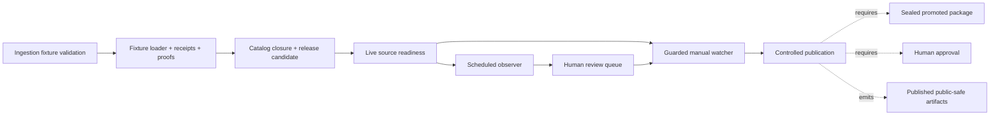
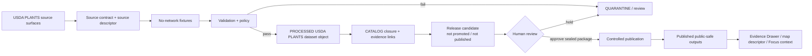

<!-- [KFM_META_BLOCK_V2]
doc_id: kfm://doc/TODO-UUID-docs-domains-flora-usda-plants-readme
title: USDA PLANTS Source Lane
type: standard
version: v1
status: draft
owners: @bartytime4life
created: TODO-YYYY-MM-DD
updated: 2026-05-07
policy_label: public
related: [../README.md, ./USDA_PLANTS_INGESTION.md, ./USDA_PLANTS_NEXT_LAYER.md, ./USDA_PLANTS_CATALOG_RELEASE_LAYER.md, ./USDA_PLANTS_LIVE_SOURCE_READINESS_LAYER.md, ./USDA_PLANTS_GUARDED_LIVE_WATCHER_LAYER.md, ./USDA_PLANTS_SCHEDULED_OBSERVER_LAYER.md, ./USDA_PLANTS_PUBLICATION_LAYER.md, ../../../../contracts/source/kansas_flora/usda_plants.md, ../../../../pipelines/watchers/kansas_flora_watch/README.md, ../../../../policy/flora/usda_plants.rego, ../../../../policy/flora/usda_plants_release.rego, ../../../../policy/flora/usda_plants_publication.rego, ../../../../.github/CODEOWNERS]
tags: [kfm, flora, usda-plants, source-lane, evidence, policy, no-network, publication]
notes: [doc_id and created date need repository metadata verification before merge; owner is routed through current CODEOWNERS coverage; this README is a source-lane navigation and guardrail document, not a live connector, release approval, or publication proof]
[/KFM_META_BLOCK_V2] -->

<a id="top"></a>

# USDA PLANTS Source Lane

Source-lane README for USDA PLANTS in the KFM Flora domain: source meaning, no-network fixture flow, policy gates, release boundaries, and public-safe publication posture.


> [!IMPORTANT]
> **Status:** `draft` / source-lane README  
> **Owner:** `@bartytime4life`  
> **Path:** `docs/domains/flora/usda_plants/README.md`  
> **Authority level:** README-like navigation and guardrail surface  
> **Runtime claim:** this document does **not** prove live ingestion, publication, promotion, workflow enforcement, API availability, UI rendering, or release maturity.

**Quick jumps:** [Scope](#scope) · [Repo fit](#repo-fit) · [Accepted inputs](#accepted-inputs) · [Exclusions](#exclusions) · [Source boundary](#source-boundary) · [Layer map](#layer-map) · [Lifecycle](#lifecycle) · [Policy gates](#policy-gates) · [Quickstart](#quickstart) · [Directory tree](#directory-tree) · [Definition of done](#definition-of-done) · [FAQ](#faq)

---

## Scope

This directory documents the USDA PLANTS source family inside the KFM Flora lane.

It exists to keep one boundary visible:

> USDA PLANTS can support USDA-source plant identity, symbols, names, taxonomy context, checklist context, and broad distribution context. It must not be stretched into exact occurrence proof, legal protected-status authority, image-rights clearance, rare-location release authority, or public map publication by itself.

### What this lane owns

| Area | Responsibility | Status |
|---|---|---|
| Source-lane orientation | Explain how USDA PLANTS fits into KFM Flora without becoming the whole Flora lane | **CONFIRMED doc role** |
| Source contract routing | Link to the human source contract under `contracts/source/kansas_flora/` | **CONFIRMED path** |
| No-network fixture flow | Route deterministic fixture-backed validation and loader/proof layers | **CONFIRMED docs; execution still needs verification per repo tests** |
| Live source readiness | Explain operator-supplied snapshots and why CI live downloads are disabled by default | **CONFIRMED doc posture** |
| Guarded manual watcher | Document manual/operator live-fetch guardrails without auto-publish or auto-promote claims | **CONFIRMED doc posture** |
| Release candidate closure | Route catalog, evidence-link, release-candidate, Evidence Drawer DTO, and draft layer contract notes | **CONFIRMED doc posture** |
| Controlled publication | Explain sealed-package-only publication and human approval requirements | **CONFIRMED doc posture** |
| Policy gate map | Route USDA PLANTS Rego policy files and summarize what they deny | **CONFIRMED files; enforcement must be verified in CI/runtime** |

### What this README does not own

- It does not define the full Flora domain. Use [`../README.md`](../README.md).
- It does not replace the source contract. Use [`../../../../contracts/source/kansas_flora/usda_plants.md`](../../../../contracts/source/kansas_flora/usda_plants.md).
- It does not activate live USDA access.
- It does not approve public release.
- It does not provide a MapLibre layer by itself.
- It does not establish legal status, rare-location release, image reuse, or exact occurrence authority.

[Back to top](#top)

---

## Repo fit

`docs/domains/flora/usda_plants/` is a **domain documentation sub-lane** under the human-facing control plane. It belongs under `docs/domains/` because it explains source-lane meaning and review posture. Executable policy, tools, proofs, receipts, and published artifacts stay under their responsibility roots.

| Direction | Path | Role | Status |
|---|---|---|---|
| Parent lane | [`../README.md`](../README.md) | Flora domain scope, accepted inputs, public-safe rules, and domain glossary | **CONFIRMED** |
| Source contract | [`../../../../contracts/source/kansas_flora/usda_plants.md`](../../../../contracts/source/kansas_flora/usda_plants.md) | Human meaning contract for source admission | **CONFIRMED** |
| Watcher roadmap | [`../../../../pipelines/watchers/kansas_flora_watch/README.md`](../../../../pipelines/watchers/kansas_flora_watch/README.md) | Kansas flora watcher roadmap and fail-closed ingestion posture | **CONFIRMED** |
| Core USDA policy | [`../../../../policy/flora/usda_plants.rego`](../../../../policy/flora/usda_plants.rego) | Dataset-level fail-closed checks | **CONFIRMED** |
| Release policy | [`../../../../policy/flora/usda_plants_release.rego`](../../../../policy/flora/usda_plants_release.rego) | Release-candidate closure and raw/work/quarantine leak checks | **CONFIRMED** |
| Publication policy | [`../../../../policy/flora/usda_plants_publication.rego`](../../../../policy/flora/usda_plants_publication.rego) | Human approval, sealed package, and publication ledger checks | **CONFIRMED** |
| Ownership routing | [`../../../../.github/CODEOWNERS`](../../../../.github/CODEOWNERS) | Conservative review routing for `docs/`, `contracts/`, `policy/`, `tools/`, `data/`, and release surfaces | **CONFIRMED** |

> [!NOTE]
> Directory Rules keep domain materials inside responsibility roots. This README links outward rather than inventing source-specific root folders.

[Back to top](#top)

---

## Accepted inputs

Place material in this directory only when it explains or updates the USDA PLANTS source-lane documentation surface.

| Accepted input | Why it belongs here |
|---|---|
| USDA PLANTS source-lane overview | Keeps source boundary visible to maintainers and reviewers |
| No-network fixture documentation | Documents deterministic validation without live endpoint dependency |
| Source-readiness notes | Explains why live access is disabled by default and what review gates are required |
| Guarded manual watcher notes | Documents operator-only flow without pretending it is automated publication |
| Release-candidate notes | Captures catalog/proof/Evidence Drawer readiness before publication |
| Controlled publication notes | Explains sealed-package-only public outputs and human approval requirements |
| Review and policy summaries | Helps reviewers find the actual policy files, receipts, proofs, and release blockers |

### Accepted nearby, not here

| Material | Correct home | Reason |
|---|---|---|
| Human source contract | `contracts/source/kansas_flora/usda_plants.md` | Source meaning and authority boundary belong in contracts |
| Policy-as-code | `policy/flora/usda_plants*.rego` | Executable allow/deny logic belongs in policy |
| Intake, diff, review, release, and deployment helpers | `tools/**/flora/*usda_plants*` | Tooling belongs under implementation roots |
| Watcher execution notes | `pipelines/watchers/kansas_flora_watch/` | Execution-near watcher docs belong with the watcher lane |
| Raw or operator-supplied snapshots | `data/raw/` or `data/quarantine/` after source review | Documentation must not store source payloads |
| Receipts and proofs | `data/receipts/`, `data/proofs/`, and `release/` | Process memory and release proof remain separate |
| Published public-safe outputs | `data/published/` or release-backed equivalent | Published artifacts need release manifests and rollback targets |

[Back to top](#top)

---

## Exclusions

Do not put these in `docs/domains/flora/usda_plants/`:

- USDA downloads, snapshots, CSVs, ZIPs, HTML captures, raw profile pages, or copied source payloads.
- Credentials, cookies, API keys, environment files, or operator secrets.
- Exact rare-plant locations, controlled-access plant records, or steward-only review data.
- Image/media files or image-rights claims.
- Legal protected-status claims sourced only from USDA PLANTS.
- Public map tiles, county geometry outputs, PMTiles archives, or MapLibre style outputs.
- Release manifests, proof packs, receipts, rollback cards, or promotion decisions.
- Tool code, long-lived scripts, workflow logic, or policy bundles.
- Generated AI summaries that have not resolved to EvidenceBundles and policy outcomes.
- Claims that live ingestion, promotion, publication, CI enforcement, or runtime UI behavior exists without direct repo evidence.

> [!CAUTION]
> USDA PLANTS distribution context is not an exact occurrence surface. Public products must preserve that distinction.

[Back to top](#top)

---

## Source boundary

The source contract for USDA PLANTS is the controlling human-readable meaning surface for this lane.

### Supported by USDA PLANTS, within its source boundary

| Claim class | Handling |
|---|---|
| USDA PLANTS symbol | Strong source-native identifier; keep source-scoped |
| Scientific and common names | Preserve source row and snapshot context |
| Taxonomy context | Useful source-bounded taxonomy support |
| Checklist context | Useful when snapshot, filter, and source row are inspectable |
| Broad state/county distribution context | Public-safe candidate only with non-occurrence caveat |
| Profile/source page context | Cite the exact page or row when used |

### Not supported by USDA PLANTS alone

| Claim class | Required KFM behavior |
|---|---|
| Exact occurrence | **ABSTAIN** unless another occurrence/specimen source supports it |
| Rare plant exact public location | **DENY** unless steward-reviewed release and geoprivacy transform exist |
| Legal protected status | **ABSTAIN** unless a legal/status authority supports it |
| Image reuse | **DENY** unless image-specific rights are verified |
| Habitat suitability | **ABSTAIN** unless a habitat/model source and model card support it |
| Cultural or tribal plant-use claim | **REVIEW REQUIRED** |
| Public release | **DENY** until validation, policy, review, release manifest, and rollback target exist |

[Back to top](#top)

---

## Layer map

The files in this directory describe a staged USDA PLANTS build path. Read them as a controlled ladder, not as proof that every layer is production-ready.

| Layer doc | Purpose | Network posture | Publication posture |
|---|---|---:|---:|
| [`USDA_PLANTS_INGESTION.md`](./USDA_PLANTS_INGESTION.md) | Fixture-backed source-shape validation | Disabled | No publication |
| [`USDA_PLANTS_NEXT_LAYER.md`](./USDA_PLANTS_NEXT_LAYER.md) | Local fixture loader, receipts, proof manifest, and policy checks | Disabled | No publication |
| [`USDA_PLANTS_CATALOG_RELEASE_LAYER.md`](./USDA_PLANTS_CATALOG_RELEASE_LAYER.md) | Catalog closure, evidence links, release-candidate artifacts, DTO contract | Disabled | Not promoted / not published |
| [`USDA_PLANTS_LIVE_SOURCE_READINESS_LAYER.md`](./USDA_PLANTS_LIVE_SOURCE_READINESS_LAYER.md) | Operator-supplied snapshot readiness and staging | Disabled by default | No promotion / no publication |
| [`USDA_PLANTS_GUARDED_LIVE_WATCHER_LAYER.md`](./USDA_PLANTS_GUARDED_LIVE_WATCHER_LAYER.md) | Manual guarded live watcher with explicit flags and receipts | Manual guarded | No auto-publish / no auto-promote |
| [`USDA_PLANTS_SCHEDULED_OBSERVER_LAYER.md`](./USDA_PLANTS_SCHEDULED_OBSERVER_LAYER.md) | Observe-only scheduled checks and reviewer queue artifacts | Scheduled observe-only | No release candidate / no publication |
| [`USDA_PLANTS_PUBLICATION_LAYER.md`](./USDA_PLANTS_PUBLICATION_LAYER.md) | Controlled publication from sealed promoted packages | Disabled | Human-approved publication only |



> [!WARNING]
> The scheduled observer is observe-only. The guarded watcher is manual. The publication layer requires a sealed promoted package and human approval.

[Back to top](#top)

---

## Lifecycle

USDA PLANTS material inherits KFM lifecycle law:

```text
RAW → WORK / QUARANTINE → PROCESSED → CATALOG / TRIPLET → PUBLISHED
```

For this source lane, the current documented posture is intentionally conservative.



### Lifecycle rules

| Stage | Rule |
|---|---|
| RAW | Operator-supplied or acquired source material is evidence candidate only |
| WORK | Staging must normalize, sort, hash, and preserve lineage |
| QUARANTINE | Unknown links, missing required columns, bad hashes, unsafe geometry, or unresolved rights fail closed |
| PROCESSED | Fixture loader remains the path to processed USDA PLANTS dataset objects |
| CATALOG/TRIPLET | Catalog and evidence links prepare reviewable release candidates, not publication |
| PUBLISHED | Only sealed, approved, public-safe packages may write public outputs |
| ROLLBACK | Every public artifact needs release hash, receipt hash, ledger hash, and rollback plan |

[Back to top](#top)

---

## Policy gates

The current policy family is source-lane specific and fail-closed. This README summarizes behavior for reviewers; the Rego files remain the executable policy surface.

| Policy file | Denies when |
|---|---|
| [`usda_plants.rego`](../../../../policy/flora/usda_plants.rego) | Missing or mismatched `spec_hash`, non-public policy label, bad license/rights holder, missing provenance, raw/work/quarantine references, bad county FIPS, missing scientific author token |
| [`usda_plants_release.rego`](../../../../policy/flora/usda_plants_release.rego) | Missing datasets, evidence links, catalog refs, proof refs, receipts, release hash, blocked-publication state, or raw/work/quarantine leak checks |
| [`usda_plants_publication.rego`](../../../../policy/flora/usda_plants_publication.rego) | Missing human approval, missing sealed promoted package, missing release/receipt/ledger hashes, or auto-merge claim |
| [`usda_plants_live_fetch.rego`](../../../../policy/flora/usda_plants_live_fetch.rego) | Missing live-fetch plan hash or receipt hash |
| `usda_plants_*review*.rego` | Review/sensitivity/rights/audit obligations for source-lane handoff and human review |
| `usda_plants_*geometry*.rego` | Geometry and county-publication constraints for future public-safe geometry work |
| `usda_plants_*deployment*.rego` | Deployment and external publication constraints |

> [!IMPORTANT]
> Policy files can exist without proving that CI, branch protection, protected environments, or runtime gates currently enforce them. Treat enforcement as **NEEDS VERIFICATION** until test and workflow evidence are checked.

[Back to top](#top)

---

## Quickstart

Use these checks before making any stronger implementation claim.

### 1. Confirm the source-lane docs

```bash
git status --short
git branch --show-current || true

find docs/domains/flora/usda_plants -maxdepth 1 -type f | sort
sed -n '1,220p' docs/domains/flora/usda_plants/README.md
```

### 2. Inspect adjacent source contract, policy, and tool surfaces

```bash
sed -n '1,260p' contracts/source/kansas_flora/usda_plants.md

find policy/flora -maxdepth 1 -type f -name 'usda_plants*.rego' | sort

find tools -type f -path '*flora*' -name '*usda_plants*' | sort
```

### 3. Verify no live network path is being implied

```bash
grep -RInE 'live|network|publish|promot|auto|workflow_dispatch' \
  docs/domains/flora/usda_plants \
  policy/flora \
  pipelines/watchers/kansas_flora_watch \
  2>/dev/null || true
```

### 4. Run policy tests only after tooling is verified

```bash
# Optional; run only if OPA is installed and matching test files exist.
opa test policy/flora
```

> [!CAUTION]
> Do not treat a passing local grep or policy check as publication approval. Publication still requires promoted package evidence, human approval, release manifest closure, public-safe artifact hashes, correction path, and rollback target.

[Back to top](#top)

---

## Directory tree

Current documented source-lane surface:

```text
docs/
└── domains/
    └── flora/
        └── usda_plants/
            ├── README.md
            ├── USDA_PLANTS_INGESTION.md
            ├── USDA_PLANTS_NEXT_LAYER.md
            ├── USDA_PLANTS_CATALOG_RELEASE_LAYER.md
            ├── USDA_PLANTS_LIVE_SOURCE_READINESS_LAYER.md
            ├── USDA_PLANTS_GUARDED_LIVE_WATCHER_LAYER.md
            ├── USDA_PLANTS_SCHEDULED_OBSERVER_LAYER.md
            └── USDA_PLANTS_PUBLICATION_LAYER.md
```

Confirmed adjacent responsibility-root surfaces include:

```text
contracts/source/kansas_flora/usda_plants.md
pipelines/watchers/kansas_flora_watch/README.md
policy/flora/usda_plants*.rego
tools/**/flora/*usda_plants*.py
.github/CODEOWNERS
```

Expected lifecycle and release surfaces, verified by path only when present:

```text
data/raw/flora/usda_plants/
data/work/flora/usda_plants/
data/quarantine/flora/usda_plants/
data/processed/flora/usda_plants/
data/catalog/
data/receipts/flora/usda_plants/
data/proofs/flora/usda_plants/
data/published/flora/usda_plants/
release/
```

[Back to top](#top)

---

## Current lane inventory

| Surface | Path | Truth role | Update trigger |
|---|---|---|---|
| Source-lane README | `docs/domains/flora/usda_plants/README.md` | Navigation and guardrail | Any source-lane layer, policy, or release-boundary change |
| Ingestion layer doc | `USDA_PLANTS_INGESTION.md` | No-network fixture validation orientation | Fixture or validator scope changes |
| Next layer doc | `USDA_PLANTS_NEXT_LAYER.md` | Loader / receipt / proof / policy bridge | Loader, receipt, proof, or policy contract changes |
| Catalog release layer doc | `USDA_PLANTS_CATALOG_RELEASE_LAYER.md` | Release-candidate and DTO boundary | Catalog, evidence link, release candidate, or map contract changes |
| Live readiness doc | `USDA_PLANTS_LIVE_SOURCE_READINESS_LAYER.md` | Operator-supplied snapshot readiness | Source-shape, column, drift, or quarantine behavior changes |
| Guarded live watcher doc | `USDA_PLANTS_GUARDED_LIVE_WATCHER_LAYER.md` | Manual live watcher guardrails | Operator workflow, snapshot lock, diff, or PR handoff changes |
| Scheduled observer doc | `USDA_PLANTS_SCHEDULED_OBSERVER_LAYER.md` | Observe-only scheduled change detection | Observer, alert, queue, or artifact bundle changes |
| Publication layer doc | `USDA_PLANTS_PUBLICATION_LAYER.md` | Controlled publication rules | Publication request, approval, manifest, output, or rollback changes |
| Source contract | `contracts/source/kansas_flora/usda_plants.md` | Human source-admission meaning | USDA PLANTS source identity, authority, rights, field, or sensitivity changes |
| Policy bundle | `policy/flora/usda_plants*.rego` | Executable policy gate family | Any release, publication, source-intake, geometry, review, or deployment rule changes |
| Tool family | `tools/**/flora/*usda_plants*.py` | Review, intake, evidence, diff, release, publication, deployment, geometry, and UI helper surface | Any helper behavior or generated artifact contract changes |
| Watcher README | `pipelines/watchers/kansas_flora_watch/README.md` | Flora watcher roadmap and fail-closed ingest posture | Watcher moves from roadmap-only to executable or changes source scope |

[Back to top](#top)

---

## Reviewer checklist

Before approving changes under this directory, verify:

- [ ] The change preserves the difference between source identity, occurrence evidence, legal status, image rights, and publication approval.
- [ ] No public output is implied from no-network fixture validation alone.
- [ ] Live USDA access remains disabled by default unless a guarded operator path is explicitly reviewed.
- [ ] Scheduled observation remains observe-only and does not publish, promote, open PRs, or create release candidates automatically.
- [ ] Publication text still requires sealed promoted package and human approval.
- [ ] Policy references point to executable Rego files, not duplicated prose.
- [ ] Any new source, schema, tool, policy, or artifact updates its correct responsibility root.
- [ ] Any new public artifact has release hash, receipt hash, ledger hash, correction path, and rollback plan.
- [ ] No raw/work/quarantine path is linked as a public surface.
- [ ] Evidence Drawer or Focus language resolves through evidence and policy rather than source-page prose alone.

[Back to top](#top)

---

## Definition of done

This README is ready for a maintained state when:

- [ ] `doc_id` and `created` metadata are replaced with verified repository values.
- [ ] All relative links are checked from `docs/domains/flora/usda_plants/README.md`.
- [ ] `CODEOWNERS` and branch protection / ruleset enforcement are checked.
- [ ] Policy tests for USDA PLANTS are present and runnable in the repo-native test environment.
- [ ] The source contract and this README agree on authority boundaries.
- [ ] The layer docs agree on network, promotion, and publication posture.
- [ ] No current text claims live ingestion, public publication, workflow enforcement, or runtime UI behavior without evidence.
- [ ] The controlled publication layer has fixtures or generated examples for human approval, sealed package, release manifest, publication receipt, audit ledger, and rollback plan.
- [ ] Evidence Drawer payloads remain sanitized: no raw fixture contents, coordinates, geometry, or restricted fields.
- [ ] Future county geometry or tile work has a separate review-gated layer and policy checks.

[Back to top](#top)

---

## FAQ

### Is USDA PLANTS the Flora lane?

No. USDA PLANTS is one source family inside Flora. Flora also covers specimens, observations, rare plants, vegetation communities, invasive plants, phenology, range context, habitat associations, restoration records, and steward-reviewed material.

### Is this a live USDA connector?

No. The documented posture is no-network by default, fixture-backed first, guarded manual only where explicitly documented, and publication-separated.

### Can USDA PLANTS county context be mapped?

Only as public-safe context with clear caveats and release-backed artifacts. County presence is not an exact occurrence point, and geometry/tile publication requires separate controls.

### Can this lane publish directly to the public map?

No. Publication requires sealed promoted package, human approval, public-safe outputs, release manifest, publication receipt, audit ledger, and rollback plan.

### Can Focus Mode answer USDA PLANTS questions?

Only after evidence resolution and policy checks. Focus Mode may summarize released or authorized evidence, but it must abstain when source role, citation, temporal support, or release state is insufficient.

[Back to top](#top)

---

## Appendix

<details>
<summary>Path update rules</summary>

| Change | Required companion update |
|---|---|
| USDA PLANTS source fields change | Source contract, fixture docs, column contract, drift detector, policy tests |
| New fixture type added | Ingestion doc, Next Layer doc, validator/test inventory |
| New policy rule added | Policy gate table here, relevant layer doc, Rego tests |
| Guarded live watcher changes | Guarded live watcher doc, source-intake policy, review handoff notes |
| Scheduled observer changes | Scheduled observer doc, observer policy, reviewer queue docs |
| Publication output changes | Publication layer doc, release manifest contract, rollback plan, public artifact manifest |
| County geometry work begins | Catalog/release layer, geometry policy, MapLibre layer contract, public-safe generalization receipt |
| Evidence Drawer payload changes | Catalog/release layer, UI contract, DTO fixtures, Focus Mode contract |
| Any public output is added | Release manifest, publication approval, publication receipt, audit ledger, rollback card |

</details>

<details>
<summary>Minimum negative cases to keep alive</summary>

- Missing `spec_hash`
- `spec_hash` mismatch
- Non-public policy label
- Bad license or rights holder
- Missing provenance
- Raw/work/quarantine reference leak
- Bad county FIPS
- Scientific name without expected authorship token
- Missing evidence links
- Missing catalog/proof/receipt refs
- Release candidate marked promoted or published too early
- Publication request without human approval
- Publication request with unsealed package
- Publication auto-merge claim
- Live fetch without plan hash or receipt hash
- Exact occurrence claim from USDA PLANTS distribution context
- Image reuse claim without image-specific rights
- Legal protected-status claim from USDA PLANTS alone

</details>

<details>
<summary>Reference-style source links</summary>

These links are source pointers recorded for maintainer review. Reverify source terms, field shapes, cadence, and access behavior before live activation.

[USDA PLANTS landing]: https://plants.sc.egov.usda.gov/home  
[USDA PLANTS downloads]: https://plants.sc.egov.usda.gov/downloads  
[USDA PLANTS state search]: https://plants.sc.egov.usda.gov/state-search  
[data.gov PLANTS dataset]: https://catalog.data.gov/dataset/plant-list-of-accepted-nomenclature-taxonomy-and-symbols-plants-database  

</details>

[Back to top](#top)
