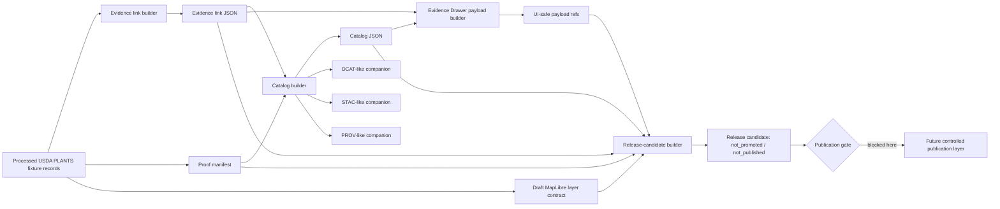

<!-- [KFM_META_BLOCK_V2]
doc_id: kfm://doc/NEEDS_VERIFICATION-usda-plants-catalog-release-layer
title: USDA PLANTS Catalog Release Layer
type: standard
version: v1
status: draft
owners: NEEDS_VERIFICATION-flora-steward
created: NEEDS_VERIFICATION
updated: 2026-05-07
policy_label: public
related: [docs/domains/flora/README.md, docs/domains/flora/usda_plants/USDA_PLANTS_INGESTION.md, docs/domains/flora/usda_plants/USDA_PLANTS_NEXT_LAYER.md, docs/domains/flora/usda_plants/USDA_PLANTS_LIVE_SOURCE_READINESS_LAYER.md, docs/domains/flora/usda_plants/USDA_PLANTS_GUARDED_LIVE_WATCHER_LAYER.md, docs/domains/flora/usda_plants/USDA_PLANTS_PUBLICATION_LAYER.md, docs/domains/flora/usda_plants/USDA_PLANTS_COUNTY_GEOMETRY_PUBLICATION_LAYER.md, schemas/flora/usda_plants_catalog.schema.json, schemas/flora/usda_plants_release_candidate.schema.json, policy/flora/usda_plants_release.rego, tools/catalog/flora/usda_plants_catalog_builder.py, tools/release/flora/usda_plants_release_candidate_builder.py, tests/flora/test_usda_plants_release_candidate_builder.py]
tags: [kfm, flora, usda-plants, catalog, release-candidate, evidence, governance]
notes: [Expanded from the existing thin catalog-release layer document. doc_id, owners, and created date require steward verification before merge. This layer is catalog/release-candidate only: not promoted, not published, and not a public map publication layer.]
[/KFM_META_BLOCK_V2] -->

<a id="top"></a>

# USDA PLANTS Catalog Release Layer

Fixture-backed catalog closure, evidence-linking, UI-safe payload generation, and release-candidate assembly for USDA PLANTS records before promotion or publication.


> [!IMPORTANT]
> **Status:** draft  
> **Layer:** `usda_plants_catalog_release`  
> **Path:** `docs/domains/flora/usda_plants/USDA_PLANTS_CATALOG_RELEASE_LAYER.md`  
> **Lifecycle placement:** `PROCESSED → CATALOG / TRIPLET → RELEASE_CANDIDATE`  
> **Publication posture:** `not_promoted`, `not_published`, publication gate blocked  
> **Network posture:** no live USDA fetch; fixture-backed and deterministic  
> **Safety posture:** no occurrence coordinates, no county geometry generation, no vector tiles, no public map publication

**Quick links:** [Purpose](#purpose) · [Repo fit](#repo-fit) · [Lifecycle](#lifecycle) · [Inputs](#accepted-inputs) · [Exclusions](#exclusions) · [Artifact contract](#artifact-contract) · [Builder flow](#builder-flow) · [Policy gates](#policy-gates) · [Validation checklist](#validation-checklist) · [Future work](#future-work)

---

## Purpose

This layer proves that fixture-backed USDA PLANTS records can be closed into a catalog, linked to evidence objects, prepared for UI-safe inspection, and assembled into a release-candidate manifest **without** making a promotion or publication claim.

It exists between the deterministic processed-data slice and the later controlled publication layers.

```text
This layer does:
  processed records + evidence links + catalog refs + receipts + proofs
  -> release candidate with blockers and hashes

This layer does not:
  live fetch, promote, publish, generate public geometry, create tiles, or auto-open PRs
```

The release candidate is a reviewable readiness object, not a published product.

[Back to top](#top)

---

## Repo fit

This document belongs under `docs/domains/flora/usda_plants/` because it is a human-facing domain-layer guide for one USDA PLANTS lifecycle seam. Machine-checkable shape, policy decisions, builders, tests, and generated artifacts live in their own responsibility roots.

| Surface | Path | Role | Status |
| --- | --- | --- | --- |
| Parent flora lane | [`../README.md`](../README.md) | Flora domain entry point and lane-wide governance posture | **CONFIRMED path** |
| Ingestion slice | [`./USDA_PLANTS_INGESTION.md`](./USDA_PLANTS_INGESTION.md) | No-network fixture ingestion and processed-contract validation | **CONFIRMED path** |
| Fixture/proof/policy layer | [`./USDA_PLANTS_NEXT_LAYER.md`](./USDA_PLANTS_NEXT_LAYER.md) | Fixture loader, receipts, proof manifest, policy posture | **CONFIRMED path** |
| Live-source readiness | [`./USDA_PLANTS_LIVE_SOURCE_READINESS_LAYER.md`](./USDA_PLANTS_LIVE_SOURCE_READINESS_LAYER.md) | Operator-supplied snapshot readiness; still no CI network | **CONFIRMED path** |
| Guarded watcher | [`./USDA_PLANTS_GUARDED_LIVE_WATCHER_LAYER.md`](./USDA_PLANTS_GUARDED_LIVE_WATCHER_LAYER.md) | Manual guarded live watcher and PR handoff posture | **CONFIRMED path** |
| Controlled publication | [`./USDA_PLANTS_PUBLICATION_LAYER.md`](./USDA_PLANTS_PUBLICATION_LAYER.md) | Later publication request / approval / release manifest layer | **CONFIRMED path** |
| County geometry publication | [`./USDA_PLANTS_COUNTY_GEOMETRY_PUBLICATION_LAYER.md`](./USDA_PLANTS_COUNTY_GEOMETRY_PUBLICATION_LAYER.md) | Later approved county-boundary GeoJSON layer | **CONFIRMED path** |
| Catalog schema | [`../../../../schemas/flora/usda_plants_catalog.schema.json`](../../../../schemas/flora/usda_plants_catalog.schema.json) | Machine shape for `usda_plants_catalog` | **CONFIRMED path** |
| Release-candidate schema | [`../../../../schemas/flora/usda_plants_release_candidate.schema.json`](../../../../schemas/flora/usda_plants_release_candidate.schema.json) | Machine shape for `usda_plants_release_candidate` | **CONFIRMED path** |
| Release policy | [`../../../../policy/flora/usda_plants_release.rego`](../../../../policy/flora/usda_plants_release.rego) | Fail-closed policy for release candidate readiness | **CONFIRMED path** |
| Catalog builder | [`../../../../tools/catalog/flora/usda_plants_catalog_builder.py`](../../../../tools/catalog/flora/usda_plants_catalog_builder.py) | Builds catalog and STAC/DCAT/PROV-like companions | **CONFIRMED path** |
| Release-candidate builder | [`../../../../tools/release/flora/usda_plants_release_candidate_builder.py`](../../../../tools/release/flora/usda_plants_release_candidate_builder.py) | Assembles release candidate from processed/evidence/catalog/receipts/proofs | **CONFIRMED path** |
| Release-candidate test | [`../../../../tests/flora/test_usda_plants_release_candidate_builder.py`](../../../../tests/flora/test_usda_plants_release_candidate_builder.py) | Deterministic end-to-end builder test | **CONFIRMED path** |

> [!NOTE]
> The repo path is confirmed from the connected GitHub source. This authoring session did **not** have a mounted local checkout, so workflow enforcement, branch protections, runtime behavior, and generated artifact presence remain **UNKNOWN** unless separately verified.

[Back to top](#top)

---

## Scope

### This layer owns

| Area | Responsibility |
| --- | --- |
| Evidence linking | Ensure each processed USDA PLANTS dataset has a source-bound, rights-aware evidence-link object. |
| Catalog closure | Produce `catalog.json` plus DCAT-like, STAC-like, and PROV-like companion files. |
| Release-candidate assembly | Build a manifest that points to datasets, evidence links, catalog refs, receipts, proofs, UI payload refs, map contract refs, policy refs, blockers, and hashes. |
| UI-safe inspection | Allow Evidence Drawer payloads to reference catalog and release-candidate context without exposing raw fixture contents, coordinates, or geometry. |
| Map contract readiness | Carry only a draft MapLibre contract reference where `currently_available=false`; no public map source is emitted here. |
| Policy blocking | Preserve `not_promoted`, `not_published`, and `publication=blocked` states. |
| Determinism | Support fixed `generated_at` values and hash-addressed outputs for repeatable tests. |

### This layer does not own

| Out of scope | Better home |
| --- | --- |
| Live USDA endpoint fetching | `USDA_PLANTS_LIVE_SOURCE_READINESS_LAYER.md` or guarded watcher docs |
| Promotion decision | Future promotion / release decision object |
| Public publication | `USDA_PLANTS_PUBLICATION_LAYER.md` |
| County geometry publication | `USDA_PLANTS_COUNTY_GEOMETRY_PUBLICATION_LAYER.md` |
| Public GeoJSON / tiles | Later geometry or tile publication layer |
| Exact occurrence coordinates | Not supported by this USDA PLANTS catalog-release layer |
| Legal protected-status claims | Separate status authority source and policy gate |
| Source schema design | `schemas/flora/*.schema.json` or repo-confirmed schema root |
| Policy law | `policy/flora/*.rego` |

[Back to top](#top)

---

## Lifecycle



### State transition rule

```text
PROCESSED
  -> CATALOG / TRIPLET
  -> RELEASE_CANDIDATE
  -/-> PUBLISHED
```

The arrow to `PUBLISHED` is intentionally blocked in this layer. Publication requires a later human-controlled request, approval, execution, release manifest, publication receipt, rollback plan, and audit ledger.

[Back to top](#top)

---

## Accepted inputs

Inputs must already be fixture-backed, deterministic, and compatible with the earlier USDA PLANTS slices.

| Input | Expected path shape | Required condition |
| --- | --- | --- |
| Processed dataset JSON | `processed/flora/usda_plants/*.json` | Each item has source-bounded plant identity, distributions, provenance, and `spec_hash`. |
| Evidence link JSON | `evidence/flora/usda_plants/*.evidence_link.json` | One evidence link per processed dataset. |
| Proof manifest | `proofs/flora/usda_plants/spec_hash_manifest.json` | `dataset_count` matches processed dataset count. |
| Receipts | `receipts/flora/usda_plants/*.json` | Must include ingest and validation receipt references. |
| Catalog directory | `catalog/flora/usda_plants/` | Must contain `catalog.json` before release-candidate assembly. |
| UI payload directory | `ui/flora/usda_plants/evidence_drawer/` | Optional but preferred; payloads must be public-safe. |
| Map contract | `maps/flora/usda_plants/county_presence.layer_contract.json` | Optional draft-only contract; must not claim a published source. |
| Snapshot date | `YYYY-MM-DD` | Must match fixture/run context. |
| Generated timestamp | ISO 8601 UTC | Fixed timestamp recommended in tests. |

[Back to top](#top)

---

## Exclusions

> [!CAUTION]
> These exclusions are intentional release-safety controls, not missing features.

This layer must not admit, emit, or claim:

- live USDA downloads;
- automatic scheduled watcher execution;
- promotion decisions;
- publication requests or approvals;
- public map publication;
- county geometry generation;
- vector tiles, MBTiles, PMTiles, or tile source claims;
- occurrence/specimen coordinates;
- raw fixture contents in UI payloads;
- direct RAW / WORK / QUARANTINE references in release-candidate fields;
- unpublished data as public evidence;
- legal protected-status claims;
- auto-opened or auto-merged pull requests.

[Back to top](#top)

---

## Artifact contract

### Produced or consumed artifacts

| Artifact | Producer | Role | Public posture |
| --- | --- | --- | --- |
| `evidence/flora/usda_plants/<symbol>.evidence_link.json` | `usda_plants_evidence_link_builder.py` | Links processed dataset to source, rights, lineage, validation, receipts, proof refs | Public-safe metadata only |
| `catalog/flora/usda_plants/catalog.json` | `usda_plants_catalog_builder.py` | Deterministic catalog object with dataset refs, source, rights, catalog refs, proof refs, hash | Release-candidate support, not publication |
| `catalog/flora/usda_plants/dcat_like_catalog.json` | `usda_plants_catalog_builder.py` | DCAT-adjacent descriptive companion | Candidate catalog support |
| `catalog/flora/usda_plants/stac_like_collection.json` | `usda_plants_catalog_builder.py` | STAC-adjacent collection companion | Candidate catalog support |
| `catalog/flora/usda_plants/prov_like_lineage.json` | `usda_plants_catalog_builder.py` | PROV-adjacent lineage companion | Candidate provenance support |
| `ui/flora/usda_plants/evidence_drawer/<symbol>.json` | `usda_plants_evidence_drawer_payload_builder.py` | UI-safe Evidence Drawer payload | No raw fixture contents, no coordinates, no geometry |
| `maps/flora/usda_plants/county_presence.layer_contract.json` | `usda_plants_map_layer_contract_builder.py` | Draft MapLibre contract for future FIPS join | `currently_available=false`; not a published layer |
| `releases/flora/usda_plants/release_candidate_<snapshot_date>.json` | `usda_plants_release_candidate_builder.py` | Assembled release candidate with blockers, refs, gates, and hash | Not promoted, not published |

### Catalog fields

The catalog object must include:

| Field | Requirement |
| --- | --- |
| `schema_version` | `1.0.0` |
| `object_type` | `usda_plants_catalog` |
| `catalog_id` | Stable KFM catalog ID with snapshot date |
| `domain` | `flora` |
| `catalog_profile` | `kfm_dcat_stac_adjacent_v1` |
| `snapshot_date` | Source fixture snapshot date |
| `source.source_id` | `usda_plants` |
| `rights.policy_label` | `public` |
| `datasets[]` | Dataset ID, PLANTS symbol, name, family, `spec_hash`, dataset ref, evidence-link ref |
| `catalog_refs` | `dcat_like`, `stac_like`, and `prov_like` references |
| `proof_refs` | Proof manifest references |
| `catalog_hash` | `sha256:<64 hex chars>` |

### Release-candidate fields

The release candidate must include:

| Field | Requirement |
| --- | --- |
| `object_type` | `usda_plants_release_candidate` |
| `promotion_state` | `not_promoted` |
| `publication_state` | `not_published` |
| `source_id` | `usda_plants` |
| `dataset_refs` | Processed dataset references only |
| `evidence_link_refs` | Evidence-link references only |
| `catalog_refs` | Catalog references only |
| `receipt_refs` | Ingest + validation receipt references |
| `proof_refs` | Proof manifest references |
| `policy_refs` | USDA PLANTS policy and release policy refs |
| `ui_refs` | Optional Evidence Drawer payload refs |
| `map_layer_contract_refs` | Draft map contract refs only |
| `gates.publication` | `blocked` |
| `blockers` | Non-empty blocker list |
| `release_candidate_hash` | `sha256:<64 hex chars>` |

[Back to top](#top)

---

## Builder flow

Run from the repository root. These commands mirror the deterministic builder chain used by the release-candidate test.

```bash
SNAPSHOT_DATE="2026-04-30"
GENERATED_AT="2026-04-30T00:00:00Z"
OUT_DIR="/tmp/kfm-usda-plants-catalog-release"

python tools/ingest/flora/usda_plants_fixture_loader.py \
  --checklist tests/fixtures/flora/usda_plants/raw/checklist.csv \
  --states tests/fixtures/flora/usda_plants/raw/state_distribution.csv \
  --counties tests/fixtures/flora/usda_plants/raw/county_distribution.csv \
  --snapshot-date "${SNAPSHOT_DATE}" \
  --out-dir "${OUT_DIR}"

python tools/proofs/flora/usda_plants_proof_manifest.py \
  --processed-dir "${OUT_DIR}/processed/flora/usda_plants" \
  --out "${OUT_DIR}/proofs/flora/usda_plants/spec_hash_manifest.json"

python tools/evidence/flora/usda_plants_evidence_link_builder.py \
  --processed-dir "${OUT_DIR}/processed/flora/usda_plants" \
  --receipts-dir "${OUT_DIR}/receipts/flora/usda_plants" \
  --proof-manifest "${OUT_DIR}/proofs/flora/usda_plants/spec_hash_manifest.json" \
  --snapshot-date "${SNAPSHOT_DATE}" \
  --generated-at "${GENERATED_AT}" \
  --out-dir "${OUT_DIR}/evidence/flora/usda_plants"

python tools/catalog/flora/usda_plants_catalog_builder.py \
  --processed-dir "${OUT_DIR}/processed/flora/usda_plants" \
  --evidence-dir "${OUT_DIR}/evidence/flora/usda_plants" \
  --proof-manifest "${OUT_DIR}/proofs/flora/usda_plants/spec_hash_manifest.json" \
  --snapshot-date "${SNAPSHOT_DATE}" \
  --generated-at "${GENERATED_AT}" \
  --out-dir "${OUT_DIR}/catalog/flora/usda_plants"

python tools/ui/flora/usda_plants_evidence_drawer_payload_builder.py \
  --processed-dir "${OUT_DIR}/processed/flora/usda_plants" \
  --evidence-dir "${OUT_DIR}/evidence/flora/usda_plants" \
  --catalog-ref "catalog/flora/usda_plants/catalog.json" \
  --release-candidate-ref "releases/flora/usda_plants/release_candidate_${SNAPSHOT_DATE}.json" \
  --snapshot-date "${SNAPSHOT_DATE}" \
  --out-dir "${OUT_DIR}/ui/flora/usda_plants/evidence_drawer"

python tools/maps/flora/usda_plants_map_layer_contract_builder.py \
  --snapshot-date "${SNAPSHOT_DATE}" \
  --out "${OUT_DIR}/maps/flora/usda_plants/county_presence.layer_contract.json"

python tools/release/flora/usda_plants_release_candidate_builder.py \
  --processed-dir "${OUT_DIR}/processed/flora/usda_plants" \
  --evidence-dir "${OUT_DIR}/evidence/flora/usda_plants" \
  --catalog-dir "${OUT_DIR}/catalog/flora/usda_plants" \
  --receipts-dir "${OUT_DIR}/receipts/flora/usda_plants" \
  --proof-manifest "${OUT_DIR}/proofs/flora/usda_plants/spec_hash_manifest.json" \
  --ui-dir "${OUT_DIR}/ui/flora/usda_plants/evidence_drawer" \
  --map-contract "${OUT_DIR}/maps/flora/usda_plants/county_presence.layer_contract.json" \
  --snapshot-date "${SNAPSHOT_DATE}" \
  --generated-at "${GENERATED_AT}" \
  --out "${OUT_DIR}/releases/flora/usda_plants/release_candidate_${SNAPSHOT_DATE}.json"
```

### Test command

```bash
python -m pytest tests/flora/test_usda_plants_release_candidate_builder.py
```

### Optional policy check

Run only when the policy toolchain is installed and pinned by the repo.

```bash
opa test policy/flora/usda_plants_release.rego policy/flora/usda_plants_release_test.rego
```

[Back to top](#top)

---

## Policy gates

The release policy must fail closed when release-candidate closure is incomplete or when the candidate tries to behave like a publication artifact.

| Gate / deny code | Meaning |
| --- | --- |
| `USDA_PLANTS_RELEASE_MISSING_DATASETS` | No dataset refs are present. |
| `USDA_PLANTS_RELEASE_MISSING_EVIDENCE_LINKS` | Evidence links are missing. |
| `USDA_PLANTS_RELEASE_MISSING_CATALOG` | Catalog refs are missing. |
| `USDA_PLANTS_RELEASE_MISSING_PROOF` | Proof refs are missing. |
| `USDA_PLANTS_RELEASE_MISSING_RECEIPTS` | Ingest/validation receipt refs are missing. |
| `USDA_PLANTS_RELEASE_BAD_PROMOTION_STATE` | Candidate is not `not_promoted`. |
| `USDA_PLANTS_RELEASE_BAD_PUBLICATION_STATE` | Candidate is not `not_published`. |
| `USDA_PLANTS_RELEASE_PUBLICATION_NOT_BLOCKED` | Publication gate is not blocked. |
| `USDA_PLANTS_RELEASE_MISSING_HASH` | Release-candidate hash is absent. |
| `USDA_PLANTS_RELEASE_HASH_MISMATCH` | Hash does not use `sha256:` format. |
| `USDA_PLANTS_RELEASE_RAW_REF_LEAK` | Candidate leaks `raw/` refs. |
| `USDA_PLANTS_RELEASE_WORK_REF_LEAK` | Candidate leaks `work/` refs. |
| `USDA_PLANTS_RELEASE_QUARANTINE_REF_LEAK` | Candidate leaks `quarantine/` refs. |
| `USDA_PLANTS_RELEASE_MAP_CONTRACT_PUBLISHED` | Draft map contract ref claims published status. |

[Back to top](#top)

---

## Safety rules

### Evidence safety

- Every processed record must have a matching evidence-link object.
- Every release candidate must point to catalog, proof, and receipt refs.
- Evidence Drawer payloads must summarize support; they must not expose raw fixture contents.
- Map contracts must remain draft-only in this layer.

### Publication safety

- `promotion_state` must stay `not_promoted`.
- `publication_state` must stay `not_published`.
- `gates.publication` must stay `blocked`.
- Publication blockers must remain non-empty.
- No public layer, geometry, or tile artifact is emitted here.

### Spatial safety

- County presence is FIPS-keyed tabular/distribution context at this layer.
- County boundary geometry belongs to a later reviewed geometry publication layer.
- Occurrence/specimen coordinates are forbidden.
- Vector tiles and PMTiles are forbidden in this layer.

[Back to top](#top)

---

## Validation checklist

Before this document or layer is treated as review-ready:

- [ ] `doc_id`, owner, created date, and policy label are verified.
- [ ] Adjacent links resolve from `docs/domains/flora/usda_plants/`.
- [ ] Processed fixture loader test passes.
- [ ] Proof manifest contains one deterministic `spec_hash` per processed dataset.
- [ ] Evidence-link builder emits one link per processed dataset.
- [ ] Catalog builder emits `catalog.json`, `dcat_like_catalog.json`, `stac_like_collection.json`, and `prov_like_lineage.json`.
- [ ] Catalog schema validation passes.
- [ ] Evidence Drawer payload builder emits public-safe payloads with no raw fixture contents, coordinates, or geometry.
- [ ] Draft MapLibre contract says `currently_available=false`.
- [ ] Release-candidate builder emits `not_promoted`, `not_published`, `publication=blocked`, blockers, policy refs, and `release_candidate_hash`.
- [ ] Release-candidate schema validation passes.
- [ ] Release policy denies missing closure, raw/work/quarantine leaks, bad state, missing hash, and published map contract claims.
- [ ] CI uses fixed timestamps or deterministic generation where required.
- [ ] No doc prose implies publication, promotion, live USDA ingestion, county geometry publication, or tile generation.

[Back to top](#top)

---

## Rollback and correction posture

This layer does not publish, so rollback means replacing or regenerating a release-candidate artifact before it becomes eligible for later publication.

| Failure | Required response |
| --- | --- |
| Catalog hash changes unexpectedly | Stop; compare processed inputs, evidence links, and generated timestamp policy. |
| Evidence link missing | Rebuild evidence links and block release candidate until counts match. |
| Proof manifest count mismatch | Rebuild proof manifest or quarantine processed fixture set. |
| Receipt missing | Re-run fixture loader / validation step and block release candidate. |
| Map contract claims publication | Reject release candidate and keep map contract draft-only. |
| Raw/work/quarantine ref leaks | Reject candidate; repair builder or input refs. |
| Publication blocker removed in this layer | Reject candidate; publication belongs to later controlled publication layer. |
| Source fixture corrected | Supersede prior candidate with a new candidate hash; do not overwrite silently. |

[Back to top](#top)

---

## Future work

Future work must stay in separate layers unless and until this document is revised with evidence.

| Future layer | Allowed next step | Required guardrail |
| --- | --- | --- |
| Live USDA ingestion | Manual guarded source-readiness or watcher path | No CI network by default; source terms and checksums verified |
| Promotion | PromotionDecision / review workflow | Human/state transition, not a file move |
| Public publication | Controlled publication request + approval + published release manifest | Publication gate and rollback target required |
| County geometry | Approved generalized county boundary join | No occurrence coordinates; FIPS join only |
| Vector tiles / PMTiles | Dedicated tile publication layer | Separate schema, policy, validation, attribution, and rollback |
| Focus Mode | Bounded summary over release-candidate or published evidence | EvidenceBundle resolution and finite outcomes required |

[Back to top](#top)

---

## Appendix

<details>
<summary>Layer summary inherited from the original file</summary>

The original thin layer document established these core rules, all preserved here:

- fixture-backed USDA PLANTS catalog closure;
- evidence-linking;
- release-candidate artifact creation;
- `PROCESSED -> CATALOG/TRIPLET -> release candidate` lifecycle placement;
- no promotion or publication claim;
- dedicated non-occurrence evidence-link contract;
- deterministic catalog with DCAT-like, STAC-like, and PROV-like companions;
- release-candidate manifest with blockers and `not_promoted` / `not_published` states;
- UI-safe Evidence Drawer DTOs;
- draft MapLibre layer contract with `currently_available=false`;
- policy gates for closure, state, leak prevention, and publication blocking;
- deterministic fixed `generated_at` test posture;
- no live USDA download, public map, county geometry, or promotion.

</details>

<details>
<summary>Minimum reviewer questions</summary>

1. Does this layer make any publication claim?
2. Does any candidate ref point to `raw/`, `work/`, or `quarantine/`?
3. Does every processed dataset have a matching evidence-link object?
4. Does the catalog include source, rights, dataset refs, catalog refs, proof refs, and a hash?
5. Does the release candidate include blockers?
6. Does the release candidate keep `promotion_state=not_promoted`?
7. Does the release candidate keep `publication_state=not_published`?
8. Does the release candidate keep `gates.publication=blocked`?
9. Does the map contract remain draft-only?
10. Are future publication, geometry, and tile work kept out of this layer?

</details>

[Back to top](#top)
