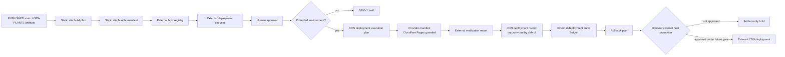

<!-- [KFM_META_BLOCK_V2]
doc_id: kfm://doc/NEEDS_VERIFICATION-usda-plants-external-cdn-deployment-layer
title: USDA PLANTS External CDN Deployment Layer
type: standard
version: v1
status: draft
owners: NEEDS_VERIFICATION-flora-steward
created: NEEDS_VERIFICATION
updated: 2026-05-08
policy_label: NEEDS_VERIFICATION-public-or-restricted
related: [docs/domains/flora/README.md, docs/domains/flora/usda_plants/USDA_PLANTS_PUBLICATION_LAYER.md, docs/domains/flora/usda_plants/USDA_PLANTS_TILE_ARCHIVE_PUBLICATION_LAYER.md, docs/domains/flora/usda_plants/USDA_PLANTS_COUNTY_GEOMETRY_PUBLICATION_LAYER.md, docs/domains/flora/usda_plants/USDA_PLANTS_CATALOG_RELEASE_LAYER.md, policy/flora/usda_plants_external_deployment.rego, policy/flora/usda_plants_external_deployment_test.rego, tests/flora/test_usda_plants_cloudflare_workflow_guardrails.py]
tags: [kfm, flora, usda-plants, external-cdn, cloudflare-pages, static-site, deployment, governance]
notes: [doc_id, owners, created date, and policy label require steward verification. This document describes an optional external CDN layer for already-built static site artifacts only. Workflow presence and protected-environment configuration must be verified in the target checkout before use. No secret values belong in this document.]
[/KFM_META_BLOCK_V2] -->

<a id="top"></a>

# USDA PLANTS External CDN Deployment Layer

Optional, guarded external-CDN deployment guidance for already-built USDA PLANTS static site artifacts.


> [!IMPORTANT]
> **Status:** draft  
> **Path:** `docs/domains/flora/usda_plants/USDA_PLANTS_EXTERNAL_CDN_DEPLOYMENT_LAYER.md`  
> **Lifecycle placement:** `PUBLISHED_STATIC_SITE_ARTIFACT → EXTERNAL_DEPLOYMENT_REQUEST → EXTERNAL_DEPLOYMENT_APPROVAL → GUARDED_CDN_PLAN → OPTIONAL_EXTERNAL_HOST_PROMOTION`  
> **Default host posture:** GitHub Pages remains the default static deployment surface. External CDN hosting is optional and explicitly guarded.  
> **Cloudflare posture:** disabled by default; requires a human request, human approval, protected environment, scoped secrets, artifact evidence, and post-deploy verification.  
> **Source posture:** this layer does not fetch USDA data, Census data, basemaps, geometry, or live source records.

**Quick links:** [Purpose](#purpose) · [Repo fit](#repo-fit) · [Scope](#scope) · [Lifecycle](#lifecycle) · [Accepted inputs](#accepted-inputs) · [Exclusions](#exclusions) · [Artifact contract](#artifact-contract) · [Workflow contract](#workflow-contract) · [Builder flow](#builder-flow) · [Policy gates](#policy-gates) · [Security posture](#security-posture) · [Validation checklist](#validation-checklist) · [Rollback](#rollback-and-audit) · [Future OIDC layer](#future-provider-oidc-layer)

---

## Purpose

This layer defines the **optional external CDN deployment seam** for USDA PLANTS static site artifacts that have already passed the controlled publication and static-site build layers.

It is not a publication layer, not a source-ingestion layer, and not a shortcut around KFM promotion. Its only job is to describe how an already-built, already-public-safe, already-hash-addressed static site bundle may be prepared for an external host such as Cloudflare Pages under explicit human and policy gates.

```text
This layer does:
  static site bundle + external host registry + request + approval + deployment plan
  -> optional guarded provider manifest + receipt + verification + audit ledger + rollback plan

This layer does not:
  fetch source data, promote records, publish new facts, expose secrets, auto-merge,
  auto-deploy from tests, change DNS, purge caches by default, or publish occurrence coordinates
```

[Back to top](#top)

---

## Repo fit

`docs/domains/flora/usda_plants/` is the human-facing documentation home for the USDA PLANTS lane. The external CDN deployment layer belongs here because it explains a domain-specific publication-adjacent operating seam while leaving policy, schemas, tests, workflows, and deployment builders in their own responsibility roots.

| Surface | Path | Role | Verification posture |
| --- | --- | --- | --- |
| Parent flora README | [`../README.md`](../README.md) | Flora lane entry point and trust posture | **CONFIRMED path** |
| Controlled publication layer | [`./USDA_PLANTS_PUBLICATION_LAYER.md`](./USDA_PLANTS_PUBLICATION_LAYER.md) | Defines public-safe publication from sealed promoted packages | **CONFIRMED path** |
| Catalog release layer | [`./USDA_PLANTS_CATALOG_RELEASE_LAYER.md`](./USDA_PLANTS_CATALOG_RELEASE_LAYER.md) | Fixture-backed catalog/release-candidate closure before publication | **CONFIRMED path** |
| County geometry publication layer | [`./USDA_PLANTS_COUNTY_GEOMETRY_PUBLICATION_LAYER.md`](./USDA_PLANTS_COUNTY_GEOMETRY_PUBLICATION_LAYER.md) | Governed county-boundary GeoJSON publication layer | **CONFIRMED path** |
| Tile archive publication layer | [`./USDA_PLANTS_TILE_ARCHIVE_PUBLICATION_LAYER.md`](./USDA_PLANTS_TILE_ARCHIVE_PUBLICATION_LAYER.md) | Controlled tile archive publication; no deploy | **CONFIRMED path** |
| External deployment policy | [`../../../../policy/flora/usda_plants_external_deployment.rego`](../../../../policy/flora/usda_plants_external_deployment.rego) | Deny rules for approval, host allow-list, protected environment, refs, secrets, hashes, attribution | **CONFIRMED path** |
| External deployment policy test | [`../../../../policy/flora/usda_plants_external_deployment_test.rego`](../../../../policy/flora/usda_plants_external_deployment_test.rego) | Clean-input allow case for deployment policy | **CONFIRMED path** |
| Cloudflare workflow guardrail test | [`../../../../tests/flora/test_usda_plants_cloudflare_workflow_guardrails.py`](../../../../tests/flora/test_usda_plants_cloudflare_workflow_guardrails.py) | Expects dispatch-only workflow, default-false deploy toggle, protected environment, scoped secret names | **CONFIRMED test path** |
| Cloudflare workflow | `../../../../.github/workflows/usda-plants-deploy-cloudflare-pages.yml` | Optional guarded deployment workflow | **NEEDS VERIFICATION** in target checkout |
| External host registry builder | [`../../../../tools/deploy/flora/usda_plants_external_host_registry_builder.py`](../../../../tools/deploy/flora/usda_plants_external_host_registry_builder.py) | Builds allow-list-style external host registry | **CONFIRMED path** |
| Request builder | [`../../../../tools/deploy/flora/usda_plants_external_deployment_request_builder.py`](../../../../tools/deploy/flora/usda_plants_external_deployment_request_builder.py) | Builds human-request artifact for a selected target host | **CONFIRMED path** |
| Approval builder | [`../../../../tools/deploy/flora/usda_plants_external_deployment_approval_builder.py`](../../../../tools/deploy/flora/usda_plants_external_deployment_approval_builder.py) | Builds human approval artifact | **CONFIRMED path** |
| CDN execution plan builder | [`../../../../tools/deploy/flora/usda_plants_cdn_deployment_execution_plan_builder.py`](../../../../tools/deploy/flora/usda_plants_cdn_deployment_execution_plan_builder.py) | Builds protected dry-run CDN deployment plan | **CONFIRMED path** |
| Cloudflare manifest builder | [`../../../../tools/deploy/flora/usda_plants_cloudflare_pages_manifest_builder.py`](../../../../tools/deploy/flora/usda_plants_cloudflare_pages_manifest_builder.py) | Builds Cloudflare Pages provider manifest with scoped secret names | **CONFIRMED path** |
| CDN receipt builder | [`../../../../tools/deploy/flora/usda_plants_cdn_deployment_receipt_builder.py`](../../../../tools/deploy/flora/usda_plants_cdn_deployment_receipt_builder.py) | Builds artifact-only CDN receipt; default `deployed=false` | **CONFIRMED path** |
| External verification builder | [`../../../../tools/deploy/flora/usda_plants_external_deployment_verifier.py`](../../../../tools/deploy/flora/usda_plants_external_deployment_verifier.py) | Verifies local dry-run deployment inputs | **CONFIRMED path** |
| Cache invalidation builder | [`../../../../tools/deploy/flora/usda_plants_cache_invalidation_plan_builder.py`](../../../../tools/deploy/flora/usda_plants_cache_invalidation_plan_builder.py) | Builds dry-run cache invalidation plan; default no purge | **CONFIRMED path** |
| Custom-domain readiness builder | [`../../../../tools/deploy/flora/usda_plants_custom_domain_readiness_builder.py`](../../../../tools/deploy/flora/usda_plants_custom_domain_readiness_builder.py) | Tracks DNS/custom-domain readiness separately from deployment | **CONFIRMED path** |
| Audit ledger builder | [`../../../../tools/deploy/flora/usda_plants_external_deployment_audit_ledger_builder.py`](../../../../tools/deploy/flora/usda_plants_external_deployment_audit_ledger_builder.py) | Builds hash-addressed audit ledger over deployment artifacts | **CONFIRMED path** |
| CDN rollback plan builder | [`../../../../tools/deploy/flora/usda_plants_cdn_rollback_plan_builder.py`](../../../../tools/deploy/flora/usda_plants_cdn_rollback_plan_builder.py) | Builds human-approved rollback plan; does not execute rollback | **CONFIRMED path** |

> [!NOTE]
> This document is intentionally domain-specific, but it does not create a new root-level deployment authority. KFM keeps docs, policy, tools, tests, schemas, workflows, and emitted artifacts under their responsibility roots.

[Back to top](#top)

---

## Scope

### This layer owns

| Area | Responsibility |
| --- | --- |
| External host targeting | Declare which external hosts are allowed for a snapshot and whether Cloudflare is enabled for review. |
| Deployment request | Capture a human `requester`, target host, snapshot date, and generated timestamp. |
| Deployment approval | Capture a separate human approval before a CDN plan can be considered usable. |
| CDN execution planning | Produce a protected dry-run deployment plan over an existing static site bundle manifest. |
| Provider manifest | Describe Cloudflare Pages provider configuration without serializing secret values. |
| Verification | Check local deployment inputs and provider manifest evidence before treating a plan as reviewable. |
| Receipt | Record deployment receipt status with `dry_run=true`, `deployed=false` unless a future guarded execution layer changes that. |
| Cache plan | Track cache invalidation as an explicit artifact; do not purge by default. |
| Custom-domain readiness | Track DNS/custom-domain readiness separately from deployment execution. |
| Audit and rollback | Keep an artifact hash ledger and a human-approval rollback plan. |

### This layer does not own

| Out of scope | Better home |
| --- | --- |
| USDA source download or source refresh | Live-source readiness / watcher layers |
| Controlled publication of USDA PLANTS data | `USDA_PLANTS_PUBLICATION_LAYER.md` |
| County boundary publication | `USDA_PLANTS_COUNTY_GEOMETRY_PUBLICATION_LAYER.md` |
| Tile archive publication | `USDA_PLANTS_TILE_ARCHIVE_PUBLICATION_LAYER.md` |
| Static-site build from published artifacts | Static deployment chain and static-site builders |
| Promotion decisions | Promotion / release state objects |
| Cloudflare account setup | Repository admin / platform runbook |
| DNS cutover | Custom-domain readiness + platform review |
| Secret creation or rotation | Repository environment settings and security runbooks |
| OIDC provider rollout | Future provider-OIDC deployment layer |

[Back to top](#top)

---

## Lifecycle



### State transition rule

```text
PUBLISHED_STATIC_SITE_ARTIFACT
  -> EXTERNAL_DEPLOYMENT_REQUEST
  -> EXTERNAL_DEPLOYMENT_APPROVAL
  -> GUARDED_CDN_PLAN
  -> EXTERNAL_VERIFICATION
  -> CDN_RECEIPT
  -> AUDIT_LEDGER
  -> ROLLBACK_PLAN
  -/-> EXTERNAL_HOST_PROMOTION unless a protected gate explicitly allows it
```

> [!WARNING]
> External hosting is a deployment surface, not a truth surface. It may serve already-public-safe artifacts; it must not create new claims, bypass release manifests, or become a source of canonical data.

[Back to top](#top)

---

## Accepted inputs

| Input | Expected shape | Required condition |
| --- | --- | --- |
| Snapshot date | `YYYY-MM-DD` | Must match the static site bundle being considered. |
| Static site bundle manifest | `site/flora/usda_plants/<snapshot_date>/static_site_bundle_manifest.json` | Must be produced by the static-site build chain and contain only public-safe static artifacts. |
| External host registry | `usda_plants_external_host_registry` | Must include `github_pages` and any optional `cloudflare_pages_guarded` entry with explicit `allowed` state. |
| External deployment request | `usda_plants_external_deployment_request` | Must be human-authored or human-requested; target host must be allowed. |
| External deployment approval | `usda_plants_external_deployment_approval` | Must be separate, human, approved, and usable by the plan. |
| Protected environment flag | Boolean | Required before Cloudflare plan can pass policy. |
| Cloudflare provider manifest | `usda_plants_cloudflare_pages_deployment_manifest` | Must contain provider, deployment mode, environment-scoped secret names, and no secret values. |
| Verification report | `usda_plants_external_deployment_verification_report` | Must pass for local dry-run evidence before any optional deploy gate. |
| Receipt | `usda_plants_cdn_deployment_receipt` | Must record `dry_run`, `deployed`, and provider identifiers without inventing deployment success. |
| Audit ledger | `usda_plants_external_deployment_audit_ledger` | Must hash-address registry, plan, provider manifest, receipt, verification, rollback, and cache/custom-domain artifacts where used. |
| Attribution | Text containing `USDA PLANTS` | Required by policy gate. |

[Back to top](#top)

---

## Exclusions

> [!CAUTION]
> These exclusions are guardrails. Do not soften them in a convenience deployment PR.

This layer must not admit, emit, or claim:

- live USDA PLANTS downloads;
- Census downloads;
- external basemap downloads;
- raw, work, or quarantine references in deployment refs;
- plant occurrence or specimen coordinates;
- hidden coordinate fields;
- raw source rows in static assets;
- unreviewed county geometry;
- unapproved tile or archive generation;
- Cloudflare secret values;
- unscoped secrets;
- unapproved long-lived secrets;
- provider tokens in logs, receipts, manifests, or docs;
- automatic PR creation or auto-merge;
- deployment from tests;
- scheduled Cloudflare deployment;
- push-triggered Cloudflare deployment;
- pull-request-triggered Cloudflare deployment;
- DNS cutover;
- cache purge as a default side effect;
- rollback execution without human approval.

[Back to top](#top)

---

## Artifact contract

| Artifact | Object type | Producer | Key safety fields |
| --- | --- | --- | --- |
| External host registry | `usda_plants_external_host_registry` | `usda_plants_external_host_registry_builder.py` | `hosts[]`, `allowed`, `credential_model`, `registry_hash` |
| Deployment request | `usda_plants_external_deployment_request` | `usda_plants_external_deployment_request_builder.py` | `requester`, `requester_type`, `target_host_id`, `request_hash` |
| Deployment approval | `usda_plants_external_deployment_approval` | `usda_plants_external_deployment_approval_builder.py` | `approver`, `approver_type`, `decision`, `usable_by_plan`, `approval_hash` |
| CDN execution plan | `usda_plants_cdn_deployment_execution_plan` | `usda_plants_cdn_deployment_execution_plan_builder.py` | `dry_run`, `deploys`, `protected_environment`, `site_bundle_manifest_ref`, `plan_hash` |
| Cloudflare Pages manifest | `usda_plants_cloudflare_pages_deployment_manifest` | `usda_plants_cloudflare_pages_manifest_builder.py` | `provider`, `deployment_mode`, `credential_model`, `secret_names`, `deploys`, `protected_environment`, `provider_manifest_hash` |
| Custom-domain readiness | `usda_plants_custom_domain_readiness` | `usda_plants_custom_domain_readiness_builder.py` | `custom_domain`, `dns_change_requested=false`, `status`, `readiness_hash` |
| Cache invalidation plan | `usda_plants_cache_invalidation_plan` | `usda_plants_cache_invalidation_plan_builder.py` | `dry_run=true`, `purges_cache=false`, `cache_plan_hash` |
| CDN receipt | `usda_plants_cdn_deployment_receipt` | `usda_plants_cdn_deployment_receipt_builder.py` | `dry_run`, `deployed`, `deployment_url`, `provider_deployment_id`, `receipt_hash` |
| External verification report | `usda_plants_external_deployment_verification_report` | `usda_plants_external_deployment_verifier.py` | `mode=local_dry_run`, `passed`, `reason_codes`, `verification_hash` |
| Audit ledger | `usda_plants_external_deployment_audit_ledger` | `usda_plants_external_deployment_audit_ledger_builder.py` | `entries[]`, `artifact`, `sha256`, `ledger_hash` |
| CDN rollback plan | `usda_plants_cdn_rollback_plan` | `usda_plants_cdn_rollback_plan_builder.py` | `execute_rollback=false`, `actions[].requires_human_approval`, `rollback_hash` |

### Required hash chain

A reviewable external CDN packet must carry, at minimum:

```text
registry_hash
plan_hash
provider_manifest_hash
receipt_hash
verification_hash
ledger_hash
```

Rollback, cache, and custom-domain readiness hashes should be included in the audit ledger when those artifacts are generated.

[Back to top](#top)

---

## Workflow contract

The optional Cloudflare workflow must be treated as a protected operational surface.

| Requirement | Expected posture |
| --- | --- |
| Trigger model | `workflow_dispatch` only |
| Disallowed triggers | `schedule`, `push`, and `pull_request` deployment triggers |
| Deploy toggle | `deploy_to_cloudflare` defaults to `'false'` and must be explicitly set to `'true'` |
| Deploy job condition | Deploy job runs only when `inputs.deploy_to_cloudflare == 'true'` |
| Permissions | Minimal read posture unless the repo-approved workflow requires more for a specific step |
| Environment | `usda-plants-external-deployment` protected environment |
| Secrets | Use secret names only: `CLOUDFLARE_ACCOUNT_ID`, `CLOUDFLARE_API_TOKEN` |
| Secret values | Never printed, serialized, stored in manifests, or referenced in documentation |
| CI posture | Tests may validate workflow guardrails, but tests must never deploy |

> [!WARNING]
> The workflow file itself is **NEEDS VERIFICATION** in the target checkout. The guardrail test references `.github/workflows/usda-plants-deploy-cloudflare-pages.yml`; maintainers should confirm the file exists and matches these constraints before enabling any Cloudflare deployment path.

[Back to top](#top)

---

## Builder flow

Run from the repository root. Replace snapshot dates and output paths with the actual static-site bundle under review.

```bash
SNAPSHOT_DATE="2026-01-01"
GENERATED_AT="2026-01-01T00:00:00Z"
OUT_DIR="/tmp/kfm-usda-plants-external-cdn"
SITE_BUNDLE="${OUT_DIR}/site/flora/usda_plants/${SNAPSHOT_DATE}/static_site_bundle_manifest.json"

mkdir -p "${OUT_DIR}/deploy/flora/usda_plants"

# 1. Build the external host registry.
python tools/deploy/flora/usda_plants_external_host_registry_builder.py \
  --snapshot-date "${SNAPSHOT_DATE}" \
  --generated-at "${GENERATED_AT}" \
  --allow-cloudflare \
  --out "${OUT_DIR}/deploy/flora/usda_plants/external_host_registry.json"

# 2. Build a human deployment request.
python tools/deploy/flora/usda_plants_external_deployment_request_builder.py \
  --snapshot-date "${SNAPSHOT_DATE}" \
  --generated-at "${GENERATED_AT}" \
  --registry "${OUT_DIR}/deploy/flora/usda_plants/external_host_registry.json" \
  --target-host-id "cloudflare_pages_guarded" \
  --requester "REPLACE_WITH_HUMAN_REQUESTER_ID" \
  --out "${OUT_DIR}/deploy/flora/usda_plants/external_deployment_request.json"

# 3. Build a separate human approval.
python tools/deploy/flora/usda_plants_external_deployment_approval_builder.py \
  --snapshot-date "${SNAPSHOT_DATE}" \
  --generated-at "${GENERATED_AT}" \
  --approver "REPLACE_WITH_HUMAN_APPROVER_ID" \
  --out "${OUT_DIR}/deploy/flora/usda_plants/external_deployment_approval.json"

# 4. Build a protected CDN execution plan.
python tools/deploy/flora/usda_plants_cdn_deployment_execution_plan_builder.py \
  --snapshot-date "${SNAPSHOT_DATE}" \
  --generated-at "${GENERATED_AT}" \
  --site-bundle-manifest "${SITE_BUNDLE}" \
  --request "${OUT_DIR}/deploy/flora/usda_plants/external_deployment_request.json" \
  --approval "${OUT_DIR}/deploy/flora/usda_plants/external_deployment_approval.json" \
  --protected-environment \
  --out "${OUT_DIR}/deploy/flora/usda_plants/cdn_deployment_execution_plan.json"

# 5. Build the Cloudflare Pages provider manifest.
python tools/deploy/flora/usda_plants_cloudflare_pages_manifest_builder.py \
  --snapshot-date "${SNAPSHOT_DATE}" \
  --generated-at "${GENERATED_AT}" \
  --protected-environment \
  --out "${OUT_DIR}/deploy/flora/usda_plants/cloudflare_pages_manifest.json"

# 6. Verify external deployment evidence locally.
python tools/deploy/flora/usda_plants_external_deployment_verifier.py \
  --snapshot-date "${SNAPSHOT_DATE}" \
  --generated-at "${GENERATED_AT}" \
  --site-bundle-manifest "${SITE_BUNDLE}" \
  --provider-manifest "${OUT_DIR}/deploy/flora/usda_plants/cloudflare_pages_manifest.json" \
  --out "${OUT_DIR}/deploy/flora/usda_plants/external_deployment_verification_report.json"

# 7. Build dry-run receipt, cache plan, custom-domain readiness, rollback, and audit ledger.
python tools/deploy/flora/usda_plants_cdn_deployment_receipt_builder.py \
  --snapshot-date "${SNAPSHOT_DATE}" \
  --generated-at "${GENERATED_AT}" \
  --out "${OUT_DIR}/deploy/flora/usda_plants/cdn_deployment_receipt.json"

python tools/deploy/flora/usda_plants_cache_invalidation_plan_builder.py \
  --snapshot-date "${SNAPSHOT_DATE}" \
  --generated-at "${GENERATED_AT}" \
  --out "${OUT_DIR}/deploy/flora/usda_plants/cache_invalidation_plan.json"

python tools/deploy/flora/usda_plants_custom_domain_readiness_builder.py \
  --snapshot-date "${SNAPSHOT_DATE}" \
  --generated-at "${GENERATED_AT}" \
  --out "${OUT_DIR}/deploy/flora/usda_plants/custom_domain_readiness.json"

python tools/deploy/flora/usda_plants_cdn_rollback_plan_builder.py \
  --snapshot-date "${SNAPSHOT_DATE}" \
  --generated-at "${GENERATED_AT}" \
  --out "${OUT_DIR}/deploy/flora/usda_plants/cdn_rollback_plan.json"

python tools/deploy/flora/usda_plants_external_deployment_audit_ledger_builder.py \
  --snapshot-date "${SNAPSHOT_DATE}" \
  --generated-at "${GENERATED_AT}" \
  --artifact "${OUT_DIR}/deploy/flora/usda_plants/external_host_registry.json" \
  --artifact "${OUT_DIR}/deploy/flora/usda_plants/cdn_deployment_execution_plan.json" \
  --artifact "${OUT_DIR}/deploy/flora/usda_plants/cloudflare_pages_manifest.json" \
  --artifact "${OUT_DIR}/deploy/flora/usda_plants/cdn_deployment_receipt.json" \
  --artifact "${OUT_DIR}/deploy/flora/usda_plants/external_deployment_verification_report.json" \
  --artifact "${OUT_DIR}/deploy/flora/usda_plants/cache_invalidation_plan.json" \
  --artifact "${OUT_DIR}/deploy/flora/usda_plants/custom_domain_readiness.json" \
  --artifact "${OUT_DIR}/deploy/flora/usda_plants/cdn_rollback_plan.json" \
  --out "${OUT_DIR}/deploy/flora/usda_plants/external_deployment_audit_ledger.json"
```

### Test commands

```bash
python -m pytest \
  tests/flora/test_usda_plants_external_host_registry_builder.py \
  tests/flora/test_usda_plants_external_deployment_request_builder.py \
  tests/flora/test_usda_plants_external_deployment_approval_builder.py \
  tests/flora/test_usda_plants_cdn_deployment_execution_plan_builder.py \
  tests/flora/test_usda_plants_cloudflare_pages_manifest_builder.py \
  tests/flora/test_usda_plants_external_deployment_verifier.py \
  tests/flora/test_usda_plants_cdn_deployment_receipt_builder.py \
  tests/flora/test_usda_plants_cache_invalidation_plan_builder.py \
  tests/flora/test_usda_plants_custom_domain_readiness_builder.py \
  tests/flora/test_usda_plants_external_deployment_audit_ledger_builder.py \
  tests/flora/test_usda_plants_cdn_rollback_plan_builder.py
```

### Optional policy check

Run only when OPA is installed and pinned by repo tooling.

```bash
opa test \
  policy/flora/usda_plants_external_deployment.rego \
  policy/flora/usda_plants_external_deployment_test.rego
```

[Back to top](#top)

---

## Policy gates

The external deployment policy is fail-closed. A clean deployment packet must avoid each denial below.

| Deny code | Meaning |
| --- | --- |
| `USDA_PLANTS_EXTERNAL_DEPLOY_APPROVAL_MISSING` | No approver is present. |
| `USDA_PLANTS_EXTERNAL_DEPLOY_NON_HUMAN_APPROVAL` | Approval is not from a human. |
| `USDA_PLANTS_EXTERNAL_DEPLOY_HOST_NOT_ALLOWED` | Target host is not allowed by the registry/request. |
| `USDA_PLANTS_EXTERNAL_DEPLOY_UNPROTECTED_ENV` | Protected environment is missing. |
| `USDA_PLANTS_EXTERNAL_DEPLOY_RAW_REF_LEAK` | A deployment ref points into `raw/`. |
| `USDA_PLANTS_EXTERNAL_DEPLOY_WORK_REF_LEAK` | A deployment ref points into `work/`. |
| `USDA_PLANTS_EXTERNAL_DEPLOY_QUARANTINE_REF_LEAK` | A deployment ref points into `quarantine/`. |
| `USDA_PLANTS_EXTERNAL_DEPLOY_OCCURRENCE_COORDINATE_LEAK` | Deployment claims occurrence/specimen coordinates. |
| `USDA_PLANTS_EXTERNAL_DEPLOY_SECRET_VALUE_LEAK` | Deployment claims or exposes secret values. |
| `USDA_PLANTS_EXTERNAL_DEPLOY_UNSCOPED_SECRET` | Secret use is not environment-scoped. |
| `USDA_PLANTS_EXTERNAL_DEPLOY_LONG_LIVED_SECRET_UNAPPROVED` | Long-lived secret use lacks approval. |
| `USDA_PLANTS_EXTERNAL_DEPLOY_AUTO_MERGE_CLAIM` | Deployment claims auto-merge behavior. |
| `USDA_PLANTS_EXTERNAL_DEPLOY_MISSING_REGISTRY_HASH` | Registry hash is missing. |
| `USDA_PLANTS_EXTERNAL_DEPLOY_MISSING_PLAN_HASH` | Plan hash is missing. |
| `USDA_PLANTS_EXTERNAL_DEPLOY_MISSING_PROVIDER_MANIFEST_HASH` | Provider manifest hash is missing. |
| `USDA_PLANTS_EXTERNAL_DEPLOY_MISSING_RECEIPT_HASH` | Receipt hash is missing. |
| `USDA_PLANTS_EXTERNAL_DEPLOY_MISSING_VERIFICATION_HASH` | Verification hash is missing. |
| `USDA_PLANTS_EXTERNAL_DEPLOY_MISSING_LEDGER_HASH` | Audit ledger hash is missing. |
| `USDA_PLANTS_EXTERNAL_DEPLOY_BAD_ATTRIBUTION` | Attribution does not include USDA PLANTS. |

[Back to top](#top)

---

## Security posture

### Secret handling

- Store Cloudflare credentials only as repository or environment secrets.
- Use the protected environment `usda-plants-external-deployment` before any Cloudflare deploy job can run.
- Pass secret values only to the deploy action inputs or environment at execution time.
- Do not write secret values into manifests, logs, receipts, audit ledgers, markdown, test fixtures, or generated JSON.
- Prefer future provider OIDC where supported and reviewed.

### Access and deployment posture

| Risk | Default response |
| --- | --- |
| Unverified workflow file | Treat workflow execution as blocked until file and environment are verified. |
| Missing protected environment | Deny Cloudflare deployment. |
| Missing human approval | Deny Cloudflare deployment. |
| Long-lived provider secret without review | Deny or hold. |
| Secret value appears in any artifact | Quarantine artifact, rotate secret, and open security review. |
| CDN artifact points to internal lifecycle zones | Deny deployment. |
| Custom-domain readiness is unreviewed | No DNS cutover. |
| Cache invalidation is not separately planned | No cache purge. |
| Deployment receipt lacks hash | Deny release of deployment evidence. |

[Back to top](#top)

---

## Validation checklist

Before enabling or reviewing an external CDN deployment PR:

- [ ] Meta block `doc_id`, owner, created date, and policy label are verified.
- [ ] Static site bundle manifest exists and points only to public-safe USDA PLANTS static artifacts.
- [ ] No source fetch, geometry refresh, basemap fetch, or USDA/Census network call is introduced.
- [ ] External host registry exists and explicitly controls Cloudflare allowance.
- [ ] Deployment request is human-requested.
- [ ] Deployment approval is separate, human, and approved.
- [ ] CDN execution plan has `protected_environment=true`.
- [ ] Provider manifest includes secret names only, not secret values.
- [ ] CDN receipt is generated and does not claim deployment success unless a future reviewed execution layer supports that.
- [ ] Verification report passes local dry-run checks.
- [ ] Cache invalidation plan is generated with `purges_cache=false` unless a later reviewed operation changes it.
- [ ] Custom-domain readiness is generated with `dns_change_requested=false` unless a later reviewed DNS operation changes it.
- [ ] Audit ledger includes hashes for deployment evidence artifacts.
- [ ] Rollback plan exists and requires human approval.
- [ ] Policy check denies missing approval, unprotected environment, raw/work/quarantine refs, coordinate leaks, secret leaks, auto-merge claims, missing hashes, and bad attribution.
- [ ] Cloudflare workflow file exists, is `workflow_dispatch` only, and keeps `deploy_to_cloudflare` defaulted to `'false'`.
- [ ] Workflow uses protected environment `usda-plants-external-deployment`.
- [ ] Workflow contains no literal tokens, API keys, or secret values.
- [ ] Tests validate workflow guardrails but do not deploy.

[Back to top](#top)

---

## Rollback and audit

Rollback is planned, not executed, by this layer.

| Failure | Required response |
| --- | --- |
| Wrong snapshot deployed | Stop external promotion; generate rollback plan; restore previous approved artifact pointer after human approval. |
| Secret value leaked | Revoke/rotate secret, quarantine logs/artifacts, open security review, and block future deploys until reviewed. |
| Provider manifest hash mismatch | Regenerate provider manifest and audit ledger; do not deploy. |
| Verification report fails | Keep deployment artifact-only and block deploy gate. |
| Protected environment missing | Block deploy gate and fix repository environment settings. |
| Cache issue after deployment | Use cache invalidation plan only after human-approved operational decision. |
| DNS issue | Revert via custom-domain readiness / DNS runbook; do not combine with data rollback. |
| CDN serves stale or wrong artifact | Roll back to prior static bundle reference; record correction and audit ledger entry. |
| Public artifact leaks internal ref | Withdraw external deployment, remove CDN artifact, quarantine bundle, and rebuild from public-safe inputs. |

[Back to top](#top)

---

## Future provider-OIDC layer

OIDC-backed provider deployment should be handled as a separate reviewed layer.

| Future capability | Required evidence before adoption |
| --- | --- |
| Provider OIDC | Provider support, repo/environment claims, least-privilege policy, trust relationship, audit behavior, rollback plan |
| Multi-provider CDN | Provider registry, per-provider manifest, per-provider credential model, per-provider verification report |
| Automated cache invalidation | Human approval model, blast-radius plan, dry-run receipts, provider-specific rollback behavior |
| Custom-domain cutover | DNS ownership proof, TTL plan, rollback plan, stakeholder approval, post-cutover verification |
| Scheduled external deployment | Strong justification, policy gate, dry-run artifact evidence, protected environment, no source-fetch coupling |

[Back to top](#top)

---

## Appendix

<details>
<summary>Layer summary preserved from the original thin document</summary>

The original document established these core rules, all preserved and expanded here:

- external CDN deployment is optional;
- GitHub Pages remains the default static deployment surface;
- Cloudflare deployment is guarded;
- external deployment happens only after static publication artifacts are built and policy-checked;
- external host targeting is declared through a registry and deployment manifests;
- manual `workflow_dispatch` requires `snapshot_date`, `requester_id`, `approver_id`, and optional Cloudflare toggle;
- protected environment approval is required for Cloudflare;
- dry-run evidence precedes any deployment gate;
- `deploy_to_cloudflare` defaults false;
- custom domain readiness is tracked independently;
- cache invalidation is separately planned;
- deployment receipt, verification report, rollback plan, and audit ledger preserve traceability;
- policy gates remain enforceable in dry-run mode;
- workflow must not run on schedule, push, or pull request;
- this layer does not fetch USDA data, Census data, or external basemaps;
- secrets must be environment-scoped and never printed or serialized;
- the layer does not auto-merge, auto-open PRs, or initiate live ingestion/geometry refresh;
- provider-OIDC remains a future separate layer.

</details>

<details>
<summary>Minimum reviewer questions</summary>

1. Is the static site bundle already public-safe and already published by the controlled publication path?
2. Does the external host registry allow the requested host?
3. Is the requester human?
4. Is the approver a separate human?
5. Is the protected environment configured?
6. Are only secret names present in code/manifests/docs?
7. Is `deploy_to_cloudflare` defaulted to `false`?
8. Is the workflow dispatch-only?
9. Do all external deployment refs avoid `raw/`, `work/`, and `quarantine/`?
10. Do deployment claims avoid occurrence coordinates and raw source rows?
11. Do registry, plan, provider manifest, receipt, verification, and audit ledger hashes exist?
12. Is rollback planned and human-approved?
13. Are cache invalidation and DNS cutover separate from deployment execution?
14. Does the policy test pass?
15. Does the workflow guardrail test pass without performing a deployment?

</details>

[Back to top](#top)
