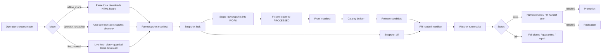

<!-- [KFM_META_BLOCK_V2]
doc_id: kfm://doc/NEEDS-VERIFICATION-usda-plants-guarded-live-watcher-layer
title: USDA PLANTS Guarded Live Watcher Layer
type: standard
version: v1
status: draft
owners: @bartytime4life (CODEOWNERS fallback; flora steward NEEDS VERIFICATION)
created: NEEDS_VERIFICATION
updated: 2026-05-08
policy_label: public
related: [docs/domains/flora/usda_plants/README.md, docs/domains/flora/usda_plants/USDA_PLANTS_LIVE_SOURCE_READINESS_LAYER.md, docs/domains/flora/usda_plants/USDA_PLANTS_CATALOG_RELEASE_LAYER.md, docs/domains/flora/usda_plants/USDA_PLANTS_SCHEDULED_OBSERVER_LAYER.md, docs/domains/flora/usda_plants/USDA_PLANTS_PUBLICATION_LAYER.md, contracts/source/kansas_flora/usda_plants.md, pipelines/watchers/kansas_flora_watch/README.md, policy/flora/usda_plants_watcher.rego, schemas/flora/usda_plants_watcher_run_receipt.schema.json, tools/watchers/flora/usda_plants_manual_watcher.py, tools/sources/flora/usda_plants_live_fetcher.py, tests/flora/test_usda_plants_manual_watcher.py]
tags: [kfm, flora, usda-plants, guarded-live-watcher, source-intake, receipts, no-network-ci, manual-operator]
notes: [doc_id and created date require repository metadata verification; owners use current CODEOWNERS fallback until a flora steward is verified; this layer documents a guarded manual watcher and PR handoff surface, not promotion, publication, scheduled automation, or public map release]
[/KFM_META_BLOCK_V2] -->

<a id="top"></a>

# USDA PLANTS Guarded Live Watcher Layer

Manual guarded watcher layer for USDA PLANTS source intake: live-fetch planning, snapshot lock/diff, watcher receipts, release-candidate handoff, and fail-closed review without automatic promotion or publication.


> [!IMPORTANT]
> **Status:** `draft`  
> **Path:** `docs/domains/flora/usda_plants/USDA_PLANTS_GUARDED_LIVE_WATCHER_LAYER.md`  
> **Layer:** `usda_plants_guarded_live_watcher`  
> **Lifecycle placement:** `RAW → WORK / QUARANTINE → PROCESSED → CATALOG / TRIPLET → RELEASE_CANDIDATE`  
> **Network posture:** disabled in CI; manual guarded mode only for operator-controlled runs  
> **Promotion posture:** `not_promoted`  
> **Publication posture:** `not_published`  
> **Runtime claim:** this document does **not** prove workflow enforcement, scheduled automation, branch protection, public release, API availability, or UI rendering.

**Quick links:** [Purpose](#purpose) · [Repo fit](#repo-fit) · [Scope](#scope) · [Inputs](#accepted-inputs) · [Exclusions](#exclusions) · [Guard model](#guard-model) · [Watcher flow](#watcher-flow) · [Receipts](#receipt-and-output-contract) · [Policy gates](#policy-gates) · [CI posture](#ci-and-no-network-posture) · [Operator instructions](#operator-instructions) · [Failure behavior](#failure-and-quarantine-behavior) · [Definition of done](#definition-of-done) · [Future paths](#future-paths)

---

## Purpose

This layer documents the **manual guarded watcher** for USDA PLANTS after source-readiness work has proven that operator-supplied snapshots can be staged safely.

It adds a controlled bridge from source discovery or manually guarded live fetch into source snapshots, snapshot locks, staged inputs, proof/catalog artifacts, a release candidate, watcher receipt, and PR handoff manifest.

It deliberately stops before promotion and publication.

```text
This layer may produce:
  raw snapshot manifest
  snapshot lock
  staged input manifest
  processed fixture-loader outputs
  proof manifest
  catalog ref
  release candidate
  snapshot diff
  watcher run receipt
  PR handoff manifest

This layer must not produce:
  publication approval
  public map layer
  public county geometry
  vector tiles
  automatic PR creation
  automatic merge
  promotion decision
```

[Back to top](#top)

---

## Repo fit

This file belongs under `docs/domains/flora/usda_plants/` because it is a human-facing source-lane lifecycle guide. It links outward to executable policy, schemas, scripts, tests, source contracts, and pipeline docs instead of duplicating their authority.

| Surface | Path | Role | Status |
|---|---|---|---|
| Source-lane README | [`README.md`](./README.md) | USDA PLANTS navigation, boundary, layer map, and publication posture | **CONFIRMED path** |
| Live readiness layer | [`USDA_PLANTS_LIVE_SOURCE_READINESS_LAYER.md`](./USDA_PLANTS_LIVE_SOURCE_READINESS_LAYER.md) | Operator-supplied snapshot readiness before guarded watcher runs | **CONFIRMED path** |
| Catalog/release layer | [`USDA_PLANTS_CATALOG_RELEASE_LAYER.md`](./USDA_PLANTS_CATALOG_RELEASE_LAYER.md) | Release-candidate closure, catalog refs, UI-safe payload refs | **CONFIRMED path** |
| Scheduled observer layer | [`USDA_PLANTS_SCHEDULED_OBSERVER_LAYER.md`](./USDA_PLANTS_SCHEDULED_OBSERVER_LAYER.md) | Observe-only scheduled checks and reviewer queue artifacts | **CONFIRMED path** |
| Publication layer | [`USDA_PLANTS_PUBLICATION_LAYER.md`](./USDA_PLANTS_PUBLICATION_LAYER.md) | Sealed-package-only controlled publication | **CONFIRMED path** |
| Source contract | [`../../../../contracts/source/kansas_flora/usda_plants.md`](../../../../contracts/source/kansas_flora/usda_plants.md) | Human source-admission boundary for USDA PLANTS | **CONFIRMED path** |
| Watcher script | [`../../../../tools/watchers/flora/usda_plants_manual_watcher.py`](../../../../tools/watchers/flora/usda_plants_manual_watcher.py) | Manual watcher orchestration helper | **CONFIRMED path** |
| Live fetch helper | [`../../../../tools/sources/flora/usda_plants_live_fetcher.py`](../../../../tools/sources/flora/usda_plants_live_fetcher.py) | Manual live-fetch plan and receipt helper | **CONFIRMED path** |
| Watcher receipt schema | [`../../../../schemas/flora/usda_plants_watcher_run_receipt.schema.json`](../../../../schemas/flora/usda_plants_watcher_run_receipt.schema.json) | Machine shape for watcher run receipt | **CONFIRMED path** |
| Watcher policy | [`../../../../policy/flora/usda_plants_watcher.rego`](../../../../policy/flora/usda_plants_watcher.rego) | Denies promoted/published watcher outputs and missing receipt hash | **CONFIRMED path** |
| Watcher test | [`../../../../tests/flora/test_usda_plants_manual_watcher.py`](../../../../tests/flora/test_usda_plants_manual_watcher.py) | Offline mock watcher smoke test | **CONFIRMED path** |
| Watcher roadmap | [`../../../../pipelines/watchers/kansas_flora_watch/README.md`](../../../../pipelines/watchers/kansas_flora_watch/README.md) | Kansas flora watcher roadmap and fail-closed posture | **CONFIRMED path** |
| Ownership routing | [`../../../../.github/CODEOWNERS`](../../../../.github/CODEOWNERS) | Conservative review routing | **CONFIRMED path** |

> [!NOTE]
> This authoring pass verified these paths through repository connector evidence, not through a mounted local checkout. Runtime behavior, workflow enforcement, branch protections, protected environments, deployment, and published artifacts remain **UNKNOWN** until a checkout and test run are inspected.

[Back to top](#top)

---

## Scope

### What this layer owns

| Area | Responsibility | Promotion/publication posture |
|---|---|---|
| Guarded live-fetch planning | Produce or reference a live-fetch plan only when operator/network guards are explicit | Never promoted or published here |
| Snapshot lock | Lock source-native RAW inputs before processing | Snapshot lock is evidence/process memory, not approval |
| Snapshot diff | Compare locked snapshots for review support | Diff is not review approval |
| Watcher receipt | Emit watcher run receipt with finite pass/fail state and output refs | Receipt is not release proof |
| Release-candidate handoff | Assemble a manifest for human PR/review handoff | Manifest only; no PR is opened or merged by this layer |
| Failure routing | Fail closed and preserve reason codes | Failed runs do not feed publication |
| CI posture | Preserve no-network fixture behavior in tests | CI must not call the real USDA endpoint |

### What this layer does not own

| Out of scope | Correct surface |
|---|---|
| Source-admission meaning | Source contract |
| Machine validation shape beyond watcher receipt | Schema files |
| Live source rights verification | Source contract, source registry, steward review |
| Scheduled observer automation | Scheduled Observer layer |
| Promotion decision | Release/promotion gate surfaces |
| Controlled publication | Publication layer |
| Public county geometry | Future county-geometry publication layer |
| Vector tiles / PMTiles | Future tile publication layer |
| MapLibre public layer | Future published layer descriptor |
| Evidence Drawer production UI | UI/Evidence Drawer contract and governed API surfaces |
| Branch protection or workflow enforcement | GitHub settings / workflow evidence |

[Back to top](#top)

---

## Accepted inputs

Only reviewer-safe, source-bounded, and receipt-bearing inputs should enter this layer.

| Input | Expected source | Required condition |
|---|---|---|
| Local USDA downloads-page fixture | `tests/fixtures/flora/usda_plants/source_discovery/` | Used for offline/mock and CI-safe runs |
| Operator-supplied raw snapshot directory | `tests/fixtures/...` or operator-staged RAW input | Files are evidence candidates until locked, staged, validated, and receipted |
| Source URI | USDA PLANTS downloads page or localhost test endpoint | Real USDA endpoint requires explicit manual operator/network guard |
| Snapshot date | Operator/run context | `YYYY-MM-DD` and stable across outputs |
| Generated timestamp | Operator/run context | ISO 8601 UTC; fixed timestamp recommended for deterministic tests |
| Existing source contract | `contracts/source/kansas_flora/usda_plants.md` | Must preserve source authority boundary |
| Prior snapshot lock | Prior watcher run artifact, if available | Used for meaningful diff; same-lock diff is only a smoke-path fallback |
| Policy bundle | `policy/flora/usda_plants_watcher.rego` and related USDA PLANTS policies | Must deny publish/promote misuse and missing receipt hash |
| Fixture loader / proof / catalog / release builders | Tool roots under `tools/` | Must be run through repo-native validation before stronger claims |

[Back to top](#top)

---

## Exclusions

Do not treat this layer as a place for:

- credentials, cookies, tokens, secrets, private steward notes, or environment files;
- unrestricted live scraping or polling;
- CI calls to the real USDA endpoint;
- public publication approval;
- promotion decisions;
- public geometry, exact plant coordinates, county boundary output, or tiles;
- image/media reuse claims;
- protected-status claims sourced only from USDA PLANTS;
- rare-plant exact-location release;
- cultural or tribal plant-use claims without review;
- direct public UI/API access to RAW, WORK, QUARANTINE, or unpublished release candidates;
- auto-opened PRs, auto-merged PRs, or hidden release actions.

> [!CAUTION]
> USDA PLANTS distribution context is not exact occurrence evidence. A watcher can help identify source changes, but it cannot turn broad distribution data into precise plant observations.

[Back to top](#top)

---

## Guard model

The guarded watcher supports three operating postures. Only the first posture belongs in normal CI.

| Mode | Network | Typical use | Required guard | Output ceiling |
|---|---:|---|---|---|
| `offline_mock` | Disabled | CI-safe smoke path and deterministic local tests | Local downloads-page fixture + local operator snapshot fixture | Watcher receipt and release-candidate handoff artifacts |
| `operator_snapshot` | Disabled | Operator-supplied source snapshot already captured outside this run | Operator raw directory + snapshot lock | Watcher receipt and release-candidate handoff artifacts |
| `live_manual` | Manual guarded | Exceptional operator-run source capture | `KFM_ALLOW_NETWORK=1`, operator acknowledgement, USDA/localhost source host, no CI by default | RAW snapshot + plan/receipt + watcher artifacts; still no publication |

### Confirmed live-fetch guard expectations

The live-fetch helper records a plan and applies these guard concepts:

| Guard | Required posture |
|---|---|
| Allow-network flag | Required for manual live fetch |
| Operator acknowledgement | Required for manual live fetch |
| `KFM_ALLOW_NETWORK=1` | Required before live network mode is enabled |
| CI refusal | CI network is refused by default |
| CI localhost exception | CI network requires explicit CI allow flag, `KFM_ALLOW_CI_NETWORK=1`, and localhost/127.0.0.1 host |
| Source host | Real network host must be USDA PLANTS or local test host |
| Writes | RAW only |
| Publishes | `false` |
| Promotes | `false` |

> [!IMPORTANT]
> Treat the wrapper, live fetcher, workflow, environment, and policy files as a **chain**. A CLI flag alone is not a release gate. Enforcement maturity remains **NEEDS VERIFICATION** until scripts, tests, workflow YAML, repository settings, and logs are inspected together.

[Back to top](#top)

---

## Watcher flow



### Lifecycle reading rule

```text
RAW
  -> WORK / QUARANTINE
  -> PROCESSED
  -> CATALOG / TRIPLET
  -> RELEASE_CANDIDATE
  -/-> PUBLISHED
```

The final arrow is blocked here. Publication belongs to the controlled publication layer and requires a sealed promoted package, human approval, release manifest, publication receipt, audit ledger, and rollback plan.

[Back to top](#top)

---

## Snapshot lock and diff model

### Snapshot lock

The snapshot lock records the source inputs that will feed downstream staging. It exists so that later processing is tied to explicit source material rather than whatever a live endpoint returns later.

| Lock property | Required behavior |
|---|---|
| Source input refs | Point to raw snapshot files, not public outputs |
| Hashes | Include checksums or equivalent digest evidence |
| Snapshot date | Match watcher run context |
| Generated timestamp | Deterministic in tests where possible |
| Required roles | Track required source files such as checklist, state distribution, and county distribution when present |
| Quarantine status | Open quarantine blocks downstream release-candidate use |

### Snapshot diff

The snapshot diff is a reviewer aid. It may summarize new, changed, missing, or unchanged roles and hashes. It does not approve a source change, promote a candidate, or publish an output.

| Diff result | Handling |
|---|---|
| No change | Still emit receipt and handoff context |
| Required source missing | Fail or quarantine |
| Hash changed | Preserve diff and require review |
| Unknown source file | Quarantine unless source-readiness rules admit it |
| Content-type or source-shape issue | Fail closed and preserve reason code |

[Back to top](#top)

---

## Receipt and output contract

The watcher run receipt is the main process-memory object for this layer.

| Receipt field | Requirement |
|---|---|
| `schema_version` | `1.0.0` |
| `object_type` | `usda_plants_watcher_run_receipt` |
| `watcher_run_id` | Stable run ID for `flora.usda_plants.<snapshot_date>` |
| `domain` | `flora` |
| `source_id` | `usda_plants` |
| `snapshot_date` | Operator/run snapshot date |
| `generated_at` | UTC timestamp |
| `mode` | `offline_mock`, `operator_snapshot`, or `live_manual` |
| `network_mode` | `disabled` or `manual_enabled` |
| `ci` | Boolean |
| `steps[]` | Step names, statuses, output refs, and reason codes |
| `outputs` | Refs to raw manifest, lock, staged input, proof manifest, catalog, release candidate, diff, and PR handoff manifest |
| `final_state` | `release_candidate_ready`, `failed`, or another finite state |
| `published` | Must be `false` |
| `promoted` | Must be `false` |
| `status` | `pass` or `fail` |
| `reason_codes[]` | Sorted finite reason codes |
| `receipt_hash` | `sha256:<64 hex chars>` |

### Output refs

| Output key | Expected meaning |
|---|---|
| `raw_snapshot_manifest_ref` | RAW source capture manifest |
| `snapshot_lock_ref` | Locked RAW input inventory |
| `staged_input_manifest_ref` | WORK staging manifest |
| `proof_manifest_ref` | Processed spec-hash/proof manifest |
| `catalog_ref` | Catalog object ref |
| `release_candidate_ref` | Release-candidate manifest ref |
| `snapshot_diff_ref` | Diff artifact for reviewer support |
| `pr_handoff_manifest_ref` | Manifest for human PR/review handoff |

> [!WARNING]
> A watcher receipt is process memory. It does not replace evidence bundles, proof packs, promotion decisions, release manifests, publication approvals, correction notices, or rollback cards.

[Back to top](#top)

---

## PR handoff model

The PR handoff manifest is a review packet pointer, not a GitHub automation command.

| Handoff behavior | Rule |
|---|---|
| Summarize run outputs | Allowed |
| Link release candidate | Allowed |
| Link snapshot diff | Allowed |
| Link watcher receipt | Allowed |
| Suggest reviewer action | Allowed |
| Open PR automatically | Not allowed in this layer |
| Merge PR automatically | Not allowed |
| Promote release candidate | Not allowed |
| Publish public artifacts | Not allowed |
| Bypass policy gates | Not allowed |

[Back to top](#top)

---

## Policy gates

The watcher policy must fail closed when watcher outputs try to behave like release/publication objects.

| Policy check | Deny code / behavior |
|---|---|
| `published=true` | `USDA_PLANTS_WATCHER_PUBLISHED_TRUE` |
| `promoted=true` | `USDA_PLANTS_WATCHER_PROMOTED_TRUE` |
| missing `receipt_hash` | `USDA_PLANTS_WATCHER_MISSING_RECEIPT_HASH` |

Additional USDA PLANTS policies may also deny non-USDA source/network misuse, raw/work/quarantine leaks, missing hashes, bad publication state, unsafe geometry claims, and auto-merge claims.

> [!NOTE]
> Policy-file presence is not the same as enforcement. Treat CI/runtime enforcement as **NEEDS VERIFICATION** unless workflow runs, required checks, or runtime gate logs are inspected.

[Back to top](#top)

---

## CI and no-network posture

CI must remain fixture-backed unless a separate, explicitly reviewed test-only localhost exception is added.

| CI rule | Required behavior |
|---|---|
| Real USDA network | Denied by default |
| Offline mock | Preferred test mode |
| Local fixtures | Required for normal pytest |
| Fixed timestamps | Preferred for deterministic hashes |
| Localhost test server | Allowed only with explicit CI guard and test-only source host |
| Publication | Denied |
| Promotion | Denied |
| Scheduled real source polling | Not part of this layer |

The repository-visible smoke test exercises `offline_mock` and verifies that a watcher run receipt is emitted. It should not be read as proof that the live manual path, workflow enforcement, policy tests, or release process are complete.

[Back to top](#top)

---

## Manual workflow contract

A future GitHub Actions entrypoint for this layer must remain manual and operator-gated.

| Workflow property | Required value |
|---|---|
| Trigger | `workflow_dispatch` only |
| Schedule | Not allowed in this layer |
| Default mode | `offline_mock` or `operator_snapshot` |
| Live mode | Manual only; guarded environment required |
| CI real USDA calls | Denied |
| PR behavior | Artifact upload / handoff manifest only |
| Promotion | Denied |
| Publication | Denied |
| Protected environment | Recommended for live manual mode |
| Exact workflow path | **NEEDS VERIFICATION** before adding or claiming |

> [!IMPORTANT]
> Connector search did not establish a watcher workflow file during this authoring pass. Do not document a workflow as implemented until `.github/workflows/` is inspected and a run is verified.

[Back to top](#top)

---

## Operator instructions

Run from the repository root after confirming the checkout, branch, and test environment.

### 1. Confirm repo state

```bash
pwd
git status --short
git branch --show-current || true
```

### 2. CI-safe offline mock

```bash
OUT_DIR="/tmp/kfm-usda-plants-watcher"

python tools/watchers/flora/usda_plants_manual_watcher.py \
  --mode offline_mock \
  --downloads-html tests/fixtures/flora/usda_plants/source_discovery/downloads_page_fixture.html \
  --operator-raw-dir tests/fixtures/flora/usda_plants/operator_snapshot/good \
  --snapshot-date 2026-04-30 \
  --generated-at 2026-04-30T00:00:00Z \
  --out-dir "${OUT_DIR}"

python -m json.tool \
  "${OUT_DIR}/receipts/flora/usda_plants/watcher_run_receipt.json"
```

### 3. Operator-supplied snapshot

```bash
OUT_DIR="/tmp/kfm-usda-plants-watcher"
OPERATOR_RAW_DIR="/path/to/operator/supplied/usda_plants_snapshot"

python tools/watchers/flora/usda_plants_manual_watcher.py \
  --mode operator_snapshot \
  --downloads-html tests/fixtures/flora/usda_plants/source_discovery/downloads_page_fixture.html \
  --operator-raw-dir "${OPERATOR_RAW_DIR}" \
  --snapshot-date YYYY-MM-DD \
  --generated-at YYYY-MM-DDT00:00:00Z \
  --out-dir "${OUT_DIR}"
```

### 4. Manual guarded live plan/fetch

```bash
# CAUTION: manual operator path only. Do not run in normal CI.
export KFM_ALLOW_NETWORK=1

OUT_DIR="/tmp/kfm-usda-plants-live-manual"

python tools/watchers/flora/usda_plants_manual_watcher.py \
  --mode live_manual \
  --source-uri "https://plants.sc.egov.usda.gov/downloads" \
  --allow-network \
  --operator-ack \
  --snapshot-date YYYY-MM-DD \
  --generated-at YYYY-MM-DDT00:00:00Z \
  --out-dir "${OUT_DIR}"
```

> [!CAUTION]
> Before using `live_manual`, reverify USDA PLANTS access path, source terms, endpoint shape, required files, response headers, checksums, and steward approval. A successful run is still only source intake and handoff evidence.

### 5. Test the offline path

```bash
python -m pytest tests/flora/test_usda_plants_manual_watcher.py
```

### 6. Policy test after toolchain verification

```bash
# Optional; run only when OPA is installed and repo policy testing conventions are verified.
opa test policy/flora/usda_plants_watcher.rego policy/flora/usda_plants_watcher_test.rego
```

[Back to top](#top)

---

## Failure and quarantine behavior

| Failure | Required response |
|---|---|
| Missing operator acknowledgement | Stop live fetch; emit reason code |
| `KFM_ALLOW_NETWORK` absent | Stop live fetch; emit reason code |
| CI tries real USDA network | Refuse unless explicit localhost test exception is configured |
| Non-USDA source URI | Refuse unless localhost test path is explicitly allowed |
| Required source target missing | Fail or quarantine |
| Bad content type | Quarantine source capture |
| Missing checksum/hash | Block downstream release candidate |
| Unknown source role/file | Quarantine until source-readiness review |
| Staging fails | Emit watcher failure receipt |
| Proof/catalog/release builder fails | Emit watcher failure receipt and block handoff |
| `published=true` | Deny by watcher policy |
| `promoted=true` | Deny by watcher policy |
| Missing receipt hash | Deny by watcher policy |
| Raw/work/quarantine leak into public artifact | Deny in downstream release/publication policy |

Failure behavior must preserve inspectability. Do not silently delete failed source material, failed receipts, quarantine refs, reason codes, or reviewer obligations.

[Back to top](#top)

---

## Review checklist

Before approving a change to this layer, verify:

- [ ] The change preserves `not_promoted` and `not_published` posture.
- [ ] CI remains no-network by default.
- [ ] `offline_mock` remains runnable with local fixtures.
- [ ] Live mode still requires explicit operator/network guard.
- [ ] The source host guard still refuses non-USDA real hosts.
- [ ] The watcher receipt includes `receipt_hash`.
- [ ] The watcher receipt records `published=false` and `promoted=false`.
- [ ] Snapshot lock and diff are described as review support, not approval.
- [ ] PR handoff is manifest-only and does not open/merge PRs.
- [ ] No public geometry, tiles, or exact coordinates are introduced.
- [ ] No image reuse, legal protected-status, cultural-use, or exact occurrence claim is inferred from USDA PLANTS.
- [ ] Any new script, schema, policy, receipt, or artifact has a companion test or verification item.
- [ ] Any stronger claim about workflows, release state, public artifacts, or runtime behavior is backed by checked repository evidence.

[Back to top](#top)

---

## Definition of done

This layer is ready for a maintained review state when:

- [ ] `doc_id`, `created`, and steward owner fields are verified.
- [ ] Relative links are checked from `docs/domains/flora/usda_plants/`.
- [ ] The source contract and this watcher doc agree on USDA PLANTS authority boundaries.
- [ ] `usda_plants_watcher_run_receipt.schema.json` captures all fields required by the watcher receipt or the doc is narrowed to the schema.
- [ ] Offline mock test passes in the repo-native environment.
- [ ] Policy tests deny promoted/published watcher outputs and missing receipt hash.
- [ ] Live manual mode has a plan-only test or localhost-only test that does not call the real USDA endpoint in CI.
- [ ] Any workflow claiming to run the watcher is `workflow_dispatch` only and protected for live/manual mode.
- [ ] Release-candidate handoff artifacts are validated without promotion or publication.
- [ ] Failure/quarantine behavior emits reason codes and does not silently drop evidence.
- [ ] Future scheduled observer and publication paths remain separate layers.
- [ ] No public map layer or published artifact is claimed by this document.

[Back to top](#top)

---

## Future paths

### Future scheduled watcher path

Scheduled observation belongs to [`USDA_PLANTS_SCHEDULED_OBSERVER_LAYER.md`](./USDA_PLANTS_SCHEDULED_OBSERVER_LAYER.md), not this layer.

The scheduled observer may:

- check source metadata;
- compare observed checksums or resource signatures;
- create review queue items;
- emit observation artifacts.

It must not:

- fetch source payloads into publication flow by default;
- create release candidates;
- promote;
- publish;
- open PRs automatically;
- merge automatically.

### Future publication path

Publication belongs to [`USDA_PLANTS_PUBLICATION_LAYER.md`](./USDA_PLANTS_PUBLICATION_LAYER.md), not this layer.

Publication requires:

- sealed promoted package;
- human publication request;
- human approval;
- public-safe output plan;
- release manifest;
- publication receipt;
- audit ledger;
- rollback plan;
- no raw/work/quarantine leaks.

### Future county geometry or tile path

County geometry, GeoJSON, vector tiles, MBTiles, PMTiles, and public MapLibre source descriptors require a separate geometry/tile publication layer with its own schema, policy, fixtures, validation, release state, attribution, and rollback controls.

[Back to top](#top)

---

## Appendix

<details>
<summary>Thin original rules preserved and expanded</summary>

The original layer established the following rules, all preserved here:

- manual guarded live-fetch/watcher layer;
- lifecycle placement through RAW, WORK/QUARANTINE, PROCESSED, CATALOG/TRIPLET, release candidate, and PUBLISHED boundary;
- guarded live fetch, snapshot lock/diff, watcher receipt, and PR handoff;
- no publish, no promote, no automatic scheduling;
- explicit operator/live-fetch guards;
- CI no-network guarantee;
- locks RAW inputs before processing;
- snapshot diff is review support only;
- manual watcher runs intake through release-candidate handoff;
- PR handoff is manifest-only and does not open PRs;
- OPA policies deny publication/promotion claims and unsafe network behavior;
- manual workflow should be `workflow_dispatch` only if implemented;
- offline/mock mode is the default test posture;
- failures fail closed and emit receipts;
- scheduled watcher path remains future/adjacent;
- publication path remains future/adjacent.

</details>

<details>
<summary>Minimum negative cases to keep alive</summary>

- live mode without operator acknowledgement;
- live mode without `KFM_ALLOW_NETWORK=1`;
- CI real USDA network call;
- non-USDA real source URI;
- missing required target file;
- missing checksum/hash;
- bad content type;
- unknown source role;
- staged input failure;
- release candidate with `published=true`;
- release candidate with `promoted=true`;
- watcher receipt without `receipt_hash`;
- PR handoff that claims to open or merge a PR;
- public artifact pointing to RAW, WORK, or QUARANTINE;
- exact occurrence claim from USDA PLANTS distribution context;
- public county geometry or tiles emitted from this layer;
- image reuse claim without image-specific rights;
- protected-status claim from USDA PLANTS alone.

</details>

[Back to top](#top)
