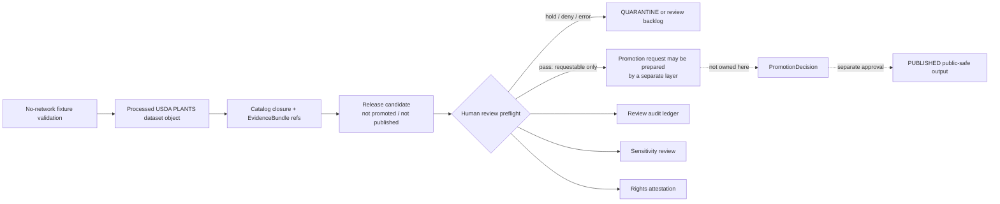

<!-- [KFM_META_BLOCK_V2]
doc_id: kfm://doc/TODO-uuid-usda-plants-human-review-preflight-layer
title: USDA PLANTS Human Review Preflight Layer
type: standard
version: v1
status: draft
owners: TODO: verify CODEOWNERS; adjacent USDA PLANTS README lists @bartytime4life
created: TODO-YYYY-MM-DD
updated: 2026-05-08
policy_label: public
related: [./README.md, ../../../../contracts/source/kansas_flora/usda_plants.md, ../../../../policy/flora/usda_plants_review.rego, ../../../../policy/flora/usda_plants_promotion_preflight.rego, ../../../../policy/flora/usda_plants_publication.rego]
tags: [kfm, flora, usda-plants, human-review, preflight, policy-gate]
notes: [doc_id, original created date, CODEOWNERS owner, and final policy label require repository verification before published status]
[/KFM_META_BLOCK_V2] -->

<a id="top"></a>

# USDA PLANTS Human Review Preflight Layer

Human-governed review artifacts and promotion-preflight eligibility for USDA PLANTS release candidates — never publication, never promotion, and never live source activation.


> [!IMPORTANT]
> **Status:** `draft`  
> **Path:** `docs/domains/flora/usda_plants/USDA_PLANTS_HUMAN_REVIEW_PREFLIGHT_LAYER.md`  
> **Authority level:** standard source-lane layer document  
> **Runtime claim:** this document does **not** prove workflow enforcement, human approval infrastructure, publication, promotion, public tiles, county geometry, API availability, or UI rendering.  
> **Core posture:** this layer may produce review and preflight artifacts only.

**Quick jumps:** [Purpose](#purpose) · [Repo fit](#repo-fit) · [Accepted inputs](#accepted-inputs) · [Exclusions](#exclusions) · [Lifecycle placement](#lifecycle-placement) · [Review packet model](#review-packet-model) · [Human decision model](#human-decision-model) · [Sensitivity review](#sensitivity-review) · [Rights attestation](#rights-attestation) · [Audit ledger](#audit-ledger) · [Promotion preflight](#promotion-preflight) · [Policy gates](#policy-gates) · [CI posture](#ci-posture) · [Definition of done](#definition-of-done)

---

## Purpose

This file defines the human-review and promotion-preflight layer for the USDA PLANTS source family inside the KFM Flora lane.

It sits after catalog/release-candidate closure and before any separate promotion request. Its job is to make a release candidate reviewable by a human, capture the review evidence, block unsafe automatic actions, and compute whether a future promotion request may be requested by a separate layer.

It does **not** promote. It does **not** publish. It does **not** certify that USDA PLANTS data is sufficient for exact occurrence, legal status, image reuse, rare-location release, or cultural-use claims.

### What this layer owns

| Surface | Responsibility | Truth label |
|---|---|---:|
| Human review decision | Capture reviewer identity, review scope, decision, blocked actions, and decision hash | **CONFIRMED doc role / policy-backed** |
| Sensitivity review | Confirm no precise coordinates, county geometry, raw source payload, rare-location detail, or restricted fields leak into review artifacts | **CONFIRMED doc role / policy-backed** |
| Rights attestation | Record source rights posture, citation obligations, image exclusions, and any rights-value mapping needed by policy | **CONFIRMED doc role / NEEDS VERIFICATION for source mapping** |
| Audit ledger | Hash review artifacts and link scope refs for auditability | **CONFIRMED doc role / policy-backed** |
| Promotion preflight report | Compute requestability for a later promotion action while keeping publication and promotion blocked | **CONFIRMED doc role / policy-backed** |
| Negative-path review | Preserve denial, abstention, quarantine, and hold states as legitimate outcomes | **CONFIRMED doctrine / PROPOSED artifacts** |

### What this layer does not own

This layer does not own source ingestion, live downloads, source registry admission, schema authority, release manifest creation, publication approval, public artifact publication, MapLibre rendering, Focus Mode answers, or rollback execution. It may reference those surfaces only as reviewed inputs or downstream blockers.

[Back to top](#top)

---

## Repo fit

`docs/domains/flora/usda_plants/` is the USDA PLANTS documentation sub-lane under the human-facing Flora control plane. This file belongs here because it explains review and preflight meaning. Executable policy, tests, receipts, proofs, release manifests, and lifecycle data remain in their responsibility roots.

| Direction | Path | Role | Status |
|---|---|---|---:|
| Source-lane README | [`./README.md`](./README.md) | Navigation, source boundary, layer map, lifecycle, reviewer checklist | **CONFIRMED adjacent doc** |
| Source contract | [`../../../../contracts/source/kansas_flora/usda_plants.md`](../../../../contracts/source/kansas_flora/usda_plants.md) | Human source-admission meaning and USDA PLANTS authority boundary | **CONFIRMED path** |
| Review policy | [`../../../../policy/flora/usda_plants_review.rego`](../../../../policy/flora/usda_plants_review.rego) | Denies review packets with publication/promotion claims, non-human approval, missing hashes, coordinate/geometry leaks, bad rights, or published refs | **CONFIRMED path** |
| Promotion preflight policy | [`../../../../policy/flora/usda_plants_promotion_preflight.rego`](../../../../policy/flora/usda_plants_promotion_preflight.rego) | Denies preflight packets that are publishable, promoted, missing hashes, missing human-approval requirement, missing pass gates, or auto-action blockers | **CONFIRMED path** |
| Publication policy | [`../../../../policy/flora/usda_plants_publication.rego`](../../../../policy/flora/usda_plants_publication.rego) | Separate controlled-publication gate; not owned here | **CONFIRMED path** |
| Review tests | [`../../../../policy/flora/usda_plants_review_test.rego`](../../../../policy/flora/usda_plants_review_test.rego) | Negative and positive policy tests for review behavior | **CONFIRMED path** |
| Preflight tests | [`../../../../policy/flora/usda_plants_promotion_preflight_test.rego`](../../../../policy/flora/usda_plants_promotion_preflight_test.rego) | Negative and positive policy tests for preflight behavior | **CONFIRMED path** |
| Lifecycle data | `../../../../data/{raw,work,quarantine,processed}/flora/usda_plants/` | Candidate source material and normalized source objects | **NEEDS VERIFICATION before claims** |
| Receipts and proofs | `../../../../data/receipts/flora/usda_plants/`, `../../../../data/proofs/flora/usda_plants/` | Process memory and proof objects | **NEEDS VERIFICATION before claims** |
| Release state | `../../../../release/` | Release manifests, promotion decisions, rollback cards, correction notices | **NEEDS VERIFICATION before claims** |

> [!NOTE]
> The source-lane README should list this file in its layer map and current-lane inventory if maintainers intend this layer to remain canonical. Do not treat this document’s presence as proof that the README inventory, CI, protected environments, or runtime gates are synchronized.

[Back to top](#top)

---

## Accepted inputs

Only review-safe, release-candidate-scoped material belongs in this layer.

| Input | Required shape | Why it belongs here |
|---|---|---|
| Release candidate reference | `release_candidate_ref` that does not point to `published/` | Identifies the candidate being reviewed without publishing it |
| Evidence closure references | EvidenceBundle, catalog, proof, receipt, and source-row refs | Lets reviewers inspect support without raw payload exposure |
| Human reviewer record | reviewer ID, reviewer type, timestamp, role/scope | Proves a human decision was made |
| Review decision artifact | decision, blocked actions, decision hash | Captures whether the candidate may proceed to a later promotion request |
| Sensitivity review artifact | leakage flags, sensitivity class, sensitivity hash | Blocks precise-location or geometry leakage |
| Rights attestation artifact | rights label, rights holder, citation note, image exclusion, attestation hash | Keeps rights and attribution visible before promotion |
| Audit ledger artifact | ledger entries, ledger hash, ref list | Makes review artifacts auditable |
| Preflight eligibility artifact | gate states, preflight hash, requestability | Computes future-promotion requestability without promoting |

### Accepted nearby, not here

| Material | Correct home | Reason |
|---|---|---|
| Source meaning contract | `contracts/source/kansas_flora/usda_plants.md` | Contracts define meaning and source authority boundaries |
| Rego policy logic | `policy/flora/usda_plants*.rego` | Policy-as-code belongs in `policy/` |
| Test fixtures | `tests/`, `fixtures/`, or policy test files | Tests prove behavior; docs do not replace tests |
| Review helper scripts | `tools/**/flora/*usda_plants*` | Tooling belongs under implementation roots |
| Release manifests | `release/` or repo-equivalent release root | Release objects are not documentation |
| Receipts and proofs | `data/receipts/`, `data/proofs/` | Process memory and proof objects remain separate |
| Published artifacts | `data/published/` or release-backed equivalent | Publication requires separate approval, manifest, correction path, and rollback target |

[Back to top](#top)

---

## Exclusions

Do **not** put these in this file or treat them as outputs of this layer:

- USDA downloads, CSVs, ZIPs, raw profile-page captures, or copied source payloads.
- Credentials, cookies, API keys, local environment files, or operator secrets.
- Exact rare-plant locations, precise coordinates, source geometries, county geometry outputs, or steward-only review data.
- Public map tiles, PMTiles archives, county geometry artifacts, MapLibre styles, or CDN deployment files.
- Release manifests, publication receipts, promotion decisions, rollback cards, or correction notices.
- A live source downloader, live scheduled publication, PR opener, PR merger, or public deployment workflow.
- Image/media files or image-rights claims.
- Legal protected-status claims based only on USDA PLANTS.
- Generated AI summaries that have not resolved to EvidenceBundles and policy outcomes.

> [!CAUTION]
> USDA PLANTS distribution context is not exact occurrence evidence. Review packets must preserve that distinction and deny any conversion from distribution context into precise public location.

[Back to top](#top)

---

## Lifecycle placement

USDA PLANTS material inherits KFM lifecycle law:

```text
RAW → WORK / QUARANTINE → PROCESSED → CATALOG / TRIPLET → PUBLISHED
```

This layer operates only in the review/preflight band after catalog/release-candidate closure and before any separate promotion request.



### Lifecycle rules

| Stage | Rule |
|---|---|
| Release candidate | Candidate must remain `not_promoted` and `not_published` |
| Review | Human reviewer must be recorded before `approved_for_preflight` |
| Sensitivity | Coordinate, geometry, county-geometry, rare-location, and restricted-field leakage block preflight |
| Rights | Plant-information rights, citation, image exclusions, and rights mapping must be explicit |
| Audit | Decision, sensitivity, rights, and ledger hashes must exist |
| Preflight | A passing report may make a later promotion request possible; it still blocks publication |
| Promotion | Owned by a separate promotion layer |
| Publication | Owned by a separate controlled-publication layer |
| Rollback | Public artifacts, if later produced elsewhere, require release hash, receipt hash, ledger hash, correction path, and rollback plan |

[Back to top](#top)

---

## Review packet model

The review packet is a **preflight artifact**, not a release artifact. The field names below are implementation-facing guidance aligned to the current USDA PLANTS review and preflight policy family.

> [!WARNING]
> This YAML is illustrative. Do not commit it as a fixture until the active schema home, required field names, and policy-value mapping are verified in the repository.

```yaml
kfm_meta_version: 2
source_id: usda_plants
domain: flora
layer: usda_plants_human_review_preflight
release_candidate_ref: data/catalog/flora/usda_plants/release_candidate/TODO.json

review_decision:
  publication_state: not_published
  promotion_state: not_promoted
  decision: approved_for_preflight
  reviewer:
    reviewer_id: TODO-human-reviewer-id
    reviewer_type: human
    reviewer_role: TODO-flora-steward-or-maintainer
    reviewed_at: TODO-ISO-8601
  scope_refs:
    - kfm://catalog/TODO
    - kfm://evidence-bundle/TODO
    - kfm://proof/TODO
    - kfm://receipt/TODO
  blocked_actions:
    - auto_merge
    - auto_pr
    - publish
    - promote
    - generate_county_geometry
    - generate_public_tiles
    - enable_live_fetch
  decision_hash: sha256:TODO

sensitivity_review:
  sensitivity:
    contains_precise_coordinates: false
    contains_county_geometry: false
    contains_raw_source_payload: false
    contains_restricted_fields: false
    contains_rare_location_detail: false
    contains_image_or_media_claims: false
    contains_cultural_or_tribal_plant_use_claims: false
  disposition: pass
  sensitivity_hash: sha256:TODO

rights_attestation:
  rights:
    license: "USDA / U.S. Public Domain"
    rightsHolder: "United States Department of Agriculture"
    policy_label: public
  rights_mapping_note: "NEEDS VERIFICATION: map official USDA/Data.gov rights metadata to repo policy literal before release use."
  citation_required: true
  image_use: excluded_by_default
  attestation_hash: sha256:TODO

audit_ledger:
  entries:
    - ref: data/catalog/flora/usda_plants/release_candidate/TODO.json
      role: release_candidate
      digest: sha256:TODO
    - ref: kfm://evidence-bundle/TODO
      role: evidence_closure
      digest: sha256:TODO
  ledger_hash: sha256:TODO

gates:
  publication: blocked
  promotion: blocked
  review_decision: pass
  sensitivity_review: pass
  rights_attestation: pass
  audit_ledger: pass

eligibility:
  eligible_for_publication: false
  eligible_to_request_promotion: true
  requires_additional_human_approval: true

preflight_hash: sha256:TODO
```

[Back to top](#top)

---

## Human decision model

Human review is a gate, not a rubber stamp. The reviewer must decide within the USDA PLANTS authority boundary.

| Decision | Meaning | Allowed next action | Still blocked |
|---|---|---|---|
| `approved_for_preflight` | Candidate can receive a preflight report | A separate promotion request may be prepared | Publication, promotion, auto-merge, auto-PR, public geometry, public tiles |
| `hold_for_review` | More evidence, rights, source-shape, or sensitivity work is needed | Return to reviewer queue or quarantine | Promotion and publication |
| `deny_preflight` | Candidate violates source boundary, policy, rights, or sensitivity obligations | Preserve denial artifact and audit ledger | Promotion and publication |
| `abstain_insufficient_evidence` | Evidence or citation support is insufficient to review safely | Require EvidenceBundle/source contract update | Promotion and publication |
| `error_invalid_packet` | Packet is malformed, missing hashes, or references unsafe lifecycle paths | Fix packet or quarantine | Promotion and publication |

A valid human decision must include:

- a human reviewer identity or steward role;
- a bounded review scope;
- a decision timestamp;
- blocked automatic actions;
- a decision hash;
- evidence and receipt references;
- an explicit statement that the candidate remains `not_promoted` and `not_published`.

[Back to top](#top)

---

## Sensitivity review

USDA PLANTS can support source-native plant identity, names, taxonomy context, checklist context, and broad distribution context. It must not become an exact occurrence source or rare-location release authority.

### Sensitivity blockers

| Check | Block condition | Required outcome |
|---|---|---|
| Precise coordinates | Any coordinate-like field, latitude/longitude pair, point geometry, or exact locality leaks into public-facing preflight artifacts | `DENY` / quarantine |
| County geometry | County boundary or derived geometry is embedded in review packet | `DENY` until separate geometry-publication layer approves |
| Raw/work/quarantine references | Packet exposes source payloads or internal lifecycle refs as public support | `DENY` |
| Rare-location context | Candidate implies exact rare/protected plant location from broad distribution context | `DENY` |
| Legal status | Candidate treats USDA PLANTS as legal protected-status authority | `ABSTAIN` / `DENY` |
| Image reuse | Candidate includes image/media reuse without image-specific rights | `DENY` |
| Cultural or tribal plant-use claims | Candidate includes cultural, tribal, or ethnobotanical material without steward-aware review | `REVIEW REQUIRED` / `DENY` |
| Stale or unmapped source terms | Rights, cadence, fields, or access path cannot be verified | `ABSTAIN` / `QUARANTINE` |

> [!TIP]
> A clean sensitivity review should be boring: no coordinates, no geometry, no raw payloads, no rare-location precision, no image-rights assumptions, and no cultural-use publication.

[Back to top](#top)

---

## Rights attestation

Rights attestation records the reviewer’s source-use judgment for a release candidate. It is not a legal memo and not a publication decision.

The current policy family expects rights fields that can be checked mechanically. Reviewers must keep three things separate:

1. USDA PLANTS plant-information posture.
2. Image/media reuse posture.
3. KFM public-release eligibility.

### Minimum rights fields

| Field | Required handling |
|---|---|
| `rights.license` | Must match the repo policy literal or a reviewed mapping approved by policy maintainers |
| `rights.rightsHolder` | Must identify the source rights holder expected by policy |
| `rights.policy_label` | Must remain `public` for this public source-lane review artifact |
| `citation_required` | Must be true for outward USDA PLANTS-derived claims |
| `citation_text` | Must include a PLANTS citation template with access date before release use |
| `image_use` | Must be `excluded_by_default` unless image-specific permission exists |
| `rights_mapping_note` | Required when official source metadata and repo policy literals differ |
| `attestation_hash` | Required for auditability |

> [!IMPORTANT]
> If official source metadata, repository policy literals, or source-contract language disagree, do not “smooth” the conflict. Record a rights-mapping note, keep promotion and publication blocked, and update policy/tests or the source contract through review.

### Citation template

Use the PLANTS citation template in outward documentation, EvidenceBundles, and release notes when PLANTS-derived plant information is used.

```text
USDA, NRCS. [YEAR]. The PLANTS Database (https://plants.usda.gov, accessed [DAY MONTH YEAR]).
National Plant Data Team, Greensboro, NC USA.
```

[Back to top](#top)

---

## Audit ledger

The review audit ledger keeps the human review process inspectable without turning review prose into truth.

### Required ledger properties

| Property | Rule |
|---|---|
| `ledger_hash` | Required; computed over the canonical review packet or repo-native canonicalization |
| Entry refs | Must point to release-candidate, evidence, catalog, proof, and receipt refs only |
| No published refs | Entries must not point into `published/` for this layer |
| No raw payloads | Entries must not embed source payloads, raw rows, or restricted fields |
| Decision linkage | Must link `decision_hash`, `sensitivity_hash`, and `attestation_hash` |
| Reproducibility | Must record enough refs and digests to reconstruct what was reviewed |
| Mutability | New review events append or supersede; do not silently overwrite prior review artifacts |

### Ledger entry example

```yaml
audit_ledger:
  ledger_id: kfm://audit-ledger/TODO
  layer: usda_plants_human_review_preflight
  entries:
    - ref: data/catalog/flora/usda_plants/release_candidate/TODO.json
      role: release_candidate
      digest: sha256:TODO
    - ref: kfm://evidence-bundle/TODO
      role: evidence_closure
      digest: sha256:TODO
    - ref: kfm://review-decision/TODO
      role: human_review_decision
      digest: sha256:TODO
  ledger_hash: sha256:TODO
```

[Back to top](#top)

---

## Promotion preflight

Promotion preflight answers one narrow question:

> Is this release candidate sufficiently reviewed to request a future promotion decision from a separate promotion layer?

It does **not** answer:

- whether the candidate is published;
- whether the candidate is promoted;
- whether public map artifacts may be generated;
- whether auto-merge or auto-PR may run;
- whether live USDA access may be enabled;
- whether exact occurrence or legal-status claims are supported.

### Preflight outcomes

| Outcome | Meaning | Next step |
|---|---|---|
| `PASS_REQUESTABLE` | Review, sensitivity, rights, audit, and hashes are sufficient for a separate promotion request | Prepare a promotion request in the owning layer |
| `HOLD` | One or more review gates need more work | Return to review queue |
| `DENY` | Packet violates authority, sensitivity, rights, or lifecycle boundaries | Preserve denial; quarantine or supersede candidate |
| `ABSTAIN` | Evidence, rights, or source mapping cannot be resolved | Resolve EvidenceBundle/source/rights gaps |
| `ERROR` | Packet shape is invalid or hashes are missing | Fix packet and rerun policy |

### Preflight invariants

A preflight packet may pass only when all of these remain true:

- `publication` gate is `blocked`;
- `promotion` gate is `blocked`;
- `eligible_for_publication` is `false`;
- `requires_additional_human_approval` is `true`;
- review, sensitivity, rights, and audit gates pass;
- `preflight_hash` exists;
- `release_candidate_ref` does not point to `published/`;
- `blocked_actions` include at least `auto_merge` and `auto_pr`.

[Back to top](#top)

---

## Policy gates

The Rego policy files are the executable gate surfaces. This document summarizes the intended meaning for maintainers and reviewers; it does not replace policy tests.

| Policy surface | Required behavior summarized here |
|---|---|
| `usda_plants_review.rego` | Deny if review claims publication or promotion, lacks blocked auto actions, allows non-human approval, misses decision/sensitivity/rights/ledger hashes, leaks coordinates or geometry, uses bad rights values, or references `published/` |
| `usda_plants_promotion_preflight.rego` | Deny if publication/promotion gates are not blocked, packet is eligible for publication, additional human approval is not required, hashes are missing, review/sensitivity/rights gates fail, ledger fails, published refs appear, or auto-action blockers are missing |
| `usda_plants_publication.rego` | Separate publication gate; publication requirements are intentionally out of scope for this preflight layer |
| `usda_plants_release.rego` | Separate release-candidate closure gate; this layer consumes release-candidate refs rather than creating release closure |
| `usda_plants_*geometry*.rego` | Separate future geometry-publication gate; this layer must not produce county geometry |
| `usda_plants_*deployment*.rego` | Separate static/external/tile deployment gate; this layer must not deploy public artifacts |

> [!WARNING]
> Policy files may exist without proving branch protection, protected environment enforcement, CI execution, or runtime policy enforcement. Treat enforcement as **NEEDS VERIFICATION** until workflow and test evidence are checked on the active branch.

[Back to top](#top)

---

## Optional reviewer-gated workflow

A future workflow may be useful only if it remains manual, no-network, no-publication, and no-promotion.

```yaml
# PSEUDOCODE ONLY — do not copy into .github/workflows without workflow review.
name: USDA PLANTS human review preflight

on:
  workflow_dispatch:
    inputs:
      release_candidate_ref:
        description: "Release candidate ref to review"
        required: true

permissions:
  contents: read

jobs:
  preflight:
    runs-on: ubuntu-latest
    steps:
      - uses: actions/checkout@PINNED_SHA_TODO

      - name: Validate no-network posture
        run: |
          grep -RInE 'curl|wget|requests.get|fetch\(' docs/domains/flora/usda_plants policy/flora tools 2>/dev/null || true

      - name: Run USDA PLANTS review policy tests
        run: |
          opa test policy/flora -run usda_plants_review
          opa test policy/flora -run usda_plants_promotion_preflight

      - name: Emit review-preflight artifacts only
        run: |
          echo "No publish. No promote. No auto PR. No auto merge. No county geometry. No tiles."
```

A real workflow must be reviewed for pinned actions, least privilege, artifact retention, secret exposure, branch/ruleset behavior, and rollback impact before use.

[Back to top](#top)

---

## CI posture

This layer is no-network by default.

### Local checks before stronger claims

```bash
git status --short
git branch --show-current || true

find docs/domains/flora/usda_plants -maxdepth 1 -type f | sort
sed -n '1,260p' docs/domains/flora/usda_plants/USDA_PLANTS_HUMAN_REVIEW_PREFLIGHT_LAYER.md

find policy/flora -maxdepth 1 -type f -name 'usda_plants*review*.rego' -o -name 'usda_plants*preflight*.rego' | sort
sed -n '1,220p' policy/flora/usda_plants_review.rego
sed -n '1,220p' policy/flora/usda_plants_promotion_preflight.rego
```

### Optional policy tests

```bash
# Run only if OPA is installed and repo test conventions confirm this command.
opa test policy/flora -run usda_plants_review
opa test policy/flora -run usda_plants_promotion_preflight
```

### Negative search

```bash
grep -RInE 'publish|promote|auto_merge|auto_pr|published/|coordinates|geometry|county geometry|live fetch|network' \
  docs/domains/flora/usda_plants \
  policy/flora \
  2>/dev/null || true
```

> [!CAUTION]
> A passing local command is not publication approval. Publication still requires a separate controlled-publication layer, release manifest closure, human approval, public-safe artifact hashes, correction path, and rollback target.

[Back to top](#top)

---

## Reviewer checklist

Before approving this layer or review artifacts that depend on it, verify:

- [ ] The review packet remains `not_published` and `not_promoted`.
- [ ] The reviewer is human, or the decision is blocked.
- [ ] `auto_merge` and `auto_pr` are blocked.
- [ ] Publication, promotion, public geometry generation, tile generation, and live-fetch enablement remain blocked.
- [ ] `decision_hash`, `sensitivity_hash`, `attestation_hash`, `ledger_hash`, and `preflight_hash` are present.
- [ ] No ref points to `published/`.
- [ ] No raw/work/quarantine source payload is exposed as public support.
- [ ] No precise coordinates or county geometry are embedded.
- [ ] USDA PLANTS distribution context is not treated as exact occurrence evidence.
- [ ] Legal protected-status claims from USDA PLANTS alone are denied or abstained.
- [ ] Image reuse is denied unless image-specific rights are verified elsewhere.
- [ ] Cultural or tribal plant-use material is held for steward-aware review.
- [ ] Rights field literals are mapped to official source metadata and repo policy expectations.
- [ ] EvidenceBundle refs resolve or the review abstains.
- [ ] Any future promotion is routed to a separate promotion layer.
- [ ] Any future publication is routed to a separate publication layer.

[Back to top](#top)

---

## Definition of done

This document is ready to move from `draft` to `review` when:

- [ ] `doc_id`, original `created` date, final `owners`, and `policy_label` are verified from repo metadata, CODEOWNERS, or steward registry.
- [ ] The USDA PLANTS README layer map and current-lane inventory are updated to include this layer, if maintainers keep it as canonical.
- [ ] Relative links are checked from `docs/domains/flora/usda_plants/`.
- [ ] Review and promotion-preflight Rego tests are present and runnable in the repo-native test environment.
- [ ] A positive preflight fixture proves `PASS_REQUESTABLE` without publication or promotion.
- [ ] Negative fixtures prove denial for non-human approval, missing hashes, coordinate leak, geometry leak, bad rights, published refs, auto-merge claims, and premature publication eligibility.
- [ ] Official USDA/Data.gov rights metadata is mapped to the repo policy literals or the policy/tests are updated through review.
- [ ] EvidenceBundle, receipt, proof, and release-candidate refs are resolved for at least one no-network fixture candidate.
- [ ] No text claims live ingestion, public publication, workflow enforcement, or runtime UI/API behavior without direct evidence.
- [ ] Rollback and correction obligations are linked to the separate publication layer.

[Back to top](#top)

---

## Failure and rollback

| Failure | Required response |
|---|---|
| Review packet missing hash | Mark packet invalid; rerun review generation |
| Non-human approval submitted as approval | Deny review packet; require human reviewer |
| Coordinate or geometry leak detected | Deny and quarantine; investigate upstream candidate |
| Rights mapping conflict found | Hold preflight; update rights mapping, policy, or source contract through review |
| Published ref appears in packet | Deny; preflight must operate before publication |
| Auto-merge or auto-PR not blocked | Deny; preflight cannot automate merge or PR opening |
| Candidate already promoted/published | Route to publication/correction/rollback layer; do not use this preflight layer |
| Public artifact was mistakenly produced elsewhere | Disable artifact route, open correction notice, and follow release rollback card |

Because this layer must not publish, most failures should be reversible by invalidating the review/preflight artifact and preserving the failed packet as audit evidence. Public rollback applies only if another layer already produced a public artifact.

[Back to top](#top)

---

## Future work

- Define or link a machine schema for `USDAPlantsHumanReviewPacket`.
- Define or link fixtures for valid and invalid review/preflight packets.
- Add reviewer-facing examples to the review console once the active UI path is verified.
- Add a release-candidate resolver that proves EvidenceBundle, receipt, proof, and catalog refs without exposing raw payloads.
- Resolve the rights value mapping between official source metadata and current Rego literals.
- Add an ADR or policy note if rights literals change.
- Add README inventory updates when this file becomes canonical.
- Add a separate promotion layer that consumes only passing preflight reports.
- Add a separate publication layer that consumes only promoted, sealed, public-safe packages.

[Back to top](#top)

---

## References

- [USDA PLANTS source-lane README](./README.md)
- [USDA PLANTS source contract](../../../../contracts/source/kansas_flora/usda_plants.md)
- [USDA PLANTS review policy](../../../../policy/flora/usda_plants_review.rego)
- [USDA PLANTS promotion preflight policy](../../../../policy/flora/usda_plants_promotion_preflight.rego)
- [USDA PLANTS publication policy](../../../../policy/flora/usda_plants_publication.rego)
- [USDA PLANTS landing][usda-plants-landing]
- [USDA PLANTS downloads][usda-plants-downloads]
- [Data.gov PLANTS dataset][datagov-plants]

[usda-plants-landing]: https://plants.sc.egov.usda.gov/home
[usda-plants-downloads]: https://plants.sc.egov.usda.gov/downloads
[datagov-plants]: https://catalog.data.gov/dataset/plant-list-of-accepted-nomenclature-taxonomy-and-symbols-plants-database
